# Kapittel 28: Mitsubishi motorvarianter og reservedelspraksis

## Kapittelrolle
Mitsubishi krever systematisk identifikasjon fordi samme motorfamilie kan finnes i flere marine installasjoner, effektnivåer og produksjonsperioder. En profesjonell medarbeider skal ikke bare finne en del som ligner, men dokumentere hvorfor den valgte delen passer til akkurat denne motoren.

## Læringsmål
Etter kapitlet skal deltakeren kunne:
- forklare hovedbegrepene innen reservedelsarbeid
- bruke serienummer, modellinformasjon og delnummer i praktisk reservedelsarbeid
- kommunisere trygt med kunde, verksted, lager og leverandør
- dokumentere beslutninger slik at andre kan etterprøve saken
- kjenne igjen vanlige feil og velge riktig neste handling

## English technical terminology
- **Base Engine:** engelsk fagterm som ofte brukes i kataloger, servicelitteratur, leverandørportaler og internasjonal kundedialog.
- **Marine Conversion:** engelsk fagterm som ofte brukes i kataloger, servicelitteratur, leverandørportaler og internasjonal kundedialog.
- **Engine Code:** engelsk fagterm som ofte brukes i kataloger, servicelitteratur, leverandørportaler og internasjonal kundedialog.
- **Serial Number:** engelsk fagterm som ofte brukes i kataloger, servicelitteratur, leverandørportaler og internasjonal kundedialog.
- **Application:** engelsk fagterm som ofte brukes i kataloger, servicelitteratur, leverandørportaler og internasjonal kundedialog.
- **Part Number:** engelsk fagterm som ofte brukes i kataloger, servicelitteratur, leverandørportaler og internasjonal kundedialog.
- **Supersession:** engelsk fagterm som ofte brukes i kataloger, servicelitteratur, leverandørportaler og internasjonal kundedialog.
- **Service Kit:** engelsk fagterm som ofte brukes i kataloger, servicelitteratur, leverandørportaler og internasjonal kundedialog.
- **Troubleshooting:** engelsk fagterm som ofte brukes i kataloger, servicelitteratur, leverandørportaler og internasjonal kundedialog.

## Hoveddiagram
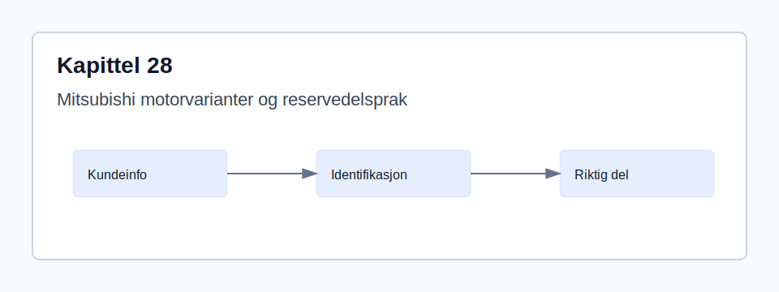

## Tekniske systemillustrasjoner
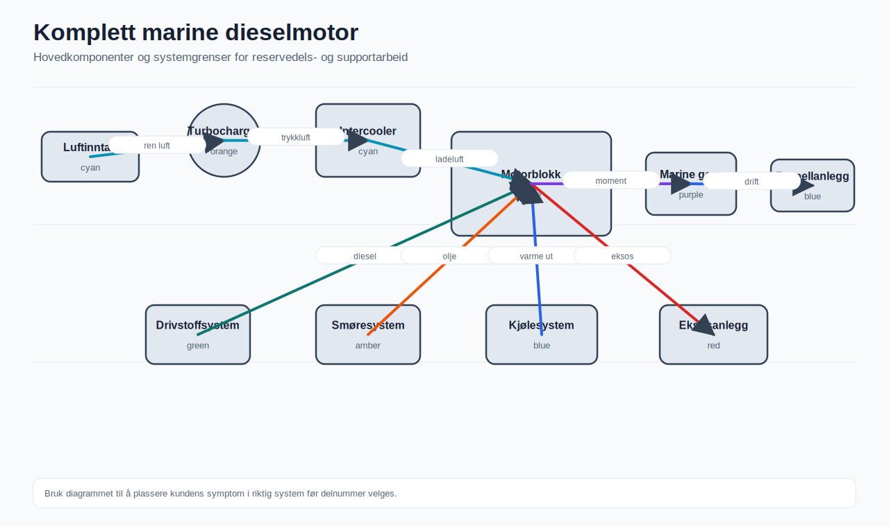

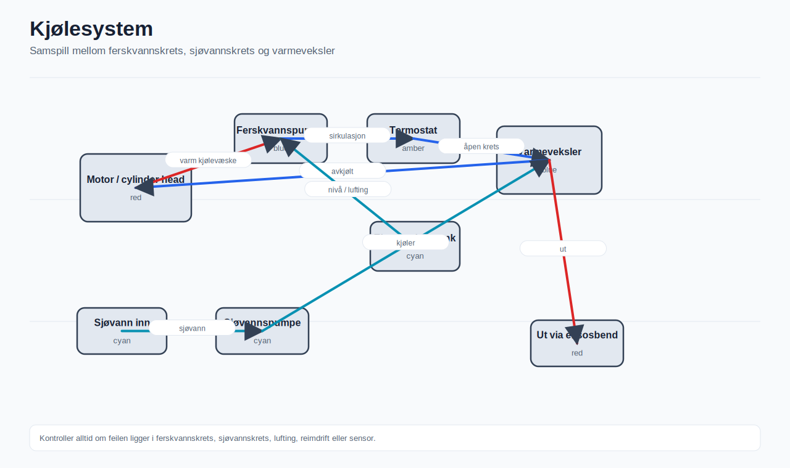

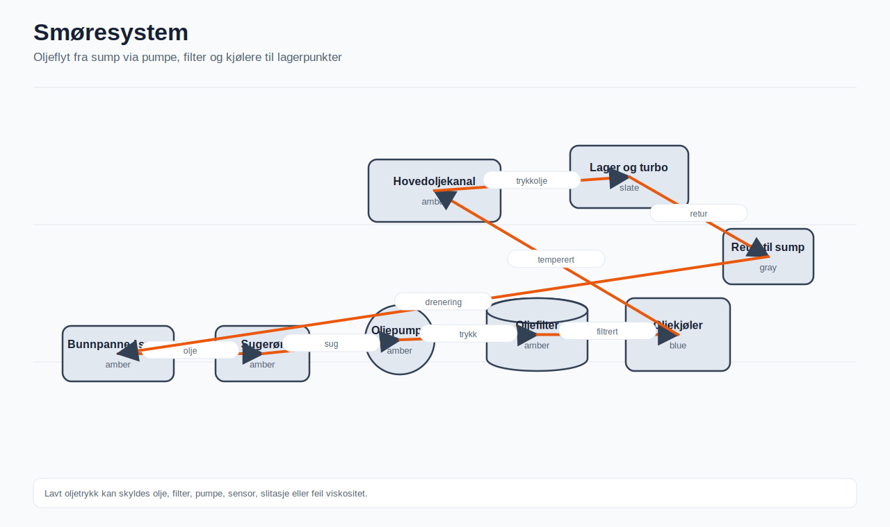

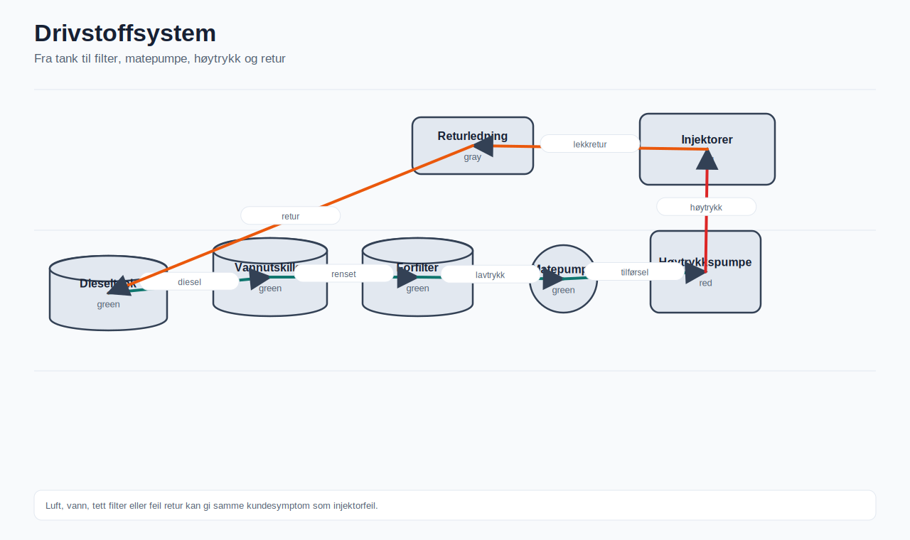

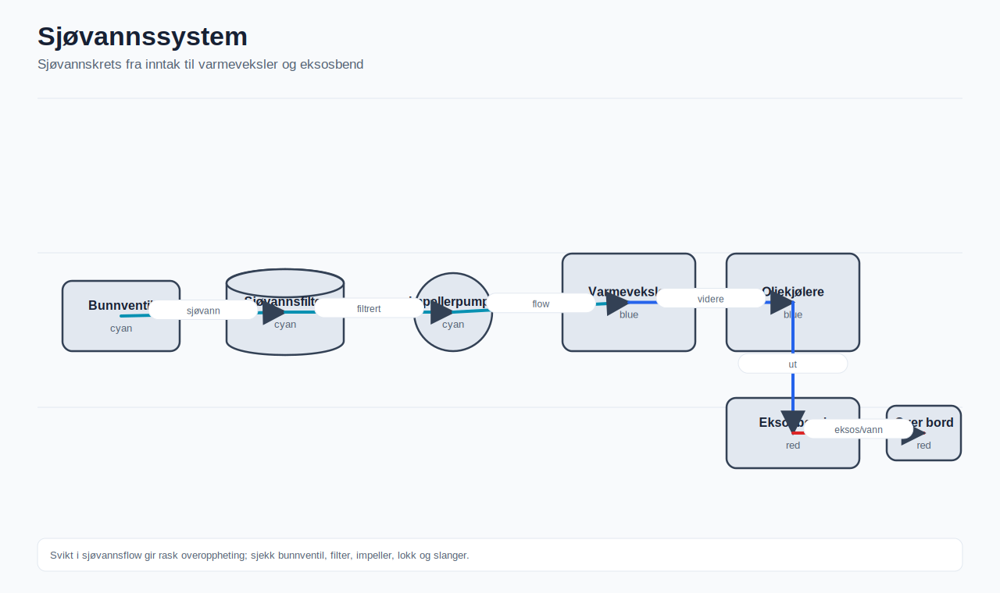

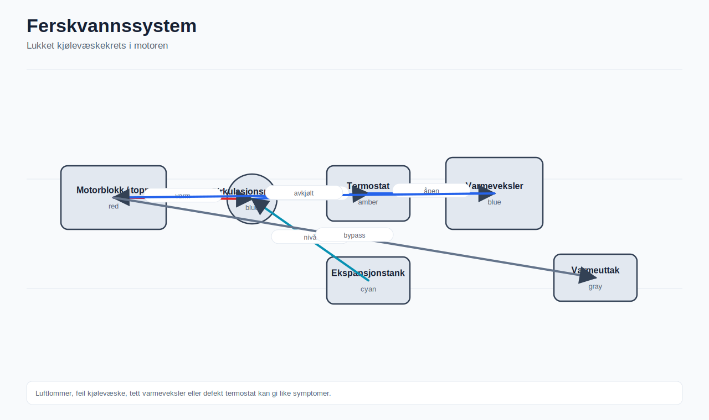

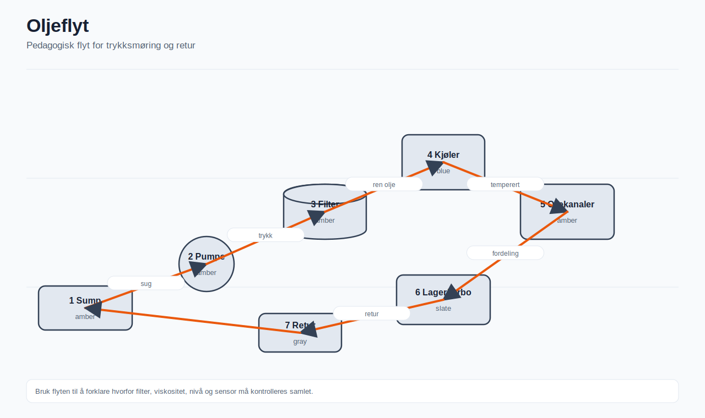

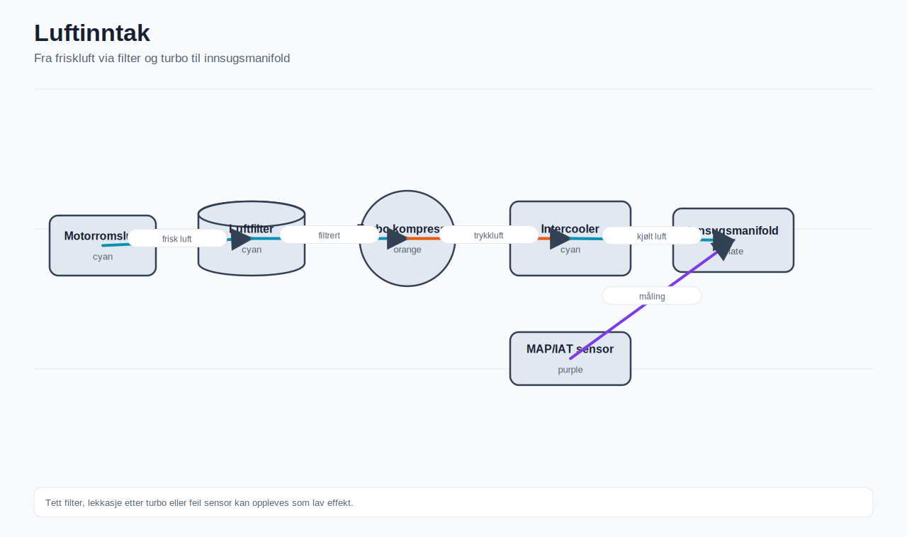

## Grundig forklaring
Hvordan kapitlets tema brukes i praktisk arbeid må forstås både teknisk og praktisk. I marine reservedeler er det sjelden nok å vite hva kunden kaller delen. Medarbeideren må forstå hvilken funksjon delen har, hvor den sitter, hvilken motorvariant den tilhører, og hva som skjer dersom feil del bestilles. Derfor skal tekniske data, kundens beskrivelse og dokumentert katalogoppslag alltid vurderes sammen.

En god sak har fire kjennetegn: den har tydelig identifikasjon, tydelig problem- eller delbeskrivelse, tydelig beslutningsgrunnlag og tydelig oppfølging. Dersom ett av disse punktene mangler, skal saken markeres som usikker før kunden får et bindende svar.

## Praktisk verkstedeksempel
Et verksted kontakter support fordi en Mitsubishi-motor skal klargjøres før avgang. De oppgir bare motormodell og et gammelt filter som eksempel. Riktig arbeidsmåte er å be om typeplate, bilde av eksisterende filter, driftstimer og om kunden ønsker enkeltfilter eller komplett servicekit. Når data er kontrollert, sendes et svar med korrekt delnummer, antall, leveringstid og forbehold om eventuelle erstatningsnummer.

## Kundesupporteksempel
Kunde: 'Jeg trenger en pumpe til Mitsubishi, helst i dag.' Profesjonelt svar: 'Jeg skal hjelpe deg raskt. For å unngå feil pumpe trenger jeg bilde av motorskiltet, bilde av pumpen montert og et nærbilde av eventuelt nummer på pumpen. Når jeg har dette, kontrollerer jeg riktig variant og gir deg lagerstatus og raskeste fraktalternativ.'

## Vanlige feil og årsaker
- kunde oppgir bare Mitsubishi-modell uten mariniseringsdata.
- feil sjøvannspumpe fordi motoren er konvertert av tredjepart.
- startproblem knyttet til gløding eller drivstofftilførsel.
- lekkasje i ettermontert kjølesystem.

## Feilsøkingsflyt
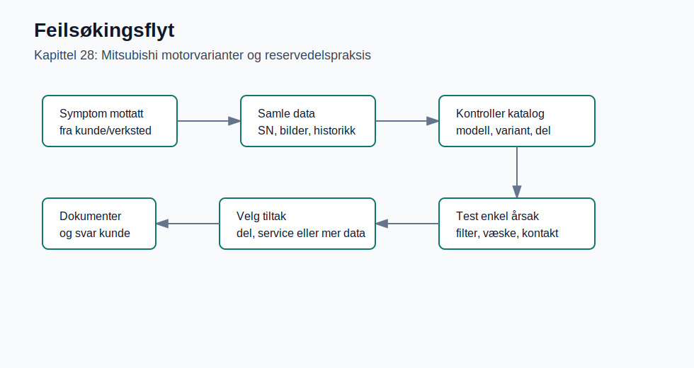

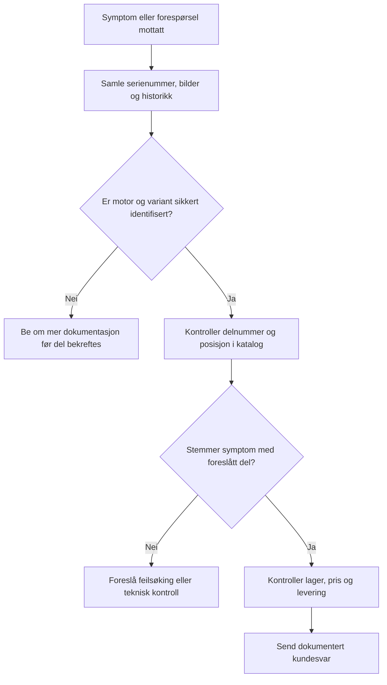

## Vedlikeholdsprosedyre
1. Avklar driftstimer, siste service og driftsmiljø.
2. Kontroller olje, filter, kjølevæske, sjøvannskrets, reimer, slanger og elektriske kontakter.
3. Sammenlign vedlikeholdsbehov med produsentens intervaller og faktisk bruk.
4. Anbefal servicekit når flere slitedeler bør skiftes samtidig.
5. Dokumenter hva som er anbefalt, hva kunden bestiller og eventuelle avvik fra normal prosedyre.

## Serienummeridentifikasjon
Mitsubishi kan være basismotor i flere marine løsninger. Identifiser motorkode og serienummer, men avklar også hvem som har marinisert motoren, fordi kjøling, eksos og pumper kan være levert av en annen aktør.

Minimumsdata bør være: fabrikat, modell, serienummer, eventuell product number/arrangement/CPL/motornummer, bilde av typeplate og bilde av motorens installasjon. Ved tvil skal saken stoppes for avklaring før del bekreftes.

## Reservedelsidentifikasjon
Delvalg må skille mellom Mitsubishi-basismotordeler og marine konverteringsdeler. Filtre, glødeplugger, dyser og interne motordeler følger ofte basismotor, mens sjøvannspumpe, eksos og varmeveksler kan være mariniseringsspesifikke.

Sjekk alltid om delnummeret gjelder enkeltkomponent, reparasjonssett, servicekit eller komplett enhet. Kontroller også om varen er høyre/venstre, gammel/ny type, standard/oversize eller knyttet til en bestemt produksjonsperiode.

## Bestillingsprosedyre
1. Opprett eller oppdater sak med kunde, fartøy, kontaktperson og tidsfrist.
2. Verifiser motoridentifikasjon og lagre bildedokumentasjon.
3. Finn korrekt delnummer i relevant katalog eller leverandørgrunnlag.
4. Kontroller supersession, antall, lagerstatus, pris, returvilkår og leveringstid.
5. Send ordrebekreftelse med delnummer, beskrivelse, antall, pris, levering og forbehold.
6. Følg opp leveransen til kunden har mottatt varen eller saken er lukket.

## Kvalitetspunkter før svar
- Har vi nok data til å gi et sikkert svar?
- Er delnummeret kontrollert mot riktig motorvariant?
- Er kundens tidsfrist realistisk med valgt fraktmåte?
- Er eventuelle forbehold skrevet tydelig?
- Kan en kollega forstå beslutningen ved å lese saken senere?

## Kapittelsammendrag
Hovedpoenget i kapittel 28 er at profesjonelt reservedelsarbeid krever struktur. Teknisk kunnskap, engelske fagtermer, praktisk feilsøking, dokumentasjon og kundedialog må henge sammen. Når medarbeideren jobber systematisk, reduseres feilbestillinger, kunden får bedre svar, og verkstedet kan planlegge arbeidet tryggere.

## Kryssreferanser
- For forrige tema, se kapittel 27: Volvo Penta serienummer, delvalg og servicekunnskap.
- For neste tema, se kapittel 29: Cummins identifikasjon og bestillingsveiledning.
- For grunnleggende identifikasjon, se kapittel 12 og 17.

## Fordypning for intern opplæring
Dette kapitlet skal brukes som arbeidsstandard, ikke bare som lesestoff. Når en ny medarbeider møter en sak om Mitsubishi, skal vedkommende trene på å gå rolig fra fakta til vurdering og deretter til handling. I en marinemotorforhandler er konsekvensen av en feil ofte større enn verdien av selve delen. En feil impeller, feil sensor, feil filterinnsats eller feil pakningssett kan føre til tapt verkstedtid, utsatt avgang, irritert kunde og i verste fall ny driftsstans. Derfor skal hver sak behandles som en teknisk beslutning med sporbar dokumentasjon.

I produsentdialog skal medarbeideren bruke produsentens egne betegnelser når de finnes: Base Engine, Engine Code, Serial Number, Marine Conversion, Application. Dette gir bedre presisjon overfor leverandør, reduserer risiko for misforståelser og gjør saken lettere å kontrollere senere.

Profesjonelt nivå i dette kapitlet betyr at medarbeideren kan arbeide sikkert med Mitsubishi-praksis. Før kunden får et bindende svar, skal opplysningene i saken kontrolleres mot motorens identitet, faktisk installasjon og relevant produsentterminologi. Det praktiske målet er ikke å finne et raskt nummer, men å kunne forklare hvorfor valgt del, kontrollpunkt eller kundesvar er riktig for akkurat denne motoren. Når informasjon mangler, skal medarbeideren beskrive hva som mangler, hvorfor det er nødvendig, og hvilket neste steg som bringer saken videre.

## Tekniske forklaringer
Teknisk forståelse i dette kapitlet skal bygges rundt engine model, serial number, mariniseringsleverandør, base engine og komponentleverandør. Medarbeideren må skille mellom synlig symptom, sannsynlig systemfeil og bestillbar komponent. En del kan se riktig ut på bilde, men likevel være feil dersom posisjon, variant, rating, kjøleroppsett, elektrisk plugg, monteringsside eller servicehistorikk ikke stemmer. Derfor skal teknisk vurdering alltid kobles til både funksjon og dokumentasjon: hva gjør komponenten, hvilket system påvirker den, og hvilken produsentkilde bekrefter at den passer.

I praksis betyr dette at tekniske data skal kobles til motorens faktiske installasjon. Marine motorer står ofte trangt, er utsatt for salt, vibrasjon, fukt og ujevnt belastningsmønster, og de kan være bygget om gjennom mange år. En motor kan ha original kjøler, ettermontert eksosbend, alternativ dynamo, endret filterbrakett eller annen sjøvannspumpe enn standard. Slike forhold gjør at delidentifikasjon må bygge på både produsentdata og synlig dokumentasjon fra motoren.

Produsentterminologi er en del av den tekniske forståelsen. Bruk uttrykk som Base Engine, Engine Code, Serial Number, Marine Conversion, Application, Parts List når de er relevante. Ikke oversett dem på en måte som fjerner presisjon. Skriv for eksempel «Engine Serial Number (ESN)» første gang og deretter «ESN» i saken dersom produsenten bruker dette. Skriv «Arrangement Number» når CAT-data krever det, «Product Number» når Volvo Penta bruker det, «CPL» når Cummins-konfigurasjon må kontrolleres, og «Model Code» når Yanmar-identifikasjon bygger på modellkode. Dette gjør dialogen med internasjonale leverandører mer presis.

## Illustrasjonsforslag
- Oversiktsdiagram som viser hvor Mitsubishi passer inn i total arbeidsflyt fra kundeforespørsel til levert del.
- Nærbilde av typeplate/motorskilt med markering av serienummer, motornummer, modell og eventuell variantkode.
- Sprengskisse med markert posisjon, delnummer, antall per motor og mulige alternative versjoner.
- Feilsøkingsflyt med beslutningspunkter: mangler data, stemmer symptom, kreves mer teknisk kontroll, kan ordre bekreftes.
- Sammenligningsbilde av gammel og ny del der forskjell i tilkobling, side, lengde eller sensorplugg er markert.

## Virkelige verkstedseksempler
Eksempel 1: Et verksted står med en demontert komponent på benken og kunden venter på avklaring før fartøyet kan settes tilbake i drift. Verkstedet sender et nærbilde av delen, men ingen motorplate. En uerfaren medarbeider kan bli fristet til å søke på nummeret som står på støpegodset. En profesjonell medarbeider svarer at støpenummer ikke nødvendigvis er bestillbart delnummer, ber om bilde av typeplate, oversiktsbilde av motoren og bilde av monteringsstedet, og forklarer at dette hindrer feilbestilling. Når informasjonen kommer, kontrolleres delnummer mot sprengskisse, posisjon og antall. Først da gis pris og leveringstid.

Eksempel 2: En kunde ringer sent på dagen og sier at motoren har høy temperatur etter service. Kunden ønsker ny termostat. Medarbeideren skal ikke automatisk konkludere med termostatfeil. Spørsmålene bør avklare om impeller er byttet, om sjøvannsfilteret er rent, om kjølevæskenivået er riktig, om alarmen kommer ved tomgang eller belastning, og om det finnes lekkasje rundt varmeveksler eller slanger. Dersom kunden likevel vil bestille termostat, dokumenteres at feilsøking er anbefalt, og delnummer kontrolleres mot serienummer før ordre.

Eksempel 3: En intern selger mottar en gammel faktura med et delnummer som ikke lenger finnes. Riktig prosess er å kontrollere supersession, se om ny del krever tilhørende pakning, boltsett eller adapter, og notere både gammelt og nytt nummer i saken. Kunden skal få vite at delen er erstattet, hva som leveres, og om det finnes monteringsforbehold.

## Reservedelsidentifisering i praksis
Reservedelsidentifisering skal følge en fast rekkefølge. Først kontrolleres motorens identitet. Deretter kontrolleres delens system: drivstoff, luft, kjøling, smøring, eksos, elektrisk eller mekanisk kraftoverføring. Så kontrolleres posisjon i sprengskisse eller parts list. Til slutt kontrolleres antall, variant, supersession og leveringsstatus. Denne rekkefølgen hindrer at medarbeideren hopper direkte fra kundens ord til et tilfeldig delnummer.

Når en del har synlig nummer, må nummeret tolkes riktig. Mange komponenter har produksjonsnummer, støpenummer, leverandørnummer eller revisjonskode som ikke er det samme som bestillbart part number. Et filter kan ha nummer fra filterprodusent, men motorprodusentens parts catalogue kan bruke et annet nummer. En pumpe kan ha nummer på lokk, hus og komplett enhet. Spør derfor alltid: gjelder nummeret komplett del, reparasjonssett, underkomponent eller produsentens råkomponent?

## Serienummer og motornummer
Serienummer og motornummer er grunnlaget for korrekt katalogoppslag. Be kunden sende bilde av typeplate eller dataplate. Dersom kunden skriver nummeret manuelt, skal nummeret likevel kontrolleres mot bilde når det er mulig. Noter hele nummeret, inkludert prefiks, suffiks, bindestrek, mellomrom og eventuelle bokstaver. På enkelte produsenter kan små forskjeller peke til forskjellig produksjonsperiode, rating eller konfigurasjon.

Bruk motornummer sammen med modell, variant og applikasjon. En motor som driver generator kan ha andre deler enn en fremdriftsmotor. En motor i yrkesbåt kan ha annen rating enn samme motor i fritidsbåt. En eldre motor kan være bygget om med ny dynamo, annen sjøvannspumpe eller uoriginal filterbrakett. Dersom typeplate mangler, bygg identifikasjonen gjennom flere kilder: servicebok, tidligere faktura, bilder av motorens sider, nummer på pumpe, filter, turbo og gear, samt opplysninger om fartøy og produksjonsår.

## Feilsøking steg for steg
1. Definer symptomet med kundens egne ord og skriv det i saken. Skill mellom «kunden ønsker del» og «kunden beskriver feil».
2. Avklar når feilen oppstår: start, tomgang, belastning, marsjfart, varm motor, kald motor eller etter nylig service.
3. Kontroller grunnleggende forhold: væskenivå, filter, luft i drivstoff, sjøvannsstrøm, reimer, elektriske kontakter, sikringer og synlige lekkasjer.
4. Knytt symptomet til system: lav effekt peker ofte mot luft/drivstoff/eksos, høy temperatur mot kjøling, lavt oljetrykk mot smøring/sensor, startproblem mot batteri/starter/gløding/drivstoff.
5. Be om bilder eller måledata dersom symptomet ikke kan kobles sikkert til en del. Dette kan være bilde av alarmdisplay, trykkmåling, temperaturmåling eller bilde av montert komponent.
6. Kontroller relevant delnummer mot serienummer og variant. Dersom flere alternativer finnes, forklar kunden hva som skiller dem.
7. Dokumenter anbefalt tiltak, usikkerhet og eventuelle forbehold før ordre bekreftes.

## Vedlikehold
Vedlikehold skal vurderes mot driftstimer, produsentens maintenance schedule og faktisk driftsmiljø. Marine motorer som går korte turer, mye tomgang eller i salt miljø kan trenge hyppigere kontroll enn standard intervall antyder. Nye medarbeidere skal lære å spørre om siste service, hvilke filter som ble byttet, hvilken olje som ble brukt, om impeller er kontrollert, og om kjølevæske eller anoder er byttet etter plan.

En god vedlikeholdsanbefaling er konkret. I stedet for å skrive «ta service», bør medarbeideren foreslå relevante deler: olje- og drivstoffilter, luftfilter, impeller, reim, pakninger, anoder, kjølevæske og eventuelt servicekit. Dersom kunden har ukjent servicehistorikk, bør komplett servicekit vurderes. Dersom kunden har hatt overoppheting, bør sjøvannskrets og varmeveksler kontrolleres før bare én komponent byttes.

## Vanlige feil
- Serienummer leses feil fordi et tegn forveksles, for eksempel O/0 eller I/1.
- Kunden oppgir modellnavn, men ikke variant, rating eller applikasjon.
- Del velges ut fra bilde alene uten kontroll mot sprengskisse eller produsentkatalog.
- Supersession aksepteres uten å kontrollere om ny del krever tilbehør, pakning eller ombygging.
- Hastepress gjør at leveringsløfte gis før lagerstatus og fraktmulighet er bekreftet.
- Saksnotat mangler grunnlaget for beslutningen, slik at kollega ikke kan etterprøve valget.

## Kontrollspørsmål
- Hva er den viktigste tekniske risikoen i en sak som gjelder Mitsubishi?
- Hvilke opplysninger må dokumenteres før bindende delnummer bekreftes?
- Hvordan forklarer du kunden hvorfor bilde av typeplate er nødvendig?
- Når bør du stoppe en ordre og be om mer dokumentasjon?
- Hvilke engelske produsentuttrykk bør du kunne bruke i denne typen sak?
- Hvordan dokumenterer du at et delnummer er erstattet av et nytt nummer?

## Praktisk sjekkliste for medarbeider
- Les saken som om en kollega skal overta den i morgen.
- Kontroller at motoridentifikasjon er dokumentert med bilde eller sikker kilde.
- Sjekk at delnummeret er knyttet til riktig posisjon i katalogen.
- Skriv tydelig om kunden har bedt om enkeltkomponent, servicekit eller komplett enhet.
- Noter om varen er spesialbestilling, utgått, erstattet eller ikke returbar.
- Send kundesvar med neste steg, ikke bare et løst delnummer.

## Kapittelspesifikk systemforståelse
For dette kapitlet er kjernen å forstå Mitsubishi som basismotor og mariniserte installasjoner. Medarbeideren skal kunne forklare dette med praktiske ord til både kunde og kollega. Det betyr at teknisk teori må kobles til konkrete handlinger: hvilke data skal innhentes, hvilke komponenter kan være berørt, hvilken produsentterminologi skal brukes, og hva må dokumenteres før saken kan gå videre. Skill alltid mellom Mitsubishi-basismotordeler og deler levert av mariniseringsleverandør.

Når systemet vurderes, skal medarbeideren først plassere problemet i riktig teknisk sammenheng. Dersom kunden beskriver en alarm, må man finne ut om alarmen kommer fra reelt mekanisk avvik, elektrisk sensorfeil, feil etter service eller feil tolkning av instrumentet. Dersom kunden beskriver en del, må man avklare om kunden mener komplett enhet, servicekit, reparasjonssett eller enkeltkomponent. Dersom kunden beskriver motoren med vanlig navn, må man kontrollere om produsenten bruker mer presise begreper i katalogen.

## Komponentoversikt og arbeidsgrense
Relevante komponenter og opplysninger i dette kapitlet omfatter: engine code, serial number, base engine, marine conversion, injection pump, glow plug, heat exchanger og raw water pump. Listen er ikke ment som en erstatning for produsentens parts catalogue, men som en praktisk påminnelse om hva nye medarbeidere skal tenke på før de søker del. I interne saker skal komponentnavn skrives så presist som mulig. Bruk for eksempel «sjøvannspumpe / raw water pump» i stedet for bare «pumpe» når funksjonen er kjent, og «varmeveksler / heat exchanger» i stedet for bare «kjøler» når det er den komponenten saken gjelder.

Arbeidsgrensen for en reservedelsmedarbeider er også viktig. Medarbeideren skal ikke overta mekanikerens ansvar for demontering, måling eller diagnose på motoren, men skal kunne stille riktige spørsmål og foreslå riktig dokumentasjon. Når en sak går fra enkel delidentifikasjon til teknisk diagnose, skal dette markeres i saken. Da kan verksted, teknisk ansvarlig eller leverandør involveres med et klart spørsmål og et ryddig faktagrunnlag.

## Praktisk beslutningsregel
Bruk denne regelen i alle saker knyttet til kapitlet: Hvis motoridentifikasjon, komponentposisjon eller symptom ikke er sikkert nok dokumentert, skal medarbeideren ikke gi bindende delbekreftelse. Kunden kan få et foreløpig svar, men svaret må inneholde hva som mangler, hvorfor det mangler, og hva som skjer når informasjonen er mottatt. Dette er ikke treg service; det er profesjonell risikokontroll.

## Målrettet fordypning kapittel 21-30
### Mitsubishi: basismotor og marine conversion
Mitsubishi-saker krever særlig oppmerksomhet fordi motoren ofte kan være basismotor i en mariniseringsløsning. Engine code og serial number identifiserer grunnmotoren, men raw water pump, heat exchanger, exhaust manifold, brackets og enkelte serviceoppsett kan være levert av mariniseringsleverandør. Spør derfor alltid om hvem som har levert marine conversion dersom saken gjelder kjøling, eksos eller installasjonsdeler.

Deler som glow plugs, enkelte gaskets, injectors og interne motorkomponenter kan ofte knyttes til basismotoren, mens sjøvannspumpe og varmeveksler ikke nødvendigvis følger Mitsubishi-katalogen. Ved verkstedcase med startproblem bør batteri, starter, glødesystem, fuel supply og luft i drivstoff vurderes. Ved feil del skal man kontrollere om gammel del er original Mitsubishi, mariniseringsdel eller ettermarkedskomponent.

### Praktisk anvendelse i opplæring
Bruk kapitlet som caseøvelse der deltakeren skal skrive et kundesvar, identifisere nødvendige produsentdata og velge neste tekniske kontrollpunkt. Deltakeren skal også forklare hva som kan besvares av reservedelsavdelingen, og hva som må avklares av verksted, teknisk ansvarlig eller leverandør. Målet er at medarbeideren kan arbeide raskt, men fortsatt med sporbarhet og korrekt produsentterminologi.

## Realistisk opplæring i praksis
### Verkstedhistorie
En typisk sak i dette temaet starter med base engine og mariniseringsdel blandes. Verkstedet trenger et raskt svar, men den erfarne medarbeideren stopper opp og spør først: hva vet vi sikkert, hva antar vi, og hva kan gi følgeskade hvis vi tar feil? I praksis betyr det at modell, serienummer og marinisering må kobles til bilde, serienummer, komponentposisjon og kundens symptom før saken lukkes. Historien skal brukes i opplæring som en øvelse i å skrive et kort saksnotat: observasjon, vurdering, neste handling og forbehold.

### Kundehistorie
Kunden beskriver ofte problemet med driftsspråk: «motoren går tungt», «alarm kommer etter ti minutter», «jeg trenger den samme delen som sist» eller «båten skal ut i morgen». En profesjonell respons er rolig og konkret: bekreft behovet, forklar hvorfor identifikasjon trengs, be om riktig dokumentasjon og gi et realistisk tidspunkt for neste svar. Ikke korriger kunden unødvendig; oversett kundens språk til teknisk språk i saken.

### Typiske feil nye ansatte gjør
- søker på første synlige nummer uten å avklare om det er støpenummer, leverandørnummer eller bestillbart part number.
- lover levering før lagerstatus, frakt og returvilkår er kontrollert.
- antar at tidligere faktura alltid gjelder samme motorvariant.
- blander symptom og årsak, spesielt ved varme, lav effekt, startproblem og alarm.
- skriver for korte notater slik at kollega ikke kan forstå hvorfor valget ble tatt.

### Tips fra erfarne mekanikere og reservedelsselgere
- Se alltid etter systemet rundt delen: slanger, braketter, sensorer, reimer, kjølere og tilkoblinger forteller ofte mer enn delen alene.
- Still ett presist spørsmål om gangen når kunden er stresset; mange dårlige svar kommer av for lange spørsmålslister.
- Sammenlign gammel og ny del mot funksjon, ikke bare form. Riktig del skal passe, men også løse riktig problem.
- En erfaren reservedelsselger tenker i risiko: Hva er billigst å avklare nå, og hva blir dyrt hvis vi hopper over det?

### Vanlige kundespørsmål
| Spørsmål fra kunde | Profesjonelt svar |
|---|---|
| «Kan du bare sende samme del som sist?» | «Ja, hvis vi først bekrefter at det gjelder samme motor, samme posisjon og ingen supersession siden sist.» |
| «Holder det med bilde?» | «Bilde hjelper, men vi trenger også motoridentitet for å sikre variant og delnummer.» |
| «Hvorfor tar dette tid?» | «Fordi feil del kan gi ny driftsstans. Vi kontrollerer grunnlaget før vi lover levering.» |

### Beslutningstre for saken
| Trinn | Spørsmål | Handling |
|---|---|---|
| 1 | Er motoridentitet dokumentert med bilde eller sikker historikk? | Hvis nei: be om typeplate/dataplate eller alternativ dokumentasjon. |
| 2 | Er komponentens funksjon og posisjon kjent? | Hvis nei: be om oversiktsbilde og bilde av monteringssted. |
| 3 | Stemmer kundens symptom med delen som ønskes? | Hvis nei: anbefal feilsøking før del bestilles. |
| 4 | Finnes det supersession, kit eller variantvalg? | Kontroller produsentkilde og skriv forbehold i saken. |
| 5 | Kan pris, levering og returvilkår bekreftes? | Send dokumentert svar med neste steg og tydelig gyldighet. |

### Rask oppslagstabell
| Situasjon | Kontroller først | Vanlig fallgruve |
|---|---|---|
| Hasteordre | sikker motor-ID, lager, fraktfrist | levering loves før teknisk kontroll |
| Del fra bilde | posisjon, skala, tilkoblinger, nummer | bilde brukes som eneste beslutningsgrunnlag |
| Gammelt delnummer | supersession og kitinnhold | ny del krever ekstra pakning eller adapter |
| Uklart symptom | driftssituasjon, alarm, siste service | symptom blir tolket som sikker komponentfeil |

### Praktisk sjekkliste og inspeksjonsrutine
- Start med motoridentitet: fabrikat, modell, serienummer, variant, applikasjon og bilde av skilt.
- Kontroller området rundt komponenten: lekkasje, korrosjon, knekte fester, slitasje, varmemerker og uoriginale endringer.
- Spør om siste vedlikehold: olje, filter, impeller, reimer, kjølevæske, anoder og drivstoffilter.
- Noter driftstype: fritidsbruk, yrkesbruk, generator, fremdrift, tomgangsdrift eller langvarig høy belastning.
- Avklar om saken gjelder akutt drift, planlagt service, reklamasjon eller lagerpåfyll.

### Generelle vedlikeholdsintervaller som opplæringspunkt
| Kontrollpunkt | Typisk vurdering i opplæring | Må verifiseres |
|---|---|---|
| Olje og oljefilter | ofte basert på timer og kalender | produsentens maintenance schedule |
| Drivstoffilter/vannutskiller | hyppigere ved dårlig drivstoff eller sesongstart | motor- og filterspesifikasjon |
| Impeller og sjøvannskrets | kontrolleres særlig før sesong og etter varmgang | produsentens intervall og installasjon |
| Reimer, slanger og klemmer | visuell kontroll ved service og feilsøking | dimensjon, stramming og delnummer |

### Produsentverifikasjon
Mitsubishi-data må kontrolleres mot både base engine og mariniseringsleverandør der dette er relevant. Marker tydelig i saken når svaret bygger på antakelse, eldre historikk, bilde uten motor-ID eller generell erfaring. Intervaller i tabellen er generelle opplæringspunkter. Faktiske intervaller styres av produsent, motorvariant, driftstimer, kalenderkrav, belastning og miljø.

## Produsentverifikasjon og faglig forbehold
For Mitsubishi skal engine model, serial number, mariniseringsleverandør, base engine-data og komponentleverandør kontrolleres mot relevant produsent- eller leverandørdokumentasjon. Ikke forutsett at industrimotor og marinemotor bruker samme del. Marker saken internt dersom opplysningen bygger på antakelse, eldre historikk eller bilde uten bekreftet motoridentitet.

## Quiz med fasit
1. Hvilke tekniske data bør alltid samles før en del bekreftes?
2. Hvorfor er engelsk terminologi viktig i marine reservedeler?
3. Hva bør gjøres dersom kunden bare sender et bilde av delen?
4. Hvilke punkter bør kontrolleres før ordrebekreftelse sendes?
5. Hvorfor skal feilsøking dokumenteres, selv når kunden allerede ber om en bestemt del?

### Svar
1. Fabrikat, modell, serienummer, variantdata, bilde av typeplate, delnummer, posisjon og kundens symptombeskrivelse.
2. Fordi kataloger, portaler, servicemanualer og leverandørdialog ofte bruker engelske begreper som må forstås presist.
3. Be om serienummer, oversiktsbilde av motoren og eventuelle nummer på delen; bildet brukes som støtte, ikke eneste grunnlag.
4. Delnummer, antall, variant, pris, lagerstatus, leveringstid, frakt, returvilkår og eventuelle forbehold.
5. Fordi symptomet kan ha flere årsaker, og dokumentasjon viser hvorfor anbefalingen ble gitt.
