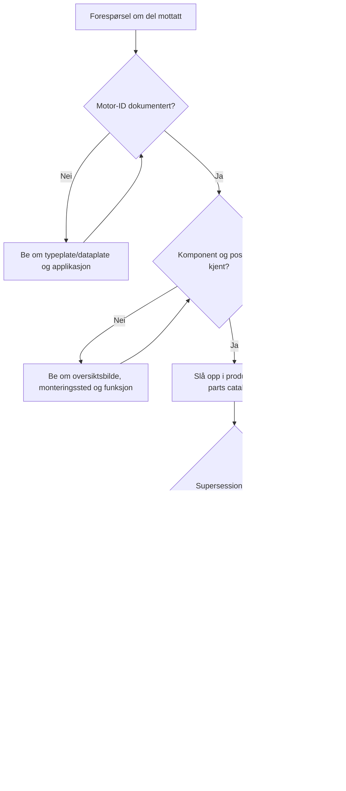

# Identifisering av reservedeler

## Formål
Dette beslutningstreet brukes som mentorstøtte for nye ansatte. Det skal hjelpe medarbeideren å stoppe usikre saker før feil del, feil løfte eller feil diagnose gis.

## Produsentverifikasjon
Alle delnumre, garantikrav, intervaller og tekniske grenseverdier skal kontrolleres mot offisiell produsentdokumentasjon.
