# Kapittel 1: Grunnleggende marine dieselmotorer

## Kapittelrolle
Dette kapitlet gir en grundig praktisk innføring i motorprinsipper. Temaet er viktig fordi reservedelsarbeid i marine miljøer kombinerer teknisk forståelse, presis kundedialog, dokumentert saksbehandling og realistisk leveranseoppfølging. Målet er at en ny medarbeider skal kunne bruke kunnskapen direkte i arbeid med verksted, kunde, lager og leverandør.

## Læringsmål
Etter kapitlet skal deltakeren kunne:
- forklare hovedbegrepene innen motorprinsipper
- bruke serienummer, modellinformasjon og delnummer i praktisk reservedelsarbeid
- kommunisere trygt med kunde, verksted, lager og leverandør
- dokumentere beslutninger slik at andre kan etterprøve saken
- kjenne igjen vanlige feil og velge riktig neste handling

## English technical terminology
- **Serial Number:** engelsk fagterm som ofte brukes i kataloger, servicelitteratur, leverandørportaler og internasjonal kundedialog.
- **Part Number:** engelsk fagterm som ofte brukes i kataloger, servicelitteratur, leverandørportaler og internasjonal kundedialog.
- **Engine Model:** engelsk fagterm som ofte brukes i kataloger, servicelitteratur, leverandørportaler og internasjonal kundedialog.
- **Variant:** engelsk fagterm som ofte brukes i kataloger, servicelitteratur, leverandørportaler og internasjonal kundedialog.
- **Service Kit:** engelsk fagterm som ofte brukes i kataloger, servicelitteratur, leverandørportaler og internasjonal kundedialog.
- **Troubleshooting:** engelsk fagterm som ofte brukes i kataloger, servicelitteratur, leverandørportaler og internasjonal kundedialog.
- **Maintenance:** engelsk fagterm som ofte brukes i kataloger, servicelitteratur, leverandørportaler og internasjonal kundedialog.
- **Ordering Procedure:** engelsk fagterm som ofte brukes i kataloger, servicelitteratur, leverandørportaler og internasjonal kundedialog.
- **Supersession:** engelsk fagterm som ofte brukes i kataloger, servicelitteratur, leverandørportaler og internasjonal kundedialog.
- **Technical Support:** engelsk fagterm som ofte brukes i kataloger, servicelitteratur, leverandørportaler og internasjonal kundedialog.

## Hoveddiagram

## Tekniske systemillustrasjoner

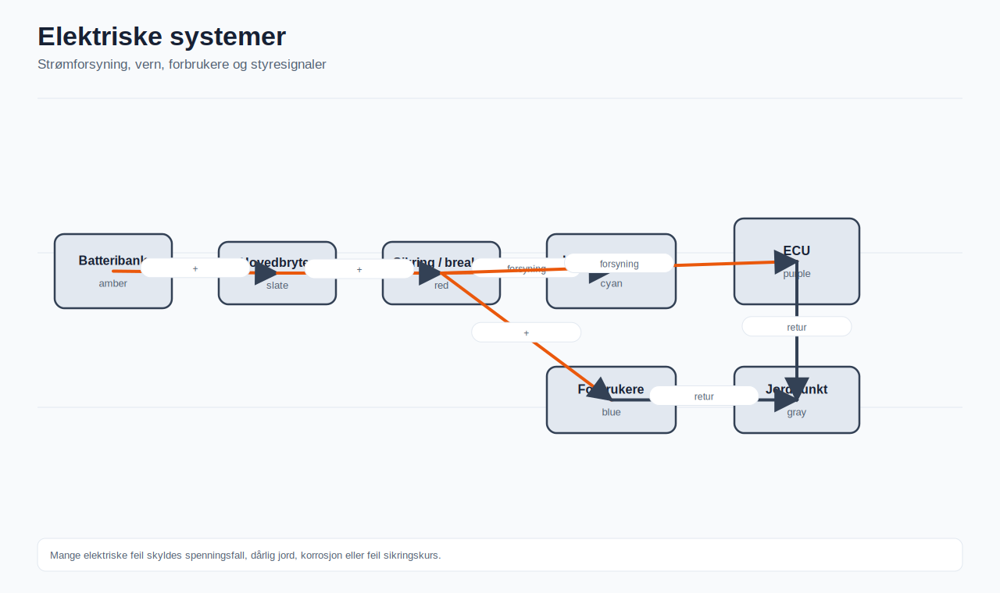

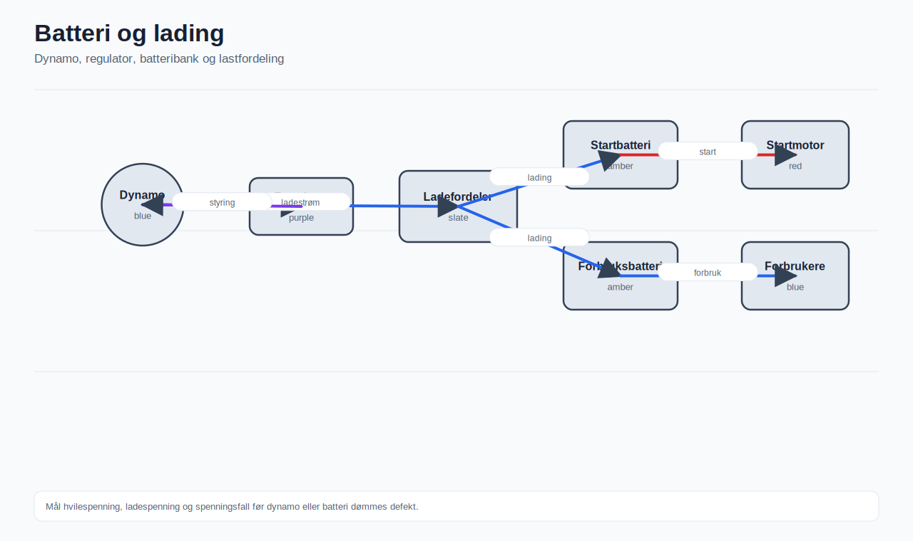

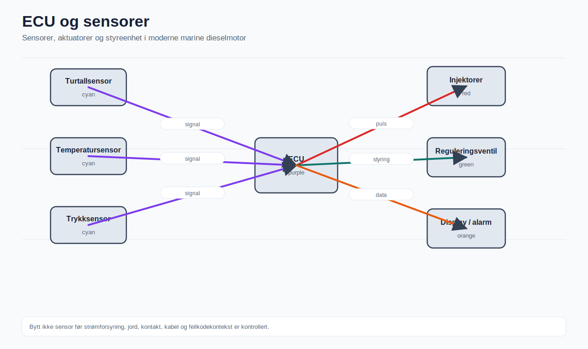

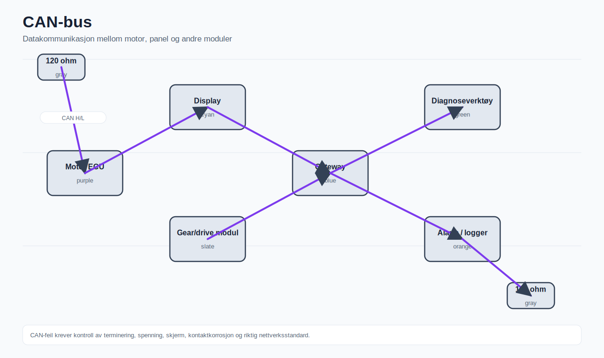

## Grundig forklaring
Hvordan forbrenning, luft, drivstoff, kjøling og smøring henger sammen i en marine dieselmotor må forstås både teknisk og praktisk. I marine reservedeler er det sjelden nok å vite hva kunden kaller delen. Medarbeideren må forstå hvilken funksjon delen har, hvor den sitter, hvilken motorvariant den tilhører, og hva som skjer dersom feil del bestilles. Derfor skal tekniske data, kundens beskrivelse og dokumentert katalogoppslag alltid vurderes sammen.

En god sak har fire kjennetegn: den har tydelig identifikasjon, tydelig problem- eller delbeskrivelse, tydelig beslutningsgrunnlag og tydelig oppfølging. Dersom ett av disse punktene mangler, skal saken markeres som usikker før kunden får et bindende svar.

## Praktisk verkstedeksempel
Et verksted står med demontert komponent og trenger rask avklaring. Medarbeideren registrerer kunde, fartøy, motorinformasjon og tidsfrist, ber om bilder av typeplate og komponent, sjekker katalog og lager, og sender et kort skriftlig svar med valgt del, grunnlag for valget og neste oppdateringstidspunkt.

## Kundesupporteksempel
Kunde: 'Motoren går dårlig, kan dere sende riktig del?' Profesjonelt svar: 'Vi kan hjelpe, men først må vi skille mellom symptom og delbehov. Send serienummer, bilde av motorplate, bilde av området feilen gjelder og en kort beskrivelse av når feilen oppstår. Da kan vi foreslå riktig del eller riktig neste feilsøkingstrinn.'

## Vanlige feil og årsaker
- feil eller ufullstendig serienummer.
- delnummer som er erstattet uten at saken dokumenteres.
- symptom som tolkes som delbehov uten feilsøking.
- kunde har bilde av lignende del, men ikke korrekt motorvariant.
- manglende avklaring av antall, side, posisjon eller leveringstid.

## Feilsøkingsflyt
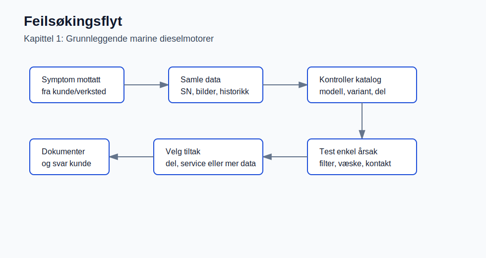

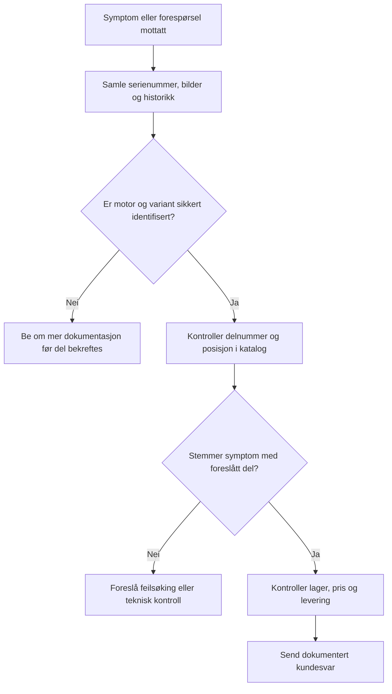
```mermaid
flowchart TD
    A[Symptom eller forespørsel mottatt] --> B[Samle serienummer, bilder og historikk]
    B --> C{Er motor og variant sikkert identifisert?}
    C -- Nei --> D[Be om mer dokumentasjon før del bekreftes]
    C -- Ja --> E[Kontroller delnummer og posisjon i katalog]
    E --> F{Stemmer symptom med foreslått del?}
    F -- Nei --> G[Foreslå feilsøking eller teknisk kontroll]
    F -- Ja --> H[Kontroller lager, pris og levering]
    H --> I[Send dokumentert kundesvar]
```

## Vedlikeholdsprosedyre
1. Avklar driftstimer, siste service og driftsmiljø.
2. Kontroller olje, filter, kjølevæske, sjøvannskrets, reimer, slanger og elektriske kontakter.
3. Sammenlign vedlikeholdsbehov med produsentens intervaller og faktisk bruk.
4. Anbefal servicekit når flere slitedeler bør skiftes samtidig.
5. Dokumenter hva som er anbefalt, hva kunden bestiller og eventuelle avvik fra normal prosedyre.

## Serienummeridentifikasjon
Serienummeridentifikasjon starter med å finne typeplate, motornummer eller annen unik identifikasjon. Be om bilde, ikke bare avskrift, fordi feil tegn, mellomrom og prefiks kan endre katalogoppslaget. Når serienummer ikke finnes, bygges identifikasjonen med modell, produksjonsår, bilder, tidligere fakturaer, servicehistorikk og delnummer fra monterte komponenter.

Minimumsdata bør være: fabrikat, modell, serienummer, eventuell product number/arrangement/CPL/motornummer, bilde av typeplate og bilde av motorens installasjon. Ved tvil skal saken stoppes for avklaring før del bekreftes.

## Reservedelsidentifikasjon
Reservedelsidentifikasjon skal bekrefte delnummer, posisjon, antall per motor, variant, side og eventuell erstatning. Dersom kunden oppgir et gammelt nummer, må det kontrolleres mot supersession. Dersom kunden bare sender bilde, skal bildet brukes som støtte, ikke som eneste grunnlag for bestilling.

Sjekk alltid om delnummeret gjelder enkeltkomponent, reparasjonssett, servicekit eller komplett enhet. Kontroller også om varen er høyre/venstre, gammel/ny type, standard/oversize eller knyttet til en bestemt produksjonsperiode.

## Bestillingsprosedyre
1. Opprett eller oppdater sak med kunde, fartøy, kontaktperson og tidsfrist.
2. Verifiser motoridentifikasjon og lagre bildedokumentasjon.
3. Finn korrekt delnummer i relevant katalog eller leverandørgrunnlag.
4. Kontroller supersession, antall, lagerstatus, pris, returvilkår og leveringstid.
5. Send ordrebekreftelse med delnummer, beskrivelse, antall, pris, levering og forbehold.
6. Følg opp leveransen til kunden har mottatt varen eller saken er lukket.

## Kvalitetspunkter før svar
- Har vi nok data til å gi et sikkert svar?
- Er delnummeret kontrollert mot riktig motorvariant?
- Er kundens tidsfrist realistisk med valgt fraktmåte?
- Er eventuelle forbehold skrevet tydelig?
- Kan en kollega forstå beslutningen ved å lese saken senere?

## Kapittelsammendrag
Hovedpoenget i kapittel 1 er at profesjonelt reservedelsarbeid krever struktur. Teknisk kunnskap, engelske fagtermer, praktisk feilsøking, dokumentasjon og kundedialog må henge sammen. Når medarbeideren jobber systematisk, reduseres feilbestillinger, kunden får bedre svar, og verkstedet kan planlegge arbeidet tryggere.

## Kryssreferanser
- For neste tema, se kapittel 2: Rollen til ny medarbeider innen marine reservedeler.
- For grunnleggende identifikasjon, se kapittel 12 og 17.
- For merkevise eksempler, se kapitlene 26-32.

## Fordypning for intern opplæring
Dette kapitlet skal brukes som arbeidsstandard, ikke bare som lesestoff. Når en ny medarbeider møter en sak om motorprinsipper, skal vedkommende trene på å gå rolig fra fakta til vurdering og deretter til handling. I en marinemotorforhandler er konsekvensen av en feil ofte større enn verdien av selve delen. En feil impeller, feil sensor, feil filterinnsats eller feil pakningssett kan føre til tapt verkstedtid, utsatt avgang, irritert kunde og i verste fall ny driftsstans. Derfor skal hver sak behandles som en teknisk beslutning med sporbar dokumentasjon.

Profesjonelt nivå i dette kapitlet betyr at medarbeideren kan arbeide sikkert med grunnleggende motorforståelse. Før kunden får et bindende svar, skal opplysningene i saken kontrolleres mot motorens identitet, faktisk installasjon og relevant produsentterminologi. Det praktiske målet er ikke å finne et raskt nummer, men å kunne forklare hvorfor valgt del, kontrollpunkt eller kundesvar er riktig for akkurat denne motoren. Når informasjon mangler, skal medarbeideren beskrive hva som mangler, hvorfor det er nødvendig, og hvilket neste steg som bringer saken videre.

## Tekniske forklaringer
Teknisk forståelse i dette kapitlet skal bygges rundt forbrenningsprosess, lufttilførsel, drivstofftilførsel, smøring, kjøling, eksos og kraftoverføring. Medarbeideren må skille mellom synlig symptom, sannsynlig systemfeil og bestillbar komponent. En del kan se riktig ut på bilde, men likevel være feil dersom posisjon, variant, rating, kjøleroppsett, elektrisk plugg, monteringsside eller servicehistorikk ikke stemmer. Derfor skal teknisk vurdering alltid kobles til både funksjon og dokumentasjon: hva gjør komponenten, hvilket system påvirker den, og hvilken produsentkilde bekrefter at den passer.

I praksis betyr dette at tekniske data skal kobles til motorens faktiske installasjon. Marine motorer står ofte trangt, er utsatt for salt, vibrasjon, fukt og ujevnt belastningsmønster, og de kan være bygget om gjennom mange år. En motor kan ha original kjøler, ettermontert eksosbend, alternativ dynamo, endret filterbrakett eller annen sjøvannspumpe enn standard. Slike forhold gjør at delidentifikasjon må bygge på både produsentdata og synlig dokumentasjon fra motoren.

Produsentterminologi er en del av den tekniske forståelsen. Bruk uttrykk som Serial Number, Engine Number, Part Number, Service Kit, Exploded View, Supersession når de er relevante. Ikke oversett dem på en måte som fjerner presisjon. Skriv for eksempel «Engine Serial Number (ESN)» første gang og deretter «ESN» i saken dersom produsenten bruker dette. Skriv «Arrangement Number» når CAT-data krever det, «Product Number» når Volvo Penta bruker det, «CPL» når Cummins-konfigurasjon må kontrolleres, og «Model Code» når Yanmar-identifikasjon bygger på modellkode. Dette gjør dialogen med internasjonale leverandører mer presis.

## Illustrasjonsforslag
- Oversiktsdiagram som viser hvor motorprinsipper passer inn i total arbeidsflyt fra kundeforespørsel til levert del.
- Nærbilde av typeplate/motorskilt med markering av serienummer, motornummer, modell og eventuell variantkode.
- Sprengskisse med markert posisjon, delnummer, antall per motor og mulige alternative versjoner.
- Feilsøkingsflyt med beslutningspunkter: mangler data, stemmer symptom, kreves mer teknisk kontroll, kan ordre bekreftes.
- Sammenligningsbilde av gammel og ny del der forskjell i tilkobling, side, lengde eller sensorplugg er markert.

## Virkelige verkstedseksempler
Eksempel 1: Et verksted står med en demontert komponent på benken og kunden venter på avklaring før fartøyet kan settes tilbake i drift. Verkstedet sender et nærbilde av delen, men ingen motorplate. En uerfaren medarbeider kan bli fristet til å søke på nummeret som står på støpegodset. En profesjonell medarbeider svarer at støpenummer ikke nødvendigvis er bestillbart delnummer, ber om bilde av typeplate, oversiktsbilde av motoren og bilde av monteringsstedet, og forklarer at dette hindrer feilbestilling. Når informasjonen kommer, kontrolleres delnummer mot sprengskisse, posisjon og antall. Først da gis pris og leveringstid.

Eksempel 2: En kunde ringer sent på dagen og sier at motoren har høy temperatur etter service. Kunden ønsker ny termostat. Medarbeideren skal ikke automatisk konkludere med termostatfeil. Spørsmålene bør avklare om impeller er byttet, om sjøvannsfilteret er rent, om kjølevæskenivået er riktig, om alarmen kommer ved tomgang eller belastning, og om det finnes lekkasje rundt varmeveksler eller slanger. Dersom kunden likevel vil bestille termostat, dokumenteres at feilsøking er anbefalt, og delnummer kontrolleres mot serienummer før ordre.

Eksempel 3: En intern selger mottar en gammel faktura med et delnummer som ikke lenger finnes. Riktig prosess er å kontrollere supersession, se om ny del krever tilhørende pakning, boltsett eller adapter, og notere både gammelt og nytt nummer i saken. Kunden skal få vite at delen er erstattet, hva som leveres, og om det finnes monteringsforbehold.

## Reservedelsidentifisering i praksis
Reservedelsidentifisering skal følge en fast rekkefølge. Først kontrolleres motorens identitet. Deretter kontrolleres delens system: drivstoff, luft, kjøling, smøring, eksos, elektrisk eller mekanisk kraftoverføring. Så kontrolleres posisjon i sprengskisse eller parts list. Til slutt kontrolleres antall, variant, supersession og leveringsstatus. Denne rekkefølgen hindrer at medarbeideren hopper direkte fra kundens ord til et tilfeldig delnummer.

Når en del har synlig nummer, må nummeret tolkes riktig. Mange komponenter har produksjonsnummer, støpenummer, leverandørnummer eller revisjonskode som ikke er det samme som bestillbart part number. Et filter kan ha nummer fra filterprodusent, men motorprodusentens parts catalogue kan bruke et annet nummer. En pumpe kan ha nummer på lokk, hus og komplett enhet. Spør derfor alltid: gjelder nummeret komplett del, reparasjonssett, underkomponent eller produsentens råkomponent?

## Serienummer og motornummer
Serienummer og motornummer er grunnlaget for korrekt katalogoppslag. Be kunden sende bilde av typeplate eller dataplate. Dersom kunden skriver nummeret manuelt, skal nummeret likevel kontrolleres mot bilde når det er mulig. Noter hele nummeret, inkludert prefiks, suffiks, bindestrek, mellomrom og eventuelle bokstaver. På enkelte produsenter kan små forskjeller peke til forskjellig produksjonsperiode, rating eller konfigurasjon.

Bruk motornummer sammen med modell, variant og applikasjon. En motor som driver generator kan ha andre deler enn en fremdriftsmotor. En motor i yrkesbåt kan ha annen rating enn samme motor i fritidsbåt. En eldre motor kan være bygget om med ny dynamo, annen sjøvannspumpe eller uoriginal filterbrakett. Dersom typeplate mangler, bygg identifikasjonen gjennom flere kilder: servicebok, tidligere faktura, bilder av motorens sider, nummer på pumpe, filter, turbo og gear, samt opplysninger om fartøy og produksjonsår.

## Feilsøking steg for steg
1. Definer symptomet med kundens egne ord og skriv det i saken. Skill mellom «kunden ønsker del» og «kunden beskriver feil».
2. Avklar når feilen oppstår: start, tomgang, belastning, marsjfart, varm motor, kald motor eller etter nylig service.
3. Kontroller grunnleggende forhold: væskenivå, filter, luft i drivstoff, sjøvannsstrøm, reimer, elektriske kontakter, sikringer og synlige lekkasjer.
4. Knytt symptomet til system: lav effekt peker ofte mot luft/drivstoff/eksos, høy temperatur mot kjøling, lavt oljetrykk mot smøring/sensor, startproblem mot batteri/starter/gløding/drivstoff.
5. Be om bilder eller måledata dersom symptomet ikke kan kobles sikkert til en del. Dette kan være bilde av alarmdisplay, trykkmåling, temperaturmåling eller bilde av montert komponent.
6. Kontroller relevant delnummer mot serienummer og variant. Dersom flere alternativer finnes, forklar kunden hva som skiller dem.
7. Dokumenter anbefalt tiltak, usikkerhet og eventuelle forbehold før ordre bekreftes.

## Vedlikehold
Vedlikehold skal vurderes mot driftstimer, produsentens maintenance schedule og faktisk driftsmiljø. Marine motorer som går korte turer, mye tomgang eller i salt miljø kan trenge hyppigere kontroll enn standard intervall antyder. Nye medarbeidere skal lære å spørre om siste service, hvilke filter som ble byttet, hvilken olje som ble brukt, om impeller er kontrollert, og om kjølevæske eller anoder er byttet etter plan.

En god vedlikeholdsanbefaling er konkret. I stedet for å skrive «ta service», bør medarbeideren foreslå relevante deler: olje- og drivstoffilter, luftfilter, impeller, reim, pakninger, anoder, kjølevæske og eventuelt servicekit. Dersom kunden har ukjent servicehistorikk, bør komplett servicekit vurderes. Dersom kunden har hatt overoppheting, bør sjøvannskrets og varmeveksler kontrolleres før bare én komponent byttes.

## Vanlige feil
- Serienummer leses feil fordi et tegn forveksles, for eksempel O/0 eller I/1.
- Kunden oppgir modellnavn, men ikke variant, rating eller applikasjon.
- Del velges ut fra bilde alene uten kontroll mot sprengskisse eller produsentkatalog.
- Supersession aksepteres uten å kontrollere om ny del krever tilbehør, pakning eller ombygging.
- Hastepress gjør at leveringsløfte gis før lagerstatus og fraktmulighet er bekreftet.
- Saksnotat mangler grunnlaget for beslutningen, slik at kollega ikke kan etterprøve valget.

## Kontrollspørsmål
- Hva er den viktigste tekniske risikoen i en sak som gjelder motorprinsipper?
- Hvilke opplysninger må dokumenteres før bindende delnummer bekreftes?
- Hvordan forklarer du kunden hvorfor bilde av typeplate er nødvendig?
- Når bør du stoppe en ordre og be om mer dokumentasjon?
- Hvilke engelske produsentuttrykk bør du kunne bruke i denne typen sak?
- Hvordan dokumenterer du at et delnummer er erstattet av et nytt nummer?

## Praktisk sjekkliste for medarbeider
- Les saken som om en kollega skal overta den i morgen.
- Kontroller at motoridentifikasjon er dokumentert med bilde eller sikker kilde.
- Sjekk at delnummeret er knyttet til riktig posisjon i katalogen.
- Skriv tydelig om kunden har bedt om enkeltkomponent, servicekit eller komplett enhet.
- Noter om varen er spesialbestilling, utgått, erstattet eller ikke returbar.
- Send kundesvar med neste steg, ikke bare et løst delnummer.

## Kapittelspesifikk systemforståelse
For dette kapitlet er kjernen å forstå forbrenningsprosessen, innsug, kompresjon, innsprøytning, ekspansjon og eksos. Medarbeideren skal kunne forklare dette med praktiske ord til både kunde og kollega. Det betyr at teknisk teori må kobles til konkrete handlinger: hvilke data skal innhentes, hvilke komponenter kan være berørt, hvilken produsentterminologi skal brukes, og hva må dokumenteres før saken kan gå videre. Forklar alltid at lav effekt kan skyldes luft, drivstoff, eksosmottrykk eller belastning før én enkelt del pekes ut.

Når systemet vurderes, skal medarbeideren først plassere problemet i riktig teknisk sammenheng. Dersom kunden beskriver en alarm, må man finne ut om alarmen kommer fra reelt mekanisk avvik, elektrisk sensorfeil, feil etter service eller feil tolkning av instrumentet. Dersom kunden beskriver en del, må man avklare om kunden mener komplett enhet, servicekit, reparasjonssett eller enkeltkomponent. Dersom kunden beskriver motoren med vanlig navn, må man kontrollere om produsenten bruker mer presise begreper i katalogen.

## Komponentoversikt og arbeidsgrense
Relevante komponenter og opplysninger i dette kapitlet omfatter: sylindere, stempler, topplokk, ventiler, dyser, turbo, intercooler/aftercooler, kjølesystem, smøresystem og eksosanlegg. Listen er ikke ment som en erstatning for produsentens parts catalogue, men som en praktisk påminnelse om hva nye medarbeidere skal tenke på før de søker del. I interne saker skal komponentnavn skrives så presist som mulig. Bruk for eksempel «sjøvannspumpe / raw water pump» i stedet for bare «pumpe» når funksjonen er kjent, og «varmeveksler / heat exchanger» i stedet for bare «kjøler» når det er den komponenten saken gjelder.

Arbeidsgrensen for en reservedelsmedarbeider er også viktig. Medarbeideren skal ikke overta mekanikerens ansvar for demontering, måling eller diagnose på motoren, men skal kunne stille riktige spørsmål og foreslå riktig dokumentasjon. Når en sak går fra enkel delidentifikasjon til teknisk diagnose, skal dette markeres i saken. Da kan verksted, teknisk ansvarlig eller leverandør involveres med et klart spørsmål og et ryddig faktagrunnlag.

## Praktisk beslutningsregel
Bruk denne regelen i alle saker knyttet til kapitlet: Hvis motoridentifikasjon, komponentposisjon eller symptom ikke er sikkert nok dokumentert, skal medarbeideren ikke gi bindende delbekreftelse. Kunden kan få et foreløpig svar, men svaret må inneholde hva som mangler, hvorfor det mangler, og hva som skjer når informasjonen er mottatt. Dette er ikke treg service; det er profesjonell risikokontroll.

## Realistisk opplæring i praksis
### Verkstedhistorie
En typisk sak i dette temaet starter med lav effekt etter service. Verkstedet trenger et raskt svar, men den erfarne medarbeideren stopper opp og spør først: hva vet vi sikkert, hva antar vi, og hva kan gi følgeskade hvis vi tar feil? I praksis betyr det at luft, drivstoff, kjøling og smøring må kobles til bilde, serienummer, komponentposisjon og kundens symptom før saken lukkes. Historien skal brukes i opplæring som en øvelse i å skrive et kort saksnotat: observasjon, vurdering, neste handling og forbehold.

### Kundehistorie
Kunden beskriver ofte problemet med driftsspråk: «motoren går tungt», «alarm kommer etter ti minutter», «jeg trenger den samme delen som sist» eller «båten skal ut i morgen». En profesjonell respons er rolig og konkret: bekreft behovet, forklar hvorfor identifikasjon trengs, be om riktig dokumentasjon og gi et realistisk tidspunkt for neste svar. Ikke korriger kunden unødvendig; oversett kundens språk til teknisk språk i saken.

### Typiske feil nye ansatte gjør
- søker på første synlige nummer uten å avklare om det er støpenummer, leverandørnummer eller bestillbart part number.
- lover levering før lagerstatus, frakt og returvilkår er kontrollert.
- antar at tidligere faktura alltid gjelder samme motorvariant.
- blander symptom og årsak, spesielt ved varme, lav effekt, startproblem og alarm.
- skriver for korte notater slik at kollega ikke kan forstå hvorfor valget ble tatt.

### Tips fra erfarne mekanikere og reservedelsselgere
- Se alltid etter systemet rundt delen: slanger, braketter, sensorer, reimer, kjølere og tilkoblinger forteller ofte mer enn delen alene.
- Still ett presist spørsmål om gangen når kunden er stresset; mange dårlige svar kommer av for lange spørsmålslister.
- Sammenlign gammel og ny del mot funksjon, ikke bare form. Riktig del skal passe, men også løse riktig problem.
- En erfaren reservedelsselger tenker i risiko: Hva er billigst å avklare nå, og hva blir dyrt hvis vi hopper over det?

### Vanlige kundespørsmål
| Spørsmål fra kunde | Profesjonelt svar |
|---|---|
| «Kan du bare sende samme del som sist?» | «Ja, hvis vi først bekrefter at det gjelder samme motor, samme posisjon og ingen supersession siden sist.» |
| «Holder det med bilde?» | «Bilde hjelper, men vi trenger også motoridentitet for å sikre variant og delnummer.» |
| «Hvorfor tar dette tid?» | «Fordi feil del kan gi ny driftsstans. Vi kontrollerer grunnlaget før vi lover levering.» |

### Beslutningstre for saken
| Trinn | Spørsmål | Handling |
|---|---|---|
| 1 | Er motoridentitet dokumentert med bilde eller sikker historikk? | Hvis nei: be om typeplate/dataplate eller alternativ dokumentasjon. |
| 2 | Er komponentens funksjon og posisjon kjent? | Hvis nei: be om oversiktsbilde og bilde av monteringssted. |
| 3 | Stemmer kundens symptom med delen som ønskes? | Hvis nei: anbefal feilsøking før del bestilles. |
| 4 | Finnes det supersession, kit eller variantvalg? | Kontroller produsentkilde og skriv forbehold i saken. |
| 5 | Kan pris, levering og returvilkår bekreftes? | Send dokumentert svar med neste steg og tydelig gyldighet. |

### Rask oppslagstabell
| Situasjon | Kontroller først | Vanlig fallgruve |
|---|---|---|
| Hasteordre | sikker motor-ID, lager, fraktfrist | levering loves før teknisk kontroll |
| Del fra bilde | posisjon, skala, tilkoblinger, nummer | bilde brukes som eneste beslutningsgrunnlag |
| Gammelt delnummer | supersession og kitinnhold | ny del krever ekstra pakning eller adapter |
| Uklart symptom | driftssituasjon, alarm, siste service | symptom blir tolket som sikker komponentfeil |

### Praktisk sjekkliste og inspeksjonsrutine
- Start med motoridentitet: fabrikat, modell, serienummer, variant, applikasjon og bilde av skilt.
- Kontroller området rundt komponenten: lekkasje, korrosjon, knekte fester, slitasje, varmemerker og uoriginale endringer.
- Spør om siste vedlikehold: olje, filter, impeller, reimer, kjølevæske, anoder og drivstoffilter.
- Noter driftstype: fritidsbruk, yrkesbruk, generator, fremdrift, tomgangsdrift eller langvarig høy belastning.
- Avklar om saken gjelder akutt drift, planlagt service, reklamasjon eller lagerpåfyll.

### Generelle vedlikeholdsintervaller som opplæringspunkt
| Kontrollpunkt | Typisk vurdering i opplæring | Må verifiseres |
|---|---|---|
| Olje og oljefilter | ofte basert på timer og kalender | produsentens maintenance schedule |
| Drivstoffilter/vannutskiller | hyppigere ved dårlig drivstoff eller sesongstart | motor- og filterspesifikasjon |
| Impeller og sjøvannskrets | kontrolleres særlig før sesong og etter varmgang | produsentens intervall og installasjon |
| Reimer, slanger og klemmer | visuell kontroll ved service og feilsøking | dimensjon, stramming og delnummer |

### Produsentverifikasjon
Alle konkrete delnumre, momentverdier, serviceintervaller, garantikrav, programvaredata og produsentspesifikke grenser skal kontrolleres mot offisiell produsentdokumentasjon før de brukes i tilbud, ordre eller verkstedinstruks. Marker tydelig i saken når svaret bygger på antakelse, eldre historikk, bilde uten motor-ID eller generell erfaring. Intervaller i tabellen er generelle opplæringspunkter. Faktiske intervaller styres av produsent, motorvariant, driftstimer, kalenderkrav, belastning og miljø.

## Produsentverifikasjon og faglig forbehold
Denne manualen skal brukes som intern opplæring og arbeidsmetode. Produsentspesifikke delnumre, intervaller, momentverdier, garantikrav og tekniske grenseverdier skal verifiseres mot gjeldende produsentdokumentasjon før de brukes i kundeordre eller verkstedinstruks. Marker saken internt dersom opplysningen bygger på antakelse, eldre historikk eller bilde uten bekreftet motoridentitet.

## Quiz med fasit
1. Hvilke tekniske data bør alltid samles før en del bekreftes?
2. Hvorfor er engelsk terminologi viktig i marine reservedeler?
3. Hva bør gjøres dersom kunden bare sender et bilde av delen?
4. Hvilke punkter bør kontrolleres før ordrebekreftelse sendes?
5. Hvorfor skal feilsøking dokumenteres, selv når kunden allerede ber om en bestemt del?

### Svar
1. Fabrikat, modell, serienummer, variantdata, bilde av typeplate, delnummer, posisjon og kundens symptombeskrivelse.
2. Fordi kataloger, portaler, servicemanualer og leverandørdialog ofte bruker engelske begreper som må forstås presist.
3. Be om serienummer, oversiktsbilde av motoren og eventuelle nummer på delen; bildet brukes som støtte, ikke eneste grunnlag.
4. Delnummer, antall, variant, pris, lagerstatus, leveringstid, frakt, returvilkår og eventuelle forbehold.
5. Fordi symptomet kan ha flere årsaker, og dokumentasjon viser hvorfor anbefalingen ble gitt.

---

# Kapittel 2: Rollen til ny medarbeider innen marine reservedeler

## Kapittelrolle
Dette kapitlet gir en grundig praktisk innføring i rolleforståelse. Temaet er viktig fordi reservedelsarbeid i marine miljøer kombinerer teknisk forståelse, presis kundedialog, dokumentert saksbehandling og realistisk leveranseoppfølging. Målet er at en ny medarbeider skal kunne bruke kunnskapen direkte i arbeid med verksted, kunde, lager og leverandør.

## Læringsmål
Etter kapitlet skal deltakeren kunne:
- forklare hovedbegrepene innen rolleforståelse
- bruke serienummer, modellinformasjon og delnummer i praktisk reservedelsarbeid
- kommunisere trygt med kunde, verksted, lager og leverandør
- dokumentere beslutninger slik at andre kan etterprøve saken
- kjenne igjen vanlige feil og velge riktig neste handling

## English technical terminology
- **Serial Number:** engelsk fagterm som ofte brukes i kataloger, servicelitteratur, leverandørportaler og internasjonal kundedialog.
- **Part Number:** engelsk fagterm som ofte brukes i kataloger, servicelitteratur, leverandørportaler og internasjonal kundedialog.
- **Engine Model:** engelsk fagterm som ofte brukes i kataloger, servicelitteratur, leverandørportaler og internasjonal kundedialog.
- **Variant:** engelsk fagterm som ofte brukes i kataloger, servicelitteratur, leverandørportaler og internasjonal kundedialog.
- **Service Kit:** engelsk fagterm som ofte brukes i kataloger, servicelitteratur, leverandørportaler og internasjonal kundedialog.
- **Troubleshooting:** engelsk fagterm som ofte brukes i kataloger, servicelitteratur, leverandørportaler og internasjonal kundedialog.
- **Maintenance:** engelsk fagterm som ofte brukes i kataloger, servicelitteratur, leverandørportaler og internasjonal kundedialog.
- **Ordering Procedure:** engelsk fagterm som ofte brukes i kataloger, servicelitteratur, leverandørportaler og internasjonal kundedialog.
- **Supersession:** engelsk fagterm som ofte brukes i kataloger, servicelitteratur, leverandørportaler og internasjonal kundedialog.
- **Technical Support:** engelsk fagterm som ofte brukes i kataloger, servicelitteratur, leverandørportaler og internasjonal kundedialog.

## Hoveddiagram
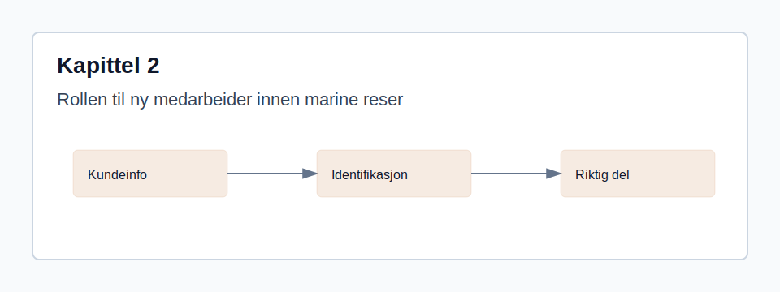

## Tekniske systemillustrasjoner

## Grundig forklaring
Hvordan en ny medarbeider bidrar til presis delidentifikasjon, god kundeservice og trygg ordrebehandling må forstås både teknisk og praktisk. I marine reservedeler er det sjelden nok å vite hva kunden kaller delen. Medarbeideren må forstå hvilken funksjon delen har, hvor den sitter, hvilken motorvariant den tilhører, og hva som skjer dersom feil del bestilles. Derfor skal tekniske data, kundens beskrivelse og dokumentert katalogoppslag alltid vurderes sammen.

En god sak har fire kjennetegn: den har tydelig identifikasjon, tydelig problem- eller delbeskrivelse, tydelig beslutningsgrunnlag og tydelig oppfølging. Dersom ett av disse punktene mangler, skal saken markeres som usikker før kunden får et bindende svar.

## Praktisk verkstedeksempel
Et verksted står med demontert komponent og trenger rask avklaring. Medarbeideren registrerer kunde, fartøy, motorinformasjon og tidsfrist, ber om bilder av typeplate og komponent, sjekker katalog og lager, og sender et kort skriftlig svar med valgt del, grunnlag for valget og neste oppdateringstidspunkt.

## Kundesupporteksempel
Kunde: 'Motoren går dårlig, kan dere sende riktig del?' Profesjonelt svar: 'Vi kan hjelpe, men først må vi skille mellom symptom og delbehov. Send serienummer, bilde av motorplate, bilde av området feilen gjelder og en kort beskrivelse av når feilen oppstår. Da kan vi foreslå riktig del eller riktig neste feilsøkingstrinn.'

## Vanlige feil og årsaker
- feil eller ufullstendig serienummer.
- delnummer som er erstattet uten at saken dokumenteres.
- symptom som tolkes som delbehov uten feilsøking.
- kunde har bilde av lignende del, men ikke korrekt motorvariant.
- manglende avklaring av antall, side, posisjon eller leveringstid.

## Feilsøkingsflyt
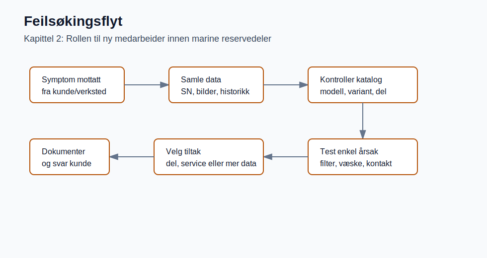

```mermaid
flowchart TD
    A[Symptom eller forespørsel mottatt] --> B[Samle serienummer, bilder og historikk]
    B --> C{Er motor og variant sikkert identifisert?}
    C -- Nei --> D[Be om mer dokumentasjon før del bekreftes]
    C -- Ja --> E[Kontroller delnummer og posisjon i katalog]
    E --> F{Stemmer symptom med foreslått del?}
    F -- Nei --> G[Foreslå feilsøking eller teknisk kontroll]
    F -- Ja --> H[Kontroller lager, pris og levering]
    H --> I[Send dokumentert kundesvar]
```

## Vedlikeholdsprosedyre
1. Avklar driftstimer, siste service og driftsmiljø.
2. Kontroller olje, filter, kjølevæske, sjøvannskrets, reimer, slanger og elektriske kontakter.
3. Sammenlign vedlikeholdsbehov med produsentens intervaller og faktisk bruk.
4. Anbefal servicekit når flere slitedeler bør skiftes samtidig.
5. Dokumenter hva som er anbefalt, hva kunden bestiller og eventuelle avvik fra normal prosedyre.

## Serienummeridentifikasjon
Serienummeridentifikasjon starter med å finne typeplate, motornummer eller annen unik identifikasjon. Be om bilde, ikke bare avskrift, fordi feil tegn, mellomrom og prefiks kan endre katalogoppslaget. Når serienummer ikke finnes, bygges identifikasjonen med modell, produksjonsår, bilder, tidligere fakturaer, servicehistorikk og delnummer fra monterte komponenter.

Minimumsdata bør være: fabrikat, modell, serienummer, eventuell product number/arrangement/CPL/motornummer, bilde av typeplate og bilde av motorens installasjon. Ved tvil skal saken stoppes for avklaring før del bekreftes.

## Reservedelsidentifikasjon
Reservedelsidentifikasjon skal bekrefte delnummer, posisjon, antall per motor, variant, side og eventuell erstatning. Dersom kunden oppgir et gammelt nummer, må det kontrolleres mot supersession. Dersom kunden bare sender bilde, skal bildet brukes som støtte, ikke som eneste grunnlag for bestilling.

Sjekk alltid om delnummeret gjelder enkeltkomponent, reparasjonssett, servicekit eller komplett enhet. Kontroller også om varen er høyre/venstre, gammel/ny type, standard/oversize eller knyttet til en bestemt produksjonsperiode.

## Bestillingsprosedyre
1. Opprett eller oppdater sak med kunde, fartøy, kontaktperson og tidsfrist.
2. Verifiser motoridentifikasjon og lagre bildedokumentasjon.
3. Finn korrekt delnummer i relevant katalog eller leverandørgrunnlag.
4. Kontroller supersession, antall, lagerstatus, pris, returvilkår og leveringstid.
5. Send ordrebekreftelse med delnummer, beskrivelse, antall, pris, levering og forbehold.
6. Følg opp leveransen til kunden har mottatt varen eller saken er lukket.

## Kvalitetspunkter før svar
- Har vi nok data til å gi et sikkert svar?
- Er delnummeret kontrollert mot riktig motorvariant?
- Er kundens tidsfrist realistisk med valgt fraktmåte?
- Er eventuelle forbehold skrevet tydelig?
- Kan en kollega forstå beslutningen ved å lese saken senere?

## Kapittelsammendrag
Hovedpoenget i kapittel 2 er at profesjonelt reservedelsarbeid krever struktur. Teknisk kunnskap, engelske fagtermer, praktisk feilsøking, dokumentasjon og kundedialog må henge sammen. Når medarbeideren jobber systematisk, reduseres feilbestillinger, kunden får bedre svar, og verkstedet kan planlegge arbeidet tryggere.

## Kryssreferanser
- For forrige tema, se kapittel 1: Grunnleggende marine dieselmotorer.
- For neste tema, se kapittel 3: Oversikt over marinemotorbransjen og arbeidsoppgaver.
- For grunnleggende identifikasjon, se kapittel 12 og 17.
- For merkevise eksempler, se kapitlene 26-32.

## Fordypning for intern opplæring
Dette kapitlet skal brukes som arbeidsstandard, ikke bare som lesestoff. Når en ny medarbeider møter en sak om rolle og ansvar, skal vedkommende trene på å gå rolig fra fakta til vurdering og deretter til handling. I en marinemotorforhandler er konsekvensen av en feil ofte større enn verdien av selve delen. En feil impeller, feil sensor, feil filterinnsats eller feil pakningssett kan føre til tapt verkstedtid, utsatt avgang, irritert kunde og i verste fall ny driftsstans. Derfor skal hver sak behandles som en teknisk beslutning med sporbar dokumentasjon.

Profesjonelt nivå i dette kapitlet betyr at medarbeideren kan arbeide sikkert med rollen som ny medarbeider. Før kunden får et bindende svar, skal opplysningene i saken kontrolleres mot motorens identitet, faktisk installasjon og relevant produsentterminologi. Det praktiske målet er ikke å finne et raskt nummer, men å kunne forklare hvorfor valgt del, kontrollpunkt eller kundesvar er riktig for akkurat denne motoren. Når informasjon mangler, skal medarbeideren beskrive hva som mangler, hvorfor det er nødvendig, og hvilket neste steg som bringer saken videre.

## Tekniske forklaringer
Teknisk forståelse i dette kapitlet skal bygges rundt ansvarsgrenser, dokumentasjon, kundedialog og intern overlevering. Medarbeideren må skille mellom synlig symptom, sannsynlig systemfeil og bestillbar komponent. En del kan se riktig ut på bilde, men likevel være feil dersom posisjon, variant, rating, kjøleroppsett, elektrisk plugg, monteringsside eller servicehistorikk ikke stemmer. Derfor skal teknisk vurdering alltid kobles til både funksjon og dokumentasjon: hva gjør komponenten, hvilket system påvirker den, og hvilken produsentkilde bekrefter at den passer.

I praksis betyr dette at tekniske data skal kobles til motorens faktiske installasjon. Marine motorer står ofte trangt, er utsatt for salt, vibrasjon, fukt og ujevnt belastningsmønster, og de kan være bygget om gjennom mange år. En motor kan ha original kjøler, ettermontert eksosbend, alternativ dynamo, endret filterbrakett eller annen sjøvannspumpe enn standard. Slike forhold gjør at delidentifikasjon må bygge på både produsentdata og synlig dokumentasjon fra motoren.

Produsentterminologi er en del av den tekniske forståelsen. Bruk uttrykk som Serial Number, Engine Number, Part Number, Service Kit, Exploded View, Supersession når de er relevante. Ikke oversett dem på en måte som fjerner presisjon. Skriv for eksempel «Engine Serial Number (ESN)» første gang og deretter «ESN» i saken dersom produsenten bruker dette. Skriv «Arrangement Number» når CAT-data krever det, «Product Number» når Volvo Penta bruker det, «CPL» når Cummins-konfigurasjon må kontrolleres, og «Model Code» når Yanmar-identifikasjon bygger på modellkode. Dette gjør dialogen med internasjonale leverandører mer presis.

## Illustrasjonsforslag
- Oversiktsdiagram som viser hvor rolle og ansvar passer inn i total arbeidsflyt fra kundeforespørsel til levert del.
- Nærbilde av typeplate/motorskilt med markering av serienummer, motornummer, modell og eventuell variantkode.
- Sprengskisse med markert posisjon, delnummer, antall per motor og mulige alternative versjoner.
- Feilsøkingsflyt med beslutningspunkter: mangler data, stemmer symptom, kreves mer teknisk kontroll, kan ordre bekreftes.
- Sammenligningsbilde av gammel og ny del der forskjell i tilkobling, side, lengde eller sensorplugg er markert.

## Virkelige verkstedseksempler
Eksempel 1: Et verksted står med en demontert komponent på benken og kunden venter på avklaring før fartøyet kan settes tilbake i drift. Verkstedet sender et nærbilde av delen, men ingen motorplate. En uerfaren medarbeider kan bli fristet til å søke på nummeret som står på støpegodset. En profesjonell medarbeider svarer at støpenummer ikke nødvendigvis er bestillbart delnummer, ber om bilde av typeplate, oversiktsbilde av motoren og bilde av monteringsstedet, og forklarer at dette hindrer feilbestilling. Når informasjonen kommer, kontrolleres delnummer mot sprengskisse, posisjon og antall. Først da gis pris og leveringstid.

Eksempel 2: En kunde ringer sent på dagen og sier at motoren har høy temperatur etter service. Kunden ønsker ny termostat. Medarbeideren skal ikke automatisk konkludere med termostatfeil. Spørsmålene bør avklare om impeller er byttet, om sjøvannsfilteret er rent, om kjølevæskenivået er riktig, om alarmen kommer ved tomgang eller belastning, og om det finnes lekkasje rundt varmeveksler eller slanger. Dersom kunden likevel vil bestille termostat, dokumenteres at feilsøking er anbefalt, og delnummer kontrolleres mot serienummer før ordre.

Eksempel 3: En intern selger mottar en gammel faktura med et delnummer som ikke lenger finnes. Riktig prosess er å kontrollere supersession, se om ny del krever tilhørende pakning, boltsett eller adapter, og notere både gammelt og nytt nummer i saken. Kunden skal få vite at delen er erstattet, hva som leveres, og om det finnes monteringsforbehold.

## Reservedelsidentifisering i praksis
Reservedelsidentifisering skal følge en fast rekkefølge. Først kontrolleres motorens identitet. Deretter kontrolleres delens system: drivstoff, luft, kjøling, smøring, eksos, elektrisk eller mekanisk kraftoverføring. Så kontrolleres posisjon i sprengskisse eller parts list. Til slutt kontrolleres antall, variant, supersession og leveringsstatus. Denne rekkefølgen hindrer at medarbeideren hopper direkte fra kundens ord til et tilfeldig delnummer.

Når en del har synlig nummer, må nummeret tolkes riktig. Mange komponenter har produksjonsnummer, støpenummer, leverandørnummer eller revisjonskode som ikke er det samme som bestillbart part number. Et filter kan ha nummer fra filterprodusent, men motorprodusentens parts catalogue kan bruke et annet nummer. En pumpe kan ha nummer på lokk, hus og komplett enhet. Spør derfor alltid: gjelder nummeret komplett del, reparasjonssett, underkomponent eller produsentens råkomponent?

## Serienummer og motornummer
Serienummer og motornummer er grunnlaget for korrekt katalogoppslag. Be kunden sende bilde av typeplate eller dataplate. Dersom kunden skriver nummeret manuelt, skal nummeret likevel kontrolleres mot bilde når det er mulig. Noter hele nummeret, inkludert prefiks, suffiks, bindestrek, mellomrom og eventuelle bokstaver. På enkelte produsenter kan små forskjeller peke til forskjellig produksjonsperiode, rating eller konfigurasjon.

Bruk motornummer sammen med modell, variant og applikasjon. En motor som driver generator kan ha andre deler enn en fremdriftsmotor. En motor i yrkesbåt kan ha annen rating enn samme motor i fritidsbåt. En eldre motor kan være bygget om med ny dynamo, annen sjøvannspumpe eller uoriginal filterbrakett. Dersom typeplate mangler, bygg identifikasjonen gjennom flere kilder: servicebok, tidligere faktura, bilder av motorens sider, nummer på pumpe, filter, turbo og gear, samt opplysninger om fartøy og produksjonsår.

## Feilsøking steg for steg
1. Definer symptomet med kundens egne ord og skriv det i saken. Skill mellom «kunden ønsker del» og «kunden beskriver feil».
2. Avklar når feilen oppstår: start, tomgang, belastning, marsjfart, varm motor, kald motor eller etter nylig service.
3. Kontroller grunnleggende forhold: væskenivå, filter, luft i drivstoff, sjøvannsstrøm, reimer, elektriske kontakter, sikringer og synlige lekkasjer.
4. Knytt symptomet til system: lav effekt peker ofte mot luft/drivstoff/eksos, høy temperatur mot kjøling, lavt oljetrykk mot smøring/sensor, startproblem mot batteri/starter/gløding/drivstoff.
5. Be om bilder eller måledata dersom symptomet ikke kan kobles sikkert til en del. Dette kan være bilde av alarmdisplay, trykkmåling, temperaturmåling eller bilde av montert komponent.
6. Kontroller relevant delnummer mot serienummer og variant. Dersom flere alternativer finnes, forklar kunden hva som skiller dem.
7. Dokumenter anbefalt tiltak, usikkerhet og eventuelle forbehold før ordre bekreftes.

## Vedlikehold
Vedlikehold skal vurderes mot driftstimer, produsentens maintenance schedule og faktisk driftsmiljø. Marine motorer som går korte turer, mye tomgang eller i salt miljø kan trenge hyppigere kontroll enn standard intervall antyder. Nye medarbeidere skal lære å spørre om siste service, hvilke filter som ble byttet, hvilken olje som ble brukt, om impeller er kontrollert, og om kjølevæske eller anoder er byttet etter plan.

En god vedlikeholdsanbefaling er konkret. I stedet for å skrive «ta service», bør medarbeideren foreslå relevante deler: olje- og drivstoffilter, luftfilter, impeller, reim, pakninger, anoder, kjølevæske og eventuelt servicekit. Dersom kunden har ukjent servicehistorikk, bør komplett servicekit vurderes. Dersom kunden har hatt overoppheting, bør sjøvannskrets og varmeveksler kontrolleres før bare én komponent byttes.

## Vanlige feil
- Serienummer leses feil fordi et tegn forveksles, for eksempel O/0 eller I/1.
- Kunden oppgir modellnavn, men ikke variant, rating eller applikasjon.
- Del velges ut fra bilde alene uten kontroll mot sprengskisse eller produsentkatalog.
- Supersession aksepteres uten å kontrollere om ny del krever tilbehør, pakning eller ombygging.
- Hastepress gjør at leveringsløfte gis før lagerstatus og fraktmulighet er bekreftet.
- Saksnotat mangler grunnlaget for beslutningen, slik at kollega ikke kan etterprøve valget.

## Kontrollspørsmål
- Hva er den viktigste tekniske risikoen i en sak som gjelder rolle og ansvar?
- Hvilke opplysninger må dokumenteres før bindende delnummer bekreftes?
- Hvordan forklarer du kunden hvorfor bilde av typeplate er nødvendig?
- Når bør du stoppe en ordre og be om mer dokumentasjon?
- Hvilke engelske produsentuttrykk bør du kunne bruke i denne typen sak?
- Hvordan dokumenterer du at et delnummer er erstattet av et nytt nummer?

## Praktisk sjekkliste for medarbeider
- Les saken som om en kollega skal overta den i morgen.
- Kontroller at motoridentifikasjon er dokumentert med bilde eller sikker kilde.
- Sjekk at delnummeret er knyttet til riktig posisjon i katalogen.
- Skriv tydelig om kunden har bedt om enkeltkomponent, servicekit eller komplett enhet.
- Noter om varen er spesialbestilling, utgått, erstattet eller ikke returbar.
- Send kundesvar med neste steg, ikke bare et løst delnummer.

## Kapittelspesifikk systemforståelse
For dette kapitlet er kjernen å forstå rollen som teknisk saksbehandler mellom kunde, verksted, lager og leverandør. Medarbeideren skal kunne forklare dette med praktiske ord til både kunde og kollega. Det betyr at teknisk teori må kobles til konkrete handlinger: hvilke data skal innhentes, hvilke komponenter kan være berørt, hvilken produsentterminologi skal brukes, og hva må dokumenteres før saken kan gå videre. Ny medarbeider skal lære å stoppe usikre saker høflig, ikke gjette for å virke rask.

Når systemet vurderes, skal medarbeideren først plassere problemet i riktig teknisk sammenheng. Dersom kunden beskriver en alarm, må man finne ut om alarmen kommer fra reelt mekanisk avvik, elektrisk sensorfeil, feil etter service eller feil tolkning av instrumentet. Dersom kunden beskriver en del, må man avklare om kunden mener komplett enhet, servicekit, reparasjonssett eller enkeltkomponent. Dersom kunden beskriver motoren med vanlig navn, må man kontrollere om produsenten bruker mer presise begreper i katalogen.

## Komponentoversikt og arbeidsgrense
Relevante komponenter og opplysninger i dette kapitlet omfatter: sakslogg, kundekort, tilbud, ordre, leverandørforespørsel, returgrunnlag og intern eskalering. Listen er ikke ment som en erstatning for produsentens parts catalogue, men som en praktisk påminnelse om hva nye medarbeidere skal tenke på før de søker del. I interne saker skal komponentnavn skrives så presist som mulig. Bruk for eksempel «sjøvannspumpe / raw water pump» i stedet for bare «pumpe» når funksjonen er kjent, og «varmeveksler / heat exchanger» i stedet for bare «kjøler» når det er den komponenten saken gjelder.

Arbeidsgrensen for en reservedelsmedarbeider er også viktig. Medarbeideren skal ikke overta mekanikerens ansvar for demontering, måling eller diagnose på motoren, men skal kunne stille riktige spørsmål og foreslå riktig dokumentasjon. Når en sak går fra enkel delidentifikasjon til teknisk diagnose, skal dette markeres i saken. Da kan verksted, teknisk ansvarlig eller leverandør involveres med et klart spørsmål og et ryddig faktagrunnlag.

## Praktisk beslutningsregel
Bruk denne regelen i alle saker knyttet til kapitlet: Hvis motoridentifikasjon, komponentposisjon eller symptom ikke er sikkert nok dokumentert, skal medarbeideren ikke gi bindende delbekreftelse. Kunden kan få et foreløpig svar, men svaret må inneholde hva som mangler, hvorfor det mangler, og hva som skjer når informasjonen er mottatt. Dette er ikke treg service; det er profesjonell risikokontroll.

## Realistisk opplæring i praksis
### Verkstedhistorie
En typisk sak i dette temaet starter med nyansatt lover del før kontroll. Verkstedet trenger et raskt svar, men den erfarne medarbeideren stopper opp og spør først: hva vet vi sikkert, hva antar vi, og hva kan gi følgeskade hvis vi tar feil? I praksis betyr det at ansvar, eskalering og dokumentasjon må kobles til bilde, serienummer, komponentposisjon og kundens symptom før saken lukkes. Historien skal brukes i opplæring som en øvelse i å skrive et kort saksnotat: observasjon, vurdering, neste handling og forbehold.

### Kundehistorie
Kunden beskriver ofte problemet med driftsspråk: «motoren går tungt», «alarm kommer etter ti minutter», «jeg trenger den samme delen som sist» eller «båten skal ut i morgen». En profesjonell respons er rolig og konkret: bekreft behovet, forklar hvorfor identifikasjon trengs, be om riktig dokumentasjon og gi et realistisk tidspunkt for neste svar. Ikke korriger kunden unødvendig; oversett kundens språk til teknisk språk i saken.

### Typiske feil nye ansatte gjør
- søker på første synlige nummer uten å avklare om det er støpenummer, leverandørnummer eller bestillbart part number.
- lover levering før lagerstatus, frakt og returvilkår er kontrollert.
- antar at tidligere faktura alltid gjelder samme motorvariant.
- blander symptom og årsak, spesielt ved varme, lav effekt, startproblem og alarm.
- skriver for korte notater slik at kollega ikke kan forstå hvorfor valget ble tatt.

### Tips fra erfarne mekanikere og reservedelsselgere
- Se alltid etter systemet rundt delen: slanger, braketter, sensorer, reimer, kjølere og tilkoblinger forteller ofte mer enn delen alene.
- Still ett presist spørsmål om gangen når kunden er stresset; mange dårlige svar kommer av for lange spørsmålslister.
- Sammenlign gammel og ny del mot funksjon, ikke bare form. Riktig del skal passe, men også løse riktig problem.
- En erfaren reservedelsselger tenker i risiko: Hva er billigst å avklare nå, og hva blir dyrt hvis vi hopper over det?

### Vanlige kundespørsmål
| Spørsmål fra kunde | Profesjonelt svar |
|---|---|
| «Kan du bare sende samme del som sist?» | «Ja, hvis vi først bekrefter at det gjelder samme motor, samme posisjon og ingen supersession siden sist.» |
| «Holder det med bilde?» | «Bilde hjelper, men vi trenger også motoridentitet for å sikre variant og delnummer.» |
| «Hvorfor tar dette tid?» | «Fordi feil del kan gi ny driftsstans. Vi kontrollerer grunnlaget før vi lover levering.» |

### Beslutningstre for saken
| Trinn | Spørsmål | Handling |
|---|---|---|
| 1 | Er motoridentitet dokumentert med bilde eller sikker historikk? | Hvis nei: be om typeplate/dataplate eller alternativ dokumentasjon. |
| 2 | Er komponentens funksjon og posisjon kjent? | Hvis nei: be om oversiktsbilde og bilde av monteringssted. |
| 3 | Stemmer kundens symptom med delen som ønskes? | Hvis nei: anbefal feilsøking før del bestilles. |
| 4 | Finnes det supersession, kit eller variantvalg? | Kontroller produsentkilde og skriv forbehold i saken. |
| 5 | Kan pris, levering og returvilkår bekreftes? | Send dokumentert svar med neste steg og tydelig gyldighet. |

### Rask oppslagstabell
| Situasjon | Kontroller først | Vanlig fallgruve |
|---|---|---|
| Hasteordre | sikker motor-ID, lager, fraktfrist | levering loves før teknisk kontroll |
| Del fra bilde | posisjon, skala, tilkoblinger, nummer | bilde brukes som eneste beslutningsgrunnlag |
| Gammelt delnummer | supersession og kitinnhold | ny del krever ekstra pakning eller adapter |
| Uklart symptom | driftssituasjon, alarm, siste service | symptom blir tolket som sikker komponentfeil |

### Praktisk sjekkliste og inspeksjonsrutine
- Start med motoridentitet: fabrikat, modell, serienummer, variant, applikasjon og bilde av skilt.
- Kontroller området rundt komponenten: lekkasje, korrosjon, knekte fester, slitasje, varmemerker og uoriginale endringer.
- Spør om siste vedlikehold: olje, filter, impeller, reimer, kjølevæske, anoder og drivstoffilter.
- Noter driftstype: fritidsbruk, yrkesbruk, generator, fremdrift, tomgangsdrift eller langvarig høy belastning.
- Avklar om saken gjelder akutt drift, planlagt service, reklamasjon eller lagerpåfyll.

### Generelle vedlikeholdsintervaller som opplæringspunkt
| Kontrollpunkt | Typisk vurdering i opplæring | Må verifiseres |
|---|---|---|
| Olje og oljefilter | ofte basert på timer og kalender | produsentens maintenance schedule |
| Drivstoffilter/vannutskiller | hyppigere ved dårlig drivstoff eller sesongstart | motor- og filterspesifikasjon |
| Impeller og sjøvannskrets | kontrolleres særlig før sesong og etter varmgang | produsentens intervall og installasjon |
| Reimer, slanger og klemmer | visuell kontroll ved service og feilsøking | dimensjon, stramming og delnummer |

### Produsentverifikasjon
Alle konkrete delnumre, momentverdier, serviceintervaller, garantikrav, programvaredata og produsentspesifikke grenser skal kontrolleres mot offisiell produsentdokumentasjon før de brukes i tilbud, ordre eller verkstedinstruks. Marker tydelig i saken når svaret bygger på antakelse, eldre historikk, bilde uten motor-ID eller generell erfaring. Intervaller i tabellen er generelle opplæringspunkter. Faktiske intervaller styres av produsent, motorvariant, driftstimer, kalenderkrav, belastning og miljø.

## Produsentverifikasjon og faglig forbehold
Denne manualen skal brukes som intern opplæring og arbeidsmetode. Produsentspesifikke delnumre, intervaller, momentverdier, garantikrav og tekniske grenseverdier skal verifiseres mot gjeldende produsentdokumentasjon før de brukes i kundeordre eller verkstedinstruks. Marker saken internt dersom opplysningen bygger på antakelse, eldre historikk eller bilde uten bekreftet motoridentitet.

## Quiz med fasit
1. Hvilke tekniske data bør alltid samles før en del bekreftes?
2. Hvorfor er engelsk terminologi viktig i marine reservedeler?
3. Hva bør gjøres dersom kunden bare sender et bilde av delen?
4. Hvilke punkter bør kontrolleres før ordrebekreftelse sendes?
5. Hvorfor skal feilsøking dokumenteres, selv når kunden allerede ber om en bestemt del?

### Svar
1. Fabrikat, modell, serienummer, variantdata, bilde av typeplate, delnummer, posisjon og kundens symptombeskrivelse.
2. Fordi kataloger, portaler, servicemanualer og leverandørdialog ofte bruker engelske begreper som må forstås presist.
3. Be om serienummer, oversiktsbilde av motoren og eventuelle nummer på delen; bildet brukes som støtte, ikke eneste grunnlag.
4. Delnummer, antall, variant, pris, lagerstatus, leveringstid, frakt, returvilkår og eventuelle forbehold.
5. Fordi symptomet kan ha flere årsaker, og dokumentasjon viser hvorfor anbefalingen ble gitt.

---

# Kapittel 3: Oversikt over marinemotorbransjen og arbeidsoppgaver

## Kapittelrolle
Dette kapitlet gir en grundig praktisk innføring i bransjeforståelse. Temaet er viktig fordi reservedelsarbeid i marine miljøer kombinerer teknisk forståelse, presis kundedialog, dokumentert saksbehandling og realistisk leveranseoppfølging. Målet er at en ny medarbeider skal kunne bruke kunnskapen direkte i arbeid med verksted, kunde, lager og leverandør.

## Læringsmål
Etter kapitlet skal deltakeren kunne:
- forklare hovedbegrepene innen bransjeforståelse
- bruke serienummer, modellinformasjon og delnummer i praktisk reservedelsarbeid
- kommunisere trygt med kunde, verksted, lager og leverandør
- dokumentere beslutninger slik at andre kan etterprøve saken
- kjenne igjen vanlige feil og velge riktig neste handling

## English technical terminology
- **Serial Number:** engelsk fagterm som ofte brukes i kataloger, servicelitteratur, leverandørportaler og internasjonal kundedialog.
- **Part Number:** engelsk fagterm som ofte brukes i kataloger, servicelitteratur, leverandørportaler og internasjonal kundedialog.
- **Engine Model:** engelsk fagterm som ofte brukes i kataloger, servicelitteratur, leverandørportaler og internasjonal kundedialog.
- **Variant:** engelsk fagterm som ofte brukes i kataloger, servicelitteratur, leverandørportaler og internasjonal kundedialog.
- **Service Kit:** engelsk fagterm som ofte brukes i kataloger, servicelitteratur, leverandørportaler og internasjonal kundedialog.
- **Troubleshooting:** engelsk fagterm som ofte brukes i kataloger, servicelitteratur, leverandørportaler og internasjonal kundedialog.
- **Maintenance:** engelsk fagterm som ofte brukes i kataloger, servicelitteratur, leverandørportaler og internasjonal kundedialog.
- **Ordering Procedure:** engelsk fagterm som ofte brukes i kataloger, servicelitteratur, leverandørportaler og internasjonal kundedialog.
- **Supersession:** engelsk fagterm som ofte brukes i kataloger, servicelitteratur, leverandørportaler og internasjonal kundedialog.
- **Technical Support:** engelsk fagterm som ofte brukes i kataloger, servicelitteratur, leverandørportaler og internasjonal kundedialog.

## Hoveddiagram
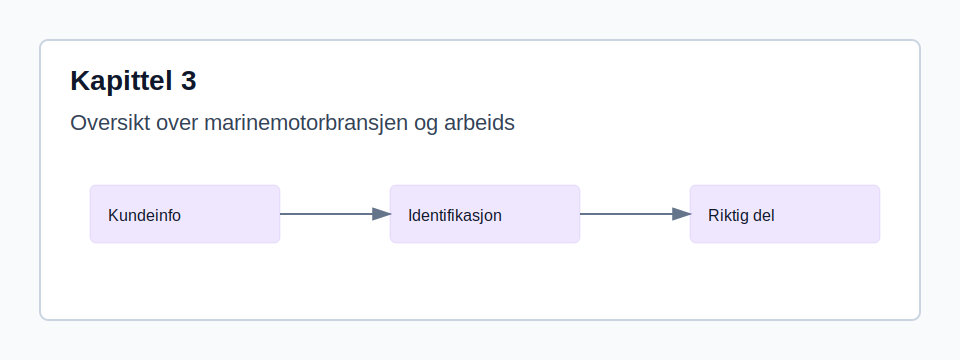

## Tekniske systemillustrasjoner

## Grundig forklaring
Hvordan verksteder, rederier, fiskeri, fritidsbåtmarked og leverandører samhandler må forstås både teknisk og praktisk. I marine reservedeler er det sjelden nok å vite hva kunden kaller delen. Medarbeideren må forstå hvilken funksjon delen har, hvor den sitter, hvilken motorvariant den tilhører, og hva som skjer dersom feil del bestilles. Derfor skal tekniske data, kundens beskrivelse og dokumentert katalogoppslag alltid vurderes sammen.

En god sak har fire kjennetegn: den har tydelig identifikasjon, tydelig problem- eller delbeskrivelse, tydelig beslutningsgrunnlag og tydelig oppfølging. Dersom ett av disse punktene mangler, skal saken markeres som usikker før kunden får et bindende svar.

## Praktisk verkstedeksempel
Et verksted står med demontert komponent og trenger rask avklaring. Medarbeideren registrerer kunde, fartøy, motorinformasjon og tidsfrist, ber om bilder av typeplate og komponent, sjekker katalog og lager, og sender et kort skriftlig svar med valgt del, grunnlag for valget og neste oppdateringstidspunkt.

## Kundesupporteksempel
Kunde: 'Motoren går dårlig, kan dere sende riktig del?' Profesjonelt svar: 'Vi kan hjelpe, men først må vi skille mellom symptom og delbehov. Send serienummer, bilde av motorplate, bilde av området feilen gjelder og en kort beskrivelse av når feilen oppstår. Da kan vi foreslå riktig del eller riktig neste feilsøkingstrinn.'

## Vanlige feil og årsaker
- feil eller ufullstendig serienummer.
- delnummer som er erstattet uten at saken dokumenteres.
- symptom som tolkes som delbehov uten feilsøking.
- kunde har bilde av lignende del, men ikke korrekt motorvariant.
- manglende avklaring av antall, side, posisjon eller leveringstid.

## Feilsøkingsflyt
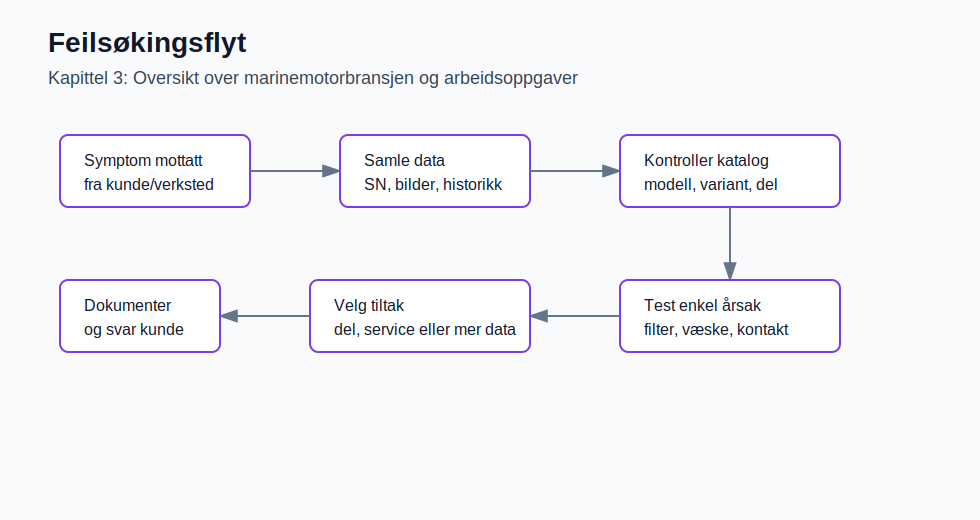

```mermaid
flowchart TD
    A[Symptom eller forespørsel mottatt] --> B[Samle serienummer, bilder og historikk]
    B --> C{Er motor og variant sikkert identifisert?}
    C -- Nei --> D[Be om mer dokumentasjon før del bekreftes]
    C -- Ja --> E[Kontroller delnummer og posisjon i katalog]
    E --> F{Stemmer symptom med foreslått del?}
    F -- Nei --> G[Foreslå feilsøking eller teknisk kontroll]
    F -- Ja --> H[Kontroller lager, pris og levering]
    H --> I[Send dokumentert kundesvar]
```

## Vedlikeholdsprosedyre
1. Avklar driftstimer, siste service og driftsmiljø.
2. Kontroller olje, filter, kjølevæske, sjøvannskrets, reimer, slanger og elektriske kontakter.
3. Sammenlign vedlikeholdsbehov med produsentens intervaller og faktisk bruk.
4. Anbefal servicekit når flere slitedeler bør skiftes samtidig.
5. Dokumenter hva som er anbefalt, hva kunden bestiller og eventuelle avvik fra normal prosedyre.

## Serienummeridentifikasjon
Serienummeridentifikasjon starter med å finne typeplate, motornummer eller annen unik identifikasjon. Be om bilde, ikke bare avskrift, fordi feil tegn, mellomrom og prefiks kan endre katalogoppslaget. Når serienummer ikke finnes, bygges identifikasjonen med modell, produksjonsår, bilder, tidligere fakturaer, servicehistorikk og delnummer fra monterte komponenter.

Minimumsdata bør være: fabrikat, modell, serienummer, eventuell product number/arrangement/CPL/motornummer, bilde av typeplate og bilde av motorens installasjon. Ved tvil skal saken stoppes for avklaring før del bekreftes.

## Reservedelsidentifikasjon
Reservedelsidentifikasjon skal bekrefte delnummer, posisjon, antall per motor, variant, side og eventuell erstatning. Dersom kunden oppgir et gammelt nummer, må det kontrolleres mot supersession. Dersom kunden bare sender bilde, skal bildet brukes som støtte, ikke som eneste grunnlag for bestilling.

Sjekk alltid om delnummeret gjelder enkeltkomponent, reparasjonssett, servicekit eller komplett enhet. Kontroller også om varen er høyre/venstre, gammel/ny type, standard/oversize eller knyttet til en bestemt produksjonsperiode.

## Bestillingsprosedyre
1. Opprett eller oppdater sak med kunde, fartøy, kontaktperson og tidsfrist.
2. Verifiser motoridentifikasjon og lagre bildedokumentasjon.
3. Finn korrekt delnummer i relevant katalog eller leverandørgrunnlag.
4. Kontroller supersession, antall, lagerstatus, pris, returvilkår og leveringstid.
5. Send ordrebekreftelse med delnummer, beskrivelse, antall, pris, levering og forbehold.
6. Følg opp leveransen til kunden har mottatt varen eller saken er lukket.

## Kvalitetspunkter før svar
- Har vi nok data til å gi et sikkert svar?
- Er delnummeret kontrollert mot riktig motorvariant?
- Er kundens tidsfrist realistisk med valgt fraktmåte?
- Er eventuelle forbehold skrevet tydelig?
- Kan en kollega forstå beslutningen ved å lese saken senere?

## Kapittelsammendrag
Hovedpoenget i kapittel 3 er at profesjonelt reservedelsarbeid krever struktur. Teknisk kunnskap, engelske fagtermer, praktisk feilsøking, dokumentasjon og kundedialog må henge sammen. Når medarbeideren jobber systematisk, reduseres feilbestillinger, kunden får bedre svar, og verkstedet kan planlegge arbeidet tryggere.

## Kryssreferanser
- For forrige tema, se kapittel 2: Rollen til ny medarbeider innen marine reservedeler.
- For neste tema, se kapittel 4: Viktigheten av nøyaktighet, sikkerhet og dokumentasjon.
- For grunnleggende identifikasjon, se kapittel 12 og 17.
- For merkevise eksempler, se kapitlene 26-32.

## Fordypning for intern opplæring
Dette kapitlet skal brukes som arbeidsstandard, ikke bare som lesestoff. Når en ny medarbeider møter en sak om bransje og arbeidsoppgaver, skal vedkommende trene på å gå rolig fra fakta til vurdering og deretter til handling. I en marinemotorforhandler er konsekvensen av en feil ofte større enn verdien av selve delen. En feil impeller, feil sensor, feil filterinnsats eller feil pakningssett kan føre til tapt verkstedtid, utsatt avgang, irritert kunde og i verste fall ny driftsstans. Derfor skal hver sak behandles som en teknisk beslutning med sporbar dokumentasjon.

Profesjonelt nivå i dette kapitlet betyr at medarbeideren kan arbeide sikkert med bransjeforståelse. Før kunden får et bindende svar, skal opplysningene i saken kontrolleres mot motorens identitet, faktisk installasjon og relevant produsentterminologi. Det praktiske målet er ikke å finne et raskt nummer, men å kunne forklare hvorfor valgt del, kontrollpunkt eller kundesvar er riktig for akkurat denne motoren. Når informasjon mangler, skal medarbeideren beskrive hva som mangler, hvorfor det er nødvendig, og hvilket neste steg som bringer saken videre.

## Tekniske forklaringer
Teknisk forståelse i dette kapitlet skal bygges rundt verksted, lager, leverandør, båtbygger, sluttkunde og produsentportal. Medarbeideren må skille mellom synlig symptom, sannsynlig systemfeil og bestillbar komponent. En del kan se riktig ut på bilde, men likevel være feil dersom posisjon, variant, rating, kjøleroppsett, elektrisk plugg, monteringsside eller servicehistorikk ikke stemmer. Derfor skal teknisk vurdering alltid kobles til både funksjon og dokumentasjon: hva gjør komponenten, hvilket system påvirker den, og hvilken produsentkilde bekrefter at den passer.

I praksis betyr dette at tekniske data skal kobles til motorens faktiske installasjon. Marine motorer står ofte trangt, er utsatt for salt, vibrasjon, fukt og ujevnt belastningsmønster, og de kan være bygget om gjennom mange år. En motor kan ha original kjøler, ettermontert eksosbend, alternativ dynamo, endret filterbrakett eller annen sjøvannspumpe enn standard. Slike forhold gjør at delidentifikasjon må bygge på både produsentdata og synlig dokumentasjon fra motoren.

Produsentterminologi er en del av den tekniske forståelsen. Bruk uttrykk som Serial Number, Engine Number, Part Number, Service Kit, Exploded View, Supersession når de er relevante. Ikke oversett dem på en måte som fjerner presisjon. Skriv for eksempel «Engine Serial Number (ESN)» første gang og deretter «ESN» i saken dersom produsenten bruker dette. Skriv «Arrangement Number» når CAT-data krever det, «Product Number» når Volvo Penta bruker det, «CPL» når Cummins-konfigurasjon må kontrolleres, og «Model Code» når Yanmar-identifikasjon bygger på modellkode. Dette gjør dialogen med internasjonale leverandører mer presis.

## Illustrasjonsforslag
- Oversiktsdiagram som viser hvor bransje og arbeidsoppgaver passer inn i total arbeidsflyt fra kundeforespørsel til levert del.
- Nærbilde av typeplate/motorskilt med markering av serienummer, motornummer, modell og eventuell variantkode.
- Sprengskisse med markert posisjon, delnummer, antall per motor og mulige alternative versjoner.
- Feilsøkingsflyt med beslutningspunkter: mangler data, stemmer symptom, kreves mer teknisk kontroll, kan ordre bekreftes.
- Sammenligningsbilde av gammel og ny del der forskjell i tilkobling, side, lengde eller sensorplugg er markert.

## Virkelige verkstedseksempler
Eksempel 1: Et verksted står med en demontert komponent på benken og kunden venter på avklaring før fartøyet kan settes tilbake i drift. Verkstedet sender et nærbilde av delen, men ingen motorplate. En uerfaren medarbeider kan bli fristet til å søke på nummeret som står på støpegodset. En profesjonell medarbeider svarer at støpenummer ikke nødvendigvis er bestillbart delnummer, ber om bilde av typeplate, oversiktsbilde av motoren og bilde av monteringsstedet, og forklarer at dette hindrer feilbestilling. Når informasjonen kommer, kontrolleres delnummer mot sprengskisse, posisjon og antall. Først da gis pris og leveringstid.

Eksempel 2: En kunde ringer sent på dagen og sier at motoren har høy temperatur etter service. Kunden ønsker ny termostat. Medarbeideren skal ikke automatisk konkludere med termostatfeil. Spørsmålene bør avklare om impeller er byttet, om sjøvannsfilteret er rent, om kjølevæskenivået er riktig, om alarmen kommer ved tomgang eller belastning, og om det finnes lekkasje rundt varmeveksler eller slanger. Dersom kunden likevel vil bestille termostat, dokumenteres at feilsøking er anbefalt, og delnummer kontrolleres mot serienummer før ordre.

Eksempel 3: En intern selger mottar en gammel faktura med et delnummer som ikke lenger finnes. Riktig prosess er å kontrollere supersession, se om ny del krever tilhørende pakning, boltsett eller adapter, og notere både gammelt og nytt nummer i saken. Kunden skal få vite at delen er erstattet, hva som leveres, og om det finnes monteringsforbehold.

## Reservedelsidentifisering i praksis
Reservedelsidentifisering skal følge en fast rekkefølge. Først kontrolleres motorens identitet. Deretter kontrolleres delens system: drivstoff, luft, kjøling, smøring, eksos, elektrisk eller mekanisk kraftoverføring. Så kontrolleres posisjon i sprengskisse eller parts list. Til slutt kontrolleres antall, variant, supersession og leveringsstatus. Denne rekkefølgen hindrer at medarbeideren hopper direkte fra kundens ord til et tilfeldig delnummer.

Når en del har synlig nummer, må nummeret tolkes riktig. Mange komponenter har produksjonsnummer, støpenummer, leverandørnummer eller revisjonskode som ikke er det samme som bestillbart part number. Et filter kan ha nummer fra filterprodusent, men motorprodusentens parts catalogue kan bruke et annet nummer. En pumpe kan ha nummer på lokk, hus og komplett enhet. Spør derfor alltid: gjelder nummeret komplett del, reparasjonssett, underkomponent eller produsentens råkomponent?

## Serienummer og motornummer
Serienummer og motornummer er grunnlaget for korrekt katalogoppslag. Be kunden sende bilde av typeplate eller dataplate. Dersom kunden skriver nummeret manuelt, skal nummeret likevel kontrolleres mot bilde når det er mulig. Noter hele nummeret, inkludert prefiks, suffiks, bindestrek, mellomrom og eventuelle bokstaver. På enkelte produsenter kan små forskjeller peke til forskjellig produksjonsperiode, rating eller konfigurasjon.

Bruk motornummer sammen med modell, variant og applikasjon. En motor som driver generator kan ha andre deler enn en fremdriftsmotor. En motor i yrkesbåt kan ha annen rating enn samme motor i fritidsbåt. En eldre motor kan være bygget om med ny dynamo, annen sjøvannspumpe eller uoriginal filterbrakett. Dersom typeplate mangler, bygg identifikasjonen gjennom flere kilder: servicebok, tidligere faktura, bilder av motorens sider, nummer på pumpe, filter, turbo og gear, samt opplysninger om fartøy og produksjonsår.

## Feilsøking steg for steg
1. Definer symptomet med kundens egne ord og skriv det i saken. Skill mellom «kunden ønsker del» og «kunden beskriver feil».
2. Avklar når feilen oppstår: start, tomgang, belastning, marsjfart, varm motor, kald motor eller etter nylig service.
3. Kontroller grunnleggende forhold: væskenivå, filter, luft i drivstoff, sjøvannsstrøm, reimer, elektriske kontakter, sikringer og synlige lekkasjer.
4. Knytt symptomet til system: lav effekt peker ofte mot luft/drivstoff/eksos, høy temperatur mot kjøling, lavt oljetrykk mot smøring/sensor, startproblem mot batteri/starter/gløding/drivstoff.
5. Be om bilder eller måledata dersom symptomet ikke kan kobles sikkert til en del. Dette kan være bilde av alarmdisplay, trykkmåling, temperaturmåling eller bilde av montert komponent.
6. Kontroller relevant delnummer mot serienummer og variant. Dersom flere alternativer finnes, forklar kunden hva som skiller dem.
7. Dokumenter anbefalt tiltak, usikkerhet og eventuelle forbehold før ordre bekreftes.

## Vedlikehold
Vedlikehold skal vurderes mot driftstimer, produsentens maintenance schedule og faktisk driftsmiljø. Marine motorer som går korte turer, mye tomgang eller i salt miljø kan trenge hyppigere kontroll enn standard intervall antyder. Nye medarbeidere skal lære å spørre om siste service, hvilke filter som ble byttet, hvilken olje som ble brukt, om impeller er kontrollert, og om kjølevæske eller anoder er byttet etter plan.

En god vedlikeholdsanbefaling er konkret. I stedet for å skrive «ta service», bør medarbeideren foreslå relevante deler: olje- og drivstoffilter, luftfilter, impeller, reim, pakninger, anoder, kjølevæske og eventuelt servicekit. Dersom kunden har ukjent servicehistorikk, bør komplett servicekit vurderes. Dersom kunden har hatt overoppheting, bør sjøvannskrets og varmeveksler kontrolleres før bare én komponent byttes.

## Vanlige feil
- Serienummer leses feil fordi et tegn forveksles, for eksempel O/0 eller I/1.
- Kunden oppgir modellnavn, men ikke variant, rating eller applikasjon.
- Del velges ut fra bilde alene uten kontroll mot sprengskisse eller produsentkatalog.
- Supersession aksepteres uten å kontrollere om ny del krever tilbehør, pakning eller ombygging.
- Hastepress gjør at leveringsløfte gis før lagerstatus og fraktmulighet er bekreftet.
- Saksnotat mangler grunnlaget for beslutningen, slik at kollega ikke kan etterprøve valget.

## Kontrollspørsmål
- Hva er den viktigste tekniske risikoen i en sak som gjelder bransje og arbeidsoppgaver?
- Hvilke opplysninger må dokumenteres før bindende delnummer bekreftes?
- Hvordan forklarer du kunden hvorfor bilde av typeplate er nødvendig?
- Når bør du stoppe en ordre og be om mer dokumentasjon?
- Hvilke engelske produsentuttrykk bør du kunne bruke i denne typen sak?
- Hvordan dokumenterer du at et delnummer er erstattet av et nytt nummer?

## Praktisk sjekkliste for medarbeider
- Les saken som om en kollega skal overta den i morgen.
- Kontroller at motoridentifikasjon er dokumentert med bilde eller sikker kilde.
- Sjekk at delnummeret er knyttet til riktig posisjon i katalogen.
- Skriv tydelig om kunden har bedt om enkeltkomponent, servicekit eller komplett enhet.
- Noter om varen er spesialbestilling, utgått, erstattet eller ikke returbar.
- Send kundesvar med neste steg, ikke bare et løst delnummer.

## Kapittelspesifikk systemforståelse
For dette kapitlet er kjernen å forstå samspillet mellom fartøy, verksted, rederi, importør, produsent og transportør. Medarbeideren skal kunne forklare dette med praktiske ord til både kunde og kollega. Det betyr at teknisk teori må kobles til konkrete handlinger: hvilke data skal innhentes, hvilke komponenter kan være berørt, hvilken produsentterminologi skal brukes, og hva må dokumenteres før saken kan gå videre. Marine kunder kjøper ikke bare deler; de kjøper driftssikkerhet og forutsigbar nedetid.

Når systemet vurderes, skal medarbeideren først plassere problemet i riktig teknisk sammenheng. Dersom kunden beskriver en alarm, må man finne ut om alarmen kommer fra reelt mekanisk avvik, elektrisk sensorfeil, feil etter service eller feil tolkning av instrumentet. Dersom kunden beskriver en del, må man avklare om kunden mener komplett enhet, servicekit, reparasjonssett eller enkeltkomponent. Dersom kunden beskriver motoren med vanlig navn, må man kontrollere om produsenten bruker mer presise begreper i katalogen.

## Komponentoversikt og arbeidsgrense
Relevante komponenter og opplysninger i dette kapitlet omfatter: fartøytype, driftsprofil, klassekrav, havnefrist, verkstedkapasitet og reservedelslager. Listen er ikke ment som en erstatning for produsentens parts catalogue, men som en praktisk påminnelse om hva nye medarbeidere skal tenke på før de søker del. I interne saker skal komponentnavn skrives så presist som mulig. Bruk for eksempel «sjøvannspumpe / raw water pump» i stedet for bare «pumpe» når funksjonen er kjent, og «varmeveksler / heat exchanger» i stedet for bare «kjøler» når det er den komponenten saken gjelder.

Arbeidsgrensen for en reservedelsmedarbeider er også viktig. Medarbeideren skal ikke overta mekanikerens ansvar for demontering, måling eller diagnose på motoren, men skal kunne stille riktige spørsmål og foreslå riktig dokumentasjon. Når en sak går fra enkel delidentifikasjon til teknisk diagnose, skal dette markeres i saken. Da kan verksted, teknisk ansvarlig eller leverandør involveres med et klart spørsmål og et ryddig faktagrunnlag.

## Praktisk beslutningsregel
Bruk denne regelen i alle saker knyttet til kapitlet: Hvis motoridentifikasjon, komponentposisjon eller symptom ikke er sikkert nok dokumentert, skal medarbeideren ikke gi bindende delbekreftelse. Kunden kan få et foreløpig svar, men svaret må inneholde hva som mangler, hvorfor det mangler, og hva som skjer når informasjonen er mottatt. Dette er ikke treg service; det er profesjonell risikokontroll.

## Realistisk opplæring i praksis
### Verkstedhistorie
En typisk sak i dette temaet starter med verksted, lager og kunde har ulik informasjon. Verkstedet trenger et raskt svar, men den erfarne medarbeideren stopper opp og spør først: hva vet vi sikkert, hva antar vi, og hva kan gi følgeskade hvis vi tar feil? I praksis betyr det at arbeidsflyt mellom aktørene må kobles til bilde, serienummer, komponentposisjon og kundens symptom før saken lukkes. Historien skal brukes i opplæring som en øvelse i å skrive et kort saksnotat: observasjon, vurdering, neste handling og forbehold.

### Kundehistorie
Kunden beskriver ofte problemet med driftsspråk: «motoren går tungt», «alarm kommer etter ti minutter», «jeg trenger den samme delen som sist» eller «båten skal ut i morgen». En profesjonell respons er rolig og konkret: bekreft behovet, forklar hvorfor identifikasjon trengs, be om riktig dokumentasjon og gi et realistisk tidspunkt for neste svar. Ikke korriger kunden unødvendig; oversett kundens språk til teknisk språk i saken.

### Typiske feil nye ansatte gjør
- søker på første synlige nummer uten å avklare om det er støpenummer, leverandørnummer eller bestillbart part number.
- lover levering før lagerstatus, frakt og returvilkår er kontrollert.
- antar at tidligere faktura alltid gjelder samme motorvariant.
- blander symptom og årsak, spesielt ved varme, lav effekt, startproblem og alarm.
- skriver for korte notater slik at kollega ikke kan forstå hvorfor valget ble tatt.

### Tips fra erfarne mekanikere og reservedelsselgere
- Se alltid etter systemet rundt delen: slanger, braketter, sensorer, reimer, kjølere og tilkoblinger forteller ofte mer enn delen alene.
- Still ett presist spørsmål om gangen når kunden er stresset; mange dårlige svar kommer av for lange spørsmålslister.
- Sammenlign gammel og ny del mot funksjon, ikke bare form. Riktig del skal passe, men også løse riktig problem.
- En erfaren reservedelsselger tenker i risiko: Hva er billigst å avklare nå, og hva blir dyrt hvis vi hopper over det?

### Vanlige kundespørsmål
| Spørsmål fra kunde | Profesjonelt svar |
|---|---|
| «Kan du bare sende samme del som sist?» | «Ja, hvis vi først bekrefter at det gjelder samme motor, samme posisjon og ingen supersession siden sist.» |
| «Holder det med bilde?» | «Bilde hjelper, men vi trenger også motoridentitet for å sikre variant og delnummer.» |
| «Hvorfor tar dette tid?» | «Fordi feil del kan gi ny driftsstans. Vi kontrollerer grunnlaget før vi lover levering.» |

### Beslutningstre for saken
| Trinn | Spørsmål | Handling |
|---|---|---|
| 1 | Er motoridentitet dokumentert med bilde eller sikker historikk? | Hvis nei: be om typeplate/dataplate eller alternativ dokumentasjon. |
| 2 | Er komponentens funksjon og posisjon kjent? | Hvis nei: be om oversiktsbilde og bilde av monteringssted. |
| 3 | Stemmer kundens symptom med delen som ønskes? | Hvis nei: anbefal feilsøking før del bestilles. |
| 4 | Finnes det supersession, kit eller variantvalg? | Kontroller produsentkilde og skriv forbehold i saken. |
| 5 | Kan pris, levering og returvilkår bekreftes? | Send dokumentert svar med neste steg og tydelig gyldighet. |

### Rask oppslagstabell
| Situasjon | Kontroller først | Vanlig fallgruve |
|---|---|---|
| Hasteordre | sikker motor-ID, lager, fraktfrist | levering loves før teknisk kontroll |
| Del fra bilde | posisjon, skala, tilkoblinger, nummer | bilde brukes som eneste beslutningsgrunnlag |
| Gammelt delnummer | supersession og kitinnhold | ny del krever ekstra pakning eller adapter |
| Uklart symptom | driftssituasjon, alarm, siste service | symptom blir tolket som sikker komponentfeil |

### Praktisk sjekkliste og inspeksjonsrutine
- Start med motoridentitet: fabrikat, modell, serienummer, variant, applikasjon og bilde av skilt.
- Kontroller området rundt komponenten: lekkasje, korrosjon, knekte fester, slitasje, varmemerker og uoriginale endringer.
- Spør om siste vedlikehold: olje, filter, impeller, reimer, kjølevæske, anoder og drivstoffilter.
- Noter driftstype: fritidsbruk, yrkesbruk, generator, fremdrift, tomgangsdrift eller langvarig høy belastning.
- Avklar om saken gjelder akutt drift, planlagt service, reklamasjon eller lagerpåfyll.

### Generelle vedlikeholdsintervaller som opplæringspunkt
| Kontrollpunkt | Typisk vurdering i opplæring | Må verifiseres |
|---|---|---|
| Olje og oljefilter | ofte basert på timer og kalender | produsentens maintenance schedule |
| Drivstoffilter/vannutskiller | hyppigere ved dårlig drivstoff eller sesongstart | motor- og filterspesifikasjon |
| Impeller og sjøvannskrets | kontrolleres særlig før sesong og etter varmgang | produsentens intervall og installasjon |
| Reimer, slanger og klemmer | visuell kontroll ved service og feilsøking | dimensjon, stramming og delnummer |

### Produsentverifikasjon
Alle konkrete delnumre, momentverdier, serviceintervaller, garantikrav, programvaredata og produsentspesifikke grenser skal kontrolleres mot offisiell produsentdokumentasjon før de brukes i tilbud, ordre eller verkstedinstruks. Marker tydelig i saken når svaret bygger på antakelse, eldre historikk, bilde uten motor-ID eller generell erfaring. Intervaller i tabellen er generelle opplæringspunkter. Faktiske intervaller styres av produsent, motorvariant, driftstimer, kalenderkrav, belastning og miljø.

## Produsentverifikasjon og faglig forbehold
Denne manualen skal brukes som intern opplæring og arbeidsmetode. Produsentspesifikke delnumre, intervaller, momentverdier, garantikrav og tekniske grenseverdier skal verifiseres mot gjeldende produsentdokumentasjon før de brukes i kundeordre eller verkstedinstruks. Marker saken internt dersom opplysningen bygger på antakelse, eldre historikk eller bilde uten bekreftet motoridentitet.

## Quiz med fasit
1. Hvilke tekniske data bør alltid samles før en del bekreftes?
2. Hvorfor er engelsk terminologi viktig i marine reservedeler?
3. Hva bør gjøres dersom kunden bare sender et bilde av delen?
4. Hvilke punkter bør kontrolleres før ordrebekreftelse sendes?
5. Hvorfor skal feilsøking dokumenteres, selv når kunden allerede ber om en bestemt del?

### Svar
1. Fabrikat, modell, serienummer, variantdata, bilde av typeplate, delnummer, posisjon og kundens symptombeskrivelse.
2. Fordi kataloger, portaler, servicemanualer og leverandørdialog ofte bruker engelske begreper som må forstås presist.
3. Be om serienummer, oversiktsbilde av motoren og eventuelle nummer på delen; bildet brukes som støtte, ikke eneste grunnlag.
4. Delnummer, antall, variant, pris, lagerstatus, leveringstid, frakt, returvilkår og eventuelle forbehold.
5. Fordi symptomet kan ha flere årsaker, og dokumentasjon viser hvorfor anbefalingen ble gitt.

---

# Kapittel 4: Viktigheten av nøyaktighet, sikkerhet og dokumentasjon

## Kapittelrolle
Dette kapitlet gir en grundig praktisk innføring i nøyaktighet og sikkerhet. Temaet er viktig fordi reservedelsarbeid i marine miljøer kombinerer teknisk forståelse, presis kundedialog, dokumentert saksbehandling og realistisk leveranseoppfølging. Målet er at en ny medarbeider skal kunne bruke kunnskapen direkte i arbeid med verksted, kunde, lager og leverandør.

## Læringsmål
Etter kapitlet skal deltakeren kunne:
- forklare hovedbegrepene innen nøyaktighet og sikkerhet
- bruke serienummer, modellinformasjon og delnummer i praktisk reservedelsarbeid
- kommunisere trygt med kunde, verksted, lager og leverandør
- dokumentere beslutninger slik at andre kan etterprøve saken
- kjenne igjen vanlige feil og velge riktig neste handling

## English technical terminology
- **Serial Number:** engelsk fagterm som ofte brukes i kataloger, servicelitteratur, leverandørportaler og internasjonal kundedialog.
- **Part Number:** engelsk fagterm som ofte brukes i kataloger, servicelitteratur, leverandørportaler og internasjonal kundedialog.
- **Engine Model:** engelsk fagterm som ofte brukes i kataloger, servicelitteratur, leverandørportaler og internasjonal kundedialog.
- **Variant:** engelsk fagterm som ofte brukes i kataloger, servicelitteratur, leverandørportaler og internasjonal kundedialog.
- **Service Kit:** engelsk fagterm som ofte brukes i kataloger, servicelitteratur, leverandørportaler og internasjonal kundedialog.
- **Troubleshooting:** engelsk fagterm som ofte brukes i kataloger, servicelitteratur, leverandørportaler og internasjonal kundedialog.
- **Maintenance:** engelsk fagterm som ofte brukes i kataloger, servicelitteratur, leverandørportaler og internasjonal kundedialog.
- **Ordering Procedure:** engelsk fagterm som ofte brukes i kataloger, servicelitteratur, leverandørportaler og internasjonal kundedialog.
- **Supersession:** engelsk fagterm som ofte brukes i kataloger, servicelitteratur, leverandørportaler og internasjonal kundedialog.
- **Technical Support:** engelsk fagterm som ofte brukes i kataloger, servicelitteratur, leverandørportaler og internasjonal kundedialog.

## Hoveddiagram
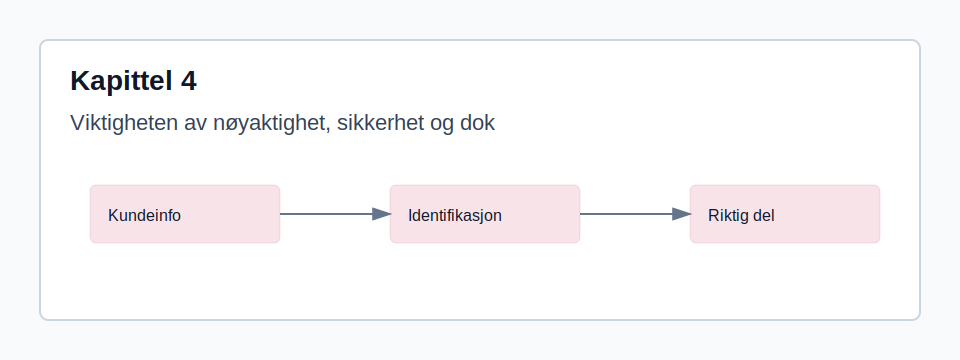

## Tekniske systemillustrasjoner

## Grundig forklaring
Hvorfor små feil i informasjon, hms eller dokumentasjon kan gi store praktiske konsekvenser må forstås både teknisk og praktisk. I marine reservedeler er det sjelden nok å vite hva kunden kaller delen. Medarbeideren må forstå hvilken funksjon delen har, hvor den sitter, hvilken motorvariant den tilhører, og hva som skjer dersom feil del bestilles. Derfor skal tekniske data, kundens beskrivelse og dokumentert katalogoppslag alltid vurderes sammen.

En god sak har fire kjennetegn: den har tydelig identifikasjon, tydelig problem- eller delbeskrivelse, tydelig beslutningsgrunnlag og tydelig oppfølging. Dersom ett av disse punktene mangler, skal saken markeres som usikker før kunden får et bindende svar.

## Praktisk verkstedeksempel
Et verksted står med demontert komponent og trenger rask avklaring. Medarbeideren registrerer kunde, fartøy, motorinformasjon og tidsfrist, ber om bilder av typeplate og komponent, sjekker katalog og lager, og sender et kort skriftlig svar med valgt del, grunnlag for valget og neste oppdateringstidspunkt.

## Kundesupporteksempel
Kunde: 'Motoren går dårlig, kan dere sende riktig del?' Profesjonelt svar: 'Vi kan hjelpe, men først må vi skille mellom symptom og delbehov. Send serienummer, bilde av motorplate, bilde av området feilen gjelder og en kort beskrivelse av når feilen oppstår. Da kan vi foreslå riktig del eller riktig neste feilsøkingstrinn.'

## Vanlige feil og årsaker
- feil eller ufullstendig serienummer.
- delnummer som er erstattet uten at saken dokumenteres.
- symptom som tolkes som delbehov uten feilsøking.
- kunde har bilde av lignende del, men ikke korrekt motorvariant.
- manglende avklaring av antall, side, posisjon eller leveringstid.

## Feilsøkingsflyt
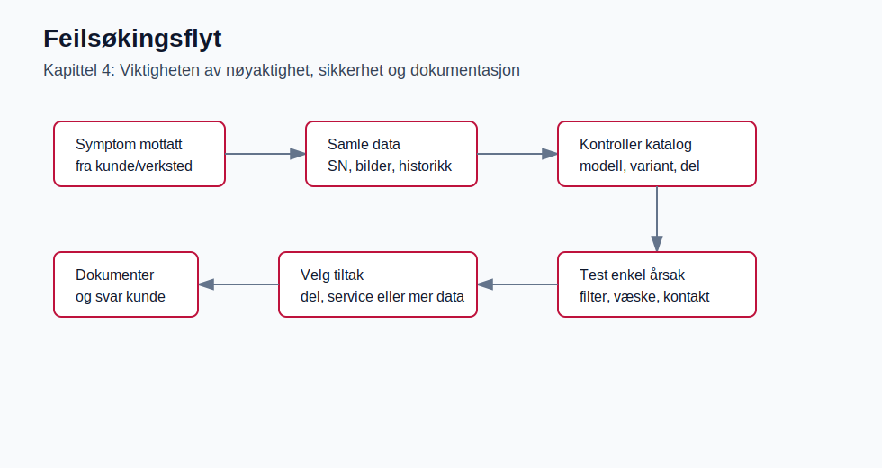

```mermaid
flowchart TD
    A[Symptom eller forespørsel mottatt] --> B[Samle serienummer, bilder og historikk]
    B --> C{Er motor og variant sikkert identifisert?}
    C -- Nei --> D[Be om mer dokumentasjon før del bekreftes]
    C -- Ja --> E[Kontroller delnummer og posisjon i katalog]
    E --> F{Stemmer symptom med foreslått del?}
    F -- Nei --> G[Foreslå feilsøking eller teknisk kontroll]
    F -- Ja --> H[Kontroller lager, pris og levering]
    H --> I[Send dokumentert kundesvar]
```

## Vedlikeholdsprosedyre
1. Avklar driftstimer, siste service og driftsmiljø.
2. Kontroller olje, filter, kjølevæske, sjøvannskrets, reimer, slanger og elektriske kontakter.
3. Sammenlign vedlikeholdsbehov med produsentens intervaller og faktisk bruk.
4. Anbefal servicekit når flere slitedeler bør skiftes samtidig.
5. Dokumenter hva som er anbefalt, hva kunden bestiller og eventuelle avvik fra normal prosedyre.

## Serienummeridentifikasjon
Serienummeridentifikasjon starter med å finne typeplate, motornummer eller annen unik identifikasjon. Be om bilde, ikke bare avskrift, fordi feil tegn, mellomrom og prefiks kan endre katalogoppslaget. Når serienummer ikke finnes, bygges identifikasjonen med modell, produksjonsår, bilder, tidligere fakturaer, servicehistorikk og delnummer fra monterte komponenter.

Minimumsdata bør være: fabrikat, modell, serienummer, eventuell product number/arrangement/CPL/motornummer, bilde av typeplate og bilde av motorens installasjon. Ved tvil skal saken stoppes for avklaring før del bekreftes.

## Reservedelsidentifikasjon
Reservedelsidentifikasjon skal bekrefte delnummer, posisjon, antall per motor, variant, side og eventuell erstatning. Dersom kunden oppgir et gammelt nummer, må det kontrolleres mot supersession. Dersom kunden bare sender bilde, skal bildet brukes som støtte, ikke som eneste grunnlag for bestilling.

Sjekk alltid om delnummeret gjelder enkeltkomponent, reparasjonssett, servicekit eller komplett enhet. Kontroller også om varen er høyre/venstre, gammel/ny type, standard/oversize eller knyttet til en bestemt produksjonsperiode.

## Bestillingsprosedyre
1. Opprett eller oppdater sak med kunde, fartøy, kontaktperson og tidsfrist.
2. Verifiser motoridentifikasjon og lagre bildedokumentasjon.
3. Finn korrekt delnummer i relevant katalog eller leverandørgrunnlag.
4. Kontroller supersession, antall, lagerstatus, pris, returvilkår og leveringstid.
5. Send ordrebekreftelse med delnummer, beskrivelse, antall, pris, levering og forbehold.
6. Følg opp leveransen til kunden har mottatt varen eller saken er lukket.

## Kvalitetspunkter før svar
- Har vi nok data til å gi et sikkert svar?
- Er delnummeret kontrollert mot riktig motorvariant?
- Er kundens tidsfrist realistisk med valgt fraktmåte?
- Er eventuelle forbehold skrevet tydelig?
- Kan en kollega forstå beslutningen ved å lese saken senere?

## Kapittelsammendrag
Hovedpoenget i kapittel 4 er at profesjonelt reservedelsarbeid krever struktur. Teknisk kunnskap, engelske fagtermer, praktisk feilsøking, dokumentasjon og kundedialog må henge sammen. Når medarbeideren jobber systematisk, reduseres feilbestillinger, kunden får bedre svar, og verkstedet kan planlegge arbeidet tryggere.

## Kryssreferanser
- For forrige tema, se kapittel 3: Oversikt over marinemotorbransjen og arbeidsoppgaver.
- For neste tema, se kapittel 5: Vanlige termer og begreper i marine service.
- For grunnleggende identifikasjon, se kapittel 12 og 17.
- For merkevise eksempler, se kapitlene 26-32.

## Fordypning for intern opplæring
Dette kapitlet skal brukes som arbeidsstandard, ikke bare som lesestoff. Når en ny medarbeider møter en sak om nøyaktighet, sikkerhet og dokumentasjon, skal vedkommende trene på å gå rolig fra fakta til vurdering og deretter til handling. I en marinemotorforhandler er konsekvensen av en feil ofte større enn verdien av selve delen. En feil impeller, feil sensor, feil filterinnsats eller feil pakningssett kan føre til tapt verkstedtid, utsatt avgang, irritert kunde og i verste fall ny driftsstans. Derfor skal hver sak behandles som en teknisk beslutning med sporbar dokumentasjon.

Profesjonelt nivå i dette kapitlet betyr at medarbeideren kan arbeide sikkert med nøyaktighet og sikker dokumentasjon. Før kunden får et bindende svar, skal opplysningene i saken kontrolleres mot motorens identitet, faktisk installasjon og relevant produsentterminologi. Det praktiske målet er ikke å finne et raskt nummer, men å kunne forklare hvorfor valgt del, kontrollpunkt eller kundesvar er riktig for akkurat denne motoren. Når informasjon mangler, skal medarbeideren beskrive hva som mangler, hvorfor det er nødvendig, og hvilket neste steg som bringer saken videre.

## Tekniske forklaringer
Teknisk forståelse i dette kapitlet skal bygges rundt sporbarhet, HMS, teknisk risiko, skriftlige forbehold og kontroll før levering. Medarbeideren må skille mellom synlig symptom, sannsynlig systemfeil og bestillbar komponent. En del kan se riktig ut på bilde, men likevel være feil dersom posisjon, variant, rating, kjøleroppsett, elektrisk plugg, monteringsside eller servicehistorikk ikke stemmer. Derfor skal teknisk vurdering alltid kobles til både funksjon og dokumentasjon: hva gjør komponenten, hvilket system påvirker den, og hvilken produsentkilde bekrefter at den passer.

I praksis betyr dette at tekniske data skal kobles til motorens faktiske installasjon. Marine motorer står ofte trangt, er utsatt for salt, vibrasjon, fukt og ujevnt belastningsmønster, og de kan være bygget om gjennom mange år. En motor kan ha original kjøler, ettermontert eksosbend, alternativ dynamo, endret filterbrakett eller annen sjøvannspumpe enn standard. Slike forhold gjør at delidentifikasjon må bygge på både produsentdata og synlig dokumentasjon fra motoren.

Produsentterminologi er en del av den tekniske forståelsen. Bruk uttrykk som Serial Number, Engine Number, Part Number, Service Kit, Exploded View, Supersession når de er relevante. Ikke oversett dem på en måte som fjerner presisjon. Skriv for eksempel «Engine Serial Number (ESN)» første gang og deretter «ESN» i saken dersom produsenten bruker dette. Skriv «Arrangement Number» når CAT-data krever det, «Product Number» når Volvo Penta bruker det, «CPL» når Cummins-konfigurasjon må kontrolleres, og «Model Code» når Yanmar-identifikasjon bygger på modellkode. Dette gjør dialogen med internasjonale leverandører mer presis.

## Illustrasjonsforslag
- Oversiktsdiagram som viser hvor nøyaktighet, sikkerhet og dokumentasjon passer inn i total arbeidsflyt fra kundeforespørsel til levert del.
- Nærbilde av typeplate/motorskilt med markering av serienummer, motornummer, modell og eventuell variantkode.
- Sprengskisse med markert posisjon, delnummer, antall per motor og mulige alternative versjoner.
- Feilsøkingsflyt med beslutningspunkter: mangler data, stemmer symptom, kreves mer teknisk kontroll, kan ordre bekreftes.
- Sammenligningsbilde av gammel og ny del der forskjell i tilkobling, side, lengde eller sensorplugg er markert.

## Virkelige verkstedseksempler
Eksempel 1: Et verksted står med en demontert komponent på benken og kunden venter på avklaring før fartøyet kan settes tilbake i drift. Verkstedet sender et nærbilde av delen, men ingen motorplate. En uerfaren medarbeider kan bli fristet til å søke på nummeret som står på støpegodset. En profesjonell medarbeider svarer at støpenummer ikke nødvendigvis er bestillbart delnummer, ber om bilde av typeplate, oversiktsbilde av motoren og bilde av monteringsstedet, og forklarer at dette hindrer feilbestilling. Når informasjonen kommer, kontrolleres delnummer mot sprengskisse, posisjon og antall. Først da gis pris og leveringstid.

Eksempel 2: En kunde ringer sent på dagen og sier at motoren har høy temperatur etter service. Kunden ønsker ny termostat. Medarbeideren skal ikke automatisk konkludere med termostatfeil. Spørsmålene bør avklare om impeller er byttet, om sjøvannsfilteret er rent, om kjølevæskenivået er riktig, om alarmen kommer ved tomgang eller belastning, og om det finnes lekkasje rundt varmeveksler eller slanger. Dersom kunden likevel vil bestille termostat, dokumenteres at feilsøking er anbefalt, og delnummer kontrolleres mot serienummer før ordre.

Eksempel 3: En intern selger mottar en gammel faktura med et delnummer som ikke lenger finnes. Riktig prosess er å kontrollere supersession, se om ny del krever tilhørende pakning, boltsett eller adapter, og notere både gammelt og nytt nummer i saken. Kunden skal få vite at delen er erstattet, hva som leveres, og om det finnes monteringsforbehold.

## Reservedelsidentifisering i praksis
Reservedelsidentifisering skal følge en fast rekkefølge. Først kontrolleres motorens identitet. Deretter kontrolleres delens system: drivstoff, luft, kjøling, smøring, eksos, elektrisk eller mekanisk kraftoverføring. Så kontrolleres posisjon i sprengskisse eller parts list. Til slutt kontrolleres antall, variant, supersession og leveringsstatus. Denne rekkefølgen hindrer at medarbeideren hopper direkte fra kundens ord til et tilfeldig delnummer.

Når en del har synlig nummer, må nummeret tolkes riktig. Mange komponenter har produksjonsnummer, støpenummer, leverandørnummer eller revisjonskode som ikke er det samme som bestillbart part number. Et filter kan ha nummer fra filterprodusent, men motorprodusentens parts catalogue kan bruke et annet nummer. En pumpe kan ha nummer på lokk, hus og komplett enhet. Spør derfor alltid: gjelder nummeret komplett del, reparasjonssett, underkomponent eller produsentens råkomponent?

## Serienummer og motornummer
Serienummer og motornummer er grunnlaget for korrekt katalogoppslag. Be kunden sende bilde av typeplate eller dataplate. Dersom kunden skriver nummeret manuelt, skal nummeret likevel kontrolleres mot bilde når det er mulig. Noter hele nummeret, inkludert prefiks, suffiks, bindestrek, mellomrom og eventuelle bokstaver. På enkelte produsenter kan små forskjeller peke til forskjellig produksjonsperiode, rating eller konfigurasjon.

Bruk motornummer sammen med modell, variant og applikasjon. En motor som driver generator kan ha andre deler enn en fremdriftsmotor. En motor i yrkesbåt kan ha annen rating enn samme motor i fritidsbåt. En eldre motor kan være bygget om med ny dynamo, annen sjøvannspumpe eller uoriginal filterbrakett. Dersom typeplate mangler, bygg identifikasjonen gjennom flere kilder: servicebok, tidligere faktura, bilder av motorens sider, nummer på pumpe, filter, turbo og gear, samt opplysninger om fartøy og produksjonsår.

## Feilsøking steg for steg
1. Definer symptomet med kundens egne ord og skriv det i saken. Skill mellom «kunden ønsker del» og «kunden beskriver feil».
2. Avklar når feilen oppstår: start, tomgang, belastning, marsjfart, varm motor, kald motor eller etter nylig service.
3. Kontroller grunnleggende forhold: væskenivå, filter, luft i drivstoff, sjøvannsstrøm, reimer, elektriske kontakter, sikringer og synlige lekkasjer.
4. Knytt symptomet til system: lav effekt peker ofte mot luft/drivstoff/eksos, høy temperatur mot kjøling, lavt oljetrykk mot smøring/sensor, startproblem mot batteri/starter/gløding/drivstoff.
5. Be om bilder eller måledata dersom symptomet ikke kan kobles sikkert til en del. Dette kan være bilde av alarmdisplay, trykkmåling, temperaturmåling eller bilde av montert komponent.
6. Kontroller relevant delnummer mot serienummer og variant. Dersom flere alternativer finnes, forklar kunden hva som skiller dem.
7. Dokumenter anbefalt tiltak, usikkerhet og eventuelle forbehold før ordre bekreftes.

## Vedlikehold
Vedlikehold skal vurderes mot driftstimer, produsentens maintenance schedule og faktisk driftsmiljø. Marine motorer som går korte turer, mye tomgang eller i salt miljø kan trenge hyppigere kontroll enn standard intervall antyder. Nye medarbeidere skal lære å spørre om siste service, hvilke filter som ble byttet, hvilken olje som ble brukt, om impeller er kontrollert, og om kjølevæske eller anoder er byttet etter plan.

En god vedlikeholdsanbefaling er konkret. I stedet for å skrive «ta service», bør medarbeideren foreslå relevante deler: olje- og drivstoffilter, luftfilter, impeller, reim, pakninger, anoder, kjølevæske og eventuelt servicekit. Dersom kunden har ukjent servicehistorikk, bør komplett servicekit vurderes. Dersom kunden har hatt overoppheting, bør sjøvannskrets og varmeveksler kontrolleres før bare én komponent byttes.

## Vanlige feil
- Serienummer leses feil fordi et tegn forveksles, for eksempel O/0 eller I/1.
- Kunden oppgir modellnavn, men ikke variant, rating eller applikasjon.
- Del velges ut fra bilde alene uten kontroll mot sprengskisse eller produsentkatalog.
- Supersession aksepteres uten å kontrollere om ny del krever tilbehør, pakning eller ombygging.
- Hastepress gjør at leveringsløfte gis før lagerstatus og fraktmulighet er bekreftet.
- Saksnotat mangler grunnlaget for beslutningen, slik at kollega ikke kan etterprøve valget.

## Kontrollspørsmål
- Hva er den viktigste tekniske risikoen i en sak som gjelder nøyaktighet, sikkerhet og dokumentasjon?
- Hvilke opplysninger må dokumenteres før bindende delnummer bekreftes?
- Hvordan forklarer du kunden hvorfor bilde av typeplate er nødvendig?
- Når bør du stoppe en ordre og be om mer dokumentasjon?
- Hvilke engelske produsentuttrykk bør du kunne bruke i denne typen sak?
- Hvordan dokumenterer du at et delnummer er erstattet av et nytt nummer?

## Praktisk sjekkliste for medarbeider
- Les saken som om en kollega skal overta den i morgen.
- Kontroller at motoridentifikasjon er dokumentert med bilde eller sikker kilde.
- Sjekk at delnummeret er knyttet til riktig posisjon i katalogen.
- Skriv tydelig om kunden har bedt om enkeltkomponent, servicekit eller komplett enhet.
- Noter om varen er spesialbestilling, utgått, erstattet eller ikke returbar.
- Send kundesvar med neste steg, ikke bare et løst delnummer.

## Kapittelspesifikk systemforståelse
For dette kapitlet er kjernen å forstå sammenhengen mellom nøyaktig informasjon, sikker montering og sporbar dokumentasjon. Medarbeideren skal kunne forklare dette med praktiske ord til både kunde og kollega. Det betyr at teknisk teori må kobles til konkrete handlinger: hvilke data skal innhentes, hvilke komponenter kan være berørt, hvilken produsentterminologi skal brukes, og hva må dokumenteres før saken kan gå videre. Feil dokumentasjon kan være like alvorlig som feil del når saken senere skal kontrolleres.

Når systemet vurderes, skal medarbeideren først plassere problemet i riktig teknisk sammenheng. Dersom kunden beskriver en alarm, må man finne ut om alarmen kommer fra reelt mekanisk avvik, elektrisk sensorfeil, feil etter service eller feil tolkning av instrumentet. Dersom kunden beskriver en del, må man avklare om kunden mener komplett enhet, servicekit, reparasjonssett eller enkeltkomponent. Dersom kunden beskriver motoren med vanlig navn, må man kontrollere om produsenten bruker mer presise begreper i katalogen.

## Komponentoversikt og arbeidsgrense
Relevante komponenter og opplysninger i dette kapitlet omfatter: HMS-data, teknisk dokumentasjon, bilder, serienummer, risikovurdering, ordrebekreftelse og avvik. Listen er ikke ment som en erstatning for produsentens parts catalogue, men som en praktisk påminnelse om hva nye medarbeidere skal tenke på før de søker del. I interne saker skal komponentnavn skrives så presist som mulig. Bruk for eksempel «sjøvannspumpe / raw water pump» i stedet for bare «pumpe» når funksjonen er kjent, og «varmeveksler / heat exchanger» i stedet for bare «kjøler» når det er den komponenten saken gjelder.

Arbeidsgrensen for en reservedelsmedarbeider er også viktig. Medarbeideren skal ikke overta mekanikerens ansvar for demontering, måling eller diagnose på motoren, men skal kunne stille riktige spørsmål og foreslå riktig dokumentasjon. Når en sak går fra enkel delidentifikasjon til teknisk diagnose, skal dette markeres i saken. Da kan verksted, teknisk ansvarlig eller leverandør involveres med et klart spørsmål og et ryddig faktagrunnlag.

## Praktisk beslutningsregel
Bruk denne regelen i alle saker knyttet til kapitlet: Hvis motoridentifikasjon, komponentposisjon eller symptom ikke er sikkert nok dokumentert, skal medarbeideren ikke gi bindende delbekreftelse. Kunden kan få et foreløpig svar, men svaret må inneholde hva som mangler, hvorfor det mangler, og hva som skjer når informasjonen er mottatt. Dette er ikke treg service; det er profesjonell risikokontroll.

## Realistisk opplæring i praksis
### Verkstedhistorie
En typisk sak i dette temaet starter med feil del stoppes i siste kontroll. Verkstedet trenger et raskt svar, men den erfarne medarbeideren stopper opp og spør først: hva vet vi sikkert, hva antar vi, og hva kan gi følgeskade hvis vi tar feil? I praksis betyr det at HMS og sporbarhet må kobles til bilde, serienummer, komponentposisjon og kundens symptom før saken lukkes. Historien skal brukes i opplæring som en øvelse i å skrive et kort saksnotat: observasjon, vurdering, neste handling og forbehold.

### Kundehistorie
Kunden beskriver ofte problemet med driftsspråk: «motoren går tungt», «alarm kommer etter ti minutter», «jeg trenger den samme delen som sist» eller «båten skal ut i morgen». En profesjonell respons er rolig og konkret: bekreft behovet, forklar hvorfor identifikasjon trengs, be om riktig dokumentasjon og gi et realistisk tidspunkt for neste svar. Ikke korriger kunden unødvendig; oversett kundens språk til teknisk språk i saken.

### Typiske feil nye ansatte gjør
- søker på første synlige nummer uten å avklare om det er støpenummer, leverandørnummer eller bestillbart part number.
- lover levering før lagerstatus, frakt og returvilkår er kontrollert.
- antar at tidligere faktura alltid gjelder samme motorvariant.
- blander symptom og årsak, spesielt ved varme, lav effekt, startproblem og alarm.
- skriver for korte notater slik at kollega ikke kan forstå hvorfor valget ble tatt.

### Tips fra erfarne mekanikere og reservedelsselgere
- Se alltid etter systemet rundt delen: slanger, braketter, sensorer, reimer, kjølere og tilkoblinger forteller ofte mer enn delen alene.
- Still ett presist spørsmål om gangen når kunden er stresset; mange dårlige svar kommer av for lange spørsmålslister.
- Sammenlign gammel og ny del mot funksjon, ikke bare form. Riktig del skal passe, men også løse riktig problem.
- En erfaren reservedelsselger tenker i risiko: Hva er billigst å avklare nå, og hva blir dyrt hvis vi hopper over det?

### Vanlige kundespørsmål
| Spørsmål fra kunde | Profesjonelt svar |
|---|---|
| «Kan du bare sende samme del som sist?» | «Ja, hvis vi først bekrefter at det gjelder samme motor, samme posisjon og ingen supersession siden sist.» |
| «Holder det med bilde?» | «Bilde hjelper, men vi trenger også motoridentitet for å sikre variant og delnummer.» |
| «Hvorfor tar dette tid?» | «Fordi feil del kan gi ny driftsstans. Vi kontrollerer grunnlaget før vi lover levering.» |

### Beslutningstre for saken
| Trinn | Spørsmål | Handling |
|---|---|---|
| 1 | Er motoridentitet dokumentert med bilde eller sikker historikk? | Hvis nei: be om typeplate/dataplate eller alternativ dokumentasjon. |
| 2 | Er komponentens funksjon og posisjon kjent? | Hvis nei: be om oversiktsbilde og bilde av monteringssted. |
| 3 | Stemmer kundens symptom med delen som ønskes? | Hvis nei: anbefal feilsøking før del bestilles. |
| 4 | Finnes det supersession, kit eller variantvalg? | Kontroller produsentkilde og skriv forbehold i saken. |
| 5 | Kan pris, levering og returvilkår bekreftes? | Send dokumentert svar med neste steg og tydelig gyldighet. |

### Rask oppslagstabell
| Situasjon | Kontroller først | Vanlig fallgruve |
|---|---|---|
| Hasteordre | sikker motor-ID, lager, fraktfrist | levering loves før teknisk kontroll |
| Del fra bilde | posisjon, skala, tilkoblinger, nummer | bilde brukes som eneste beslutningsgrunnlag |
| Gammelt delnummer | supersession og kitinnhold | ny del krever ekstra pakning eller adapter |
| Uklart symptom | driftssituasjon, alarm, siste service | symptom blir tolket som sikker komponentfeil |

### Praktisk sjekkliste og inspeksjonsrutine
- Start med motoridentitet: fabrikat, modell, serienummer, variant, applikasjon og bilde av skilt.
- Kontroller området rundt komponenten: lekkasje, korrosjon, knekte fester, slitasje, varmemerker og uoriginale endringer.
- Spør om siste vedlikehold: olje, filter, impeller, reimer, kjølevæske, anoder og drivstoffilter.
- Noter driftstype: fritidsbruk, yrkesbruk, generator, fremdrift, tomgangsdrift eller langvarig høy belastning.
- Avklar om saken gjelder akutt drift, planlagt service, reklamasjon eller lagerpåfyll.

### Generelle vedlikeholdsintervaller som opplæringspunkt
| Kontrollpunkt | Typisk vurdering i opplæring | Må verifiseres |
|---|---|---|
| Olje og oljefilter | ofte basert på timer og kalender | produsentens maintenance schedule |
| Drivstoffilter/vannutskiller | hyppigere ved dårlig drivstoff eller sesongstart | motor- og filterspesifikasjon |
| Impeller og sjøvannskrets | kontrolleres særlig før sesong og etter varmgang | produsentens intervall og installasjon |
| Reimer, slanger og klemmer | visuell kontroll ved service og feilsøking | dimensjon, stramming og delnummer |

### Produsentverifikasjon
Alle konkrete delnumre, momentverdier, serviceintervaller, garantikrav, programvaredata og produsentspesifikke grenser skal kontrolleres mot offisiell produsentdokumentasjon før de brukes i tilbud, ordre eller verkstedinstruks. Marker tydelig i saken når svaret bygger på antakelse, eldre historikk, bilde uten motor-ID eller generell erfaring. Intervaller i tabellen er generelle opplæringspunkter. Faktiske intervaller styres av produsent, motorvariant, driftstimer, kalenderkrav, belastning og miljø.

## Produsentverifikasjon og faglig forbehold
Denne manualen skal brukes som intern opplæring og arbeidsmetode. Produsentspesifikke delnumre, intervaller, momentverdier, garantikrav og tekniske grenseverdier skal verifiseres mot gjeldende produsentdokumentasjon før de brukes i kundeordre eller verkstedinstruks. Marker saken internt dersom opplysningen bygger på antakelse, eldre historikk eller bilde uten bekreftet motoridentitet.

## Quiz med fasit
1. Hvilke tekniske data bør alltid samles før en del bekreftes?
2. Hvorfor er engelsk terminologi viktig i marine reservedeler?
3. Hva bør gjøres dersom kunden bare sender et bilde av delen?
4. Hvilke punkter bør kontrolleres før ordrebekreftelse sendes?
5. Hvorfor skal feilsøking dokumenteres, selv når kunden allerede ber om en bestemt del?

### Svar
1. Fabrikat, modell, serienummer, variantdata, bilde av typeplate, delnummer, posisjon og kundens symptombeskrivelse.
2. Fordi kataloger, portaler, servicemanualer og leverandørdialog ofte bruker engelske begreper som må forstås presist.
3. Be om serienummer, oversiktsbilde av motoren og eventuelle nummer på delen; bildet brukes som støtte, ikke eneste grunnlag.
4. Delnummer, antall, variant, pris, lagerstatus, leveringstid, frakt, returvilkår og eventuelle forbehold.
5. Fordi symptomet kan ha flere årsaker, og dokumentasjon viser hvorfor anbefalingen ble gitt.

---

# Kapittel 5: Vanlige termer og begreper i marine service

## Kapittelrolle
Dette kapitlet gir en grundig praktisk innføring i fagterminologi. Temaet er viktig fordi reservedelsarbeid i marine miljøer kombinerer teknisk forståelse, presis kundedialog, dokumentert saksbehandling og realistisk leveranseoppfølging. Målet er at en ny medarbeider skal kunne bruke kunnskapen direkte i arbeid med verksted, kunde, lager og leverandør.

## Læringsmål
Etter kapitlet skal deltakeren kunne:
- forklare hovedbegrepene innen fagterminologi
- bruke serienummer, modellinformasjon og delnummer i praktisk reservedelsarbeid
- kommunisere trygt med kunde, verksted, lager og leverandør
- dokumentere beslutninger slik at andre kan etterprøve saken
- kjenne igjen vanlige feil og velge riktig neste handling

## English technical terminology
- **Serial Number:** engelsk fagterm som ofte brukes i kataloger, servicelitteratur, leverandørportaler og internasjonal kundedialog.
- **Part Number:** engelsk fagterm som ofte brukes i kataloger, servicelitteratur, leverandørportaler og internasjonal kundedialog.
- **Engine Model:** engelsk fagterm som ofte brukes i kataloger, servicelitteratur, leverandørportaler og internasjonal kundedialog.
- **Variant:** engelsk fagterm som ofte brukes i kataloger, servicelitteratur, leverandørportaler og internasjonal kundedialog.
- **Service Kit:** engelsk fagterm som ofte brukes i kataloger, servicelitteratur, leverandørportaler og internasjonal kundedialog.
- **Troubleshooting:** engelsk fagterm som ofte brukes i kataloger, servicelitteratur, leverandørportaler og internasjonal kundedialog.
- **Maintenance:** engelsk fagterm som ofte brukes i kataloger, servicelitteratur, leverandørportaler og internasjonal kundedialog.
- **Ordering Procedure:** engelsk fagterm som ofte brukes i kataloger, servicelitteratur, leverandørportaler og internasjonal kundedialog.
- **Supersession:** engelsk fagterm som ofte brukes i kataloger, servicelitteratur, leverandørportaler og internasjonal kundedialog.
- **Technical Support:** engelsk fagterm som ofte brukes i kataloger, servicelitteratur, leverandørportaler og internasjonal kundedialog.

## Hoveddiagram
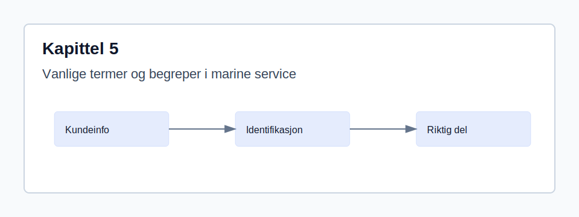

## Tekniske systemillustrasjoner

## Grundig forklaring
Hvordan norske og engelske fagord brukes i kataloger, serviceunderlag og kundedialog må forstås både teknisk og praktisk. I marine reservedeler er det sjelden nok å vite hva kunden kaller delen. Medarbeideren må forstå hvilken funksjon delen har, hvor den sitter, hvilken motorvariant den tilhører, og hva som skjer dersom feil del bestilles. Derfor skal tekniske data, kundens beskrivelse og dokumentert katalogoppslag alltid vurderes sammen.

En god sak har fire kjennetegn: den har tydelig identifikasjon, tydelig problem- eller delbeskrivelse, tydelig beslutningsgrunnlag og tydelig oppfølging. Dersom ett av disse punktene mangler, skal saken markeres som usikker før kunden får et bindende svar.

## Praktisk verkstedeksempel
Et verksted står med demontert komponent og trenger rask avklaring. Medarbeideren registrerer kunde, fartøy, motorinformasjon og tidsfrist, ber om bilder av typeplate og komponent, sjekker katalog og lager, og sender et kort skriftlig svar med valgt del, grunnlag for valget og neste oppdateringstidspunkt.

## Kundesupporteksempel
Kunde: 'Motoren går dårlig, kan dere sende riktig del?' Profesjonelt svar: 'Vi kan hjelpe, men først må vi skille mellom symptom og delbehov. Send serienummer, bilde av motorplate, bilde av området feilen gjelder og en kort beskrivelse av når feilen oppstår. Da kan vi foreslå riktig del eller riktig neste feilsøkingstrinn.'

## Vanlige feil og årsaker
- feil eller ufullstendig serienummer.
- delnummer som er erstattet uten at saken dokumenteres.
- symptom som tolkes som delbehov uten feilsøking.
- kunde har bilde av lignende del, men ikke korrekt motorvariant.
- manglende avklaring av antall, side, posisjon eller leveringstid.

## Feilsøkingsflyt

```mermaid
flowchart TD
    A[Symptom eller forespørsel mottatt] --> B[Samle serienummer, bilder og historikk]
    B --> C{Er motor og variant sikkert identifisert?}
    C -- Nei --> D[Be om mer dokumentasjon før del bekreftes]
    C -- Ja --> E[Kontroller delnummer og posisjon i katalog]
    E --> F{Stemmer symptom med foreslått del?}
    F -- Nei --> G[Foreslå feilsøking eller teknisk kontroll]
    F -- Ja --> H[Kontroller lager, pris og levering]
    H --> I[Send dokumentert kundesvar]
```

## Vedlikeholdsprosedyre
1. Avklar driftstimer, siste service og driftsmiljø.
2. Kontroller olje, filter, kjølevæske, sjøvannskrets, reimer, slanger og elektriske kontakter.
3. Sammenlign vedlikeholdsbehov med produsentens intervaller og faktisk bruk.
4. Anbefal servicekit når flere slitedeler bør skiftes samtidig.
5. Dokumenter hva som er anbefalt, hva kunden bestiller og eventuelle avvik fra normal prosedyre.

## Serienummeridentifikasjon
Serienummeridentifikasjon starter med å finne typeplate, motornummer eller annen unik identifikasjon. Be om bilde, ikke bare avskrift, fordi feil tegn, mellomrom og prefiks kan endre katalogoppslaget. Når serienummer ikke finnes, bygges identifikasjonen med modell, produksjonsår, bilder, tidligere fakturaer, servicehistorikk og delnummer fra monterte komponenter.

Minimumsdata bør være: fabrikat, modell, serienummer, eventuell product number/arrangement/CPL/motornummer, bilde av typeplate og bilde av motorens installasjon. Ved tvil skal saken stoppes for avklaring før del bekreftes.

## Reservedelsidentifikasjon
Reservedelsidentifikasjon skal bekrefte delnummer, posisjon, antall per motor, variant, side og eventuell erstatning. Dersom kunden oppgir et gammelt nummer, må det kontrolleres mot supersession. Dersom kunden bare sender bilde, skal bildet brukes som støtte, ikke som eneste grunnlag for bestilling.

Sjekk alltid om delnummeret gjelder enkeltkomponent, reparasjonssett, servicekit eller komplett enhet. Kontroller også om varen er høyre/venstre, gammel/ny type, standard/oversize eller knyttet til en bestemt produksjonsperiode.

## Bestillingsprosedyre
1. Opprett eller oppdater sak med kunde, fartøy, kontaktperson og tidsfrist.
2. Verifiser motoridentifikasjon og lagre bildedokumentasjon.
3. Finn korrekt delnummer i relevant katalog eller leverandørgrunnlag.
4. Kontroller supersession, antall, lagerstatus, pris, returvilkår og leveringstid.
5. Send ordrebekreftelse med delnummer, beskrivelse, antall, pris, levering og forbehold.
6. Følg opp leveransen til kunden har mottatt varen eller saken er lukket.

## Kvalitetspunkter før svar
- Har vi nok data til å gi et sikkert svar?
- Er delnummeret kontrollert mot riktig motorvariant?
- Er kundens tidsfrist realistisk med valgt fraktmåte?
- Er eventuelle forbehold skrevet tydelig?
- Kan en kollega forstå beslutningen ved å lese saken senere?

## Kapittelsammendrag
Hovedpoenget i kapittel 5 er at profesjonelt reservedelsarbeid krever struktur. Teknisk kunnskap, engelske fagtermer, praktisk feilsøking, dokumentasjon og kundedialog må henge sammen. Når medarbeideren jobber systematisk, reduseres feilbestillinger, kunden får bedre svar, og verkstedet kan planlegge arbeidet tryggere.

## Kryssreferanser
- For forrige tema, se kapittel 4: Viktigheten av nøyaktighet, sikkerhet og dokumentasjon.
- For neste tema, se kapittel 6: Standard arbeidsflyt for ordrebehandling av reservedeler.
- For grunnleggende identifikasjon, se kapittel 12 og 17.
- For merkevise eksempler, se kapitlene 26-32.

## Fordypning for intern opplæring
Dette kapitlet skal brukes som arbeidsstandard, ikke bare som lesestoff. Når en ny medarbeider møter en sak om fagterminologi, skal vedkommende trene på å gå rolig fra fakta til vurdering og deretter til handling. I en marinemotorforhandler er konsekvensen av en feil ofte større enn verdien av selve delen. En feil impeller, feil sensor, feil filterinnsats eller feil pakningssett kan føre til tapt verkstedtid, utsatt avgang, irritert kunde og i verste fall ny driftsstans. Derfor skal hver sak behandles som en teknisk beslutning med sporbar dokumentasjon.

Profesjonelt nivå i dette kapitlet betyr at medarbeideren kan arbeide sikkert med fagterminologi. Før kunden får et bindende svar, skal opplysningene i saken kontrolleres mot motorens identitet, faktisk installasjon og relevant produsentterminologi. Det praktiske målet er ikke å finne et raskt nummer, men å kunne forklare hvorfor valgt del, kontrollpunkt eller kundesvar er riktig for akkurat denne motoren. Når informasjon mangler, skal medarbeideren beskrive hva som mangler, hvorfor det er nødvendig, og hvilket neste steg som bringer saken videre.

## Tekniske forklaringer
Teknisk forståelse i dette kapitlet skal bygges rundt norske og engelske begreper for komponenter, systemer og produsentdata. Medarbeideren må skille mellom synlig symptom, sannsynlig systemfeil og bestillbar komponent. En del kan se riktig ut på bilde, men likevel være feil dersom posisjon, variant, rating, kjøleroppsett, elektrisk plugg, monteringsside eller servicehistorikk ikke stemmer. Derfor skal teknisk vurdering alltid kobles til både funksjon og dokumentasjon: hva gjør komponenten, hvilket system påvirker den, og hvilken produsentkilde bekrefter at den passer.

I praksis betyr dette at tekniske data skal kobles til motorens faktiske installasjon. Marine motorer står ofte trangt, er utsatt for salt, vibrasjon, fukt og ujevnt belastningsmønster, og de kan være bygget om gjennom mange år. En motor kan ha original kjøler, ettermontert eksosbend, alternativ dynamo, endret filterbrakett eller annen sjøvannspumpe enn standard. Slike forhold gjør at delidentifikasjon må bygge på både produsentdata og synlig dokumentasjon fra motoren.

Produsentterminologi er en del av den tekniske forståelsen. Bruk uttrykk som Serial Number, Engine Number, Part Number, Service Kit, Exploded View, Supersession når de er relevante. Ikke oversett dem på en måte som fjerner presisjon. Skriv for eksempel «Engine Serial Number (ESN)» første gang og deretter «ESN» i saken dersom produsenten bruker dette. Skriv «Arrangement Number» når CAT-data krever det, «Product Number» når Volvo Penta bruker det, «CPL» når Cummins-konfigurasjon må kontrolleres, og «Model Code» når Yanmar-identifikasjon bygger på modellkode. Dette gjør dialogen med internasjonale leverandører mer presis.

## Illustrasjonsforslag
- Oversiktsdiagram som viser hvor fagterminologi passer inn i total arbeidsflyt fra kundeforespørsel til levert del.
- Nærbilde av typeplate/motorskilt med markering av serienummer, motornummer, modell og eventuell variantkode.
- Sprengskisse med markert posisjon, delnummer, antall per motor og mulige alternative versjoner.
- Feilsøkingsflyt med beslutningspunkter: mangler data, stemmer symptom, kreves mer teknisk kontroll, kan ordre bekreftes.
- Sammenligningsbilde av gammel og ny del der forskjell i tilkobling, side, lengde eller sensorplugg er markert.

## Virkelige verkstedseksempler
Eksempel 1: Et verksted står med en demontert komponent på benken og kunden venter på avklaring før fartøyet kan settes tilbake i drift. Verkstedet sender et nærbilde av delen, men ingen motorplate. En uerfaren medarbeider kan bli fristet til å søke på nummeret som står på støpegodset. En profesjonell medarbeider svarer at støpenummer ikke nødvendigvis er bestillbart delnummer, ber om bilde av typeplate, oversiktsbilde av motoren og bilde av monteringsstedet, og forklarer at dette hindrer feilbestilling. Når informasjonen kommer, kontrolleres delnummer mot sprengskisse, posisjon og antall. Først da gis pris og leveringstid.

Eksempel 2: En kunde ringer sent på dagen og sier at motoren har høy temperatur etter service. Kunden ønsker ny termostat. Medarbeideren skal ikke automatisk konkludere med termostatfeil. Spørsmålene bør avklare om impeller er byttet, om sjøvannsfilteret er rent, om kjølevæskenivået er riktig, om alarmen kommer ved tomgang eller belastning, og om det finnes lekkasje rundt varmeveksler eller slanger. Dersom kunden likevel vil bestille termostat, dokumenteres at feilsøking er anbefalt, og delnummer kontrolleres mot serienummer før ordre.

Eksempel 3: En intern selger mottar en gammel faktura med et delnummer som ikke lenger finnes. Riktig prosess er å kontrollere supersession, se om ny del krever tilhørende pakning, boltsett eller adapter, og notere både gammelt og nytt nummer i saken. Kunden skal få vite at delen er erstattet, hva som leveres, og om det finnes monteringsforbehold.

## Reservedelsidentifisering i praksis
Reservedelsidentifisering skal følge en fast rekkefølge. Først kontrolleres motorens identitet. Deretter kontrolleres delens system: drivstoff, luft, kjøling, smøring, eksos, elektrisk eller mekanisk kraftoverføring. Så kontrolleres posisjon i sprengskisse eller parts list. Til slutt kontrolleres antall, variant, supersession og leveringsstatus. Denne rekkefølgen hindrer at medarbeideren hopper direkte fra kundens ord til et tilfeldig delnummer.

Når en del har synlig nummer, må nummeret tolkes riktig. Mange komponenter har produksjonsnummer, støpenummer, leverandørnummer eller revisjonskode som ikke er det samme som bestillbart part number. Et filter kan ha nummer fra filterprodusent, men motorprodusentens parts catalogue kan bruke et annet nummer. En pumpe kan ha nummer på lokk, hus og komplett enhet. Spør derfor alltid: gjelder nummeret komplett del, reparasjonssett, underkomponent eller produsentens råkomponent?

## Serienummer og motornummer
Serienummer og motornummer er grunnlaget for korrekt katalogoppslag. Be kunden sende bilde av typeplate eller dataplate. Dersom kunden skriver nummeret manuelt, skal nummeret likevel kontrolleres mot bilde når det er mulig. Noter hele nummeret, inkludert prefiks, suffiks, bindestrek, mellomrom og eventuelle bokstaver. På enkelte produsenter kan små forskjeller peke til forskjellig produksjonsperiode, rating eller konfigurasjon.

Bruk motornummer sammen med modell, variant og applikasjon. En motor som driver generator kan ha andre deler enn en fremdriftsmotor. En motor i yrkesbåt kan ha annen rating enn samme motor i fritidsbåt. En eldre motor kan være bygget om med ny dynamo, annen sjøvannspumpe eller uoriginal filterbrakett. Dersom typeplate mangler, bygg identifikasjonen gjennom flere kilder: servicebok, tidligere faktura, bilder av motorens sider, nummer på pumpe, filter, turbo og gear, samt opplysninger om fartøy og produksjonsår.

## Feilsøking steg for steg
1. Definer symptomet med kundens egne ord og skriv det i saken. Skill mellom «kunden ønsker del» og «kunden beskriver feil».
2. Avklar når feilen oppstår: start, tomgang, belastning, marsjfart, varm motor, kald motor eller etter nylig service.
3. Kontroller grunnleggende forhold: væskenivå, filter, luft i drivstoff, sjøvannsstrøm, reimer, elektriske kontakter, sikringer og synlige lekkasjer.
4. Knytt symptomet til system: lav effekt peker ofte mot luft/drivstoff/eksos, høy temperatur mot kjøling, lavt oljetrykk mot smøring/sensor, startproblem mot batteri/starter/gløding/drivstoff.
5. Be om bilder eller måledata dersom symptomet ikke kan kobles sikkert til en del. Dette kan være bilde av alarmdisplay, trykkmåling, temperaturmåling eller bilde av montert komponent.
6. Kontroller relevant delnummer mot serienummer og variant. Dersom flere alternativer finnes, forklar kunden hva som skiller dem.
7. Dokumenter anbefalt tiltak, usikkerhet og eventuelle forbehold før ordre bekreftes.

## Vedlikehold
Vedlikehold skal vurderes mot driftstimer, produsentens maintenance schedule og faktisk driftsmiljø. Marine motorer som går korte turer, mye tomgang eller i salt miljø kan trenge hyppigere kontroll enn standard intervall antyder. Nye medarbeidere skal lære å spørre om siste service, hvilke filter som ble byttet, hvilken olje som ble brukt, om impeller er kontrollert, og om kjølevæske eller anoder er byttet etter plan.

En god vedlikeholdsanbefaling er konkret. I stedet for å skrive «ta service», bør medarbeideren foreslå relevante deler: olje- og drivstoffilter, luftfilter, impeller, reim, pakninger, anoder, kjølevæske og eventuelt servicekit. Dersom kunden har ukjent servicehistorikk, bør komplett servicekit vurderes. Dersom kunden har hatt overoppheting, bør sjøvannskrets og varmeveksler kontrolleres før bare én komponent byttes.

## Vanlige feil
- Serienummer leses feil fordi et tegn forveksles, for eksempel O/0 eller I/1.
- Kunden oppgir modellnavn, men ikke variant, rating eller applikasjon.
- Del velges ut fra bilde alene uten kontroll mot sprengskisse eller produsentkatalog.
- Supersession aksepteres uten å kontrollere om ny del krever tilbehør, pakning eller ombygging.
- Hastepress gjør at leveringsløfte gis før lagerstatus og fraktmulighet er bekreftet.
- Saksnotat mangler grunnlaget for beslutningen, slik at kollega ikke kan etterprøve valget.

## Kontrollspørsmål
- Hva er den viktigste tekniske risikoen i en sak som gjelder fagterminologi?
- Hvilke opplysninger må dokumenteres før bindende delnummer bekreftes?
- Hvordan forklarer du kunden hvorfor bilde av typeplate er nødvendig?
- Når bør du stoppe en ordre og be om mer dokumentasjon?
- Hvilke engelske produsentuttrykk bør du kunne bruke i denne typen sak?
- Hvordan dokumenterer du at et delnummer er erstattet av et nytt nummer?

## Praktisk sjekkliste for medarbeider
- Les saken som om en kollega skal overta den i morgen.
- Kontroller at motoridentifikasjon er dokumentert med bilde eller sikker kilde.
- Sjekk at delnummeret er knyttet til riktig posisjon i katalogen.
- Skriv tydelig om kunden har bedt om enkeltkomponent, servicekit eller komplett enhet.
- Noter om varen er spesialbestilling, utgått, erstattet eller ikke returbar.
- Send kundesvar med neste steg, ikke bare et løst delnummer.

## Kapittelspesifikk systemforståelse
For dette kapitlet er kjernen å forstå hvordan fagord oversettes og brukes uten å miste presisjon. Medarbeideren skal kunne forklare dette med praktiske ord til både kunde og kollega. Det betyr at teknisk teori må kobles til konkrete handlinger: hvilke data skal innhentes, hvilke komponenter kan være berørt, hvilken produsentterminologi skal brukes, og hva må dokumenteres før saken kan gå videre. Lær medarbeideren å bruke norsk forklaring sammen med engelsk katalogterm.

Når systemet vurderes, skal medarbeideren først plassere problemet i riktig teknisk sammenheng. Dersom kunden beskriver en alarm, må man finne ut om alarmen kommer fra reelt mekanisk avvik, elektrisk sensorfeil, feil etter service eller feil tolkning av instrumentet. Dersom kunden beskriver en del, må man avklare om kunden mener komplett enhet, servicekit, reparasjonssett eller enkeltkomponent. Dersom kunden beskriver motoren med vanlig navn, må man kontrollere om produsenten bruker mer presise begreper i katalogen.

## Komponentoversikt og arbeidsgrense
Relevante komponenter og opplysninger i dette kapitlet omfatter: serial number, engine number, part number, service kit, gasket set, raw water pump, heat exchanger og supersession. Listen er ikke ment som en erstatning for produsentens parts catalogue, men som en praktisk påminnelse om hva nye medarbeidere skal tenke på før de søker del. I interne saker skal komponentnavn skrives så presist som mulig. Bruk for eksempel «sjøvannspumpe / raw water pump» i stedet for bare «pumpe» når funksjonen er kjent, og «varmeveksler / heat exchanger» i stedet for bare «kjøler» når det er den komponenten saken gjelder.

Arbeidsgrensen for en reservedelsmedarbeider er også viktig. Medarbeideren skal ikke overta mekanikerens ansvar for demontering, måling eller diagnose på motoren, men skal kunne stille riktige spørsmål og foreslå riktig dokumentasjon. Når en sak går fra enkel delidentifikasjon til teknisk diagnose, skal dette markeres i saken. Da kan verksted, teknisk ansvarlig eller leverandør involveres med et klart spørsmål og et ryddig faktagrunnlag.

## Praktisk beslutningsregel
Bruk denne regelen i alle saker knyttet til kapitlet: Hvis motoridentifikasjon, komponentposisjon eller symptom ikke er sikkert nok dokumentert, skal medarbeideren ikke gi bindende delbekreftelse. Kunden kan få et foreløpig svar, men svaret må inneholde hva som mangler, hvorfor det mangler, og hva som skjer når informasjonen er mottatt. Dette er ikke treg service; det er profesjonell risikokontroll.

## Realistisk opplæring i praksis
### Verkstedhistorie
En typisk sak i dette temaet starter med kunde bruker lokale navn på komponenter. Verkstedet trenger et raskt svar, men den erfarne medarbeideren stopper opp og spør først: hva vet vi sikkert, hva antar vi, og hva kan gi følgeskade hvis vi tar feil? I praksis betyr det at norsk/engelsk terminologi må kobles til bilde, serienummer, komponentposisjon og kundens symptom før saken lukkes. Historien skal brukes i opplæring som en øvelse i å skrive et kort saksnotat: observasjon, vurdering, neste handling og forbehold.

### Kundehistorie
Kunden beskriver ofte problemet med driftsspråk: «motoren går tungt», «alarm kommer etter ti minutter», «jeg trenger den samme delen som sist» eller «båten skal ut i morgen». En profesjonell respons er rolig og konkret: bekreft behovet, forklar hvorfor identifikasjon trengs, be om riktig dokumentasjon og gi et realistisk tidspunkt for neste svar. Ikke korriger kunden unødvendig; oversett kundens språk til teknisk språk i saken.

### Typiske feil nye ansatte gjør
- søker på første synlige nummer uten å avklare om det er støpenummer, leverandørnummer eller bestillbart part number.
- lover levering før lagerstatus, frakt og returvilkår er kontrollert.
- antar at tidligere faktura alltid gjelder samme motorvariant.
- blander symptom og årsak, spesielt ved varme, lav effekt, startproblem og alarm.
- skriver for korte notater slik at kollega ikke kan forstå hvorfor valget ble tatt.

### Tips fra erfarne mekanikere og reservedelsselgere
- Se alltid etter systemet rundt delen: slanger, braketter, sensorer, reimer, kjølere og tilkoblinger forteller ofte mer enn delen alene.
- Still ett presist spørsmål om gangen når kunden er stresset; mange dårlige svar kommer av for lange spørsmålslister.
- Sammenlign gammel og ny del mot funksjon, ikke bare form. Riktig del skal passe, men også løse riktig problem.
- En erfaren reservedelsselger tenker i risiko: Hva er billigst å avklare nå, og hva blir dyrt hvis vi hopper over det?

### Vanlige kundespørsmål
| Spørsmål fra kunde | Profesjonelt svar |
|---|---|
| «Kan du bare sende samme del som sist?» | «Ja, hvis vi først bekrefter at det gjelder samme motor, samme posisjon og ingen supersession siden sist.» |
| «Holder det med bilde?» | «Bilde hjelper, men vi trenger også motoridentitet for å sikre variant og delnummer.» |
| «Hvorfor tar dette tid?» | «Fordi feil del kan gi ny driftsstans. Vi kontrollerer grunnlaget før vi lover levering.» |

### Beslutningstre for saken
| Trinn | Spørsmål | Handling |
|---|---|---|
| 1 | Er motoridentitet dokumentert med bilde eller sikker historikk? | Hvis nei: be om typeplate/dataplate eller alternativ dokumentasjon. |
| 2 | Er komponentens funksjon og posisjon kjent? | Hvis nei: be om oversiktsbilde og bilde av monteringssted. |
| 3 | Stemmer kundens symptom med delen som ønskes? | Hvis nei: anbefal feilsøking før del bestilles. |
| 4 | Finnes det supersession, kit eller variantvalg? | Kontroller produsentkilde og skriv forbehold i saken. |
| 5 | Kan pris, levering og returvilkår bekreftes? | Send dokumentert svar med neste steg og tydelig gyldighet. |

### Rask oppslagstabell
| Situasjon | Kontroller først | Vanlig fallgruve |
|---|---|---|
| Hasteordre | sikker motor-ID, lager, fraktfrist | levering loves før teknisk kontroll |
| Del fra bilde | posisjon, skala, tilkoblinger, nummer | bilde brukes som eneste beslutningsgrunnlag |
| Gammelt delnummer | supersession og kitinnhold | ny del krever ekstra pakning eller adapter |
| Uklart symptom | driftssituasjon, alarm, siste service | symptom blir tolket som sikker komponentfeil |

### Praktisk sjekkliste og inspeksjonsrutine
- Start med motoridentitet: fabrikat, modell, serienummer, variant, applikasjon og bilde av skilt.
- Kontroller området rundt komponenten: lekkasje, korrosjon, knekte fester, slitasje, varmemerker og uoriginale endringer.
- Spør om siste vedlikehold: olje, filter, impeller, reimer, kjølevæske, anoder og drivstoffilter.
- Noter driftstype: fritidsbruk, yrkesbruk, generator, fremdrift, tomgangsdrift eller langvarig høy belastning.
- Avklar om saken gjelder akutt drift, planlagt service, reklamasjon eller lagerpåfyll.

### Generelle vedlikeholdsintervaller som opplæringspunkt
| Kontrollpunkt | Typisk vurdering i opplæring | Må verifiseres |
|---|---|---|
| Olje og oljefilter | ofte basert på timer og kalender | produsentens maintenance schedule |
| Drivstoffilter/vannutskiller | hyppigere ved dårlig drivstoff eller sesongstart | motor- og filterspesifikasjon |
| Impeller og sjøvannskrets | kontrolleres særlig før sesong og etter varmgang | produsentens intervall og installasjon |
| Reimer, slanger og klemmer | visuell kontroll ved service og feilsøking | dimensjon, stramming og delnummer |

### Produsentverifikasjon
Alle konkrete delnumre, momentverdier, serviceintervaller, garantikrav, programvaredata og produsentspesifikke grenser skal kontrolleres mot offisiell produsentdokumentasjon før de brukes i tilbud, ordre eller verkstedinstruks. Marker tydelig i saken når svaret bygger på antakelse, eldre historikk, bilde uten motor-ID eller generell erfaring. Intervaller i tabellen er generelle opplæringspunkter. Faktiske intervaller styres av produsent, motorvariant, driftstimer, kalenderkrav, belastning og miljø.

## Produsentverifikasjon og faglig forbehold
Denne manualen skal brukes som intern opplæring og arbeidsmetode. Produsentspesifikke delnumre, intervaller, momentverdier, garantikrav og tekniske grenseverdier skal verifiseres mot gjeldende produsentdokumentasjon før de brukes i kundeordre eller verkstedinstruks. Marker saken internt dersom opplysningen bygger på antakelse, eldre historikk eller bilde uten bekreftet motoridentitet.

## Quiz med fasit
1. Hvilke tekniske data bør alltid samles før en del bekreftes?
2. Hvorfor er engelsk terminologi viktig i marine reservedeler?
3. Hva bør gjøres dersom kunden bare sender et bilde av delen?
4. Hvilke punkter bør kontrolleres før ordrebekreftelse sendes?
5. Hvorfor skal feilsøking dokumenteres, selv når kunden allerede ber om en bestemt del?

### Svar
1. Fabrikat, modell, serienummer, variantdata, bilde av typeplate, delnummer, posisjon og kundens symptombeskrivelse.
2. Fordi kataloger, portaler, servicemanualer og leverandørdialog ofte bruker engelske begreper som må forstås presist.
3. Be om serienummer, oversiktsbilde av motoren og eventuelle nummer på delen; bildet brukes som støtte, ikke eneste grunnlag.
4. Delnummer, antall, variant, pris, lagerstatus, leveringstid, frakt, returvilkår og eventuelle forbehold.
5. Fordi symptomet kan ha flere årsaker, og dokumentasjon viser hvorfor anbefalingen ble gitt.

---

# Kapittel 6: Standard arbeidsflyt for ordrebehandling av reservedeler

## Kapittelrolle
Dette kapitlet gir en grundig praktisk innføring i ordrearbeidsflyt. Temaet er viktig fordi reservedelsarbeid i marine miljøer kombinerer teknisk forståelse, presis kundedialog, dokumentert saksbehandling og realistisk leveranseoppfølging. Målet er at en ny medarbeider skal kunne bruke kunnskapen direkte i arbeid med verksted, kunde, lager og leverandør.

## Læringsmål
Etter kapitlet skal deltakeren kunne:
- forklare hovedbegrepene innen ordrearbeidsflyt
- bruke serienummer, modellinformasjon og delnummer i praktisk reservedelsarbeid
- kommunisere trygt med kunde, verksted, lager og leverandør
- dokumentere beslutninger slik at andre kan etterprøve saken
- kjenne igjen vanlige feil og velge riktig neste handling

## English technical terminology
- **Serial Number:** engelsk fagterm som ofte brukes i kataloger, servicelitteratur, leverandørportaler og internasjonal kundedialog.
- **Part Number:** engelsk fagterm som ofte brukes i kataloger, servicelitteratur, leverandørportaler og internasjonal kundedialog.
- **Engine Model:** engelsk fagterm som ofte brukes i kataloger, servicelitteratur, leverandørportaler og internasjonal kundedialog.
- **Variant:** engelsk fagterm som ofte brukes i kataloger, servicelitteratur, leverandørportaler og internasjonal kundedialog.
- **Service Kit:** engelsk fagterm som ofte brukes i kataloger, servicelitteratur, leverandørportaler og internasjonal kundedialog.
- **Troubleshooting:** engelsk fagterm som ofte brukes i kataloger, servicelitteratur, leverandørportaler og internasjonal kundedialog.
- **Maintenance:** engelsk fagterm som ofte brukes i kataloger, servicelitteratur, leverandørportaler og internasjonal kundedialog.
- **Ordering Procedure:** engelsk fagterm som ofte brukes i kataloger, servicelitteratur, leverandørportaler og internasjonal kundedialog.
- **Supersession:** engelsk fagterm som ofte brukes i kataloger, servicelitteratur, leverandørportaler og internasjonal kundedialog.
- **Technical Support:** engelsk fagterm som ofte brukes i kataloger, servicelitteratur, leverandørportaler og internasjonal kundedialog.

## Hoveddiagram
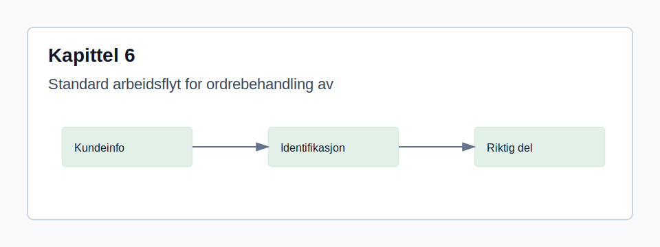

## Tekniske systemillustrasjoner

## Grundig forklaring
Hvordan en forespørsel beveger seg fra mottak til levering og lukking av sak må forstås både teknisk og praktisk. I marine reservedeler er det sjelden nok å vite hva kunden kaller delen. Medarbeideren må forstå hvilken funksjon delen har, hvor den sitter, hvilken motorvariant den tilhører, og hva som skjer dersom feil del bestilles. Derfor skal tekniske data, kundens beskrivelse og dokumentert katalogoppslag alltid vurderes sammen.

En god sak har fire kjennetegn: den har tydelig identifikasjon, tydelig problem- eller delbeskrivelse, tydelig beslutningsgrunnlag og tydelig oppfølging. Dersom ett av disse punktene mangler, skal saken markeres som usikker før kunden får et bindende svar.

## Praktisk verkstedeksempel
Et verksted står med demontert komponent og trenger rask avklaring. Medarbeideren registrerer kunde, fartøy, motorinformasjon og tidsfrist, ber om bilder av typeplate og komponent, sjekker katalog og lager, og sender et kort skriftlig svar med valgt del, grunnlag for valget og neste oppdateringstidspunkt.

## Kundesupporteksempel
Kunde: 'Motoren går dårlig, kan dere sende riktig del?' Profesjonelt svar: 'Vi kan hjelpe, men først må vi skille mellom symptom og delbehov. Send serienummer, bilde av motorplate, bilde av området feilen gjelder og en kort beskrivelse av når feilen oppstår. Da kan vi foreslå riktig del eller riktig neste feilsøkingstrinn.'

## Vanlige feil og årsaker
- feil eller ufullstendig serienummer.
- delnummer som er erstattet uten at saken dokumenteres.
- symptom som tolkes som delbehov uten feilsøking.
- kunde har bilde av lignende del, men ikke korrekt motorvariant.
- manglende avklaring av antall, side, posisjon eller leveringstid.

## Feilsøkingsflyt
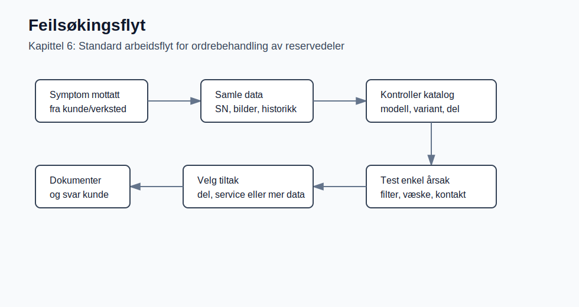

```mermaid
flowchart TD
    A[Symptom eller forespørsel mottatt] --> B[Samle serienummer, bilder og historikk]
    B --> C{Er motor og variant sikkert identifisert?}
    C -- Nei --> D[Be om mer dokumentasjon før del bekreftes]
    C -- Ja --> E[Kontroller delnummer og posisjon i katalog]
    E --> F{Stemmer symptom med foreslått del?}
    F -- Nei --> G[Foreslå feilsøking eller teknisk kontroll]
    F -- Ja --> H[Kontroller lager, pris og levering]
    H --> I[Send dokumentert kundesvar]
```

## Vedlikeholdsprosedyre
1. Avklar driftstimer, siste service og driftsmiljø.
2. Kontroller olje, filter, kjølevæske, sjøvannskrets, reimer, slanger og elektriske kontakter.
3. Sammenlign vedlikeholdsbehov med produsentens intervaller og faktisk bruk.
4. Anbefal servicekit når flere slitedeler bør skiftes samtidig.
5. Dokumenter hva som er anbefalt, hva kunden bestiller og eventuelle avvik fra normal prosedyre.

## Serienummeridentifikasjon
Serienummeridentifikasjon starter med å finne typeplate, motornummer eller annen unik identifikasjon. Be om bilde, ikke bare avskrift, fordi feil tegn, mellomrom og prefiks kan endre katalogoppslaget. Når serienummer ikke finnes, bygges identifikasjonen med modell, produksjonsår, bilder, tidligere fakturaer, servicehistorikk og delnummer fra monterte komponenter.

Minimumsdata bør være: fabrikat, modell, serienummer, eventuell product number/arrangement/CPL/motornummer, bilde av typeplate og bilde av motorens installasjon. Ved tvil skal saken stoppes for avklaring før del bekreftes.

## Reservedelsidentifikasjon
Reservedelsidentifikasjon skal bekrefte delnummer, posisjon, antall per motor, variant, side og eventuell erstatning. Dersom kunden oppgir et gammelt nummer, må det kontrolleres mot supersession. Dersom kunden bare sender bilde, skal bildet brukes som støtte, ikke som eneste grunnlag for bestilling.

Sjekk alltid om delnummeret gjelder enkeltkomponent, reparasjonssett, servicekit eller komplett enhet. Kontroller også om varen er høyre/venstre, gammel/ny type, standard/oversize eller knyttet til en bestemt produksjonsperiode.

## Bestillingsprosedyre
1. Opprett eller oppdater sak med kunde, fartøy, kontaktperson og tidsfrist.
2. Verifiser motoridentifikasjon og lagre bildedokumentasjon.
3. Finn korrekt delnummer i relevant katalog eller leverandørgrunnlag.
4. Kontroller supersession, antall, lagerstatus, pris, returvilkår og leveringstid.
5. Send ordrebekreftelse med delnummer, beskrivelse, antall, pris, levering og forbehold.
6. Følg opp leveransen til kunden har mottatt varen eller saken er lukket.

## Kvalitetspunkter før svar
- Har vi nok data til å gi et sikkert svar?
- Er delnummeret kontrollert mot riktig motorvariant?
- Er kundens tidsfrist realistisk med valgt fraktmåte?
- Er eventuelle forbehold skrevet tydelig?
- Kan en kollega forstå beslutningen ved å lese saken senere?

## Kapittelsammendrag
Hovedpoenget i kapittel 6 er at profesjonelt reservedelsarbeid krever struktur. Teknisk kunnskap, engelske fagtermer, praktisk feilsøking, dokumentasjon og kundedialog må henge sammen. Når medarbeideren jobber systematisk, reduseres feilbestillinger, kunden får bedre svar, og verkstedet kan planlegge arbeidet tryggere.

## Kryssreferanser
- For forrige tema, se kapittel 5: Vanlige termer og begreper i marine service.
- For neste tema, se kapittel 7: Identifisering av kundens behov og forespørsel.
- For grunnleggende identifikasjon, se kapittel 12 og 17.
- For merkevise eksempler, se kapitlene 26-32.

## Fordypning for intern opplæring
Dette kapitlet skal brukes som arbeidsstandard, ikke bare som lesestoff. Når en ny medarbeider møter en sak om ordrebehandling, skal vedkommende trene på å gå rolig fra fakta til vurdering og deretter til handling. I en marinemotorforhandler er konsekvensen av en feil ofte større enn verdien av selve delen. En feil impeller, feil sensor, feil filterinnsats eller feil pakningssett kan føre til tapt verkstedtid, utsatt avgang, irritert kunde og i verste fall ny driftsstans. Derfor skal hver sak behandles som en teknisk beslutning med sporbar dokumentasjon.

Profesjonelt nivå i dette kapitlet betyr at medarbeideren kan arbeide sikkert med ordrearbeidsflyt. Før kunden får et bindende svar, skal opplysningene i saken kontrolleres mot motorens identitet, faktisk installasjon og relevant produsentterminologi. Det praktiske målet er ikke å finne et raskt nummer, men å kunne forklare hvorfor valgt del, kontrollpunkt eller kundesvar er riktig for akkurat denne motoren. Når informasjon mangler, skal medarbeideren beskrive hva som mangler, hvorfor det er nødvendig, og hvilket neste steg som bringer saken videre.

## Tekniske forklaringer
Teknisk forståelse i dette kapitlet skal bygges rundt mottak, avklaring, katalogoppslag, lagerkontroll, tilbud, ordre og oppfølging. Medarbeideren må skille mellom synlig symptom, sannsynlig systemfeil og bestillbar komponent. En del kan se riktig ut på bilde, men likevel være feil dersom posisjon, variant, rating, kjøleroppsett, elektrisk plugg, monteringsside eller servicehistorikk ikke stemmer. Derfor skal teknisk vurdering alltid kobles til både funksjon og dokumentasjon: hva gjør komponenten, hvilket system påvirker den, og hvilken produsentkilde bekrefter at den passer.

I praksis betyr dette at tekniske data skal kobles til motorens faktiske installasjon. Marine motorer står ofte trangt, er utsatt for salt, vibrasjon, fukt og ujevnt belastningsmønster, og de kan være bygget om gjennom mange år. En motor kan ha original kjøler, ettermontert eksosbend, alternativ dynamo, endret filterbrakett eller annen sjøvannspumpe enn standard. Slike forhold gjør at delidentifikasjon må bygge på både produsentdata og synlig dokumentasjon fra motoren.

Produsentterminologi er en del av den tekniske forståelsen. Bruk uttrykk som Serial Number, Engine Number, Part Number, Service Kit, Exploded View, Supersession når de er relevante. Ikke oversett dem på en måte som fjerner presisjon. Skriv for eksempel «Engine Serial Number (ESN)» første gang og deretter «ESN» i saken dersom produsenten bruker dette. Skriv «Arrangement Number» når CAT-data krever det, «Product Number» når Volvo Penta bruker det, «CPL» når Cummins-konfigurasjon må kontrolleres, og «Model Code» når Yanmar-identifikasjon bygger på modellkode. Dette gjør dialogen med internasjonale leverandører mer presis.

## Illustrasjonsforslag
- Oversiktsdiagram som viser hvor ordrebehandling passer inn i total arbeidsflyt fra kundeforespørsel til levert del.
- Nærbilde av typeplate/motorskilt med markering av serienummer, motornummer, modell og eventuell variantkode.
- Sprengskisse med markert posisjon, delnummer, antall per motor og mulige alternative versjoner.
- Feilsøkingsflyt med beslutningspunkter: mangler data, stemmer symptom, kreves mer teknisk kontroll, kan ordre bekreftes.
- Sammenligningsbilde av gammel og ny del der forskjell i tilkobling, side, lengde eller sensorplugg er markert.

## Virkelige verkstedseksempler
Eksempel 1: Et verksted står med en demontert komponent på benken og kunden venter på avklaring før fartøyet kan settes tilbake i drift. Verkstedet sender et nærbilde av delen, men ingen motorplate. En uerfaren medarbeider kan bli fristet til å søke på nummeret som står på støpegodset. En profesjonell medarbeider svarer at støpenummer ikke nødvendigvis er bestillbart delnummer, ber om bilde av typeplate, oversiktsbilde av motoren og bilde av monteringsstedet, og forklarer at dette hindrer feilbestilling. Når informasjonen kommer, kontrolleres delnummer mot sprengskisse, posisjon og antall. Først da gis pris og leveringstid.

Eksempel 2: En kunde ringer sent på dagen og sier at motoren har høy temperatur etter service. Kunden ønsker ny termostat. Medarbeideren skal ikke automatisk konkludere med termostatfeil. Spørsmålene bør avklare om impeller er byttet, om sjøvannsfilteret er rent, om kjølevæskenivået er riktig, om alarmen kommer ved tomgang eller belastning, og om det finnes lekkasje rundt varmeveksler eller slanger. Dersom kunden likevel vil bestille termostat, dokumenteres at feilsøking er anbefalt, og delnummer kontrolleres mot serienummer før ordre.

Eksempel 3: En intern selger mottar en gammel faktura med et delnummer som ikke lenger finnes. Riktig prosess er å kontrollere supersession, se om ny del krever tilhørende pakning, boltsett eller adapter, og notere både gammelt og nytt nummer i saken. Kunden skal få vite at delen er erstattet, hva som leveres, og om det finnes monteringsforbehold.

## Reservedelsidentifisering i praksis
Reservedelsidentifisering skal følge en fast rekkefølge. Først kontrolleres motorens identitet. Deretter kontrolleres delens system: drivstoff, luft, kjøling, smøring, eksos, elektrisk eller mekanisk kraftoverføring. Så kontrolleres posisjon i sprengskisse eller parts list. Til slutt kontrolleres antall, variant, supersession og leveringsstatus. Denne rekkefølgen hindrer at medarbeideren hopper direkte fra kundens ord til et tilfeldig delnummer.

Når en del har synlig nummer, må nummeret tolkes riktig. Mange komponenter har produksjonsnummer, støpenummer, leverandørnummer eller revisjonskode som ikke er det samme som bestillbart part number. Et filter kan ha nummer fra filterprodusent, men motorprodusentens parts catalogue kan bruke et annet nummer. En pumpe kan ha nummer på lokk, hus og komplett enhet. Spør derfor alltid: gjelder nummeret komplett del, reparasjonssett, underkomponent eller produsentens råkomponent?

## Serienummer og motornummer
Serienummer og motornummer er grunnlaget for korrekt katalogoppslag. Be kunden sende bilde av typeplate eller dataplate. Dersom kunden skriver nummeret manuelt, skal nummeret likevel kontrolleres mot bilde når det er mulig. Noter hele nummeret, inkludert prefiks, suffiks, bindestrek, mellomrom og eventuelle bokstaver. På enkelte produsenter kan små forskjeller peke til forskjellig produksjonsperiode, rating eller konfigurasjon.

Bruk motornummer sammen med modell, variant og applikasjon. En motor som driver generator kan ha andre deler enn en fremdriftsmotor. En motor i yrkesbåt kan ha annen rating enn samme motor i fritidsbåt. En eldre motor kan være bygget om med ny dynamo, annen sjøvannspumpe eller uoriginal filterbrakett. Dersom typeplate mangler, bygg identifikasjonen gjennom flere kilder: servicebok, tidligere faktura, bilder av motorens sider, nummer på pumpe, filter, turbo og gear, samt opplysninger om fartøy og produksjonsår.

## Feilsøking steg for steg
1. Definer symptomet med kundens egne ord og skriv det i saken. Skill mellom «kunden ønsker del» og «kunden beskriver feil».
2. Avklar når feilen oppstår: start, tomgang, belastning, marsjfart, varm motor, kald motor eller etter nylig service.
3. Kontroller grunnleggende forhold: væskenivå, filter, luft i drivstoff, sjøvannsstrøm, reimer, elektriske kontakter, sikringer og synlige lekkasjer.
4. Knytt symptomet til system: lav effekt peker ofte mot luft/drivstoff/eksos, høy temperatur mot kjøling, lavt oljetrykk mot smøring/sensor, startproblem mot batteri/starter/gløding/drivstoff.
5. Be om bilder eller måledata dersom symptomet ikke kan kobles sikkert til en del. Dette kan være bilde av alarmdisplay, trykkmåling, temperaturmåling eller bilde av montert komponent.
6. Kontroller relevant delnummer mot serienummer og variant. Dersom flere alternativer finnes, forklar kunden hva som skiller dem.
7. Dokumenter anbefalt tiltak, usikkerhet og eventuelle forbehold før ordre bekreftes.

## Vedlikehold
Vedlikehold skal vurderes mot driftstimer, produsentens maintenance schedule og faktisk driftsmiljø. Marine motorer som går korte turer, mye tomgang eller i salt miljø kan trenge hyppigere kontroll enn standard intervall antyder. Nye medarbeidere skal lære å spørre om siste service, hvilke filter som ble byttet, hvilken olje som ble brukt, om impeller er kontrollert, og om kjølevæske eller anoder er byttet etter plan.

En god vedlikeholdsanbefaling er konkret. I stedet for å skrive «ta service», bør medarbeideren foreslå relevante deler: olje- og drivstoffilter, luftfilter, impeller, reim, pakninger, anoder, kjølevæske og eventuelt servicekit. Dersom kunden har ukjent servicehistorikk, bør komplett servicekit vurderes. Dersom kunden har hatt overoppheting, bør sjøvannskrets og varmeveksler kontrolleres før bare én komponent byttes.

## Vanlige feil
- Serienummer leses feil fordi et tegn forveksles, for eksempel O/0 eller I/1.
- Kunden oppgir modellnavn, men ikke variant, rating eller applikasjon.
- Del velges ut fra bilde alene uten kontroll mot sprengskisse eller produsentkatalog.
- Supersession aksepteres uten å kontrollere om ny del krever tilbehør, pakning eller ombygging.
- Hastepress gjør at leveringsløfte gis før lagerstatus og fraktmulighet er bekreftet.
- Saksnotat mangler grunnlaget for beslutningen, slik at kollega ikke kan etterprøve valget.

## Kontrollspørsmål
- Hva er den viktigste tekniske risikoen i en sak som gjelder ordrebehandling?
- Hvilke opplysninger må dokumenteres før bindende delnummer bekreftes?
- Hvordan forklarer du kunden hvorfor bilde av typeplate er nødvendig?
- Når bør du stoppe en ordre og be om mer dokumentasjon?
- Hvilke engelske produsentuttrykk bør du kunne bruke i denne typen sak?
- Hvordan dokumenterer du at et delnummer er erstattet av et nytt nummer?

## Praktisk sjekkliste for medarbeider
- Les saken som om en kollega skal overta den i morgen.
- Kontroller at motoridentifikasjon er dokumentert med bilde eller sikker kilde.
- Sjekk at delnummeret er knyttet til riktig posisjon i katalogen.
- Skriv tydelig om kunden har bedt om enkeltkomponent, servicekit eller komplett enhet.
- Noter om varen er spesialbestilling, utgått, erstattet eller ikke returbar.
- Send kundesvar med neste steg, ikke bare et løst delnummer.

## Kapittelspesifikk systemforståelse
For dette kapitlet er kjernen å forstå ordreprosessen fra første kontakt til lukket leveranse. Medarbeideren skal kunne forklare dette med praktiske ord til både kunde og kollega. Det betyr at teknisk teori må kobles til konkrete handlinger: hvilke data skal innhentes, hvilke komponenter kan være berørt, hvilken produsentterminologi skal brukes, og hva må dokumenteres før saken kan gå videre. En ordre er ikke ferdig når delen er bestilt; den er ferdig når leveransen er mottatt eller saken er lukket.

Når systemet vurderes, skal medarbeideren først plassere problemet i riktig teknisk sammenheng. Dersom kunden beskriver en alarm, må man finne ut om alarmen kommer fra reelt mekanisk avvik, elektrisk sensorfeil, feil etter service eller feil tolkning av instrumentet. Dersom kunden beskriver en del, må man avklare om kunden mener komplett enhet, servicekit, reparasjonssett eller enkeltkomponent. Dersom kunden beskriver motoren med vanlig navn, må man kontrollere om produsenten bruker mer presise begreper i katalogen.

## Komponentoversikt og arbeidsgrense
Relevante komponenter og opplysninger i dette kapitlet omfatter: forespørsel, identifikasjon, tilbud, innkjøp, plukk, pakking, frakt, faktura og oppfølging. Listen er ikke ment som en erstatning for produsentens parts catalogue, men som en praktisk påminnelse om hva nye medarbeidere skal tenke på før de søker del. I interne saker skal komponentnavn skrives så presist som mulig. Bruk for eksempel «sjøvannspumpe / raw water pump» i stedet for bare «pumpe» når funksjonen er kjent, og «varmeveksler / heat exchanger» i stedet for bare «kjøler» når det er den komponenten saken gjelder.

Arbeidsgrensen for en reservedelsmedarbeider er også viktig. Medarbeideren skal ikke overta mekanikerens ansvar for demontering, måling eller diagnose på motoren, men skal kunne stille riktige spørsmål og foreslå riktig dokumentasjon. Når en sak går fra enkel delidentifikasjon til teknisk diagnose, skal dette markeres i saken. Da kan verksted, teknisk ansvarlig eller leverandør involveres med et klart spørsmål og et ryddig faktagrunnlag.

## Praktisk beslutningsregel
Bruk denne regelen i alle saker knyttet til kapitlet: Hvis motoridentifikasjon, komponentposisjon eller symptom ikke er sikkert nok dokumentert, skal medarbeideren ikke gi bindende delbekreftelse. Kunden kan få et foreløpig svar, men svaret må inneholde hva som mangler, hvorfor det mangler, og hva som skjer når informasjonen er mottatt. Dette er ikke treg service; det er profesjonell risikokontroll.

## Realistisk opplæring i praksis
### Verkstedhistorie
En typisk sak i dette temaet starter med hastesak mangler serienummer. Verkstedet trenger et raskt svar, men den erfarne medarbeideren stopper opp og spør først: hva vet vi sikkert, hva antar vi, og hva kan gi følgeskade hvis vi tar feil? I praksis betyr det at ordregrunnlag og leveringsløfte må kobles til bilde, serienummer, komponentposisjon og kundens symptom før saken lukkes. Historien skal brukes i opplæring som en øvelse i å skrive et kort saksnotat: observasjon, vurdering, neste handling og forbehold.

### Kundehistorie
Kunden beskriver ofte problemet med driftsspråk: «motoren går tungt», «alarm kommer etter ti minutter», «jeg trenger den samme delen som sist» eller «båten skal ut i morgen». En profesjonell respons er rolig og konkret: bekreft behovet, forklar hvorfor identifikasjon trengs, be om riktig dokumentasjon og gi et realistisk tidspunkt for neste svar. Ikke korriger kunden unødvendig; oversett kundens språk til teknisk språk i saken.

### Typiske feil nye ansatte gjør
- søker på første synlige nummer uten å avklare om det er støpenummer, leverandørnummer eller bestillbart part number.
- lover levering før lagerstatus, frakt og returvilkår er kontrollert.
- antar at tidligere faktura alltid gjelder samme motorvariant.
- blander symptom og årsak, spesielt ved varme, lav effekt, startproblem og alarm.
- skriver for korte notater slik at kollega ikke kan forstå hvorfor valget ble tatt.

### Tips fra erfarne mekanikere og reservedelsselgere
- Se alltid etter systemet rundt delen: slanger, braketter, sensorer, reimer, kjølere og tilkoblinger forteller ofte mer enn delen alene.
- Still ett presist spørsmål om gangen når kunden er stresset; mange dårlige svar kommer av for lange spørsmålslister.
- Sammenlign gammel og ny del mot funksjon, ikke bare form. Riktig del skal passe, men også løse riktig problem.
- En erfaren reservedelsselger tenker i risiko: Hva er billigst å avklare nå, og hva blir dyrt hvis vi hopper over det?

### Vanlige kundespørsmål
| Spørsmål fra kunde | Profesjonelt svar |
|---|---|
| «Kan du bare sende samme del som sist?» | «Ja, hvis vi først bekrefter at det gjelder samme motor, samme posisjon og ingen supersession siden sist.» |
| «Holder det med bilde?» | «Bilde hjelper, men vi trenger også motoridentitet for å sikre variant og delnummer.» |
| «Hvorfor tar dette tid?» | «Fordi feil del kan gi ny driftsstans. Vi kontrollerer grunnlaget før vi lover levering.» |

### Beslutningstre for saken
| Trinn | Spørsmål | Handling |
|---|---|---|
| 1 | Er motoridentitet dokumentert med bilde eller sikker historikk? | Hvis nei: be om typeplate/dataplate eller alternativ dokumentasjon. |
| 2 | Er komponentens funksjon og posisjon kjent? | Hvis nei: be om oversiktsbilde og bilde av monteringssted. |
| 3 | Stemmer kundens symptom med delen som ønskes? | Hvis nei: anbefal feilsøking før del bestilles. |
| 4 | Finnes det supersession, kit eller variantvalg? | Kontroller produsentkilde og skriv forbehold i saken. |
| 5 | Kan pris, levering og returvilkår bekreftes? | Send dokumentert svar med neste steg og tydelig gyldighet. |

### Rask oppslagstabell
| Situasjon | Kontroller først | Vanlig fallgruve |
|---|---|---|
| Hasteordre | sikker motor-ID, lager, fraktfrist | levering loves før teknisk kontroll |
| Del fra bilde | posisjon, skala, tilkoblinger, nummer | bilde brukes som eneste beslutningsgrunnlag |
| Gammelt delnummer | supersession og kitinnhold | ny del krever ekstra pakning eller adapter |
| Uklart symptom | driftssituasjon, alarm, siste service | symptom blir tolket som sikker komponentfeil |

### Praktisk sjekkliste og inspeksjonsrutine
- Start med motoridentitet: fabrikat, modell, serienummer, variant, applikasjon og bilde av skilt.
- Kontroller området rundt komponenten: lekkasje, korrosjon, knekte fester, slitasje, varmemerker og uoriginale endringer.
- Spør om siste vedlikehold: olje, filter, impeller, reimer, kjølevæske, anoder og drivstoffilter.
- Noter driftstype: fritidsbruk, yrkesbruk, generator, fremdrift, tomgangsdrift eller langvarig høy belastning.
- Avklar om saken gjelder akutt drift, planlagt service, reklamasjon eller lagerpåfyll.

### Generelle vedlikeholdsintervaller som opplæringspunkt
| Kontrollpunkt | Typisk vurdering i opplæring | Må verifiseres |
|---|---|---|
| Olje og oljefilter | ofte basert på timer og kalender | produsentens maintenance schedule |
| Drivstoffilter/vannutskiller | hyppigere ved dårlig drivstoff eller sesongstart | motor- og filterspesifikasjon |
| Impeller og sjøvannskrets | kontrolleres særlig før sesong og etter varmgang | produsentens intervall og installasjon |
| Reimer, slanger og klemmer | visuell kontroll ved service og feilsøking | dimensjon, stramming og delnummer |

### Produsentverifikasjon
Alle konkrete delnumre, momentverdier, serviceintervaller, garantikrav, programvaredata og produsentspesifikke grenser skal kontrolleres mot offisiell produsentdokumentasjon før de brukes i tilbud, ordre eller verkstedinstruks. Marker tydelig i saken når svaret bygger på antakelse, eldre historikk, bilde uten motor-ID eller generell erfaring. Intervaller i tabellen er generelle opplæringspunkter. Faktiske intervaller styres av produsent, motorvariant, driftstimer, kalenderkrav, belastning og miljø.

## Produsentverifikasjon og faglig forbehold
Denne manualen skal brukes som intern opplæring og arbeidsmetode. Produsentspesifikke delnumre, intervaller, momentverdier, garantikrav og tekniske grenseverdier skal verifiseres mot gjeldende produsentdokumentasjon før de brukes i kundeordre eller verkstedinstruks. Marker saken internt dersom opplysningen bygger på antakelse, eldre historikk eller bilde uten bekreftet motoridentitet.

## Quiz med fasit
1. Hvilke tekniske data bør alltid samles før en del bekreftes?
2. Hvorfor er engelsk terminologi viktig i marine reservedeler?
3. Hva bør gjøres dersom kunden bare sender et bilde av delen?
4. Hvilke punkter bør kontrolleres før ordrebekreftelse sendes?
5. Hvorfor skal feilsøking dokumenteres, selv når kunden allerede ber om en bestemt del?

### Svar
1. Fabrikat, modell, serienummer, variantdata, bilde av typeplate, delnummer, posisjon og kundens symptombeskrivelse.
2. Fordi kataloger, portaler, servicemanualer og leverandørdialog ofte bruker engelske begreper som må forstås presist.
3. Be om serienummer, oversiktsbilde av motoren og eventuelle nummer på delen; bildet brukes som støtte, ikke eneste grunnlag.
4. Delnummer, antall, variant, pris, lagerstatus, leveringstid, frakt, returvilkår og eventuelle forbehold.
5. Fordi symptomet kan ha flere årsaker, og dokumentasjon viser hvorfor anbefalingen ble gitt.

---

# Kapittel 7: Identifisering av kundens behov og forespørsel

## Kapittelrolle
Dette kapitlet gir en grundig praktisk innføring i behovsavklaring. Temaet er viktig fordi reservedelsarbeid i marine miljøer kombinerer teknisk forståelse, presis kundedialog, dokumentert saksbehandling og realistisk leveranseoppfølging. Målet er at en ny medarbeider skal kunne bruke kunnskapen direkte i arbeid med verksted, kunde, lager og leverandør.

## Læringsmål
Etter kapitlet skal deltakeren kunne:
- forklare hovedbegrepene innen behovsavklaring
- bruke serienummer, modellinformasjon og delnummer i praktisk reservedelsarbeid
- kommunisere trygt med kunde, verksted, lager og leverandør
- dokumentere beslutninger slik at andre kan etterprøve saken
- kjenne igjen vanlige feil og velge riktig neste handling

## English technical terminology
- **Serial Number:** engelsk fagterm som ofte brukes i kataloger, servicelitteratur, leverandørportaler og internasjonal kundedialog.
- **Part Number:** engelsk fagterm som ofte brukes i kataloger, servicelitteratur, leverandørportaler og internasjonal kundedialog.
- **Engine Model:** engelsk fagterm som ofte brukes i kataloger, servicelitteratur, leverandørportaler og internasjonal kundedialog.
- **Variant:** engelsk fagterm som ofte brukes i kataloger, servicelitteratur, leverandørportaler og internasjonal kundedialog.
- **Service Kit:** engelsk fagterm som ofte brukes i kataloger, servicelitteratur, leverandørportaler og internasjonal kundedialog.
- **Troubleshooting:** engelsk fagterm som ofte brukes i kataloger, servicelitteratur, leverandørportaler og internasjonal kundedialog.
- **Maintenance:** engelsk fagterm som ofte brukes i kataloger, servicelitteratur, leverandørportaler og internasjonal kundedialog.
- **Ordering Procedure:** engelsk fagterm som ofte brukes i kataloger, servicelitteratur, leverandørportaler og internasjonal kundedialog.
- **Supersession:** engelsk fagterm som ofte brukes i kataloger, servicelitteratur, leverandørportaler og internasjonal kundedialog.
- **Technical Support:** engelsk fagterm som ofte brukes i kataloger, servicelitteratur, leverandørportaler og internasjonal kundedialog.

## Hoveddiagram
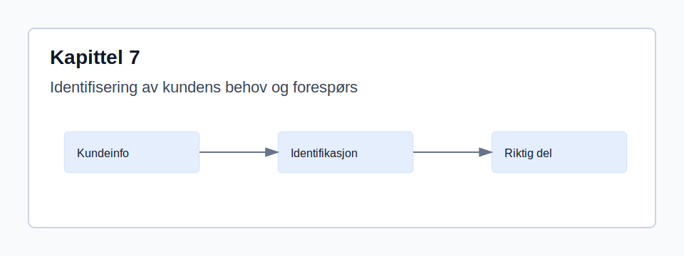

## Tekniske systemillustrasjoner

## Grundig forklaring
Hvordan man finner ut hva kunden faktisk trenger før del velges må forstås både teknisk og praktisk. I marine reservedeler er det sjelden nok å vite hva kunden kaller delen. Medarbeideren må forstå hvilken funksjon delen har, hvor den sitter, hvilken motorvariant den tilhører, og hva som skjer dersom feil del bestilles. Derfor skal tekniske data, kundens beskrivelse og dokumentert katalogoppslag alltid vurderes sammen.

En god sak har fire kjennetegn: den har tydelig identifikasjon, tydelig problem- eller delbeskrivelse, tydelig beslutningsgrunnlag og tydelig oppfølging. Dersom ett av disse punktene mangler, skal saken markeres som usikker før kunden får et bindende svar.

## Praktisk verkstedeksempel
Et verksted står med demontert komponent og trenger rask avklaring. Medarbeideren registrerer kunde, fartøy, motorinformasjon og tidsfrist, ber om bilder av typeplate og komponent, sjekker katalog og lager, og sender et kort skriftlig svar med valgt del, grunnlag for valget og neste oppdateringstidspunkt.

## Kundesupporteksempel
Kunde: 'Motoren går dårlig, kan dere sende riktig del?' Profesjonelt svar: 'Vi kan hjelpe, men først må vi skille mellom symptom og delbehov. Send serienummer, bilde av motorplate, bilde av området feilen gjelder og en kort beskrivelse av når feilen oppstår. Da kan vi foreslå riktig del eller riktig neste feilsøkingstrinn.'

## Vanlige feil og årsaker
- feil eller ufullstendig serienummer.
- delnummer som er erstattet uten at saken dokumenteres.
- symptom som tolkes som delbehov uten feilsøking.
- kunde har bilde av lignende del, men ikke korrekt motorvariant.
- manglende avklaring av antall, side, posisjon eller leveringstid.

## Feilsøkingsflyt
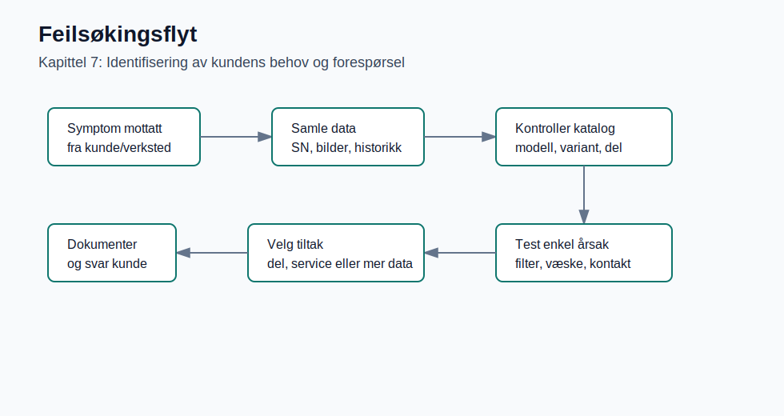

```mermaid
flowchart TD
    A[Symptom eller forespørsel mottatt] --> B[Samle serienummer, bilder og historikk]
    B --> C{Er motor og variant sikkert identifisert?}
    C -- Nei --> D[Be om mer dokumentasjon før del bekreftes]
    C -- Ja --> E[Kontroller delnummer og posisjon i katalog]
    E --> F{Stemmer symptom med foreslått del?}
    F -- Nei --> G[Foreslå feilsøking eller teknisk kontroll]
    F -- Ja --> H[Kontroller lager, pris og levering]
    H --> I[Send dokumentert kundesvar]
```

## Vedlikeholdsprosedyre
1. Avklar driftstimer, siste service og driftsmiljø.
2. Kontroller olje, filter, kjølevæske, sjøvannskrets, reimer, slanger og elektriske kontakter.
3. Sammenlign vedlikeholdsbehov med produsentens intervaller og faktisk bruk.
4. Anbefal servicekit når flere slitedeler bør skiftes samtidig.
5. Dokumenter hva som er anbefalt, hva kunden bestiller og eventuelle avvik fra normal prosedyre.

## Serienummeridentifikasjon
Serienummeridentifikasjon starter med å finne typeplate, motornummer eller annen unik identifikasjon. Be om bilde, ikke bare avskrift, fordi feil tegn, mellomrom og prefiks kan endre katalogoppslaget. Når serienummer ikke finnes, bygges identifikasjonen med modell, produksjonsår, bilder, tidligere fakturaer, servicehistorikk og delnummer fra monterte komponenter.

Minimumsdata bør være: fabrikat, modell, serienummer, eventuell product number/arrangement/CPL/motornummer, bilde av typeplate og bilde av motorens installasjon. Ved tvil skal saken stoppes for avklaring før del bekreftes.

## Reservedelsidentifikasjon
Reservedelsidentifikasjon skal bekrefte delnummer, posisjon, antall per motor, variant, side og eventuell erstatning. Dersom kunden oppgir et gammelt nummer, må det kontrolleres mot supersession. Dersom kunden bare sender bilde, skal bildet brukes som støtte, ikke som eneste grunnlag for bestilling.

Sjekk alltid om delnummeret gjelder enkeltkomponent, reparasjonssett, servicekit eller komplett enhet. Kontroller også om varen er høyre/venstre, gammel/ny type, standard/oversize eller knyttet til en bestemt produksjonsperiode.

## Bestillingsprosedyre
1. Opprett eller oppdater sak med kunde, fartøy, kontaktperson og tidsfrist.
2. Verifiser motoridentifikasjon og lagre bildedokumentasjon.
3. Finn korrekt delnummer i relevant katalog eller leverandørgrunnlag.
4. Kontroller supersession, antall, lagerstatus, pris, returvilkår og leveringstid.
5. Send ordrebekreftelse med delnummer, beskrivelse, antall, pris, levering og forbehold.
6. Følg opp leveransen til kunden har mottatt varen eller saken er lukket.

## Kvalitetspunkter før svar
- Har vi nok data til å gi et sikkert svar?
- Er delnummeret kontrollert mot riktig motorvariant?
- Er kundens tidsfrist realistisk med valgt fraktmåte?
- Er eventuelle forbehold skrevet tydelig?
- Kan en kollega forstå beslutningen ved å lese saken senere?

## Kapittelsammendrag
Hovedpoenget i kapittel 7 er at profesjonelt reservedelsarbeid krever struktur. Teknisk kunnskap, engelske fagtermer, praktisk feilsøking, dokumentasjon og kundedialog må henge sammen. Når medarbeideren jobber systematisk, reduseres feilbestillinger, kunden får bedre svar, og verkstedet kan planlegge arbeidet tryggere.

## Kryssreferanser
- For forrige tema, se kapittel 6: Standard arbeidsflyt for ordrebehandling av reservedeler.
- For neste tema, se kapittel 8: Dokumentasjon av serviceforespørsler og ordreoppsett.
- For grunnleggende identifikasjon, se kapittel 12 og 17.
- For merkevise eksempler, se kapitlene 26-32.

## Fordypning for intern opplæring
Dette kapitlet skal brukes som arbeidsstandard, ikke bare som lesestoff. Når en ny medarbeider møter en sak om behovsavklaring, skal vedkommende trene på å gå rolig fra fakta til vurdering og deretter til handling. I en marinemotorforhandler er konsekvensen av en feil ofte større enn verdien av selve delen. En feil impeller, feil sensor, feil filterinnsats eller feil pakningssett kan føre til tapt verkstedtid, utsatt avgang, irritert kunde og i verste fall ny driftsstans. Derfor skal hver sak behandles som en teknisk beslutning med sporbar dokumentasjon.

Profesjonelt nivå i dette kapitlet betyr at medarbeideren kan arbeide sikkert med behovsavklaring. Før kunden får et bindende svar, skal opplysningene i saken kontrolleres mot motorens identitet, faktisk installasjon og relevant produsentterminologi. Det praktiske målet er ikke å finne et raskt nummer, men å kunne forklare hvorfor valgt del, kontrollpunkt eller kundesvar er riktig for akkurat denne motoren. Når informasjon mangler, skal medarbeideren beskrive hva som mangler, hvorfor det er nødvendig, og hvilket neste steg som bringer saken videre.

## Tekniske forklaringer
Teknisk forståelse i dette kapitlet skal bygges rundt kundens ord, reelt symptom, ønsket del, driftskritikalitet og manglende opplysninger. Medarbeideren må skille mellom synlig symptom, sannsynlig systemfeil og bestillbar komponent. En del kan se riktig ut på bilde, men likevel være feil dersom posisjon, variant, rating, kjøleroppsett, elektrisk plugg, monteringsside eller servicehistorikk ikke stemmer. Derfor skal teknisk vurdering alltid kobles til både funksjon og dokumentasjon: hva gjør komponenten, hvilket system påvirker den, og hvilken produsentkilde bekrefter at den passer.

I praksis betyr dette at tekniske data skal kobles til motorens faktiske installasjon. Marine motorer står ofte trangt, er utsatt for salt, vibrasjon, fukt og ujevnt belastningsmønster, og de kan være bygget om gjennom mange år. En motor kan ha original kjøler, ettermontert eksosbend, alternativ dynamo, endret filterbrakett eller annen sjøvannspumpe enn standard. Slike forhold gjør at delidentifikasjon må bygge på både produsentdata og synlig dokumentasjon fra motoren.

Produsentterminologi er en del av den tekniske forståelsen. Bruk uttrykk som Serial Number, Engine Number, Part Number, Service Kit, Exploded View, Supersession når de er relevante. Ikke oversett dem på en måte som fjerner presisjon. Skriv for eksempel «Engine Serial Number (ESN)» første gang og deretter «ESN» i saken dersom produsenten bruker dette. Skriv «Arrangement Number» når CAT-data krever det, «Product Number» når Volvo Penta bruker det, «CPL» når Cummins-konfigurasjon må kontrolleres, og «Model Code» når Yanmar-identifikasjon bygger på modellkode. Dette gjør dialogen med internasjonale leverandører mer presis.

## Illustrasjonsforslag
- Oversiktsdiagram som viser hvor behovsavklaring passer inn i total arbeidsflyt fra kundeforespørsel til levert del.
- Nærbilde av typeplate/motorskilt med markering av serienummer, motornummer, modell og eventuell variantkode.
- Sprengskisse med markert posisjon, delnummer, antall per motor og mulige alternative versjoner.
- Feilsøkingsflyt med beslutningspunkter: mangler data, stemmer symptom, kreves mer teknisk kontroll, kan ordre bekreftes.
- Sammenligningsbilde av gammel og ny del der forskjell i tilkobling, side, lengde eller sensorplugg er markert.

## Virkelige verkstedseksempler
Eksempel 1: Et verksted står med en demontert komponent på benken og kunden venter på avklaring før fartøyet kan settes tilbake i drift. Verkstedet sender et nærbilde av delen, men ingen motorplate. En uerfaren medarbeider kan bli fristet til å søke på nummeret som står på støpegodset. En profesjonell medarbeider svarer at støpenummer ikke nødvendigvis er bestillbart delnummer, ber om bilde av typeplate, oversiktsbilde av motoren og bilde av monteringsstedet, og forklarer at dette hindrer feilbestilling. Når informasjonen kommer, kontrolleres delnummer mot sprengskisse, posisjon og antall. Først da gis pris og leveringstid.

Eksempel 2: En kunde ringer sent på dagen og sier at motoren har høy temperatur etter service. Kunden ønsker ny termostat. Medarbeideren skal ikke automatisk konkludere med termostatfeil. Spørsmålene bør avklare om impeller er byttet, om sjøvannsfilteret er rent, om kjølevæskenivået er riktig, om alarmen kommer ved tomgang eller belastning, og om det finnes lekkasje rundt varmeveksler eller slanger. Dersom kunden likevel vil bestille termostat, dokumenteres at feilsøking er anbefalt, og delnummer kontrolleres mot serienummer før ordre.

Eksempel 3: En intern selger mottar en gammel faktura med et delnummer som ikke lenger finnes. Riktig prosess er å kontrollere supersession, se om ny del krever tilhørende pakning, boltsett eller adapter, og notere både gammelt og nytt nummer i saken. Kunden skal få vite at delen er erstattet, hva som leveres, og om det finnes monteringsforbehold.

## Reservedelsidentifisering i praksis
Reservedelsidentifisering skal følge en fast rekkefølge. Først kontrolleres motorens identitet. Deretter kontrolleres delens system: drivstoff, luft, kjøling, smøring, eksos, elektrisk eller mekanisk kraftoverføring. Så kontrolleres posisjon i sprengskisse eller parts list. Til slutt kontrolleres antall, variant, supersession og leveringsstatus. Denne rekkefølgen hindrer at medarbeideren hopper direkte fra kundens ord til et tilfeldig delnummer.

Når en del har synlig nummer, må nummeret tolkes riktig. Mange komponenter har produksjonsnummer, støpenummer, leverandørnummer eller revisjonskode som ikke er det samme som bestillbart part number. Et filter kan ha nummer fra filterprodusent, men motorprodusentens parts catalogue kan bruke et annet nummer. En pumpe kan ha nummer på lokk, hus og komplett enhet. Spør derfor alltid: gjelder nummeret komplett del, reparasjonssett, underkomponent eller produsentens råkomponent?

## Serienummer og motornummer
Serienummer og motornummer er grunnlaget for korrekt katalogoppslag. Be kunden sende bilde av typeplate eller dataplate. Dersom kunden skriver nummeret manuelt, skal nummeret likevel kontrolleres mot bilde når det er mulig. Noter hele nummeret, inkludert prefiks, suffiks, bindestrek, mellomrom og eventuelle bokstaver. På enkelte produsenter kan små forskjeller peke til forskjellig produksjonsperiode, rating eller konfigurasjon.

Bruk motornummer sammen med modell, variant og applikasjon. En motor som driver generator kan ha andre deler enn en fremdriftsmotor. En motor i yrkesbåt kan ha annen rating enn samme motor i fritidsbåt. En eldre motor kan være bygget om med ny dynamo, annen sjøvannspumpe eller uoriginal filterbrakett. Dersom typeplate mangler, bygg identifikasjonen gjennom flere kilder: servicebok, tidligere faktura, bilder av motorens sider, nummer på pumpe, filter, turbo og gear, samt opplysninger om fartøy og produksjonsår.

## Feilsøking steg for steg
1. Definer symptomet med kundens egne ord og skriv det i saken. Skill mellom «kunden ønsker del» og «kunden beskriver feil».
2. Avklar når feilen oppstår: start, tomgang, belastning, marsjfart, varm motor, kald motor eller etter nylig service.
3. Kontroller grunnleggende forhold: væskenivå, filter, luft i drivstoff, sjøvannsstrøm, reimer, elektriske kontakter, sikringer og synlige lekkasjer.
4. Knytt symptomet til system: lav effekt peker ofte mot luft/drivstoff/eksos, høy temperatur mot kjøling, lavt oljetrykk mot smøring/sensor, startproblem mot batteri/starter/gløding/drivstoff.
5. Be om bilder eller måledata dersom symptomet ikke kan kobles sikkert til en del. Dette kan være bilde av alarmdisplay, trykkmåling, temperaturmåling eller bilde av montert komponent.
6. Kontroller relevant delnummer mot serienummer og variant. Dersom flere alternativer finnes, forklar kunden hva som skiller dem.
7. Dokumenter anbefalt tiltak, usikkerhet og eventuelle forbehold før ordre bekreftes.

## Vedlikehold
Vedlikehold skal vurderes mot driftstimer, produsentens maintenance schedule og faktisk driftsmiljø. Marine motorer som går korte turer, mye tomgang eller i salt miljø kan trenge hyppigere kontroll enn standard intervall antyder. Nye medarbeidere skal lære å spørre om siste service, hvilke filter som ble byttet, hvilken olje som ble brukt, om impeller er kontrollert, og om kjølevæske eller anoder er byttet etter plan.

En god vedlikeholdsanbefaling er konkret. I stedet for å skrive «ta service», bør medarbeideren foreslå relevante deler: olje- og drivstoffilter, luftfilter, impeller, reim, pakninger, anoder, kjølevæske og eventuelt servicekit. Dersom kunden har ukjent servicehistorikk, bør komplett servicekit vurderes. Dersom kunden har hatt overoppheting, bør sjøvannskrets og varmeveksler kontrolleres før bare én komponent byttes.

## Vanlige feil
- Serienummer leses feil fordi et tegn forveksles, for eksempel O/0 eller I/1.
- Kunden oppgir modellnavn, men ikke variant, rating eller applikasjon.
- Del velges ut fra bilde alene uten kontroll mot sprengskisse eller produsentkatalog.
- Supersession aksepteres uten å kontrollere om ny del krever tilbehør, pakning eller ombygging.
- Hastepress gjør at leveringsløfte gis før lagerstatus og fraktmulighet er bekreftet.
- Saksnotat mangler grunnlaget for beslutningen, slik at kollega ikke kan etterprøve valget.

## Kontrollspørsmål
- Hva er den viktigste tekniske risikoen i en sak som gjelder behovsavklaring?
- Hvilke opplysninger må dokumenteres før bindende delnummer bekreftes?
- Hvordan forklarer du kunden hvorfor bilde av typeplate er nødvendig?
- Når bør du stoppe en ordre og be om mer dokumentasjon?
- Hvilke engelske produsentuttrykk bør du kunne bruke i denne typen sak?
- Hvordan dokumenterer du at et delnummer er erstattet av et nytt nummer?

## Praktisk sjekkliste for medarbeider
- Les saken som om en kollega skal overta den i morgen.
- Kontroller at motoridentifikasjon er dokumentert med bilde eller sikker kilde.
- Sjekk at delnummeret er knyttet til riktig posisjon i katalogen.
- Skriv tydelig om kunden har bedt om enkeltkomponent, servicekit eller komplett enhet.
- Noter om varen er spesialbestilling, utgått, erstattet eller ikke returbar.
- Send kundesvar med neste steg, ikke bare et løst delnummer.

## Kapittelspesifikk systemforståelse
For dette kapitlet er kjernen å forstå metodikk for behovsavklaring før teknisk valg. Medarbeideren skal kunne forklare dette med praktiske ord til både kunde og kollega. Det betyr at teknisk teori må kobles til konkrete handlinger: hvilke data skal innhentes, hvilke komponenter kan være berørt, hvilken produsentterminologi skal brukes, og hva må dokumenteres før saken kan gå videre. Kundens første formulering er ofte et startpunkt, ikke en ferdig teknisk spesifikasjon.

Når systemet vurderes, skal medarbeideren først plassere problemet i riktig teknisk sammenheng. Dersom kunden beskriver en alarm, må man finne ut om alarmen kommer fra reelt mekanisk avvik, elektrisk sensorfeil, feil etter service eller feil tolkning av instrumentet. Dersom kunden beskriver en del, må man avklare om kunden mener komplett enhet, servicekit, reparasjonssett eller enkeltkomponent. Dersom kunden beskriver motoren med vanlig navn, må man kontrollere om produsenten bruker mer presise begreper i katalogen.

## Komponentoversikt og arbeidsgrense
Relevante komponenter og opplysninger i dette kapitlet omfatter: symptom, ønsket del, driftskritikalitet, fartøydata, installasjon, bilder og historikk. Listen er ikke ment som en erstatning for produsentens parts catalogue, men som en praktisk påminnelse om hva nye medarbeidere skal tenke på før de søker del. I interne saker skal komponentnavn skrives så presist som mulig. Bruk for eksempel «sjøvannspumpe / raw water pump» i stedet for bare «pumpe» når funksjonen er kjent, og «varmeveksler / heat exchanger» i stedet for bare «kjøler» når det er den komponenten saken gjelder.

Arbeidsgrensen for en reservedelsmedarbeider er også viktig. Medarbeideren skal ikke overta mekanikerens ansvar for demontering, måling eller diagnose på motoren, men skal kunne stille riktige spørsmål og foreslå riktig dokumentasjon. Når en sak går fra enkel delidentifikasjon til teknisk diagnose, skal dette markeres i saken. Da kan verksted, teknisk ansvarlig eller leverandør involveres med et klart spørsmål og et ryddig faktagrunnlag.

## Praktisk beslutningsregel
Bruk denne regelen i alle saker knyttet til kapitlet: Hvis motoridentifikasjon, komponentposisjon eller symptom ikke er sikkert nok dokumentert, skal medarbeideren ikke gi bindende delbekreftelse. Kunden kan få et foreløpig svar, men svaret må inneholde hva som mangler, hvorfor det mangler, og hva som skjer når informasjonen er mottatt. Dette er ikke treg service; det er profesjonell risikokontroll.

## Realistisk opplæring i praksis
### Verkstedhistorie
En typisk sak i dette temaet starter med kunden ber om pumpe uten å vite hvilken. Verkstedet trenger et raskt svar, men den erfarne medarbeideren stopper opp og spør først: hva vet vi sikkert, hva antar vi, og hva kan gi følgeskade hvis vi tar feil? I praksis betyr det at symptom, delønske og system må kobles til bilde, serienummer, komponentposisjon og kundens symptom før saken lukkes. Historien skal brukes i opplæring som en øvelse i å skrive et kort saksnotat: observasjon, vurdering, neste handling og forbehold.

### Kundehistorie
Kunden beskriver ofte problemet med driftsspråk: «motoren går tungt», «alarm kommer etter ti minutter», «jeg trenger den samme delen som sist» eller «båten skal ut i morgen». En profesjonell respons er rolig og konkret: bekreft behovet, forklar hvorfor identifikasjon trengs, be om riktig dokumentasjon og gi et realistisk tidspunkt for neste svar. Ikke korriger kunden unødvendig; oversett kundens språk til teknisk språk i saken.

### Typiske feil nye ansatte gjør
- søker på første synlige nummer uten å avklare om det er støpenummer, leverandørnummer eller bestillbart part number.
- lover levering før lagerstatus, frakt og returvilkår er kontrollert.
- antar at tidligere faktura alltid gjelder samme motorvariant.
- blander symptom og årsak, spesielt ved varme, lav effekt, startproblem og alarm.
- skriver for korte notater slik at kollega ikke kan forstå hvorfor valget ble tatt.

### Tips fra erfarne mekanikere og reservedelsselgere
- Se alltid etter systemet rundt delen: slanger, braketter, sensorer, reimer, kjølere og tilkoblinger forteller ofte mer enn delen alene.
- Still ett presist spørsmål om gangen når kunden er stresset; mange dårlige svar kommer av for lange spørsmålslister.
- Sammenlign gammel og ny del mot funksjon, ikke bare form. Riktig del skal passe, men også løse riktig problem.
- En erfaren reservedelsselger tenker i risiko: Hva er billigst å avklare nå, og hva blir dyrt hvis vi hopper over det?

### Vanlige kundespørsmål
| Spørsmål fra kunde | Profesjonelt svar |
|---|---|
| «Kan du bare sende samme del som sist?» | «Ja, hvis vi først bekrefter at det gjelder samme motor, samme posisjon og ingen supersession siden sist.» |
| «Holder det med bilde?» | «Bilde hjelper, men vi trenger også motoridentitet for å sikre variant og delnummer.» |
| «Hvorfor tar dette tid?» | «Fordi feil del kan gi ny driftsstans. Vi kontrollerer grunnlaget før vi lover levering.» |

### Beslutningstre for saken
| Trinn | Spørsmål | Handling |
|---|---|---|
| 1 | Er motoridentitet dokumentert med bilde eller sikker historikk? | Hvis nei: be om typeplate/dataplate eller alternativ dokumentasjon. |
| 2 | Er komponentens funksjon og posisjon kjent? | Hvis nei: be om oversiktsbilde og bilde av monteringssted. |
| 3 | Stemmer kundens symptom med delen som ønskes? | Hvis nei: anbefal feilsøking før del bestilles. |
| 4 | Finnes det supersession, kit eller variantvalg? | Kontroller produsentkilde og skriv forbehold i saken. |
| 5 | Kan pris, levering og returvilkår bekreftes? | Send dokumentert svar med neste steg og tydelig gyldighet. |

### Rask oppslagstabell
| Situasjon | Kontroller først | Vanlig fallgruve |
|---|---|---|
| Hasteordre | sikker motor-ID, lager, fraktfrist | levering loves før teknisk kontroll |
| Del fra bilde | posisjon, skala, tilkoblinger, nummer | bilde brukes som eneste beslutningsgrunnlag |
| Gammelt delnummer | supersession og kitinnhold | ny del krever ekstra pakning eller adapter |
| Uklart symptom | driftssituasjon, alarm, siste service | symptom blir tolket som sikker komponentfeil |

### Praktisk sjekkliste og inspeksjonsrutine
- Start med motoridentitet: fabrikat, modell, serienummer, variant, applikasjon og bilde av skilt.
- Kontroller området rundt komponenten: lekkasje, korrosjon, knekte fester, slitasje, varmemerker og uoriginale endringer.
- Spør om siste vedlikehold: olje, filter, impeller, reimer, kjølevæske, anoder og drivstoffilter.
- Noter driftstype: fritidsbruk, yrkesbruk, generator, fremdrift, tomgangsdrift eller langvarig høy belastning.
- Avklar om saken gjelder akutt drift, planlagt service, reklamasjon eller lagerpåfyll.

### Generelle vedlikeholdsintervaller som opplæringspunkt
| Kontrollpunkt | Typisk vurdering i opplæring | Må verifiseres |
|---|---|---|
| Olje og oljefilter | ofte basert på timer og kalender | produsentens maintenance schedule |
| Drivstoffilter/vannutskiller | hyppigere ved dårlig drivstoff eller sesongstart | motor- og filterspesifikasjon |
| Impeller og sjøvannskrets | kontrolleres særlig før sesong og etter varmgang | produsentens intervall og installasjon |
| Reimer, slanger og klemmer | visuell kontroll ved service og feilsøking | dimensjon, stramming og delnummer |

### Produsentverifikasjon
Alle konkrete delnumre, momentverdier, serviceintervaller, garantikrav, programvaredata og produsentspesifikke grenser skal kontrolleres mot offisiell produsentdokumentasjon før de brukes i tilbud, ordre eller verkstedinstruks. Marker tydelig i saken når svaret bygger på antakelse, eldre historikk, bilde uten motor-ID eller generell erfaring. Intervaller i tabellen er generelle opplæringspunkter. Faktiske intervaller styres av produsent, motorvariant, driftstimer, kalenderkrav, belastning og miljø.

## Produsentverifikasjon og faglig forbehold
Denne manualen skal brukes som intern opplæring og arbeidsmetode. Produsentspesifikke delnumre, intervaller, momentverdier, garantikrav og tekniske grenseverdier skal verifiseres mot gjeldende produsentdokumentasjon før de brukes i kundeordre eller verkstedinstruks. Marker saken internt dersom opplysningen bygger på antakelse, eldre historikk eller bilde uten bekreftet motoridentitet.

## Quiz med fasit
1. Hvilke tekniske data bør alltid samles før en del bekreftes?
2. Hvorfor er engelsk terminologi viktig i marine reservedeler?
3. Hva bør gjøres dersom kunden bare sender et bilde av delen?
4. Hvilke punkter bør kontrolleres før ordrebekreftelse sendes?
5. Hvorfor skal feilsøking dokumenteres, selv når kunden allerede ber om en bestemt del?

### Svar
1. Fabrikat, modell, serienummer, variantdata, bilde av typeplate, delnummer, posisjon og kundens symptombeskrivelse.
2. Fordi kataloger, portaler, servicemanualer og leverandørdialog ofte bruker engelske begreper som må forstås presist.
3. Be om serienummer, oversiktsbilde av motoren og eventuelle nummer på delen; bildet brukes som støtte, ikke eneste grunnlag.
4. Delnummer, antall, variant, pris, lagerstatus, leveringstid, frakt, returvilkår og eventuelle forbehold.
5. Fordi symptomet kan ha flere årsaker, og dokumentasjon viser hvorfor anbefalingen ble gitt.

---

# Kapittel 8: Dokumentasjon av serviceforespørsler og ordreoppsett

## Kapittelrolle
Dette kapitlet gir en grundig praktisk innføring i saksdokumentasjon. Temaet er viktig fordi reservedelsarbeid i marine miljøer kombinerer teknisk forståelse, presis kundedialog, dokumentert saksbehandling og realistisk leveranseoppfølging. Målet er at en ny medarbeider skal kunne bruke kunnskapen direkte i arbeid med verksted, kunde, lager og leverandør.

## Læringsmål
Etter kapitlet skal deltakeren kunne:
- forklare hovedbegrepene innen saksdokumentasjon
- bruke serienummer, modellinformasjon og delnummer i praktisk reservedelsarbeid
- kommunisere trygt med kunde, verksted, lager og leverandør
- dokumentere beslutninger slik at andre kan etterprøve saken
- kjenne igjen vanlige feil og velge riktig neste handling

## English technical terminology
- **Serial Number:** engelsk fagterm som ofte brukes i kataloger, servicelitteratur, leverandørportaler og internasjonal kundedialog.
- **Part Number:** engelsk fagterm som ofte brukes i kataloger, servicelitteratur, leverandørportaler og internasjonal kundedialog.
- **Engine Model:** engelsk fagterm som ofte brukes i kataloger, servicelitteratur, leverandørportaler og internasjonal kundedialog.
- **Variant:** engelsk fagterm som ofte brukes i kataloger, servicelitteratur, leverandørportaler og internasjonal kundedialog.
- **Service Kit:** engelsk fagterm som ofte brukes i kataloger, servicelitteratur, leverandørportaler og internasjonal kundedialog.
- **Troubleshooting:** engelsk fagterm som ofte brukes i kataloger, servicelitteratur, leverandørportaler og internasjonal kundedialog.
- **Maintenance:** engelsk fagterm som ofte brukes i kataloger, servicelitteratur, leverandørportaler og internasjonal kundedialog.
- **Ordering Procedure:** engelsk fagterm som ofte brukes i kataloger, servicelitteratur, leverandørportaler og internasjonal kundedialog.
- **Supersession:** engelsk fagterm som ofte brukes i kataloger, servicelitteratur, leverandørportaler og internasjonal kundedialog.
- **Technical Support:** engelsk fagterm som ofte brukes i kataloger, servicelitteratur, leverandørportaler og internasjonal kundedialog.

## Hoveddiagram
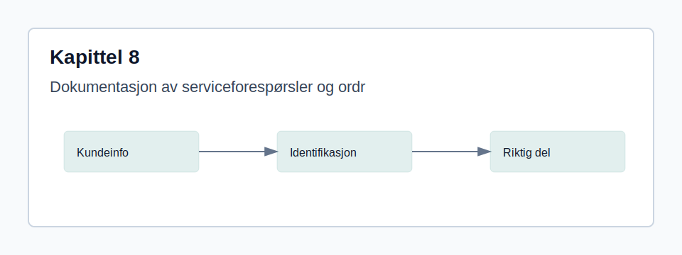

## Tekniske systemillustrasjoner

## Grundig forklaring
Hvordan tekniske data, bilder, avtaler og beslutninger registreres sporbarhet må forstås både teknisk og praktisk. I marine reservedeler er det sjelden nok å vite hva kunden kaller delen. Medarbeideren må forstå hvilken funksjon delen har, hvor den sitter, hvilken motorvariant den tilhører, og hva som skjer dersom feil del bestilles. Derfor skal tekniske data, kundens beskrivelse og dokumentert katalogoppslag alltid vurderes sammen.

En god sak har fire kjennetegn: den har tydelig identifikasjon, tydelig problem- eller delbeskrivelse, tydelig beslutningsgrunnlag og tydelig oppfølging. Dersom ett av disse punktene mangler, skal saken markeres som usikker før kunden får et bindende svar.

## Praktisk verkstedeksempel
Et verksted står med demontert komponent og trenger rask avklaring. Medarbeideren registrerer kunde, fartøy, motorinformasjon og tidsfrist, ber om bilder av typeplate og komponent, sjekker katalog og lager, og sender et kort skriftlig svar med valgt del, grunnlag for valget og neste oppdateringstidspunkt.

## Kundesupporteksempel
Kunde: 'Motoren går dårlig, kan dere sende riktig del?' Profesjonelt svar: 'Vi kan hjelpe, men først må vi skille mellom symptom og delbehov. Send serienummer, bilde av motorplate, bilde av området feilen gjelder og en kort beskrivelse av når feilen oppstår. Da kan vi foreslå riktig del eller riktig neste feilsøkingstrinn.'

## Vanlige feil og årsaker
- feil eller ufullstendig serienummer.
- delnummer som er erstattet uten at saken dokumenteres.
- symptom som tolkes som delbehov uten feilsøking.
- kunde har bilde av lignende del, men ikke korrekt motorvariant.
- manglende avklaring av antall, side, posisjon eller leveringstid.

## Feilsøkingsflyt

```mermaid
flowchart TD
    A[Symptom eller forespørsel mottatt] --> B[Samle serienummer, bilder og historikk]
    B --> C{Er motor og variant sikkert identifisert?}
    C -- Nei --> D[Be om mer dokumentasjon før del bekreftes]
    C -- Ja --> E[Kontroller delnummer og posisjon i katalog]
    E --> F{Stemmer symptom med foreslått del?}
    F -- Nei --> G[Foreslå feilsøking eller teknisk kontroll]
    F -- Ja --> H[Kontroller lager, pris og levering]
    H --> I[Send dokumentert kundesvar]
```

## Vedlikeholdsprosedyre
1. Avklar driftstimer, siste service og driftsmiljø.
2. Kontroller olje, filter, kjølevæske, sjøvannskrets, reimer, slanger og elektriske kontakter.
3. Sammenlign vedlikeholdsbehov med produsentens intervaller og faktisk bruk.
4. Anbefal servicekit når flere slitedeler bør skiftes samtidig.
5. Dokumenter hva som er anbefalt, hva kunden bestiller og eventuelle avvik fra normal prosedyre.

## Serienummeridentifikasjon
Serienummeridentifikasjon starter med å finne typeplate, motornummer eller annen unik identifikasjon. Be om bilde, ikke bare avskrift, fordi feil tegn, mellomrom og prefiks kan endre katalogoppslaget. Når serienummer ikke finnes, bygges identifikasjonen med modell, produksjonsår, bilder, tidligere fakturaer, servicehistorikk og delnummer fra monterte komponenter.

Minimumsdata bør være: fabrikat, modell, serienummer, eventuell product number/arrangement/CPL/motornummer, bilde av typeplate og bilde av motorens installasjon. Ved tvil skal saken stoppes for avklaring før del bekreftes.

## Reservedelsidentifikasjon
Reservedelsidentifikasjon skal bekrefte delnummer, posisjon, antall per motor, variant, side og eventuell erstatning. Dersom kunden oppgir et gammelt nummer, må det kontrolleres mot supersession. Dersom kunden bare sender bilde, skal bildet brukes som støtte, ikke som eneste grunnlag for bestilling.

Sjekk alltid om delnummeret gjelder enkeltkomponent, reparasjonssett, servicekit eller komplett enhet. Kontroller også om varen er høyre/venstre, gammel/ny type, standard/oversize eller knyttet til en bestemt produksjonsperiode.

## Bestillingsprosedyre
1. Opprett eller oppdater sak med kunde, fartøy, kontaktperson og tidsfrist.
2. Verifiser motoridentifikasjon og lagre bildedokumentasjon.
3. Finn korrekt delnummer i relevant katalog eller leverandørgrunnlag.
4. Kontroller supersession, antall, lagerstatus, pris, returvilkår og leveringstid.
5. Send ordrebekreftelse med delnummer, beskrivelse, antall, pris, levering og forbehold.
6. Følg opp leveransen til kunden har mottatt varen eller saken er lukket.

## Kvalitetspunkter før svar
- Har vi nok data til å gi et sikkert svar?
- Er delnummeret kontrollert mot riktig motorvariant?
- Er kundens tidsfrist realistisk med valgt fraktmåte?
- Er eventuelle forbehold skrevet tydelig?
- Kan en kollega forstå beslutningen ved å lese saken senere?

## Kapittelsammendrag
Hovedpoenget i kapittel 8 er at profesjonelt reservedelsarbeid krever struktur. Teknisk kunnskap, engelske fagtermer, praktisk feilsøking, dokumentasjon og kundedialog må henge sammen. Når medarbeideren jobber systematisk, reduseres feilbestillinger, kunden får bedre svar, og verkstedet kan planlegge arbeidet tryggere.

## Kryssreferanser
- For forrige tema, se kapittel 7: Identifisering av kundens behov og forespørsel.
- For neste tema, se kapittel 9: Kvalitetssikring før sending av ordre.
- For grunnleggende identifikasjon, se kapittel 12 og 17.
- For merkevise eksempler, se kapitlene 26-32.

## Fordypning for intern opplæring
Dette kapitlet skal brukes som arbeidsstandard, ikke bare som lesestoff. Når en ny medarbeider møter en sak om saksdokumentasjon, skal vedkommende trene på å gå rolig fra fakta til vurdering og deretter til handling. I en marinemotorforhandler er konsekvensen av en feil ofte større enn verdien av selve delen. En feil impeller, feil sensor, feil filterinnsats eller feil pakningssett kan føre til tapt verkstedtid, utsatt avgang, irritert kunde og i verste fall ny driftsstans. Derfor skal hver sak behandles som en teknisk beslutning med sporbar dokumentasjon.

Profesjonelt nivå i dette kapitlet betyr at medarbeideren kan arbeide sikkert med saksdokumentasjon. Før kunden får et bindende svar, skal opplysningene i saken kontrolleres mot motorens identitet, faktisk installasjon og relevant produsentterminologi. Det praktiske målet er ikke å finne et raskt nummer, men å kunne forklare hvorfor valgt del, kontrollpunkt eller kundesvar er riktig for akkurat denne motoren. Når informasjon mangler, skal medarbeideren beskrive hva som mangler, hvorfor det er nødvendig, og hvilket neste steg som bringer saken videre.

## Tekniske forklaringer
Teknisk forståelse i dette kapitlet skal bygges rundt servicenotat, bilder, motoridentitet, delposisjon, beslutningsgrunnlag og historikk. Medarbeideren må skille mellom synlig symptom, sannsynlig systemfeil og bestillbar komponent. En del kan se riktig ut på bilde, men likevel være feil dersom posisjon, variant, rating, kjøleroppsett, elektrisk plugg, monteringsside eller servicehistorikk ikke stemmer. Derfor skal teknisk vurdering alltid kobles til både funksjon og dokumentasjon: hva gjør komponenten, hvilket system påvirker den, og hvilken produsentkilde bekrefter at den passer.

I praksis betyr dette at tekniske data skal kobles til motorens faktiske installasjon. Marine motorer står ofte trangt, er utsatt for salt, vibrasjon, fukt og ujevnt belastningsmønster, og de kan være bygget om gjennom mange år. En motor kan ha original kjøler, ettermontert eksosbend, alternativ dynamo, endret filterbrakett eller annen sjøvannspumpe enn standard. Slike forhold gjør at delidentifikasjon må bygge på både produsentdata og synlig dokumentasjon fra motoren.

Produsentterminologi er en del av den tekniske forståelsen. Bruk uttrykk som Serial Number, Engine Number, Part Number, Service Kit, Exploded View, Supersession når de er relevante. Ikke oversett dem på en måte som fjerner presisjon. Skriv for eksempel «Engine Serial Number (ESN)» første gang og deretter «ESN» i saken dersom produsenten bruker dette. Skriv «Arrangement Number» når CAT-data krever det, «Product Number» når Volvo Penta bruker det, «CPL» når Cummins-konfigurasjon må kontrolleres, og «Model Code» når Yanmar-identifikasjon bygger på modellkode. Dette gjør dialogen med internasjonale leverandører mer presis.

## Illustrasjonsforslag
- Oversiktsdiagram som viser hvor saksdokumentasjon passer inn i total arbeidsflyt fra kundeforespørsel til levert del.
- Nærbilde av typeplate/motorskilt med markering av serienummer, motornummer, modell og eventuell variantkode.
- Sprengskisse med markert posisjon, delnummer, antall per motor og mulige alternative versjoner.
- Feilsøkingsflyt med beslutningspunkter: mangler data, stemmer symptom, kreves mer teknisk kontroll, kan ordre bekreftes.
- Sammenligningsbilde av gammel og ny del der forskjell i tilkobling, side, lengde eller sensorplugg er markert.

## Virkelige verkstedseksempler
Eksempel 1: Et verksted står med en demontert komponent på benken og kunden venter på avklaring før fartøyet kan settes tilbake i drift. Verkstedet sender et nærbilde av delen, men ingen motorplate. En uerfaren medarbeider kan bli fristet til å søke på nummeret som står på støpegodset. En profesjonell medarbeider svarer at støpenummer ikke nødvendigvis er bestillbart delnummer, ber om bilde av typeplate, oversiktsbilde av motoren og bilde av monteringsstedet, og forklarer at dette hindrer feilbestilling. Når informasjonen kommer, kontrolleres delnummer mot sprengskisse, posisjon og antall. Først da gis pris og leveringstid.

Eksempel 2: En kunde ringer sent på dagen og sier at motoren har høy temperatur etter service. Kunden ønsker ny termostat. Medarbeideren skal ikke automatisk konkludere med termostatfeil. Spørsmålene bør avklare om impeller er byttet, om sjøvannsfilteret er rent, om kjølevæskenivået er riktig, om alarmen kommer ved tomgang eller belastning, og om det finnes lekkasje rundt varmeveksler eller slanger. Dersom kunden likevel vil bestille termostat, dokumenteres at feilsøking er anbefalt, og delnummer kontrolleres mot serienummer før ordre.

Eksempel 3: En intern selger mottar en gammel faktura med et delnummer som ikke lenger finnes. Riktig prosess er å kontrollere supersession, se om ny del krever tilhørende pakning, boltsett eller adapter, og notere både gammelt og nytt nummer i saken. Kunden skal få vite at delen er erstattet, hva som leveres, og om det finnes monteringsforbehold.

## Reservedelsidentifisering i praksis
Reservedelsidentifisering skal følge en fast rekkefølge. Først kontrolleres motorens identitet. Deretter kontrolleres delens system: drivstoff, luft, kjøling, smøring, eksos, elektrisk eller mekanisk kraftoverføring. Så kontrolleres posisjon i sprengskisse eller parts list. Til slutt kontrolleres antall, variant, supersession og leveringsstatus. Denne rekkefølgen hindrer at medarbeideren hopper direkte fra kundens ord til et tilfeldig delnummer.

Når en del har synlig nummer, må nummeret tolkes riktig. Mange komponenter har produksjonsnummer, støpenummer, leverandørnummer eller revisjonskode som ikke er det samme som bestillbart part number. Et filter kan ha nummer fra filterprodusent, men motorprodusentens parts catalogue kan bruke et annet nummer. En pumpe kan ha nummer på lokk, hus og komplett enhet. Spør derfor alltid: gjelder nummeret komplett del, reparasjonssett, underkomponent eller produsentens råkomponent?

## Serienummer og motornummer
Serienummer og motornummer er grunnlaget for korrekt katalogoppslag. Be kunden sende bilde av typeplate eller dataplate. Dersom kunden skriver nummeret manuelt, skal nummeret likevel kontrolleres mot bilde når det er mulig. Noter hele nummeret, inkludert prefiks, suffiks, bindestrek, mellomrom og eventuelle bokstaver. På enkelte produsenter kan små forskjeller peke til forskjellig produksjonsperiode, rating eller konfigurasjon.

Bruk motornummer sammen med modell, variant og applikasjon. En motor som driver generator kan ha andre deler enn en fremdriftsmotor. En motor i yrkesbåt kan ha annen rating enn samme motor i fritidsbåt. En eldre motor kan være bygget om med ny dynamo, annen sjøvannspumpe eller uoriginal filterbrakett. Dersom typeplate mangler, bygg identifikasjonen gjennom flere kilder: servicebok, tidligere faktura, bilder av motorens sider, nummer på pumpe, filter, turbo og gear, samt opplysninger om fartøy og produksjonsår.

## Feilsøking steg for steg
1. Definer symptomet med kundens egne ord og skriv det i saken. Skill mellom «kunden ønsker del» og «kunden beskriver feil».
2. Avklar når feilen oppstår: start, tomgang, belastning, marsjfart, varm motor, kald motor eller etter nylig service.
3. Kontroller grunnleggende forhold: væskenivå, filter, luft i drivstoff, sjøvannsstrøm, reimer, elektriske kontakter, sikringer og synlige lekkasjer.
4. Knytt symptomet til system: lav effekt peker ofte mot luft/drivstoff/eksos, høy temperatur mot kjøling, lavt oljetrykk mot smøring/sensor, startproblem mot batteri/starter/gløding/drivstoff.
5. Be om bilder eller måledata dersom symptomet ikke kan kobles sikkert til en del. Dette kan være bilde av alarmdisplay, trykkmåling, temperaturmåling eller bilde av montert komponent.
6. Kontroller relevant delnummer mot serienummer og variant. Dersom flere alternativer finnes, forklar kunden hva som skiller dem.
7. Dokumenter anbefalt tiltak, usikkerhet og eventuelle forbehold før ordre bekreftes.

## Vedlikehold
Vedlikehold skal vurderes mot driftstimer, produsentens maintenance schedule og faktisk driftsmiljø. Marine motorer som går korte turer, mye tomgang eller i salt miljø kan trenge hyppigere kontroll enn standard intervall antyder. Nye medarbeidere skal lære å spørre om siste service, hvilke filter som ble byttet, hvilken olje som ble brukt, om impeller er kontrollert, og om kjølevæske eller anoder er byttet etter plan.

En god vedlikeholdsanbefaling er konkret. I stedet for å skrive «ta service», bør medarbeideren foreslå relevante deler: olje- og drivstoffilter, luftfilter, impeller, reim, pakninger, anoder, kjølevæske og eventuelt servicekit. Dersom kunden har ukjent servicehistorikk, bør komplett servicekit vurderes. Dersom kunden har hatt overoppheting, bør sjøvannskrets og varmeveksler kontrolleres før bare én komponent byttes.

## Vanlige feil
- Serienummer leses feil fordi et tegn forveksles, for eksempel O/0 eller I/1.
- Kunden oppgir modellnavn, men ikke variant, rating eller applikasjon.
- Del velges ut fra bilde alene uten kontroll mot sprengskisse eller produsentkatalog.
- Supersession aksepteres uten å kontrollere om ny del krever tilbehør, pakning eller ombygging.
- Hastepress gjør at leveringsløfte gis før lagerstatus og fraktmulighet er bekreftet.
- Saksnotat mangler grunnlaget for beslutningen, slik at kollega ikke kan etterprøve valget.

## Kontrollspørsmål
- Hva er den viktigste tekniske risikoen i en sak som gjelder saksdokumentasjon?
- Hvilke opplysninger må dokumenteres før bindende delnummer bekreftes?
- Hvordan forklarer du kunden hvorfor bilde av typeplate er nødvendig?
- Når bør du stoppe en ordre og be om mer dokumentasjon?
- Hvilke engelske produsentuttrykk bør du kunne bruke i denne typen sak?
- Hvordan dokumenterer du at et delnummer er erstattet av et nytt nummer?

## Praktisk sjekkliste for medarbeider
- Les saken som om en kollega skal overta den i morgen.
- Kontroller at motoridentifikasjon er dokumentert med bilde eller sikker kilde.
- Sjekk at delnummeret er knyttet til riktig posisjon i katalogen.
- Skriv tydelig om kunden har bedt om enkeltkomponent, servicekit eller komplett enhet.
- Noter om varen er spesialbestilling, utgått, erstattet eller ikke returbar.
- Send kundesvar med neste steg, ikke bare et løst delnummer.

## Kapittelspesifikk systemforståelse
For dette kapitlet er kjernen å forstå sporbar dokumentasjon i serviceforespørsler og ordreoppsett. Medarbeideren skal kunne forklare dette med praktiske ord til både kunde og kollega. Det betyr at teknisk teori må kobles til konkrete handlinger: hvilke data skal innhentes, hvilke komponenter kan være berørt, hvilken produsentterminologi skal brukes, og hva må dokumenteres før saken kan gå videre. Dokumentasjon skal skrives slik at en kollega kan overta saken uten muntlig forklaring.

Når systemet vurderes, skal medarbeideren først plassere problemet i riktig teknisk sammenheng. Dersom kunden beskriver en alarm, må man finne ut om alarmen kommer fra reelt mekanisk avvik, elektrisk sensorfeil, feil etter service eller feil tolkning av instrumentet. Dersom kunden beskriver en del, må man avklare om kunden mener komplett enhet, servicekit, reparasjonssett eller enkeltkomponent. Dersom kunden beskriver motoren med vanlig navn, må man kontrollere om produsenten bruker mer presise begreper i katalogen.

## Komponentoversikt og arbeidsgrense
Relevante komponenter og opplysninger i dette kapitlet omfatter: saksnummer, bilder, typeplate, katalogkilde, delnummer, forbehold, kundesvar og datoer. Listen er ikke ment som en erstatning for produsentens parts catalogue, men som en praktisk påminnelse om hva nye medarbeidere skal tenke på før de søker del. I interne saker skal komponentnavn skrives så presist som mulig. Bruk for eksempel «sjøvannspumpe / raw water pump» i stedet for bare «pumpe» når funksjonen er kjent, og «varmeveksler / heat exchanger» i stedet for bare «kjøler» når det er den komponenten saken gjelder.

Arbeidsgrensen for en reservedelsmedarbeider er også viktig. Medarbeideren skal ikke overta mekanikerens ansvar for demontering, måling eller diagnose på motoren, men skal kunne stille riktige spørsmål og foreslå riktig dokumentasjon. Når en sak går fra enkel delidentifikasjon til teknisk diagnose, skal dette markeres i saken. Da kan verksted, teknisk ansvarlig eller leverandør involveres med et klart spørsmål og et ryddig faktagrunnlag.

## Praktisk beslutningsregel
Bruk denne regelen i alle saker knyttet til kapitlet: Hvis motoridentifikasjon, komponentposisjon eller symptom ikke er sikkert nok dokumentert, skal medarbeideren ikke gi bindende delbekreftelse. Kunden kan få et foreløpig svar, men svaret må inneholde hva som mangler, hvorfor det mangler, og hva som skjer når informasjonen er mottatt. Dette er ikke treg service; det er profesjonell risikokontroll.

## Realistisk opplæring i praksis
### Verkstedhistorie
En typisk sak i dette temaet starter med kollega må overta saken midt i leveranse. Verkstedet trenger et raskt svar, men den erfarne medarbeideren stopper opp og spør først: hva vet vi sikkert, hva antar vi, og hva kan gi følgeskade hvis vi tar feil? I praksis betyr det at notater, bilder og historikk må kobles til bilde, serienummer, komponentposisjon og kundens symptom før saken lukkes. Historien skal brukes i opplæring som en øvelse i å skrive et kort saksnotat: observasjon, vurdering, neste handling og forbehold.

### Kundehistorie
Kunden beskriver ofte problemet med driftsspråk: «motoren går tungt», «alarm kommer etter ti minutter», «jeg trenger den samme delen som sist» eller «båten skal ut i morgen». En profesjonell respons er rolig og konkret: bekreft behovet, forklar hvorfor identifikasjon trengs, be om riktig dokumentasjon og gi et realistisk tidspunkt for neste svar. Ikke korriger kunden unødvendig; oversett kundens språk til teknisk språk i saken.

### Typiske feil nye ansatte gjør
- søker på første synlige nummer uten å avklare om det er støpenummer, leverandørnummer eller bestillbart part number.
- lover levering før lagerstatus, frakt og returvilkår er kontrollert.
- antar at tidligere faktura alltid gjelder samme motorvariant.
- blander symptom og årsak, spesielt ved varme, lav effekt, startproblem og alarm.
- skriver for korte notater slik at kollega ikke kan forstå hvorfor valget ble tatt.

### Tips fra erfarne mekanikere og reservedelsselgere
- Se alltid etter systemet rundt delen: slanger, braketter, sensorer, reimer, kjølere og tilkoblinger forteller ofte mer enn delen alene.
- Still ett presist spørsmål om gangen når kunden er stresset; mange dårlige svar kommer av for lange spørsmålslister.
- Sammenlign gammel og ny del mot funksjon, ikke bare form. Riktig del skal passe, men også løse riktig problem.
- En erfaren reservedelsselger tenker i risiko: Hva er billigst å avklare nå, og hva blir dyrt hvis vi hopper over det?

### Vanlige kundespørsmål
| Spørsmål fra kunde | Profesjonelt svar |
|---|---|
| «Kan du bare sende samme del som sist?» | «Ja, hvis vi først bekrefter at det gjelder samme motor, samme posisjon og ingen supersession siden sist.» |
| «Holder det med bilde?» | «Bilde hjelper, men vi trenger også motoridentitet for å sikre variant og delnummer.» |
| «Hvorfor tar dette tid?» | «Fordi feil del kan gi ny driftsstans. Vi kontrollerer grunnlaget før vi lover levering.» |

### Beslutningstre for saken
| Trinn | Spørsmål | Handling |
|---|---|---|
| 1 | Er motoridentitet dokumentert med bilde eller sikker historikk? | Hvis nei: be om typeplate/dataplate eller alternativ dokumentasjon. |
| 2 | Er komponentens funksjon og posisjon kjent? | Hvis nei: be om oversiktsbilde og bilde av monteringssted. |
| 3 | Stemmer kundens symptom med delen som ønskes? | Hvis nei: anbefal feilsøking før del bestilles. |
| 4 | Finnes det supersession, kit eller variantvalg? | Kontroller produsentkilde og skriv forbehold i saken. |
| 5 | Kan pris, levering og returvilkår bekreftes? | Send dokumentert svar med neste steg og tydelig gyldighet. |

### Rask oppslagstabell
| Situasjon | Kontroller først | Vanlig fallgruve |
|---|---|---|
| Hasteordre | sikker motor-ID, lager, fraktfrist | levering loves før teknisk kontroll |
| Del fra bilde | posisjon, skala, tilkoblinger, nummer | bilde brukes som eneste beslutningsgrunnlag |
| Gammelt delnummer | supersession og kitinnhold | ny del krever ekstra pakning eller adapter |
| Uklart symptom | driftssituasjon, alarm, siste service | symptom blir tolket som sikker komponentfeil |

### Praktisk sjekkliste og inspeksjonsrutine
- Start med motoridentitet: fabrikat, modell, serienummer, variant, applikasjon og bilde av skilt.
- Kontroller området rundt komponenten: lekkasje, korrosjon, knekte fester, slitasje, varmemerker og uoriginale endringer.
- Spør om siste vedlikehold: olje, filter, impeller, reimer, kjølevæske, anoder og drivstoffilter.
- Noter driftstype: fritidsbruk, yrkesbruk, generator, fremdrift, tomgangsdrift eller langvarig høy belastning.
- Avklar om saken gjelder akutt drift, planlagt service, reklamasjon eller lagerpåfyll.

### Generelle vedlikeholdsintervaller som opplæringspunkt
| Kontrollpunkt | Typisk vurdering i opplæring | Må verifiseres |
|---|---|---|
| Olje og oljefilter | ofte basert på timer og kalender | produsentens maintenance schedule |
| Drivstoffilter/vannutskiller | hyppigere ved dårlig drivstoff eller sesongstart | motor- og filterspesifikasjon |
| Impeller og sjøvannskrets | kontrolleres særlig før sesong og etter varmgang | produsentens intervall og installasjon |
| Reimer, slanger og klemmer | visuell kontroll ved service og feilsøking | dimensjon, stramming og delnummer |

### Produsentverifikasjon
Alle konkrete delnumre, momentverdier, serviceintervaller, garantikrav, programvaredata og produsentspesifikke grenser skal kontrolleres mot offisiell produsentdokumentasjon før de brukes i tilbud, ordre eller verkstedinstruks. Marker tydelig i saken når svaret bygger på antakelse, eldre historikk, bilde uten motor-ID eller generell erfaring. Intervaller i tabellen er generelle opplæringspunkter. Faktiske intervaller styres av produsent, motorvariant, driftstimer, kalenderkrav, belastning og miljø.

## Produsentverifikasjon og faglig forbehold
Denne manualen skal brukes som intern opplæring og arbeidsmetode. Produsentspesifikke delnumre, intervaller, momentverdier, garantikrav og tekniske grenseverdier skal verifiseres mot gjeldende produsentdokumentasjon før de brukes i kundeordre eller verkstedinstruks. Marker saken internt dersom opplysningen bygger på antakelse, eldre historikk eller bilde uten bekreftet motoridentitet.

## Quiz med fasit
1. Hvilke tekniske data bør alltid samles før en del bekreftes?
2. Hvorfor er engelsk terminologi viktig i marine reservedeler?
3. Hva bør gjøres dersom kunden bare sender et bilde av delen?
4. Hvilke punkter bør kontrolleres før ordrebekreftelse sendes?
5. Hvorfor skal feilsøking dokumenteres, selv når kunden allerede ber om en bestemt del?

### Svar
1. Fabrikat, modell, serienummer, variantdata, bilde av typeplate, delnummer, posisjon og kundens symptombeskrivelse.
2. Fordi kataloger, portaler, servicemanualer og leverandørdialog ofte bruker engelske begreper som må forstås presist.
3. Be om serienummer, oversiktsbilde av motoren og eventuelle nummer på delen; bildet brukes som støtte, ikke eneste grunnlag.
4. Delnummer, antall, variant, pris, lagerstatus, leveringstid, frakt, returvilkår og eventuelle forbehold.
5. Fordi symptomet kan ha flere årsaker, og dokumentasjon viser hvorfor anbefalingen ble gitt.

---

# Kapittel 9: Kvalitetssikring før sending av ordre

## Kapittelrolle
Dette kapitlet gir en grundig praktisk innføring i kvalitetssikring. Temaet er viktig fordi reservedelsarbeid i marine miljøer kombinerer teknisk forståelse, presis kundedialog, dokumentert saksbehandling og realistisk leveranseoppfølging. Målet er at en ny medarbeider skal kunne bruke kunnskapen direkte i arbeid med verksted, kunde, lager og leverandør.

## Læringsmål
Etter kapitlet skal deltakeren kunne:
- forklare hovedbegrepene innen kvalitetssikring
- bruke serienummer, modellinformasjon og delnummer i praktisk reservedelsarbeid
- kommunisere trygt med kunde, verksted, lager og leverandør
- dokumentere beslutninger slik at andre kan etterprøve saken
- kjenne igjen vanlige feil og velge riktig neste handling

## English technical terminology
- **Serial Number:** engelsk fagterm som ofte brukes i kataloger, servicelitteratur, leverandørportaler og internasjonal kundedialog.
- **Part Number:** engelsk fagterm som ofte brukes i kataloger, servicelitteratur, leverandørportaler og internasjonal kundedialog.
- **Engine Model:** engelsk fagterm som ofte brukes i kataloger, servicelitteratur, leverandørportaler og internasjonal kundedialog.
- **Variant:** engelsk fagterm som ofte brukes i kataloger, servicelitteratur, leverandørportaler og internasjonal kundedialog.
- **Service Kit:** engelsk fagterm som ofte brukes i kataloger, servicelitteratur, leverandørportaler og internasjonal kundedialog.
- **Troubleshooting:** engelsk fagterm som ofte brukes i kataloger, servicelitteratur, leverandørportaler og internasjonal kundedialog.
- **Maintenance:** engelsk fagterm som ofte brukes i kataloger, servicelitteratur, leverandørportaler og internasjonal kundedialog.
- **Ordering Procedure:** engelsk fagterm som ofte brukes i kataloger, servicelitteratur, leverandørportaler og internasjonal kundedialog.
- **Supersession:** engelsk fagterm som ofte brukes i kataloger, servicelitteratur, leverandørportaler og internasjonal kundedialog.
- **Technical Support:** engelsk fagterm som ofte brukes i kataloger, servicelitteratur, leverandørportaler og internasjonal kundedialog.

## Hoveddiagram
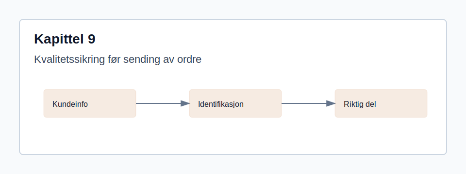

## Tekniske systemillustrasjoner

## Grundig forklaring
Hvordan feilbestillinger forebygges før ordren sendes må forstås både teknisk og praktisk. I marine reservedeler er det sjelden nok å vite hva kunden kaller delen. Medarbeideren må forstå hvilken funksjon delen har, hvor den sitter, hvilken motorvariant den tilhører, og hva som skjer dersom feil del bestilles. Derfor skal tekniske data, kundens beskrivelse og dokumentert katalogoppslag alltid vurderes sammen.

En god sak har fire kjennetegn: den har tydelig identifikasjon, tydelig problem- eller delbeskrivelse, tydelig beslutningsgrunnlag og tydelig oppfølging. Dersom ett av disse punktene mangler, skal saken markeres som usikker før kunden får et bindende svar.

## Praktisk verkstedeksempel
Et verksted står med demontert komponent og trenger rask avklaring. Medarbeideren registrerer kunde, fartøy, motorinformasjon og tidsfrist, ber om bilder av typeplate og komponent, sjekker katalog og lager, og sender et kort skriftlig svar med valgt del, grunnlag for valget og neste oppdateringstidspunkt.

## Kundesupporteksempel
Kunde: 'Motoren går dårlig, kan dere sende riktig del?' Profesjonelt svar: 'Vi kan hjelpe, men først må vi skille mellom symptom og delbehov. Send serienummer, bilde av motorplate, bilde av området feilen gjelder og en kort beskrivelse av når feilen oppstår. Da kan vi foreslå riktig del eller riktig neste feilsøkingstrinn.'

## Vanlige feil og årsaker
- feil eller ufullstendig serienummer.
- delnummer som er erstattet uten at saken dokumenteres.
- symptom som tolkes som delbehov uten feilsøking.
- kunde har bilde av lignende del, men ikke korrekt motorvariant.
- manglende avklaring av antall, side, posisjon eller leveringstid.

## Feilsøkingsflyt
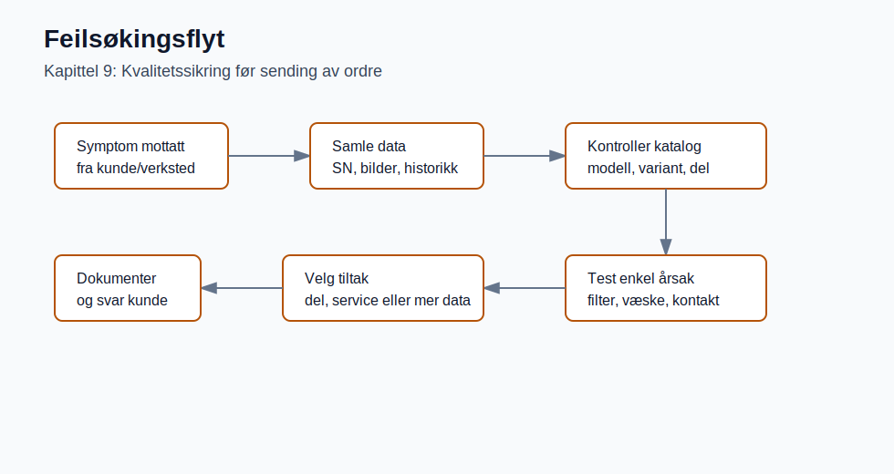

```mermaid
flowchart TD
    A[Symptom eller forespørsel mottatt] --> B[Samle serienummer, bilder og historikk]
    B --> C{Er motor og variant sikkert identifisert?}
    C -- Nei --> D[Be om mer dokumentasjon før del bekreftes]
    C -- Ja --> E[Kontroller delnummer og posisjon i katalog]
    E --> F{Stemmer symptom med foreslått del?}
    F -- Nei --> G[Foreslå feilsøking eller teknisk kontroll]
    F -- Ja --> H[Kontroller lager, pris og levering]
    H --> I[Send dokumentert kundesvar]
```

## Vedlikeholdsprosedyre
1. Avklar driftstimer, siste service og driftsmiljø.
2. Kontroller olje, filter, kjølevæske, sjøvannskrets, reimer, slanger og elektriske kontakter.
3. Sammenlign vedlikeholdsbehov med produsentens intervaller og faktisk bruk.
4. Anbefal servicekit når flere slitedeler bør skiftes samtidig.
5. Dokumenter hva som er anbefalt, hva kunden bestiller og eventuelle avvik fra normal prosedyre.

## Serienummeridentifikasjon
Serienummeridentifikasjon starter med å finne typeplate, motornummer eller annen unik identifikasjon. Be om bilde, ikke bare avskrift, fordi feil tegn, mellomrom og prefiks kan endre katalogoppslaget. Når serienummer ikke finnes, bygges identifikasjonen med modell, produksjonsår, bilder, tidligere fakturaer, servicehistorikk og delnummer fra monterte komponenter.

Minimumsdata bør være: fabrikat, modell, serienummer, eventuell product number/arrangement/CPL/motornummer, bilde av typeplate og bilde av motorens installasjon. Ved tvil skal saken stoppes for avklaring før del bekreftes.

## Reservedelsidentifikasjon
Reservedelsidentifikasjon skal bekrefte delnummer, posisjon, antall per motor, variant, side og eventuell erstatning. Dersom kunden oppgir et gammelt nummer, må det kontrolleres mot supersession. Dersom kunden bare sender bilde, skal bildet brukes som støtte, ikke som eneste grunnlag for bestilling.

Sjekk alltid om delnummeret gjelder enkeltkomponent, reparasjonssett, servicekit eller komplett enhet. Kontroller også om varen er høyre/venstre, gammel/ny type, standard/oversize eller knyttet til en bestemt produksjonsperiode.

## Bestillingsprosedyre
1. Opprett eller oppdater sak med kunde, fartøy, kontaktperson og tidsfrist.
2. Verifiser motoridentifikasjon og lagre bildedokumentasjon.
3. Finn korrekt delnummer i relevant katalog eller leverandørgrunnlag.
4. Kontroller supersession, antall, lagerstatus, pris, returvilkår og leveringstid.
5. Send ordrebekreftelse med delnummer, beskrivelse, antall, pris, levering og forbehold.
6. Følg opp leveransen til kunden har mottatt varen eller saken er lukket.

## Kvalitetspunkter før svar
- Har vi nok data til å gi et sikkert svar?
- Er delnummeret kontrollert mot riktig motorvariant?
- Er kundens tidsfrist realistisk med valgt fraktmåte?
- Er eventuelle forbehold skrevet tydelig?
- Kan en kollega forstå beslutningen ved å lese saken senere?

## Kapittelsammendrag
Hovedpoenget i kapittel 9 er at profesjonelt reservedelsarbeid krever struktur. Teknisk kunnskap, engelske fagtermer, praktisk feilsøking, dokumentasjon og kundedialog må henge sammen. Når medarbeideren jobber systematisk, reduseres feilbestillinger, kunden får bedre svar, og verkstedet kan planlegge arbeidet tryggere.

## Kryssreferanser
- For forrige tema, se kapittel 8: Dokumentasjon av serviceforespørsler og ordreoppsett.
- For neste tema, se kapittel 10: Kommunikasjon med kunder og interne kollegaer.
- For grunnleggende identifikasjon, se kapittel 12 og 17.
- For merkevise eksempler, se kapitlene 26-32.

## Fordypning for intern opplæring
Dette kapitlet skal brukes som arbeidsstandard, ikke bare som lesestoff. Når en ny medarbeider møter en sak om kvalitetssikring, skal vedkommende trene på å gå rolig fra fakta til vurdering og deretter til handling. I en marinemotorforhandler er konsekvensen av en feil ofte større enn verdien av selve delen. En feil impeller, feil sensor, feil filterinnsats eller feil pakningssett kan føre til tapt verkstedtid, utsatt avgang, irritert kunde og i verste fall ny driftsstans. Derfor skal hver sak behandles som en teknisk beslutning med sporbar dokumentasjon.

Profesjonelt nivå i dette kapitlet betyr at medarbeideren kan arbeide sikkert med kvalitetssikring før utsending. Før kunden får et bindende svar, skal opplysningene i saken kontrolleres mot motorens identitet, faktisk installasjon og relevant produsentterminologi. Det praktiske målet er ikke å finne et raskt nummer, men å kunne forklare hvorfor valgt del, kontrollpunkt eller kundesvar er riktig for akkurat denne motoren. Når informasjon mangler, skal medarbeideren beskrive hva som mangler, hvorfor det er nødvendig, og hvilket neste steg som bringer saken videre.

## Tekniske forklaringer
Teknisk forståelse i dette kapitlet skal bygges rundt delnummer, antall, variant, pris, leveringstid, returvilkår og dokumenterte forbehold. Medarbeideren må skille mellom synlig symptom, sannsynlig systemfeil og bestillbar komponent. En del kan se riktig ut på bilde, men likevel være feil dersom posisjon, variant, rating, kjøleroppsett, elektrisk plugg, monteringsside eller servicehistorikk ikke stemmer. Derfor skal teknisk vurdering alltid kobles til både funksjon og dokumentasjon: hva gjør komponenten, hvilket system påvirker den, og hvilken produsentkilde bekrefter at den passer.

I praksis betyr dette at tekniske data skal kobles til motorens faktiske installasjon. Marine motorer står ofte trangt, er utsatt for salt, vibrasjon, fukt og ujevnt belastningsmønster, og de kan være bygget om gjennom mange år. En motor kan ha original kjøler, ettermontert eksosbend, alternativ dynamo, endret filterbrakett eller annen sjøvannspumpe enn standard. Slike forhold gjør at delidentifikasjon må bygge på både produsentdata og synlig dokumentasjon fra motoren.

Produsentterminologi er en del av den tekniske forståelsen. Bruk uttrykk som Serial Number, Engine Number, Part Number, Service Kit, Exploded View, Supersession når de er relevante. Ikke oversett dem på en måte som fjerner presisjon. Skriv for eksempel «Engine Serial Number (ESN)» første gang og deretter «ESN» i saken dersom produsenten bruker dette. Skriv «Arrangement Number» når CAT-data krever det, «Product Number» når Volvo Penta bruker det, «CPL» når Cummins-konfigurasjon må kontrolleres, og «Model Code» når Yanmar-identifikasjon bygger på modellkode. Dette gjør dialogen med internasjonale leverandører mer presis.

## Illustrasjonsforslag
- Oversiktsdiagram som viser hvor kvalitetssikring passer inn i total arbeidsflyt fra kundeforespørsel til levert del.
- Nærbilde av typeplate/motorskilt med markering av serienummer, motornummer, modell og eventuell variantkode.
- Sprengskisse med markert posisjon, delnummer, antall per motor og mulige alternative versjoner.
- Feilsøkingsflyt med beslutningspunkter: mangler data, stemmer symptom, kreves mer teknisk kontroll, kan ordre bekreftes.
- Sammenligningsbilde av gammel og ny del der forskjell i tilkobling, side, lengde eller sensorplugg er markert.

## Virkelige verkstedseksempler
Eksempel 1: Et verksted står med en demontert komponent på benken og kunden venter på avklaring før fartøyet kan settes tilbake i drift. Verkstedet sender et nærbilde av delen, men ingen motorplate. En uerfaren medarbeider kan bli fristet til å søke på nummeret som står på støpegodset. En profesjonell medarbeider svarer at støpenummer ikke nødvendigvis er bestillbart delnummer, ber om bilde av typeplate, oversiktsbilde av motoren og bilde av monteringsstedet, og forklarer at dette hindrer feilbestilling. Når informasjonen kommer, kontrolleres delnummer mot sprengskisse, posisjon og antall. Først da gis pris og leveringstid.

Eksempel 2: En kunde ringer sent på dagen og sier at motoren har høy temperatur etter service. Kunden ønsker ny termostat. Medarbeideren skal ikke automatisk konkludere med termostatfeil. Spørsmålene bør avklare om impeller er byttet, om sjøvannsfilteret er rent, om kjølevæskenivået er riktig, om alarmen kommer ved tomgang eller belastning, og om det finnes lekkasje rundt varmeveksler eller slanger. Dersom kunden likevel vil bestille termostat, dokumenteres at feilsøking er anbefalt, og delnummer kontrolleres mot serienummer før ordre.

Eksempel 3: En intern selger mottar en gammel faktura med et delnummer som ikke lenger finnes. Riktig prosess er å kontrollere supersession, se om ny del krever tilhørende pakning, boltsett eller adapter, og notere både gammelt og nytt nummer i saken. Kunden skal få vite at delen er erstattet, hva som leveres, og om det finnes monteringsforbehold.

## Reservedelsidentifisering i praksis
Reservedelsidentifisering skal følge en fast rekkefølge. Først kontrolleres motorens identitet. Deretter kontrolleres delens system: drivstoff, luft, kjøling, smøring, eksos, elektrisk eller mekanisk kraftoverføring. Så kontrolleres posisjon i sprengskisse eller parts list. Til slutt kontrolleres antall, variant, supersession og leveringsstatus. Denne rekkefølgen hindrer at medarbeideren hopper direkte fra kundens ord til et tilfeldig delnummer.

Når en del har synlig nummer, må nummeret tolkes riktig. Mange komponenter har produksjonsnummer, støpenummer, leverandørnummer eller revisjonskode som ikke er det samme som bestillbart part number. Et filter kan ha nummer fra filterprodusent, men motorprodusentens parts catalogue kan bruke et annet nummer. En pumpe kan ha nummer på lokk, hus og komplett enhet. Spør derfor alltid: gjelder nummeret komplett del, reparasjonssett, underkomponent eller produsentens råkomponent?

## Serienummer og motornummer
Serienummer og motornummer er grunnlaget for korrekt katalogoppslag. Be kunden sende bilde av typeplate eller dataplate. Dersom kunden skriver nummeret manuelt, skal nummeret likevel kontrolleres mot bilde når det er mulig. Noter hele nummeret, inkludert prefiks, suffiks, bindestrek, mellomrom og eventuelle bokstaver. På enkelte produsenter kan små forskjeller peke til forskjellig produksjonsperiode, rating eller konfigurasjon.

Bruk motornummer sammen med modell, variant og applikasjon. En motor som driver generator kan ha andre deler enn en fremdriftsmotor. En motor i yrkesbåt kan ha annen rating enn samme motor i fritidsbåt. En eldre motor kan være bygget om med ny dynamo, annen sjøvannspumpe eller uoriginal filterbrakett. Dersom typeplate mangler, bygg identifikasjonen gjennom flere kilder: servicebok, tidligere faktura, bilder av motorens sider, nummer på pumpe, filter, turbo og gear, samt opplysninger om fartøy og produksjonsår.

## Feilsøking steg for steg
1. Definer symptomet med kundens egne ord og skriv det i saken. Skill mellom «kunden ønsker del» og «kunden beskriver feil».
2. Avklar når feilen oppstår: start, tomgang, belastning, marsjfart, varm motor, kald motor eller etter nylig service.
3. Kontroller grunnleggende forhold: væskenivå, filter, luft i drivstoff, sjøvannsstrøm, reimer, elektriske kontakter, sikringer og synlige lekkasjer.
4. Knytt symptomet til system: lav effekt peker ofte mot luft/drivstoff/eksos, høy temperatur mot kjøling, lavt oljetrykk mot smøring/sensor, startproblem mot batteri/starter/gløding/drivstoff.
5. Be om bilder eller måledata dersom symptomet ikke kan kobles sikkert til en del. Dette kan være bilde av alarmdisplay, trykkmåling, temperaturmåling eller bilde av montert komponent.
6. Kontroller relevant delnummer mot serienummer og variant. Dersom flere alternativer finnes, forklar kunden hva som skiller dem.
7. Dokumenter anbefalt tiltak, usikkerhet og eventuelle forbehold før ordre bekreftes.

## Vedlikehold
Vedlikehold skal vurderes mot driftstimer, produsentens maintenance schedule og faktisk driftsmiljø. Marine motorer som går korte turer, mye tomgang eller i salt miljø kan trenge hyppigere kontroll enn standard intervall antyder. Nye medarbeidere skal lære å spørre om siste service, hvilke filter som ble byttet, hvilken olje som ble brukt, om impeller er kontrollert, og om kjølevæske eller anoder er byttet etter plan.

En god vedlikeholdsanbefaling er konkret. I stedet for å skrive «ta service», bør medarbeideren foreslå relevante deler: olje- og drivstoffilter, luftfilter, impeller, reim, pakninger, anoder, kjølevæske og eventuelt servicekit. Dersom kunden har ukjent servicehistorikk, bør komplett servicekit vurderes. Dersom kunden har hatt overoppheting, bør sjøvannskrets og varmeveksler kontrolleres før bare én komponent byttes.

## Vanlige feil
- Serienummer leses feil fordi et tegn forveksles, for eksempel O/0 eller I/1.
- Kunden oppgir modellnavn, men ikke variant, rating eller applikasjon.
- Del velges ut fra bilde alene uten kontroll mot sprengskisse eller produsentkatalog.
- Supersession aksepteres uten å kontrollere om ny del krever tilbehør, pakning eller ombygging.
- Hastepress gjør at leveringsløfte gis før lagerstatus og fraktmulighet er bekreftet.
- Saksnotat mangler grunnlaget for beslutningen, slik at kollega ikke kan etterprøve valget.

## Kontrollspørsmål
- Hva er den viktigste tekniske risikoen i en sak som gjelder kvalitetssikring?
- Hvilke opplysninger må dokumenteres før bindende delnummer bekreftes?
- Hvordan forklarer du kunden hvorfor bilde av typeplate er nødvendig?
- Når bør du stoppe en ordre og be om mer dokumentasjon?
- Hvilke engelske produsentuttrykk bør du kunne bruke i denne typen sak?
- Hvordan dokumenterer du at et delnummer er erstattet av et nytt nummer?

## Praktisk sjekkliste for medarbeider
- Les saken som om en kollega skal overta den i morgen.
- Kontroller at motoridentifikasjon er dokumentert med bilde eller sikker kilde.
- Sjekk at delnummeret er knyttet til riktig posisjon i katalogen.
- Skriv tydelig om kunden har bedt om enkeltkomponent, servicekit eller komplett enhet.
- Noter om varen er spesialbestilling, utgått, erstattet eller ikke returbar.
- Send kundesvar med neste steg, ikke bare et løst delnummer.

## Kapittelspesifikk systemforståelse
For dette kapitlet er kjernen å forstå kvalitetskontroll før ordre sendes eller del plukkes. Medarbeideren skal kunne forklare dette med praktiske ord til både kunde og kollega. Det betyr at teknisk teori må kobles til konkrete handlinger: hvilke data skal innhentes, hvilke komponenter kan være berørt, hvilken produsentterminologi skal brukes, og hva må dokumenteres før saken kan gå videre. Den siste kontrollen før sending er ofte det billigste stedet å oppdage feil.

Når systemet vurderes, skal medarbeideren først plassere problemet i riktig teknisk sammenheng. Dersom kunden beskriver en alarm, må man finne ut om alarmen kommer fra reelt mekanisk avvik, elektrisk sensorfeil, feil etter service eller feil tolkning av instrumentet. Dersom kunden beskriver en del, må man avklare om kunden mener komplett enhet, servicekit, reparasjonssett eller enkeltkomponent. Dersom kunden beskriver motoren med vanlig navn, må man kontrollere om produsenten bruker mer presise begreper i katalogen.

## Komponentoversikt og arbeidsgrense
Relevante komponenter og opplysninger i dette kapitlet omfatter: modell, serienummer, variant, antall, side, posisjon, lagerlokasjon, pris og levering. Listen er ikke ment som en erstatning for produsentens parts catalogue, men som en praktisk påminnelse om hva nye medarbeidere skal tenke på før de søker del. I interne saker skal komponentnavn skrives så presist som mulig. Bruk for eksempel «sjøvannspumpe / raw water pump» i stedet for bare «pumpe» når funksjonen er kjent, og «varmeveksler / heat exchanger» i stedet for bare «kjøler» når det er den komponenten saken gjelder.

Arbeidsgrensen for en reservedelsmedarbeider er også viktig. Medarbeideren skal ikke overta mekanikerens ansvar for demontering, måling eller diagnose på motoren, men skal kunne stille riktige spørsmål og foreslå riktig dokumentasjon. Når en sak går fra enkel delidentifikasjon til teknisk diagnose, skal dette markeres i saken. Da kan verksted, teknisk ansvarlig eller leverandør involveres med et klart spørsmål og et ryddig faktagrunnlag.

## Praktisk beslutningsregel
Bruk denne regelen i alle saker knyttet til kapitlet: Hvis motoridentifikasjon, komponentposisjon eller symptom ikke er sikkert nok dokumentert, skal medarbeideren ikke gi bindende delbekreftelse. Kunden kan få et foreløpig svar, men svaret må inneholde hva som mangler, hvorfor det mangler, og hva som skjer når informasjonen er mottatt. Dette er ikke treg service; det er profesjonell risikokontroll.

## Realistisk opplæring i praksis
### Verkstedhistorie
En typisk sak i dette temaet starter med riktig del nesten sendes i feil antall. Verkstedet trenger et raskt svar, men den erfarne medarbeideren stopper opp og spør først: hva vet vi sikkert, hva antar vi, og hva kan gi følgeskade hvis vi tar feil? I praksis betyr det at sluttkontroll før utsending må kobles til bilde, serienummer, komponentposisjon og kundens symptom før saken lukkes. Historien skal brukes i opplæring som en øvelse i å skrive et kort saksnotat: observasjon, vurdering, neste handling og forbehold.

### Kundehistorie
Kunden beskriver ofte problemet med driftsspråk: «motoren går tungt», «alarm kommer etter ti minutter», «jeg trenger den samme delen som sist» eller «båten skal ut i morgen». En profesjonell respons er rolig og konkret: bekreft behovet, forklar hvorfor identifikasjon trengs, be om riktig dokumentasjon og gi et realistisk tidspunkt for neste svar. Ikke korriger kunden unødvendig; oversett kundens språk til teknisk språk i saken.

### Typiske feil nye ansatte gjør
- søker på første synlige nummer uten å avklare om det er støpenummer, leverandørnummer eller bestillbart part number.
- lover levering før lagerstatus, frakt og returvilkår er kontrollert.
- antar at tidligere faktura alltid gjelder samme motorvariant.
- blander symptom og årsak, spesielt ved varme, lav effekt, startproblem og alarm.
- skriver for korte notater slik at kollega ikke kan forstå hvorfor valget ble tatt.

### Tips fra erfarne mekanikere og reservedelsselgere
- Se alltid etter systemet rundt delen: slanger, braketter, sensorer, reimer, kjølere og tilkoblinger forteller ofte mer enn delen alene.
- Still ett presist spørsmål om gangen når kunden er stresset; mange dårlige svar kommer av for lange spørsmålslister.
- Sammenlign gammel og ny del mot funksjon, ikke bare form. Riktig del skal passe, men også løse riktig problem.
- En erfaren reservedelsselger tenker i risiko: Hva er billigst å avklare nå, og hva blir dyrt hvis vi hopper over det?

### Vanlige kundespørsmål
| Spørsmål fra kunde | Profesjonelt svar |
|---|---|
| «Kan du bare sende samme del som sist?» | «Ja, hvis vi først bekrefter at det gjelder samme motor, samme posisjon og ingen supersession siden sist.» |
| «Holder det med bilde?» | «Bilde hjelper, men vi trenger også motoridentitet for å sikre variant og delnummer.» |
| «Hvorfor tar dette tid?» | «Fordi feil del kan gi ny driftsstans. Vi kontrollerer grunnlaget før vi lover levering.» |

### Beslutningstre for saken
| Trinn | Spørsmål | Handling |
|---|---|---|
| 1 | Er motoridentitet dokumentert med bilde eller sikker historikk? | Hvis nei: be om typeplate/dataplate eller alternativ dokumentasjon. |
| 2 | Er komponentens funksjon og posisjon kjent? | Hvis nei: be om oversiktsbilde og bilde av monteringssted. |
| 3 | Stemmer kundens symptom med delen som ønskes? | Hvis nei: anbefal feilsøking før del bestilles. |
| 4 | Finnes det supersession, kit eller variantvalg? | Kontroller produsentkilde og skriv forbehold i saken. |
| 5 | Kan pris, levering og returvilkår bekreftes? | Send dokumentert svar med neste steg og tydelig gyldighet. |

### Rask oppslagstabell
| Situasjon | Kontroller først | Vanlig fallgruve |
|---|---|---|
| Hasteordre | sikker motor-ID, lager, fraktfrist | levering loves før teknisk kontroll |
| Del fra bilde | posisjon, skala, tilkoblinger, nummer | bilde brukes som eneste beslutningsgrunnlag |
| Gammelt delnummer | supersession og kitinnhold | ny del krever ekstra pakning eller adapter |
| Uklart symptom | driftssituasjon, alarm, siste service | symptom blir tolket som sikker komponentfeil |

### Praktisk sjekkliste og inspeksjonsrutine
- Start med motoridentitet: fabrikat, modell, serienummer, variant, applikasjon og bilde av skilt.
- Kontroller området rundt komponenten: lekkasje, korrosjon, knekte fester, slitasje, varmemerker og uoriginale endringer.
- Spør om siste vedlikehold: olje, filter, impeller, reimer, kjølevæske, anoder og drivstoffilter.
- Noter driftstype: fritidsbruk, yrkesbruk, generator, fremdrift, tomgangsdrift eller langvarig høy belastning.
- Avklar om saken gjelder akutt drift, planlagt service, reklamasjon eller lagerpåfyll.

### Generelle vedlikeholdsintervaller som opplæringspunkt
| Kontrollpunkt | Typisk vurdering i opplæring | Må verifiseres |
|---|---|---|
| Olje og oljefilter | ofte basert på timer og kalender | produsentens maintenance schedule |
| Drivstoffilter/vannutskiller | hyppigere ved dårlig drivstoff eller sesongstart | motor- og filterspesifikasjon |
| Impeller og sjøvannskrets | kontrolleres særlig før sesong og etter varmgang | produsentens intervall og installasjon |
| Reimer, slanger og klemmer | visuell kontroll ved service og feilsøking | dimensjon, stramming og delnummer |

### Produsentverifikasjon
Alle konkrete delnumre, momentverdier, serviceintervaller, garantikrav, programvaredata og produsentspesifikke grenser skal kontrolleres mot offisiell produsentdokumentasjon før de brukes i tilbud, ordre eller verkstedinstruks. Marker tydelig i saken når svaret bygger på antakelse, eldre historikk, bilde uten motor-ID eller generell erfaring. Intervaller i tabellen er generelle opplæringspunkter. Faktiske intervaller styres av produsent, motorvariant, driftstimer, kalenderkrav, belastning og miljø.

## Produsentverifikasjon og faglig forbehold
Denne manualen skal brukes som intern opplæring og arbeidsmetode. Produsentspesifikke delnumre, intervaller, momentverdier, garantikrav og tekniske grenseverdier skal verifiseres mot gjeldende produsentdokumentasjon før de brukes i kundeordre eller verkstedinstruks. Marker saken internt dersom opplysningen bygger på antakelse, eldre historikk eller bilde uten bekreftet motoridentitet.

## Quiz med fasit
1. Hvilke tekniske data bør alltid samles før en del bekreftes?
2. Hvorfor er engelsk terminologi viktig i marine reservedeler?
3. Hva bør gjøres dersom kunden bare sender et bilde av delen?
4. Hvilke punkter bør kontrolleres før ordrebekreftelse sendes?
5. Hvorfor skal feilsøking dokumenteres, selv når kunden allerede ber om en bestemt del?

### Svar
1. Fabrikat, modell, serienummer, variantdata, bilde av typeplate, delnummer, posisjon og kundens symptombeskrivelse.
2. Fordi kataloger, portaler, servicemanualer og leverandørdialog ofte bruker engelske begreper som må forstås presist.
3. Be om serienummer, oversiktsbilde av motoren og eventuelle nummer på delen; bildet brukes som støtte, ikke eneste grunnlag.
4. Delnummer, antall, variant, pris, lagerstatus, leveringstid, frakt, returvilkår og eventuelle forbehold.
5. Fordi symptomet kan ha flere årsaker, og dokumentasjon viser hvorfor anbefalingen ble gitt.

---

# Kapittel 10: Kommunikasjon med kunder og interne kollegaer

## Kapittelrolle
Dette kapitlet gir en grundig praktisk innføring i kommunikasjon. Temaet er viktig fordi reservedelsarbeid i marine miljøer kombinerer teknisk forståelse, presis kundedialog, dokumentert saksbehandling og realistisk leveranseoppfølging. Målet er at en ny medarbeider skal kunne bruke kunnskapen direkte i arbeid med verksted, kunde, lager og leverandør.

## Læringsmål
Etter kapitlet skal deltakeren kunne:
- forklare hovedbegrepene innen kommunikasjon
- bruke serienummer, modellinformasjon og delnummer i praktisk reservedelsarbeid
- kommunisere trygt med kunde, verksted, lager og leverandør
- dokumentere beslutninger slik at andre kan etterprøve saken
- kjenne igjen vanlige feil og velge riktig neste handling

## English technical terminology
- **Serial Number:** engelsk fagterm som ofte brukes i kataloger, servicelitteratur, leverandørportaler og internasjonal kundedialog.
- **Part Number:** engelsk fagterm som ofte brukes i kataloger, servicelitteratur, leverandørportaler og internasjonal kundedialog.
- **Engine Model:** engelsk fagterm som ofte brukes i kataloger, servicelitteratur, leverandørportaler og internasjonal kundedialog.
- **Variant:** engelsk fagterm som ofte brukes i kataloger, servicelitteratur, leverandørportaler og internasjonal kundedialog.
- **Service Kit:** engelsk fagterm som ofte brukes i kataloger, servicelitteratur, leverandørportaler og internasjonal kundedialog.
- **Troubleshooting:** engelsk fagterm som ofte brukes i kataloger, servicelitteratur, leverandørportaler og internasjonal kundedialog.
- **Maintenance:** engelsk fagterm som ofte brukes i kataloger, servicelitteratur, leverandørportaler og internasjonal kundedialog.
- **Ordering Procedure:** engelsk fagterm som ofte brukes i kataloger, servicelitteratur, leverandørportaler og internasjonal kundedialog.
- **Supersession:** engelsk fagterm som ofte brukes i kataloger, servicelitteratur, leverandørportaler og internasjonal kundedialog.
- **Technical Support:** engelsk fagterm som ofte brukes i kataloger, servicelitteratur, leverandørportaler og internasjonal kundedialog.

## Hoveddiagram
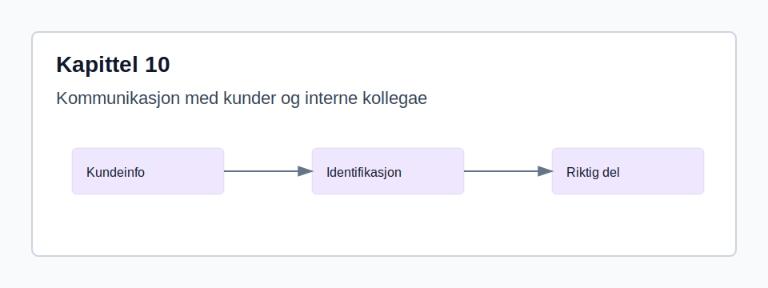

## Tekniske systemillustrasjoner

## Grundig forklaring
Hvordan korte, tydelige og etterprøvbare meldinger gir bedre service må forstås både teknisk og praktisk. I marine reservedeler er det sjelden nok å vite hva kunden kaller delen. Medarbeideren må forstå hvilken funksjon delen har, hvor den sitter, hvilken motorvariant den tilhører, og hva som skjer dersom feil del bestilles. Derfor skal tekniske data, kundens beskrivelse og dokumentert katalogoppslag alltid vurderes sammen.

En god sak har fire kjennetegn: den har tydelig identifikasjon, tydelig problem- eller delbeskrivelse, tydelig beslutningsgrunnlag og tydelig oppfølging. Dersom ett av disse punktene mangler, skal saken markeres som usikker før kunden får et bindende svar.

## Praktisk verkstedeksempel
Et verksted står med demontert komponent og trenger rask avklaring. Medarbeideren registrerer kunde, fartøy, motorinformasjon og tidsfrist, ber om bilder av typeplate og komponent, sjekker katalog og lager, og sender et kort skriftlig svar med valgt del, grunnlag for valget og neste oppdateringstidspunkt.

## Kundesupporteksempel
Kunde: 'Motoren går dårlig, kan dere sende riktig del?' Profesjonelt svar: 'Vi kan hjelpe, men først må vi skille mellom symptom og delbehov. Send serienummer, bilde av motorplate, bilde av området feilen gjelder og en kort beskrivelse av når feilen oppstår. Da kan vi foreslå riktig del eller riktig neste feilsøkingstrinn.'

## Vanlige feil og årsaker
- feil eller ufullstendig serienummer.
- delnummer som er erstattet uten at saken dokumenteres.
- symptom som tolkes som delbehov uten feilsøking.
- kunde har bilde av lignende del, men ikke korrekt motorvariant.
- manglende avklaring av antall, side, posisjon eller leveringstid.

## Feilsøkingsflyt
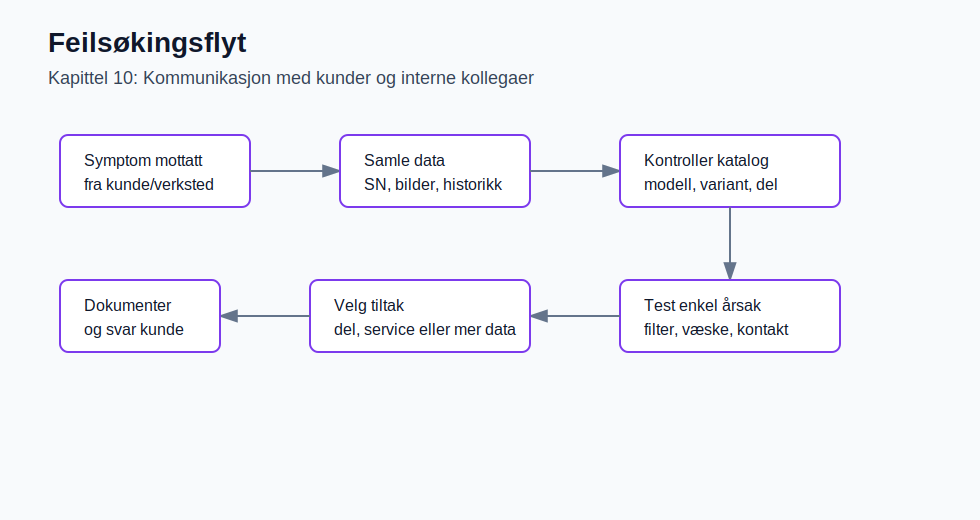

```mermaid
flowchart TD
    A[Symptom eller forespørsel mottatt] --> B[Samle serienummer, bilder og historikk]
    B --> C{Er motor og variant sikkert identifisert?}
    C -- Nei --> D[Be om mer dokumentasjon før del bekreftes]
    C -- Ja --> E[Kontroller delnummer og posisjon i katalog]
    E --> F{Stemmer symptom med foreslått del?}
    F -- Nei --> G[Foreslå feilsøking eller teknisk kontroll]
    F -- Ja --> H[Kontroller lager, pris og levering]
    H --> I[Send dokumentert kundesvar]
```

## Vedlikeholdsprosedyre
1. Avklar driftstimer, siste service og driftsmiljø.
2. Kontroller olje, filter, kjølevæske, sjøvannskrets, reimer, slanger og elektriske kontakter.
3. Sammenlign vedlikeholdsbehov med produsentens intervaller og faktisk bruk.
4. Anbefal servicekit når flere slitedeler bør skiftes samtidig.
5. Dokumenter hva som er anbefalt, hva kunden bestiller og eventuelle avvik fra normal prosedyre.

## Serienummeridentifikasjon
Serienummeridentifikasjon starter med å finne typeplate, motornummer eller annen unik identifikasjon. Be om bilde, ikke bare avskrift, fordi feil tegn, mellomrom og prefiks kan endre katalogoppslaget. Når serienummer ikke finnes, bygges identifikasjonen med modell, produksjonsår, bilder, tidligere fakturaer, servicehistorikk og delnummer fra monterte komponenter.

Minimumsdata bør være: fabrikat, modell, serienummer, eventuell product number/arrangement/CPL/motornummer, bilde av typeplate og bilde av motorens installasjon. Ved tvil skal saken stoppes for avklaring før del bekreftes.

## Reservedelsidentifikasjon
Reservedelsidentifikasjon skal bekrefte delnummer, posisjon, antall per motor, variant, side og eventuell erstatning. Dersom kunden oppgir et gammelt nummer, må det kontrolleres mot supersession. Dersom kunden bare sender bilde, skal bildet brukes som støtte, ikke som eneste grunnlag for bestilling.

Sjekk alltid om delnummeret gjelder enkeltkomponent, reparasjonssett, servicekit eller komplett enhet. Kontroller også om varen er høyre/venstre, gammel/ny type, standard/oversize eller knyttet til en bestemt produksjonsperiode.

## Bestillingsprosedyre
1. Opprett eller oppdater sak med kunde, fartøy, kontaktperson og tidsfrist.
2. Verifiser motoridentifikasjon og lagre bildedokumentasjon.
3. Finn korrekt delnummer i relevant katalog eller leverandørgrunnlag.
4. Kontroller supersession, antall, lagerstatus, pris, returvilkår og leveringstid.
5. Send ordrebekreftelse med delnummer, beskrivelse, antall, pris, levering og forbehold.
6. Følg opp leveransen til kunden har mottatt varen eller saken er lukket.

## Kvalitetspunkter før svar
- Har vi nok data til å gi et sikkert svar?
- Er delnummeret kontrollert mot riktig motorvariant?
- Er kundens tidsfrist realistisk med valgt fraktmåte?
- Er eventuelle forbehold skrevet tydelig?
- Kan en kollega forstå beslutningen ved å lese saken senere?

## Kapittelsammendrag
Hovedpoenget i kapittel 10 er at profesjonelt reservedelsarbeid krever struktur. Teknisk kunnskap, engelske fagtermer, praktisk feilsøking, dokumentasjon og kundedialog må henge sammen. Når medarbeideren jobber systematisk, reduseres feilbestillinger, kunden får bedre svar, og verkstedet kan planlegge arbeidet tryggere.

## Kryssreferanser
- For forrige tema, se kapittel 9: Kvalitetssikring før sending av ordre.
- For neste tema, se kapittel 11: Grunnleggende oppbygning av marine motorer.
- For grunnleggende identifikasjon, se kapittel 12 og 17.
- For merkevise eksempler, se kapitlene 26-32.

## Fordypning for intern opplæring
Dette kapitlet skal brukes som arbeidsstandard, ikke bare som lesestoff. Når en ny medarbeider møter en sak om kommunikasjon, skal vedkommende trene på å gå rolig fra fakta til vurdering og deretter til handling. I en marinemotorforhandler er konsekvensen av en feil ofte større enn verdien av selve delen. En feil impeller, feil sensor, feil filterinnsats eller feil pakningssett kan føre til tapt verkstedtid, utsatt avgang, irritert kunde og i verste fall ny driftsstans. Derfor skal hver sak behandles som en teknisk beslutning med sporbar dokumentasjon.

Profesjonelt nivå i dette kapitlet betyr at medarbeideren kan arbeide sikkert med kundekommunikasjon. Før kunden får et bindende svar, skal opplysningene i saken kontrolleres mot motorens identitet, faktisk installasjon og relevant produsentterminologi. Det praktiske målet er ikke å finne et raskt nummer, men å kunne forklare hvorfor valgt del, kontrollpunkt eller kundesvar er riktig for akkurat denne motoren. Når informasjon mangler, skal medarbeideren beskrive hva som mangler, hvorfor det er nødvendig, og hvilket neste steg som bringer saken videre.

## Tekniske forklaringer
Teknisk forståelse i dette kapitlet skal bygges rundt presise spørsmål, forventningsstyring, intern eskalering og tydelig neste steg. Medarbeideren må skille mellom synlig symptom, sannsynlig systemfeil og bestillbar komponent. En del kan se riktig ut på bilde, men likevel være feil dersom posisjon, variant, rating, kjøleroppsett, elektrisk plugg, monteringsside eller servicehistorikk ikke stemmer. Derfor skal teknisk vurdering alltid kobles til både funksjon og dokumentasjon: hva gjør komponenten, hvilket system påvirker den, og hvilken produsentkilde bekrefter at den passer.

I praksis betyr dette at tekniske data skal kobles til motorens faktiske installasjon. Marine motorer står ofte trangt, er utsatt for salt, vibrasjon, fukt og ujevnt belastningsmønster, og de kan være bygget om gjennom mange år. En motor kan ha original kjøler, ettermontert eksosbend, alternativ dynamo, endret filterbrakett eller annen sjøvannspumpe enn standard. Slike forhold gjør at delidentifikasjon må bygge på både produsentdata og synlig dokumentasjon fra motoren.

Produsentterminologi er en del av den tekniske forståelsen. Bruk uttrykk som Serial Number, Engine Number, Part Number, Service Kit, Exploded View, Supersession når de er relevante. Ikke oversett dem på en måte som fjerner presisjon. Skriv for eksempel «Engine Serial Number (ESN)» første gang og deretter «ESN» i saken dersom produsenten bruker dette. Skriv «Arrangement Number» når CAT-data krever det, «Product Number» når Volvo Penta bruker det, «CPL» når Cummins-konfigurasjon må kontrolleres, og «Model Code» når Yanmar-identifikasjon bygger på modellkode. Dette gjør dialogen med internasjonale leverandører mer presis.

## Illustrasjonsforslag
- Oversiktsdiagram som viser hvor kommunikasjon passer inn i total arbeidsflyt fra kundeforespørsel til levert del.
- Nærbilde av typeplate/motorskilt med markering av serienummer, motornummer, modell og eventuell variantkode.
- Sprengskisse med markert posisjon, delnummer, antall per motor og mulige alternative versjoner.
- Feilsøkingsflyt med beslutningspunkter: mangler data, stemmer symptom, kreves mer teknisk kontroll, kan ordre bekreftes.
- Sammenligningsbilde av gammel og ny del der forskjell i tilkobling, side, lengde eller sensorplugg er markert.

## Virkelige verkstedseksempler
Eksempel 1: Et verksted står med en demontert komponent på benken og kunden venter på avklaring før fartøyet kan settes tilbake i drift. Verkstedet sender et nærbilde av delen, men ingen motorplate. En uerfaren medarbeider kan bli fristet til å søke på nummeret som står på støpegodset. En profesjonell medarbeider svarer at støpenummer ikke nødvendigvis er bestillbart delnummer, ber om bilde av typeplate, oversiktsbilde av motoren og bilde av monteringsstedet, og forklarer at dette hindrer feilbestilling. Når informasjonen kommer, kontrolleres delnummer mot sprengskisse, posisjon og antall. Først da gis pris og leveringstid.

Eksempel 2: En kunde ringer sent på dagen og sier at motoren har høy temperatur etter service. Kunden ønsker ny termostat. Medarbeideren skal ikke automatisk konkludere med termostatfeil. Spørsmålene bør avklare om impeller er byttet, om sjøvannsfilteret er rent, om kjølevæskenivået er riktig, om alarmen kommer ved tomgang eller belastning, og om det finnes lekkasje rundt varmeveksler eller slanger. Dersom kunden likevel vil bestille termostat, dokumenteres at feilsøking er anbefalt, og delnummer kontrolleres mot serienummer før ordre.

Eksempel 3: En intern selger mottar en gammel faktura med et delnummer som ikke lenger finnes. Riktig prosess er å kontrollere supersession, se om ny del krever tilhørende pakning, boltsett eller adapter, og notere både gammelt og nytt nummer i saken. Kunden skal få vite at delen er erstattet, hva som leveres, og om det finnes monteringsforbehold.

## Reservedelsidentifisering i praksis
Reservedelsidentifisering skal følge en fast rekkefølge. Først kontrolleres motorens identitet. Deretter kontrolleres delens system: drivstoff, luft, kjøling, smøring, eksos, elektrisk eller mekanisk kraftoverføring. Så kontrolleres posisjon i sprengskisse eller parts list. Til slutt kontrolleres antall, variant, supersession og leveringsstatus. Denne rekkefølgen hindrer at medarbeideren hopper direkte fra kundens ord til et tilfeldig delnummer.

Når en del har synlig nummer, må nummeret tolkes riktig. Mange komponenter har produksjonsnummer, støpenummer, leverandørnummer eller revisjonskode som ikke er det samme som bestillbart part number. Et filter kan ha nummer fra filterprodusent, men motorprodusentens parts catalogue kan bruke et annet nummer. En pumpe kan ha nummer på lokk, hus og komplett enhet. Spør derfor alltid: gjelder nummeret komplett del, reparasjonssett, underkomponent eller produsentens råkomponent?

## Serienummer og motornummer
Serienummer og motornummer er grunnlaget for korrekt katalogoppslag. Be kunden sende bilde av typeplate eller dataplate. Dersom kunden skriver nummeret manuelt, skal nummeret likevel kontrolleres mot bilde når det er mulig. Noter hele nummeret, inkludert prefiks, suffiks, bindestrek, mellomrom og eventuelle bokstaver. På enkelte produsenter kan små forskjeller peke til forskjellig produksjonsperiode, rating eller konfigurasjon.

Bruk motornummer sammen med modell, variant og applikasjon. En motor som driver generator kan ha andre deler enn en fremdriftsmotor. En motor i yrkesbåt kan ha annen rating enn samme motor i fritidsbåt. En eldre motor kan være bygget om med ny dynamo, annen sjøvannspumpe eller uoriginal filterbrakett. Dersom typeplate mangler, bygg identifikasjonen gjennom flere kilder: servicebok, tidligere faktura, bilder av motorens sider, nummer på pumpe, filter, turbo og gear, samt opplysninger om fartøy og produksjonsår.

## Feilsøking steg for steg
1. Definer symptomet med kundens egne ord og skriv det i saken. Skill mellom «kunden ønsker del» og «kunden beskriver feil».
2. Avklar når feilen oppstår: start, tomgang, belastning, marsjfart, varm motor, kald motor eller etter nylig service.
3. Kontroller grunnleggende forhold: væskenivå, filter, luft i drivstoff, sjøvannsstrøm, reimer, elektriske kontakter, sikringer og synlige lekkasjer.
4. Knytt symptomet til system: lav effekt peker ofte mot luft/drivstoff/eksos, høy temperatur mot kjøling, lavt oljetrykk mot smøring/sensor, startproblem mot batteri/starter/gløding/drivstoff.
5. Be om bilder eller måledata dersom symptomet ikke kan kobles sikkert til en del. Dette kan være bilde av alarmdisplay, trykkmåling, temperaturmåling eller bilde av montert komponent.
6. Kontroller relevant delnummer mot serienummer og variant. Dersom flere alternativer finnes, forklar kunden hva som skiller dem.
7. Dokumenter anbefalt tiltak, usikkerhet og eventuelle forbehold før ordre bekreftes.

## Vedlikehold
Vedlikehold skal vurderes mot driftstimer, produsentens maintenance schedule og faktisk driftsmiljø. Marine motorer som går korte turer, mye tomgang eller i salt miljø kan trenge hyppigere kontroll enn standard intervall antyder. Nye medarbeidere skal lære å spørre om siste service, hvilke filter som ble byttet, hvilken olje som ble brukt, om impeller er kontrollert, og om kjølevæske eller anoder er byttet etter plan.

En god vedlikeholdsanbefaling er konkret. I stedet for å skrive «ta service», bør medarbeideren foreslå relevante deler: olje- og drivstoffilter, luftfilter, impeller, reim, pakninger, anoder, kjølevæske og eventuelt servicekit. Dersom kunden har ukjent servicehistorikk, bør komplett servicekit vurderes. Dersom kunden har hatt overoppheting, bør sjøvannskrets og varmeveksler kontrolleres før bare én komponent byttes.

## Vanlige feil
- Serienummer leses feil fordi et tegn forveksles, for eksempel O/0 eller I/1.
- Kunden oppgir modellnavn, men ikke variant, rating eller applikasjon.
- Del velges ut fra bilde alene uten kontroll mot sprengskisse eller produsentkatalog.
- Supersession aksepteres uten å kontrollere om ny del krever tilbehør, pakning eller ombygging.
- Hastepress gjør at leveringsløfte gis før lagerstatus og fraktmulighet er bekreftet.
- Saksnotat mangler grunnlaget for beslutningen, slik at kollega ikke kan etterprøve valget.

## Kontrollspørsmål
- Hva er den viktigste tekniske risikoen i en sak som gjelder kommunikasjon?
- Hvilke opplysninger må dokumenteres før bindende delnummer bekreftes?
- Hvordan forklarer du kunden hvorfor bilde av typeplate er nødvendig?
- Når bør du stoppe en ordre og be om mer dokumentasjon?
- Hvilke engelske produsentuttrykk bør du kunne bruke i denne typen sak?
- Hvordan dokumenterer du at et delnummer er erstattet av et nytt nummer?

## Praktisk sjekkliste for medarbeider
- Les saken som om en kollega skal overta den i morgen.
- Kontroller at motoridentifikasjon er dokumentert med bilde eller sikker kilde.
- Sjekk at delnummeret er knyttet til riktig posisjon i katalogen.
- Skriv tydelig om kunden har bedt om enkeltkomponent, servicekit eller komplett enhet.
- Noter om varen er spesialbestilling, utgått, erstattet eller ikke returbar.
- Send kundesvar med neste steg, ikke bare et løst delnummer.

## Kapittelspesifikk systemforståelse
For dette kapitlet er kjernen å forstå kommunikasjon som styringsverktøy i tekniske saker. Medarbeideren skal kunne forklare dette med praktiske ord til både kunde og kollega. Det betyr at teknisk teori må kobles til konkrete handlinger: hvilke data skal innhentes, hvilke komponenter kan være berørt, hvilken produsentterminologi skal brukes, og hva må dokumenteres før saken kan gå videre. Gode svar er korte nok til å forstås raskt og presise nok til å kunne etterprøves.

Når systemet vurderes, skal medarbeideren først plassere problemet i riktig teknisk sammenheng. Dersom kunden beskriver en alarm, må man finne ut om alarmen kommer fra reelt mekanisk avvik, elektrisk sensorfeil, feil etter service eller feil tolkning av instrumentet. Dersom kunden beskriver en del, må man avklare om kunden mener komplett enhet, servicekit, reparasjonssett eller enkeltkomponent. Dersom kunden beskriver motoren med vanlig navn, må man kontrollere om produsenten bruker mer presise begreper i katalogen.

## Komponentoversikt og arbeidsgrense
Relevante komponenter og opplysninger i dette kapitlet omfatter: kundemelding, intern kommentar, leverandørforespørsel, avviksvar og oppfølgingsnotat. Listen er ikke ment som en erstatning for produsentens parts catalogue, men som en praktisk påminnelse om hva nye medarbeidere skal tenke på før de søker del. I interne saker skal komponentnavn skrives så presist som mulig. Bruk for eksempel «sjøvannspumpe / raw water pump» i stedet for bare «pumpe» når funksjonen er kjent, og «varmeveksler / heat exchanger» i stedet for bare «kjøler» når det er den komponenten saken gjelder.

Arbeidsgrensen for en reservedelsmedarbeider er også viktig. Medarbeideren skal ikke overta mekanikerens ansvar for demontering, måling eller diagnose på motoren, men skal kunne stille riktige spørsmål og foreslå riktig dokumentasjon. Når en sak går fra enkel delidentifikasjon til teknisk diagnose, skal dette markeres i saken. Da kan verksted, teknisk ansvarlig eller leverandør involveres med et klart spørsmål og et ryddig faktagrunnlag.

## Praktisk beslutningsregel
Bruk denne regelen i alle saker knyttet til kapitlet: Hvis motoridentifikasjon, komponentposisjon eller symptom ikke er sikkert nok dokumentert, skal medarbeideren ikke gi bindende delbekreftelse. Kunden kan få et foreløpig svar, men svaret må inneholde hva som mangler, hvorfor det mangler, og hva som skjer når informasjonen er mottatt. Dette er ikke treg service; det er profesjonell risikokontroll.

## Realistisk opplæring i praksis
### Verkstedhistorie
En typisk sak i dette temaet starter med kunde er stresset og informasjonen kommer stykkevis. Verkstedet trenger et raskt svar, men den erfarne medarbeideren stopper opp og spør først: hva vet vi sikkert, hva antar vi, og hva kan gi følgeskade hvis vi tar feil? I praksis betyr det at tydelige spørsmål og skriftlig svar må kobles til bilde, serienummer, komponentposisjon og kundens symptom før saken lukkes. Historien skal brukes i opplæring som en øvelse i å skrive et kort saksnotat: observasjon, vurdering, neste handling og forbehold.

### Kundehistorie
Kunden beskriver ofte problemet med driftsspråk: «motoren går tungt», «alarm kommer etter ti minutter», «jeg trenger den samme delen som sist» eller «båten skal ut i morgen». En profesjonell respons er rolig og konkret: bekreft behovet, forklar hvorfor identifikasjon trengs, be om riktig dokumentasjon og gi et realistisk tidspunkt for neste svar. Ikke korriger kunden unødvendig; oversett kundens språk til teknisk språk i saken.

### Typiske feil nye ansatte gjør
- søker på første synlige nummer uten å avklare om det er støpenummer, leverandørnummer eller bestillbart part number.
- lover levering før lagerstatus, frakt og returvilkår er kontrollert.
- antar at tidligere faktura alltid gjelder samme motorvariant.
- blander symptom og årsak, spesielt ved varme, lav effekt, startproblem og alarm.
- skriver for korte notater slik at kollega ikke kan forstå hvorfor valget ble tatt.

### Tips fra erfarne mekanikere og reservedelsselgere
- Se alltid etter systemet rundt delen: slanger, braketter, sensorer, reimer, kjølere og tilkoblinger forteller ofte mer enn delen alene.
- Still ett presist spørsmål om gangen når kunden er stresset; mange dårlige svar kommer av for lange spørsmålslister.
- Sammenlign gammel og ny del mot funksjon, ikke bare form. Riktig del skal passe, men også løse riktig problem.
- En erfaren reservedelsselger tenker i risiko: Hva er billigst å avklare nå, og hva blir dyrt hvis vi hopper over det?

### Vanlige kundespørsmål
| Spørsmål fra kunde | Profesjonelt svar |
|---|---|
| «Kan du bare sende samme del som sist?» | «Ja, hvis vi først bekrefter at det gjelder samme motor, samme posisjon og ingen supersession siden sist.» |
| «Holder det med bilde?» | «Bilde hjelper, men vi trenger også motoridentitet for å sikre variant og delnummer.» |
| «Hvorfor tar dette tid?» | «Fordi feil del kan gi ny driftsstans. Vi kontrollerer grunnlaget før vi lover levering.» |

### Beslutningstre for saken
| Trinn | Spørsmål | Handling |
|---|---|---|
| 1 | Er motoridentitet dokumentert med bilde eller sikker historikk? | Hvis nei: be om typeplate/dataplate eller alternativ dokumentasjon. |
| 2 | Er komponentens funksjon og posisjon kjent? | Hvis nei: be om oversiktsbilde og bilde av monteringssted. |
| 3 | Stemmer kundens symptom med delen som ønskes? | Hvis nei: anbefal feilsøking før del bestilles. |
| 4 | Finnes det supersession, kit eller variantvalg? | Kontroller produsentkilde og skriv forbehold i saken. |
| 5 | Kan pris, levering og returvilkår bekreftes? | Send dokumentert svar med neste steg og tydelig gyldighet. |

### Rask oppslagstabell
| Situasjon | Kontroller først | Vanlig fallgruve |
|---|---|---|
| Hasteordre | sikker motor-ID, lager, fraktfrist | levering loves før teknisk kontroll |
| Del fra bilde | posisjon, skala, tilkoblinger, nummer | bilde brukes som eneste beslutningsgrunnlag |
| Gammelt delnummer | supersession og kitinnhold | ny del krever ekstra pakning eller adapter |
| Uklart symptom | driftssituasjon, alarm, siste service | symptom blir tolket som sikker komponentfeil |

### Praktisk sjekkliste og inspeksjonsrutine
- Start med motoridentitet: fabrikat, modell, serienummer, variant, applikasjon og bilde av skilt.
- Kontroller området rundt komponenten: lekkasje, korrosjon, knekte fester, slitasje, varmemerker og uoriginale endringer.
- Spør om siste vedlikehold: olje, filter, impeller, reimer, kjølevæske, anoder og drivstoffilter.
- Noter driftstype: fritidsbruk, yrkesbruk, generator, fremdrift, tomgangsdrift eller langvarig høy belastning.
- Avklar om saken gjelder akutt drift, planlagt service, reklamasjon eller lagerpåfyll.

### Generelle vedlikeholdsintervaller som opplæringspunkt
| Kontrollpunkt | Typisk vurdering i opplæring | Må verifiseres |
|---|---|---|
| Olje og oljefilter | ofte basert på timer og kalender | produsentens maintenance schedule |
| Drivstoffilter/vannutskiller | hyppigere ved dårlig drivstoff eller sesongstart | motor- og filterspesifikasjon |
| Impeller og sjøvannskrets | kontrolleres særlig før sesong og etter varmgang | produsentens intervall og installasjon |
| Reimer, slanger og klemmer | visuell kontroll ved service og feilsøking | dimensjon, stramming og delnummer |

### Produsentverifikasjon
Alle konkrete delnumre, momentverdier, serviceintervaller, garantikrav, programvaredata og produsentspesifikke grenser skal kontrolleres mot offisiell produsentdokumentasjon før de brukes i tilbud, ordre eller verkstedinstruks. Marker tydelig i saken når svaret bygger på antakelse, eldre historikk, bilde uten motor-ID eller generell erfaring. Intervaller i tabellen er generelle opplæringspunkter. Faktiske intervaller styres av produsent, motorvariant, driftstimer, kalenderkrav, belastning og miljø.

## Produsentverifikasjon og faglig forbehold
Denne manualen skal brukes som intern opplæring og arbeidsmetode. Produsentspesifikke delnumre, intervaller, momentverdier, garantikrav og tekniske grenseverdier skal verifiseres mot gjeldende produsentdokumentasjon før de brukes i kundeordre eller verkstedinstruks. Marker saken internt dersom opplysningen bygger på antakelse, eldre historikk eller bilde uten bekreftet motoridentitet.

## Quiz med fasit
1. Hvilke tekniske data bør alltid samles før en del bekreftes?
2. Hvorfor er engelsk terminologi viktig i marine reservedeler?
3. Hva bør gjøres dersom kunden bare sender et bilde av delen?
4. Hvilke punkter bør kontrolleres før ordrebekreftelse sendes?
5. Hvorfor skal feilsøking dokumenteres, selv når kunden allerede ber om en bestemt del?

### Svar
1. Fabrikat, modell, serienummer, variantdata, bilde av typeplate, delnummer, posisjon og kundens symptombeskrivelse.
2. Fordi kataloger, portaler, servicemanualer og leverandørdialog ofte bruker engelske begreper som må forstås presist.
3. Be om serienummer, oversiktsbilde av motoren og eventuelle nummer på delen; bildet brukes som støtte, ikke eneste grunnlag.
4. Delnummer, antall, variant, pris, lagerstatus, leveringstid, frakt, returvilkår og eventuelle forbehold.
5. Fordi symptomet kan ha flere årsaker, og dokumentasjon viser hvorfor anbefalingen ble gitt.

---

# Kapittel 11: Grunnleggende oppbygning av marine motorer

## Kapittelrolle
Dette kapitlet gir en grundig praktisk innføring i motoroppbygning. Temaet er viktig fordi reservedelsarbeid i marine miljøer kombinerer teknisk forståelse, presis kundedialog, dokumentert saksbehandling og realistisk leveranseoppfølging. Målet er at en ny medarbeider skal kunne bruke kunnskapen direkte i arbeid med verksted, kunde, lager og leverandør.

## Læringsmål
Etter kapitlet skal deltakeren kunne:
- forklare hovedbegrepene innen motoroppbygning
- bruke serienummer, modellinformasjon og delnummer i praktisk reservedelsarbeid
- kommunisere trygt med kunde, verksted, lager og leverandør
- dokumentere beslutninger slik at andre kan etterprøve saken
- kjenne igjen vanlige feil og velge riktig neste handling

## English technical terminology
- **Serial Number:** engelsk fagterm som ofte brukes i kataloger, servicelitteratur, leverandørportaler og internasjonal kundedialog.
- **Part Number:** engelsk fagterm som ofte brukes i kataloger, servicelitteratur, leverandørportaler og internasjonal kundedialog.
- **Engine Model:** engelsk fagterm som ofte brukes i kataloger, servicelitteratur, leverandørportaler og internasjonal kundedialog.
- **Variant:** engelsk fagterm som ofte brukes i kataloger, servicelitteratur, leverandørportaler og internasjonal kundedialog.
- **Service Kit:** engelsk fagterm som ofte brukes i kataloger, servicelitteratur, leverandørportaler og internasjonal kundedialog.
- **Troubleshooting:** engelsk fagterm som ofte brukes i kataloger, servicelitteratur, leverandørportaler og internasjonal kundedialog.
- **Maintenance:** engelsk fagterm som ofte brukes i kataloger, servicelitteratur, leverandørportaler og internasjonal kundedialog.
- **Ordering Procedure:** engelsk fagterm som ofte brukes i kataloger, servicelitteratur, leverandørportaler og internasjonal kundedialog.
- **Supersession:** engelsk fagterm som ofte brukes i kataloger, servicelitteratur, leverandørportaler og internasjonal kundedialog.
- **Technical Support:** engelsk fagterm som ofte brukes i kataloger, servicelitteratur, leverandørportaler og internasjonal kundedialog.

## Hoveddiagram
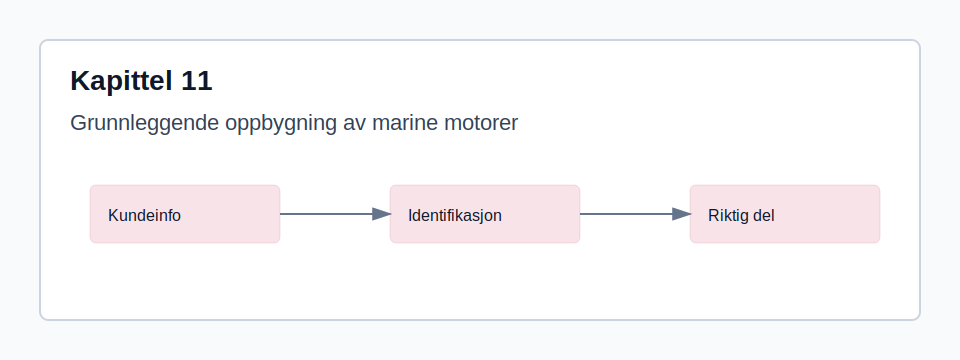

## Tekniske systemillustrasjoner

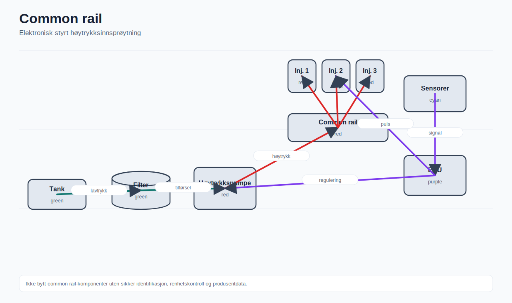

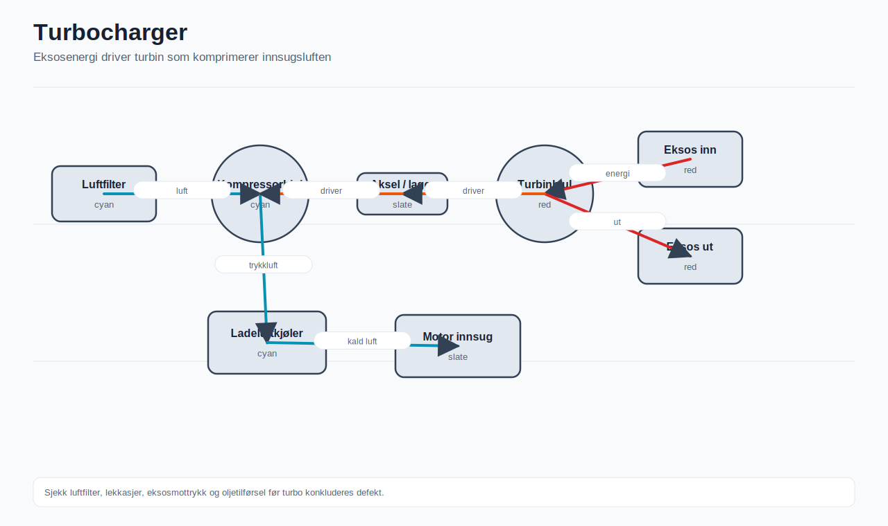

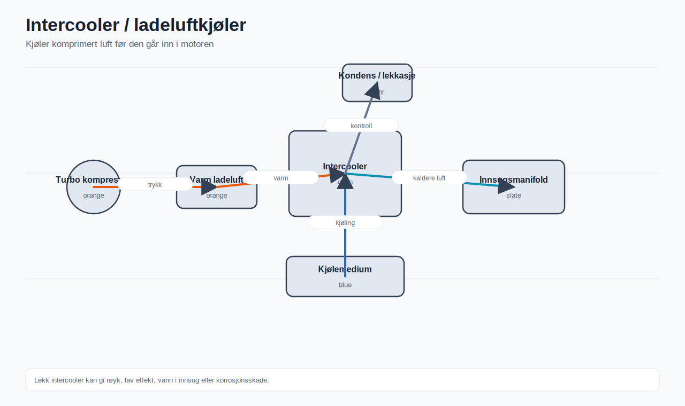

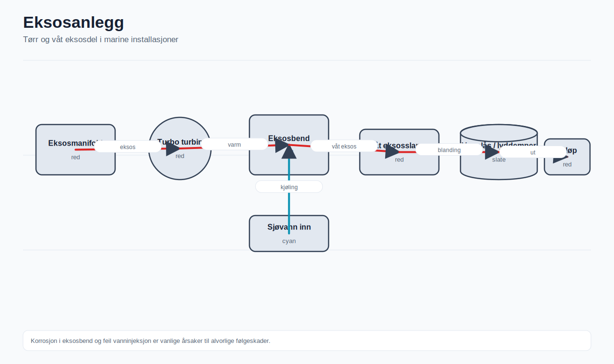

## Grundig forklaring
Hvordan hovedkomponenter er bygget opp og hvilke reservedeler de påvirker må forstås både teknisk og praktisk. I marine reservedeler er det sjelden nok å vite hva kunden kaller delen. Medarbeideren må forstå hvilken funksjon delen har, hvor den sitter, hvilken motorvariant den tilhører, og hva som skjer dersom feil del bestilles. Derfor skal tekniske data, kundens beskrivelse og dokumentert katalogoppslag alltid vurderes sammen.

En god sak har fire kjennetegn: den har tydelig identifikasjon, tydelig problem- eller delbeskrivelse, tydelig beslutningsgrunnlag og tydelig oppfølging. Dersom ett av disse punktene mangler, skal saken markeres som usikker før kunden får et bindende svar.

## Praktisk verkstedeksempel
Et verksted står med demontert komponent og trenger rask avklaring. Medarbeideren registrerer kunde, fartøy, motorinformasjon og tidsfrist, ber om bilder av typeplate og komponent, sjekker katalog og lager, og sender et kort skriftlig svar med valgt del, grunnlag for valget og neste oppdateringstidspunkt.

## Kundesupporteksempel
Kunde: 'Motoren går dårlig, kan dere sende riktig del?' Profesjonelt svar: 'Vi kan hjelpe, men først må vi skille mellom symptom og delbehov. Send serienummer, bilde av motorplate, bilde av området feilen gjelder og en kort beskrivelse av når feilen oppstår. Da kan vi foreslå riktig del eller riktig neste feilsøkingstrinn.'

## Vanlige feil og årsaker
- feil eller ufullstendig serienummer.
- delnummer som er erstattet uten at saken dokumenteres.
- symptom som tolkes som delbehov uten feilsøking.
- kunde har bilde av lignende del, men ikke korrekt motorvariant.
- manglende avklaring av antall, side, posisjon eller leveringstid.

## Feilsøkingsflyt
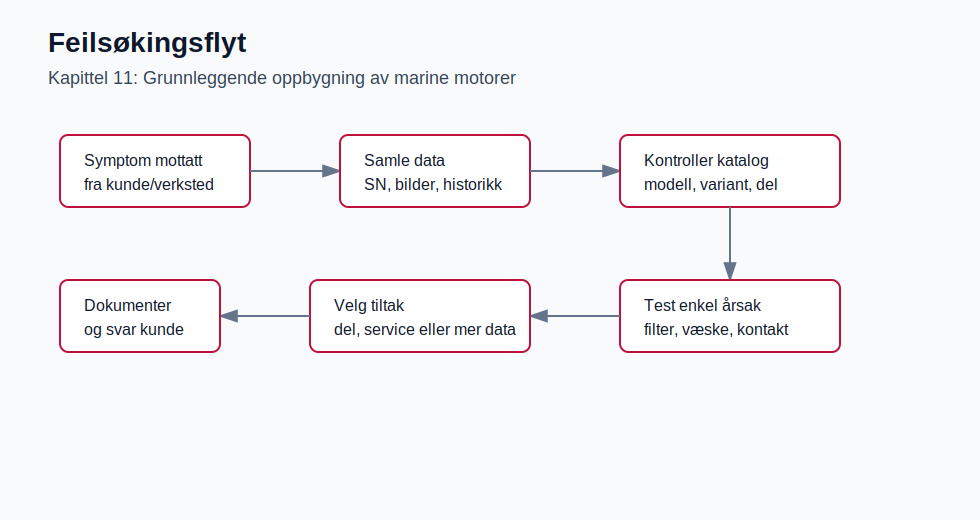

```mermaid
flowchart TD
    A[Symptom eller forespørsel mottatt] --> B[Samle serienummer, bilder og historikk]
    B --> C{Er motor og variant sikkert identifisert?}
    C -- Nei --> D[Be om mer dokumentasjon før del bekreftes]
    C -- Ja --> E[Kontroller delnummer og posisjon i katalog]
    E --> F{Stemmer symptom med foreslått del?}
    F -- Nei --> G[Foreslå feilsøking eller teknisk kontroll]
    F -- Ja --> H[Kontroller lager, pris og levering]
    H --> I[Send dokumentert kundesvar]
```

## Vedlikeholdsprosedyre
1. Avklar driftstimer, siste service og driftsmiljø.
2. Kontroller olje, filter, kjølevæske, sjøvannskrets, reimer, slanger og elektriske kontakter.
3. Sammenlign vedlikeholdsbehov med produsentens intervaller og faktisk bruk.
4. Anbefal servicekit når flere slitedeler bør skiftes samtidig.
5. Dokumenter hva som er anbefalt, hva kunden bestiller og eventuelle avvik fra normal prosedyre.

## Serienummeridentifikasjon
Serienummeridentifikasjon starter med å finne typeplate, motornummer eller annen unik identifikasjon. Be om bilde, ikke bare avskrift, fordi feil tegn, mellomrom og prefiks kan endre katalogoppslaget. Når serienummer ikke finnes, bygges identifikasjonen med modell, produksjonsår, bilder, tidligere fakturaer, servicehistorikk og delnummer fra monterte komponenter.

Minimumsdata bør være: fabrikat, modell, serienummer, eventuell product number/arrangement/CPL/motornummer, bilde av typeplate og bilde av motorens installasjon. Ved tvil skal saken stoppes for avklaring før del bekreftes.

## Reservedelsidentifikasjon
Reservedelsidentifikasjon skal bekrefte delnummer, posisjon, antall per motor, variant, side og eventuell erstatning. Dersom kunden oppgir et gammelt nummer, må det kontrolleres mot supersession. Dersom kunden bare sender bilde, skal bildet brukes som støtte, ikke som eneste grunnlag for bestilling.

Sjekk alltid om delnummeret gjelder enkeltkomponent, reparasjonssett, servicekit eller komplett enhet. Kontroller også om varen er høyre/venstre, gammel/ny type, standard/oversize eller knyttet til en bestemt produksjonsperiode.

## Bestillingsprosedyre
1. Opprett eller oppdater sak med kunde, fartøy, kontaktperson og tidsfrist.
2. Verifiser motoridentifikasjon og lagre bildedokumentasjon.
3. Finn korrekt delnummer i relevant katalog eller leverandørgrunnlag.
4. Kontroller supersession, antall, lagerstatus, pris, returvilkår og leveringstid.
5. Send ordrebekreftelse med delnummer, beskrivelse, antall, pris, levering og forbehold.
6. Følg opp leveransen til kunden har mottatt varen eller saken er lukket.

## Kvalitetspunkter før svar
- Har vi nok data til å gi et sikkert svar?
- Er delnummeret kontrollert mot riktig motorvariant?
- Er kundens tidsfrist realistisk med valgt fraktmåte?
- Er eventuelle forbehold skrevet tydelig?
- Kan en kollega forstå beslutningen ved å lese saken senere?

## Kapittelsammendrag
Hovedpoenget i kapittel 11 er at profesjonelt reservedelsarbeid krever struktur. Teknisk kunnskap, engelske fagtermer, praktisk feilsøking, dokumentasjon og kundedialog må henge sammen. Når medarbeideren jobber systematisk, reduseres feilbestillinger, kunden får bedre svar, og verkstedet kan planlegge arbeidet tryggere.

## Kryssreferanser
- For forrige tema, se kapittel 10: Kommunikasjon med kunder og interne kollegaer.
- For neste tema, se kapittel 12: Hvordan lese og forstå motorserienummer.
- For grunnleggende identifikasjon, se kapittel 12 og 17.
- For merkevise eksempler, se kapitlene 26-32.

## Fordypning for intern opplæring
Dette kapitlet skal brukes som arbeidsstandard, ikke bare som lesestoff. Når en ny medarbeider møter en sak om motoroppbygning, skal vedkommende trene på å gå rolig fra fakta til vurdering og deretter til handling. I en marinemotorforhandler er konsekvensen av en feil ofte større enn verdien av selve delen. En feil impeller, feil sensor, feil filterinnsats eller feil pakningssett kan føre til tapt verkstedtid, utsatt avgang, irritert kunde og i verste fall ny driftsstans. Derfor skal hver sak behandles som en teknisk beslutning med sporbar dokumentasjon.

Profesjonelt nivå i dette kapitlet betyr at medarbeideren kan arbeide sikkert med motoroppbygning. Før kunden får et bindende svar, skal opplysningene i saken kontrolleres mot motorens identitet, faktisk installasjon og relevant produsentterminologi. Det praktiske målet er ikke å finne et raskt nummer, men å kunne forklare hvorfor valgt del, kontrollpunkt eller kundesvar er riktig for akkurat denne motoren. Når informasjon mangler, skal medarbeideren beskrive hva som mangler, hvorfor det er nødvendig, og hvilket neste steg som bringer saken videre.

## Tekniske forklaringer
Teknisk forståelse i dette kapitlet skal bygges rundt cylinder block, cylinder head, crankshaft, camshaft, cooling circuit og lubrication system. Medarbeideren må skille mellom synlig symptom, sannsynlig systemfeil og bestillbar komponent. En del kan se riktig ut på bilde, men likevel være feil dersom posisjon, variant, rating, kjøleroppsett, elektrisk plugg, monteringsside eller servicehistorikk ikke stemmer. Derfor skal teknisk vurdering alltid kobles til både funksjon og dokumentasjon: hva gjør komponenten, hvilket system påvirker den, og hvilken produsentkilde bekrefter at den passer.

I praksis betyr dette at tekniske data skal kobles til motorens faktiske installasjon. Marine motorer står ofte trangt, er utsatt for salt, vibrasjon, fukt og ujevnt belastningsmønster, og de kan være bygget om gjennom mange år. En motor kan ha original kjøler, ettermontert eksosbend, alternativ dynamo, endret filterbrakett eller annen sjøvannspumpe enn standard. Slike forhold gjør at delidentifikasjon må bygge på både produsentdata og synlig dokumentasjon fra motoren.

Produsentterminologi er en del av den tekniske forståelsen. Bruk uttrykk som Serial Number, Engine Number, Part Number, Service Kit, Exploded View, Supersession når de er relevante. Ikke oversett dem på en måte som fjerner presisjon. Skriv for eksempel «Engine Serial Number (ESN)» første gang og deretter «ESN» i saken dersom produsenten bruker dette. Skriv «Arrangement Number» når CAT-data krever det, «Product Number» når Volvo Penta bruker det, «CPL» når Cummins-konfigurasjon må kontrolleres, og «Model Code» når Yanmar-identifikasjon bygger på modellkode. Dette gjør dialogen med internasjonale leverandører mer presis.

## Illustrasjonsforslag
- Oversiktsdiagram som viser hvor motoroppbygning passer inn i total arbeidsflyt fra kundeforespørsel til levert del.
- Nærbilde av typeplate/motorskilt med markering av serienummer, motornummer, modell og eventuell variantkode.
- Sprengskisse med markert posisjon, delnummer, antall per motor og mulige alternative versjoner.
- Feilsøkingsflyt med beslutningspunkter: mangler data, stemmer symptom, kreves mer teknisk kontroll, kan ordre bekreftes.
- Sammenligningsbilde av gammel og ny del der forskjell i tilkobling, side, lengde eller sensorplugg er markert.

## Virkelige verkstedseksempler
Eksempel 1: Et verksted står med en demontert komponent på benken og kunden venter på avklaring før fartøyet kan settes tilbake i drift. Verkstedet sender et nærbilde av delen, men ingen motorplate. En uerfaren medarbeider kan bli fristet til å søke på nummeret som står på støpegodset. En profesjonell medarbeider svarer at støpenummer ikke nødvendigvis er bestillbart delnummer, ber om bilde av typeplate, oversiktsbilde av motoren og bilde av monteringsstedet, og forklarer at dette hindrer feilbestilling. Når informasjonen kommer, kontrolleres delnummer mot sprengskisse, posisjon og antall. Først da gis pris og leveringstid.

Eksempel 2: En kunde ringer sent på dagen og sier at motoren har høy temperatur etter service. Kunden ønsker ny termostat. Medarbeideren skal ikke automatisk konkludere med termostatfeil. Spørsmålene bør avklare om impeller er byttet, om sjøvannsfilteret er rent, om kjølevæskenivået er riktig, om alarmen kommer ved tomgang eller belastning, og om det finnes lekkasje rundt varmeveksler eller slanger. Dersom kunden likevel vil bestille termostat, dokumenteres at feilsøking er anbefalt, og delnummer kontrolleres mot serienummer før ordre.

Eksempel 3: En intern selger mottar en gammel faktura med et delnummer som ikke lenger finnes. Riktig prosess er å kontrollere supersession, se om ny del krever tilhørende pakning, boltsett eller adapter, og notere både gammelt og nytt nummer i saken. Kunden skal få vite at delen er erstattet, hva som leveres, og om det finnes monteringsforbehold.

## Reservedelsidentifisering i praksis
Reservedelsidentifisering skal følge en fast rekkefølge. Først kontrolleres motorens identitet. Deretter kontrolleres delens system: drivstoff, luft, kjøling, smøring, eksos, elektrisk eller mekanisk kraftoverføring. Så kontrolleres posisjon i sprengskisse eller parts list. Til slutt kontrolleres antall, variant, supersession og leveringsstatus. Denne rekkefølgen hindrer at medarbeideren hopper direkte fra kundens ord til et tilfeldig delnummer.

Når en del har synlig nummer, må nummeret tolkes riktig. Mange komponenter har produksjonsnummer, støpenummer, leverandørnummer eller revisjonskode som ikke er det samme som bestillbart part number. Et filter kan ha nummer fra filterprodusent, men motorprodusentens parts catalogue kan bruke et annet nummer. En pumpe kan ha nummer på lokk, hus og komplett enhet. Spør derfor alltid: gjelder nummeret komplett del, reparasjonssett, underkomponent eller produsentens råkomponent?

## Serienummer og motornummer
Serienummer og motornummer er grunnlaget for korrekt katalogoppslag. Be kunden sende bilde av typeplate eller dataplate. Dersom kunden skriver nummeret manuelt, skal nummeret likevel kontrolleres mot bilde når det er mulig. Noter hele nummeret, inkludert prefiks, suffiks, bindestrek, mellomrom og eventuelle bokstaver. På enkelte produsenter kan små forskjeller peke til forskjellig produksjonsperiode, rating eller konfigurasjon.

Bruk motornummer sammen med modell, variant og applikasjon. En motor som driver generator kan ha andre deler enn en fremdriftsmotor. En motor i yrkesbåt kan ha annen rating enn samme motor i fritidsbåt. En eldre motor kan være bygget om med ny dynamo, annen sjøvannspumpe eller uoriginal filterbrakett. Dersom typeplate mangler, bygg identifikasjonen gjennom flere kilder: servicebok, tidligere faktura, bilder av motorens sider, nummer på pumpe, filter, turbo og gear, samt opplysninger om fartøy og produksjonsår.

## Feilsøking steg for steg
1. Definer symptomet med kundens egne ord og skriv det i saken. Skill mellom «kunden ønsker del» og «kunden beskriver feil».
2. Avklar når feilen oppstår: start, tomgang, belastning, marsjfart, varm motor, kald motor eller etter nylig service.
3. Kontroller grunnleggende forhold: væskenivå, filter, luft i drivstoff, sjøvannsstrøm, reimer, elektriske kontakter, sikringer og synlige lekkasjer.
4. Knytt symptomet til system: lav effekt peker ofte mot luft/drivstoff/eksos, høy temperatur mot kjøling, lavt oljetrykk mot smøring/sensor, startproblem mot batteri/starter/gløding/drivstoff.
5. Be om bilder eller måledata dersom symptomet ikke kan kobles sikkert til en del. Dette kan være bilde av alarmdisplay, trykkmåling, temperaturmåling eller bilde av montert komponent.
6. Kontroller relevant delnummer mot serienummer og variant. Dersom flere alternativer finnes, forklar kunden hva som skiller dem.
7. Dokumenter anbefalt tiltak, usikkerhet og eventuelle forbehold før ordre bekreftes.

## Vedlikehold
Vedlikehold skal vurderes mot driftstimer, produsentens maintenance schedule og faktisk driftsmiljø. Marine motorer som går korte turer, mye tomgang eller i salt miljø kan trenge hyppigere kontroll enn standard intervall antyder. Nye medarbeidere skal lære å spørre om siste service, hvilke filter som ble byttet, hvilken olje som ble brukt, om impeller er kontrollert, og om kjølevæske eller anoder er byttet etter plan.

En god vedlikeholdsanbefaling er konkret. I stedet for å skrive «ta service», bør medarbeideren foreslå relevante deler: olje- og drivstoffilter, luftfilter, impeller, reim, pakninger, anoder, kjølevæske og eventuelt servicekit. Dersom kunden har ukjent servicehistorikk, bør komplett servicekit vurderes. Dersom kunden har hatt overoppheting, bør sjøvannskrets og varmeveksler kontrolleres før bare én komponent byttes.

## Vanlige feil
- Serienummer leses feil fordi et tegn forveksles, for eksempel O/0 eller I/1.
- Kunden oppgir modellnavn, men ikke variant, rating eller applikasjon.
- Del velges ut fra bilde alene uten kontroll mot sprengskisse eller produsentkatalog.
- Supersession aksepteres uten å kontrollere om ny del krever tilbehør, pakning eller ombygging.
- Hastepress gjør at leveringsløfte gis før lagerstatus og fraktmulighet er bekreftet.
- Saksnotat mangler grunnlaget for beslutningen, slik at kollega ikke kan etterprøve valget.

## Kontrollspørsmål
- Hva er den viktigste tekniske risikoen i en sak som gjelder motoroppbygning?
- Hvilke opplysninger må dokumenteres før bindende delnummer bekreftes?
- Hvordan forklarer du kunden hvorfor bilde av typeplate er nødvendig?
- Når bør du stoppe en ordre og be om mer dokumentasjon?
- Hvilke engelske produsentuttrykk bør du kunne bruke i denne typen sak?
- Hvordan dokumenterer du at et delnummer er erstattet av et nytt nummer?

## Praktisk sjekkliste for medarbeider
- Les saken som om en kollega skal overta den i morgen.
- Kontroller at motoridentifikasjon er dokumentert med bilde eller sikker kilde.
- Sjekk at delnummeret er knyttet til riktig posisjon i katalogen.
- Skriv tydelig om kunden har bedt om enkeltkomponent, servicekit eller komplett enhet.
- Noter om varen er spesialbestilling, utgått, erstattet eller ikke returbar.
- Send kundesvar med neste steg, ikke bare et løst delnummer.

## Kapittelspesifikk systemforståelse
For dette kapitlet er kjernen å forstå motorens mekaniske og termiske hovedsystemer. Medarbeideren skal kunne forklare dette med praktiske ord til både kunde og kollega. Det betyr at teknisk teori må kobles til konkrete handlinger: hvilke data skal innhentes, hvilke komponenter kan være berørt, hvilken produsentterminologi skal brukes, og hva må dokumenteres før saken kan gå videre. Når du forstår funksjonen, blir det lettere å se hvilke deler som hører sammen.

Når systemet vurderes, skal medarbeideren først plassere problemet i riktig teknisk sammenheng. Dersom kunden beskriver en alarm, må man finne ut om alarmen kommer fra reelt mekanisk avvik, elektrisk sensorfeil, feil etter service eller feil tolkning av instrumentet. Dersom kunden beskriver en del, må man avklare om kunden mener komplett enhet, servicekit, reparasjonssett eller enkeltkomponent. Dersom kunden beskriver motoren med vanlig navn, må man kontrollere om produsenten bruker mer presise begreper i katalogen.

## Komponentoversikt og arbeidsgrense
Relevante komponenter og opplysninger i dette kapitlet omfatter: motorblokk, topplokk, veivaksel, kamaksel, pumper, dyser, turbo, kjølere, sensorer og ECU. Listen er ikke ment som en erstatning for produsentens parts catalogue, men som en praktisk påminnelse om hva nye medarbeidere skal tenke på før de søker del. I interne saker skal komponentnavn skrives så presist som mulig. Bruk for eksempel «sjøvannspumpe / raw water pump» i stedet for bare «pumpe» når funksjonen er kjent, og «varmeveksler / heat exchanger» i stedet for bare «kjøler» når det er den komponenten saken gjelder.

Arbeidsgrensen for en reservedelsmedarbeider er også viktig. Medarbeideren skal ikke overta mekanikerens ansvar for demontering, måling eller diagnose på motoren, men skal kunne stille riktige spørsmål og foreslå riktig dokumentasjon. Når en sak går fra enkel delidentifikasjon til teknisk diagnose, skal dette markeres i saken. Da kan verksted, teknisk ansvarlig eller leverandør involveres med et klart spørsmål og et ryddig faktagrunnlag.

## Praktisk beslutningsregel
Bruk denne regelen i alle saker knyttet til kapitlet: Hvis motoridentifikasjon, komponentposisjon eller symptom ikke er sikkert nok dokumentert, skal medarbeideren ikke gi bindende delbekreftelse. Kunden kan få et foreløpig svar, men svaret må inneholde hva som mangler, hvorfor det mangler, og hva som skjer når informasjonen er mottatt. Dette er ikke treg service; det er profesjonell risikokontroll.

## Målrettet fordypning kapittel 11-20
### Motoroppbygning som grunnlag for delvalg
Når medarbeideren arbeider med motoroppbygning, skal motoren deles inn i funksjonelle hovedsystemer: mekanisk grunnmotor, luftsystem, drivstoffsystem, smøresystem, kjølesystem, eksossystem, elektrisk system og kraftoverføring. Grunnmotoren omfatter motorblokk, sylinderforinger, stempler, råder, veivaksel, kamaksel, topplokk, ventiler og pakninger. Luftsystemet omfatter luftfilter, innsug, turbocharger, aftercooler/intercooler og ladeluftslanger. Drivstoffsystemet omfatter tanktilførsel, forfilter, finfilter, matepumpe, høytrykkspumpe, common rail eller mekanisk innsprøytning, dyser/injectors og returledning. Kjølesystemet kan bestå av ferskvannskrets, sjøvannskrets, heat exchanger, raw water pump, thermostat og slanger.

I verkstedpraksis betyr dette at én feilbeskrivelse kan peke mot flere systemer. Lav effekt kan skyldes drivstoffmangel, luftrestriksjon, turbohavari, tett eksos eller feil belastning fra propell. Høy temperatur kan skyldes slitt impeller, tett sjøvannsinntak, defekt termostat, skitten varmeveksler eller luft i ferskvannskretsen. Når kunden ber om en bestemt komponent, skal medarbeideren derfor spørre hvilket system symptomet gjelder før delen bekreftes.

### Praktisk anvendelse i opplæring
Instruktør bør bruke dette kapitlet med en konkret case der deltakerne først må identifisere manglende opplysninger, deretter velge riktig kataloggrunnlag og til slutt skrive et kort kundesvar. Deltakeren skal forklare hvilke produsentdata som er nødvendige, hvilke komponenter som kan være involvert, og hvor grensen går mellom reservedelsidentifisering og mekanisk diagnose. Målet er at medarbeideren ikke bare husker begreper, men kan bruke dem under tidspress i en reell kundesak.

## Realistisk opplæring i praksis
### Verkstedhistorie
En typisk sak i dette temaet starter med mekaniker finner flere berørte systemer. Verkstedet trenger et raskt svar, men den erfarne medarbeideren stopper opp og spør først: hva vet vi sikkert, hva antar vi, og hva kan gi følgeskade hvis vi tar feil? I praksis betyr det at komponenter og systemgrenser må kobles til bilde, serienummer, komponentposisjon og kundens symptom før saken lukkes. Historien skal brukes i opplæring som en øvelse i å skrive et kort saksnotat: observasjon, vurdering, neste handling og forbehold.

### Kundehistorie
Kunden beskriver ofte problemet med driftsspråk: «motoren går tungt», «alarm kommer etter ti minutter», «jeg trenger den samme delen som sist» eller «båten skal ut i morgen». En profesjonell respons er rolig og konkret: bekreft behovet, forklar hvorfor identifikasjon trengs, be om riktig dokumentasjon og gi et realistisk tidspunkt for neste svar. Ikke korriger kunden unødvendig; oversett kundens språk til teknisk språk i saken.

### Typiske feil nye ansatte gjør
- søker på første synlige nummer uten å avklare om det er støpenummer, leverandørnummer eller bestillbart part number.
- lover levering før lagerstatus, frakt og returvilkår er kontrollert.
- antar at tidligere faktura alltid gjelder samme motorvariant.
- blander symptom og årsak, spesielt ved varme, lav effekt, startproblem og alarm.
- skriver for korte notater slik at kollega ikke kan forstå hvorfor valget ble tatt.

### Tips fra erfarne mekanikere og reservedelsselgere
- Se alltid etter systemet rundt delen: slanger, braketter, sensorer, reimer, kjølere og tilkoblinger forteller ofte mer enn delen alene.
- Still ett presist spørsmål om gangen når kunden er stresset; mange dårlige svar kommer av for lange spørsmålslister.
- Sammenlign gammel og ny del mot funksjon, ikke bare form. Riktig del skal passe, men også løse riktig problem.
- En erfaren reservedelsselger tenker i risiko: Hva er billigst å avklare nå, og hva blir dyrt hvis vi hopper over det?

### Vanlige kundespørsmål
| Spørsmål fra kunde | Profesjonelt svar |
|---|---|
| «Kan du bare sende samme del som sist?» | «Ja, hvis vi først bekrefter at det gjelder samme motor, samme posisjon og ingen supersession siden sist.» |
| «Holder det med bilde?» | «Bilde hjelper, men vi trenger også motoridentitet for å sikre variant og delnummer.» |
| «Hvorfor tar dette tid?» | «Fordi feil del kan gi ny driftsstans. Vi kontrollerer grunnlaget før vi lover levering.» |

### Beslutningstre for saken
| Trinn | Spørsmål | Handling |
|---|---|---|
| 1 | Er motoridentitet dokumentert med bilde eller sikker historikk? | Hvis nei: be om typeplate/dataplate eller alternativ dokumentasjon. |
| 2 | Er komponentens funksjon og posisjon kjent? | Hvis nei: be om oversiktsbilde og bilde av monteringssted. |
| 3 | Stemmer kundens symptom med delen som ønskes? | Hvis nei: anbefal feilsøking før del bestilles. |
| 4 | Finnes det supersession, kit eller variantvalg? | Kontroller produsentkilde og skriv forbehold i saken. |
| 5 | Kan pris, levering og returvilkår bekreftes? | Send dokumentert svar med neste steg og tydelig gyldighet. |

### Rask oppslagstabell
| Situasjon | Kontroller først | Vanlig fallgruve |
|---|---|---|
| Hasteordre | sikker motor-ID, lager, fraktfrist | levering loves før teknisk kontroll |
| Del fra bilde | posisjon, skala, tilkoblinger, nummer | bilde brukes som eneste beslutningsgrunnlag |
| Gammelt delnummer | supersession og kitinnhold | ny del krever ekstra pakning eller adapter |
| Uklart symptom | driftssituasjon, alarm, siste service | symptom blir tolket som sikker komponentfeil |

### Praktisk sjekkliste og inspeksjonsrutine
- Start med motoridentitet: fabrikat, modell, serienummer, variant, applikasjon og bilde av skilt.
- Kontroller området rundt komponenten: lekkasje, korrosjon, knekte fester, slitasje, varmemerker og uoriginale endringer.
- Spør om siste vedlikehold: olje, filter, impeller, reimer, kjølevæske, anoder og drivstoffilter.
- Noter driftstype: fritidsbruk, yrkesbruk, generator, fremdrift, tomgangsdrift eller langvarig høy belastning.
- Avklar om saken gjelder akutt drift, planlagt service, reklamasjon eller lagerpåfyll.

### Generelle vedlikeholdsintervaller som opplæringspunkt
| Kontrollpunkt | Typisk vurdering i opplæring | Må verifiseres |
|---|---|---|
| Olje og oljefilter | ofte basert på timer og kalender | produsentens maintenance schedule |
| Drivstoffilter/vannutskiller | hyppigere ved dårlig drivstoff eller sesongstart | motor- og filterspesifikasjon |
| Impeller og sjøvannskrets | kontrolleres særlig før sesong og etter varmgang | produsentens intervall og installasjon |
| Reimer, slanger og klemmer | visuell kontroll ved service og feilsøking | dimensjon, stramming og delnummer |

### Produsentverifikasjon
Alle konkrete delnumre, momentverdier, serviceintervaller, garantikrav, programvaredata og produsentspesifikke grenser skal kontrolleres mot offisiell produsentdokumentasjon før de brukes i tilbud, ordre eller verkstedinstruks. Marker tydelig i saken når svaret bygger på antakelse, eldre historikk, bilde uten motor-ID eller generell erfaring. Intervaller i tabellen er generelle opplæringspunkter. Faktiske intervaller styres av produsent, motorvariant, driftstimer, kalenderkrav, belastning og miljø.

## Produsentverifikasjon og faglig forbehold
Denne manualen skal brukes som intern opplæring og arbeidsmetode. Produsentspesifikke delnumre, intervaller, momentverdier, garantikrav og tekniske grenseverdier skal verifiseres mot gjeldende produsentdokumentasjon før de brukes i kundeordre eller verkstedinstruks. Marker saken internt dersom opplysningen bygger på antakelse, eldre historikk eller bilde uten bekreftet motoridentitet.

## Quiz med fasit
1. Hvilke tekniske data bør alltid samles før en del bekreftes?
2. Hvorfor er engelsk terminologi viktig i marine reservedeler?
3. Hva bør gjøres dersom kunden bare sender et bilde av delen?
4. Hvilke punkter bør kontrolleres før ordrebekreftelse sendes?
5. Hvorfor skal feilsøking dokumenteres, selv når kunden allerede ber om en bestemt del?

### Svar
1. Fabrikat, modell, serienummer, variantdata, bilde av typeplate, delnummer, posisjon og kundens symptombeskrivelse.
2. Fordi kataloger, portaler, servicemanualer og leverandørdialog ofte bruker engelske begreper som må forstås presist.
3. Be om serienummer, oversiktsbilde av motoren og eventuelle nummer på delen; bildet brukes som støtte, ikke eneste grunnlag.
4. Delnummer, antall, variant, pris, lagerstatus, leveringstid, frakt, returvilkår og eventuelle forbehold.
5. Fordi symptomet kan ha flere årsaker, og dokumentasjon viser hvorfor anbefalingen ble gitt.

---

# Kapittel 12: Hvordan lese og forstå motorserienummer

## Kapittelrolle
Dette kapitlet gir en grundig praktisk innføring i serienummer. Temaet er viktig fordi reservedelsarbeid i marine miljøer kombinerer teknisk forståelse, presis kundedialog, dokumentert saksbehandling og realistisk leveranseoppfølging. Målet er at en ny medarbeider skal kunne bruke kunnskapen direkte i arbeid med verksted, kunde, lager og leverandør.

## Læringsmål
Etter kapitlet skal deltakeren kunne:
- forklare hovedbegrepene innen serienummer
- bruke serienummer, modellinformasjon og delnummer i praktisk reservedelsarbeid
- kommunisere trygt med kunde, verksted, lager og leverandør
- dokumentere beslutninger slik at andre kan etterprøve saken
- kjenne igjen vanlige feil og velge riktig neste handling

## English technical terminology
- **Serial Number:** engelsk fagterm som ofte brukes i kataloger, servicelitteratur, leverandørportaler og internasjonal kundedialog.
- **Part Number:** engelsk fagterm som ofte brukes i kataloger, servicelitteratur, leverandørportaler og internasjonal kundedialog.
- **Engine Model:** engelsk fagterm som ofte brukes i kataloger, servicelitteratur, leverandørportaler og internasjonal kundedialog.
- **Variant:** engelsk fagterm som ofte brukes i kataloger, servicelitteratur, leverandørportaler og internasjonal kundedialog.
- **Service Kit:** engelsk fagterm som ofte brukes i kataloger, servicelitteratur, leverandørportaler og internasjonal kundedialog.
- **Troubleshooting:** engelsk fagterm som ofte brukes i kataloger, servicelitteratur, leverandørportaler og internasjonal kundedialog.
- **Maintenance:** engelsk fagterm som ofte brukes i kataloger, servicelitteratur, leverandørportaler og internasjonal kundedialog.
- **Ordering Procedure:** engelsk fagterm som ofte brukes i kataloger, servicelitteratur, leverandørportaler og internasjonal kundedialog.
- **Supersession:** engelsk fagterm som ofte brukes i kataloger, servicelitteratur, leverandørportaler og internasjonal kundedialog.
- **Technical Support:** engelsk fagterm som ofte brukes i kataloger, servicelitteratur, leverandørportaler og internasjonal kundedialog.

## Hoveddiagram

## Tekniske systemillustrasjoner

## Grundig forklaring
Hvordan serienummer leses, kontrolleres og brukes i katalogoppslag må forstås både teknisk og praktisk. I marine reservedeler er det sjelden nok å vite hva kunden kaller delen. Medarbeideren må forstå hvilken funksjon delen har, hvor den sitter, hvilken motorvariant den tilhører, og hva som skjer dersom feil del bestilles. Derfor skal tekniske data, kundens beskrivelse og dokumentert katalogoppslag alltid vurderes sammen.

En god sak har fire kjennetegn: den har tydelig identifikasjon, tydelig problem- eller delbeskrivelse, tydelig beslutningsgrunnlag og tydelig oppfølging. Dersom ett av disse punktene mangler, skal saken markeres som usikker før kunden får et bindende svar.

## Praktisk verkstedeksempel
Et verksted står med demontert komponent og trenger rask avklaring. Medarbeideren registrerer kunde, fartøy, motorinformasjon og tidsfrist, ber om bilder av typeplate og komponent, sjekker katalog og lager, og sender et kort skriftlig svar med valgt del, grunnlag for valget og neste oppdateringstidspunkt.

## Kundesupporteksempel
Kunde: 'Motoren går dårlig, kan dere sende riktig del?' Profesjonelt svar: 'Vi kan hjelpe, men først må vi skille mellom symptom og delbehov. Send serienummer, bilde av motorplate, bilde av området feilen gjelder og en kort beskrivelse av når feilen oppstår. Da kan vi foreslå riktig del eller riktig neste feilsøkingstrinn.'

## Vanlige feil og årsaker
- feil eller ufullstendig serienummer.
- delnummer som er erstattet uten at saken dokumenteres.
- symptom som tolkes som delbehov uten feilsøking.
- kunde har bilde av lignende del, men ikke korrekt motorvariant.
- manglende avklaring av antall, side, posisjon eller leveringstid.

## Feilsøkingsflyt

```mermaid
flowchart TD
    A[Symptom eller forespørsel mottatt] --> B[Samle serienummer, bilder og historikk]
    B --> C{Er motor og variant sikkert identifisert?}
    C -- Nei --> D[Be om mer dokumentasjon før del bekreftes]
    C -- Ja --> E[Kontroller delnummer og posisjon i katalog]
    E --> F{Stemmer symptom med foreslått del?}
    F -- Nei --> G[Foreslå feilsøking eller teknisk kontroll]
    F -- Ja --> H[Kontroller lager, pris og levering]
    H --> I[Send dokumentert kundesvar]
```

## Vedlikeholdsprosedyre
1. Avklar driftstimer, siste service og driftsmiljø.
2. Kontroller olje, filter, kjølevæske, sjøvannskrets, reimer, slanger og elektriske kontakter.
3. Sammenlign vedlikeholdsbehov med produsentens intervaller og faktisk bruk.
4. Anbefal servicekit når flere slitedeler bør skiftes samtidig.
5. Dokumenter hva som er anbefalt, hva kunden bestiller og eventuelle avvik fra normal prosedyre.

## Serienummeridentifikasjon
Serienummeridentifikasjon starter med å finne typeplate, motornummer eller annen unik identifikasjon. Be om bilde, ikke bare avskrift, fordi feil tegn, mellomrom og prefiks kan endre katalogoppslaget. Når serienummer ikke finnes, bygges identifikasjonen med modell, produksjonsår, bilder, tidligere fakturaer, servicehistorikk og delnummer fra monterte komponenter.

Minimumsdata bør være: fabrikat, modell, serienummer, eventuell product number/arrangement/CPL/motornummer, bilde av typeplate og bilde av motorens installasjon. Ved tvil skal saken stoppes for avklaring før del bekreftes.

## Reservedelsidentifikasjon
Reservedelsidentifikasjon skal bekrefte delnummer, posisjon, antall per motor, variant, side og eventuell erstatning. Dersom kunden oppgir et gammelt nummer, må det kontrolleres mot supersession. Dersom kunden bare sender bilde, skal bildet brukes som støtte, ikke som eneste grunnlag for bestilling.

Sjekk alltid om delnummeret gjelder enkeltkomponent, reparasjonssett, servicekit eller komplett enhet. Kontroller også om varen er høyre/venstre, gammel/ny type, standard/oversize eller knyttet til en bestemt produksjonsperiode.

## Bestillingsprosedyre
1. Opprett eller oppdater sak med kunde, fartøy, kontaktperson og tidsfrist.
2. Verifiser motoridentifikasjon og lagre bildedokumentasjon.
3. Finn korrekt delnummer i relevant katalog eller leverandørgrunnlag.
4. Kontroller supersession, antall, lagerstatus, pris, returvilkår og leveringstid.
5. Send ordrebekreftelse med delnummer, beskrivelse, antall, pris, levering og forbehold.
6. Følg opp leveransen til kunden har mottatt varen eller saken er lukket.

## Kvalitetspunkter før svar
- Har vi nok data til å gi et sikkert svar?
- Er delnummeret kontrollert mot riktig motorvariant?
- Er kundens tidsfrist realistisk med valgt fraktmåte?
- Er eventuelle forbehold skrevet tydelig?
- Kan en kollega forstå beslutningen ved å lese saken senere?

## Kapittelsammendrag
Hovedpoenget i kapittel 12 er at profesjonelt reservedelsarbeid krever struktur. Teknisk kunnskap, engelske fagtermer, praktisk feilsøking, dokumentasjon og kundedialog må henge sammen. Når medarbeideren jobber systematisk, reduseres feilbestillinger, kunden får bedre svar, og verkstedet kan planlegge arbeidet tryggere.

## Kryssreferanser
- For forrige tema, se kapittel 11: Grunnleggende oppbygning av marine motorer.
- For neste tema, se kapittel 13: Viktige identifikasjonsmerker på motoren.
- For merkevise eksempler, se kapitlene 26-32.

## Fordypning for intern opplæring
Dette kapitlet skal brukes som arbeidsstandard, ikke bare som lesestoff. Når en ny medarbeider møter en sak om serienummer, skal vedkommende trene på å gå rolig fra fakta til vurdering og deretter til handling. I en marinemotorforhandler er konsekvensen av en feil ofte større enn verdien av selve delen. En feil impeller, feil sensor, feil filterinnsats eller feil pakningssett kan føre til tapt verkstedtid, utsatt avgang, irritert kunde og i verste fall ny driftsstans. Derfor skal hver sak behandles som en teknisk beslutning med sporbar dokumentasjon.

Profesjonelt nivå i dette kapitlet betyr at medarbeideren kan arbeide sikkert med serienummerforståelse. Før kunden får et bindende svar, skal opplysningene i saken kontrolleres mot motorens identitet, faktisk installasjon og relevant produsentterminologi. Det praktiske målet er ikke å finne et raskt nummer, men å kunne forklare hvorfor valgt del, kontrollpunkt eller kundesvar er riktig for akkurat denne motoren. Når informasjon mangler, skal medarbeideren beskrive hva som mangler, hvorfor det er nødvendig, og hvilket neste steg som bringer saken videre.

## Tekniske forklaringer
Teknisk forståelse i dette kapitlet skal bygges rundt dataplate, engine serial number, prefix, suffix, model code og produksjonsvariant. Medarbeideren må skille mellom synlig symptom, sannsynlig systemfeil og bestillbar komponent. En del kan se riktig ut på bilde, men likevel være feil dersom posisjon, variant, rating, kjøleroppsett, elektrisk plugg, monteringsside eller servicehistorikk ikke stemmer. Derfor skal teknisk vurdering alltid kobles til både funksjon og dokumentasjon: hva gjør komponenten, hvilket system påvirker den, og hvilken produsentkilde bekrefter at den passer.

I praksis betyr dette at tekniske data skal kobles til motorens faktiske installasjon. Marine motorer står ofte trangt, er utsatt for salt, vibrasjon, fukt og ujevnt belastningsmønster, og de kan være bygget om gjennom mange år. En motor kan ha original kjøler, ettermontert eksosbend, alternativ dynamo, endret filterbrakett eller annen sjøvannspumpe enn standard. Slike forhold gjør at delidentifikasjon må bygge på både produsentdata og synlig dokumentasjon fra motoren.

Produsentterminologi er en del av den tekniske forståelsen. Bruk uttrykk som Serial Number, Engine Number, Part Number, Service Kit, Exploded View, Supersession når de er relevante. Ikke oversett dem på en måte som fjerner presisjon. Skriv for eksempel «Engine Serial Number (ESN)» første gang og deretter «ESN» i saken dersom produsenten bruker dette. Skriv «Arrangement Number» når CAT-data krever det, «Product Number» når Volvo Penta bruker det, «CPL» når Cummins-konfigurasjon må kontrolleres, og «Model Code» når Yanmar-identifikasjon bygger på modellkode. Dette gjør dialogen med internasjonale leverandører mer presis.

## Illustrasjonsforslag
- Oversiktsdiagram som viser hvor serienummer passer inn i total arbeidsflyt fra kundeforespørsel til levert del.
- Nærbilde av typeplate/motorskilt med markering av serienummer, motornummer, modell og eventuell variantkode.
- Sprengskisse med markert posisjon, delnummer, antall per motor og mulige alternative versjoner.
- Feilsøkingsflyt med beslutningspunkter: mangler data, stemmer symptom, kreves mer teknisk kontroll, kan ordre bekreftes.
- Sammenligningsbilde av gammel og ny del der forskjell i tilkobling, side, lengde eller sensorplugg er markert.

## Virkelige verkstedseksempler
Eksempel 1: Et verksted står med en demontert komponent på benken og kunden venter på avklaring før fartøyet kan settes tilbake i drift. Verkstedet sender et nærbilde av delen, men ingen motorplate. En uerfaren medarbeider kan bli fristet til å søke på nummeret som står på støpegodset. En profesjonell medarbeider svarer at støpenummer ikke nødvendigvis er bestillbart delnummer, ber om bilde av typeplate, oversiktsbilde av motoren og bilde av monteringsstedet, og forklarer at dette hindrer feilbestilling. Når informasjonen kommer, kontrolleres delnummer mot sprengskisse, posisjon og antall. Først da gis pris og leveringstid.

Eksempel 2: En kunde ringer sent på dagen og sier at motoren har høy temperatur etter service. Kunden ønsker ny termostat. Medarbeideren skal ikke automatisk konkludere med termostatfeil. Spørsmålene bør avklare om impeller er byttet, om sjøvannsfilteret er rent, om kjølevæskenivået er riktig, om alarmen kommer ved tomgang eller belastning, og om det finnes lekkasje rundt varmeveksler eller slanger. Dersom kunden likevel vil bestille termostat, dokumenteres at feilsøking er anbefalt, og delnummer kontrolleres mot serienummer før ordre.

Eksempel 3: En intern selger mottar en gammel faktura med et delnummer som ikke lenger finnes. Riktig prosess er å kontrollere supersession, se om ny del krever tilhørende pakning, boltsett eller adapter, og notere både gammelt og nytt nummer i saken. Kunden skal få vite at delen er erstattet, hva som leveres, og om det finnes monteringsforbehold.

## Reservedelsidentifisering i praksis
Reservedelsidentifisering skal følge en fast rekkefølge. Først kontrolleres motorens identitet. Deretter kontrolleres delens system: drivstoff, luft, kjøling, smøring, eksos, elektrisk eller mekanisk kraftoverføring. Så kontrolleres posisjon i sprengskisse eller parts list. Til slutt kontrolleres antall, variant, supersession og leveringsstatus. Denne rekkefølgen hindrer at medarbeideren hopper direkte fra kundens ord til et tilfeldig delnummer.

Når en del har synlig nummer, må nummeret tolkes riktig. Mange komponenter har produksjonsnummer, støpenummer, leverandørnummer eller revisjonskode som ikke er det samme som bestillbart part number. Et filter kan ha nummer fra filterprodusent, men motorprodusentens parts catalogue kan bruke et annet nummer. En pumpe kan ha nummer på lokk, hus og komplett enhet. Spør derfor alltid: gjelder nummeret komplett del, reparasjonssett, underkomponent eller produsentens råkomponent?

## Serienummer og motornummer
Serienummer og motornummer er grunnlaget for korrekt katalogoppslag. Be kunden sende bilde av typeplate eller dataplate. Dersom kunden skriver nummeret manuelt, skal nummeret likevel kontrolleres mot bilde når det er mulig. Noter hele nummeret, inkludert prefiks, suffiks, bindestrek, mellomrom og eventuelle bokstaver. På enkelte produsenter kan små forskjeller peke til forskjellig produksjonsperiode, rating eller konfigurasjon.

Bruk motornummer sammen med modell, variant og applikasjon. En motor som driver generator kan ha andre deler enn en fremdriftsmotor. En motor i yrkesbåt kan ha annen rating enn samme motor i fritidsbåt. En eldre motor kan være bygget om med ny dynamo, annen sjøvannspumpe eller uoriginal filterbrakett. Dersom typeplate mangler, bygg identifikasjonen gjennom flere kilder: servicebok, tidligere faktura, bilder av motorens sider, nummer på pumpe, filter, turbo og gear, samt opplysninger om fartøy og produksjonsår.

## Feilsøking steg for steg
1. Definer symptomet med kundens egne ord og skriv det i saken. Skill mellom «kunden ønsker del» og «kunden beskriver feil».
2. Avklar når feilen oppstår: start, tomgang, belastning, marsjfart, varm motor, kald motor eller etter nylig service.
3. Kontroller grunnleggende forhold: væskenivå, filter, luft i drivstoff, sjøvannsstrøm, reimer, elektriske kontakter, sikringer og synlige lekkasjer.
4. Knytt symptomet til system: lav effekt peker ofte mot luft/drivstoff/eksos, høy temperatur mot kjøling, lavt oljetrykk mot smøring/sensor, startproblem mot batteri/starter/gløding/drivstoff.
5. Be om bilder eller måledata dersom symptomet ikke kan kobles sikkert til en del. Dette kan være bilde av alarmdisplay, trykkmåling, temperaturmåling eller bilde av montert komponent.
6. Kontroller relevant delnummer mot serienummer og variant. Dersom flere alternativer finnes, forklar kunden hva som skiller dem.
7. Dokumenter anbefalt tiltak, usikkerhet og eventuelle forbehold før ordre bekreftes.

## Vedlikehold
Vedlikehold skal vurderes mot driftstimer, produsentens maintenance schedule og faktisk driftsmiljø. Marine motorer som går korte turer, mye tomgang eller i salt miljø kan trenge hyppigere kontroll enn standard intervall antyder. Nye medarbeidere skal lære å spørre om siste service, hvilke filter som ble byttet, hvilken olje som ble brukt, om impeller er kontrollert, og om kjølevæske eller anoder er byttet etter plan.

En god vedlikeholdsanbefaling er konkret. I stedet for å skrive «ta service», bør medarbeideren foreslå relevante deler: olje- og drivstoffilter, luftfilter, impeller, reim, pakninger, anoder, kjølevæske og eventuelt servicekit. Dersom kunden har ukjent servicehistorikk, bør komplett servicekit vurderes. Dersom kunden har hatt overoppheting, bør sjøvannskrets og varmeveksler kontrolleres før bare én komponent byttes.

## Vanlige feil
- Serienummer leses feil fordi et tegn forveksles, for eksempel O/0 eller I/1.
- Kunden oppgir modellnavn, men ikke variant, rating eller applikasjon.
- Del velges ut fra bilde alene uten kontroll mot sprengskisse eller produsentkatalog.
- Supersession aksepteres uten å kontrollere om ny del krever tilbehør, pakning eller ombygging.
- Hastepress gjør at leveringsløfte gis før lagerstatus og fraktmulighet er bekreftet.
- Saksnotat mangler grunnlaget for beslutningen, slik at kollega ikke kan etterprøve valget.

## Kontrollspørsmål
- Hva er den viktigste tekniske risikoen i en sak som gjelder serienummer?
- Hvilke opplysninger må dokumenteres før bindende delnummer bekreftes?
- Hvordan forklarer du kunden hvorfor bilde av typeplate er nødvendig?
- Når bør du stoppe en ordre og be om mer dokumentasjon?
- Hvilke engelske produsentuttrykk bør du kunne bruke i denne typen sak?
- Hvordan dokumenterer du at et delnummer er erstattet av et nytt nummer?

## Praktisk sjekkliste for medarbeider
- Les saken som om en kollega skal overta den i morgen.
- Kontroller at motoridentifikasjon er dokumentert med bilde eller sikker kilde.
- Sjekk at delnummeret er knyttet til riktig posisjon i katalogen.
- Skriv tydelig om kunden har bedt om enkeltkomponent, servicekit eller komplett enhet.
- Noter om varen er spesialbestilling, utgått, erstattet eller ikke returbar.
- Send kundesvar med neste steg, ikke bare et løst delnummer.

## Kapittelspesifikk systemforståelse
For dette kapitlet er kjernen å forstå lesing og validering av serienummer og motornummer. Medarbeideren skal kunne forklare dette med praktiske ord til både kunde og kollega. Det betyr at teknisk teori må kobles til konkrete handlinger: hvilke data skal innhentes, hvilke komponenter kan være berørt, hvilken produsentterminologi skal brukes, og hva må dokumenteres før saken kan gå videre. Serienummer skal behandles som nøkkel til riktig katalog, ikke bare som generell informasjon.

Når systemet vurderes, skal medarbeideren først plassere problemet i riktig teknisk sammenheng. Dersom kunden beskriver en alarm, må man finne ut om alarmen kommer fra reelt mekanisk avvik, elektrisk sensorfeil, feil etter service eller feil tolkning av instrumentet. Dersom kunden beskriver en del, må man avklare om kunden mener komplett enhet, servicekit, reparasjonssett eller enkeltkomponent. Dersom kunden beskriver motoren med vanlig navn, må man kontrollere om produsenten bruker mer presise begreper i katalogen.

## Komponentoversikt og arbeidsgrense
Relevante komponenter og opplysninger i dette kapitlet omfatter: typeplate/dataplate, prefiks, suffiks, arrangement, product number, CPL, model code og engine number. Listen er ikke ment som en erstatning for produsentens parts catalogue, men som en praktisk påminnelse om hva nye medarbeidere skal tenke på før de søker del. I interne saker skal komponentnavn skrives så presist som mulig. Bruk for eksempel «sjøvannspumpe / raw water pump» i stedet for bare «pumpe» når funksjonen er kjent, og «varmeveksler / heat exchanger» i stedet for bare «kjøler» når det er den komponenten saken gjelder.

Arbeidsgrensen for en reservedelsmedarbeider er også viktig. Medarbeideren skal ikke overta mekanikerens ansvar for demontering, måling eller diagnose på motoren, men skal kunne stille riktige spørsmål og foreslå riktig dokumentasjon. Når en sak går fra enkel delidentifikasjon til teknisk diagnose, skal dette markeres i saken. Da kan verksted, teknisk ansvarlig eller leverandør involveres med et klart spørsmål og et ryddig faktagrunnlag.

## Praktisk beslutningsregel
Bruk denne regelen i alle saker knyttet til kapitlet: Hvis motoridentifikasjon, komponentposisjon eller symptom ikke er sikkert nok dokumentert, skal medarbeideren ikke gi bindende delbekreftelse. Kunden kan få et foreløpig svar, men svaret må inneholde hva som mangler, hvorfor det mangler, og hva som skjer når informasjonen er mottatt. Dette er ikke treg service; det er profesjonell risikokontroll.

## Målrettet fordypning kapittel 11-20
### Serienummer, motornummer og produsentens identifikasjonslogikk
Serienummer er ikke bare et nummer for registrering; det er nøkkelen til produksjonsdata, variant, serienummerskille og korrekt parts catalogue. For Caterpillar brukes ofte Engine Serial Number og Arrangement Number. For Cummins er Engine Serial Number og ofte CPL sentralt. Volvo Penta kan kreve Engine Type, Serial Number og Product Number. Yanmar bruker model code og serial number, mens MAN og Scania ofte krever engine number og rating/application. Mitsubishi kan kreve engine code og avklaring av marine conversion.

I praktisk arbeid skal medarbeideren aldri forkorte eller normalisere nummer uten å lagre originalen. Skriv av nummeret nøyaktig, men lagre også bilde av dataplate/typeplate. Dersom nummer er uleselig, skal saken merkes som usikker og bygges opp med sekundære kilder: eldre fakturaer, servicebok, bilder av motorens sider, gearplate, pumpeplate og komponentnummer. Ved avvik mellom kundens avskrift og bilde skal bildet prioriteres, men saken bør avklares med kunden før ordre.

### Praktisk anvendelse i opplæring
Instruktør bør bruke dette kapitlet med en konkret case der deltakerne først må identifisere manglende opplysninger, deretter velge riktig kataloggrunnlag og til slutt skrive et kort kundesvar. Deltakeren skal forklare hvilke produsentdata som er nødvendige, hvilke komponenter som kan være involvert, og hvor grensen går mellom reservedelsidentifisering og mekanisk diagnose. Målet er at medarbeideren ikke bare husker begreper, men kan bruke dem under tidspress i en reell kundesak.

## Realistisk opplæring i praksis
### Verkstedhistorie
En typisk sak i dette temaet starter med O og 0 forveksles i motorplate. Verkstedet trenger et raskt svar, men den erfarne medarbeideren stopper opp og spør først: hva vet vi sikkert, hva antar vi, og hva kan gi følgeskade hvis vi tar feil? I praksis betyr det at dataplate og nummerstruktur må kobles til bilde, serienummer, komponentposisjon og kundens symptom før saken lukkes. Historien skal brukes i opplæring som en øvelse i å skrive et kort saksnotat: observasjon, vurdering, neste handling og forbehold.

### Kundehistorie
Kunden beskriver ofte problemet med driftsspråk: «motoren går tungt», «alarm kommer etter ti minutter», «jeg trenger den samme delen som sist» eller «båten skal ut i morgen». En profesjonell respons er rolig og konkret: bekreft behovet, forklar hvorfor identifikasjon trengs, be om riktig dokumentasjon og gi et realistisk tidspunkt for neste svar. Ikke korriger kunden unødvendig; oversett kundens språk til teknisk språk i saken.

### Typiske feil nye ansatte gjør
- søker på første synlige nummer uten å avklare om det er støpenummer, leverandørnummer eller bestillbart part number.
- lover levering før lagerstatus, frakt og returvilkår er kontrollert.
- antar at tidligere faktura alltid gjelder samme motorvariant.
- blander symptom og årsak, spesielt ved varme, lav effekt, startproblem og alarm.
- skriver for korte notater slik at kollega ikke kan forstå hvorfor valget ble tatt.

### Tips fra erfarne mekanikere og reservedelsselgere
- Se alltid etter systemet rundt delen: slanger, braketter, sensorer, reimer, kjølere og tilkoblinger forteller ofte mer enn delen alene.
- Still ett presist spørsmål om gangen når kunden er stresset; mange dårlige svar kommer av for lange spørsmålslister.
- Sammenlign gammel og ny del mot funksjon, ikke bare form. Riktig del skal passe, men også løse riktig problem.
- En erfaren reservedelsselger tenker i risiko: Hva er billigst å avklare nå, og hva blir dyrt hvis vi hopper over det?

### Vanlige kundespørsmål
| Spørsmål fra kunde | Profesjonelt svar |
|---|---|
| «Kan du bare sende samme del som sist?» | «Ja, hvis vi først bekrefter at det gjelder samme motor, samme posisjon og ingen supersession siden sist.» |
| «Holder det med bilde?» | «Bilde hjelper, men vi trenger også motoridentitet for å sikre variant og delnummer.» |
| «Hvorfor tar dette tid?» | «Fordi feil del kan gi ny driftsstans. Vi kontrollerer grunnlaget før vi lover levering.» |

### Beslutningstre for saken
| Trinn | Spørsmål | Handling |
|---|---|---|
| 1 | Er motoridentitet dokumentert med bilde eller sikker historikk? | Hvis nei: be om typeplate/dataplate eller alternativ dokumentasjon. |
| 2 | Er komponentens funksjon og posisjon kjent? | Hvis nei: be om oversiktsbilde og bilde av monteringssted. |
| 3 | Stemmer kundens symptom med delen som ønskes? | Hvis nei: anbefal feilsøking før del bestilles. |
| 4 | Finnes det supersession, kit eller variantvalg? | Kontroller produsentkilde og skriv forbehold i saken. |
| 5 | Kan pris, levering og returvilkår bekreftes? | Send dokumentert svar med neste steg og tydelig gyldighet. |

### Rask oppslagstabell
| Situasjon | Kontroller først | Vanlig fallgruve |
|---|---|---|
| Hasteordre | sikker motor-ID, lager, fraktfrist | levering loves før teknisk kontroll |
| Del fra bilde | posisjon, skala, tilkoblinger, nummer | bilde brukes som eneste beslutningsgrunnlag |
| Gammelt delnummer | supersession og kitinnhold | ny del krever ekstra pakning eller adapter |
| Uklart symptom | driftssituasjon, alarm, siste service | symptom blir tolket som sikker komponentfeil |

### Praktisk sjekkliste og inspeksjonsrutine
- Start med motoridentitet: fabrikat, modell, serienummer, variant, applikasjon og bilde av skilt.
- Kontroller området rundt komponenten: lekkasje, korrosjon, knekte fester, slitasje, varmemerker og uoriginale endringer.
- Spør om siste vedlikehold: olje, filter, impeller, reimer, kjølevæske, anoder og drivstoffilter.
- Noter driftstype: fritidsbruk, yrkesbruk, generator, fremdrift, tomgangsdrift eller langvarig høy belastning.
- Avklar om saken gjelder akutt drift, planlagt service, reklamasjon eller lagerpåfyll.

### Generelle vedlikeholdsintervaller som opplæringspunkt
| Kontrollpunkt | Typisk vurdering i opplæring | Må verifiseres |
|---|---|---|
| Olje og oljefilter | ofte basert på timer og kalender | produsentens maintenance schedule |
| Drivstoffilter/vannutskiller | hyppigere ved dårlig drivstoff eller sesongstart | motor- og filterspesifikasjon |
| Impeller og sjøvannskrets | kontrolleres særlig før sesong og etter varmgang | produsentens intervall og installasjon |
| Reimer, slanger og klemmer | visuell kontroll ved service og feilsøking | dimensjon, stramming og delnummer |

### Produsentverifikasjon
Alle konkrete delnumre, momentverdier, serviceintervaller, garantikrav, programvaredata og produsentspesifikke grenser skal kontrolleres mot offisiell produsentdokumentasjon før de brukes i tilbud, ordre eller verkstedinstruks. Marker tydelig i saken når svaret bygger på antakelse, eldre historikk, bilde uten motor-ID eller generell erfaring. Intervaller i tabellen er generelle opplæringspunkter. Faktiske intervaller styres av produsent, motorvariant, driftstimer, kalenderkrav, belastning og miljø.

## Produsentverifikasjon og faglig forbehold
Når saken gjelder delnummer, serienummer, serviceintervall, momentdata, garanti, elektronikk eller kompatibilitet, skal opplysningen verifiseres mot produsentens dokumentasjon eller autorisert leverandør før bindende tilbud eller teknisk konklusjon gis. Manualen beskriver arbeidsmetode og risikopunkter; den erstatter ikke gjeldende parts catalogue, service manual, service bulletin eller produsentportal. Marker saken internt dersom opplysningen bygger på antakelse, eldre historikk eller bilde uten bekreftet motoridentitet.

## Quiz med fasit
1. Hvilke tekniske data bør alltid samles før en del bekreftes?
2. Hvorfor er engelsk terminologi viktig i marine reservedeler?
3. Hva bør gjøres dersom kunden bare sender et bilde av delen?
4. Hvilke punkter bør kontrolleres før ordrebekreftelse sendes?
5. Hvorfor skal feilsøking dokumenteres, selv når kunden allerede ber om en bestemt del?

### Svar
1. Fabrikat, modell, serienummer, variantdata, bilde av typeplate, delnummer, posisjon og kundens symptombeskrivelse.
2. Fordi kataloger, portaler, servicemanualer og leverandørdialog ofte bruker engelske begreper som må forstås presist.
3. Be om serienummer, oversiktsbilde av motoren og eventuelle nummer på delen; bildet brukes som støtte, ikke eneste grunnlag.
4. Delnummer, antall, variant, pris, lagerstatus, leveringstid, frakt, returvilkår og eventuelle forbehold.
5. Fordi symptomet kan ha flere årsaker, og dokumentasjon viser hvorfor anbefalingen ble gitt.

---

# Kapittel 13: Viktige identifikasjonsmerker på motoren

## Kapittelrolle
Dette kapitlet gir en grundig praktisk innføring i identifikasjonsmerker. Temaet er viktig fordi reservedelsarbeid i marine miljøer kombinerer teknisk forståelse, presis kundedialog, dokumentert saksbehandling og realistisk leveranseoppfølging. Målet er at en ny medarbeider skal kunne bruke kunnskapen direkte i arbeid med verksted, kunde, lager og leverandør.

## Læringsmål
Etter kapitlet skal deltakeren kunne:
- forklare hovedbegrepene innen identifikasjonsmerker
- bruke serienummer, modellinformasjon og delnummer i praktisk reservedelsarbeid
- kommunisere trygt med kunde, verksted, lager og leverandør
- dokumentere beslutninger slik at andre kan etterprøve saken
- kjenne igjen vanlige feil og velge riktig neste handling

## English technical terminology
- **Serial Number:** engelsk fagterm som ofte brukes i kataloger, servicelitteratur, leverandørportaler og internasjonal kundedialog.
- **Part Number:** engelsk fagterm som ofte brukes i kataloger, servicelitteratur, leverandørportaler og internasjonal kundedialog.
- **Engine Model:** engelsk fagterm som ofte brukes i kataloger, servicelitteratur, leverandørportaler og internasjonal kundedialog.
- **Variant:** engelsk fagterm som ofte brukes i kataloger, servicelitteratur, leverandørportaler og internasjonal kundedialog.
- **Service Kit:** engelsk fagterm som ofte brukes i kataloger, servicelitteratur, leverandørportaler og internasjonal kundedialog.
- **Troubleshooting:** engelsk fagterm som ofte brukes i kataloger, servicelitteratur, leverandørportaler og internasjonal kundedialog.
- **Maintenance:** engelsk fagterm som ofte brukes i kataloger, servicelitteratur, leverandørportaler og internasjonal kundedialog.
- **Ordering Procedure:** engelsk fagterm som ofte brukes i kataloger, servicelitteratur, leverandørportaler og internasjonal kundedialog.
- **Supersession:** engelsk fagterm som ofte brukes i kataloger, servicelitteratur, leverandørportaler og internasjonal kundedialog.
- **Technical Support:** engelsk fagterm som ofte brukes i kataloger, servicelitteratur, leverandørportaler og internasjonal kundedialog.

## Hoveddiagram

## Tekniske systemillustrasjoner

## Grundig forklaring
Hvor typeplater, stemplinger og etiketter finnes og hvordan de tolkes må forstås både teknisk og praktisk. I marine reservedeler er det sjelden nok å vite hva kunden kaller delen. Medarbeideren må forstå hvilken funksjon delen har, hvor den sitter, hvilken motorvariant den tilhører, og hva som skjer dersom feil del bestilles. Derfor skal tekniske data, kundens beskrivelse og dokumentert katalogoppslag alltid vurderes sammen.

En god sak har fire kjennetegn: den har tydelig identifikasjon, tydelig problem- eller delbeskrivelse, tydelig beslutningsgrunnlag og tydelig oppfølging. Dersom ett av disse punktene mangler, skal saken markeres som usikker før kunden får et bindende svar.

## Praktisk verkstedeksempel
Et verksted står med demontert komponent og trenger rask avklaring. Medarbeideren registrerer kunde, fartøy, motorinformasjon og tidsfrist, ber om bilder av typeplate og komponent, sjekker katalog og lager, og sender et kort skriftlig svar med valgt del, grunnlag for valget og neste oppdateringstidspunkt.

## Kundesupporteksempel
Kunde: 'Motoren går dårlig, kan dere sende riktig del?' Profesjonelt svar: 'Vi kan hjelpe, men først må vi skille mellom symptom og delbehov. Send serienummer, bilde av motorplate, bilde av området feilen gjelder og en kort beskrivelse av når feilen oppstår. Da kan vi foreslå riktig del eller riktig neste feilsøkingstrinn.'

## Vanlige feil og årsaker
- feil eller ufullstendig serienummer.
- delnummer som er erstattet uten at saken dokumenteres.
- symptom som tolkes som delbehov uten feilsøking.
- kunde har bilde av lignende del, men ikke korrekt motorvariant.
- manglende avklaring av antall, side, posisjon eller leveringstid.

## Feilsøkingsflyt
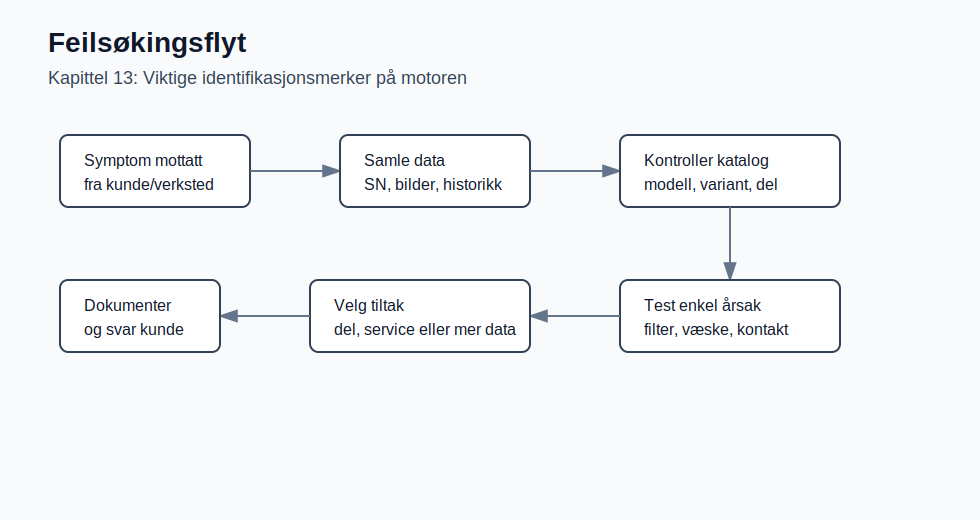

```mermaid
flowchart TD
    A[Symptom eller forespørsel mottatt] --> B[Samle serienummer, bilder og historikk]
    B --> C{Er motor og variant sikkert identifisert?}
    C -- Nei --> D[Be om mer dokumentasjon før del bekreftes]
    C -- Ja --> E[Kontroller delnummer og posisjon i katalog]
    E --> F{Stemmer symptom med foreslått del?}
    F -- Nei --> G[Foreslå feilsøking eller teknisk kontroll]
    F -- Ja --> H[Kontroller lager, pris og levering]
    H --> I[Send dokumentert kundesvar]
```

## Vedlikeholdsprosedyre
1. Avklar driftstimer, siste service og driftsmiljø.
2. Kontroller olje, filter, kjølevæske, sjøvannskrets, reimer, slanger og elektriske kontakter.
3. Sammenlign vedlikeholdsbehov med produsentens intervaller og faktisk bruk.
4. Anbefal servicekit når flere slitedeler bør skiftes samtidig.
5. Dokumenter hva som er anbefalt, hva kunden bestiller og eventuelle avvik fra normal prosedyre.

## Serienummeridentifikasjon
Serienummeridentifikasjon starter med å finne typeplate, motornummer eller annen unik identifikasjon. Be om bilde, ikke bare avskrift, fordi feil tegn, mellomrom og prefiks kan endre katalogoppslaget. Når serienummer ikke finnes, bygges identifikasjonen med modell, produksjonsår, bilder, tidligere fakturaer, servicehistorikk og delnummer fra monterte komponenter.

Minimumsdata bør være: fabrikat, modell, serienummer, eventuell product number/arrangement/CPL/motornummer, bilde av typeplate og bilde av motorens installasjon. Ved tvil skal saken stoppes for avklaring før del bekreftes.

## Reservedelsidentifikasjon
Reservedelsidentifikasjon skal bekrefte delnummer, posisjon, antall per motor, variant, side og eventuell erstatning. Dersom kunden oppgir et gammelt nummer, må det kontrolleres mot supersession. Dersom kunden bare sender bilde, skal bildet brukes som støtte, ikke som eneste grunnlag for bestilling.

Sjekk alltid om delnummeret gjelder enkeltkomponent, reparasjonssett, servicekit eller komplett enhet. Kontroller også om varen er høyre/venstre, gammel/ny type, standard/oversize eller knyttet til en bestemt produksjonsperiode.

## Bestillingsprosedyre
1. Opprett eller oppdater sak med kunde, fartøy, kontaktperson og tidsfrist.
2. Verifiser motoridentifikasjon og lagre bildedokumentasjon.
3. Finn korrekt delnummer i relevant katalog eller leverandørgrunnlag.
4. Kontroller supersession, antall, lagerstatus, pris, returvilkår og leveringstid.
5. Send ordrebekreftelse med delnummer, beskrivelse, antall, pris, levering og forbehold.
6. Følg opp leveransen til kunden har mottatt varen eller saken er lukket.

## Kvalitetspunkter før svar
- Har vi nok data til å gi et sikkert svar?
- Er delnummeret kontrollert mot riktig motorvariant?
- Er kundens tidsfrist realistisk med valgt fraktmåte?
- Er eventuelle forbehold skrevet tydelig?
- Kan en kollega forstå beslutningen ved å lese saken senere?

## Kapittelsammendrag
Hovedpoenget i kapittel 13 er at profesjonelt reservedelsarbeid krever struktur. Teknisk kunnskap, engelske fagtermer, praktisk feilsøking, dokumentasjon og kundedialog må henge sammen. Når medarbeideren jobber systematisk, reduseres feilbestillinger, kunden får bedre svar, og verkstedet kan planlegge arbeidet tryggere.

## Kryssreferanser
- For forrige tema, se kapittel 12: Hvordan lese og forstå motorserienummer.
- For neste tema, se kapittel 14: Forskjellen mellom motorfabrikat, modell og variant.
- For grunnleggende identifikasjon, se kapittel 12 og 17.
- For merkevise eksempler, se kapitlene 26-32.

## Fordypning for intern opplæring
Dette kapitlet skal brukes som arbeidsstandard, ikke bare som lesestoff. Når en ny medarbeider møter en sak om identifikasjonsmerker, skal vedkommende trene på å gå rolig fra fakta til vurdering og deretter til handling. I en marinemotorforhandler er konsekvensen av en feil ofte større enn verdien av selve delen. En feil impeller, feil sensor, feil filterinnsats eller feil pakningssett kan føre til tapt verkstedtid, utsatt avgang, irritert kunde og i verste fall ny driftsstans. Derfor skal hver sak behandles som en teknisk beslutning med sporbar dokumentasjon.

Profesjonelt nivå i dette kapitlet betyr at medarbeideren kan arbeide sikkert med identifikasjonsmerker. Før kunden får et bindende svar, skal opplysningene i saken kontrolleres mot motorens identitet, faktisk installasjon og relevant produsentterminologi. Det praktiske målet er ikke å finne et raskt nummer, men å kunne forklare hvorfor valgt del, kontrollpunkt eller kundesvar er riktig for akkurat denne motoren. Når informasjon mangler, skal medarbeideren beskrive hva som mangler, hvorfor det er nødvendig, og hvilket neste steg som bringer saken videre.

## Tekniske forklaringer
Teknisk forståelse i dette kapitlet skal bygges rundt typeplate, dataplate, gear plate, pumpeskilt, turboetikett og tidligere servicedokumentasjon. Medarbeideren må skille mellom synlig symptom, sannsynlig systemfeil og bestillbar komponent. En del kan se riktig ut på bilde, men likevel være feil dersom posisjon, variant, rating, kjøleroppsett, elektrisk plugg, monteringsside eller servicehistorikk ikke stemmer. Derfor skal teknisk vurdering alltid kobles til både funksjon og dokumentasjon: hva gjør komponenten, hvilket system påvirker den, og hvilken produsentkilde bekrefter at den passer.

I praksis betyr dette at tekniske data skal kobles til motorens faktiske installasjon. Marine motorer står ofte trangt, er utsatt for salt, vibrasjon, fukt og ujevnt belastningsmønster, og de kan være bygget om gjennom mange år. En motor kan ha original kjøler, ettermontert eksosbend, alternativ dynamo, endret filterbrakett eller annen sjøvannspumpe enn standard. Slike forhold gjør at delidentifikasjon må bygge på både produsentdata og synlig dokumentasjon fra motoren.

Produsentterminologi er en del av den tekniske forståelsen. Bruk uttrykk som Serial Number, Engine Number, Part Number, Service Kit, Exploded View, Supersession når de er relevante. Ikke oversett dem på en måte som fjerner presisjon. Skriv for eksempel «Engine Serial Number (ESN)» første gang og deretter «ESN» i saken dersom produsenten bruker dette. Skriv «Arrangement Number» når CAT-data krever det, «Product Number» når Volvo Penta bruker det, «CPL» når Cummins-konfigurasjon må kontrolleres, og «Model Code» når Yanmar-identifikasjon bygger på modellkode. Dette gjør dialogen med internasjonale leverandører mer presis.

## Illustrasjonsforslag
- Oversiktsdiagram som viser hvor identifikasjonsmerker passer inn i total arbeidsflyt fra kundeforespørsel til levert del.
- Nærbilde av typeplate/motorskilt med markering av serienummer, motornummer, modell og eventuell variantkode.
- Sprengskisse med markert posisjon, delnummer, antall per motor og mulige alternative versjoner.
- Feilsøkingsflyt med beslutningspunkter: mangler data, stemmer symptom, kreves mer teknisk kontroll, kan ordre bekreftes.
- Sammenligningsbilde av gammel og ny del der forskjell i tilkobling, side, lengde eller sensorplugg er markert.

## Virkelige verkstedseksempler
Eksempel 1: Et verksted står med en demontert komponent på benken og kunden venter på avklaring før fartøyet kan settes tilbake i drift. Verkstedet sender et nærbilde av delen, men ingen motorplate. En uerfaren medarbeider kan bli fristet til å søke på nummeret som står på støpegodset. En profesjonell medarbeider svarer at støpenummer ikke nødvendigvis er bestillbart delnummer, ber om bilde av typeplate, oversiktsbilde av motoren og bilde av monteringsstedet, og forklarer at dette hindrer feilbestilling. Når informasjonen kommer, kontrolleres delnummer mot sprengskisse, posisjon og antall. Først da gis pris og leveringstid.

Eksempel 2: En kunde ringer sent på dagen og sier at motoren har høy temperatur etter service. Kunden ønsker ny termostat. Medarbeideren skal ikke automatisk konkludere med termostatfeil. Spørsmålene bør avklare om impeller er byttet, om sjøvannsfilteret er rent, om kjølevæskenivået er riktig, om alarmen kommer ved tomgang eller belastning, og om det finnes lekkasje rundt varmeveksler eller slanger. Dersom kunden likevel vil bestille termostat, dokumenteres at feilsøking er anbefalt, og delnummer kontrolleres mot serienummer før ordre.

Eksempel 3: En intern selger mottar en gammel faktura med et delnummer som ikke lenger finnes. Riktig prosess er å kontrollere supersession, se om ny del krever tilhørende pakning, boltsett eller adapter, og notere både gammelt og nytt nummer i saken. Kunden skal få vite at delen er erstattet, hva som leveres, og om det finnes monteringsforbehold.

## Reservedelsidentifisering i praksis
Reservedelsidentifisering skal følge en fast rekkefølge. Først kontrolleres motorens identitet. Deretter kontrolleres delens system: drivstoff, luft, kjøling, smøring, eksos, elektrisk eller mekanisk kraftoverføring. Så kontrolleres posisjon i sprengskisse eller parts list. Til slutt kontrolleres antall, variant, supersession og leveringsstatus. Denne rekkefølgen hindrer at medarbeideren hopper direkte fra kundens ord til et tilfeldig delnummer.

Når en del har synlig nummer, må nummeret tolkes riktig. Mange komponenter har produksjonsnummer, støpenummer, leverandørnummer eller revisjonskode som ikke er det samme som bestillbart part number. Et filter kan ha nummer fra filterprodusent, men motorprodusentens parts catalogue kan bruke et annet nummer. En pumpe kan ha nummer på lokk, hus og komplett enhet. Spør derfor alltid: gjelder nummeret komplett del, reparasjonssett, underkomponent eller produsentens råkomponent?

## Serienummer og motornummer
Serienummer og motornummer er grunnlaget for korrekt katalogoppslag. Be kunden sende bilde av typeplate eller dataplate. Dersom kunden skriver nummeret manuelt, skal nummeret likevel kontrolleres mot bilde når det er mulig. Noter hele nummeret, inkludert prefiks, suffiks, bindestrek, mellomrom og eventuelle bokstaver. På enkelte produsenter kan små forskjeller peke til forskjellig produksjonsperiode, rating eller konfigurasjon.

Bruk motornummer sammen med modell, variant og applikasjon. En motor som driver generator kan ha andre deler enn en fremdriftsmotor. En motor i yrkesbåt kan ha annen rating enn samme motor i fritidsbåt. En eldre motor kan være bygget om med ny dynamo, annen sjøvannspumpe eller uoriginal filterbrakett. Dersom typeplate mangler, bygg identifikasjonen gjennom flere kilder: servicebok, tidligere faktura, bilder av motorens sider, nummer på pumpe, filter, turbo og gear, samt opplysninger om fartøy og produksjonsår.

## Feilsøking steg for steg
1. Definer symptomet med kundens egne ord og skriv det i saken. Skill mellom «kunden ønsker del» og «kunden beskriver feil».
2. Avklar når feilen oppstår: start, tomgang, belastning, marsjfart, varm motor, kald motor eller etter nylig service.
3. Kontroller grunnleggende forhold: væskenivå, filter, luft i drivstoff, sjøvannsstrøm, reimer, elektriske kontakter, sikringer og synlige lekkasjer.
4. Knytt symptomet til system: lav effekt peker ofte mot luft/drivstoff/eksos, høy temperatur mot kjøling, lavt oljetrykk mot smøring/sensor, startproblem mot batteri/starter/gløding/drivstoff.
5. Be om bilder eller måledata dersom symptomet ikke kan kobles sikkert til en del. Dette kan være bilde av alarmdisplay, trykkmåling, temperaturmåling eller bilde av montert komponent.
6. Kontroller relevant delnummer mot serienummer og variant. Dersom flere alternativer finnes, forklar kunden hva som skiller dem.
7. Dokumenter anbefalt tiltak, usikkerhet og eventuelle forbehold før ordre bekreftes.

## Vedlikehold
Vedlikehold skal vurderes mot driftstimer, produsentens maintenance schedule og faktisk driftsmiljø. Marine motorer som går korte turer, mye tomgang eller i salt miljø kan trenge hyppigere kontroll enn standard intervall antyder. Nye medarbeidere skal lære å spørre om siste service, hvilke filter som ble byttet, hvilken olje som ble brukt, om impeller er kontrollert, og om kjølevæske eller anoder er byttet etter plan.

En god vedlikeholdsanbefaling er konkret. I stedet for å skrive «ta service», bør medarbeideren foreslå relevante deler: olje- og drivstoffilter, luftfilter, impeller, reim, pakninger, anoder, kjølevæske og eventuelt servicekit. Dersom kunden har ukjent servicehistorikk, bør komplett servicekit vurderes. Dersom kunden har hatt overoppheting, bør sjøvannskrets og varmeveksler kontrolleres før bare én komponent byttes.

## Vanlige feil
- Serienummer leses feil fordi et tegn forveksles, for eksempel O/0 eller I/1.
- Kunden oppgir modellnavn, men ikke variant, rating eller applikasjon.
- Del velges ut fra bilde alene uten kontroll mot sprengskisse eller produsentkatalog.
- Supersession aksepteres uten å kontrollere om ny del krever tilbehør, pakning eller ombygging.
- Hastepress gjør at leveringsløfte gis før lagerstatus og fraktmulighet er bekreftet.
- Saksnotat mangler grunnlaget for beslutningen, slik at kollega ikke kan etterprøve valget.

## Kontrollspørsmål
- Hva er den viktigste tekniske risikoen i en sak som gjelder identifikasjonsmerker?
- Hvilke opplysninger må dokumenteres før bindende delnummer bekreftes?
- Hvordan forklarer du kunden hvorfor bilde av typeplate er nødvendig?
- Når bør du stoppe en ordre og be om mer dokumentasjon?
- Hvilke engelske produsentuttrykk bør du kunne bruke i denne typen sak?
- Hvordan dokumenterer du at et delnummer er erstattet av et nytt nummer?

## Praktisk sjekkliste for medarbeider
- Les saken som om en kollega skal overta den i morgen.
- Kontroller at motoridentifikasjon er dokumentert med bilde eller sikker kilde.
- Sjekk at delnummeret er knyttet til riktig posisjon i katalogen.
- Skriv tydelig om kunden har bedt om enkeltkomponent, servicekit eller komplett enhet.
- Noter om varen er spesialbestilling, utgått, erstattet eller ikke returbar.
- Send kundesvar med neste steg, ikke bare et løst delnummer.

## Kapittelspesifikk systemforståelse
For dette kapitlet er kjernen å forstå praktisk lokalisering av identifikasjonsmerker på motor og utstyr. Medarbeideren skal kunne forklare dette med praktiske ord til både kunde og kollega. Det betyr at teknisk teori må kobles til konkrete handlinger: hvilke data skal innhentes, hvilke komponenter kan være berørt, hvilken produsentterminologi skal brukes, og hva må dokumenteres før saken kan gå videre. Bilder av både nærbilde og oversikt gjør det enklere å tolke hvor opplysningen hører hjemme.

Når systemet vurderes, skal medarbeideren først plassere problemet i riktig teknisk sammenheng. Dersom kunden beskriver en alarm, må man finne ut om alarmen kommer fra reelt mekanisk avvik, elektrisk sensorfeil, feil etter service eller feil tolkning av instrumentet. Dersom kunden beskriver en del, må man avklare om kunden mener komplett enhet, servicekit, reparasjonssett eller enkeltkomponent. Dersom kunden beskriver motoren med vanlig navn, må man kontrollere om produsenten bruker mer presise begreper i katalogen.

## Komponentoversikt og arbeidsgrense
Relevante komponenter og opplysninger i dette kapitlet omfatter: motorskilt, innstansing, gearplate, pumpeplate, turboetikett, ECU-label og serviceetikett. Listen er ikke ment som en erstatning for produsentens parts catalogue, men som en praktisk påminnelse om hva nye medarbeidere skal tenke på før de søker del. I interne saker skal komponentnavn skrives så presist som mulig. Bruk for eksempel «sjøvannspumpe / raw water pump» i stedet for bare «pumpe» når funksjonen er kjent, og «varmeveksler / heat exchanger» i stedet for bare «kjøler» når det er den komponenten saken gjelder.

Arbeidsgrensen for en reservedelsmedarbeider er også viktig. Medarbeideren skal ikke overta mekanikerens ansvar for demontering, måling eller diagnose på motoren, men skal kunne stille riktige spørsmål og foreslå riktig dokumentasjon. Når en sak går fra enkel delidentifikasjon til teknisk diagnose, skal dette markeres i saken. Da kan verksted, teknisk ansvarlig eller leverandør involveres med et klart spørsmål og et ryddig faktagrunnlag.

## Praktisk beslutningsregel
Bruk denne regelen i alle saker knyttet til kapitlet: Hvis motoridentifikasjon, komponentposisjon eller symptom ikke er sikkert nok dokumentert, skal medarbeideren ikke gi bindende delbekreftelse. Kunden kan få et foreløpig svar, men svaret må inneholde hva som mangler, hvorfor det mangler, og hva som skjer når informasjonen er mottatt. Dette er ikke treg service; det er profesjonell risikokontroll.

## Målrettet fordypning kapittel 11-20
### Fysiske identifikasjonsmerker og bildekrav
Identifikasjonsmerker finnes ikke alltid på samme sted. En motor kan ha dataplate på ventilkåpe, blokkside, gearhus, svinghjulshus eller nær styreboks. Gear, drev, generator, sjøvannspumpe, turbo og injeksjonspumpe kan ha egne plater som ikke erstatter motorens typeplate. Medarbeideren må derfor lære kunden å sende to typer bilder: nærbilde som viser teksten tydelig, og oversiktsbilde som viser hvor på motoren bildet er tatt.

Typiske feil oppstår når kunden sender bilde av et komponentnummer og tror det er motorens serienummer. Et pumpenummer kan være leverandørens produksjonsnummer, ikke motorprodusentens bestillbare part number. Et støpenummer på et hus kan dekke flere komplette enheter. Ved uklare bilder skal medarbeideren be om nytt bilde med lys, rett vinkel og uten refleks. Det er profesjonelt å gi konkrete fotoinstruksjoner, for eksempel: ta ett bilde av hele motorens styrbord side, ett av babord side og ett nærbilde av platen.

### Praktisk anvendelse i opplæring
Instruktør bør bruke dette kapitlet med en konkret case der deltakerne først må identifisere manglende opplysninger, deretter velge riktig kataloggrunnlag og til slutt skrive et kort kundesvar. Deltakeren skal forklare hvilke produsentdata som er nødvendige, hvilke komponenter som kan være involvert, og hvor grensen går mellom reservedelsidentifisering og mekanisk diagnose. Målet er at medarbeideren ikke bare husker begreper, men kan bruke dem under tidspress i en reell kundesak.

## Realistisk opplæring i praksis
### Verkstedhistorie
En typisk sak i dette temaet starter med skilt på gear forveksles med motorskilt. Verkstedet trenger et raskt svar, men den erfarne medarbeideren stopper opp og spør først: hva vet vi sikkert, hva antar vi, og hva kan gi følgeskade hvis vi tar feil? I praksis betyr det at plassering av merker må kobles til bilde, serienummer, komponentposisjon og kundens symptom før saken lukkes. Historien skal brukes i opplæring som en øvelse i å skrive et kort saksnotat: observasjon, vurdering, neste handling og forbehold.

### Kundehistorie
Kunden beskriver ofte problemet med driftsspråk: «motoren går tungt», «alarm kommer etter ti minutter», «jeg trenger den samme delen som sist» eller «båten skal ut i morgen». En profesjonell respons er rolig og konkret: bekreft behovet, forklar hvorfor identifikasjon trengs, be om riktig dokumentasjon og gi et realistisk tidspunkt for neste svar. Ikke korriger kunden unødvendig; oversett kundens språk til teknisk språk i saken.

### Typiske feil nye ansatte gjør
- søker på første synlige nummer uten å avklare om det er støpenummer, leverandørnummer eller bestillbart part number.
- lover levering før lagerstatus, frakt og returvilkår er kontrollert.
- antar at tidligere faktura alltid gjelder samme motorvariant.
- blander symptom og årsak, spesielt ved varme, lav effekt, startproblem og alarm.
- skriver for korte notater slik at kollega ikke kan forstå hvorfor valget ble tatt.

### Tips fra erfarne mekanikere og reservedelsselgere
- Se alltid etter systemet rundt delen: slanger, braketter, sensorer, reimer, kjølere og tilkoblinger forteller ofte mer enn delen alene.
- Still ett presist spørsmål om gangen når kunden er stresset; mange dårlige svar kommer av for lange spørsmålslister.
- Sammenlign gammel og ny del mot funksjon, ikke bare form. Riktig del skal passe, men også løse riktig problem.
- En erfaren reservedelsselger tenker i risiko: Hva er billigst å avklare nå, og hva blir dyrt hvis vi hopper over det?

### Vanlige kundespørsmål
| Spørsmål fra kunde | Profesjonelt svar |
|---|---|
| «Kan du bare sende samme del som sist?» | «Ja, hvis vi først bekrefter at det gjelder samme motor, samme posisjon og ingen supersession siden sist.» |
| «Holder det med bilde?» | «Bilde hjelper, men vi trenger også motoridentitet for å sikre variant og delnummer.» |
| «Hvorfor tar dette tid?» | «Fordi feil del kan gi ny driftsstans. Vi kontrollerer grunnlaget før vi lover levering.» |

### Beslutningstre for saken
| Trinn | Spørsmål | Handling |
|---|---|---|
| 1 | Er motoridentitet dokumentert med bilde eller sikker historikk? | Hvis nei: be om typeplate/dataplate eller alternativ dokumentasjon. |
| 2 | Er komponentens funksjon og posisjon kjent? | Hvis nei: be om oversiktsbilde og bilde av monteringssted. |
| 3 | Stemmer kundens symptom med delen som ønskes? | Hvis nei: anbefal feilsøking før del bestilles. |
| 4 | Finnes det supersession, kit eller variantvalg? | Kontroller produsentkilde og skriv forbehold i saken. |
| 5 | Kan pris, levering og returvilkår bekreftes? | Send dokumentert svar med neste steg og tydelig gyldighet. |

### Rask oppslagstabell
| Situasjon | Kontroller først | Vanlig fallgruve |
|---|---|---|
| Hasteordre | sikker motor-ID, lager, fraktfrist | levering loves før teknisk kontroll |
| Del fra bilde | posisjon, skala, tilkoblinger, nummer | bilde brukes som eneste beslutningsgrunnlag |
| Gammelt delnummer | supersession og kitinnhold | ny del krever ekstra pakning eller adapter |
| Uklart symptom | driftssituasjon, alarm, siste service | symptom blir tolket som sikker komponentfeil |

### Praktisk sjekkliste og inspeksjonsrutine
- Start med motoridentitet: fabrikat, modell, serienummer, variant, applikasjon og bilde av skilt.
- Kontroller området rundt komponenten: lekkasje, korrosjon, knekte fester, slitasje, varmemerker og uoriginale endringer.
- Spør om siste vedlikehold: olje, filter, impeller, reimer, kjølevæske, anoder og drivstoffilter.
- Noter driftstype: fritidsbruk, yrkesbruk, generator, fremdrift, tomgangsdrift eller langvarig høy belastning.
- Avklar om saken gjelder akutt drift, planlagt service, reklamasjon eller lagerpåfyll.

### Generelle vedlikeholdsintervaller som opplæringspunkt
| Kontrollpunkt | Typisk vurdering i opplæring | Må verifiseres |
|---|---|---|
| Olje og oljefilter | ofte basert på timer og kalender | produsentens maintenance schedule |
| Drivstoffilter/vannutskiller | hyppigere ved dårlig drivstoff eller sesongstart | motor- og filterspesifikasjon |
| Impeller og sjøvannskrets | kontrolleres særlig før sesong og etter varmgang | produsentens intervall og installasjon |
| Reimer, slanger og klemmer | visuell kontroll ved service og feilsøking | dimensjon, stramming og delnummer |

### Produsentverifikasjon
Alle konkrete delnumre, momentverdier, serviceintervaller, garantikrav, programvaredata og produsentspesifikke grenser skal kontrolleres mot offisiell produsentdokumentasjon før de brukes i tilbud, ordre eller verkstedinstruks. Marker tydelig i saken når svaret bygger på antakelse, eldre historikk, bilde uten motor-ID eller generell erfaring. Intervaller i tabellen er generelle opplæringspunkter. Faktiske intervaller styres av produsent, motorvariant, driftstimer, kalenderkrav, belastning og miljø.

## Produsentverifikasjon og faglig forbehold
Når saken gjelder delnummer, serienummer, serviceintervall, momentdata, garanti, elektronikk eller kompatibilitet, skal opplysningen verifiseres mot produsentens dokumentasjon eller autorisert leverandør før bindende tilbud eller teknisk konklusjon gis. Manualen beskriver arbeidsmetode og risikopunkter; den erstatter ikke gjeldende parts catalogue, service manual, service bulletin eller produsentportal. Marker saken internt dersom opplysningen bygger på antakelse, eldre historikk eller bilde uten bekreftet motoridentitet.

## Quiz med fasit
1. Hvilke tekniske data bør alltid samles før en del bekreftes?
2. Hvorfor er engelsk terminologi viktig i marine reservedeler?
3. Hva bør gjøres dersom kunden bare sender et bilde av delen?
4. Hvilke punkter bør kontrolleres før ordrebekreftelse sendes?
5. Hvorfor skal feilsøking dokumenteres, selv når kunden allerede ber om en bestemt del?

### Svar
1. Fabrikat, modell, serienummer, variantdata, bilde av typeplate, delnummer, posisjon og kundens symptombeskrivelse.
2. Fordi kataloger, portaler, servicemanualer og leverandørdialog ofte bruker engelske begreper som må forstås presist.
3. Be om serienummer, oversiktsbilde av motoren og eventuelle nummer på delen; bildet brukes som støtte, ikke eneste grunnlag.
4. Delnummer, antall, variant, pris, lagerstatus, leveringstid, frakt, returvilkår og eventuelle forbehold.
5. Fordi symptomet kan ha flere årsaker, og dokumentasjon viser hvorfor anbefalingen ble gitt.

---

# Kapittel 14: Forskjellen mellom motorfabrikat, modell og variant

## Kapittelrolle
Dette kapitlet gir en grundig praktisk innføring i modell og variant. Temaet er viktig fordi reservedelsarbeid i marine miljøer kombinerer teknisk forståelse, presis kundedialog, dokumentert saksbehandling og realistisk leveranseoppfølging. Målet er at en ny medarbeider skal kunne bruke kunnskapen direkte i arbeid med verksted, kunde, lager og leverandør.

## Læringsmål
Etter kapitlet skal deltakeren kunne:
- forklare hovedbegrepene innen modell og variant
- bruke serienummer, modellinformasjon og delnummer i praktisk reservedelsarbeid
- kommunisere trygt med kunde, verksted, lager og leverandør
- dokumentere beslutninger slik at andre kan etterprøve saken
- kjenne igjen vanlige feil og velge riktig neste handling

## English technical terminology
- **Serial Number:** engelsk fagterm som ofte brukes i kataloger, servicelitteratur, leverandørportaler og internasjonal kundedialog.
- **Part Number:** engelsk fagterm som ofte brukes i kataloger, servicelitteratur, leverandørportaler og internasjonal kundedialog.
- **Engine Model:** engelsk fagterm som ofte brukes i kataloger, servicelitteratur, leverandørportaler og internasjonal kundedialog.
- **Variant:** engelsk fagterm som ofte brukes i kataloger, servicelitteratur, leverandørportaler og internasjonal kundedialog.
- **Service Kit:** engelsk fagterm som ofte brukes i kataloger, servicelitteratur, leverandørportaler og internasjonal kundedialog.
- **Troubleshooting:** engelsk fagterm som ofte brukes i kataloger, servicelitteratur, leverandørportaler og internasjonal kundedialog.
- **Maintenance:** engelsk fagterm som ofte brukes i kataloger, servicelitteratur, leverandørportaler og internasjonal kundedialog.
- **Ordering Procedure:** engelsk fagterm som ofte brukes i kataloger, servicelitteratur, leverandørportaler og internasjonal kundedialog.
- **Supersession:** engelsk fagterm som ofte brukes i kataloger, servicelitteratur, leverandørportaler og internasjonal kundedialog.
- **Technical Support:** engelsk fagterm som ofte brukes i kataloger, servicelitteratur, leverandørportaler og internasjonal kundedialog.

## Hoveddiagram

## Tekniske systemillustrasjoner

## Grundig forklaring
Hvordan fabrikat, modell, variant, rating og applikasjon skilles må forstås både teknisk og praktisk. I marine reservedeler er det sjelden nok å vite hva kunden kaller delen. Medarbeideren må forstå hvilken funksjon delen har, hvor den sitter, hvilken motorvariant den tilhører, og hva som skjer dersom feil del bestilles. Derfor skal tekniske data, kundens beskrivelse og dokumentert katalogoppslag alltid vurderes sammen.

En god sak har fire kjennetegn: den har tydelig identifikasjon, tydelig problem- eller delbeskrivelse, tydelig beslutningsgrunnlag og tydelig oppfølging. Dersom ett av disse punktene mangler, skal saken markeres som usikker før kunden får et bindende svar.

## Praktisk verkstedeksempel
Et verksted står med demontert komponent og trenger rask avklaring. Medarbeideren registrerer kunde, fartøy, motorinformasjon og tidsfrist, ber om bilder av typeplate og komponent, sjekker katalog og lager, og sender et kort skriftlig svar med valgt del, grunnlag for valget og neste oppdateringstidspunkt.

## Kundesupporteksempel
Kunde: 'Motoren går dårlig, kan dere sende riktig del?' Profesjonelt svar: 'Vi kan hjelpe, men først må vi skille mellom symptom og delbehov. Send serienummer, bilde av motorplate, bilde av området feilen gjelder og en kort beskrivelse av når feilen oppstår. Da kan vi foreslå riktig del eller riktig neste feilsøkingstrinn.'

## Vanlige feil og årsaker
- feil eller ufullstendig serienummer.
- delnummer som er erstattet uten at saken dokumenteres.
- symptom som tolkes som delbehov uten feilsøking.
- kunde har bilde av lignende del, men ikke korrekt motorvariant.
- manglende avklaring av antall, side, posisjon eller leveringstid.

## Feilsøkingsflyt
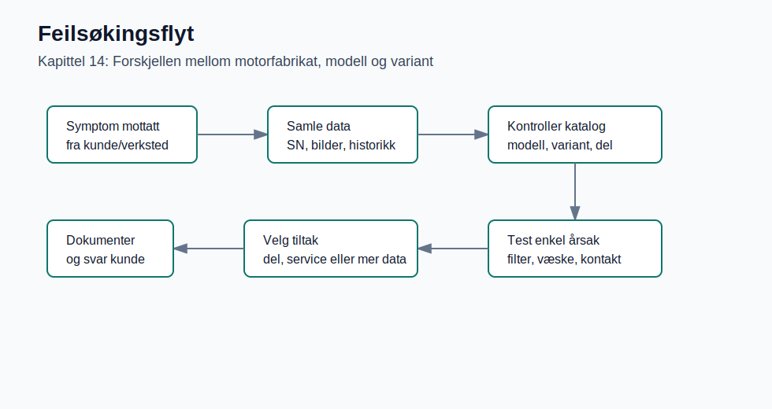

```mermaid
flowchart TD
    A[Symptom eller forespørsel mottatt] --> B[Samle serienummer, bilder og historikk]
    B --> C{Er motor og variant sikkert identifisert?}
    C -- Nei --> D[Be om mer dokumentasjon før del bekreftes]
    C -- Ja --> E[Kontroller delnummer og posisjon i katalog]
    E --> F{Stemmer symptom med foreslått del?}
    F -- Nei --> G[Foreslå feilsøking eller teknisk kontroll]
    F -- Ja --> H[Kontroller lager, pris og levering]
    H --> I[Send dokumentert kundesvar]
```

## Vedlikeholdsprosedyre
1. Avklar driftstimer, siste service og driftsmiljø.
2. Kontroller olje, filter, kjølevæske, sjøvannskrets, reimer, slanger og elektriske kontakter.
3. Sammenlign vedlikeholdsbehov med produsentens intervaller og faktisk bruk.
4. Anbefal servicekit når flere slitedeler bør skiftes samtidig.
5. Dokumenter hva som er anbefalt, hva kunden bestiller og eventuelle avvik fra normal prosedyre.

## Serienummeridentifikasjon
Serienummeridentifikasjon starter med å finne typeplate, motornummer eller annen unik identifikasjon. Be om bilde, ikke bare avskrift, fordi feil tegn, mellomrom og prefiks kan endre katalogoppslaget. Når serienummer ikke finnes, bygges identifikasjonen med modell, produksjonsår, bilder, tidligere fakturaer, servicehistorikk og delnummer fra monterte komponenter.

Minimumsdata bør være: fabrikat, modell, serienummer, eventuell product number/arrangement/CPL/motornummer, bilde av typeplate og bilde av motorens installasjon. Ved tvil skal saken stoppes for avklaring før del bekreftes.

## Reservedelsidentifikasjon
Reservedelsidentifikasjon skal bekrefte delnummer, posisjon, antall per motor, variant, side og eventuell erstatning. Dersom kunden oppgir et gammelt nummer, må det kontrolleres mot supersession. Dersom kunden bare sender bilde, skal bildet brukes som støtte, ikke som eneste grunnlag for bestilling.

Sjekk alltid om delnummeret gjelder enkeltkomponent, reparasjonssett, servicekit eller komplett enhet. Kontroller også om varen er høyre/venstre, gammel/ny type, standard/oversize eller knyttet til en bestemt produksjonsperiode.

## Bestillingsprosedyre
1. Opprett eller oppdater sak med kunde, fartøy, kontaktperson og tidsfrist.
2. Verifiser motoridentifikasjon og lagre bildedokumentasjon.
3. Finn korrekt delnummer i relevant katalog eller leverandørgrunnlag.
4. Kontroller supersession, antall, lagerstatus, pris, returvilkår og leveringstid.
5. Send ordrebekreftelse med delnummer, beskrivelse, antall, pris, levering og forbehold.
6. Følg opp leveransen til kunden har mottatt varen eller saken er lukket.

## Kvalitetspunkter før svar
- Har vi nok data til å gi et sikkert svar?
- Er delnummeret kontrollert mot riktig motorvariant?
- Er kundens tidsfrist realistisk med valgt fraktmåte?
- Er eventuelle forbehold skrevet tydelig?
- Kan en kollega forstå beslutningen ved å lese saken senere?

## Kapittelsammendrag
Hovedpoenget i kapittel 14 er at profesjonelt reservedelsarbeid krever struktur. Teknisk kunnskap, engelske fagtermer, praktisk feilsøking, dokumentasjon og kundedialog må henge sammen. Når medarbeideren jobber systematisk, reduseres feilbestillinger, kunden får bedre svar, og verkstedet kan planlegge arbeidet tryggere.

## Kryssreferanser
- For forrige tema, se kapittel 13: Viktige identifikasjonsmerker på motoren.
- For neste tema, se kapittel 15: Hvordan koble serienummer til riktig reservedelsdatabase.
- For grunnleggende identifikasjon, se kapittel 12 og 17.
- For merkevise eksempler, se kapitlene 26-32.

## Fordypning for intern opplæring
Dette kapitlet skal brukes som arbeidsstandard, ikke bare som lesestoff. Når en ny medarbeider møter en sak om fabrikat, modell og variant, skal vedkommende trene på å gå rolig fra fakta til vurdering og deretter til handling. I en marinemotorforhandler er konsekvensen av en feil ofte større enn verdien av selve delen. En feil impeller, feil sensor, feil filterinnsats eller feil pakningssett kan føre til tapt verkstedtid, utsatt avgang, irritert kunde og i verste fall ny driftsstans. Derfor skal hver sak behandles som en teknisk beslutning med sporbar dokumentasjon.

Profesjonelt nivå i dette kapitlet betyr at medarbeideren kan arbeide sikkert med modell og variant. Før kunden får et bindende svar, skal opplysningene i saken kontrolleres mot motorens identitet, faktisk installasjon og relevant produsentterminologi. Det praktiske målet er ikke å finne et raskt nummer, men å kunne forklare hvorfor valgt del, kontrollpunkt eller kundesvar er riktig for akkurat denne motoren. Når informasjon mangler, skal medarbeideren beskrive hva som mangler, hvorfor det er nødvendig, og hvilket neste steg som bringer saken videre.

## Tekniske forklaringer
Teknisk forståelse i dette kapitlet skal bygges rundt fabrikat, engine model, rating, application, arrangement og mariniseringsvariant. Medarbeideren må skille mellom synlig symptom, sannsynlig systemfeil og bestillbar komponent. En del kan se riktig ut på bilde, men likevel være feil dersom posisjon, variant, rating, kjøleroppsett, elektrisk plugg, monteringsside eller servicehistorikk ikke stemmer. Derfor skal teknisk vurdering alltid kobles til både funksjon og dokumentasjon: hva gjør komponenten, hvilket system påvirker den, og hvilken produsentkilde bekrefter at den passer.

I praksis betyr dette at tekniske data skal kobles til motorens faktiske installasjon. Marine motorer står ofte trangt, er utsatt for salt, vibrasjon, fukt og ujevnt belastningsmønster, og de kan være bygget om gjennom mange år. En motor kan ha original kjøler, ettermontert eksosbend, alternativ dynamo, endret filterbrakett eller annen sjøvannspumpe enn standard. Slike forhold gjør at delidentifikasjon må bygge på både produsentdata og synlig dokumentasjon fra motoren.

Produsentterminologi er en del av den tekniske forståelsen. Bruk uttrykk som Serial Number, Engine Number, Part Number, Service Kit, Exploded View, Supersession når de er relevante. Ikke oversett dem på en måte som fjerner presisjon. Skriv for eksempel «Engine Serial Number (ESN)» første gang og deretter «ESN» i saken dersom produsenten bruker dette. Skriv «Arrangement Number» når CAT-data krever det, «Product Number» når Volvo Penta bruker det, «CPL» når Cummins-konfigurasjon må kontrolleres, og «Model Code» når Yanmar-identifikasjon bygger på modellkode. Dette gjør dialogen med internasjonale leverandører mer presis.

## Illustrasjonsforslag
- Oversiktsdiagram som viser hvor fabrikat, modell og variant passer inn i total arbeidsflyt fra kundeforespørsel til levert del.
- Nærbilde av typeplate/motorskilt med markering av serienummer, motornummer, modell og eventuell variantkode.
- Sprengskisse med markert posisjon, delnummer, antall per motor og mulige alternative versjoner.
- Feilsøkingsflyt med beslutningspunkter: mangler data, stemmer symptom, kreves mer teknisk kontroll, kan ordre bekreftes.
- Sammenligningsbilde av gammel og ny del der forskjell i tilkobling, side, lengde eller sensorplugg er markert.

## Virkelige verkstedseksempler
Eksempel 1: Et verksted står med en demontert komponent på benken og kunden venter på avklaring før fartøyet kan settes tilbake i drift. Verkstedet sender et nærbilde av delen, men ingen motorplate. En uerfaren medarbeider kan bli fristet til å søke på nummeret som står på støpegodset. En profesjonell medarbeider svarer at støpenummer ikke nødvendigvis er bestillbart delnummer, ber om bilde av typeplate, oversiktsbilde av motoren og bilde av monteringsstedet, og forklarer at dette hindrer feilbestilling. Når informasjonen kommer, kontrolleres delnummer mot sprengskisse, posisjon og antall. Først da gis pris og leveringstid.

Eksempel 2: En kunde ringer sent på dagen og sier at motoren har høy temperatur etter service. Kunden ønsker ny termostat. Medarbeideren skal ikke automatisk konkludere med termostatfeil. Spørsmålene bør avklare om impeller er byttet, om sjøvannsfilteret er rent, om kjølevæskenivået er riktig, om alarmen kommer ved tomgang eller belastning, og om det finnes lekkasje rundt varmeveksler eller slanger. Dersom kunden likevel vil bestille termostat, dokumenteres at feilsøking er anbefalt, og delnummer kontrolleres mot serienummer før ordre.

Eksempel 3: En intern selger mottar en gammel faktura med et delnummer som ikke lenger finnes. Riktig prosess er å kontrollere supersession, se om ny del krever tilhørende pakning, boltsett eller adapter, og notere både gammelt og nytt nummer i saken. Kunden skal få vite at delen er erstattet, hva som leveres, og om det finnes monteringsforbehold.

## Reservedelsidentifisering i praksis
Reservedelsidentifisering skal følge en fast rekkefølge. Først kontrolleres motorens identitet. Deretter kontrolleres delens system: drivstoff, luft, kjøling, smøring, eksos, elektrisk eller mekanisk kraftoverføring. Så kontrolleres posisjon i sprengskisse eller parts list. Til slutt kontrolleres antall, variant, supersession og leveringsstatus. Denne rekkefølgen hindrer at medarbeideren hopper direkte fra kundens ord til et tilfeldig delnummer.

Når en del har synlig nummer, må nummeret tolkes riktig. Mange komponenter har produksjonsnummer, støpenummer, leverandørnummer eller revisjonskode som ikke er det samme som bestillbart part number. Et filter kan ha nummer fra filterprodusent, men motorprodusentens parts catalogue kan bruke et annet nummer. En pumpe kan ha nummer på lokk, hus og komplett enhet. Spør derfor alltid: gjelder nummeret komplett del, reparasjonssett, underkomponent eller produsentens råkomponent?

## Serienummer og motornummer
Serienummer og motornummer er grunnlaget for korrekt katalogoppslag. Be kunden sende bilde av typeplate eller dataplate. Dersom kunden skriver nummeret manuelt, skal nummeret likevel kontrolleres mot bilde når det er mulig. Noter hele nummeret, inkludert prefiks, suffiks, bindestrek, mellomrom og eventuelle bokstaver. På enkelte produsenter kan små forskjeller peke til forskjellig produksjonsperiode, rating eller konfigurasjon.

Bruk motornummer sammen med modell, variant og applikasjon. En motor som driver generator kan ha andre deler enn en fremdriftsmotor. En motor i yrkesbåt kan ha annen rating enn samme motor i fritidsbåt. En eldre motor kan være bygget om med ny dynamo, annen sjøvannspumpe eller uoriginal filterbrakett. Dersom typeplate mangler, bygg identifikasjonen gjennom flere kilder: servicebok, tidligere faktura, bilder av motorens sider, nummer på pumpe, filter, turbo og gear, samt opplysninger om fartøy og produksjonsår.

## Feilsøking steg for steg
1. Definer symptomet med kundens egne ord og skriv det i saken. Skill mellom «kunden ønsker del» og «kunden beskriver feil».
2. Avklar når feilen oppstår: start, tomgang, belastning, marsjfart, varm motor, kald motor eller etter nylig service.
3. Kontroller grunnleggende forhold: væskenivå, filter, luft i drivstoff, sjøvannsstrøm, reimer, elektriske kontakter, sikringer og synlige lekkasjer.
4. Knytt symptomet til system: lav effekt peker ofte mot luft/drivstoff/eksos, høy temperatur mot kjøling, lavt oljetrykk mot smøring/sensor, startproblem mot batteri/starter/gløding/drivstoff.
5. Be om bilder eller måledata dersom symptomet ikke kan kobles sikkert til en del. Dette kan være bilde av alarmdisplay, trykkmåling, temperaturmåling eller bilde av montert komponent.
6. Kontroller relevant delnummer mot serienummer og variant. Dersom flere alternativer finnes, forklar kunden hva som skiller dem.
7. Dokumenter anbefalt tiltak, usikkerhet og eventuelle forbehold før ordre bekreftes.

## Vedlikehold
Vedlikehold skal vurderes mot driftstimer, produsentens maintenance schedule og faktisk driftsmiljø. Marine motorer som går korte turer, mye tomgang eller i salt miljø kan trenge hyppigere kontroll enn standard intervall antyder. Nye medarbeidere skal lære å spørre om siste service, hvilke filter som ble byttet, hvilken olje som ble brukt, om impeller er kontrollert, og om kjølevæske eller anoder er byttet etter plan.

En god vedlikeholdsanbefaling er konkret. I stedet for å skrive «ta service», bør medarbeideren foreslå relevante deler: olje- og drivstoffilter, luftfilter, impeller, reim, pakninger, anoder, kjølevæske og eventuelt servicekit. Dersom kunden har ukjent servicehistorikk, bør komplett servicekit vurderes. Dersom kunden har hatt overoppheting, bør sjøvannskrets og varmeveksler kontrolleres før bare én komponent byttes.

## Vanlige feil
- Serienummer leses feil fordi et tegn forveksles, for eksempel O/0 eller I/1.
- Kunden oppgir modellnavn, men ikke variant, rating eller applikasjon.
- Del velges ut fra bilde alene uten kontroll mot sprengskisse eller produsentkatalog.
- Supersession aksepteres uten å kontrollere om ny del krever tilbehør, pakning eller ombygging.
- Hastepress gjør at leveringsløfte gis før lagerstatus og fraktmulighet er bekreftet.
- Saksnotat mangler grunnlaget for beslutningen, slik at kollega ikke kan etterprøve valget.

## Kontrollspørsmål
- Hva er den viktigste tekniske risikoen i en sak som gjelder fabrikat, modell og variant?
- Hvilke opplysninger må dokumenteres før bindende delnummer bekreftes?
- Hvordan forklarer du kunden hvorfor bilde av typeplate er nødvendig?
- Når bør du stoppe en ordre og be om mer dokumentasjon?
- Hvilke engelske produsentuttrykk bør du kunne bruke i denne typen sak?
- Hvordan dokumenterer du at et delnummer er erstattet av et nytt nummer?

## Praktisk sjekkliste for medarbeider
- Les saken som om en kollega skal overta den i morgen.
- Kontroller at motoridentifikasjon er dokumentert med bilde eller sikker kilde.
- Sjekk at delnummeret er knyttet til riktig posisjon i katalogen.
- Skriv tydelig om kunden har bedt om enkeltkomponent, servicekit eller komplett enhet.
- Noter om varen er spesialbestilling, utgått, erstattet eller ikke returbar.
- Send kundesvar med neste steg, ikke bare et løst delnummer.

## Kapittelspesifikk systemforståelse
For dette kapitlet er kjernen å forstå forskjellen mellom fabrikat, modell, variant, rating og applikasjon. Medarbeideren skal kunne forklare dette med praktiske ord til både kunde og kollega. Det betyr at teknisk teori må kobles til konkrete handlinger: hvilke data skal innhentes, hvilke komponenter kan være berørt, hvilken produsentterminologi skal brukes, og hva må dokumenteres før saken kan gå videre. Samme modellnavn er ikke nok når produsenten har flere varianter over tid.

Når systemet vurderes, skal medarbeideren først plassere problemet i riktig teknisk sammenheng. Dersom kunden beskriver en alarm, må man finne ut om alarmen kommer fra reelt mekanisk avvik, elektrisk sensorfeil, feil etter service eller feil tolkning av instrumentet. Dersom kunden beskriver en del, må man avklare om kunden mener komplett enhet, servicekit, reparasjonssett eller enkeltkomponent. Dersom kunden beskriver motoren med vanlig navn, må man kontrollere om produsenten bruker mer presise begreper i katalogen.

## Komponentoversikt og arbeidsgrense
Relevante komponenter og opplysninger i dette kapitlet omfatter: fabrikatnavn, motorserie, effektklasse, utslippsnivå, gear, generatoroppsett og installasjon. Listen er ikke ment som en erstatning for produsentens parts catalogue, men som en praktisk påminnelse om hva nye medarbeidere skal tenke på før de søker del. I interne saker skal komponentnavn skrives så presist som mulig. Bruk for eksempel «sjøvannspumpe / raw water pump» i stedet for bare «pumpe» når funksjonen er kjent, og «varmeveksler / heat exchanger» i stedet for bare «kjøler» når det er den komponenten saken gjelder.

Arbeidsgrensen for en reservedelsmedarbeider er også viktig. Medarbeideren skal ikke overta mekanikerens ansvar for demontering, måling eller diagnose på motoren, men skal kunne stille riktige spørsmål og foreslå riktig dokumentasjon. Når en sak går fra enkel delidentifikasjon til teknisk diagnose, skal dette markeres i saken. Da kan verksted, teknisk ansvarlig eller leverandør involveres med et klart spørsmål og et ryddig faktagrunnlag.

## Praktisk beslutningsregel
Bruk denne regelen i alle saker knyttet til kapitlet: Hvis motoridentifikasjon, komponentposisjon eller symptom ikke er sikkert nok dokumentert, skal medarbeideren ikke gi bindende delbekreftelse. Kunden kan få et foreløpig svar, men svaret må inneholde hva som mangler, hvorfor det mangler, og hva som skjer når informasjonen er mottatt. Dette er ikke treg service; det er profesjonell risikokontroll.

## Målrettet fordypning kapittel 11-20
### Modell, variant, rating og applikasjon i praksis
Fabrikat forteller hvem som står bak motoren, modell forteller motorfamilie, variant forteller hvilken teknisk utførelse motoren har, og applikasjon forteller hvordan motoren brukes. En Scania-motor i generatorapplikasjon kan ha andre komponenter enn samme motorfamilie i fremdrift. En MAN-motor med annen rating kan ha annen turbo, kjøler eller elektronikk. En Volvo Penta-motor kan kreve at både motor og drev/gear identifiseres.

Medarbeideren skal derfor ikke godta modellnavn alene som sikkert grunnlag for bestilling. Spør etter serienummer, motornummer, product number, arrangement number, CPL, rating eller application der produsenten bruker dette. I kundedialog kan dette forklares enkelt: «Samme modellnavn kan finnes i flere utførelser. Nummeret på typeplaten forteller hvilken utførelse din motor har.» Denne forklaringen gjør det lettere å få kunden til å sende nødvendig dokumentasjon.

### Praktisk anvendelse i opplæring
Instruktør bør bruke dette kapitlet med en konkret case der deltakerne først må identifisere manglende opplysninger, deretter velge riktig kataloggrunnlag og til slutt skrive et kort kundesvar. Deltakeren skal forklare hvilke produsentdata som er nødvendige, hvilke komponenter som kan være involvert, og hvor grensen går mellom reservedelsidentifisering og mekanisk diagnose. Målet er at medarbeideren ikke bare husker begreper, men kan bruke dem under tidspress i en reell kundesak.

## Realistisk opplæring i praksis
### Verkstedhistorie
En typisk sak i dette temaet starter med samme modell finnes i to ratings. Verkstedet trenger et raskt svar, men den erfarne medarbeideren stopper opp og spør først: hva vet vi sikkert, hva antar vi, og hva kan gi følgeskade hvis vi tar feil? I praksis betyr det at fabrikat, modell, variant og applikasjon må kobles til bilde, serienummer, komponentposisjon og kundens symptom før saken lukkes. Historien skal brukes i opplæring som en øvelse i å skrive et kort saksnotat: observasjon, vurdering, neste handling og forbehold.

### Kundehistorie
Kunden beskriver ofte problemet med driftsspråk: «motoren går tungt», «alarm kommer etter ti minutter», «jeg trenger den samme delen som sist» eller «båten skal ut i morgen». En profesjonell respons er rolig og konkret: bekreft behovet, forklar hvorfor identifikasjon trengs, be om riktig dokumentasjon og gi et realistisk tidspunkt for neste svar. Ikke korriger kunden unødvendig; oversett kundens språk til teknisk språk i saken.

### Typiske feil nye ansatte gjør
- søker på første synlige nummer uten å avklare om det er støpenummer, leverandørnummer eller bestillbart part number.
- lover levering før lagerstatus, frakt og returvilkår er kontrollert.
- antar at tidligere faktura alltid gjelder samme motorvariant.
- blander symptom og årsak, spesielt ved varme, lav effekt, startproblem og alarm.
- skriver for korte notater slik at kollega ikke kan forstå hvorfor valget ble tatt.

### Tips fra erfarne mekanikere og reservedelsselgere
- Se alltid etter systemet rundt delen: slanger, braketter, sensorer, reimer, kjølere og tilkoblinger forteller ofte mer enn delen alene.
- Still ett presist spørsmål om gangen når kunden er stresset; mange dårlige svar kommer av for lange spørsmålslister.
- Sammenlign gammel og ny del mot funksjon, ikke bare form. Riktig del skal passe, men også løse riktig problem.
- En erfaren reservedelsselger tenker i risiko: Hva er billigst å avklare nå, og hva blir dyrt hvis vi hopper over det?

### Vanlige kundespørsmål
| Spørsmål fra kunde | Profesjonelt svar |
|---|---|
| «Kan du bare sende samme del som sist?» | «Ja, hvis vi først bekrefter at det gjelder samme motor, samme posisjon og ingen supersession siden sist.» |
| «Holder det med bilde?» | «Bilde hjelper, men vi trenger også motoridentitet for å sikre variant og delnummer.» |
| «Hvorfor tar dette tid?» | «Fordi feil del kan gi ny driftsstans. Vi kontrollerer grunnlaget før vi lover levering.» |

### Beslutningstre for saken
| Trinn | Spørsmål | Handling |
|---|---|---|
| 1 | Er motoridentitet dokumentert med bilde eller sikker historikk? | Hvis nei: be om typeplate/dataplate eller alternativ dokumentasjon. |
| 2 | Er komponentens funksjon og posisjon kjent? | Hvis nei: be om oversiktsbilde og bilde av monteringssted. |
| 3 | Stemmer kundens symptom med delen som ønskes? | Hvis nei: anbefal feilsøking før del bestilles. |
| 4 | Finnes det supersession, kit eller variantvalg? | Kontroller produsentkilde og skriv forbehold i saken. |
| 5 | Kan pris, levering og returvilkår bekreftes? | Send dokumentert svar med neste steg og tydelig gyldighet. |

### Rask oppslagstabell
| Situasjon | Kontroller først | Vanlig fallgruve |
|---|---|---|
| Hasteordre | sikker motor-ID, lager, fraktfrist | levering loves før teknisk kontroll |
| Del fra bilde | posisjon, skala, tilkoblinger, nummer | bilde brukes som eneste beslutningsgrunnlag |
| Gammelt delnummer | supersession og kitinnhold | ny del krever ekstra pakning eller adapter |
| Uklart symptom | driftssituasjon, alarm, siste service | symptom blir tolket som sikker komponentfeil |

### Praktisk sjekkliste og inspeksjonsrutine
- Start med motoridentitet: fabrikat, modell, serienummer, variant, applikasjon og bilde av skilt.
- Kontroller området rundt komponenten: lekkasje, korrosjon, knekte fester, slitasje, varmemerker og uoriginale endringer.
- Spør om siste vedlikehold: olje, filter, impeller, reimer, kjølevæske, anoder og drivstoffilter.
- Noter driftstype: fritidsbruk, yrkesbruk, generator, fremdrift, tomgangsdrift eller langvarig høy belastning.
- Avklar om saken gjelder akutt drift, planlagt service, reklamasjon eller lagerpåfyll.

### Generelle vedlikeholdsintervaller som opplæringspunkt
| Kontrollpunkt | Typisk vurdering i opplæring | Må verifiseres |
|---|---|---|
| Olje og oljefilter | ofte basert på timer og kalender | produsentens maintenance schedule |
| Drivstoffilter/vannutskiller | hyppigere ved dårlig drivstoff eller sesongstart | motor- og filterspesifikasjon |
| Impeller og sjøvannskrets | kontrolleres særlig før sesong og etter varmgang | produsentens intervall og installasjon |
| Reimer, slanger og klemmer | visuell kontroll ved service og feilsøking | dimensjon, stramming og delnummer |

### Produsentverifikasjon
Alle konkrete delnumre, momentverdier, serviceintervaller, garantikrav, programvaredata og produsentspesifikke grenser skal kontrolleres mot offisiell produsentdokumentasjon før de brukes i tilbud, ordre eller verkstedinstruks. Marker tydelig i saken når svaret bygger på antakelse, eldre historikk, bilde uten motor-ID eller generell erfaring. Intervaller i tabellen er generelle opplæringspunkter. Faktiske intervaller styres av produsent, motorvariant, driftstimer, kalenderkrav, belastning og miljø.

## Produsentverifikasjon og faglig forbehold
Når saken gjelder delnummer, serienummer, serviceintervall, momentdata, garanti, elektronikk eller kompatibilitet, skal opplysningen verifiseres mot produsentens dokumentasjon eller autorisert leverandør før bindende tilbud eller teknisk konklusjon gis. Manualen beskriver arbeidsmetode og risikopunkter; den erstatter ikke gjeldende parts catalogue, service manual, service bulletin eller produsentportal. Marker saken internt dersom opplysningen bygger på antakelse, eldre historikk eller bilde uten bekreftet motoridentitet.

## Quiz med fasit
1. Hvilke tekniske data bør alltid samles før en del bekreftes?
2. Hvorfor er engelsk terminologi viktig i marine reservedeler?
3. Hva bør gjøres dersom kunden bare sender et bilde av delen?
4. Hvilke punkter bør kontrolleres før ordrebekreftelse sendes?
5. Hvorfor skal feilsøking dokumenteres, selv når kunden allerede ber om en bestemt del?

### Svar
1. Fabrikat, modell, serienummer, variantdata, bilde av typeplate, delnummer, posisjon og kundens symptombeskrivelse.
2. Fordi kataloger, portaler, servicemanualer og leverandørdialog ofte bruker engelske begreper som må forstås presist.
3. Be om serienummer, oversiktsbilde av motoren og eventuelle nummer på delen; bildet brukes som støtte, ikke eneste grunnlag.
4. Delnummer, antall, variant, pris, lagerstatus, leveringstid, frakt, returvilkår og eventuelle forbehold.
5. Fordi symptomet kan ha flere årsaker, og dokumentasjon viser hvorfor anbefalingen ble gitt.

---

# Kapittel 15: Hvordan koble serienummer til riktig reservedelsdatabase

## Kapittelrolle
Dette kapitlet gir en grundig praktisk innføring i reservedelsdatabase. Temaet er viktig fordi reservedelsarbeid i marine miljøer kombinerer teknisk forståelse, presis kundedialog, dokumentert saksbehandling og realistisk leveranseoppfølging. Målet er at en ny medarbeider skal kunne bruke kunnskapen direkte i arbeid med verksted, kunde, lager og leverandør.

## Læringsmål
Etter kapitlet skal deltakeren kunne:
- forklare hovedbegrepene innen reservedelsdatabase
- bruke serienummer, modellinformasjon og delnummer i praktisk reservedelsarbeid
- kommunisere trygt med kunde, verksted, lager og leverandør
- dokumentere beslutninger slik at andre kan etterprøve saken
- kjenne igjen vanlige feil og velge riktig neste handling

## English technical terminology
- **Serial Number:** engelsk fagterm som ofte brukes i kataloger, servicelitteratur, leverandørportaler og internasjonal kundedialog.
- **Part Number:** engelsk fagterm som ofte brukes i kataloger, servicelitteratur, leverandørportaler og internasjonal kundedialog.
- **Engine Model:** engelsk fagterm som ofte brukes i kataloger, servicelitteratur, leverandørportaler og internasjonal kundedialog.
- **Variant:** engelsk fagterm som ofte brukes i kataloger, servicelitteratur, leverandørportaler og internasjonal kundedialog.
- **Service Kit:** engelsk fagterm som ofte brukes i kataloger, servicelitteratur, leverandørportaler og internasjonal kundedialog.
- **Troubleshooting:** engelsk fagterm som ofte brukes i kataloger, servicelitteratur, leverandørportaler og internasjonal kundedialog.
- **Maintenance:** engelsk fagterm som ofte brukes i kataloger, servicelitteratur, leverandørportaler og internasjonal kundedialog.
- **Ordering Procedure:** engelsk fagterm som ofte brukes i kataloger, servicelitteratur, leverandørportaler og internasjonal kundedialog.
- **Supersession:** engelsk fagterm som ofte brukes i kataloger, servicelitteratur, leverandørportaler og internasjonal kundedialog.
- **Technical Support:** engelsk fagterm som ofte brukes i kataloger, servicelitteratur, leverandørportaler og internasjonal kundedialog.

## Hoveddiagram

## Tekniske systemillustrasjoner

## Grundig forklaring
Hvordan riktig katalog og database kobles til motordata må forstås både teknisk og praktisk. I marine reservedeler er det sjelden nok å vite hva kunden kaller delen. Medarbeideren må forstå hvilken funksjon delen har, hvor den sitter, hvilken motorvariant den tilhører, og hva som skjer dersom feil del bestilles. Derfor skal tekniske data, kundens beskrivelse og dokumentert katalogoppslag alltid vurderes sammen.

En god sak har fire kjennetegn: den har tydelig identifikasjon, tydelig problem- eller delbeskrivelse, tydelig beslutningsgrunnlag og tydelig oppfølging. Dersom ett av disse punktene mangler, skal saken markeres som usikker før kunden får et bindende svar.

## Praktisk verkstedeksempel
Et verksted står med demontert komponent og trenger rask avklaring. Medarbeideren registrerer kunde, fartøy, motorinformasjon og tidsfrist, ber om bilder av typeplate og komponent, sjekker katalog og lager, og sender et kort skriftlig svar med valgt del, grunnlag for valget og neste oppdateringstidspunkt.

## Kundesupporteksempel
Kunde: 'Motoren går dårlig, kan dere sende riktig del?' Profesjonelt svar: 'Vi kan hjelpe, men først må vi skille mellom symptom og delbehov. Send serienummer, bilde av motorplate, bilde av området feilen gjelder og en kort beskrivelse av når feilen oppstår. Da kan vi foreslå riktig del eller riktig neste feilsøkingstrinn.'

## Vanlige feil og årsaker
- feil eller ufullstendig serienummer.
- delnummer som er erstattet uten at saken dokumenteres.
- symptom som tolkes som delbehov uten feilsøking.
- kunde har bilde av lignende del, men ikke korrekt motorvariant.
- manglende avklaring av antall, side, posisjon eller leveringstid.

## Feilsøkingsflyt
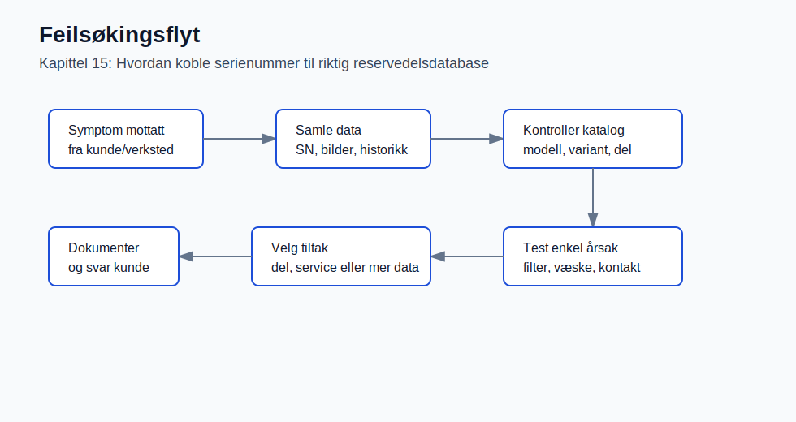

```mermaid
flowchart TD
    A[Symptom eller forespørsel mottatt] --> B[Samle serienummer, bilder og historikk]
    B --> C{Er motor og variant sikkert identifisert?}
    C -- Nei --> D[Be om mer dokumentasjon før del bekreftes]
    C -- Ja --> E[Kontroller delnummer og posisjon i katalog]
    E --> F{Stemmer symptom med foreslått del?}
    F -- Nei --> G[Foreslå feilsøking eller teknisk kontroll]
    F -- Ja --> H[Kontroller lager, pris og levering]
    H --> I[Send dokumentert kundesvar]
```

## Vedlikeholdsprosedyre
1. Avklar driftstimer, siste service og driftsmiljø.
2. Kontroller olje, filter, kjølevæske, sjøvannskrets, reimer, slanger og elektriske kontakter.
3. Sammenlign vedlikeholdsbehov med produsentens intervaller og faktisk bruk.
4. Anbefal servicekit når flere slitedeler bør skiftes samtidig.
5. Dokumenter hva som er anbefalt, hva kunden bestiller og eventuelle avvik fra normal prosedyre.

## Serienummeridentifikasjon
Serienummeridentifikasjon starter med å finne typeplate, motornummer eller annen unik identifikasjon. Be om bilde, ikke bare avskrift, fordi feil tegn, mellomrom og prefiks kan endre katalogoppslaget. Når serienummer ikke finnes, bygges identifikasjonen med modell, produksjonsår, bilder, tidligere fakturaer, servicehistorikk og delnummer fra monterte komponenter.

Minimumsdata bør være: fabrikat, modell, serienummer, eventuell product number/arrangement/CPL/motornummer, bilde av typeplate og bilde av motorens installasjon. Ved tvil skal saken stoppes for avklaring før del bekreftes.

## Reservedelsidentifikasjon
Reservedelsidentifikasjon skal bekrefte delnummer, posisjon, antall per motor, variant, side og eventuell erstatning. Dersom kunden oppgir et gammelt nummer, må det kontrolleres mot supersession. Dersom kunden bare sender bilde, skal bildet brukes som støtte, ikke som eneste grunnlag for bestilling.

Sjekk alltid om delnummeret gjelder enkeltkomponent, reparasjonssett, servicekit eller komplett enhet. Kontroller også om varen er høyre/venstre, gammel/ny type, standard/oversize eller knyttet til en bestemt produksjonsperiode.

## Bestillingsprosedyre
1. Opprett eller oppdater sak med kunde, fartøy, kontaktperson og tidsfrist.
2. Verifiser motoridentifikasjon og lagre bildedokumentasjon.
3. Finn korrekt delnummer i relevant katalog eller leverandørgrunnlag.
4. Kontroller supersession, antall, lagerstatus, pris, returvilkår og leveringstid.
5. Send ordrebekreftelse med delnummer, beskrivelse, antall, pris, levering og forbehold.
6. Følg opp leveransen til kunden har mottatt varen eller saken er lukket.

## Kvalitetspunkter før svar
- Har vi nok data til å gi et sikkert svar?
- Er delnummeret kontrollert mot riktig motorvariant?
- Er kundens tidsfrist realistisk med valgt fraktmåte?
- Er eventuelle forbehold skrevet tydelig?
- Kan en kollega forstå beslutningen ved å lese saken senere?

## Kapittelsammendrag
Hovedpoenget i kapittel 15 er at profesjonelt reservedelsarbeid krever struktur. Teknisk kunnskap, engelske fagtermer, praktisk feilsøking, dokumentasjon og kundedialog må henge sammen. Når medarbeideren jobber systematisk, reduseres feilbestillinger, kunden får bedre svar, og verkstedet kan planlegge arbeidet tryggere.

## Kryssreferanser
- For forrige tema, se kapittel 14: Forskjellen mellom motorfabrikat, modell og variant.
- For neste tema, se kapittel 16: Oversikt over vanlige reservedelskategorier.
- For grunnleggende identifikasjon, se kapittel 12 og 17.
- For merkevise eksempler, se kapitlene 26-32.

## Fordypning for intern opplæring
Dette kapitlet skal brukes som arbeidsstandard, ikke bare som lesestoff. Når en ny medarbeider møter en sak om reservedelsdatabase, skal vedkommende trene på å gå rolig fra fakta til vurdering og deretter til handling. I en marinemotorforhandler er konsekvensen av en feil ofte større enn verdien av selve delen. En feil impeller, feil sensor, feil filterinnsats eller feil pakningssett kan føre til tapt verkstedtid, utsatt avgang, irritert kunde og i verste fall ny driftsstans. Derfor skal hver sak behandles som en teknisk beslutning med sporbar dokumentasjon.

Profesjonelt nivå i dette kapitlet betyr at medarbeideren kan arbeide sikkert med katalogkobling. Før kunden får et bindende svar, skal opplysningene i saken kontrolleres mot motorens identitet, faktisk installasjon og relevant produsentterminologi. Det praktiske målet er ikke å finne et raskt nummer, men å kunne forklare hvorfor valgt del, kontrollpunkt eller kundesvar er riktig for akkurat denne motoren. Når informasjon mangler, skal medarbeideren beskrive hva som mangler, hvorfor det er nødvendig, og hvilket neste steg som bringer saken videre.

## Tekniske forklaringer
Teknisk forståelse i dette kapitlet skal bygges rundt serienummer, parts catalogue, portalvalg, exploded view, position number og supersession. Medarbeideren må skille mellom synlig symptom, sannsynlig systemfeil og bestillbar komponent. En del kan se riktig ut på bilde, men likevel være feil dersom posisjon, variant, rating, kjøleroppsett, elektrisk plugg, monteringsside eller servicehistorikk ikke stemmer. Derfor skal teknisk vurdering alltid kobles til både funksjon og dokumentasjon: hva gjør komponenten, hvilket system påvirker den, og hvilken produsentkilde bekrefter at den passer.

I praksis betyr dette at tekniske data skal kobles til motorens faktiske installasjon. Marine motorer står ofte trangt, er utsatt for salt, vibrasjon, fukt og ujevnt belastningsmønster, og de kan være bygget om gjennom mange år. En motor kan ha original kjøler, ettermontert eksosbend, alternativ dynamo, endret filterbrakett eller annen sjøvannspumpe enn standard. Slike forhold gjør at delidentifikasjon må bygge på både produsentdata og synlig dokumentasjon fra motoren.

Produsentterminologi er en del av den tekniske forståelsen. Bruk uttrykk som Serial Number, Engine Number, Part Number, Service Kit, Exploded View, Supersession når de er relevante. Ikke oversett dem på en måte som fjerner presisjon. Skriv for eksempel «Engine Serial Number (ESN)» første gang og deretter «ESN» i saken dersom produsenten bruker dette. Skriv «Arrangement Number» når CAT-data krever det, «Product Number» når Volvo Penta bruker det, «CPL» når Cummins-konfigurasjon må kontrolleres, og «Model Code» når Yanmar-identifikasjon bygger på modellkode. Dette gjør dialogen med internasjonale leverandører mer presis.

## Illustrasjonsforslag
- Oversiktsdiagram som viser hvor reservedelsdatabase passer inn i total arbeidsflyt fra kundeforespørsel til levert del.
- Nærbilde av typeplate/motorskilt med markering av serienummer, motornummer, modell og eventuell variantkode.
- Sprengskisse med markert posisjon, delnummer, antall per motor og mulige alternative versjoner.
- Feilsøkingsflyt med beslutningspunkter: mangler data, stemmer symptom, kreves mer teknisk kontroll, kan ordre bekreftes.
- Sammenligningsbilde av gammel og ny del der forskjell i tilkobling, side, lengde eller sensorplugg er markert.

## Virkelige verkstedseksempler
Eksempel 1: Et verksted står med en demontert komponent på benken og kunden venter på avklaring før fartøyet kan settes tilbake i drift. Verkstedet sender et nærbilde av delen, men ingen motorplate. En uerfaren medarbeider kan bli fristet til å søke på nummeret som står på støpegodset. En profesjonell medarbeider svarer at støpenummer ikke nødvendigvis er bestillbart delnummer, ber om bilde av typeplate, oversiktsbilde av motoren og bilde av monteringsstedet, og forklarer at dette hindrer feilbestilling. Når informasjonen kommer, kontrolleres delnummer mot sprengskisse, posisjon og antall. Først da gis pris og leveringstid.

Eksempel 2: En kunde ringer sent på dagen og sier at motoren har høy temperatur etter service. Kunden ønsker ny termostat. Medarbeideren skal ikke automatisk konkludere med termostatfeil. Spørsmålene bør avklare om impeller er byttet, om sjøvannsfilteret er rent, om kjølevæskenivået er riktig, om alarmen kommer ved tomgang eller belastning, og om det finnes lekkasje rundt varmeveksler eller slanger. Dersom kunden likevel vil bestille termostat, dokumenteres at feilsøking er anbefalt, og delnummer kontrolleres mot serienummer før ordre.

Eksempel 3: En intern selger mottar en gammel faktura med et delnummer som ikke lenger finnes. Riktig prosess er å kontrollere supersession, se om ny del krever tilhørende pakning, boltsett eller adapter, og notere både gammelt og nytt nummer i saken. Kunden skal få vite at delen er erstattet, hva som leveres, og om det finnes monteringsforbehold.

## Reservedelsidentifisering i praksis
Reservedelsidentifisering skal følge en fast rekkefølge. Først kontrolleres motorens identitet. Deretter kontrolleres delens system: drivstoff, luft, kjøling, smøring, eksos, elektrisk eller mekanisk kraftoverføring. Så kontrolleres posisjon i sprengskisse eller parts list. Til slutt kontrolleres antall, variant, supersession og leveringsstatus. Denne rekkefølgen hindrer at medarbeideren hopper direkte fra kundens ord til et tilfeldig delnummer.

Når en del har synlig nummer, må nummeret tolkes riktig. Mange komponenter har produksjonsnummer, støpenummer, leverandørnummer eller revisjonskode som ikke er det samme som bestillbart part number. Et filter kan ha nummer fra filterprodusent, men motorprodusentens parts catalogue kan bruke et annet nummer. En pumpe kan ha nummer på lokk, hus og komplett enhet. Spør derfor alltid: gjelder nummeret komplett del, reparasjonssett, underkomponent eller produsentens råkomponent?

## Serienummer og motornummer
Serienummer og motornummer er grunnlaget for korrekt katalogoppslag. Be kunden sende bilde av typeplate eller dataplate. Dersom kunden skriver nummeret manuelt, skal nummeret likevel kontrolleres mot bilde når det er mulig. Noter hele nummeret, inkludert prefiks, suffiks, bindestrek, mellomrom og eventuelle bokstaver. På enkelte produsenter kan små forskjeller peke til forskjellig produksjonsperiode, rating eller konfigurasjon.

Bruk motornummer sammen med modell, variant og applikasjon. En motor som driver generator kan ha andre deler enn en fremdriftsmotor. En motor i yrkesbåt kan ha annen rating enn samme motor i fritidsbåt. En eldre motor kan være bygget om med ny dynamo, annen sjøvannspumpe eller uoriginal filterbrakett. Dersom typeplate mangler, bygg identifikasjonen gjennom flere kilder: servicebok, tidligere faktura, bilder av motorens sider, nummer på pumpe, filter, turbo og gear, samt opplysninger om fartøy og produksjonsår.

## Feilsøking steg for steg
1. Definer symptomet med kundens egne ord og skriv det i saken. Skill mellom «kunden ønsker del» og «kunden beskriver feil».
2. Avklar når feilen oppstår: start, tomgang, belastning, marsjfart, varm motor, kald motor eller etter nylig service.
3. Kontroller grunnleggende forhold: væskenivå, filter, luft i drivstoff, sjøvannsstrøm, reimer, elektriske kontakter, sikringer og synlige lekkasjer.
4. Knytt symptomet til system: lav effekt peker ofte mot luft/drivstoff/eksos, høy temperatur mot kjøling, lavt oljetrykk mot smøring/sensor, startproblem mot batteri/starter/gløding/drivstoff.
5. Be om bilder eller måledata dersom symptomet ikke kan kobles sikkert til en del. Dette kan være bilde av alarmdisplay, trykkmåling, temperaturmåling eller bilde av montert komponent.
6. Kontroller relevant delnummer mot serienummer og variant. Dersom flere alternativer finnes, forklar kunden hva som skiller dem.
7. Dokumenter anbefalt tiltak, usikkerhet og eventuelle forbehold før ordre bekreftes.

## Vedlikehold
Vedlikehold skal vurderes mot driftstimer, produsentens maintenance schedule og faktisk driftsmiljø. Marine motorer som går korte turer, mye tomgang eller i salt miljø kan trenge hyppigere kontroll enn standard intervall antyder. Nye medarbeidere skal lære å spørre om siste service, hvilke filter som ble byttet, hvilken olje som ble brukt, om impeller er kontrollert, og om kjølevæske eller anoder er byttet etter plan.

En god vedlikeholdsanbefaling er konkret. I stedet for å skrive «ta service», bør medarbeideren foreslå relevante deler: olje- og drivstoffilter, luftfilter, impeller, reim, pakninger, anoder, kjølevæske og eventuelt servicekit. Dersom kunden har ukjent servicehistorikk, bør komplett servicekit vurderes. Dersom kunden har hatt overoppheting, bør sjøvannskrets og varmeveksler kontrolleres før bare én komponent byttes.

## Vanlige feil
- Serienummer leses feil fordi et tegn forveksles, for eksempel O/0 eller I/1.
- Kunden oppgir modellnavn, men ikke variant, rating eller applikasjon.
- Del velges ut fra bilde alene uten kontroll mot sprengskisse eller produsentkatalog.
- Supersession aksepteres uten å kontrollere om ny del krever tilbehør, pakning eller ombygging.
- Hastepress gjør at leveringsløfte gis før lagerstatus og fraktmulighet er bekreftet.
- Saksnotat mangler grunnlaget for beslutningen, slik at kollega ikke kan etterprøve valget.

## Kontrollspørsmål
- Hva er den viktigste tekniske risikoen i en sak som gjelder reservedelsdatabase?
- Hvilke opplysninger må dokumenteres før bindende delnummer bekreftes?
- Hvordan forklarer du kunden hvorfor bilde av typeplate er nødvendig?
- Når bør du stoppe en ordre og be om mer dokumentasjon?
- Hvilke engelske produsentuttrykk bør du kunne bruke i denne typen sak?
- Hvordan dokumenterer du at et delnummer er erstattet av et nytt nummer?

## Praktisk sjekkliste for medarbeider
- Les saken som om en kollega skal overta den i morgen.
- Kontroller at motoridentifikasjon er dokumentert med bilde eller sikker kilde.
- Sjekk at delnummeret er knyttet til riktig posisjon i katalogen.
- Skriv tydelig om kunden har bedt om enkeltkomponent, servicekit eller komplett enhet.
- Noter om varen er spesialbestilling, utgått, erstattet eller ikke returbar.
- Send kundesvar med neste steg, ikke bare et løst delnummer.

## Kapittelspesifikk systemforståelse
For dette kapitlet er kjernen å forstå koblingen mellom motordata og riktig katalog eller portal. Medarbeideren skal kunne forklare dette med praktiske ord til både kunde og kollega. Det betyr at teknisk teori må kobles til konkrete handlinger: hvilke data skal innhentes, hvilke komponenter kan være berørt, hvilken produsentterminologi skal brukes, og hva må dokumenteres før saken kan gå videre. Feil katalog kan gi et tilsynelatende riktig delnummer som likevel ikke passer motoren.

Når systemet vurderes, skal medarbeideren først plassere problemet i riktig teknisk sammenheng. Dersom kunden beskriver en alarm, må man finne ut om alarmen kommer fra reelt mekanisk avvik, elektrisk sensorfeil, feil etter service eller feil tolkning av instrumentet. Dersom kunden beskriver en del, må man avklare om kunden mener komplett enhet, servicekit, reparasjonssett eller enkeltkomponent. Dersom kunden beskriver motoren med vanlig navn, må man kontrollere om produsenten bruker mer presise begreper i katalogen.

## Komponentoversikt og arbeidsgrense
Relevante komponenter og opplysninger i dette kapitlet omfatter: parts catalogue, exploded view, service manual, service bulletin, supersession og lagerdata. Listen er ikke ment som en erstatning for produsentens parts catalogue, men som en praktisk påminnelse om hva nye medarbeidere skal tenke på før de søker del. I interne saker skal komponentnavn skrives så presist som mulig. Bruk for eksempel «sjøvannspumpe / raw water pump» i stedet for bare «pumpe» når funksjonen er kjent, og «varmeveksler / heat exchanger» i stedet for bare «kjøler» når det er den komponenten saken gjelder.

Arbeidsgrensen for en reservedelsmedarbeider er også viktig. Medarbeideren skal ikke overta mekanikerens ansvar for demontering, måling eller diagnose på motoren, men skal kunne stille riktige spørsmål og foreslå riktig dokumentasjon. Når en sak går fra enkel delidentifikasjon til teknisk diagnose, skal dette markeres i saken. Da kan verksted, teknisk ansvarlig eller leverandør involveres med et klart spørsmål og et ryddig faktagrunnlag.

## Praktisk beslutningsregel
Bruk denne regelen i alle saker knyttet til kapitlet: Hvis motoridentifikasjon, komponentposisjon eller symptom ikke er sikkert nok dokumentert, skal medarbeideren ikke gi bindende delbekreftelse. Kunden kan få et foreløpig svar, men svaret må inneholde hva som mangler, hvorfor det mangler, og hva som skjer når informasjonen er mottatt. Dette er ikke treg service; det er profesjonell risikokontroll.

## Målrettet fordypning kapittel 11-20
### Katalogoppslag, sprengskisse og kildekontroll
Riktig reservedelsdatabase er like viktig som riktig serienummer. Produsentportaler, parts catalogues, service bulletins og lokale leverandørlister kan vise ulike detaljer. Medarbeideren må vite hvilken kilde som er autoritativ for saken. Et gammelt PDF-utdrag kan være nyttig historikk, men et oppdatert produsentoppslag kan vise supersession, endret kit eller utgått del. Samtidig kan eldre motorer kreve historisk dokumentasjon fordi nyere portal ikke viser alt.

I praksis skal katalogoppslaget dokumenteres med kilde, dato og relevant posisjon. Skriv ikke bare «funnet i katalog». Skriv heller «kontrollert i parts catalogue mot serienummer, posisjon 12 på sjøvannspumpegruppe, delnummer erstattet fra X til Y». Dette gjør at kollega, innkjøper og kunde kan forstå hvorfor delen er valgt. Ved flere mulige treff skal forskjellen dokumenteres: serienummerskille, side, diameter, pluggtype, aksellengde eller monteringssett.

### Praktisk anvendelse i opplæring
Instruktør bør bruke dette kapitlet med en konkret case der deltakerne først må identifisere manglende opplysninger, deretter velge riktig kataloggrunnlag og til slutt skrive et kort kundesvar. Deltakeren skal forklare hvilke produsentdata som er nødvendige, hvilke komponenter som kan være involvert, og hvor grensen går mellom reservedelsidentifisering og mekanisk diagnose. Målet er at medarbeideren ikke bare husker begreper, men kan bruke dem under tidspress i en reell kundesak.

## Realistisk opplæring i praksis
### Verkstedhistorie
En typisk sak i dette temaet starter med riktig portal gir annet svar enn fritekstsøk. Verkstedet trenger et raskt svar, men den erfarne medarbeideren stopper opp og spør først: hva vet vi sikkert, hva antar vi, og hva kan gi følgeskade hvis vi tar feil? I praksis betyr det at kobling mellom serienummer og katalog må kobles til bilde, serienummer, komponentposisjon og kundens symptom før saken lukkes. Historien skal brukes i opplæring som en øvelse i å skrive et kort saksnotat: observasjon, vurdering, neste handling og forbehold.

### Kundehistorie
Kunden beskriver ofte problemet med driftsspråk: «motoren går tungt», «alarm kommer etter ti minutter», «jeg trenger den samme delen som sist» eller «båten skal ut i morgen». En profesjonell respons er rolig og konkret: bekreft behovet, forklar hvorfor identifikasjon trengs, be om riktig dokumentasjon og gi et realistisk tidspunkt for neste svar. Ikke korriger kunden unødvendig; oversett kundens språk til teknisk språk i saken.

### Typiske feil nye ansatte gjør
- søker på første synlige nummer uten å avklare om det er støpenummer, leverandørnummer eller bestillbart part number.
- lover levering før lagerstatus, frakt og returvilkår er kontrollert.
- antar at tidligere faktura alltid gjelder samme motorvariant.
- blander symptom og årsak, spesielt ved varme, lav effekt, startproblem og alarm.
- skriver for korte notater slik at kollega ikke kan forstå hvorfor valget ble tatt.

### Tips fra erfarne mekanikere og reservedelsselgere
- Se alltid etter systemet rundt delen: slanger, braketter, sensorer, reimer, kjølere og tilkoblinger forteller ofte mer enn delen alene.
- Still ett presist spørsmål om gangen når kunden er stresset; mange dårlige svar kommer av for lange spørsmålslister.
- Sammenlign gammel og ny del mot funksjon, ikke bare form. Riktig del skal passe, men også løse riktig problem.
- En erfaren reservedelsselger tenker i risiko: Hva er billigst å avklare nå, og hva blir dyrt hvis vi hopper over det?

### Vanlige kundespørsmål
| Spørsmål fra kunde | Profesjonelt svar |
|---|---|
| «Kan du bare sende samme del som sist?» | «Ja, hvis vi først bekrefter at det gjelder samme motor, samme posisjon og ingen supersession siden sist.» |
| «Holder det med bilde?» | «Bilde hjelper, men vi trenger også motoridentitet for å sikre variant og delnummer.» |
| «Hvorfor tar dette tid?» | «Fordi feil del kan gi ny driftsstans. Vi kontrollerer grunnlaget før vi lover levering.» |

### Beslutningstre for saken
| Trinn | Spørsmål | Handling |
|---|---|---|
| 1 | Er motoridentitet dokumentert med bilde eller sikker historikk? | Hvis nei: be om typeplate/dataplate eller alternativ dokumentasjon. |
| 2 | Er komponentens funksjon og posisjon kjent? | Hvis nei: be om oversiktsbilde og bilde av monteringssted. |
| 3 | Stemmer kundens symptom med delen som ønskes? | Hvis nei: anbefal feilsøking før del bestilles. |
| 4 | Finnes det supersession, kit eller variantvalg? | Kontroller produsentkilde og skriv forbehold i saken. |
| 5 | Kan pris, levering og returvilkår bekreftes? | Send dokumentert svar med neste steg og tydelig gyldighet. |

### Rask oppslagstabell
| Situasjon | Kontroller først | Vanlig fallgruve |
|---|---|---|
| Hasteordre | sikker motor-ID, lager, fraktfrist | levering loves før teknisk kontroll |
| Del fra bilde | posisjon, skala, tilkoblinger, nummer | bilde brukes som eneste beslutningsgrunnlag |
| Gammelt delnummer | supersession og kitinnhold | ny del krever ekstra pakning eller adapter |
| Uklart symptom | driftssituasjon, alarm, siste service | symptom blir tolket som sikker komponentfeil |

### Praktisk sjekkliste og inspeksjonsrutine
- Start med motoridentitet: fabrikat, modell, serienummer, variant, applikasjon og bilde av skilt.
- Kontroller området rundt komponenten: lekkasje, korrosjon, knekte fester, slitasje, varmemerker og uoriginale endringer.
- Spør om siste vedlikehold: olje, filter, impeller, reimer, kjølevæske, anoder og drivstoffilter.
- Noter driftstype: fritidsbruk, yrkesbruk, generator, fremdrift, tomgangsdrift eller langvarig høy belastning.
- Avklar om saken gjelder akutt drift, planlagt service, reklamasjon eller lagerpåfyll.

### Generelle vedlikeholdsintervaller som opplæringspunkt
| Kontrollpunkt | Typisk vurdering i opplæring | Må verifiseres |
|---|---|---|
| Olje og oljefilter | ofte basert på timer og kalender | produsentens maintenance schedule |
| Drivstoffilter/vannutskiller | hyppigere ved dårlig drivstoff eller sesongstart | motor- og filterspesifikasjon |
| Impeller og sjøvannskrets | kontrolleres særlig før sesong og etter varmgang | produsentens intervall og installasjon |
| Reimer, slanger og klemmer | visuell kontroll ved service og feilsøking | dimensjon, stramming og delnummer |

### Produsentverifikasjon
Alle konkrete delnumre, momentverdier, serviceintervaller, garantikrav, programvaredata og produsentspesifikke grenser skal kontrolleres mot offisiell produsentdokumentasjon før de brukes i tilbud, ordre eller verkstedinstruks. Marker tydelig i saken når svaret bygger på antakelse, eldre historikk, bilde uten motor-ID eller generell erfaring. Intervaller i tabellen er generelle opplæringspunkter. Faktiske intervaller styres av produsent, motorvariant, driftstimer, kalenderkrav, belastning og miljø.

## Produsentverifikasjon og faglig forbehold
Når saken gjelder delnummer, serienummer, serviceintervall, momentdata, garanti, elektronikk eller kompatibilitet, skal opplysningen verifiseres mot produsentens dokumentasjon eller autorisert leverandør før bindende tilbud eller teknisk konklusjon gis. Manualen beskriver arbeidsmetode og risikopunkter; den erstatter ikke gjeldende parts catalogue, service manual, service bulletin eller produsentportal. Marker saken internt dersom opplysningen bygger på antakelse, eldre historikk eller bilde uten bekreftet motoridentitet.

## Quiz med fasit
1. Hvilke tekniske data bør alltid samles før en del bekreftes?
2. Hvorfor er engelsk terminologi viktig i marine reservedeler?
3. Hva bør gjøres dersom kunden bare sender et bilde av delen?
4. Hvilke punkter bør kontrolleres før ordrebekreftelse sendes?
5. Hvorfor skal feilsøking dokumenteres, selv når kunden allerede ber om en bestemt del?

### Svar
1. Fabrikat, modell, serienummer, variantdata, bilde av typeplate, delnummer, posisjon og kundens symptombeskrivelse.
2. Fordi kataloger, portaler, servicemanualer og leverandørdialog ofte bruker engelske begreper som må forstås presist.
3. Be om serienummer, oversiktsbilde av motoren og eventuelle nummer på delen; bildet brukes som støtte, ikke eneste grunnlag.
4. Delnummer, antall, variant, pris, lagerstatus, leveringstid, frakt, returvilkår og eventuelle forbehold.
5. Fordi symptomet kan ha flere årsaker, og dokumentasjon viser hvorfor anbefalingen ble gitt.

---

# Kapittel 16: Oversikt over vanlige reservedelskategorier

## Kapittelrolle
Dette kapitlet gir en grundig praktisk innføring i reservedelskategorier. Temaet er viktig fordi reservedelsarbeid i marine miljøer kombinerer teknisk forståelse, presis kundedialog, dokumentert saksbehandling og realistisk leveranseoppfølging. Målet er at en ny medarbeider skal kunne bruke kunnskapen direkte i arbeid med verksted, kunde, lager og leverandør.

## Læringsmål
Etter kapitlet skal deltakeren kunne:
- forklare hovedbegrepene innen reservedelskategorier
- bruke serienummer, modellinformasjon og delnummer i praktisk reservedelsarbeid
- kommunisere trygt med kunde, verksted, lager og leverandør
- dokumentere beslutninger slik at andre kan etterprøve saken
- kjenne igjen vanlige feil og velge riktig neste handling

## English technical terminology
- **Serial Number:** engelsk fagterm som ofte brukes i kataloger, servicelitteratur, leverandørportaler og internasjonal kundedialog.
- **Part Number:** engelsk fagterm som ofte brukes i kataloger, servicelitteratur, leverandørportaler og internasjonal kundedialog.
- **Engine Model:** engelsk fagterm som ofte brukes i kataloger, servicelitteratur, leverandørportaler og internasjonal kundedialog.
- **Variant:** engelsk fagterm som ofte brukes i kataloger, servicelitteratur, leverandørportaler og internasjonal kundedialog.
- **Service Kit:** engelsk fagterm som ofte brukes i kataloger, servicelitteratur, leverandørportaler og internasjonal kundedialog.
- **Troubleshooting:** engelsk fagterm som ofte brukes i kataloger, servicelitteratur, leverandørportaler og internasjonal kundedialog.
- **Maintenance:** engelsk fagterm som ofte brukes i kataloger, servicelitteratur, leverandørportaler og internasjonal kundedialog.
- **Ordering Procedure:** engelsk fagterm som ofte brukes i kataloger, servicelitteratur, leverandørportaler og internasjonal kundedialog.
- **Supersession:** engelsk fagterm som ofte brukes i kataloger, servicelitteratur, leverandørportaler og internasjonal kundedialog.
- **Technical Support:** engelsk fagterm som ofte brukes i kataloger, servicelitteratur, leverandørportaler og internasjonal kundedialog.

## Hoveddiagram

## Tekniske systemillustrasjoner

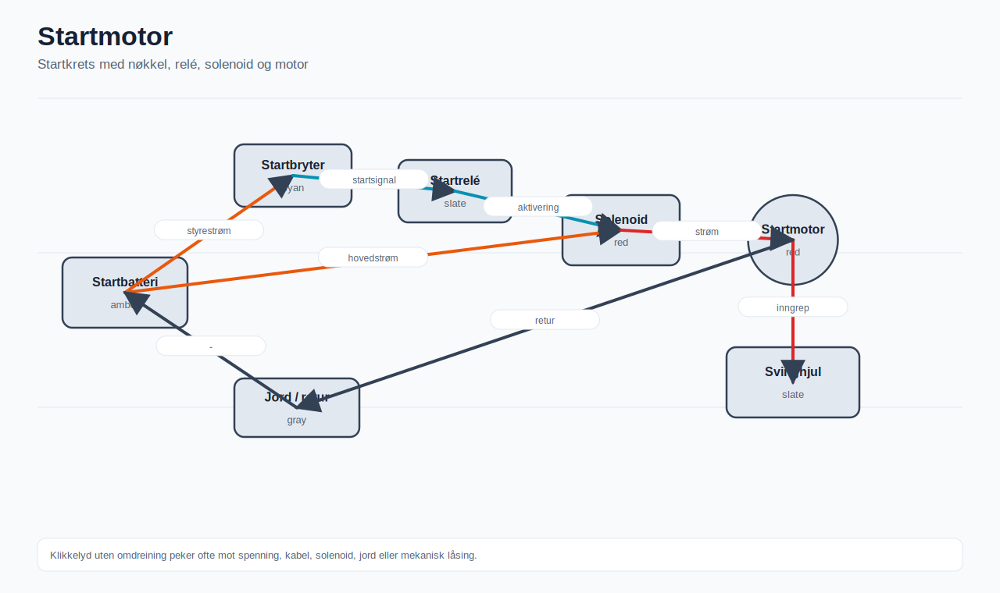

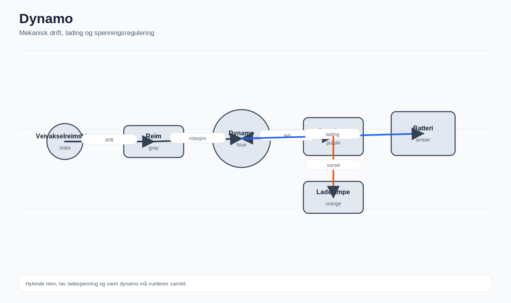

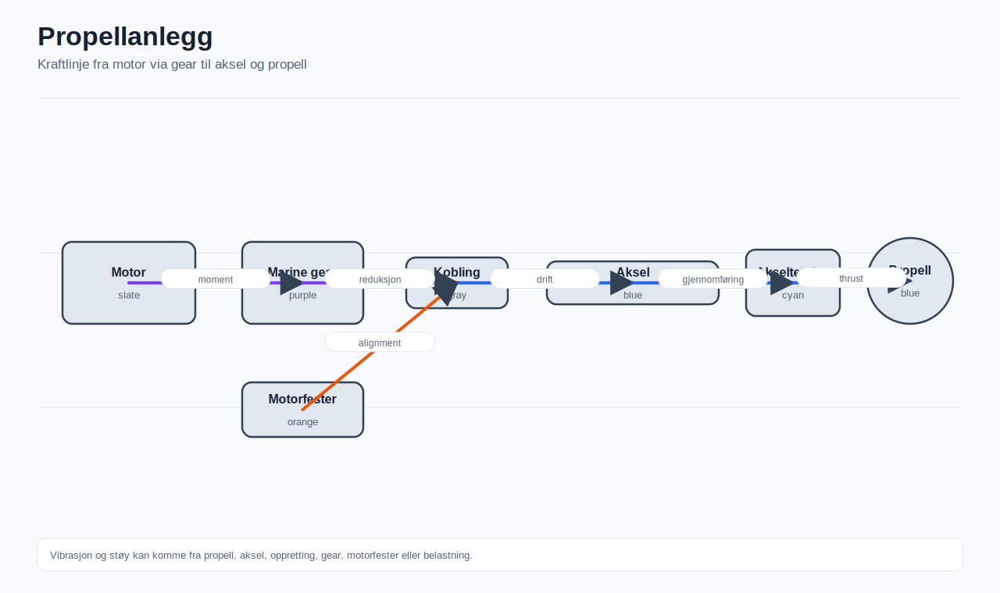

## Grundig forklaring
Hvordan vanlige delgrupper brukes i service og reparasjon må forstås både teknisk og praktisk. I marine reservedeler er det sjelden nok å vite hva kunden kaller delen. Medarbeideren må forstå hvilken funksjon delen har, hvor den sitter, hvilken motorvariant den tilhører, og hva som skjer dersom feil del bestilles. Derfor skal tekniske data, kundens beskrivelse og dokumentert katalogoppslag alltid vurderes sammen.

En god sak har fire kjennetegn: den har tydelig identifikasjon, tydelig problem- eller delbeskrivelse, tydelig beslutningsgrunnlag og tydelig oppfølging. Dersom ett av disse punktene mangler, skal saken markeres som usikker før kunden får et bindende svar.

## Praktisk verkstedeksempel
Et verksted står med demontert komponent og trenger rask avklaring. Medarbeideren registrerer kunde, fartøy, motorinformasjon og tidsfrist, ber om bilder av typeplate og komponent, sjekker katalog og lager, og sender et kort skriftlig svar med valgt del, grunnlag for valget og neste oppdateringstidspunkt.

## Kundesupporteksempel
Kunde: 'Motoren går dårlig, kan dere sende riktig del?' Profesjonelt svar: 'Vi kan hjelpe, men først må vi skille mellom symptom og delbehov. Send serienummer, bilde av motorplate, bilde av området feilen gjelder og en kort beskrivelse av når feilen oppstår. Da kan vi foreslå riktig del eller riktig neste feilsøkingstrinn.'

## Vanlige feil og årsaker
- feil eller ufullstendig serienummer.
- delnummer som er erstattet uten at saken dokumenteres.
- symptom som tolkes som delbehov uten feilsøking.
- kunde har bilde av lignende del, men ikke korrekt motorvariant.
- manglende avklaring av antall, side, posisjon eller leveringstid.

## Feilsøkingsflyt
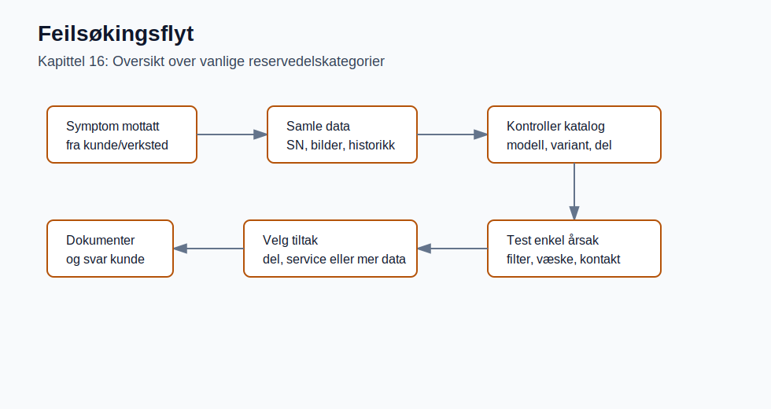

```mermaid
flowchart TD
    A[Symptom eller forespørsel mottatt] --> B[Samle serienummer, bilder og historikk]
    B --> C{Er motor og variant sikkert identifisert?}
    C -- Nei --> D[Be om mer dokumentasjon før del bekreftes]
    C -- Ja --> E[Kontroller delnummer og posisjon i katalog]
    E --> F{Stemmer symptom med foreslått del?}
    F -- Nei --> G[Foreslå feilsøking eller teknisk kontroll]
    F -- Ja --> H[Kontroller lager, pris og levering]
    H --> I[Send dokumentert kundesvar]
```

## Vedlikeholdsprosedyre
1. Avklar driftstimer, siste service og driftsmiljø.
2. Kontroller olje, filter, kjølevæske, sjøvannskrets, reimer, slanger og elektriske kontakter.
3. Sammenlign vedlikeholdsbehov med produsentens intervaller og faktisk bruk.
4. Anbefal servicekit når flere slitedeler bør skiftes samtidig.
5. Dokumenter hva som er anbefalt, hva kunden bestiller og eventuelle avvik fra normal prosedyre.

## Serienummeridentifikasjon
Serienummeridentifikasjon starter med å finne typeplate, motornummer eller annen unik identifikasjon. Be om bilde, ikke bare avskrift, fordi feil tegn, mellomrom og prefiks kan endre katalogoppslaget. Når serienummer ikke finnes, bygges identifikasjonen med modell, produksjonsår, bilder, tidligere fakturaer, servicehistorikk og delnummer fra monterte komponenter.

Minimumsdata bør være: fabrikat, modell, serienummer, eventuell product number/arrangement/CPL/motornummer, bilde av typeplate og bilde av motorens installasjon. Ved tvil skal saken stoppes for avklaring før del bekreftes.

## Reservedelsidentifikasjon
Reservedelsidentifikasjon skal bekrefte delnummer, posisjon, antall per motor, variant, side og eventuell erstatning. Dersom kunden oppgir et gammelt nummer, må det kontrolleres mot supersession. Dersom kunden bare sender bilde, skal bildet brukes som støtte, ikke som eneste grunnlag for bestilling.

Sjekk alltid om delnummeret gjelder enkeltkomponent, reparasjonssett, servicekit eller komplett enhet. Kontroller også om varen er høyre/venstre, gammel/ny type, standard/oversize eller knyttet til en bestemt produksjonsperiode.

## Bestillingsprosedyre
1. Opprett eller oppdater sak med kunde, fartøy, kontaktperson og tidsfrist.
2. Verifiser motoridentifikasjon og lagre bildedokumentasjon.
3. Finn korrekt delnummer i relevant katalog eller leverandørgrunnlag.
4. Kontroller supersession, antall, lagerstatus, pris, returvilkår og leveringstid.
5. Send ordrebekreftelse med delnummer, beskrivelse, antall, pris, levering og forbehold.
6. Følg opp leveransen til kunden har mottatt varen eller saken er lukket.

## Kvalitetspunkter før svar
- Har vi nok data til å gi et sikkert svar?
- Er delnummeret kontrollert mot riktig motorvariant?
- Er kundens tidsfrist realistisk med valgt fraktmåte?
- Er eventuelle forbehold skrevet tydelig?
- Kan en kollega forstå beslutningen ved å lese saken senere?

## Kapittelsammendrag
Hovedpoenget i kapittel 16 er at profesjonelt reservedelsarbeid krever struktur. Teknisk kunnskap, engelske fagtermer, praktisk feilsøking, dokumentasjon og kundedialog må henge sammen. Når medarbeideren jobber systematisk, reduseres feilbestillinger, kunden får bedre svar, og verkstedet kan planlegge arbeidet tryggere.

## Kryssreferanser
- For forrige tema, se kapittel 15: Hvordan koble serienummer til riktig reservedelsdatabase.
- For neste tema, se kapittel 17: Hvordan velge riktig del ved hjelp av delnummer og modellinfo.
- For grunnleggende identifikasjon, se kapittel 12 og 17.
- For merkevise eksempler, se kapitlene 26-32.

## Fordypning for intern opplæring
Dette kapitlet skal brukes som arbeidsstandard, ikke bare som lesestoff. Når en ny medarbeider møter en sak om reservedelskategorier, skal vedkommende trene på å gå rolig fra fakta til vurdering og deretter til handling. I en marinemotorforhandler er konsekvensen av en feil ofte større enn verdien av selve delen. En feil impeller, feil sensor, feil filterinnsats eller feil pakningssett kan føre til tapt verkstedtid, utsatt avgang, irritert kunde og i verste fall ny driftsstans. Derfor skal hver sak behandles som en teknisk beslutning med sporbar dokumentasjon.

Profesjonelt nivå i dette kapitlet betyr at medarbeideren kan arbeide sikkert med reservedelskategorier. Før kunden får et bindende svar, skal opplysningene i saken kontrolleres mot motorens identitet, faktisk installasjon og relevant produsentterminologi. Det praktiske målet er ikke å finne et raskt nummer, men å kunne forklare hvorfor valgt del, kontrollpunkt eller kundesvar er riktig for akkurat denne motoren. Når informasjon mangler, skal medarbeideren beskrive hva som mangler, hvorfor det er nødvendig, og hvilket neste steg som bringer saken videre.

## Tekniske forklaringer
Teknisk forståelse i dette kapitlet skal bygges rundt service parts, wear parts, repair kits, complete units, electrical components og consumables. Medarbeideren må skille mellom synlig symptom, sannsynlig systemfeil og bestillbar komponent. En del kan se riktig ut på bilde, men likevel være feil dersom posisjon, variant, rating, kjøleroppsett, elektrisk plugg, monteringsside eller servicehistorikk ikke stemmer. Derfor skal teknisk vurdering alltid kobles til både funksjon og dokumentasjon: hva gjør komponenten, hvilket system påvirker den, og hvilken produsentkilde bekrefter at den passer.

I praksis betyr dette at tekniske data skal kobles til motorens faktiske installasjon. Marine motorer står ofte trangt, er utsatt for salt, vibrasjon, fukt og ujevnt belastningsmønster, og de kan være bygget om gjennom mange år. En motor kan ha original kjøler, ettermontert eksosbend, alternativ dynamo, endret filterbrakett eller annen sjøvannspumpe enn standard. Slike forhold gjør at delidentifikasjon må bygge på både produsentdata og synlig dokumentasjon fra motoren.

Produsentterminologi er en del av den tekniske forståelsen. Bruk uttrykk som Serial Number, Engine Number, Part Number, Service Kit, Exploded View, Supersession når de er relevante. Ikke oversett dem på en måte som fjerner presisjon. Skriv for eksempel «Engine Serial Number (ESN)» første gang og deretter «ESN» i saken dersom produsenten bruker dette. Skriv «Arrangement Number» når CAT-data krever det, «Product Number» når Volvo Penta bruker det, «CPL» når Cummins-konfigurasjon må kontrolleres, og «Model Code» når Yanmar-identifikasjon bygger på modellkode. Dette gjør dialogen med internasjonale leverandører mer presis.

## Illustrasjonsforslag
- Oversiktsdiagram som viser hvor reservedelskategorier passer inn i total arbeidsflyt fra kundeforespørsel til levert del.
- Nærbilde av typeplate/motorskilt med markering av serienummer, motornummer, modell og eventuell variantkode.
- Sprengskisse med markert posisjon, delnummer, antall per motor og mulige alternative versjoner.
- Feilsøkingsflyt med beslutningspunkter: mangler data, stemmer symptom, kreves mer teknisk kontroll, kan ordre bekreftes.
- Sammenligningsbilde av gammel og ny del der forskjell i tilkobling, side, lengde eller sensorplugg er markert.

## Virkelige verkstedseksempler
Eksempel 1: Et verksted står med en demontert komponent på benken og kunden venter på avklaring før fartøyet kan settes tilbake i drift. Verkstedet sender et nærbilde av delen, men ingen motorplate. En uerfaren medarbeider kan bli fristet til å søke på nummeret som står på støpegodset. En profesjonell medarbeider svarer at støpenummer ikke nødvendigvis er bestillbart delnummer, ber om bilde av typeplate, oversiktsbilde av motoren og bilde av monteringsstedet, og forklarer at dette hindrer feilbestilling. Når informasjonen kommer, kontrolleres delnummer mot sprengskisse, posisjon og antall. Først da gis pris og leveringstid.

Eksempel 2: En kunde ringer sent på dagen og sier at motoren har høy temperatur etter service. Kunden ønsker ny termostat. Medarbeideren skal ikke automatisk konkludere med termostatfeil. Spørsmålene bør avklare om impeller er byttet, om sjøvannsfilteret er rent, om kjølevæskenivået er riktig, om alarmen kommer ved tomgang eller belastning, og om det finnes lekkasje rundt varmeveksler eller slanger. Dersom kunden likevel vil bestille termostat, dokumenteres at feilsøking er anbefalt, og delnummer kontrolleres mot serienummer før ordre.

Eksempel 3: En intern selger mottar en gammel faktura med et delnummer som ikke lenger finnes. Riktig prosess er å kontrollere supersession, se om ny del krever tilhørende pakning, boltsett eller adapter, og notere både gammelt og nytt nummer i saken. Kunden skal få vite at delen er erstattet, hva som leveres, og om det finnes monteringsforbehold.

## Reservedelsidentifisering i praksis
Reservedelsidentifisering skal følge en fast rekkefølge. Først kontrolleres motorens identitet. Deretter kontrolleres delens system: drivstoff, luft, kjøling, smøring, eksos, elektrisk eller mekanisk kraftoverføring. Så kontrolleres posisjon i sprengskisse eller parts list. Til slutt kontrolleres antall, variant, supersession og leveringsstatus. Denne rekkefølgen hindrer at medarbeideren hopper direkte fra kundens ord til et tilfeldig delnummer.

Når en del har synlig nummer, må nummeret tolkes riktig. Mange komponenter har produksjonsnummer, støpenummer, leverandørnummer eller revisjonskode som ikke er det samme som bestillbart part number. Et filter kan ha nummer fra filterprodusent, men motorprodusentens parts catalogue kan bruke et annet nummer. En pumpe kan ha nummer på lokk, hus og komplett enhet. Spør derfor alltid: gjelder nummeret komplett del, reparasjonssett, underkomponent eller produsentens råkomponent?

## Serienummer og motornummer
Serienummer og motornummer er grunnlaget for korrekt katalogoppslag. Be kunden sende bilde av typeplate eller dataplate. Dersom kunden skriver nummeret manuelt, skal nummeret likevel kontrolleres mot bilde når det er mulig. Noter hele nummeret, inkludert prefiks, suffiks, bindestrek, mellomrom og eventuelle bokstaver. På enkelte produsenter kan små forskjeller peke til forskjellig produksjonsperiode, rating eller konfigurasjon.

Bruk motornummer sammen med modell, variant og applikasjon. En motor som driver generator kan ha andre deler enn en fremdriftsmotor. En motor i yrkesbåt kan ha annen rating enn samme motor i fritidsbåt. En eldre motor kan være bygget om med ny dynamo, annen sjøvannspumpe eller uoriginal filterbrakett. Dersom typeplate mangler, bygg identifikasjonen gjennom flere kilder: servicebok, tidligere faktura, bilder av motorens sider, nummer på pumpe, filter, turbo og gear, samt opplysninger om fartøy og produksjonsår.

## Feilsøking steg for steg
1. Definer symptomet med kundens egne ord og skriv det i saken. Skill mellom «kunden ønsker del» og «kunden beskriver feil».
2. Avklar når feilen oppstår: start, tomgang, belastning, marsjfart, varm motor, kald motor eller etter nylig service.
3. Kontroller grunnleggende forhold: væskenivå, filter, luft i drivstoff, sjøvannsstrøm, reimer, elektriske kontakter, sikringer og synlige lekkasjer.
4. Knytt symptomet til system: lav effekt peker ofte mot luft/drivstoff/eksos, høy temperatur mot kjøling, lavt oljetrykk mot smøring/sensor, startproblem mot batteri/starter/gløding/drivstoff.
5. Be om bilder eller måledata dersom symptomet ikke kan kobles sikkert til en del. Dette kan være bilde av alarmdisplay, trykkmåling, temperaturmåling eller bilde av montert komponent.
6. Kontroller relevant delnummer mot serienummer og variant. Dersom flere alternativer finnes, forklar kunden hva som skiller dem.
7. Dokumenter anbefalt tiltak, usikkerhet og eventuelle forbehold før ordre bekreftes.

## Vedlikehold
Vedlikehold skal vurderes mot driftstimer, produsentens maintenance schedule og faktisk driftsmiljø. Marine motorer som går korte turer, mye tomgang eller i salt miljø kan trenge hyppigere kontroll enn standard intervall antyder. Nye medarbeidere skal lære å spørre om siste service, hvilke filter som ble byttet, hvilken olje som ble brukt, om impeller er kontrollert, og om kjølevæske eller anoder er byttet etter plan.

En god vedlikeholdsanbefaling er konkret. I stedet for å skrive «ta service», bør medarbeideren foreslå relevante deler: olje- og drivstoffilter, luftfilter, impeller, reim, pakninger, anoder, kjølevæske og eventuelt servicekit. Dersom kunden har ukjent servicehistorikk, bør komplett servicekit vurderes. Dersom kunden har hatt overoppheting, bør sjøvannskrets og varmeveksler kontrolleres før bare én komponent byttes.

## Vanlige feil
- Serienummer leses feil fordi et tegn forveksles, for eksempel O/0 eller I/1.
- Kunden oppgir modellnavn, men ikke variant, rating eller applikasjon.
- Del velges ut fra bilde alene uten kontroll mot sprengskisse eller produsentkatalog.
- Supersession aksepteres uten å kontrollere om ny del krever tilbehør, pakning eller ombygging.
- Hastepress gjør at leveringsløfte gis før lagerstatus og fraktmulighet er bekreftet.
- Saksnotat mangler grunnlaget for beslutningen, slik at kollega ikke kan etterprøve valget.

## Kontrollspørsmål
- Hva er den viktigste tekniske risikoen i en sak som gjelder reservedelskategorier?
- Hvilke opplysninger må dokumenteres før bindende delnummer bekreftes?
- Hvordan forklarer du kunden hvorfor bilde av typeplate er nødvendig?
- Når bør du stoppe en ordre og be om mer dokumentasjon?
- Hvilke engelske produsentuttrykk bør du kunne bruke i denne typen sak?
- Hvordan dokumenterer du at et delnummer er erstattet av et nytt nummer?

## Praktisk sjekkliste for medarbeider
- Les saken som om en kollega skal overta den i morgen.
- Kontroller at motoridentifikasjon er dokumentert med bilde eller sikker kilde.
- Sjekk at delnummeret er knyttet til riktig posisjon i katalogen.
- Skriv tydelig om kunden har bedt om enkeltkomponent, servicekit eller komplett enhet.
- Noter om varen er spesialbestilling, utgått, erstattet eller ikke returbar.
- Send kundesvar med neste steg, ikke bare et løst delnummer.

## Kapittelspesifikk systemforståelse
For dette kapitlet er kjernen å forstå vanlige reservedelskategorier og hvordan de knyttes til systemene. Medarbeideren skal kunne forklare dette med praktiske ord til både kunde og kollega. Det betyr at teknisk teori må kobles til konkrete handlinger: hvilke data skal innhentes, hvilke komponenter kan være berørt, hvilken produsentterminologi skal brukes, og hva må dokumenteres før saken kan gå videre. Delkategorier bør alltid knyttes til system og funksjon, ikke bare navn.

Når systemet vurderes, skal medarbeideren først plassere problemet i riktig teknisk sammenheng. Dersom kunden beskriver en alarm, må man finne ut om alarmen kommer fra reelt mekanisk avvik, elektrisk sensorfeil, feil etter service eller feil tolkning av instrumentet. Dersom kunden beskriver en del, må man avklare om kunden mener komplett enhet, servicekit, reparasjonssett eller enkeltkomponent. Dersom kunden beskriver motoren med vanlig navn, må man kontrollere om produsenten bruker mer presise begreper i katalogen.

## Komponentoversikt og arbeidsgrense
Relevante komponenter og opplysninger i dette kapitlet omfatter: filter, pumper, sensorer, pakninger, reimer, slanger, kjølere, impellere, anoder og servicekit. Listen er ikke ment som en erstatning for produsentens parts catalogue, men som en praktisk påminnelse om hva nye medarbeidere skal tenke på før de søker del. I interne saker skal komponentnavn skrives så presist som mulig. Bruk for eksempel «sjøvannspumpe / raw water pump» i stedet for bare «pumpe» når funksjonen er kjent, og «varmeveksler / heat exchanger» i stedet for bare «kjøler» når det er den komponenten saken gjelder.

Arbeidsgrensen for en reservedelsmedarbeider er også viktig. Medarbeideren skal ikke overta mekanikerens ansvar for demontering, måling eller diagnose på motoren, men skal kunne stille riktige spørsmål og foreslå riktig dokumentasjon. Når en sak går fra enkel delidentifikasjon til teknisk diagnose, skal dette markeres i saken. Da kan verksted, teknisk ansvarlig eller leverandør involveres med et klart spørsmål og et ryddig faktagrunnlag.

## Praktisk beslutningsregel
Bruk denne regelen i alle saker knyttet til kapitlet: Hvis motoridentifikasjon, komponentposisjon eller symptom ikke er sikkert nok dokumentert, skal medarbeideren ikke gi bindende delbekreftelse. Kunden kan få et foreløpig svar, men svaret må inneholde hva som mangler, hvorfor det mangler, og hva som skjer når informasjonen er mottatt. Dette er ikke treg service; det er profesjonell risikokontroll.

## Målrettet fordypning kapittel 11-20
### Reservedelskategorier knyttet til motorens systemer
Vanlige reservedelskategorier bør organiseres etter motorens systemer. Service- og slitedeler omfatter olje-, drivstoff- og luftfilter, impeller, reimer, anoder og pakninger. Kjølesystemdeler omfatter raw water pump, circulation pump, heat exchanger, thermostat, slanger, lokk og klemmer. Drivstoffsystemdeler omfatter filterhus, matepumpe, høytrykkspumpe, injectors og returrør. Elektriske deler omfatter starter, dynamo, sensorer, reléer, ECU og kabeltilkoblinger.

Når kunden ber om «servicekit», må medarbeideren avklare om det gjelder timeservice, sesongservice, vinterklargjøring eller reparasjon etter feil. Et servicekit kan være produsentdefinert, leverandørsammensatt eller internt pakket. Derfor skal innhold alltid listes opp i tilbudet. Dette reduserer misforståelser og gjør det enklere å kontrollere om kunden også trenger pakninger, o-ringer, kjølevæske eller spesialverktøy.

### Praktisk anvendelse i opplæring
Instruktør bør bruke dette kapitlet med en konkret case der deltakerne først må identifisere manglende opplysninger, deretter velge riktig kataloggrunnlag og til slutt skrive et kort kundesvar. Deltakeren skal forklare hvilke produsentdata som er nødvendige, hvilke komponenter som kan være involvert, og hvor grensen går mellom reservedelsidentifisering og mekanisk diagnose. Målet er at medarbeideren ikke bare husker begreper, men kan bruke dem under tidspress i en reell kundesak.

## Realistisk opplæring i praksis
### Verkstedhistorie
En typisk sak i dette temaet starter med kunde bestiller enkeltpakning, men trenger kit. Verkstedet trenger et raskt svar, men den erfarne medarbeideren stopper opp og spør først: hva vet vi sikkert, hva antar vi, og hva kan gi følgeskade hvis vi tar feil? I praksis betyr det at service parts og repair kits må kobles til bilde, serienummer, komponentposisjon og kundens symptom før saken lukkes. Historien skal brukes i opplæring som en øvelse i å skrive et kort saksnotat: observasjon, vurdering, neste handling og forbehold.

### Kundehistorie
Kunden beskriver ofte problemet med driftsspråk: «motoren går tungt», «alarm kommer etter ti minutter», «jeg trenger den samme delen som sist» eller «båten skal ut i morgen». En profesjonell respons er rolig og konkret: bekreft behovet, forklar hvorfor identifikasjon trengs, be om riktig dokumentasjon og gi et realistisk tidspunkt for neste svar. Ikke korriger kunden unødvendig; oversett kundens språk til teknisk språk i saken.

### Typiske feil nye ansatte gjør
- søker på første synlige nummer uten å avklare om det er støpenummer, leverandørnummer eller bestillbart part number.
- lover levering før lagerstatus, frakt og returvilkår er kontrollert.
- antar at tidligere faktura alltid gjelder samme motorvariant.
- blander symptom og årsak, spesielt ved varme, lav effekt, startproblem og alarm.
- skriver for korte notater slik at kollega ikke kan forstå hvorfor valget ble tatt.

### Tips fra erfarne mekanikere og reservedelsselgere
- Se alltid etter systemet rundt delen: slanger, braketter, sensorer, reimer, kjølere og tilkoblinger forteller ofte mer enn delen alene.
- Still ett presist spørsmål om gangen når kunden er stresset; mange dårlige svar kommer av for lange spørsmålslister.
- Sammenlign gammel og ny del mot funksjon, ikke bare form. Riktig del skal passe, men også løse riktig problem.
- En erfaren reservedelsselger tenker i risiko: Hva er billigst å avklare nå, og hva blir dyrt hvis vi hopper over det?

### Vanlige kundespørsmål
| Spørsmål fra kunde | Profesjonelt svar |
|---|---|
| «Kan du bare sende samme del som sist?» | «Ja, hvis vi først bekrefter at det gjelder samme motor, samme posisjon og ingen supersession siden sist.» |
| «Holder det med bilde?» | «Bilde hjelper, men vi trenger også motoridentitet for å sikre variant og delnummer.» |
| «Hvorfor tar dette tid?» | «Fordi feil del kan gi ny driftsstans. Vi kontrollerer grunnlaget før vi lover levering.» |

### Beslutningstre for saken
| Trinn | Spørsmål | Handling |
|---|---|---|
| 1 | Er motoridentitet dokumentert med bilde eller sikker historikk? | Hvis nei: be om typeplate/dataplate eller alternativ dokumentasjon. |
| 2 | Er komponentens funksjon og posisjon kjent? | Hvis nei: be om oversiktsbilde og bilde av monteringssted. |
| 3 | Stemmer kundens symptom med delen som ønskes? | Hvis nei: anbefal feilsøking før del bestilles. |
| 4 | Finnes det supersession, kit eller variantvalg? | Kontroller produsentkilde og skriv forbehold i saken. |
| 5 | Kan pris, levering og returvilkår bekreftes? | Send dokumentert svar med neste steg og tydelig gyldighet. |

### Rask oppslagstabell
| Situasjon | Kontroller først | Vanlig fallgruve |
|---|---|---|
| Hasteordre | sikker motor-ID, lager, fraktfrist | levering loves før teknisk kontroll |
| Del fra bilde | posisjon, skala, tilkoblinger, nummer | bilde brukes som eneste beslutningsgrunnlag |
| Gammelt delnummer | supersession og kitinnhold | ny del krever ekstra pakning eller adapter |
| Uklart symptom | driftssituasjon, alarm, siste service | symptom blir tolket som sikker komponentfeil |

### Praktisk sjekkliste og inspeksjonsrutine
- Start med motoridentitet: fabrikat, modell, serienummer, variant, applikasjon og bilde av skilt.
- Kontroller området rundt komponenten: lekkasje, korrosjon, knekte fester, slitasje, varmemerker og uoriginale endringer.
- Spør om siste vedlikehold: olje, filter, impeller, reimer, kjølevæske, anoder og drivstoffilter.
- Noter driftstype: fritidsbruk, yrkesbruk, generator, fremdrift, tomgangsdrift eller langvarig høy belastning.
- Avklar om saken gjelder akutt drift, planlagt service, reklamasjon eller lagerpåfyll.

### Generelle vedlikeholdsintervaller som opplæringspunkt
| Kontrollpunkt | Typisk vurdering i opplæring | Må verifiseres |
|---|---|---|
| Olje og oljefilter | ofte basert på timer og kalender | produsentens maintenance schedule |
| Drivstoffilter/vannutskiller | hyppigere ved dårlig drivstoff eller sesongstart | motor- og filterspesifikasjon |
| Impeller og sjøvannskrets | kontrolleres særlig før sesong og etter varmgang | produsentens intervall og installasjon |
| Reimer, slanger og klemmer | visuell kontroll ved service og feilsøking | dimensjon, stramming og delnummer |

### Produsentverifikasjon
Alle konkrete delnumre, momentverdier, serviceintervaller, garantikrav, programvaredata og produsentspesifikke grenser skal kontrolleres mot offisiell produsentdokumentasjon før de brukes i tilbud, ordre eller verkstedinstruks. Marker tydelig i saken når svaret bygger på antakelse, eldre historikk, bilde uten motor-ID eller generell erfaring. Intervaller i tabellen er generelle opplæringspunkter. Faktiske intervaller styres av produsent, motorvariant, driftstimer, kalenderkrav, belastning og miljø.

## Produsentverifikasjon og faglig forbehold
Denne manualen skal brukes som intern opplæring og arbeidsmetode. Produsentspesifikke delnumre, intervaller, momentverdier, garantikrav og tekniske grenseverdier skal verifiseres mot gjeldende produsentdokumentasjon før de brukes i kundeordre eller verkstedinstruks. Marker saken internt dersom opplysningen bygger på antakelse, eldre historikk eller bilde uten bekreftet motoridentitet.

## Quiz med fasit
1. Hvilke tekniske data bør alltid samles før en del bekreftes?
2. Hvorfor er engelsk terminologi viktig i marine reservedeler?
3. Hva bør gjøres dersom kunden bare sender et bilde av delen?
4. Hvilke punkter bør kontrolleres før ordrebekreftelse sendes?
5. Hvorfor skal feilsøking dokumenteres, selv når kunden allerede ber om en bestemt del?

### Svar
1. Fabrikat, modell, serienummer, variantdata, bilde av typeplate, delnummer, posisjon og kundens symptombeskrivelse.
2. Fordi kataloger, portaler, servicemanualer og leverandørdialog ofte bruker engelske begreper som må forstås presist.
3. Be om serienummer, oversiktsbilde av motoren og eventuelle nummer på delen; bildet brukes som støtte, ikke eneste grunnlag.
4. Delnummer, antall, variant, pris, lagerstatus, leveringstid, frakt, returvilkår og eventuelle forbehold.
5. Fordi symptomet kan ha flere årsaker, og dokumentasjon viser hvorfor anbefalingen ble gitt.

---

# Kapittel 17: Hvordan velge riktig del ved hjelp av delnummer og modellinfo

## Kapittelrolle
Dette kapitlet gir en grundig praktisk innføring i delnummer. Temaet er viktig fordi reservedelsarbeid i marine miljøer kombinerer teknisk forståelse, presis kundedialog, dokumentert saksbehandling og realistisk leveranseoppfølging. Målet er at en ny medarbeider skal kunne bruke kunnskapen direkte i arbeid med verksted, kunde, lager og leverandør.

## Læringsmål
Etter kapitlet skal deltakeren kunne:
- forklare hovedbegrepene innen delnummer
- bruke serienummer, modellinformasjon og delnummer i praktisk reservedelsarbeid
- kommunisere trygt med kunde, verksted, lager og leverandør
- dokumentere beslutninger slik at andre kan etterprøve saken
- kjenne igjen vanlige feil og velge riktig neste handling

## English technical terminology
- **Serial Number:** engelsk fagterm som ofte brukes i kataloger, servicelitteratur, leverandørportaler og internasjonal kundedialog.
- **Part Number:** engelsk fagterm som ofte brukes i kataloger, servicelitteratur, leverandørportaler og internasjonal kundedialog.
- **Engine Model:** engelsk fagterm som ofte brukes i kataloger, servicelitteratur, leverandørportaler og internasjonal kundedialog.
- **Variant:** engelsk fagterm som ofte brukes i kataloger, servicelitteratur, leverandørportaler og internasjonal kundedialog.
- **Service Kit:** engelsk fagterm som ofte brukes i kataloger, servicelitteratur, leverandørportaler og internasjonal kundedialog.
- **Troubleshooting:** engelsk fagterm som ofte brukes i kataloger, servicelitteratur, leverandørportaler og internasjonal kundedialog.
- **Maintenance:** engelsk fagterm som ofte brukes i kataloger, servicelitteratur, leverandørportaler og internasjonal kundedialog.
- **Ordering Procedure:** engelsk fagterm som ofte brukes i kataloger, servicelitteratur, leverandørportaler og internasjonal kundedialog.
- **Supersession:** engelsk fagterm som ofte brukes i kataloger, servicelitteratur, leverandørportaler og internasjonal kundedialog.
- **Technical Support:** engelsk fagterm som ofte brukes i kataloger, servicelitteratur, leverandørportaler og internasjonal kundedialog.

## Hoveddiagram

## Tekniske systemillustrasjoner

## Grundig forklaring
Hvordan delnummer, erstatningsnummer og modellinfo brukes sammen må forstås både teknisk og praktisk. I marine reservedeler er det sjelden nok å vite hva kunden kaller delen. Medarbeideren må forstå hvilken funksjon delen har, hvor den sitter, hvilken motorvariant den tilhører, og hva som skjer dersom feil del bestilles. Derfor skal tekniske data, kundens beskrivelse og dokumentert katalogoppslag alltid vurderes sammen.

En god sak har fire kjennetegn: den har tydelig identifikasjon, tydelig problem- eller delbeskrivelse, tydelig beslutningsgrunnlag og tydelig oppfølging. Dersom ett av disse punktene mangler, skal saken markeres som usikker før kunden får et bindende svar.

## Praktisk verkstedeksempel
Et verksted står med demontert komponent og trenger rask avklaring. Medarbeideren registrerer kunde, fartøy, motorinformasjon og tidsfrist, ber om bilder av typeplate og komponent, sjekker katalog og lager, og sender et kort skriftlig svar med valgt del, grunnlag for valget og neste oppdateringstidspunkt.

## Kundesupporteksempel
Kunde: 'Motoren går dårlig, kan dere sende riktig del?' Profesjonelt svar: 'Vi kan hjelpe, men først må vi skille mellom symptom og delbehov. Send serienummer, bilde av motorplate, bilde av området feilen gjelder og en kort beskrivelse av når feilen oppstår. Da kan vi foreslå riktig del eller riktig neste feilsøkingstrinn.'

## Vanlige feil og årsaker
- feil eller ufullstendig serienummer.
- delnummer som er erstattet uten at saken dokumenteres.
- symptom som tolkes som delbehov uten feilsøking.
- kunde har bilde av lignende del, men ikke korrekt motorvariant.
- manglende avklaring av antall, side, posisjon eller leveringstid.

## Feilsøkingsflyt
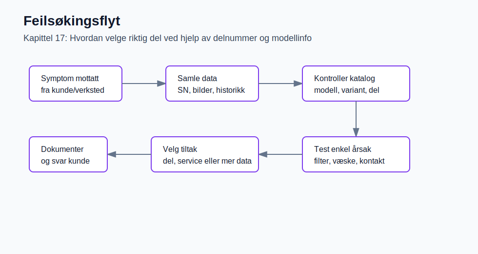

```mermaid
flowchart TD
    A[Symptom eller forespørsel mottatt] --> B[Samle serienummer, bilder og historikk]
    B --> C{Er motor og variant sikkert identifisert?}
    C -- Nei --> D[Be om mer dokumentasjon før del bekreftes]
    C -- Ja --> E[Kontroller delnummer og posisjon i katalog]
    E --> F{Stemmer symptom med foreslått del?}
    F -- Nei --> G[Foreslå feilsøking eller teknisk kontroll]
    F -- Ja --> H[Kontroller lager, pris og levering]
    H --> I[Send dokumentert kundesvar]
```

## Vedlikeholdsprosedyre
1. Avklar driftstimer, siste service og driftsmiljø.
2. Kontroller olje, filter, kjølevæske, sjøvannskrets, reimer, slanger og elektriske kontakter.
3. Sammenlign vedlikeholdsbehov med produsentens intervaller og faktisk bruk.
4. Anbefal servicekit når flere slitedeler bør skiftes samtidig.
5. Dokumenter hva som er anbefalt, hva kunden bestiller og eventuelle avvik fra normal prosedyre.

## Serienummeridentifikasjon
Serienummeridentifikasjon starter med å finne typeplate, motornummer eller annen unik identifikasjon. Be om bilde, ikke bare avskrift, fordi feil tegn, mellomrom og prefiks kan endre katalogoppslaget. Når serienummer ikke finnes, bygges identifikasjonen med modell, produksjonsår, bilder, tidligere fakturaer, servicehistorikk og delnummer fra monterte komponenter.

Minimumsdata bør være: fabrikat, modell, serienummer, eventuell product number/arrangement/CPL/motornummer, bilde av typeplate og bilde av motorens installasjon. Ved tvil skal saken stoppes for avklaring før del bekreftes.

## Reservedelsidentifikasjon
Reservedelsidentifikasjon skal bekrefte delnummer, posisjon, antall per motor, variant, side og eventuell erstatning. Dersom kunden oppgir et gammelt nummer, må det kontrolleres mot supersession. Dersom kunden bare sender bilde, skal bildet brukes som støtte, ikke som eneste grunnlag for bestilling.

Sjekk alltid om delnummeret gjelder enkeltkomponent, reparasjonssett, servicekit eller komplett enhet. Kontroller også om varen er høyre/venstre, gammel/ny type, standard/oversize eller knyttet til en bestemt produksjonsperiode.

## Bestillingsprosedyre
1. Opprett eller oppdater sak med kunde, fartøy, kontaktperson og tidsfrist.
2. Verifiser motoridentifikasjon og lagre bildedokumentasjon.
3. Finn korrekt delnummer i relevant katalog eller leverandørgrunnlag.
4. Kontroller supersession, antall, lagerstatus, pris, returvilkår og leveringstid.
5. Send ordrebekreftelse med delnummer, beskrivelse, antall, pris, levering og forbehold.
6. Følg opp leveransen til kunden har mottatt varen eller saken er lukket.

## Kvalitetspunkter før svar
- Har vi nok data til å gi et sikkert svar?
- Er delnummeret kontrollert mot riktig motorvariant?
- Er kundens tidsfrist realistisk med valgt fraktmåte?
- Er eventuelle forbehold skrevet tydelig?
- Kan en kollega forstå beslutningen ved å lese saken senere?

## Kapittelsammendrag
Hovedpoenget i kapittel 17 er at profesjonelt reservedelsarbeid krever struktur. Teknisk kunnskap, engelske fagtermer, praktisk feilsøking, dokumentasjon og kundedialog må henge sammen. Når medarbeideren jobber systematisk, reduseres feilbestillinger, kunden får bedre svar, og verkstedet kan planlegge arbeidet tryggere.

## Kryssreferanser
- For forrige tema, se kapittel 16: Oversikt over vanlige reservedelskategorier.
- For neste tema, se kapittel 18: Vanlige feil ved bestilling av reservedeler.
- For merkevise eksempler, se kapitlene 26-32.

## Fordypning for intern opplæring
Dette kapitlet skal brukes som arbeidsstandard, ikke bare som lesestoff. Når en ny medarbeider møter en sak om delnummer og modellinformasjon, skal vedkommende trene på å gå rolig fra fakta til vurdering og deretter til handling. I en marinemotorforhandler er konsekvensen av en feil ofte større enn verdien av selve delen. En feil impeller, feil sensor, feil filterinnsats eller feil pakningssett kan føre til tapt verkstedtid, utsatt avgang, irritert kunde og i verste fall ny driftsstans. Derfor skal hver sak behandles som en teknisk beslutning med sporbar dokumentasjon.

Profesjonelt nivå i dette kapitlet betyr at medarbeideren kan arbeide sikkert med delvalg. Før kunden får et bindende svar, skal opplysningene i saken kontrolleres mot motorens identitet, faktisk installasjon og relevant produsentterminologi. Det praktiske målet er ikke å finne et raskt nummer, men å kunne forklare hvorfor valgt del, kontrollpunkt eller kundesvar er riktig for akkurat denne motoren. Når informasjon mangler, skal medarbeideren beskrive hva som mangler, hvorfor det er nødvendig, og hvilket neste steg som bringer saken videre.

## Tekniske forklaringer
Teknisk forståelse i dette kapitlet skal bygges rundt part number, position number, revision, supersession, kit contents og fysisk kontroll mot demontert del. Medarbeideren må skille mellom synlig symptom, sannsynlig systemfeil og bestillbar komponent. En del kan se riktig ut på bilde, men likevel være feil dersom posisjon, variant, rating, kjøleroppsett, elektrisk plugg, monteringsside eller servicehistorikk ikke stemmer. Derfor skal teknisk vurdering alltid kobles til både funksjon og dokumentasjon: hva gjør komponenten, hvilket system påvirker den, og hvilken produsentkilde bekrefter at den passer.

I praksis betyr dette at tekniske data skal kobles til motorens faktiske installasjon. Marine motorer står ofte trangt, er utsatt for salt, vibrasjon, fukt og ujevnt belastningsmønster, og de kan være bygget om gjennom mange år. En motor kan ha original kjøler, ettermontert eksosbend, alternativ dynamo, endret filterbrakett eller annen sjøvannspumpe enn standard. Slike forhold gjør at delidentifikasjon må bygge på både produsentdata og synlig dokumentasjon fra motoren.

Produsentterminologi er en del av den tekniske forståelsen. Bruk uttrykk som Serial Number, Engine Number, Part Number, Service Kit, Exploded View, Supersession når de er relevante. Ikke oversett dem på en måte som fjerner presisjon. Skriv for eksempel «Engine Serial Number (ESN)» første gang og deretter «ESN» i saken dersom produsenten bruker dette. Skriv «Arrangement Number» når CAT-data krever det, «Product Number» når Volvo Penta bruker det, «CPL» når Cummins-konfigurasjon må kontrolleres, og «Model Code» når Yanmar-identifikasjon bygger på modellkode. Dette gjør dialogen med internasjonale leverandører mer presis.

## Illustrasjonsforslag
- Oversiktsdiagram som viser hvor delnummer og modellinformasjon passer inn i total arbeidsflyt fra kundeforespørsel til levert del.
- Nærbilde av typeplate/motorskilt med markering av serienummer, motornummer, modell og eventuell variantkode.
- Sprengskisse med markert posisjon, delnummer, antall per motor og mulige alternative versjoner.
- Feilsøkingsflyt med beslutningspunkter: mangler data, stemmer symptom, kreves mer teknisk kontroll, kan ordre bekreftes.
- Sammenligningsbilde av gammel og ny del der forskjell i tilkobling, side, lengde eller sensorplugg er markert.

## Virkelige verkstedseksempler
Eksempel 1: Et verksted står med en demontert komponent på benken og kunden venter på avklaring før fartøyet kan settes tilbake i drift. Verkstedet sender et nærbilde av delen, men ingen motorplate. En uerfaren medarbeider kan bli fristet til å søke på nummeret som står på støpegodset. En profesjonell medarbeider svarer at støpenummer ikke nødvendigvis er bestillbart delnummer, ber om bilde av typeplate, oversiktsbilde av motoren og bilde av monteringsstedet, og forklarer at dette hindrer feilbestilling. Når informasjonen kommer, kontrolleres delnummer mot sprengskisse, posisjon og antall. Først da gis pris og leveringstid.

Eksempel 2: En kunde ringer sent på dagen og sier at motoren har høy temperatur etter service. Kunden ønsker ny termostat. Medarbeideren skal ikke automatisk konkludere med termostatfeil. Spørsmålene bør avklare om impeller er byttet, om sjøvannsfilteret er rent, om kjølevæskenivået er riktig, om alarmen kommer ved tomgang eller belastning, og om det finnes lekkasje rundt varmeveksler eller slanger. Dersom kunden likevel vil bestille termostat, dokumenteres at feilsøking er anbefalt, og delnummer kontrolleres mot serienummer før ordre.

Eksempel 3: En intern selger mottar en gammel faktura med et delnummer som ikke lenger finnes. Riktig prosess er å kontrollere supersession, se om ny del krever tilhørende pakning, boltsett eller adapter, og notere både gammelt og nytt nummer i saken. Kunden skal få vite at delen er erstattet, hva som leveres, og om det finnes monteringsforbehold.

## Reservedelsidentifisering i praksis
Reservedelsidentifisering skal følge en fast rekkefølge. Først kontrolleres motorens identitet. Deretter kontrolleres delens system: drivstoff, luft, kjøling, smøring, eksos, elektrisk eller mekanisk kraftoverføring. Så kontrolleres posisjon i sprengskisse eller parts list. Til slutt kontrolleres antall, variant, supersession og leveringsstatus. Denne rekkefølgen hindrer at medarbeideren hopper direkte fra kundens ord til et tilfeldig delnummer.

Når en del har synlig nummer, må nummeret tolkes riktig. Mange komponenter har produksjonsnummer, støpenummer, leverandørnummer eller revisjonskode som ikke er det samme som bestillbart part number. Et filter kan ha nummer fra filterprodusent, men motorprodusentens parts catalogue kan bruke et annet nummer. En pumpe kan ha nummer på lokk, hus og komplett enhet. Spør derfor alltid: gjelder nummeret komplett del, reparasjonssett, underkomponent eller produsentens råkomponent?

## Serienummer og motornummer
Serienummer og motornummer er grunnlaget for korrekt katalogoppslag. Be kunden sende bilde av typeplate eller dataplate. Dersom kunden skriver nummeret manuelt, skal nummeret likevel kontrolleres mot bilde når det er mulig. Noter hele nummeret, inkludert prefiks, suffiks, bindestrek, mellomrom og eventuelle bokstaver. På enkelte produsenter kan små forskjeller peke til forskjellig produksjonsperiode, rating eller konfigurasjon.

Bruk motornummer sammen med modell, variant og applikasjon. En motor som driver generator kan ha andre deler enn en fremdriftsmotor. En motor i yrkesbåt kan ha annen rating enn samme motor i fritidsbåt. En eldre motor kan være bygget om med ny dynamo, annen sjøvannspumpe eller uoriginal filterbrakett. Dersom typeplate mangler, bygg identifikasjonen gjennom flere kilder: servicebok, tidligere faktura, bilder av motorens sider, nummer på pumpe, filter, turbo og gear, samt opplysninger om fartøy og produksjonsår.

## Feilsøking steg for steg
1. Definer symptomet med kundens egne ord og skriv det i saken. Skill mellom «kunden ønsker del» og «kunden beskriver feil».
2. Avklar når feilen oppstår: start, tomgang, belastning, marsjfart, varm motor, kald motor eller etter nylig service.
3. Kontroller grunnleggende forhold: væskenivå, filter, luft i drivstoff, sjøvannsstrøm, reimer, elektriske kontakter, sikringer og synlige lekkasjer.
4. Knytt symptomet til system: lav effekt peker ofte mot luft/drivstoff/eksos, høy temperatur mot kjøling, lavt oljetrykk mot smøring/sensor, startproblem mot batteri/starter/gløding/drivstoff.
5. Be om bilder eller måledata dersom symptomet ikke kan kobles sikkert til en del. Dette kan være bilde av alarmdisplay, trykkmåling, temperaturmåling eller bilde av montert komponent.
6. Kontroller relevant delnummer mot serienummer og variant. Dersom flere alternativer finnes, forklar kunden hva som skiller dem.
7. Dokumenter anbefalt tiltak, usikkerhet og eventuelle forbehold før ordre bekreftes.

## Vedlikehold
Vedlikehold skal vurderes mot driftstimer, produsentens maintenance schedule og faktisk driftsmiljø. Marine motorer som går korte turer, mye tomgang eller i salt miljø kan trenge hyppigere kontroll enn standard intervall antyder. Nye medarbeidere skal lære å spørre om siste service, hvilke filter som ble byttet, hvilken olje som ble brukt, om impeller er kontrollert, og om kjølevæske eller anoder er byttet etter plan.

En god vedlikeholdsanbefaling er konkret. I stedet for å skrive «ta service», bør medarbeideren foreslå relevante deler: olje- og drivstoffilter, luftfilter, impeller, reim, pakninger, anoder, kjølevæske og eventuelt servicekit. Dersom kunden har ukjent servicehistorikk, bør komplett servicekit vurderes. Dersom kunden har hatt overoppheting, bør sjøvannskrets og varmeveksler kontrolleres før bare én komponent byttes.

## Vanlige feil
- Serienummer leses feil fordi et tegn forveksles, for eksempel O/0 eller I/1.
- Kunden oppgir modellnavn, men ikke variant, rating eller applikasjon.
- Del velges ut fra bilde alene uten kontroll mot sprengskisse eller produsentkatalog.
- Supersession aksepteres uten å kontrollere om ny del krever tilbehør, pakning eller ombygging.
- Hastepress gjør at leveringsløfte gis før lagerstatus og fraktmulighet er bekreftet.
- Saksnotat mangler grunnlaget for beslutningen, slik at kollega ikke kan etterprøve valget.

## Kontrollspørsmål
- Hva er den viktigste tekniske risikoen i en sak som gjelder delnummer og modellinformasjon?
- Hvilke opplysninger må dokumenteres før bindende delnummer bekreftes?
- Hvordan forklarer du kunden hvorfor bilde av typeplate er nødvendig?
- Når bør du stoppe en ordre og be om mer dokumentasjon?
- Hvilke engelske produsentuttrykk bør du kunne bruke i denne typen sak?
- Hvordan dokumenterer du at et delnummer er erstattet av et nytt nummer?

## Praktisk sjekkliste for medarbeider
- Les saken som om en kollega skal overta den i morgen.
- Kontroller at motoridentifikasjon er dokumentert med bilde eller sikker kilde.
- Sjekk at delnummeret er knyttet til riktig posisjon i katalogen.
- Skriv tydelig om kunden har bedt om enkeltkomponent, servicekit eller komplett enhet.
- Noter om varen er spesialbestilling, utgått, erstattet eller ikke returbar.
- Send kundesvar med neste steg, ikke bare et løst delnummer.

## Kapittelspesifikk systemforståelse
For dette kapitlet er kjernen å forstå trygg bruk av delnummer og modellinformasjon. Medarbeideren skal kunne forklare dette med praktiske ord til både kunde og kollega. Det betyr at teknisk teori må kobles til konkrete handlinger: hvilke data skal innhentes, hvilke komponenter kan være berørt, hvilken produsentterminologi skal brukes, og hva må dokumenteres før saken kan gå videre. Et delnummer uten kontekst kan være farlig presist: det ser riktig ut, men kan gjelde feil variant.

Når systemet vurderes, skal medarbeideren først plassere problemet i riktig teknisk sammenheng. Dersom kunden beskriver en alarm, må man finne ut om alarmen kommer fra reelt mekanisk avvik, elektrisk sensorfeil, feil etter service eller feil tolkning av instrumentet. Dersom kunden beskriver en del, må man avklare om kunden mener komplett enhet, servicekit, reparasjonssett eller enkeltkomponent. Dersom kunden beskriver motoren med vanlig navn, må man kontrollere om produsenten bruker mer presise begreper i katalogen.

## Komponentoversikt og arbeidsgrense
Relevante komponenter og opplysninger i dette kapitlet omfatter: part number, old number, supersession, repair kit, complete assembly, left/right og quantity per engine. Listen er ikke ment som en erstatning for produsentens parts catalogue, men som en praktisk påminnelse om hva nye medarbeidere skal tenke på før de søker del. I interne saker skal komponentnavn skrives så presist som mulig. Bruk for eksempel «sjøvannspumpe / raw water pump» i stedet for bare «pumpe» når funksjonen er kjent, og «varmeveksler / heat exchanger» i stedet for bare «kjøler» når det er den komponenten saken gjelder.

Arbeidsgrensen for en reservedelsmedarbeider er også viktig. Medarbeideren skal ikke overta mekanikerens ansvar for demontering, måling eller diagnose på motoren, men skal kunne stille riktige spørsmål og foreslå riktig dokumentasjon. Når en sak går fra enkel delidentifikasjon til teknisk diagnose, skal dette markeres i saken. Da kan verksted, teknisk ansvarlig eller leverandør involveres med et klart spørsmål og et ryddig faktagrunnlag.

## Praktisk beslutningsregel
Bruk denne regelen i alle saker knyttet til kapitlet: Hvis motoridentifikasjon, komponentposisjon eller symptom ikke er sikkert nok dokumentert, skal medarbeideren ikke gi bindende delbekreftelse. Kunden kan få et foreløpig svar, men svaret må inneholde hva som mangler, hvorfor det mangler, og hva som skjer når informasjonen er mottatt. Dette er ikke treg service; det er profesjonell risikokontroll.

## Målrettet fordypning kapittel 11-20
### Delnummerlogikk, supersession og komplett enhet kontra enkeltdel
Delnummer må forstås som et kontrollpunkt, ikke som en garanti alene. Et part number kan gjelde enkeltkomponent, komplett assembly, repair kit, gasket set eller service kit. Mange feil skjer fordi kunden oppgir nummer fra en underkomponent mens de egentlig trenger komplett enhet. Andre feil skjer når gammelt nummer er erstattet av nytt, men ny del krever ekstra pakning, adapter eller endret monteringsprosedyre.

Medarbeideren skal alltid kontrollere delnummer mot motoridentitet, sprengskisseposisjon, antall per motor og eventuelle serienummerskiller. Ved supersession skal både gammelt og nytt nummer dokumenteres. Kundesvaret bør forklare: «Oppgitt nummer er erstattet av nytt nummer i produsentens katalog. Vi tilbyr nytt nummer, som er gjeldende reservedel for denne motoren.» Dersom kompatibilitet ikke er entydig, skal forbeholdet skrives før ordre.

### Praktisk anvendelse i opplæring
Instruktør bør bruke dette kapitlet med en konkret case der deltakerne først må identifisere manglende opplysninger, deretter velge riktig kataloggrunnlag og til slutt skrive et kort kundesvar. Deltakeren skal forklare hvilke produsentdata som er nødvendige, hvilke komponenter som kan være involvert, og hvor grensen går mellom reservedelsidentifisering og mekanisk diagnose. Målet er at medarbeideren ikke bare husker begreper, men kan bruke dem under tidspress i en reell kundesak.

## Realistisk opplæring i praksis
### Verkstedhistorie
En typisk sak i dette temaet starter med gammelt nummer er erstattet. Verkstedet trenger et raskt svar, men den erfarne medarbeideren stopper opp og spør først: hva vet vi sikkert, hva antar vi, og hva kan gi følgeskade hvis vi tar feil? I praksis betyr det at part number, posisjon og supersession må kobles til bilde, serienummer, komponentposisjon og kundens symptom før saken lukkes. Historien skal brukes i opplæring som en øvelse i å skrive et kort saksnotat: observasjon, vurdering, neste handling og forbehold.

### Kundehistorie
Kunden beskriver ofte problemet med driftsspråk: «motoren går tungt», «alarm kommer etter ti minutter», «jeg trenger den samme delen som sist» eller «båten skal ut i morgen». En profesjonell respons er rolig og konkret: bekreft behovet, forklar hvorfor identifikasjon trengs, be om riktig dokumentasjon og gi et realistisk tidspunkt for neste svar. Ikke korriger kunden unødvendig; oversett kundens språk til teknisk språk i saken.

### Typiske feil nye ansatte gjør
- søker på første synlige nummer uten å avklare om det er støpenummer, leverandørnummer eller bestillbart part number.
- lover levering før lagerstatus, frakt og returvilkår er kontrollert.
- antar at tidligere faktura alltid gjelder samme motorvariant.
- blander symptom og årsak, spesielt ved varme, lav effekt, startproblem og alarm.
- skriver for korte notater slik at kollega ikke kan forstå hvorfor valget ble tatt.

### Tips fra erfarne mekanikere og reservedelsselgere
- Se alltid etter systemet rundt delen: slanger, braketter, sensorer, reimer, kjølere og tilkoblinger forteller ofte mer enn delen alene.
- Still ett presist spørsmål om gangen når kunden er stresset; mange dårlige svar kommer av for lange spørsmålslister.
- Sammenlign gammel og ny del mot funksjon, ikke bare form. Riktig del skal passe, men også løse riktig problem.
- En erfaren reservedelsselger tenker i risiko: Hva er billigst å avklare nå, og hva blir dyrt hvis vi hopper over det?

### Vanlige kundespørsmål
| Spørsmål fra kunde | Profesjonelt svar |
|---|---|
| «Kan du bare sende samme del som sist?» | «Ja, hvis vi først bekrefter at det gjelder samme motor, samme posisjon og ingen supersession siden sist.» |
| «Holder det med bilde?» | «Bilde hjelper, men vi trenger også motoridentitet for å sikre variant og delnummer.» |
| «Hvorfor tar dette tid?» | «Fordi feil del kan gi ny driftsstans. Vi kontrollerer grunnlaget før vi lover levering.» |

### Beslutningstre for saken
| Trinn | Spørsmål | Handling |
|---|---|---|
| 1 | Er motoridentitet dokumentert med bilde eller sikker historikk? | Hvis nei: be om typeplate/dataplate eller alternativ dokumentasjon. |
| 2 | Er komponentens funksjon og posisjon kjent? | Hvis nei: be om oversiktsbilde og bilde av monteringssted. |
| 3 | Stemmer kundens symptom med delen som ønskes? | Hvis nei: anbefal feilsøking før del bestilles. |
| 4 | Finnes det supersession, kit eller variantvalg? | Kontroller produsentkilde og skriv forbehold i saken. |
| 5 | Kan pris, levering og returvilkår bekreftes? | Send dokumentert svar med neste steg og tydelig gyldighet. |

### Rask oppslagstabell
| Situasjon | Kontroller først | Vanlig fallgruve |
|---|---|---|
| Hasteordre | sikker motor-ID, lager, fraktfrist | levering loves før teknisk kontroll |
| Del fra bilde | posisjon, skala, tilkoblinger, nummer | bilde brukes som eneste beslutningsgrunnlag |
| Gammelt delnummer | supersession og kitinnhold | ny del krever ekstra pakning eller adapter |
| Uklart symptom | driftssituasjon, alarm, siste service | symptom blir tolket som sikker komponentfeil |

### Praktisk sjekkliste og inspeksjonsrutine
- Start med motoridentitet: fabrikat, modell, serienummer, variant, applikasjon og bilde av skilt.
- Kontroller området rundt komponenten: lekkasje, korrosjon, knekte fester, slitasje, varmemerker og uoriginale endringer.
- Spør om siste vedlikehold: olje, filter, impeller, reimer, kjølevæske, anoder og drivstoffilter.
- Noter driftstype: fritidsbruk, yrkesbruk, generator, fremdrift, tomgangsdrift eller langvarig høy belastning.
- Avklar om saken gjelder akutt drift, planlagt service, reklamasjon eller lagerpåfyll.

### Generelle vedlikeholdsintervaller som opplæringspunkt
| Kontrollpunkt | Typisk vurdering i opplæring | Må verifiseres |
|---|---|---|
| Olje og oljefilter | ofte basert på timer og kalender | produsentens maintenance schedule |
| Drivstoffilter/vannutskiller | hyppigere ved dårlig drivstoff eller sesongstart | motor- og filterspesifikasjon |
| Impeller og sjøvannskrets | kontrolleres særlig før sesong og etter varmgang | produsentens intervall og installasjon |
| Reimer, slanger og klemmer | visuell kontroll ved service og feilsøking | dimensjon, stramming og delnummer |

### Produsentverifikasjon
Alle konkrete delnumre, momentverdier, serviceintervaller, garantikrav, programvaredata og produsentspesifikke grenser skal kontrolleres mot offisiell produsentdokumentasjon før de brukes i tilbud, ordre eller verkstedinstruks. Marker tydelig i saken når svaret bygger på antakelse, eldre historikk, bilde uten motor-ID eller generell erfaring. Intervaller i tabellen er generelle opplæringspunkter. Faktiske intervaller styres av produsent, motorvariant, driftstimer, kalenderkrav, belastning og miljø.

## Produsentverifikasjon og faglig forbehold
Når saken gjelder delnummer, serienummer, serviceintervall, momentdata, garanti, elektronikk eller kompatibilitet, skal opplysningen verifiseres mot produsentens dokumentasjon eller autorisert leverandør før bindende tilbud eller teknisk konklusjon gis. Manualen beskriver arbeidsmetode og risikopunkter; den erstatter ikke gjeldende parts catalogue, service manual, service bulletin eller produsentportal. Marker saken internt dersom opplysningen bygger på antakelse, eldre historikk eller bilde uten bekreftet motoridentitet.

## Quiz med fasit
1. Hvilke tekniske data bør alltid samles før en del bekreftes?
2. Hvorfor er engelsk terminologi viktig i marine reservedeler?
3. Hva bør gjøres dersom kunden bare sender et bilde av delen?
4. Hvilke punkter bør kontrolleres før ordrebekreftelse sendes?
5. Hvorfor skal feilsøking dokumenteres, selv når kunden allerede ber om en bestemt del?

### Svar
1. Fabrikat, modell, serienummer, variantdata, bilde av typeplate, delnummer, posisjon og kundens symptombeskrivelse.
2. Fordi kataloger, portaler, servicemanualer og leverandørdialog ofte bruker engelske begreper som må forstås presist.
3. Be om serienummer, oversiktsbilde av motoren og eventuelle nummer på delen; bildet brukes som støtte, ikke eneste grunnlag.
4. Delnummer, antall, variant, pris, lagerstatus, leveringstid, frakt, returvilkår og eventuelle forbehold.
5. Fordi symptomet kan ha flere årsaker, og dokumentasjon viser hvorfor anbefalingen ble gitt.

---

# Kapittel 18: Vanlige feil ved bestilling av reservedeler

## Kapittelrolle
Dette kapitlet gir en grundig praktisk innføring i feilbestilling. Temaet er viktig fordi reservedelsarbeid i marine miljøer kombinerer teknisk forståelse, presis kundedialog, dokumentert saksbehandling og realistisk leveranseoppfølging. Målet er at en ny medarbeider skal kunne bruke kunnskapen direkte i arbeid med verksted, kunde, lager og leverandør.

## Læringsmål
Etter kapitlet skal deltakeren kunne:
- forklare hovedbegrepene innen feilbestilling
- bruke serienummer, modellinformasjon og delnummer i praktisk reservedelsarbeid
- kommunisere trygt med kunde, verksted, lager og leverandør
- dokumentere beslutninger slik at andre kan etterprøve saken
- kjenne igjen vanlige feil og velge riktig neste handling

## English technical terminology
- **Serial Number:** engelsk fagterm som ofte brukes i kataloger, servicelitteratur, leverandørportaler og internasjonal kundedialog.
- **Part Number:** engelsk fagterm som ofte brukes i kataloger, servicelitteratur, leverandørportaler og internasjonal kundedialog.
- **Engine Model:** engelsk fagterm som ofte brukes i kataloger, servicelitteratur, leverandørportaler og internasjonal kundedialog.
- **Variant:** engelsk fagterm som ofte brukes i kataloger, servicelitteratur, leverandørportaler og internasjonal kundedialog.
- **Service Kit:** engelsk fagterm som ofte brukes i kataloger, servicelitteratur, leverandørportaler og internasjonal kundedialog.
- **Troubleshooting:** engelsk fagterm som ofte brukes i kataloger, servicelitteratur, leverandørportaler og internasjonal kundedialog.
- **Maintenance:** engelsk fagterm som ofte brukes i kataloger, servicelitteratur, leverandørportaler og internasjonal kundedialog.
- **Ordering Procedure:** engelsk fagterm som ofte brukes i kataloger, servicelitteratur, leverandørportaler og internasjonal kundedialog.
- **Supersession:** engelsk fagterm som ofte brukes i kataloger, servicelitteratur, leverandørportaler og internasjonal kundedialog.
- **Technical Support:** engelsk fagterm som ofte brukes i kataloger, servicelitteratur, leverandørportaler og internasjonal kundedialog.

## Hoveddiagram

## Tekniske systemillustrasjoner

## Grundig forklaring
Hvordan vanlige bestillingsfeil oppstår og forebygges må forstås både teknisk og praktisk. I marine reservedeler er det sjelden nok å vite hva kunden kaller delen. Medarbeideren må forstå hvilken funksjon delen har, hvor den sitter, hvilken motorvariant den tilhører, og hva som skjer dersom feil del bestilles. Derfor skal tekniske data, kundens beskrivelse og dokumentert katalogoppslag alltid vurderes sammen.

En god sak har fire kjennetegn: den har tydelig identifikasjon, tydelig problem- eller delbeskrivelse, tydelig beslutningsgrunnlag og tydelig oppfølging. Dersom ett av disse punktene mangler, skal saken markeres som usikker før kunden får et bindende svar.

## Praktisk verkstedeksempel
Et verksted står med demontert komponent og trenger rask avklaring. Medarbeideren registrerer kunde, fartøy, motorinformasjon og tidsfrist, ber om bilder av typeplate og komponent, sjekker katalog og lager, og sender et kort skriftlig svar med valgt del, grunnlag for valget og neste oppdateringstidspunkt.

## Kundesupporteksempel
Kunde: 'Motoren går dårlig, kan dere sende riktig del?' Profesjonelt svar: 'Vi kan hjelpe, men først må vi skille mellom symptom og delbehov. Send serienummer, bilde av motorplate, bilde av området feilen gjelder og en kort beskrivelse av når feilen oppstår. Da kan vi foreslå riktig del eller riktig neste feilsøkingstrinn.'

## Vanlige feil og årsaker
- feil eller ufullstendig serienummer.
- delnummer som er erstattet uten at saken dokumenteres.
- symptom som tolkes som delbehov uten feilsøking.
- kunde har bilde av lignende del, men ikke korrekt motorvariant.
- manglende avklaring av antall, side, posisjon eller leveringstid.

## Feilsøkingsflyt

```mermaid
flowchart TD
    A[Symptom eller forespørsel mottatt] --> B[Samle serienummer, bilder og historikk]
    B --> C{Er motor og variant sikkert identifisert?}
    C -- Nei --> D[Be om mer dokumentasjon før del bekreftes]
    C -- Ja --> E[Kontroller delnummer og posisjon i katalog]
    E --> F{Stemmer symptom med foreslått del?}
    F -- Nei --> G[Foreslå feilsøking eller teknisk kontroll]
    F -- Ja --> H[Kontroller lager, pris og levering]
    H --> I[Send dokumentert kundesvar]
```

## Vedlikeholdsprosedyre
1. Avklar driftstimer, siste service og driftsmiljø.
2. Kontroller olje, filter, kjølevæske, sjøvannskrets, reimer, slanger og elektriske kontakter.
3. Sammenlign vedlikeholdsbehov med produsentens intervaller og faktisk bruk.
4. Anbefal servicekit når flere slitedeler bør skiftes samtidig.
5. Dokumenter hva som er anbefalt, hva kunden bestiller og eventuelle avvik fra normal prosedyre.

## Serienummeridentifikasjon
Serienummeridentifikasjon starter med å finne typeplate, motornummer eller annen unik identifikasjon. Be om bilde, ikke bare avskrift, fordi feil tegn, mellomrom og prefiks kan endre katalogoppslaget. Når serienummer ikke finnes, bygges identifikasjonen med modell, produksjonsår, bilder, tidligere fakturaer, servicehistorikk og delnummer fra monterte komponenter.

Minimumsdata bør være: fabrikat, modell, serienummer, eventuell product number/arrangement/CPL/motornummer, bilde av typeplate og bilde av motorens installasjon. Ved tvil skal saken stoppes for avklaring før del bekreftes.

## Reservedelsidentifikasjon
Reservedelsidentifikasjon skal bekrefte delnummer, posisjon, antall per motor, variant, side og eventuell erstatning. Dersom kunden oppgir et gammelt nummer, må det kontrolleres mot supersession. Dersom kunden bare sender bilde, skal bildet brukes som støtte, ikke som eneste grunnlag for bestilling.

Sjekk alltid om delnummeret gjelder enkeltkomponent, reparasjonssett, servicekit eller komplett enhet. Kontroller også om varen er høyre/venstre, gammel/ny type, standard/oversize eller knyttet til en bestemt produksjonsperiode.

## Bestillingsprosedyre
1. Opprett eller oppdater sak med kunde, fartøy, kontaktperson og tidsfrist.
2. Verifiser motoridentifikasjon og lagre bildedokumentasjon.
3. Finn korrekt delnummer i relevant katalog eller leverandørgrunnlag.
4. Kontroller supersession, antall, lagerstatus, pris, returvilkår og leveringstid.
5. Send ordrebekreftelse med delnummer, beskrivelse, antall, pris, levering og forbehold.
6. Følg opp leveransen til kunden har mottatt varen eller saken er lukket.

## Kvalitetspunkter før svar
- Har vi nok data til å gi et sikkert svar?
- Er delnummeret kontrollert mot riktig motorvariant?
- Er kundens tidsfrist realistisk med valgt fraktmåte?
- Er eventuelle forbehold skrevet tydelig?
- Kan en kollega forstå beslutningen ved å lese saken senere?

## Kapittelsammendrag
Hovedpoenget i kapittel 18 er at profesjonelt reservedelsarbeid krever struktur. Teknisk kunnskap, engelske fagtermer, praktisk feilsøking, dokumentasjon og kundedialog må henge sammen. Når medarbeideren jobber systematisk, reduseres feilbestillinger, kunden får bedre svar, og verkstedet kan planlegge arbeidet tryggere.

## Kryssreferanser
- For forrige tema, se kapittel 17: Hvordan velge riktig del ved hjelp av delnummer og modellinfo.
- For neste tema, se kapittel 19: Prioritering av hastesaker og akutte behov.
- For grunnleggende identifikasjon, se kapittel 12 og 17.
- For merkevise eksempler, se kapitlene 26-32.

## Fordypning for intern opplæring
Dette kapitlet skal brukes som arbeidsstandard, ikke bare som lesestoff. Når en ny medarbeider møter en sak om vanlige bestillingsfeil, skal vedkommende trene på å gå rolig fra fakta til vurdering og deretter til handling. I en marinemotorforhandler er konsekvensen av en feil ofte større enn verdien av selve delen. En feil impeller, feil sensor, feil filterinnsats eller feil pakningssett kan føre til tapt verkstedtid, utsatt avgang, irritert kunde og i verste fall ny driftsstans. Derfor skal hver sak behandles som en teknisk beslutning med sporbar dokumentasjon.

Profesjonelt nivå i dette kapitlet betyr at medarbeideren kan arbeide sikkert med feilbestillinger. Før kunden får et bindende svar, skal opplysningene i saken kontrolleres mot motorens identitet, faktisk installasjon og relevant produsentterminologi. Det praktiske målet er ikke å finne et raskt nummer, men å kunne forklare hvorfor valgt del, kontrollpunkt eller kundesvar er riktig for akkurat denne motoren. Når informasjon mangler, skal medarbeideren beskrive hva som mangler, hvorfor det er nødvendig, og hvilket neste steg som bringer saken videre.

## Tekniske forklaringer
Teknisk forståelse i dette kapitlet skal bygges rundt modellforveksling, feil side, feil kit, støpenummer, utdatert delnummer og hasteløfter. Medarbeideren må skille mellom synlig symptom, sannsynlig systemfeil og bestillbar komponent. En del kan se riktig ut på bilde, men likevel være feil dersom posisjon, variant, rating, kjøleroppsett, elektrisk plugg, monteringsside eller servicehistorikk ikke stemmer. Derfor skal teknisk vurdering alltid kobles til både funksjon og dokumentasjon: hva gjør komponenten, hvilket system påvirker den, og hvilken produsentkilde bekrefter at den passer.

I praksis betyr dette at tekniske data skal kobles til motorens faktiske installasjon. Marine motorer står ofte trangt, er utsatt for salt, vibrasjon, fukt og ujevnt belastningsmønster, og de kan være bygget om gjennom mange år. En motor kan ha original kjøler, ettermontert eksosbend, alternativ dynamo, endret filterbrakett eller annen sjøvannspumpe enn standard. Slike forhold gjør at delidentifikasjon må bygge på både produsentdata og synlig dokumentasjon fra motoren.

Produsentterminologi er en del av den tekniske forståelsen. Bruk uttrykk som Serial Number, Engine Number, Part Number, Service Kit, Exploded View, Supersession når de er relevante. Ikke oversett dem på en måte som fjerner presisjon. Skriv for eksempel «Engine Serial Number (ESN)» første gang og deretter «ESN» i saken dersom produsenten bruker dette. Skriv «Arrangement Number» når CAT-data krever det, «Product Number» når Volvo Penta bruker det, «CPL» når Cummins-konfigurasjon må kontrolleres, og «Model Code» når Yanmar-identifikasjon bygger på modellkode. Dette gjør dialogen med internasjonale leverandører mer presis.

## Illustrasjonsforslag
- Oversiktsdiagram som viser hvor vanlige bestillingsfeil passer inn i total arbeidsflyt fra kundeforespørsel til levert del.
- Nærbilde av typeplate/motorskilt med markering av serienummer, motornummer, modell og eventuell variantkode.
- Sprengskisse med markert posisjon, delnummer, antall per motor og mulige alternative versjoner.
- Feilsøkingsflyt med beslutningspunkter: mangler data, stemmer symptom, kreves mer teknisk kontroll, kan ordre bekreftes.
- Sammenligningsbilde av gammel og ny del der forskjell i tilkobling, side, lengde eller sensorplugg er markert.

## Virkelige verkstedseksempler
Eksempel 1: Et verksted står med en demontert komponent på benken og kunden venter på avklaring før fartøyet kan settes tilbake i drift. Verkstedet sender et nærbilde av delen, men ingen motorplate. En uerfaren medarbeider kan bli fristet til å søke på nummeret som står på støpegodset. En profesjonell medarbeider svarer at støpenummer ikke nødvendigvis er bestillbart delnummer, ber om bilde av typeplate, oversiktsbilde av motoren og bilde av monteringsstedet, og forklarer at dette hindrer feilbestilling. Når informasjonen kommer, kontrolleres delnummer mot sprengskisse, posisjon og antall. Først da gis pris og leveringstid.

Eksempel 2: En kunde ringer sent på dagen og sier at motoren har høy temperatur etter service. Kunden ønsker ny termostat. Medarbeideren skal ikke automatisk konkludere med termostatfeil. Spørsmålene bør avklare om impeller er byttet, om sjøvannsfilteret er rent, om kjølevæskenivået er riktig, om alarmen kommer ved tomgang eller belastning, og om det finnes lekkasje rundt varmeveksler eller slanger. Dersom kunden likevel vil bestille termostat, dokumenteres at feilsøking er anbefalt, og delnummer kontrolleres mot serienummer før ordre.

Eksempel 3: En intern selger mottar en gammel faktura med et delnummer som ikke lenger finnes. Riktig prosess er å kontrollere supersession, se om ny del krever tilhørende pakning, boltsett eller adapter, og notere både gammelt og nytt nummer i saken. Kunden skal få vite at delen er erstattet, hva som leveres, og om det finnes monteringsforbehold.

## Reservedelsidentifisering i praksis
Reservedelsidentifisering skal følge en fast rekkefølge. Først kontrolleres motorens identitet. Deretter kontrolleres delens system: drivstoff, luft, kjøling, smøring, eksos, elektrisk eller mekanisk kraftoverføring. Så kontrolleres posisjon i sprengskisse eller parts list. Til slutt kontrolleres antall, variant, supersession og leveringsstatus. Denne rekkefølgen hindrer at medarbeideren hopper direkte fra kundens ord til et tilfeldig delnummer.

Når en del har synlig nummer, må nummeret tolkes riktig. Mange komponenter har produksjonsnummer, støpenummer, leverandørnummer eller revisjonskode som ikke er det samme som bestillbart part number. Et filter kan ha nummer fra filterprodusent, men motorprodusentens parts catalogue kan bruke et annet nummer. En pumpe kan ha nummer på lokk, hus og komplett enhet. Spør derfor alltid: gjelder nummeret komplett del, reparasjonssett, underkomponent eller produsentens råkomponent?

## Serienummer og motornummer
Serienummer og motornummer er grunnlaget for korrekt katalogoppslag. Be kunden sende bilde av typeplate eller dataplate. Dersom kunden skriver nummeret manuelt, skal nummeret likevel kontrolleres mot bilde når det er mulig. Noter hele nummeret, inkludert prefiks, suffiks, bindestrek, mellomrom og eventuelle bokstaver. På enkelte produsenter kan små forskjeller peke til forskjellig produksjonsperiode, rating eller konfigurasjon.

Bruk motornummer sammen med modell, variant og applikasjon. En motor som driver generator kan ha andre deler enn en fremdriftsmotor. En motor i yrkesbåt kan ha annen rating enn samme motor i fritidsbåt. En eldre motor kan være bygget om med ny dynamo, annen sjøvannspumpe eller uoriginal filterbrakett. Dersom typeplate mangler, bygg identifikasjonen gjennom flere kilder: servicebok, tidligere faktura, bilder av motorens sider, nummer på pumpe, filter, turbo og gear, samt opplysninger om fartøy og produksjonsår.

## Feilsøking steg for steg
1. Definer symptomet med kundens egne ord og skriv det i saken. Skill mellom «kunden ønsker del» og «kunden beskriver feil».
2. Avklar når feilen oppstår: start, tomgang, belastning, marsjfart, varm motor, kald motor eller etter nylig service.
3. Kontroller grunnleggende forhold: væskenivå, filter, luft i drivstoff, sjøvannsstrøm, reimer, elektriske kontakter, sikringer og synlige lekkasjer.
4. Knytt symptomet til system: lav effekt peker ofte mot luft/drivstoff/eksos, høy temperatur mot kjøling, lavt oljetrykk mot smøring/sensor, startproblem mot batteri/starter/gløding/drivstoff.
5. Be om bilder eller måledata dersom symptomet ikke kan kobles sikkert til en del. Dette kan være bilde av alarmdisplay, trykkmåling, temperaturmåling eller bilde av montert komponent.
6. Kontroller relevant delnummer mot serienummer og variant. Dersom flere alternativer finnes, forklar kunden hva som skiller dem.
7. Dokumenter anbefalt tiltak, usikkerhet og eventuelle forbehold før ordre bekreftes.

## Vedlikehold
Vedlikehold skal vurderes mot driftstimer, produsentens maintenance schedule og faktisk driftsmiljø. Marine motorer som går korte turer, mye tomgang eller i salt miljø kan trenge hyppigere kontroll enn standard intervall antyder. Nye medarbeidere skal lære å spørre om siste service, hvilke filter som ble byttet, hvilken olje som ble brukt, om impeller er kontrollert, og om kjølevæske eller anoder er byttet etter plan.

En god vedlikeholdsanbefaling er konkret. I stedet for å skrive «ta service», bør medarbeideren foreslå relevante deler: olje- og drivstoffilter, luftfilter, impeller, reim, pakninger, anoder, kjølevæske og eventuelt servicekit. Dersom kunden har ukjent servicehistorikk, bør komplett servicekit vurderes. Dersom kunden har hatt overoppheting, bør sjøvannskrets og varmeveksler kontrolleres før bare én komponent byttes.

## Vanlige feil
- Serienummer leses feil fordi et tegn forveksles, for eksempel O/0 eller I/1.
- Kunden oppgir modellnavn, men ikke variant, rating eller applikasjon.
- Del velges ut fra bilde alene uten kontroll mot sprengskisse eller produsentkatalog.
- Supersession aksepteres uten å kontrollere om ny del krever tilbehør, pakning eller ombygging.
- Hastepress gjør at leveringsløfte gis før lagerstatus og fraktmulighet er bekreftet.
- Saksnotat mangler grunnlaget for beslutningen, slik at kollega ikke kan etterprøve valget.

## Kontrollspørsmål
- Hva er den viktigste tekniske risikoen i en sak som gjelder vanlige bestillingsfeil?
- Hvilke opplysninger må dokumenteres før bindende delnummer bekreftes?
- Hvordan forklarer du kunden hvorfor bilde av typeplate er nødvendig?
- Når bør du stoppe en ordre og be om mer dokumentasjon?
- Hvilke engelske produsentuttrykk bør du kunne bruke i denne typen sak?
- Hvordan dokumenterer du at et delnummer er erstattet av et nytt nummer?

## Praktisk sjekkliste for medarbeider
- Les saken som om en kollega skal overta den i morgen.
- Kontroller at motoridentifikasjon er dokumentert med bilde eller sikker kilde.
- Sjekk at delnummeret er knyttet til riktig posisjon i katalogen.
- Skriv tydelig om kunden har bedt om enkeltkomponent, servicekit eller komplett enhet.
- Noter om varen er spesialbestilling, utgått, erstattet eller ikke returbar.
- Send kundesvar med neste steg, ikke bare et løst delnummer.

## Kapittelspesifikk systemforståelse
For dette kapitlet er kjernen å forstå årsaker til feilbestillinger og hvordan de oppdages tidlig. Medarbeideren skal kunne forklare dette med praktiske ord til både kunde og kollega. Det betyr at teknisk teori må kobles til konkrete handlinger: hvilke data skal innhentes, hvilke komponenter kan være berørt, hvilken produsentterminologi skal brukes, og hva må dokumenteres før saken kan gå videre. Feilbestilling forebygges best ved fast arbeidsmetode, ikke ved hukommelse.

Når systemet vurderes, skal medarbeideren først plassere problemet i riktig teknisk sammenheng. Dersom kunden beskriver en alarm, må man finne ut om alarmen kommer fra reelt mekanisk avvik, elektrisk sensorfeil, feil etter service eller feil tolkning av instrumentet. Dersom kunden beskriver en del, må man avklare om kunden mener komplett enhet, servicekit, reparasjonssett eller enkeltkomponent. Dersom kunden beskriver motoren med vanlig navn, må man kontrollere om produsenten bruker mer presise begreper i katalogen.

## Komponentoversikt og arbeidsgrense
Relevante komponenter og opplysninger i dette kapitlet omfatter: feil variant, feil antall, feil side, gammel supersession, bildebasert gjetting og uklare forbehold. Listen er ikke ment som en erstatning for produsentens parts catalogue, men som en praktisk påminnelse om hva nye medarbeidere skal tenke på før de søker del. I interne saker skal komponentnavn skrives så presist som mulig. Bruk for eksempel «sjøvannspumpe / raw water pump» i stedet for bare «pumpe» når funksjonen er kjent, og «varmeveksler / heat exchanger» i stedet for bare «kjøler» når det er den komponenten saken gjelder.

Arbeidsgrensen for en reservedelsmedarbeider er også viktig. Medarbeideren skal ikke overta mekanikerens ansvar for demontering, måling eller diagnose på motoren, men skal kunne stille riktige spørsmål og foreslå riktig dokumentasjon. Når en sak går fra enkel delidentifikasjon til teknisk diagnose, skal dette markeres i saken. Da kan verksted, teknisk ansvarlig eller leverandør involveres med et klart spørsmål og et ryddig faktagrunnlag.

## Praktisk beslutningsregel
Bruk denne regelen i alle saker knyttet til kapitlet: Hvis motoridentifikasjon, komponentposisjon eller symptom ikke er sikkert nok dokumentert, skal medarbeideren ikke gi bindende delbekreftelse. Kunden kan få et foreløpig svar, men svaret må inneholde hva som mangler, hvorfor det mangler, og hva som skjer når informasjonen er mottatt. Dette er ikke treg service; det er profesjonell risikokontroll.

## Målrettet fordypning kapittel 11-20
### Feilbestilling som prosessfeil, ikke personfeil
Vanlige feilbestillinger oppstår sjelden fordi én person er uforsiktig; de oppstår fordi prosessen mangler et kontrollpunkt. Typiske årsaker er muntlig bestilling uten bilde, modellnavn uten serienummer, delnummer uten posisjon, hasteordre uten forbehold, eller leverandørbekreftelse som ikke kontrolleres mot opprinnelig forespørsel. En profesjonell organisasjon bygger rutiner som fanger disse feilene før kunden rammes.

Når feil del er oppdaget, skal saken analyseres rolig. Var motoren riktig identifisert? Var delen riktig i katalogen? Ble supersession kontrollert? Var motoren ombygget? Var kundens gamle del original? Ble høyre/venstre side eller antall per motor misforstått? Svarene brukes til læring og forbedring. Dette kapitlet bør derfor brukes i intern opplæring sammen med faktiske avvikssaker, slik at nye medarbeidere lærer å se risikomønstre.

### Praktisk anvendelse i opplæring
Instruktør bør bruke dette kapitlet med en konkret case der deltakerne først må identifisere manglende opplysninger, deretter velge riktig kataloggrunnlag og til slutt skrive et kort kundesvar. Deltakeren skal forklare hvilke produsentdata som er nødvendige, hvilke komponenter som kan være involvert, og hvor grensen går mellom reservedelsidentifisering og mekanisk diagnose. Målet er at medarbeideren ikke bare husker begreper, men kan bruke dem under tidspress i en reell kundesak.

## Realistisk opplæring i praksis
### Verkstedhistorie
En typisk sak i dette temaet starter med del ser lik ut, men har feil side. Verkstedet trenger et raskt svar, men den erfarne medarbeideren stopper opp og spør først: hva vet vi sikkert, hva antar vi, og hva kan gi følgeskade hvis vi tar feil? I praksis betyr det at vanlige bestillingsfeil må kobles til bilde, serienummer, komponentposisjon og kundens symptom før saken lukkes. Historien skal brukes i opplæring som en øvelse i å skrive et kort saksnotat: observasjon, vurdering, neste handling og forbehold.

### Kundehistorie
Kunden beskriver ofte problemet med driftsspråk: «motoren går tungt», «alarm kommer etter ti minutter», «jeg trenger den samme delen som sist» eller «båten skal ut i morgen». En profesjonell respons er rolig og konkret: bekreft behovet, forklar hvorfor identifikasjon trengs, be om riktig dokumentasjon og gi et realistisk tidspunkt for neste svar. Ikke korriger kunden unødvendig; oversett kundens språk til teknisk språk i saken.

### Typiske feil nye ansatte gjør
- søker på første synlige nummer uten å avklare om det er støpenummer, leverandørnummer eller bestillbart part number.
- lover levering før lagerstatus, frakt og returvilkår er kontrollert.
- antar at tidligere faktura alltid gjelder samme motorvariant.
- blander symptom og årsak, spesielt ved varme, lav effekt, startproblem og alarm.
- skriver for korte notater slik at kollega ikke kan forstå hvorfor valget ble tatt.

### Tips fra erfarne mekanikere og reservedelsselgere
- Se alltid etter systemet rundt delen: slanger, braketter, sensorer, reimer, kjølere og tilkoblinger forteller ofte mer enn delen alene.
- Still ett presist spørsmål om gangen når kunden er stresset; mange dårlige svar kommer av for lange spørsmålslister.
- Sammenlign gammel og ny del mot funksjon, ikke bare form. Riktig del skal passe, men også løse riktig problem.
- En erfaren reservedelsselger tenker i risiko: Hva er billigst å avklare nå, og hva blir dyrt hvis vi hopper over det?

### Vanlige kundespørsmål
| Spørsmål fra kunde | Profesjonelt svar |
|---|---|
| «Kan du bare sende samme del som sist?» | «Ja, hvis vi først bekrefter at det gjelder samme motor, samme posisjon og ingen supersession siden sist.» |
| «Holder det med bilde?» | «Bilde hjelper, men vi trenger også motoridentitet for å sikre variant og delnummer.» |
| «Hvorfor tar dette tid?» | «Fordi feil del kan gi ny driftsstans. Vi kontrollerer grunnlaget før vi lover levering.» |

### Beslutningstre for saken
| Trinn | Spørsmål | Handling |
|---|---|---|
| 1 | Er motoridentitet dokumentert med bilde eller sikker historikk? | Hvis nei: be om typeplate/dataplate eller alternativ dokumentasjon. |
| 2 | Er komponentens funksjon og posisjon kjent? | Hvis nei: be om oversiktsbilde og bilde av monteringssted. |
| 3 | Stemmer kundens symptom med delen som ønskes? | Hvis nei: anbefal feilsøking før del bestilles. |
| 4 | Finnes det supersession, kit eller variantvalg? | Kontroller produsentkilde og skriv forbehold i saken. |
| 5 | Kan pris, levering og returvilkår bekreftes? | Send dokumentert svar med neste steg og tydelig gyldighet. |

### Rask oppslagstabell
| Situasjon | Kontroller først | Vanlig fallgruve |
|---|---|---|
| Hasteordre | sikker motor-ID, lager, fraktfrist | levering loves før teknisk kontroll |
| Del fra bilde | posisjon, skala, tilkoblinger, nummer | bilde brukes som eneste beslutningsgrunnlag |
| Gammelt delnummer | supersession og kitinnhold | ny del krever ekstra pakning eller adapter |
| Uklart symptom | driftssituasjon, alarm, siste service | symptom blir tolket som sikker komponentfeil |

### Praktisk sjekkliste og inspeksjonsrutine
- Start med motoridentitet: fabrikat, modell, serienummer, variant, applikasjon og bilde av skilt.
- Kontroller området rundt komponenten: lekkasje, korrosjon, knekte fester, slitasje, varmemerker og uoriginale endringer.
- Spør om siste vedlikehold: olje, filter, impeller, reimer, kjølevæske, anoder og drivstoffilter.
- Noter driftstype: fritidsbruk, yrkesbruk, generator, fremdrift, tomgangsdrift eller langvarig høy belastning.
- Avklar om saken gjelder akutt drift, planlagt service, reklamasjon eller lagerpåfyll.

### Generelle vedlikeholdsintervaller som opplæringspunkt
| Kontrollpunkt | Typisk vurdering i opplæring | Må verifiseres |
|---|---|---|
| Olje og oljefilter | ofte basert på timer og kalender | produsentens maintenance schedule |
| Drivstoffilter/vannutskiller | hyppigere ved dårlig drivstoff eller sesongstart | motor- og filterspesifikasjon |
| Impeller og sjøvannskrets | kontrolleres særlig før sesong og etter varmgang | produsentens intervall og installasjon |
| Reimer, slanger og klemmer | visuell kontroll ved service og feilsøking | dimensjon, stramming og delnummer |

### Produsentverifikasjon
Alle konkrete delnumre, momentverdier, serviceintervaller, garantikrav, programvaredata og produsentspesifikke grenser skal kontrolleres mot offisiell produsentdokumentasjon før de brukes i tilbud, ordre eller verkstedinstruks. Marker tydelig i saken når svaret bygger på antakelse, eldre historikk, bilde uten motor-ID eller generell erfaring. Intervaller i tabellen er generelle opplæringspunkter. Faktiske intervaller styres av produsent, motorvariant, driftstimer, kalenderkrav, belastning og miljø.

## Produsentverifikasjon og faglig forbehold
Når saken gjelder delnummer, serienummer, serviceintervall, momentdata, garanti, elektronikk eller kompatibilitet, skal opplysningen verifiseres mot produsentens dokumentasjon eller autorisert leverandør før bindende tilbud eller teknisk konklusjon gis. Manualen beskriver arbeidsmetode og risikopunkter; den erstatter ikke gjeldende parts catalogue, service manual, service bulletin eller produsentportal. Marker saken internt dersom opplysningen bygger på antakelse, eldre historikk eller bilde uten bekreftet motoridentitet.

## Quiz med fasit
1. Hvilke tekniske data bør alltid samles før en del bekreftes?
2. Hvorfor er engelsk terminologi viktig i marine reservedeler?
3. Hva bør gjøres dersom kunden bare sender et bilde av delen?
4. Hvilke punkter bør kontrolleres før ordrebekreftelse sendes?
5. Hvorfor skal feilsøking dokumenteres, selv når kunden allerede ber om en bestemt del?

### Svar
1. Fabrikat, modell, serienummer, variantdata, bilde av typeplate, delnummer, posisjon og kundens symptombeskrivelse.
2. Fordi kataloger, portaler, servicemanualer og leverandørdialog ofte bruker engelske begreper som må forstås presist.
3. Be om serienummer, oversiktsbilde av motoren og eventuelle nummer på delen; bildet brukes som støtte, ikke eneste grunnlag.
4. Delnummer, antall, variant, pris, lagerstatus, leveringstid, frakt, returvilkår og eventuelle forbehold.
5. Fordi symptomet kan ha flere årsaker, og dokumentasjon viser hvorfor anbefalingen ble gitt.

---

# Kapittel 19: Prioritering av hastesaker og akutte behov

## Kapittelrolle
Dette kapitlet gir en grundig praktisk innføring i hastesaker. Temaet er viktig fordi reservedelsarbeid i marine miljøer kombinerer teknisk forståelse, presis kundedialog, dokumentert saksbehandling og realistisk leveranseoppfølging. Målet er at en ny medarbeider skal kunne bruke kunnskapen direkte i arbeid med verksted, kunde, lager og leverandør.

## Læringsmål
Etter kapitlet skal deltakeren kunne:
- forklare hovedbegrepene innen hastesaker
- bruke serienummer, modellinformasjon og delnummer i praktisk reservedelsarbeid
- kommunisere trygt med kunde, verksted, lager og leverandør
- dokumentere beslutninger slik at andre kan etterprøve saken
- kjenne igjen vanlige feil og velge riktig neste handling

## English technical terminology
- **Serial Number:** engelsk fagterm som ofte brukes i kataloger, servicelitteratur, leverandørportaler og internasjonal kundedialog.
- **Part Number:** engelsk fagterm som ofte brukes i kataloger, servicelitteratur, leverandørportaler og internasjonal kundedialog.
- **Engine Model:** engelsk fagterm som ofte brukes i kataloger, servicelitteratur, leverandørportaler og internasjonal kundedialog.
- **Variant:** engelsk fagterm som ofte brukes i kataloger, servicelitteratur, leverandørportaler og internasjonal kundedialog.
- **Service Kit:** engelsk fagterm som ofte brukes i kataloger, servicelitteratur, leverandørportaler og internasjonal kundedialog.
- **Troubleshooting:** engelsk fagterm som ofte brukes i kataloger, servicelitteratur, leverandørportaler og internasjonal kundedialog.
- **Maintenance:** engelsk fagterm som ofte brukes i kataloger, servicelitteratur, leverandørportaler og internasjonal kundedialog.
- **Ordering Procedure:** engelsk fagterm som ofte brukes i kataloger, servicelitteratur, leverandørportaler og internasjonal kundedialog.
- **Supersession:** engelsk fagterm som ofte brukes i kataloger, servicelitteratur, leverandørportaler og internasjonal kundedialog.
- **Technical Support:** engelsk fagterm som ofte brukes i kataloger, servicelitteratur, leverandørportaler og internasjonal kundedialog.

## Hoveddiagram
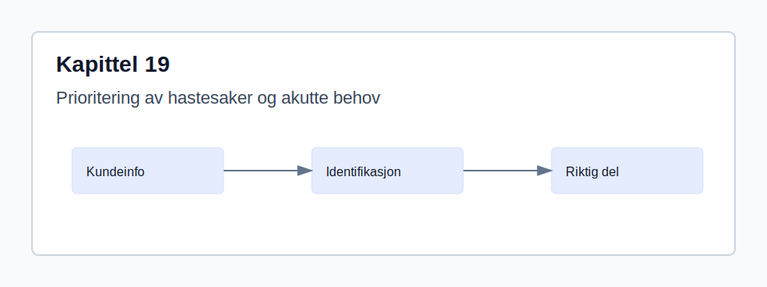

## Tekniske systemillustrasjoner

## Grundig forklaring
Hvordan kritiske behov prioriteres uten å miste kontroll på fakta må forstås både teknisk og praktisk. I marine reservedeler er det sjelden nok å vite hva kunden kaller delen. Medarbeideren må forstå hvilken funksjon delen har, hvor den sitter, hvilken motorvariant den tilhører, og hva som skjer dersom feil del bestilles. Derfor skal tekniske data, kundens beskrivelse og dokumentert katalogoppslag alltid vurderes sammen.

En god sak har fire kjennetegn: den har tydelig identifikasjon, tydelig problem- eller delbeskrivelse, tydelig beslutningsgrunnlag og tydelig oppfølging. Dersom ett av disse punktene mangler, skal saken markeres som usikker før kunden får et bindende svar.

## Praktisk verkstedeksempel
Et verksted står med demontert komponent og trenger rask avklaring. Medarbeideren registrerer kunde, fartøy, motorinformasjon og tidsfrist, ber om bilder av typeplate og komponent, sjekker katalog og lager, og sender et kort skriftlig svar med valgt del, grunnlag for valget og neste oppdateringstidspunkt.

## Kundesupporteksempel
Kunde: 'Motoren går dårlig, kan dere sende riktig del?' Profesjonelt svar: 'Vi kan hjelpe, men først må vi skille mellom symptom og delbehov. Send serienummer, bilde av motorplate, bilde av området feilen gjelder og en kort beskrivelse av når feilen oppstår. Da kan vi foreslå riktig del eller riktig neste feilsøkingstrinn.'

## Vanlige feil og årsaker
- feil eller ufullstendig serienummer.
- delnummer som er erstattet uten at saken dokumenteres.
- symptom som tolkes som delbehov uten feilsøking.
- kunde har bilde av lignende del, men ikke korrekt motorvariant.
- manglende avklaring av antall, side, posisjon eller leveringstid.

## Feilsøkingsflyt
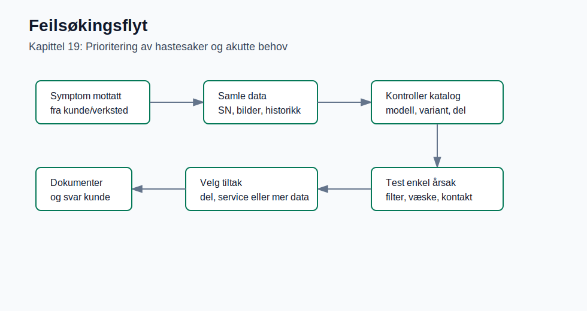

```mermaid
flowchart TD
    A[Symptom eller forespørsel mottatt] --> B[Samle serienummer, bilder og historikk]
    B --> C{Er motor og variant sikkert identifisert?}
    C -- Nei --> D[Be om mer dokumentasjon før del bekreftes]
    C -- Ja --> E[Kontroller delnummer og posisjon i katalog]
    E --> F{Stemmer symptom med foreslått del?}
    F -- Nei --> G[Foreslå feilsøking eller teknisk kontroll]
    F -- Ja --> H[Kontroller lager, pris og levering]
    H --> I[Send dokumentert kundesvar]
```

## Vedlikeholdsprosedyre
1. Avklar driftstimer, siste service og driftsmiljø.
2. Kontroller olje, filter, kjølevæske, sjøvannskrets, reimer, slanger og elektriske kontakter.
3. Sammenlign vedlikeholdsbehov med produsentens intervaller og faktisk bruk.
4. Anbefal servicekit når flere slitedeler bør skiftes samtidig.
5. Dokumenter hva som er anbefalt, hva kunden bestiller og eventuelle avvik fra normal prosedyre.

## Serienummeridentifikasjon
Serienummeridentifikasjon starter med å finne typeplate, motornummer eller annen unik identifikasjon. Be om bilde, ikke bare avskrift, fordi feil tegn, mellomrom og prefiks kan endre katalogoppslaget. Når serienummer ikke finnes, bygges identifikasjonen med modell, produksjonsår, bilder, tidligere fakturaer, servicehistorikk og delnummer fra monterte komponenter.

Minimumsdata bør være: fabrikat, modell, serienummer, eventuell product number/arrangement/CPL/motornummer, bilde av typeplate og bilde av motorens installasjon. Ved tvil skal saken stoppes for avklaring før del bekreftes.

## Reservedelsidentifikasjon
Reservedelsidentifikasjon skal bekrefte delnummer, posisjon, antall per motor, variant, side og eventuell erstatning. Dersom kunden oppgir et gammelt nummer, må det kontrolleres mot supersession. Dersom kunden bare sender bilde, skal bildet brukes som støtte, ikke som eneste grunnlag for bestilling.

Sjekk alltid om delnummeret gjelder enkeltkomponent, reparasjonssett, servicekit eller komplett enhet. Kontroller også om varen er høyre/venstre, gammel/ny type, standard/oversize eller knyttet til en bestemt produksjonsperiode.

## Bestillingsprosedyre
1. Opprett eller oppdater sak med kunde, fartøy, kontaktperson og tidsfrist.
2. Verifiser motoridentifikasjon og lagre bildedokumentasjon.
3. Finn korrekt delnummer i relevant katalog eller leverandørgrunnlag.
4. Kontroller supersession, antall, lagerstatus, pris, returvilkår og leveringstid.
5. Send ordrebekreftelse med delnummer, beskrivelse, antall, pris, levering og forbehold.
6. Følg opp leveransen til kunden har mottatt varen eller saken er lukket.

## Kvalitetspunkter før svar
- Har vi nok data til å gi et sikkert svar?
- Er delnummeret kontrollert mot riktig motorvariant?
- Er kundens tidsfrist realistisk med valgt fraktmåte?
- Er eventuelle forbehold skrevet tydelig?
- Kan en kollega forstå beslutningen ved å lese saken senere?

## Kapittelsammendrag
Hovedpoenget i kapittel 19 er at profesjonelt reservedelsarbeid krever struktur. Teknisk kunnskap, engelske fagtermer, praktisk feilsøking, dokumentasjon og kundedialog må henge sammen. Når medarbeideren jobber systematisk, reduseres feilbestillinger, kunden får bedre svar, og verkstedet kan planlegge arbeidet tryggere.

## Kryssreferanser
- For forrige tema, se kapittel 18: Vanlige feil ved bestilling av reservedeler.
- For neste tema, se kapittel 20: Bestilling av deler fra leverandører og interne lagre.
- For grunnleggende identifikasjon, se kapittel 12 og 17.
- For merkevise eksempler, se kapitlene 26-32.

## Fordypning for intern opplæring
Dette kapitlet skal brukes som arbeidsstandard, ikke bare som lesestoff. Når en ny medarbeider møter en sak om hastesaker, skal vedkommende trene på å gå rolig fra fakta til vurdering og deretter til handling. I en marinemotorforhandler er konsekvensen av en feil ofte større enn verdien av selve delen. En feil impeller, feil sensor, feil filterinnsats eller feil pakningssett kan føre til tapt verkstedtid, utsatt avgang, irritert kunde og i verste fall ny driftsstans. Derfor skal hver sak behandles som en teknisk beslutning med sporbar dokumentasjon.

Profesjonelt nivå i dette kapitlet betyr at medarbeideren kan arbeide sikkert med hastesaker. Før kunden får et bindende svar, skal opplysningene i saken kontrolleres mot motorens identitet, faktisk installasjon og relevant produsentterminologi. Det praktiske målet er ikke å finne et raskt nummer, men å kunne forklare hvorfor valgt del, kontrollpunkt eller kundesvar er riktig for akkurat denne motoren. Når informasjon mangler, skal medarbeideren beskrive hva som mangler, hvorfor det er nødvendig, og hvilket neste steg som bringer saken videre.

## Tekniske forklaringer
Teknisk forståelse i dette kapitlet skal bygges rundt driftsstans, risikovurdering, tilgjengelighet, fraktalternativer og teknisk minimumsdokumentasjon. Medarbeideren må skille mellom synlig symptom, sannsynlig systemfeil og bestillbar komponent. En del kan se riktig ut på bilde, men likevel være feil dersom posisjon, variant, rating, kjøleroppsett, elektrisk plugg, monteringsside eller servicehistorikk ikke stemmer. Derfor skal teknisk vurdering alltid kobles til både funksjon og dokumentasjon: hva gjør komponenten, hvilket system påvirker den, og hvilken produsentkilde bekrefter at den passer.

I praksis betyr dette at tekniske data skal kobles til motorens faktiske installasjon. Marine motorer står ofte trangt, er utsatt for salt, vibrasjon, fukt og ujevnt belastningsmønster, og de kan være bygget om gjennom mange år. En motor kan ha original kjøler, ettermontert eksosbend, alternativ dynamo, endret filterbrakett eller annen sjøvannspumpe enn standard. Slike forhold gjør at delidentifikasjon må bygge på både produsentdata og synlig dokumentasjon fra motoren.

Produsentterminologi er en del av den tekniske forståelsen. Bruk uttrykk som Serial Number, Engine Number, Part Number, Service Kit, Exploded View, Supersession når de er relevante. Ikke oversett dem på en måte som fjerner presisjon. Skriv for eksempel «Engine Serial Number (ESN)» første gang og deretter «ESN» i saken dersom produsenten bruker dette. Skriv «Arrangement Number» når CAT-data krever det, «Product Number» når Volvo Penta bruker det, «CPL» når Cummins-konfigurasjon må kontrolleres, og «Model Code» når Yanmar-identifikasjon bygger på modellkode. Dette gjør dialogen med internasjonale leverandører mer presis.

## Illustrasjonsforslag
- Oversiktsdiagram som viser hvor hastesaker passer inn i total arbeidsflyt fra kundeforespørsel til levert del.
- Nærbilde av typeplate/motorskilt med markering av serienummer, motornummer, modell og eventuell variantkode.
- Sprengskisse med markert posisjon, delnummer, antall per motor og mulige alternative versjoner.
- Feilsøkingsflyt med beslutningspunkter: mangler data, stemmer symptom, kreves mer teknisk kontroll, kan ordre bekreftes.
- Sammenligningsbilde av gammel og ny del der forskjell i tilkobling, side, lengde eller sensorplugg er markert.

## Virkelige verkstedseksempler
Eksempel 1: Et verksted står med en demontert komponent på benken og kunden venter på avklaring før fartøyet kan settes tilbake i drift. Verkstedet sender et nærbilde av delen, men ingen motorplate. En uerfaren medarbeider kan bli fristet til å søke på nummeret som står på støpegodset. En profesjonell medarbeider svarer at støpenummer ikke nødvendigvis er bestillbart delnummer, ber om bilde av typeplate, oversiktsbilde av motoren og bilde av monteringsstedet, og forklarer at dette hindrer feilbestilling. Når informasjonen kommer, kontrolleres delnummer mot sprengskisse, posisjon og antall. Først da gis pris og leveringstid.

Eksempel 2: En kunde ringer sent på dagen og sier at motoren har høy temperatur etter service. Kunden ønsker ny termostat. Medarbeideren skal ikke automatisk konkludere med termostatfeil. Spørsmålene bør avklare om impeller er byttet, om sjøvannsfilteret er rent, om kjølevæskenivået er riktig, om alarmen kommer ved tomgang eller belastning, og om det finnes lekkasje rundt varmeveksler eller slanger. Dersom kunden likevel vil bestille termostat, dokumenteres at feilsøking er anbefalt, og delnummer kontrolleres mot serienummer før ordre.

Eksempel 3: En intern selger mottar en gammel faktura med et delnummer som ikke lenger finnes. Riktig prosess er å kontrollere supersession, se om ny del krever tilhørende pakning, boltsett eller adapter, og notere både gammelt og nytt nummer i saken. Kunden skal få vite at delen er erstattet, hva som leveres, og om det finnes monteringsforbehold.

## Reservedelsidentifisering i praksis
Reservedelsidentifisering skal følge en fast rekkefølge. Først kontrolleres motorens identitet. Deretter kontrolleres delens system: drivstoff, luft, kjøling, smøring, eksos, elektrisk eller mekanisk kraftoverføring. Så kontrolleres posisjon i sprengskisse eller parts list. Til slutt kontrolleres antall, variant, supersession og leveringsstatus. Denne rekkefølgen hindrer at medarbeideren hopper direkte fra kundens ord til et tilfeldig delnummer.

Når en del har synlig nummer, må nummeret tolkes riktig. Mange komponenter har produksjonsnummer, støpenummer, leverandørnummer eller revisjonskode som ikke er det samme som bestillbart part number. Et filter kan ha nummer fra filterprodusent, men motorprodusentens parts catalogue kan bruke et annet nummer. En pumpe kan ha nummer på lokk, hus og komplett enhet. Spør derfor alltid: gjelder nummeret komplett del, reparasjonssett, underkomponent eller produsentens råkomponent?

## Serienummer og motornummer
Serienummer og motornummer er grunnlaget for korrekt katalogoppslag. Be kunden sende bilde av typeplate eller dataplate. Dersom kunden skriver nummeret manuelt, skal nummeret likevel kontrolleres mot bilde når det er mulig. Noter hele nummeret, inkludert prefiks, suffiks, bindestrek, mellomrom og eventuelle bokstaver. På enkelte produsenter kan små forskjeller peke til forskjellig produksjonsperiode, rating eller konfigurasjon.

Bruk motornummer sammen med modell, variant og applikasjon. En motor som driver generator kan ha andre deler enn en fremdriftsmotor. En motor i yrkesbåt kan ha annen rating enn samme motor i fritidsbåt. En eldre motor kan være bygget om med ny dynamo, annen sjøvannspumpe eller uoriginal filterbrakett. Dersom typeplate mangler, bygg identifikasjonen gjennom flere kilder: servicebok, tidligere faktura, bilder av motorens sider, nummer på pumpe, filter, turbo og gear, samt opplysninger om fartøy og produksjonsår.

## Feilsøking steg for steg
1. Definer symptomet med kundens egne ord og skriv det i saken. Skill mellom «kunden ønsker del» og «kunden beskriver feil».
2. Avklar når feilen oppstår: start, tomgang, belastning, marsjfart, varm motor, kald motor eller etter nylig service.
3. Kontroller grunnleggende forhold: væskenivå, filter, luft i drivstoff, sjøvannsstrøm, reimer, elektriske kontakter, sikringer og synlige lekkasjer.
4. Knytt symptomet til system: lav effekt peker ofte mot luft/drivstoff/eksos, høy temperatur mot kjøling, lavt oljetrykk mot smøring/sensor, startproblem mot batteri/starter/gløding/drivstoff.
5. Be om bilder eller måledata dersom symptomet ikke kan kobles sikkert til en del. Dette kan være bilde av alarmdisplay, trykkmåling, temperaturmåling eller bilde av montert komponent.
6. Kontroller relevant delnummer mot serienummer og variant. Dersom flere alternativer finnes, forklar kunden hva som skiller dem.
7. Dokumenter anbefalt tiltak, usikkerhet og eventuelle forbehold før ordre bekreftes.

## Vedlikehold
Vedlikehold skal vurderes mot driftstimer, produsentens maintenance schedule og faktisk driftsmiljø. Marine motorer som går korte turer, mye tomgang eller i salt miljø kan trenge hyppigere kontroll enn standard intervall antyder. Nye medarbeidere skal lære å spørre om siste service, hvilke filter som ble byttet, hvilken olje som ble brukt, om impeller er kontrollert, og om kjølevæske eller anoder er byttet etter plan.

En god vedlikeholdsanbefaling er konkret. I stedet for å skrive «ta service», bør medarbeideren foreslå relevante deler: olje- og drivstoffilter, luftfilter, impeller, reim, pakninger, anoder, kjølevæske og eventuelt servicekit. Dersom kunden har ukjent servicehistorikk, bør komplett servicekit vurderes. Dersom kunden har hatt overoppheting, bør sjøvannskrets og varmeveksler kontrolleres før bare én komponent byttes.

## Vanlige feil
- Serienummer leses feil fordi et tegn forveksles, for eksempel O/0 eller I/1.
- Kunden oppgir modellnavn, men ikke variant, rating eller applikasjon.
- Del velges ut fra bilde alene uten kontroll mot sprengskisse eller produsentkatalog.
- Supersession aksepteres uten å kontrollere om ny del krever tilbehør, pakning eller ombygging.
- Hastepress gjør at leveringsløfte gis før lagerstatus og fraktmulighet er bekreftet.
- Saksnotat mangler grunnlaget for beslutningen, slik at kollega ikke kan etterprøve valget.

## Kontrollspørsmål
- Hva er den viktigste tekniske risikoen i en sak som gjelder hastesaker?
- Hvilke opplysninger må dokumenteres før bindende delnummer bekreftes?
- Hvordan forklarer du kunden hvorfor bilde av typeplate er nødvendig?
- Når bør du stoppe en ordre og be om mer dokumentasjon?
- Hvilke engelske produsentuttrykk bør du kunne bruke i denne typen sak?
- Hvordan dokumenterer du at et delnummer er erstattet av et nytt nummer?

## Praktisk sjekkliste for medarbeider
- Les saken som om en kollega skal overta den i morgen.
- Kontroller at motoridentifikasjon er dokumentert med bilde eller sikker kilde.
- Sjekk at delnummeret er knyttet til riktig posisjon i katalogen.
- Skriv tydelig om kunden har bedt om enkeltkomponent, servicekit eller komplett enhet.
- Noter om varen er spesialbestilling, utgått, erstattet eller ikke returbar.
- Send kundesvar med neste steg, ikke bare et løst delnummer.

## Kapittelspesifikk systemforståelse
For dette kapitlet er kjernen å forstå prioritering av akutte saker uten å miste teknisk kontroll. Medarbeideren skal kunne forklare dette med praktiske ord til både kunde og kollega. Det betyr at teknisk teori må kobles til konkrete handlinger: hvilke data skal innhentes, hvilke komponenter kan være berørt, hvilken produsentterminologi skal brukes, og hva må dokumenteres før saken kan gå videre. Hastegrad endrer tempoet, men ikke kravet til identifikasjon.

Når systemet vurderes, skal medarbeideren først plassere problemet i riktig teknisk sammenheng. Dersom kunden beskriver en alarm, må man finne ut om alarmen kommer fra reelt mekanisk avvik, elektrisk sensorfeil, feil etter service eller feil tolkning av instrumentet. Dersom kunden beskriver en del, må man avklare om kunden mener komplett enhet, servicekit, reparasjonssett eller enkeltkomponent. Dersom kunden beskriver motoren med vanlig navn, må man kontrollere om produsenten bruker mer presise begreper i katalogen.

## Komponentoversikt og arbeidsgrense
Relevante komponenter og opplysninger i dette kapitlet omfatter: driftsstans, avgangstid, sikkerhetsrisiko, lagerstatus, ekspressfrakt og alternativ del. Listen er ikke ment som en erstatning for produsentens parts catalogue, men som en praktisk påminnelse om hva nye medarbeidere skal tenke på før de søker del. I interne saker skal komponentnavn skrives så presist som mulig. Bruk for eksempel «sjøvannspumpe / raw water pump» i stedet for bare «pumpe» når funksjonen er kjent, og «varmeveksler / heat exchanger» i stedet for bare «kjøler» når det er den komponenten saken gjelder.

Arbeidsgrensen for en reservedelsmedarbeider er også viktig. Medarbeideren skal ikke overta mekanikerens ansvar for demontering, måling eller diagnose på motoren, men skal kunne stille riktige spørsmål og foreslå riktig dokumentasjon. Når en sak går fra enkel delidentifikasjon til teknisk diagnose, skal dette markeres i saken. Da kan verksted, teknisk ansvarlig eller leverandør involveres med et klart spørsmål og et ryddig faktagrunnlag.

## Praktisk beslutningsregel
Bruk denne regelen i alle saker knyttet til kapitlet: Hvis motoridentifikasjon, komponentposisjon eller symptom ikke er sikkert nok dokumentert, skal medarbeideren ikke gi bindende delbekreftelse. Kunden kan få et foreløpig svar, men svaret må inneholde hva som mangler, hvorfor det mangler, og hva som skjer når informasjonen er mottatt. Dette er ikke treg service; det er profesjonell risikokontroll.

## Målrettet fordypning kapittel 11-20
### Hastesaker, kritikalitet og kontrollert tempo
Hastesaker må prioriteres etter konsekvens, ikke bare etter hvem som roper høyest. Et fartøy som ligger stille med avgangsfrist, sikkerhetsrisiko eller kontraktsmessig driftsstans har høyere kritikalitet enn ordinær service. Samtidig må teknisk kontroll opprettholdes. Rask feil del er dårligere enn litt langsommere riktig del. Medarbeideren skal derfor bruke en minimumspakke for hasteordre: typeplatebilde, komponentbilde, symptom, tidsfrist, leveringssted og beslutningstaker.

Kundesvaret i hastesak bør være tydelig: «Vi prioriterer saken. For å bekrefte riktig del trenger vi disse opplysningene. Parallelt sjekker vi lager og raskeste frakt.» Dette viser fremdrift uten å love for mye. Dersom kunden velger å bestille på usikkert grunnlag, må risiko og forbehold dokumenteres skriftlig. Hastegrad skal aldri fjerne behovet for sporbarhet.

### Praktisk anvendelse i opplæring
Instruktør bør bruke dette kapitlet med en konkret case der deltakerne først må identifisere manglende opplysninger, deretter velge riktig kataloggrunnlag og til slutt skrive et kort kundesvar. Deltakeren skal forklare hvilke produsentdata som er nødvendige, hvilke komponenter som kan være involvert, og hvor grensen går mellom reservedelsidentifisering og mekanisk diagnose. Målet er at medarbeideren ikke bare husker begreper, men kan bruke dem under tidspress i en reell kundesak.

## Realistisk opplæring i praksis
### Verkstedhistorie
En typisk sak i dette temaet starter med fartøy må ut samme kveld. Verkstedet trenger et raskt svar, men den erfarne medarbeideren stopper opp og spør først: hva vet vi sikkert, hva antar vi, og hva kan gi følgeskade hvis vi tar feil? I praksis betyr det at prioritering og minimumsdokumentasjon må kobles til bilde, serienummer, komponentposisjon og kundens symptom før saken lukkes. Historien skal brukes i opplæring som en øvelse i å skrive et kort saksnotat: observasjon, vurdering, neste handling og forbehold.

### Kundehistorie
Kunden beskriver ofte problemet med driftsspråk: «motoren går tungt», «alarm kommer etter ti minutter», «jeg trenger den samme delen som sist» eller «båten skal ut i morgen». En profesjonell respons er rolig og konkret: bekreft behovet, forklar hvorfor identifikasjon trengs, be om riktig dokumentasjon og gi et realistisk tidspunkt for neste svar. Ikke korriger kunden unødvendig; oversett kundens språk til teknisk språk i saken.

### Typiske feil nye ansatte gjør
- søker på første synlige nummer uten å avklare om det er støpenummer, leverandørnummer eller bestillbart part number.
- lover levering før lagerstatus, frakt og returvilkår er kontrollert.
- antar at tidligere faktura alltid gjelder samme motorvariant.
- blander symptom og årsak, spesielt ved varme, lav effekt, startproblem og alarm.
- skriver for korte notater slik at kollega ikke kan forstå hvorfor valget ble tatt.

### Tips fra erfarne mekanikere og reservedelsselgere
- Se alltid etter systemet rundt delen: slanger, braketter, sensorer, reimer, kjølere og tilkoblinger forteller ofte mer enn delen alene.
- Still ett presist spørsmål om gangen når kunden er stresset; mange dårlige svar kommer av for lange spørsmålslister.
- Sammenlign gammel og ny del mot funksjon, ikke bare form. Riktig del skal passe, men også løse riktig problem.
- En erfaren reservedelsselger tenker i risiko: Hva er billigst å avklare nå, og hva blir dyrt hvis vi hopper over det?

### Vanlige kundespørsmål
| Spørsmål fra kunde | Profesjonelt svar |
|---|---|
| «Kan du bare sende samme del som sist?» | «Ja, hvis vi først bekrefter at det gjelder samme motor, samme posisjon og ingen supersession siden sist.» |
| «Holder det med bilde?» | «Bilde hjelper, men vi trenger også motoridentitet for å sikre variant og delnummer.» |
| «Hvorfor tar dette tid?» | «Fordi feil del kan gi ny driftsstans. Vi kontrollerer grunnlaget før vi lover levering.» |

### Beslutningstre for saken
| Trinn | Spørsmål | Handling |
|---|---|---|
| 1 | Er motoridentitet dokumentert med bilde eller sikker historikk? | Hvis nei: be om typeplate/dataplate eller alternativ dokumentasjon. |
| 2 | Er komponentens funksjon og posisjon kjent? | Hvis nei: be om oversiktsbilde og bilde av monteringssted. |
| 3 | Stemmer kundens symptom med delen som ønskes? | Hvis nei: anbefal feilsøking før del bestilles. |
| 4 | Finnes det supersession, kit eller variantvalg? | Kontroller produsentkilde og skriv forbehold i saken. |
| 5 | Kan pris, levering og returvilkår bekreftes? | Send dokumentert svar med neste steg og tydelig gyldighet. |

### Rask oppslagstabell
| Situasjon | Kontroller først | Vanlig fallgruve |
|---|---|---|
| Hasteordre | sikker motor-ID, lager, fraktfrist | levering loves før teknisk kontroll |
| Del fra bilde | posisjon, skala, tilkoblinger, nummer | bilde brukes som eneste beslutningsgrunnlag |
| Gammelt delnummer | supersession og kitinnhold | ny del krever ekstra pakning eller adapter |
| Uklart symptom | driftssituasjon, alarm, siste service | symptom blir tolket som sikker komponentfeil |

### Praktisk sjekkliste og inspeksjonsrutine
- Start med motoridentitet: fabrikat, modell, serienummer, variant, applikasjon og bilde av skilt.
- Kontroller området rundt komponenten: lekkasje, korrosjon, knekte fester, slitasje, varmemerker og uoriginale endringer.
- Spør om siste vedlikehold: olje, filter, impeller, reimer, kjølevæske, anoder og drivstoffilter.
- Noter driftstype: fritidsbruk, yrkesbruk, generator, fremdrift, tomgangsdrift eller langvarig høy belastning.
- Avklar om saken gjelder akutt drift, planlagt service, reklamasjon eller lagerpåfyll.

### Generelle vedlikeholdsintervaller som opplæringspunkt
| Kontrollpunkt | Typisk vurdering i opplæring | Må verifiseres |
|---|---|---|
| Olje og oljefilter | ofte basert på timer og kalender | produsentens maintenance schedule |
| Drivstoffilter/vannutskiller | hyppigere ved dårlig drivstoff eller sesongstart | motor- og filterspesifikasjon |
| Impeller og sjøvannskrets | kontrolleres særlig før sesong og etter varmgang | produsentens intervall og installasjon |
| Reimer, slanger og klemmer | visuell kontroll ved service og feilsøking | dimensjon, stramming og delnummer |

### Produsentverifikasjon
Alle konkrete delnumre, momentverdier, serviceintervaller, garantikrav, programvaredata og produsentspesifikke grenser skal kontrolleres mot offisiell produsentdokumentasjon før de brukes i tilbud, ordre eller verkstedinstruks. Marker tydelig i saken når svaret bygger på antakelse, eldre historikk, bilde uten motor-ID eller generell erfaring. Intervaller i tabellen er generelle opplæringspunkter. Faktiske intervaller styres av produsent, motorvariant, driftstimer, kalenderkrav, belastning og miljø.

## Produsentverifikasjon og faglig forbehold
Denne manualen skal brukes som intern opplæring og arbeidsmetode. Produsentspesifikke delnumre, intervaller, momentverdier, garantikrav og tekniske grenseverdier skal verifiseres mot gjeldende produsentdokumentasjon før de brukes i kundeordre eller verkstedinstruks. Marker saken internt dersom opplysningen bygger på antakelse, eldre historikk eller bilde uten bekreftet motoridentitet.

## Quiz med fasit
1. Hvilke tekniske data bør alltid samles før en del bekreftes?
2. Hvorfor er engelsk terminologi viktig i marine reservedeler?
3. Hva bør gjøres dersom kunden bare sender et bilde av delen?
4. Hvilke punkter bør kontrolleres før ordrebekreftelse sendes?
5. Hvorfor skal feilsøking dokumenteres, selv når kunden allerede ber om en bestemt del?

### Svar
1. Fabrikat, modell, serienummer, variantdata, bilde av typeplate, delnummer, posisjon og kundens symptombeskrivelse.
2. Fordi kataloger, portaler, servicemanualer og leverandørdialog ofte bruker engelske begreper som må forstås presist.
3. Be om serienummer, oversiktsbilde av motoren og eventuelle nummer på delen; bildet brukes som støtte, ikke eneste grunnlag.
4. Delnummer, antall, variant, pris, lagerstatus, leveringstid, frakt, returvilkår og eventuelle forbehold.
5. Fordi symptomet kan ha flere årsaker, og dokumentasjon viser hvorfor anbefalingen ble gitt.

---

# Kapittel 20: Bestilling av deler fra leverandører og interne lagre

## Kapittelrolle
Dette kapitlet gir en grundig praktisk innføring i leverandørbestilling. Temaet er viktig fordi reservedelsarbeid i marine miljøer kombinerer teknisk forståelse, presis kundedialog, dokumentert saksbehandling og realistisk leveranseoppfølging. Målet er at en ny medarbeider skal kunne bruke kunnskapen direkte i arbeid med verksted, kunde, lager og leverandør.

## Læringsmål
Etter kapitlet skal deltakeren kunne:
- forklare hovedbegrepene innen leverandørbestilling
- bruke serienummer, modellinformasjon og delnummer i praktisk reservedelsarbeid
- kommunisere trygt med kunde, verksted, lager og leverandør
- dokumentere beslutninger slik at andre kan etterprøve saken
- kjenne igjen vanlige feil og velge riktig neste handling

## English technical terminology
- **Serial Number:** engelsk fagterm som ofte brukes i kataloger, servicelitteratur, leverandørportaler og internasjonal kundedialog.
- **Part Number:** engelsk fagterm som ofte brukes i kataloger, servicelitteratur, leverandørportaler og internasjonal kundedialog.
- **Engine Model:** engelsk fagterm som ofte brukes i kataloger, servicelitteratur, leverandørportaler og internasjonal kundedialog.
- **Variant:** engelsk fagterm som ofte brukes i kataloger, servicelitteratur, leverandørportaler og internasjonal kundedialog.
- **Service Kit:** engelsk fagterm som ofte brukes i kataloger, servicelitteratur, leverandørportaler og internasjonal kundedialog.
- **Troubleshooting:** engelsk fagterm som ofte brukes i kataloger, servicelitteratur, leverandørportaler og internasjonal kundedialog.
- **Maintenance:** engelsk fagterm som ofte brukes i kataloger, servicelitteratur, leverandørportaler og internasjonal kundedialog.
- **Ordering Procedure:** engelsk fagterm som ofte brukes i kataloger, servicelitteratur, leverandørportaler og internasjonal kundedialog.
- **Supersession:** engelsk fagterm som ofte brukes i kataloger, servicelitteratur, leverandørportaler og internasjonal kundedialog.
- **Technical Support:** engelsk fagterm som ofte brukes i kataloger, servicelitteratur, leverandørportaler og internasjonal kundedialog.

## Hoveddiagram

## Tekniske systemillustrasjoner

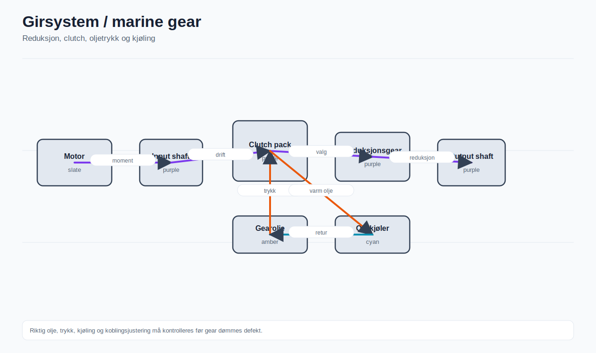

## Grundig forklaring
Hvordan deler bestilles fra lager og leverandør med riktig oppfølging må forstås både teknisk og praktisk. I marine reservedeler er det sjelden nok å vite hva kunden kaller delen. Medarbeideren må forstå hvilken funksjon delen har, hvor den sitter, hvilken motorvariant den tilhører, og hva som skjer dersom feil del bestilles. Derfor skal tekniske data, kundens beskrivelse og dokumentert katalogoppslag alltid vurderes sammen.

En god sak har fire kjennetegn: den har tydelig identifikasjon, tydelig problem- eller delbeskrivelse, tydelig beslutningsgrunnlag og tydelig oppfølging. Dersom ett av disse punktene mangler, skal saken markeres som usikker før kunden får et bindende svar.

## Praktisk verkstedeksempel
Et verksted står med demontert komponent og trenger rask avklaring. Medarbeideren registrerer kunde, fartøy, motorinformasjon og tidsfrist, ber om bilder av typeplate og komponent, sjekker katalog og lager, og sender et kort skriftlig svar med valgt del, grunnlag for valget og neste oppdateringstidspunkt.

## Kundesupporteksempel
Kunde: 'Motoren går dårlig, kan dere sende riktig del?' Profesjonelt svar: 'Vi kan hjelpe, men først må vi skille mellom symptom og delbehov. Send serienummer, bilde av motorplate, bilde av området feilen gjelder og en kort beskrivelse av når feilen oppstår. Da kan vi foreslå riktig del eller riktig neste feilsøkingstrinn.'

## Vanlige feil og årsaker
- feil eller ufullstendig serienummer.
- delnummer som er erstattet uten at saken dokumenteres.
- symptom som tolkes som delbehov uten feilsøking.
- kunde har bilde av lignende del, men ikke korrekt motorvariant.
- manglende avklaring av antall, side, posisjon eller leveringstid.

## Feilsøkingsflyt
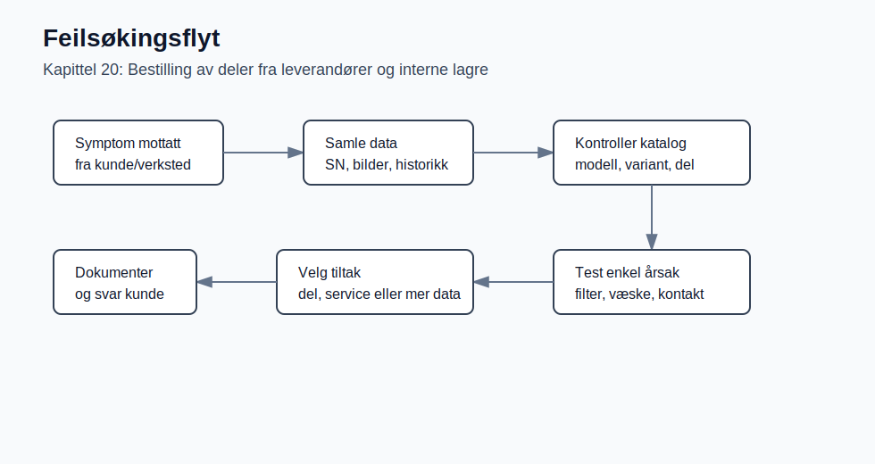

```mermaid
flowchart TD
    A[Symptom eller forespørsel mottatt] --> B[Samle serienummer, bilder og historikk]
    B --> C{Er motor og variant sikkert identifisert?}
    C -- Nei --> D[Be om mer dokumentasjon før del bekreftes]
    C -- Ja --> E[Kontroller delnummer og posisjon i katalog]
    E --> F{Stemmer symptom med foreslått del?}
    F -- Nei --> G[Foreslå feilsøking eller teknisk kontroll]
    F -- Ja --> H[Kontroller lager, pris og levering]
    H --> I[Send dokumentert kundesvar]
```

## Vedlikeholdsprosedyre
1. Avklar driftstimer, siste service og driftsmiljø.
2. Kontroller olje, filter, kjølevæske, sjøvannskrets, reimer, slanger og elektriske kontakter.
3. Sammenlign vedlikeholdsbehov med produsentens intervaller og faktisk bruk.
4. Anbefal servicekit når flere slitedeler bør skiftes samtidig.
5. Dokumenter hva som er anbefalt, hva kunden bestiller og eventuelle avvik fra normal prosedyre.

## Serienummeridentifikasjon
Serienummeridentifikasjon starter med å finne typeplate, motornummer eller annen unik identifikasjon. Be om bilde, ikke bare avskrift, fordi feil tegn, mellomrom og prefiks kan endre katalogoppslaget. Når serienummer ikke finnes, bygges identifikasjonen med modell, produksjonsår, bilder, tidligere fakturaer, servicehistorikk og delnummer fra monterte komponenter.

Minimumsdata bør være: fabrikat, modell, serienummer, eventuell product number/arrangement/CPL/motornummer, bilde av typeplate og bilde av motorens installasjon. Ved tvil skal saken stoppes for avklaring før del bekreftes.

## Reservedelsidentifikasjon
Reservedelsidentifikasjon skal bekrefte delnummer, posisjon, antall per motor, variant, side og eventuell erstatning. Dersom kunden oppgir et gammelt nummer, må det kontrolleres mot supersession. Dersom kunden bare sender bilde, skal bildet brukes som støtte, ikke som eneste grunnlag for bestilling.

Sjekk alltid om delnummeret gjelder enkeltkomponent, reparasjonssett, servicekit eller komplett enhet. Kontroller også om varen er høyre/venstre, gammel/ny type, standard/oversize eller knyttet til en bestemt produksjonsperiode.

## Bestillingsprosedyre
1. Opprett eller oppdater sak med kunde, fartøy, kontaktperson og tidsfrist.
2. Verifiser motoridentifikasjon og lagre bildedokumentasjon.
3. Finn korrekt delnummer i relevant katalog eller leverandørgrunnlag.
4. Kontroller supersession, antall, lagerstatus, pris, returvilkår og leveringstid.
5. Send ordrebekreftelse med delnummer, beskrivelse, antall, pris, levering og forbehold.
6. Følg opp leveransen til kunden har mottatt varen eller saken er lukket.

## Kvalitetspunkter før svar
- Har vi nok data til å gi et sikkert svar?
- Er delnummeret kontrollert mot riktig motorvariant?
- Er kundens tidsfrist realistisk med valgt fraktmåte?
- Er eventuelle forbehold skrevet tydelig?
- Kan en kollega forstå beslutningen ved å lese saken senere?

## Kapittelsammendrag
Hovedpoenget i kapittel 20 er at profesjonelt reservedelsarbeid krever struktur. Teknisk kunnskap, engelske fagtermer, praktisk feilsøking, dokumentasjon og kundedialog må henge sammen. Når medarbeideren jobber systematisk, reduseres feilbestillinger, kunden får bedre svar, og verkstedet kan planlegge arbeidet tryggere.

## Kryssreferanser
- For forrige tema, se kapittel 19: Prioritering av hastesaker og akutte behov.
- For neste tema, se kapittel 21: God kundesupport i marine bransjen.
- For grunnleggende identifikasjon, se kapittel 12 og 17.
- For merkevise eksempler, se kapitlene 26-32.

## Fordypning for intern opplæring
Dette kapitlet skal brukes som arbeidsstandard, ikke bare som lesestoff. Når en ny medarbeider møter en sak om leverandør og lager, skal vedkommende trene på å gå rolig fra fakta til vurdering og deretter til handling. I en marinemotorforhandler er konsekvensen av en feil ofte større enn verdien av selve delen. En feil impeller, feil sensor, feil filterinnsats eller feil pakningssett kan føre til tapt verkstedtid, utsatt avgang, irritert kunde og i verste fall ny driftsstans. Derfor skal hver sak behandles som en teknisk beslutning med sporbar dokumentasjon.

Profesjonelt nivå i dette kapitlet betyr at medarbeideren kan arbeide sikkert med leverandør- og lagerbestilling. Før kunden får et bindende svar, skal opplysningene i saken kontrolleres mot motorens identitet, faktisk installasjon og relevant produsentterminologi. Det praktiske målet er ikke å finne et raskt nummer, men å kunne forklare hvorfor valgt del, kontrollpunkt eller kundesvar er riktig for akkurat denne motoren. Når informasjon mangler, skal medarbeideren beskrive hva som mangler, hvorfor det er nødvendig, og hvilket neste steg som bringer saken videre.

## Tekniske forklaringer
Teknisk forståelse i dette kapitlet skal bygges rundt internlager, ekstern leverandør, restordre, spesialbestilling og ordrestatus. Medarbeideren må skille mellom synlig symptom, sannsynlig systemfeil og bestillbar komponent. En del kan se riktig ut på bilde, men likevel være feil dersom posisjon, variant, rating, kjøleroppsett, elektrisk plugg, monteringsside eller servicehistorikk ikke stemmer. Derfor skal teknisk vurdering alltid kobles til både funksjon og dokumentasjon: hva gjør komponenten, hvilket system påvirker den, og hvilken produsentkilde bekrefter at den passer.

I praksis betyr dette at tekniske data skal kobles til motorens faktiske installasjon. Marine motorer står ofte trangt, er utsatt for salt, vibrasjon, fukt og ujevnt belastningsmønster, og de kan være bygget om gjennom mange år. En motor kan ha original kjøler, ettermontert eksosbend, alternativ dynamo, endret filterbrakett eller annen sjøvannspumpe enn standard. Slike forhold gjør at delidentifikasjon må bygge på både produsentdata og synlig dokumentasjon fra motoren.

Produsentterminologi er en del av den tekniske forståelsen. Bruk uttrykk som Serial Number, Engine Number, Part Number, Service Kit, Exploded View, Supersession når de er relevante. Ikke oversett dem på en måte som fjerner presisjon. Skriv for eksempel «Engine Serial Number (ESN)» første gang og deretter «ESN» i saken dersom produsenten bruker dette. Skriv «Arrangement Number» når CAT-data krever det, «Product Number» når Volvo Penta bruker det, «CPL» når Cummins-konfigurasjon må kontrolleres, og «Model Code» når Yanmar-identifikasjon bygger på modellkode. Dette gjør dialogen med internasjonale leverandører mer presis.

## Illustrasjonsforslag
- Oversiktsdiagram som viser hvor leverandør og lager passer inn i total arbeidsflyt fra kundeforespørsel til levert del.
- Nærbilde av typeplate/motorskilt med markering av serienummer, motornummer, modell og eventuell variantkode.
- Sprengskisse med markert posisjon, delnummer, antall per motor og mulige alternative versjoner.
- Feilsøkingsflyt med beslutningspunkter: mangler data, stemmer symptom, kreves mer teknisk kontroll, kan ordre bekreftes.
- Sammenligningsbilde av gammel og ny del der forskjell i tilkobling, side, lengde eller sensorplugg er markert.

## Virkelige verkstedseksempler
Eksempel 1: Et verksted står med en demontert komponent på benken og kunden venter på avklaring før fartøyet kan settes tilbake i drift. Verkstedet sender et nærbilde av delen, men ingen motorplate. En uerfaren medarbeider kan bli fristet til å søke på nummeret som står på støpegodset. En profesjonell medarbeider svarer at støpenummer ikke nødvendigvis er bestillbart delnummer, ber om bilde av typeplate, oversiktsbilde av motoren og bilde av monteringsstedet, og forklarer at dette hindrer feilbestilling. Når informasjonen kommer, kontrolleres delnummer mot sprengskisse, posisjon og antall. Først da gis pris og leveringstid.

Eksempel 2: En kunde ringer sent på dagen og sier at motoren har høy temperatur etter service. Kunden ønsker ny termostat. Medarbeideren skal ikke automatisk konkludere med termostatfeil. Spørsmålene bør avklare om impeller er byttet, om sjøvannsfilteret er rent, om kjølevæskenivået er riktig, om alarmen kommer ved tomgang eller belastning, og om det finnes lekkasje rundt varmeveksler eller slanger. Dersom kunden likevel vil bestille termostat, dokumenteres at feilsøking er anbefalt, og delnummer kontrolleres mot serienummer før ordre.

Eksempel 3: En intern selger mottar en gammel faktura med et delnummer som ikke lenger finnes. Riktig prosess er å kontrollere supersession, se om ny del krever tilhørende pakning, boltsett eller adapter, og notere både gammelt og nytt nummer i saken. Kunden skal få vite at delen er erstattet, hva som leveres, og om det finnes monteringsforbehold.

## Reservedelsidentifisering i praksis
Reservedelsidentifisering skal følge en fast rekkefølge. Først kontrolleres motorens identitet. Deretter kontrolleres delens system: drivstoff, luft, kjøling, smøring, eksos, elektrisk eller mekanisk kraftoverføring. Så kontrolleres posisjon i sprengskisse eller parts list. Til slutt kontrolleres antall, variant, supersession og leveringsstatus. Denne rekkefølgen hindrer at medarbeideren hopper direkte fra kundens ord til et tilfeldig delnummer.

Når en del har synlig nummer, må nummeret tolkes riktig. Mange komponenter har produksjonsnummer, støpenummer, leverandørnummer eller revisjonskode som ikke er det samme som bestillbart part number. Et filter kan ha nummer fra filterprodusent, men motorprodusentens parts catalogue kan bruke et annet nummer. En pumpe kan ha nummer på lokk, hus og komplett enhet. Spør derfor alltid: gjelder nummeret komplett del, reparasjonssett, underkomponent eller produsentens råkomponent?

## Serienummer og motornummer
Serienummer og motornummer er grunnlaget for korrekt katalogoppslag. Be kunden sende bilde av typeplate eller dataplate. Dersom kunden skriver nummeret manuelt, skal nummeret likevel kontrolleres mot bilde når det er mulig. Noter hele nummeret, inkludert prefiks, suffiks, bindestrek, mellomrom og eventuelle bokstaver. På enkelte produsenter kan små forskjeller peke til forskjellig produksjonsperiode, rating eller konfigurasjon.

Bruk motornummer sammen med modell, variant og applikasjon. En motor som driver generator kan ha andre deler enn en fremdriftsmotor. En motor i yrkesbåt kan ha annen rating enn samme motor i fritidsbåt. En eldre motor kan være bygget om med ny dynamo, annen sjøvannspumpe eller uoriginal filterbrakett. Dersom typeplate mangler, bygg identifikasjonen gjennom flere kilder: servicebok, tidligere faktura, bilder av motorens sider, nummer på pumpe, filter, turbo og gear, samt opplysninger om fartøy og produksjonsår.

## Feilsøking steg for steg
1. Definer symptomet med kundens egne ord og skriv det i saken. Skill mellom «kunden ønsker del» og «kunden beskriver feil».
2. Avklar når feilen oppstår: start, tomgang, belastning, marsjfart, varm motor, kald motor eller etter nylig service.
3. Kontroller grunnleggende forhold: væskenivå, filter, luft i drivstoff, sjøvannsstrøm, reimer, elektriske kontakter, sikringer og synlige lekkasjer.
4. Knytt symptomet til system: lav effekt peker ofte mot luft/drivstoff/eksos, høy temperatur mot kjøling, lavt oljetrykk mot smøring/sensor, startproblem mot batteri/starter/gløding/drivstoff.
5. Be om bilder eller måledata dersom symptomet ikke kan kobles sikkert til en del. Dette kan være bilde av alarmdisplay, trykkmåling, temperaturmåling eller bilde av montert komponent.
6. Kontroller relevant delnummer mot serienummer og variant. Dersom flere alternativer finnes, forklar kunden hva som skiller dem.
7. Dokumenter anbefalt tiltak, usikkerhet og eventuelle forbehold før ordre bekreftes.

## Vedlikehold
Vedlikehold skal vurderes mot driftstimer, produsentens maintenance schedule og faktisk driftsmiljø. Marine motorer som går korte turer, mye tomgang eller i salt miljø kan trenge hyppigere kontroll enn standard intervall antyder. Nye medarbeidere skal lære å spørre om siste service, hvilke filter som ble byttet, hvilken olje som ble brukt, om impeller er kontrollert, og om kjølevæske eller anoder er byttet etter plan.

En god vedlikeholdsanbefaling er konkret. I stedet for å skrive «ta service», bør medarbeideren foreslå relevante deler: olje- og drivstoffilter, luftfilter, impeller, reim, pakninger, anoder, kjølevæske og eventuelt servicekit. Dersom kunden har ukjent servicehistorikk, bør komplett servicekit vurderes. Dersom kunden har hatt overoppheting, bør sjøvannskrets og varmeveksler kontrolleres før bare én komponent byttes.

## Vanlige feil
- Serienummer leses feil fordi et tegn forveksles, for eksempel O/0 eller I/1.
- Kunden oppgir modellnavn, men ikke variant, rating eller applikasjon.
- Del velges ut fra bilde alene uten kontroll mot sprengskisse eller produsentkatalog.
- Supersession aksepteres uten å kontrollere om ny del krever tilbehør, pakning eller ombygging.
- Hastepress gjør at leveringsløfte gis før lagerstatus og fraktmulighet er bekreftet.
- Saksnotat mangler grunnlaget for beslutningen, slik at kollega ikke kan etterprøve valget.

## Kontrollspørsmål
- Hva er den viktigste tekniske risikoen i en sak som gjelder leverandør og lager?
- Hvilke opplysninger må dokumenteres før bindende delnummer bekreftes?
- Hvordan forklarer du kunden hvorfor bilde av typeplate er nødvendig?
- Når bør du stoppe en ordre og be om mer dokumentasjon?
- Hvilke engelske produsentuttrykk bør du kunne bruke i denne typen sak?
- Hvordan dokumenterer du at et delnummer er erstattet av et nytt nummer?

## Praktisk sjekkliste for medarbeider
- Les saken som om en kollega skal overta den i morgen.
- Kontroller at motoridentifikasjon er dokumentert med bilde eller sikker kilde.
- Sjekk at delnummeret er knyttet til riktig posisjon i katalogen.
- Skriv tydelig om kunden har bedt om enkeltkomponent, servicekit eller komplett enhet.
- Noter om varen er spesialbestilling, utgått, erstattet eller ikke returbar.
- Send kundesvar med neste steg, ikke bare et løst delnummer.

## Kapittelspesifikk systemforståelse
For dette kapitlet er kjernen å forstå bestilling fra internlager og eksterne leverandører. Medarbeideren skal kunne forklare dette med praktiske ord til både kunde og kollega. Det betyr at teknisk teori må kobles til konkrete handlinger: hvilke data skal innhentes, hvilke komponenter kan være berørt, hvilken produsentterminologi skal brukes, og hva må dokumenteres før saken kan gå videre. Leverandørens bekreftelse skal kontrolleres mot kundens behov før den videresendes.

Når systemet vurderes, skal medarbeideren først plassere problemet i riktig teknisk sammenheng. Dersom kunden beskriver en alarm, må man finne ut om alarmen kommer fra reelt mekanisk avvik, elektrisk sensorfeil, feil etter service eller feil tolkning av instrumentet. Dersom kunden beskriver en del, må man avklare om kunden mener komplett enhet, servicekit, reparasjonssett eller enkeltkomponent. Dersom kunden beskriver motoren med vanlig navn, må man kontrollere om produsenten bruker mer presise begreper i katalogen.

## Komponentoversikt og arbeidsgrense
Relevante komponenter og opplysninger i dette kapitlet omfatter: lagerlokasjon, innkjøpsordre, leverandørbekreftelse, backorder, fraktmåte og mottakskontroll. Listen er ikke ment som en erstatning for produsentens parts catalogue, men som en praktisk påminnelse om hva nye medarbeidere skal tenke på før de søker del. I interne saker skal komponentnavn skrives så presist som mulig. Bruk for eksempel «sjøvannspumpe / raw water pump» i stedet for bare «pumpe» når funksjonen er kjent, og «varmeveksler / heat exchanger» i stedet for bare «kjøler» når det er den komponenten saken gjelder.

Arbeidsgrensen for en reservedelsmedarbeider er også viktig. Medarbeideren skal ikke overta mekanikerens ansvar for demontering, måling eller diagnose på motoren, men skal kunne stille riktige spørsmål og foreslå riktig dokumentasjon. Når en sak går fra enkel delidentifikasjon til teknisk diagnose, skal dette markeres i saken. Da kan verksted, teknisk ansvarlig eller leverandør involveres med et klart spørsmål og et ryddig faktagrunnlag.

## Praktisk beslutningsregel
Bruk denne regelen i alle saker knyttet til kapitlet: Hvis motoridentifikasjon, komponentposisjon eller symptom ikke er sikkert nok dokumentert, skal medarbeideren ikke gi bindende delbekreftelse. Kunden kan få et foreløpig svar, men svaret må inneholde hva som mangler, hvorfor det mangler, og hva som skjer når informasjonen er mottatt. Dette er ikke treg service; det er profesjonell risikokontroll.

## Målrettet fordypning kapittel 11-20
### Innkjøp, lagerkontroll og leverandøroppfølging
Bestilling fra leverandør og internlager krever at teknisk og kommersiell informasjon holdes sammen. En innkjøpsordre skal ikke bare inneholde delnummer og antall, men også leverandør, referanse, forventet levering, fraktmåte, pris, valuta, returvilkår og eventuelle forbehold. Ved spesialbestilling må kunden informeres om binding, returbegrensning og risiko dersom motoridentifikasjonen senere viser seg feil.

Mottakskontroll er en del av bestillingsprosessen. Når varen kommer inn, bør delnummer, antall, emballasje, synlig skade og eventuell supersession kontrolleres mot ordren. Hvis leverandøren sender erstatningsnummer uten forklaring, må dette avklares før varen sendes videre. Ved restordre skal kunden informeres før de må etterlyse. God ordreoppfølging skaper tillit fordi kunden ser at saken styres aktivt fra bestilling til levering.

### Praktisk anvendelse i opplæring
Instruktør bør bruke dette kapitlet med en konkret case der deltakerne først må identifisere manglende opplysninger, deretter velge riktig kataloggrunnlag og til slutt skrive et kort kundesvar. Deltakeren skal forklare hvilke produsentdata som er nødvendige, hvilke komponenter som kan være involvert, og hvor grensen går mellom reservedelsidentifisering og mekanisk diagnose. Målet er at medarbeideren ikke bare husker begreper, men kan bruke dem under tidspress i en reell kundesak.

## Realistisk opplæring i praksis
### Verkstedhistorie
En typisk sak i dette temaet starter med lagerstatus endres før ordren bekreftes. Verkstedet trenger et raskt svar, men den erfarne medarbeideren stopper opp og spør først: hva vet vi sikkert, hva antar vi, og hva kan gi følgeskade hvis vi tar feil? I praksis betyr det at innkjøp og internlager må kobles til bilde, serienummer, komponentposisjon og kundens symptom før saken lukkes. Historien skal brukes i opplæring som en øvelse i å skrive et kort saksnotat: observasjon, vurdering, neste handling og forbehold.

### Kundehistorie
Kunden beskriver ofte problemet med driftsspråk: «motoren går tungt», «alarm kommer etter ti minutter», «jeg trenger den samme delen som sist» eller «båten skal ut i morgen». En profesjonell respons er rolig og konkret: bekreft behovet, forklar hvorfor identifikasjon trengs, be om riktig dokumentasjon og gi et realistisk tidspunkt for neste svar. Ikke korriger kunden unødvendig; oversett kundens språk til teknisk språk i saken.

### Typiske feil nye ansatte gjør
- søker på første synlige nummer uten å avklare om det er støpenummer, leverandørnummer eller bestillbart part number.
- lover levering før lagerstatus, frakt og returvilkår er kontrollert.
- antar at tidligere faktura alltid gjelder samme motorvariant.
- blander symptom og årsak, spesielt ved varme, lav effekt, startproblem og alarm.
- skriver for korte notater slik at kollega ikke kan forstå hvorfor valget ble tatt.

### Tips fra erfarne mekanikere og reservedelsselgere
- Se alltid etter systemet rundt delen: slanger, braketter, sensorer, reimer, kjølere og tilkoblinger forteller ofte mer enn delen alene.
- Still ett presist spørsmål om gangen når kunden er stresset; mange dårlige svar kommer av for lange spørsmålslister.
- Sammenlign gammel og ny del mot funksjon, ikke bare form. Riktig del skal passe, men også løse riktig problem.
- En erfaren reservedelsselger tenker i risiko: Hva er billigst å avklare nå, og hva blir dyrt hvis vi hopper over det?

### Vanlige kundespørsmål
| Spørsmål fra kunde | Profesjonelt svar |
|---|---|
| «Kan du bare sende samme del som sist?» | «Ja, hvis vi først bekrefter at det gjelder samme motor, samme posisjon og ingen supersession siden sist.» |
| «Holder det med bilde?» | «Bilde hjelper, men vi trenger også motoridentitet for å sikre variant og delnummer.» |
| «Hvorfor tar dette tid?» | «Fordi feil del kan gi ny driftsstans. Vi kontrollerer grunnlaget før vi lover levering.» |

### Beslutningstre for saken
| Trinn | Spørsmål | Handling |
|---|---|---|
| 1 | Er motoridentitet dokumentert med bilde eller sikker historikk? | Hvis nei: be om typeplate/dataplate eller alternativ dokumentasjon. |
| 2 | Er komponentens funksjon og posisjon kjent? | Hvis nei: be om oversiktsbilde og bilde av monteringssted. |
| 3 | Stemmer kundens symptom med delen som ønskes? | Hvis nei: anbefal feilsøking før del bestilles. |
| 4 | Finnes det supersession, kit eller variantvalg? | Kontroller produsentkilde og skriv forbehold i saken. |
| 5 | Kan pris, levering og returvilkår bekreftes? | Send dokumentert svar med neste steg og tydelig gyldighet. |

### Rask oppslagstabell
| Situasjon | Kontroller først | Vanlig fallgruve |
|---|---|---|
| Hasteordre | sikker motor-ID, lager, fraktfrist | levering loves før teknisk kontroll |
| Del fra bilde | posisjon, skala, tilkoblinger, nummer | bilde brukes som eneste beslutningsgrunnlag |
| Gammelt delnummer | supersession og kitinnhold | ny del krever ekstra pakning eller adapter |
| Uklart symptom | driftssituasjon, alarm, siste service | symptom blir tolket som sikker komponentfeil |

### Praktisk sjekkliste og inspeksjonsrutine
- Start med motoridentitet: fabrikat, modell, serienummer, variant, applikasjon og bilde av skilt.
- Kontroller området rundt komponenten: lekkasje, korrosjon, knekte fester, slitasje, varmemerker og uoriginale endringer.
- Spør om siste vedlikehold: olje, filter, impeller, reimer, kjølevæske, anoder og drivstoffilter.
- Noter driftstype: fritidsbruk, yrkesbruk, generator, fremdrift, tomgangsdrift eller langvarig høy belastning.
- Avklar om saken gjelder akutt drift, planlagt service, reklamasjon eller lagerpåfyll.

### Generelle vedlikeholdsintervaller som opplæringspunkt
| Kontrollpunkt | Typisk vurdering i opplæring | Må verifiseres |
|---|---|---|
| Olje og oljefilter | ofte basert på timer og kalender | produsentens maintenance schedule |
| Drivstoffilter/vannutskiller | hyppigere ved dårlig drivstoff eller sesongstart | motor- og filterspesifikasjon |
| Impeller og sjøvannskrets | kontrolleres særlig før sesong og etter varmgang | produsentens intervall og installasjon |
| Reimer, slanger og klemmer | visuell kontroll ved service og feilsøking | dimensjon, stramming og delnummer |

### Produsentverifikasjon
Alle konkrete delnumre, momentverdier, serviceintervaller, garantikrav, programvaredata og produsentspesifikke grenser skal kontrolleres mot offisiell produsentdokumentasjon før de brukes i tilbud, ordre eller verkstedinstruks. Marker tydelig i saken når svaret bygger på antakelse, eldre historikk, bilde uten motor-ID eller generell erfaring. Intervaller i tabellen er generelle opplæringspunkter. Faktiske intervaller styres av produsent, motorvariant, driftstimer, kalenderkrav, belastning og miljø.

## Produsentverifikasjon og faglig forbehold
Når saken gjelder delnummer, serienummer, serviceintervall, momentdata, garanti, elektronikk eller kompatibilitet, skal opplysningen verifiseres mot produsentens dokumentasjon eller autorisert leverandør før bindende tilbud eller teknisk konklusjon gis. Manualen beskriver arbeidsmetode og risikopunkter; den erstatter ikke gjeldende parts catalogue, service manual, service bulletin eller produsentportal. Marker saken internt dersom opplysningen bygger på antakelse, eldre historikk eller bilde uten bekreftet motoridentitet.

## Quiz med fasit
1. Hvilke tekniske data bør alltid samles før en del bekreftes?
2. Hvorfor er engelsk terminologi viktig i marine reservedeler?
3. Hva bør gjøres dersom kunden bare sender et bilde av delen?
4. Hvilke punkter bør kontrolleres før ordrebekreftelse sendes?
5. Hvorfor skal feilsøking dokumenteres, selv når kunden allerede ber om en bestemt del?

### Svar
1. Fabrikat, modell, serienummer, variantdata, bilde av typeplate, delnummer, posisjon og kundens symptombeskrivelse.
2. Fordi kataloger, portaler, servicemanualer og leverandørdialog ofte bruker engelske begreper som må forstås presist.
3. Be om serienummer, oversiktsbilde av motoren og eventuelle nummer på delen; bildet brukes som støtte, ikke eneste grunnlag.
4. Delnummer, antall, variant, pris, lagerstatus, leveringstid, frakt, returvilkår og eventuelle forbehold.
5. Fordi symptomet kan ha flere årsaker, og dokumentasjon viser hvorfor anbefalingen ble gitt.

---

# Kapittel 21: God kundesupport i marine bransjen

## Kapittelrolle
Dette kapitlet gir en grundig praktisk innføring i kundesupport. Temaet er viktig fordi reservedelsarbeid i marine miljøer kombinerer teknisk forståelse, presis kundedialog, dokumentert saksbehandling og realistisk leveranseoppfølging. Målet er at en ny medarbeider skal kunne bruke kunnskapen direkte i arbeid med verksted, kunde, lager og leverandør.

## Læringsmål
Etter kapitlet skal deltakeren kunne:
- forklare hovedbegrepene innen kundesupport
- bruke serienummer, modellinformasjon og delnummer i praktisk reservedelsarbeid
- kommunisere trygt med kunde, verksted, lager og leverandør
- dokumentere beslutninger slik at andre kan etterprøve saken
- kjenne igjen vanlige feil og velge riktig neste handling

## English technical terminology
- **Serial Number:** engelsk fagterm som ofte brukes i kataloger, servicelitteratur, leverandørportaler og internasjonal kundedialog.
- **Part Number:** engelsk fagterm som ofte brukes i kataloger, servicelitteratur, leverandørportaler og internasjonal kundedialog.
- **Engine Model:** engelsk fagterm som ofte brukes i kataloger, servicelitteratur, leverandørportaler og internasjonal kundedialog.
- **Variant:** engelsk fagterm som ofte brukes i kataloger, servicelitteratur, leverandørportaler og internasjonal kundedialog.
- **Service Kit:** engelsk fagterm som ofte brukes i kataloger, servicelitteratur, leverandørportaler og internasjonal kundedialog.
- **Troubleshooting:** engelsk fagterm som ofte brukes i kataloger, servicelitteratur, leverandørportaler og internasjonal kundedialog.
- **Maintenance:** engelsk fagterm som ofte brukes i kataloger, servicelitteratur, leverandørportaler og internasjonal kundedialog.
- **Ordering Procedure:** engelsk fagterm som ofte brukes i kataloger, servicelitteratur, leverandørportaler og internasjonal kundedialog.
- **Supersession:** engelsk fagterm som ofte brukes i kataloger, servicelitteratur, leverandørportaler og internasjonal kundedialog.
- **Technical Support:** engelsk fagterm som ofte brukes i kataloger, servicelitteratur, leverandørportaler og internasjonal kundedialog.

## Hoveddiagram
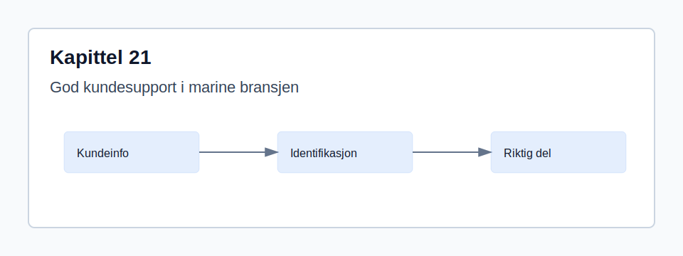

## Tekniske systemillustrasjoner

## Grundig forklaring
Hvordan profesjonell støtte gis under tidspress og usikkerhet må forstås både teknisk og praktisk. I marine reservedeler er det sjelden nok å vite hva kunden kaller delen. Medarbeideren må forstå hvilken funksjon delen har, hvor den sitter, hvilken motorvariant den tilhører, og hva som skjer dersom feil del bestilles. Derfor skal tekniske data, kundens beskrivelse og dokumentert katalogoppslag alltid vurderes sammen.

En god sak har fire kjennetegn: den har tydelig identifikasjon, tydelig problem- eller delbeskrivelse, tydelig beslutningsgrunnlag og tydelig oppfølging. Dersom ett av disse punktene mangler, skal saken markeres som usikker før kunden får et bindende svar.

## Praktisk verkstedeksempel
Et verksted står med demontert komponent og trenger rask avklaring. Medarbeideren registrerer kunde, fartøy, motorinformasjon og tidsfrist, ber om bilder av typeplate og komponent, sjekker katalog og lager, og sender et kort skriftlig svar med valgt del, grunnlag for valget og neste oppdateringstidspunkt.

## Kundesupporteksempel
Kunde: 'Motoren går dårlig, kan dere sende riktig del?' Profesjonelt svar: 'Vi kan hjelpe, men først må vi skille mellom symptom og delbehov. Send serienummer, bilde av motorplate, bilde av området feilen gjelder og en kort beskrivelse av når feilen oppstår. Da kan vi foreslå riktig del eller riktig neste feilsøkingstrinn.'

## Vanlige feil og årsaker
- feil eller ufullstendig serienummer.
- delnummer som er erstattet uten at saken dokumenteres.
- symptom som tolkes som delbehov uten feilsøking.
- kunde har bilde av lignende del, men ikke korrekt motorvariant.
- manglende avklaring av antall, side, posisjon eller leveringstid.

## Feilsøkingsflyt
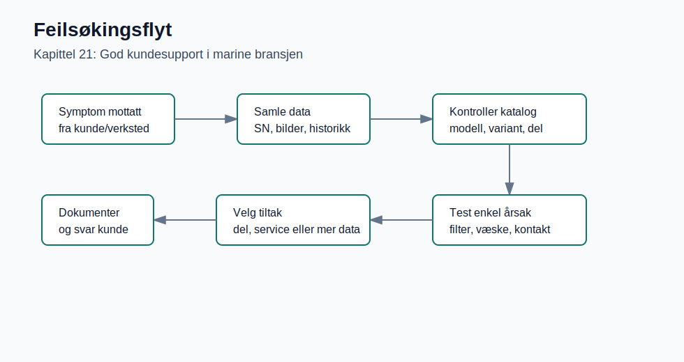

```mermaid
flowchart TD
    A[Symptom eller forespørsel mottatt] --> B[Samle serienummer, bilder og historikk]
    B --> C{Er motor og variant sikkert identifisert?}
    C -- Nei --> D[Be om mer dokumentasjon før del bekreftes]
    C -- Ja --> E[Kontroller delnummer og posisjon i katalog]
    E --> F{Stemmer symptom med foreslått del?}
    F -- Nei --> G[Foreslå feilsøking eller teknisk kontroll]
    F -- Ja --> H[Kontroller lager, pris og levering]
    H --> I[Send dokumentert kundesvar]
```

## Vedlikeholdsprosedyre
1. Avklar driftstimer, siste service og driftsmiljø.
2. Kontroller olje, filter, kjølevæske, sjøvannskrets, reimer, slanger og elektriske kontakter.
3. Sammenlign vedlikeholdsbehov med produsentens intervaller og faktisk bruk.
4. Anbefal servicekit når flere slitedeler bør skiftes samtidig.
5. Dokumenter hva som er anbefalt, hva kunden bestiller og eventuelle avvik fra normal prosedyre.

## Serienummeridentifikasjon
Serienummeridentifikasjon starter med å finne typeplate, motornummer eller annen unik identifikasjon. Be om bilde, ikke bare avskrift, fordi feil tegn, mellomrom og prefiks kan endre katalogoppslaget. Når serienummer ikke finnes, bygges identifikasjonen med modell, produksjonsår, bilder, tidligere fakturaer, servicehistorikk og delnummer fra monterte komponenter.

Minimumsdata bør være: fabrikat, modell, serienummer, eventuell product number/arrangement/CPL/motornummer, bilde av typeplate og bilde av motorens installasjon. Ved tvil skal saken stoppes for avklaring før del bekreftes.

## Reservedelsidentifikasjon
Reservedelsidentifikasjon skal bekrefte delnummer, posisjon, antall per motor, variant, side og eventuell erstatning. Dersom kunden oppgir et gammelt nummer, må det kontrolleres mot supersession. Dersom kunden bare sender bilde, skal bildet brukes som støtte, ikke som eneste grunnlag for bestilling.

Sjekk alltid om delnummeret gjelder enkeltkomponent, reparasjonssett, servicekit eller komplett enhet. Kontroller også om varen er høyre/venstre, gammel/ny type, standard/oversize eller knyttet til en bestemt produksjonsperiode.

## Bestillingsprosedyre
1. Opprett eller oppdater sak med kunde, fartøy, kontaktperson og tidsfrist.
2. Verifiser motoridentifikasjon og lagre bildedokumentasjon.
3. Finn korrekt delnummer i relevant katalog eller leverandørgrunnlag.
4. Kontroller supersession, antall, lagerstatus, pris, returvilkår og leveringstid.
5. Send ordrebekreftelse med delnummer, beskrivelse, antall, pris, levering og forbehold.
6. Følg opp leveransen til kunden har mottatt varen eller saken er lukket.

## Kvalitetspunkter før svar
- Har vi nok data til å gi et sikkert svar?
- Er delnummeret kontrollert mot riktig motorvariant?
- Er kundens tidsfrist realistisk med valgt fraktmåte?
- Er eventuelle forbehold skrevet tydelig?
- Kan en kollega forstå beslutningen ved å lese saken senere?

## Kapittelsammendrag
Hovedpoenget i kapittel 21 er at profesjonelt reservedelsarbeid krever struktur. Teknisk kunnskap, engelske fagtermer, praktisk feilsøking, dokumentasjon og kundedialog må henge sammen. Når medarbeideren jobber systematisk, reduseres feilbestillinger, kunden får bedre svar, og verkstedet kan planlegge arbeidet tryggere.

## Kryssreferanser
- For forrige tema, se kapittel 20: Bestilling av deler fra leverandører og interne lagre.
- For neste tema, se kapittel 22: Hvordan håndtere uklare eller mangelfulle opplysninger.
- For grunnleggende identifikasjon, se kapittel 12 og 17.
- For merkevise eksempler, se kapitlene 26-32.

## Fordypning for intern opplæring
Dette kapitlet skal brukes som arbeidsstandard, ikke bare som lesestoff. Når en ny medarbeider møter en sak om kundesupport, skal vedkommende trene på å gå rolig fra fakta til vurdering og deretter til handling. I en marinemotorforhandler er konsekvensen av en feil ofte større enn verdien av selve delen. En feil impeller, feil sensor, feil filterinnsats eller feil pakningssett kan føre til tapt verkstedtid, utsatt avgang, irritert kunde og i verste fall ny driftsstans. Derfor skal hver sak behandles som en teknisk beslutning med sporbar dokumentasjon.

Profesjonelt nivå i dette kapitlet betyr at medarbeideren kan arbeide sikkert med kundesupport. Før kunden får et bindende svar, skal opplysningene i saken kontrolleres mot motorens identitet, faktisk installasjon og relevant produsentterminologi. Det praktiske målet er ikke å finne et raskt nummer, men å kunne forklare hvorfor valgt del, kontrollpunkt eller kundesvar er riktig for akkurat denne motoren. Når informasjon mangler, skal medarbeideren beskrive hva som mangler, hvorfor det er nødvendig, og hvilket neste steg som bringer saken videre.

## Tekniske forklaringer
Teknisk forståelse i dette kapitlet skal bygges rundt aktiv lytting, teknisk avklaring, realistiske svar og ryddig oppfølging. Medarbeideren må skille mellom synlig symptom, sannsynlig systemfeil og bestillbar komponent. En del kan se riktig ut på bilde, men likevel være feil dersom posisjon, variant, rating, kjøleroppsett, elektrisk plugg, monteringsside eller servicehistorikk ikke stemmer. Derfor skal teknisk vurdering alltid kobles til både funksjon og dokumentasjon: hva gjør komponenten, hvilket system påvirker den, og hvilken produsentkilde bekrefter at den passer.

I praksis betyr dette at tekniske data skal kobles til motorens faktiske installasjon. Marine motorer står ofte trangt, er utsatt for salt, vibrasjon, fukt og ujevnt belastningsmønster, og de kan være bygget om gjennom mange år. En motor kan ha original kjøler, ettermontert eksosbend, alternativ dynamo, endret filterbrakett eller annen sjøvannspumpe enn standard. Slike forhold gjør at delidentifikasjon må bygge på både produsentdata og synlig dokumentasjon fra motoren.

Produsentterminologi er en del av den tekniske forståelsen. Bruk uttrykk som Serial Number, Engine Number, Part Number, Service Kit, Exploded View, Supersession når de er relevante. Ikke oversett dem på en måte som fjerner presisjon. Skriv for eksempel «Engine Serial Number (ESN)» første gang og deretter «ESN» i saken dersom produsenten bruker dette. Skriv «Arrangement Number» når CAT-data krever det, «Product Number» når Volvo Penta bruker det, «CPL» når Cummins-konfigurasjon må kontrolleres, og «Model Code» når Yanmar-identifikasjon bygger på modellkode. Dette gjør dialogen med internasjonale leverandører mer presis.

## Illustrasjonsforslag
- Oversiktsdiagram som viser hvor kundesupport passer inn i total arbeidsflyt fra kundeforespørsel til levert del.
- Nærbilde av typeplate/motorskilt med markering av serienummer, motornummer, modell og eventuell variantkode.
- Sprengskisse med markert posisjon, delnummer, antall per motor og mulige alternative versjoner.
- Feilsøkingsflyt med beslutningspunkter: mangler data, stemmer symptom, kreves mer teknisk kontroll, kan ordre bekreftes.
- Sammenligningsbilde av gammel og ny del der forskjell i tilkobling, side, lengde eller sensorplugg er markert.

## Virkelige verkstedseksempler
Eksempel 1: Et verksted står med en demontert komponent på benken og kunden venter på avklaring før fartøyet kan settes tilbake i drift. Verkstedet sender et nærbilde av delen, men ingen motorplate. En uerfaren medarbeider kan bli fristet til å søke på nummeret som står på støpegodset. En profesjonell medarbeider svarer at støpenummer ikke nødvendigvis er bestillbart delnummer, ber om bilde av typeplate, oversiktsbilde av motoren og bilde av monteringsstedet, og forklarer at dette hindrer feilbestilling. Når informasjonen kommer, kontrolleres delnummer mot sprengskisse, posisjon og antall. Først da gis pris og leveringstid.

Eksempel 2: En kunde ringer sent på dagen og sier at motoren har høy temperatur etter service. Kunden ønsker ny termostat. Medarbeideren skal ikke automatisk konkludere med termostatfeil. Spørsmålene bør avklare om impeller er byttet, om sjøvannsfilteret er rent, om kjølevæskenivået er riktig, om alarmen kommer ved tomgang eller belastning, og om det finnes lekkasje rundt varmeveksler eller slanger. Dersom kunden likevel vil bestille termostat, dokumenteres at feilsøking er anbefalt, og delnummer kontrolleres mot serienummer før ordre.

Eksempel 3: En intern selger mottar en gammel faktura med et delnummer som ikke lenger finnes. Riktig prosess er å kontrollere supersession, se om ny del krever tilhørende pakning, boltsett eller adapter, og notere både gammelt og nytt nummer i saken. Kunden skal få vite at delen er erstattet, hva som leveres, og om det finnes monteringsforbehold.

## Reservedelsidentifisering i praksis
Reservedelsidentifisering skal følge en fast rekkefølge. Først kontrolleres motorens identitet. Deretter kontrolleres delens system: drivstoff, luft, kjøling, smøring, eksos, elektrisk eller mekanisk kraftoverføring. Så kontrolleres posisjon i sprengskisse eller parts list. Til slutt kontrolleres antall, variant, supersession og leveringsstatus. Denne rekkefølgen hindrer at medarbeideren hopper direkte fra kundens ord til et tilfeldig delnummer.

Når en del har synlig nummer, må nummeret tolkes riktig. Mange komponenter har produksjonsnummer, støpenummer, leverandørnummer eller revisjonskode som ikke er det samme som bestillbart part number. Et filter kan ha nummer fra filterprodusent, men motorprodusentens parts catalogue kan bruke et annet nummer. En pumpe kan ha nummer på lokk, hus og komplett enhet. Spør derfor alltid: gjelder nummeret komplett del, reparasjonssett, underkomponent eller produsentens råkomponent?

## Serienummer og motornummer
Serienummer og motornummer er grunnlaget for korrekt katalogoppslag. Be kunden sende bilde av typeplate eller dataplate. Dersom kunden skriver nummeret manuelt, skal nummeret likevel kontrolleres mot bilde når det er mulig. Noter hele nummeret, inkludert prefiks, suffiks, bindestrek, mellomrom og eventuelle bokstaver. På enkelte produsenter kan små forskjeller peke til forskjellig produksjonsperiode, rating eller konfigurasjon.

Bruk motornummer sammen med modell, variant og applikasjon. En motor som driver generator kan ha andre deler enn en fremdriftsmotor. En motor i yrkesbåt kan ha annen rating enn samme motor i fritidsbåt. En eldre motor kan være bygget om med ny dynamo, annen sjøvannspumpe eller uoriginal filterbrakett. Dersom typeplate mangler, bygg identifikasjonen gjennom flere kilder: servicebok, tidligere faktura, bilder av motorens sider, nummer på pumpe, filter, turbo og gear, samt opplysninger om fartøy og produksjonsår.

## Feilsøking steg for steg
1. Definer symptomet med kundens egne ord og skriv det i saken. Skill mellom «kunden ønsker del» og «kunden beskriver feil».
2. Avklar når feilen oppstår: start, tomgang, belastning, marsjfart, varm motor, kald motor eller etter nylig service.
3. Kontroller grunnleggende forhold: væskenivå, filter, luft i drivstoff, sjøvannsstrøm, reimer, elektriske kontakter, sikringer og synlige lekkasjer.
4. Knytt symptomet til system: lav effekt peker ofte mot luft/drivstoff/eksos, høy temperatur mot kjøling, lavt oljetrykk mot smøring/sensor, startproblem mot batteri/starter/gløding/drivstoff.
5. Be om bilder eller måledata dersom symptomet ikke kan kobles sikkert til en del. Dette kan være bilde av alarmdisplay, trykkmåling, temperaturmåling eller bilde av montert komponent.
6. Kontroller relevant delnummer mot serienummer og variant. Dersom flere alternativer finnes, forklar kunden hva som skiller dem.
7. Dokumenter anbefalt tiltak, usikkerhet og eventuelle forbehold før ordre bekreftes.

## Vedlikehold
Vedlikehold skal vurderes mot driftstimer, produsentens maintenance schedule og faktisk driftsmiljø. Marine motorer som går korte turer, mye tomgang eller i salt miljø kan trenge hyppigere kontroll enn standard intervall antyder. Nye medarbeidere skal lære å spørre om siste service, hvilke filter som ble byttet, hvilken olje som ble brukt, om impeller er kontrollert, og om kjølevæske eller anoder er byttet etter plan.

En god vedlikeholdsanbefaling er konkret. I stedet for å skrive «ta service», bør medarbeideren foreslå relevante deler: olje- og drivstoffilter, luftfilter, impeller, reim, pakninger, anoder, kjølevæske og eventuelt servicekit. Dersom kunden har ukjent servicehistorikk, bør komplett servicekit vurderes. Dersom kunden har hatt overoppheting, bør sjøvannskrets og varmeveksler kontrolleres før bare én komponent byttes.

## Vanlige feil
- Serienummer leses feil fordi et tegn forveksles, for eksempel O/0 eller I/1.
- Kunden oppgir modellnavn, men ikke variant, rating eller applikasjon.
- Del velges ut fra bilde alene uten kontroll mot sprengskisse eller produsentkatalog.
- Supersession aksepteres uten å kontrollere om ny del krever tilbehør, pakning eller ombygging.
- Hastepress gjør at leveringsløfte gis før lagerstatus og fraktmulighet er bekreftet.
- Saksnotat mangler grunnlaget for beslutningen, slik at kollega ikke kan etterprøve valget.

## Kontrollspørsmål
- Hva er den viktigste tekniske risikoen i en sak som gjelder kundesupport?
- Hvilke opplysninger må dokumenteres før bindende delnummer bekreftes?
- Hvordan forklarer du kunden hvorfor bilde av typeplate er nødvendig?
- Når bør du stoppe en ordre og be om mer dokumentasjon?
- Hvilke engelske produsentuttrykk bør du kunne bruke i denne typen sak?
- Hvordan dokumenterer du at et delnummer er erstattet av et nytt nummer?

## Praktisk sjekkliste for medarbeider
- Les saken som om en kollega skal overta den i morgen.
- Kontroller at motoridentifikasjon er dokumentert med bilde eller sikker kilde.
- Sjekk at delnummeret er knyttet til riktig posisjon i katalogen.
- Skriv tydelig om kunden har bedt om enkeltkomponent, servicekit eller komplett enhet.
- Noter om varen er spesialbestilling, utgått, erstattet eller ikke returbar.
- Send kundesvar med neste steg, ikke bare et løst delnummer.

## Kapittelspesifikk systemforståelse
For dette kapitlet er kjernen å forstå kundesupport under teknisk og kommersielt tidspress. Medarbeideren skal kunne forklare dette med praktiske ord til både kunde og kollega. Det betyr at teknisk teori må kobles til konkrete handlinger: hvilke data skal innhentes, hvilke komponenter kan være berørt, hvilken produsentterminologi skal brukes, og hva må dokumenteres før saken kan gå videre. God support forklarer både hva vi vet, hva vi ikke vet, og hva neste steg er.

Når systemet vurderes, skal medarbeideren først plassere problemet i riktig teknisk sammenheng. Dersom kunden beskriver en alarm, må man finne ut om alarmen kommer fra reelt mekanisk avvik, elektrisk sensorfeil, feil etter service eller feil tolkning av instrumentet. Dersom kunden beskriver en del, må man avklare om kunden mener komplett enhet, servicekit, reparasjonssett eller enkeltkomponent. Dersom kunden beskriver motoren med vanlig navn, må man kontrollere om produsenten bruker mer presise begreper i katalogen.

## Komponentoversikt og arbeidsgrense
Relevante komponenter og opplysninger i dette kapitlet omfatter: førstesvar, behovsavklaring, teknisk forklaring, oppdateringspunkt, avvik og lukking. Listen er ikke ment som en erstatning for produsentens parts catalogue, men som en praktisk påminnelse om hva nye medarbeidere skal tenke på før de søker del. I interne saker skal komponentnavn skrives så presist som mulig. Bruk for eksempel «sjøvannspumpe / raw water pump» i stedet for bare «pumpe» når funksjonen er kjent, og «varmeveksler / heat exchanger» i stedet for bare «kjøler» når det er den komponenten saken gjelder.

Arbeidsgrensen for en reservedelsmedarbeider er også viktig. Medarbeideren skal ikke overta mekanikerens ansvar for demontering, måling eller diagnose på motoren, men skal kunne stille riktige spørsmål og foreslå riktig dokumentasjon. Når en sak går fra enkel delidentifikasjon til teknisk diagnose, skal dette markeres i saken. Da kan verksted, teknisk ansvarlig eller leverandør involveres med et klart spørsmål og et ryddig faktagrunnlag.

## Praktisk beslutningsregel
Bruk denne regelen i alle saker knyttet til kapitlet: Hvis motoridentifikasjon, komponentposisjon eller symptom ikke er sikkert nok dokumentert, skal medarbeideren ikke gi bindende delbekreftelse. Kunden kan få et foreløpig svar, men svaret må inneholde hva som mangler, hvorfor det mangler, og hva som skjer når informasjonen er mottatt. Dette er ikke treg service; det er profesjonell risikokontroll.

## Målrettet fordypning kapittel 21-30
### Kundesupport som teknisk styring
God kundesupport i marine bransjen handler om mer enn hyggelig tone. Den skal styre en teknisk sak fremover uten at kvaliteten faller. Førstesvaret bør bekrefte at saken er mottatt, forklare hvilke opplysninger som trengs, og gi kunden et tidspunkt for neste oppdatering. Ved reservedelssaker betyr dette vanligvis motorfabrikat, modell, serienummer eller motornummer, bilde av typeplate, bilde av delen eller området, symptombeskrivelse, hastegrad og leveringssted.

Supportmedarbeideren skal oversette kundens språk til teknisk arbeidsgrunnlag. Når kunden sier «motoren går varm», kan internt notat skrives som mulig avvik i kjølesystem: raw water flow, impeller, heat exchanger, thermostat, coolant level eller sensor. Når kunden sier «jeg trenger pumpe», må support avklare pumpetype: raw water pump, circulation pump, fuel lift pump, injection pump eller hydraulic pump. Slik blir kundedialogen en del av feilsøkingen, ikke et separat administrativt steg.

### Praktisk anvendelse i opplæring
Bruk kapitlet som caseøvelse der deltakeren skal skrive et kundesvar, identifisere nødvendige produsentdata og velge neste tekniske kontrollpunkt. Deltakeren skal også forklare hva som kan besvares av reservedelsavdelingen, og hva som må avklares av verksted, teknisk ansvarlig eller leverandør. Målet er at medarbeideren kan arbeide raskt, men fortsatt med sporbarhet og korrekt produsentterminologi.

## Realistisk opplæring i praksis
### Verkstedhistorie
En typisk sak i dette temaet starter med kunde beskriver alarm, ikke årsak. Verkstedet trenger et raskt svar, men den erfarne medarbeideren stopper opp og spør først: hva vet vi sikkert, hva antar vi, og hva kan gi følgeskade hvis vi tar feil? I praksis betyr det at supportdialog må kobles til bilde, serienummer, komponentposisjon og kundens symptom før saken lukkes. Historien skal brukes i opplæring som en øvelse i å skrive et kort saksnotat: observasjon, vurdering, neste handling og forbehold.

### Kundehistorie
Kunden beskriver ofte problemet med driftsspråk: «motoren går tungt», «alarm kommer etter ti minutter», «jeg trenger den samme delen som sist» eller «båten skal ut i morgen». En profesjonell respons er rolig og konkret: bekreft behovet, forklar hvorfor identifikasjon trengs, be om riktig dokumentasjon og gi et realistisk tidspunkt for neste svar. Ikke korriger kunden unødvendig; oversett kundens språk til teknisk språk i saken.

### Typiske feil nye ansatte gjør
- søker på første synlige nummer uten å avklare om det er støpenummer, leverandørnummer eller bestillbart part number.
- lover levering før lagerstatus, frakt og returvilkår er kontrollert.
- antar at tidligere faktura alltid gjelder samme motorvariant.
- blander symptom og årsak, spesielt ved varme, lav effekt, startproblem og alarm.
- skriver for korte notater slik at kollega ikke kan forstå hvorfor valget ble tatt.

### Tips fra erfarne mekanikere og reservedelsselgere
- Se alltid etter systemet rundt delen: slanger, braketter, sensorer, reimer, kjølere og tilkoblinger forteller ofte mer enn delen alene.
- Still ett presist spørsmål om gangen når kunden er stresset; mange dårlige svar kommer av for lange spørsmålslister.
- Sammenlign gammel og ny del mot funksjon, ikke bare form. Riktig del skal passe, men også løse riktig problem.
- En erfaren reservedelsselger tenker i risiko: Hva er billigst å avklare nå, og hva blir dyrt hvis vi hopper over det?

### Vanlige kundespørsmål
| Spørsmål fra kunde | Profesjonelt svar |
|---|---|
| «Kan du bare sende samme del som sist?» | «Ja, hvis vi først bekrefter at det gjelder samme motor, samme posisjon og ingen supersession siden sist.» |
| «Holder det med bilde?» | «Bilde hjelper, men vi trenger også motoridentitet for å sikre variant og delnummer.» |
| «Hvorfor tar dette tid?» | «Fordi feil del kan gi ny driftsstans. Vi kontrollerer grunnlaget før vi lover levering.» |

### Beslutningstre for saken
| Trinn | Spørsmål | Handling |
|---|---|---|
| 1 | Er motoridentitet dokumentert med bilde eller sikker historikk? | Hvis nei: be om typeplate/dataplate eller alternativ dokumentasjon. |
| 2 | Er komponentens funksjon og posisjon kjent? | Hvis nei: be om oversiktsbilde og bilde av monteringssted. |
| 3 | Stemmer kundens symptom med delen som ønskes? | Hvis nei: anbefal feilsøking før del bestilles. |
| 4 | Finnes det supersession, kit eller variantvalg? | Kontroller produsentkilde og skriv forbehold i saken. |
| 5 | Kan pris, levering og returvilkår bekreftes? | Send dokumentert svar med neste steg og tydelig gyldighet. |

### Rask oppslagstabell
| Situasjon | Kontroller først | Vanlig fallgruve |
|---|---|---|
| Hasteordre | sikker motor-ID, lager, fraktfrist | levering loves før teknisk kontroll |
| Del fra bilde | posisjon, skala, tilkoblinger, nummer | bilde brukes som eneste beslutningsgrunnlag |
| Gammelt delnummer | supersession og kitinnhold | ny del krever ekstra pakning eller adapter |
| Uklart symptom | driftssituasjon, alarm, siste service | symptom blir tolket som sikker komponentfeil |

### Praktisk sjekkliste og inspeksjonsrutine
- Start med motoridentitet: fabrikat, modell, serienummer, variant, applikasjon og bilde av skilt.
- Kontroller området rundt komponenten: lekkasje, korrosjon, knekte fester, slitasje, varmemerker og uoriginale endringer.
- Spør om siste vedlikehold: olje, filter, impeller, reimer, kjølevæske, anoder og drivstoffilter.
- Noter driftstype: fritidsbruk, yrkesbruk, generator, fremdrift, tomgangsdrift eller langvarig høy belastning.
- Avklar om saken gjelder akutt drift, planlagt service, reklamasjon eller lagerpåfyll.

### Generelle vedlikeholdsintervaller som opplæringspunkt
| Kontrollpunkt | Typisk vurdering i opplæring | Må verifiseres |
|---|---|---|
| Olje og oljefilter | ofte basert på timer og kalender | produsentens maintenance schedule |
| Drivstoffilter/vannutskiller | hyppigere ved dårlig drivstoff eller sesongstart | motor- og filterspesifikasjon |
| Impeller og sjøvannskrets | kontrolleres særlig før sesong og etter varmgang | produsentens intervall og installasjon |
| Reimer, slanger og klemmer | visuell kontroll ved service og feilsøking | dimensjon, stramming og delnummer |

### Produsentverifikasjon
Alle konkrete delnumre, momentverdier, serviceintervaller, garantikrav, programvaredata og produsentspesifikke grenser skal kontrolleres mot offisiell produsentdokumentasjon før de brukes i tilbud, ordre eller verkstedinstruks. Marker tydelig i saken når svaret bygger på antakelse, eldre historikk, bilde uten motor-ID eller generell erfaring. Intervaller i tabellen er generelle opplæringspunkter. Faktiske intervaller styres av produsent, motorvariant, driftstimer, kalenderkrav, belastning og miljø.

## Produsentverifikasjon og faglig forbehold
Denne manualen skal brukes som intern opplæring og arbeidsmetode. Produsentspesifikke delnumre, intervaller, momentverdier, garantikrav og tekniske grenseverdier skal verifiseres mot gjeldende produsentdokumentasjon før de brukes i kundeordre eller verkstedinstruks. Marker saken internt dersom opplysningen bygger på antakelse, eldre historikk eller bilde uten bekreftet motoridentitet.

## Quiz med fasit
1. Hvilke tekniske data bør alltid samles før en del bekreftes?
2. Hvorfor er engelsk terminologi viktig i marine reservedeler?
3. Hva bør gjøres dersom kunden bare sender et bilde av delen?
4. Hvilke punkter bør kontrolleres før ordrebekreftelse sendes?
5. Hvorfor skal feilsøking dokumenteres, selv når kunden allerede ber om en bestemt del?

### Svar
1. Fabrikat, modell, serienummer, variantdata, bilde av typeplate, delnummer, posisjon og kundens symptombeskrivelse.
2. Fordi kataloger, portaler, servicemanualer og leverandørdialog ofte bruker engelske begreper som må forstås presist.
3. Be om serienummer, oversiktsbilde av motoren og eventuelle nummer på delen; bildet brukes som støtte, ikke eneste grunnlag.
4. Delnummer, antall, variant, pris, lagerstatus, leveringstid, frakt, returvilkår og eventuelle forbehold.
5. Fordi symptomet kan ha flere årsaker, og dokumentasjon viser hvorfor anbefalingen ble gitt.

---

# Kapittel 22: Hvordan håndtere uklare eller mangelfulle opplysninger

## Kapittelrolle
Dette kapitlet gir en grundig praktisk innføring i mangelfulle opplysninger. Temaet er viktig fordi reservedelsarbeid i marine miljøer kombinerer teknisk forståelse, presis kundedialog, dokumentert saksbehandling og realistisk leveranseoppfølging. Målet er at en ny medarbeider skal kunne bruke kunnskapen direkte i arbeid med verksted, kunde, lager og leverandør.

## Læringsmål
Etter kapitlet skal deltakeren kunne:
- forklare hovedbegrepene innen mangelfulle opplysninger
- bruke serienummer, modellinformasjon og delnummer i praktisk reservedelsarbeid
- kommunisere trygt med kunde, verksted, lager og leverandør
- dokumentere beslutninger slik at andre kan etterprøve saken
- kjenne igjen vanlige feil og velge riktig neste handling

## English technical terminology
- **Serial Number:** engelsk fagterm som ofte brukes i kataloger, servicelitteratur, leverandørportaler og internasjonal kundedialog.
- **Part Number:** engelsk fagterm som ofte brukes i kataloger, servicelitteratur, leverandørportaler og internasjonal kundedialog.
- **Engine Model:** engelsk fagterm som ofte brukes i kataloger, servicelitteratur, leverandørportaler og internasjonal kundedialog.
- **Variant:** engelsk fagterm som ofte brukes i kataloger, servicelitteratur, leverandørportaler og internasjonal kundedialog.
- **Service Kit:** engelsk fagterm som ofte brukes i kataloger, servicelitteratur, leverandørportaler og internasjonal kundedialog.
- **Troubleshooting:** engelsk fagterm som ofte brukes i kataloger, servicelitteratur, leverandørportaler og internasjonal kundedialog.
- **Maintenance:** engelsk fagterm som ofte brukes i kataloger, servicelitteratur, leverandørportaler og internasjonal kundedialog.
- **Ordering Procedure:** engelsk fagterm som ofte brukes i kataloger, servicelitteratur, leverandørportaler og internasjonal kundedialog.
- **Supersession:** engelsk fagterm som ofte brukes i kataloger, servicelitteratur, leverandørportaler og internasjonal kundedialog.
- **Technical Support:** engelsk fagterm som ofte brukes i kataloger, servicelitteratur, leverandørportaler og internasjonal kundedialog.

## Hoveddiagram
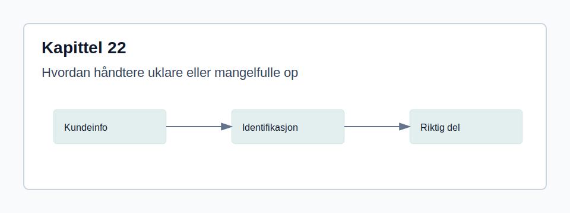

## Tekniske systemillustrasjoner

## Grundig forklaring
Hvordan saker håndteres når kunden mangler data må forstås både teknisk og praktisk. I marine reservedeler er det sjelden nok å vite hva kunden kaller delen. Medarbeideren må forstå hvilken funksjon delen har, hvor den sitter, hvilken motorvariant den tilhører, og hva som skjer dersom feil del bestilles. Derfor skal tekniske data, kundens beskrivelse og dokumentert katalogoppslag alltid vurderes sammen.

En god sak har fire kjennetegn: den har tydelig identifikasjon, tydelig problem- eller delbeskrivelse, tydelig beslutningsgrunnlag og tydelig oppfølging. Dersom ett av disse punktene mangler, skal saken markeres som usikker før kunden får et bindende svar.

## Praktisk verkstedeksempel
Et verksted står med demontert komponent og trenger rask avklaring. Medarbeideren registrerer kunde, fartøy, motorinformasjon og tidsfrist, ber om bilder av typeplate og komponent, sjekker katalog og lager, og sender et kort skriftlig svar med valgt del, grunnlag for valget og neste oppdateringstidspunkt.

## Kundesupporteksempel
Kunde: 'Motoren går dårlig, kan dere sende riktig del?' Profesjonelt svar: 'Vi kan hjelpe, men først må vi skille mellom symptom og delbehov. Send serienummer, bilde av motorplate, bilde av området feilen gjelder og en kort beskrivelse av når feilen oppstår. Da kan vi foreslå riktig del eller riktig neste feilsøkingstrinn.'

## Vanlige feil og årsaker
- feil eller ufullstendig serienummer.
- delnummer som er erstattet uten at saken dokumenteres.
- symptom som tolkes som delbehov uten feilsøking.
- kunde har bilde av lignende del, men ikke korrekt motorvariant.
- manglende avklaring av antall, side, posisjon eller leveringstid.

## Feilsøkingsflyt

```mermaid
flowchart TD
    A[Symptom eller forespørsel mottatt] --> B[Samle serienummer, bilder og historikk]
    B --> C{Er motor og variant sikkert identifisert?}
    C -- Nei --> D[Be om mer dokumentasjon før del bekreftes]
    C -- Ja --> E[Kontroller delnummer og posisjon i katalog]
    E --> F{Stemmer symptom med foreslått del?}
    F -- Nei --> G[Foreslå feilsøking eller teknisk kontroll]
    F -- Ja --> H[Kontroller lager, pris og levering]
    H --> I[Send dokumentert kundesvar]
```

## Vedlikeholdsprosedyre
1. Avklar driftstimer, siste service og driftsmiljø.
2. Kontroller olje, filter, kjølevæske, sjøvannskrets, reimer, slanger og elektriske kontakter.
3. Sammenlign vedlikeholdsbehov med produsentens intervaller og faktisk bruk.
4. Anbefal servicekit når flere slitedeler bør skiftes samtidig.
5. Dokumenter hva som er anbefalt, hva kunden bestiller og eventuelle avvik fra normal prosedyre.

## Serienummeridentifikasjon
Serienummeridentifikasjon starter med å finne typeplate, motornummer eller annen unik identifikasjon. Be om bilde, ikke bare avskrift, fordi feil tegn, mellomrom og prefiks kan endre katalogoppslaget. Når serienummer ikke finnes, bygges identifikasjonen med modell, produksjonsår, bilder, tidligere fakturaer, servicehistorikk og delnummer fra monterte komponenter.

Minimumsdata bør være: fabrikat, modell, serienummer, eventuell product number/arrangement/CPL/motornummer, bilde av typeplate og bilde av motorens installasjon. Ved tvil skal saken stoppes for avklaring før del bekreftes.

## Reservedelsidentifikasjon
Reservedelsidentifikasjon skal bekrefte delnummer, posisjon, antall per motor, variant, side og eventuell erstatning. Dersom kunden oppgir et gammelt nummer, må det kontrolleres mot supersession. Dersom kunden bare sender bilde, skal bildet brukes som støtte, ikke som eneste grunnlag for bestilling.

Sjekk alltid om delnummeret gjelder enkeltkomponent, reparasjonssett, servicekit eller komplett enhet. Kontroller også om varen er høyre/venstre, gammel/ny type, standard/oversize eller knyttet til en bestemt produksjonsperiode.

## Bestillingsprosedyre
1. Opprett eller oppdater sak med kunde, fartøy, kontaktperson og tidsfrist.
2. Verifiser motoridentifikasjon og lagre bildedokumentasjon.
3. Finn korrekt delnummer i relevant katalog eller leverandørgrunnlag.
4. Kontroller supersession, antall, lagerstatus, pris, returvilkår og leveringstid.
5. Send ordrebekreftelse med delnummer, beskrivelse, antall, pris, levering og forbehold.
6. Følg opp leveransen til kunden har mottatt varen eller saken er lukket.

## Kvalitetspunkter før svar
- Har vi nok data til å gi et sikkert svar?
- Er delnummeret kontrollert mot riktig motorvariant?
- Er kundens tidsfrist realistisk med valgt fraktmåte?
- Er eventuelle forbehold skrevet tydelig?
- Kan en kollega forstå beslutningen ved å lese saken senere?

## Kapittelsammendrag
Hovedpoenget i kapittel 22 er at profesjonelt reservedelsarbeid krever struktur. Teknisk kunnskap, engelske fagtermer, praktisk feilsøking, dokumentasjon og kundedialog må henge sammen. Når medarbeideren jobber systematisk, reduseres feilbestillinger, kunden får bedre svar, og verkstedet kan planlegge arbeidet tryggere.

## Kryssreferanser
- For forrige tema, se kapittel 21: God kundesupport i marine bransjen.
- For neste tema, se kapittel 23: Kommunikasjon ved forsinkelser eller manglende tilgjengelighet.
- For grunnleggende identifikasjon, se kapittel 12 og 17.
- For merkevise eksempler, se kapitlene 26-32.

## Fordypning for intern opplæring
Dette kapitlet skal brukes som arbeidsstandard, ikke bare som lesestoff. Når en ny medarbeider møter en sak om mangelfulle opplysninger, skal vedkommende trene på å gå rolig fra fakta til vurdering og deretter til handling. I en marinemotorforhandler er konsekvensen av en feil ofte større enn verdien av selve delen. En feil impeller, feil sensor, feil filterinnsats eller feil pakningssett kan føre til tapt verkstedtid, utsatt avgang, irritert kunde og i verste fall ny driftsstans. Derfor skal hver sak behandles som en teknisk beslutning med sporbar dokumentasjon.

Profesjonelt nivå i dette kapitlet betyr at medarbeideren kan arbeide sikkert med uklare opplysninger. Før kunden får et bindende svar, skal opplysningene i saken kontrolleres mot motorens identitet, faktisk installasjon og relevant produsentterminologi. Det praktiske målet er ikke å finne et raskt nummer, men å kunne forklare hvorfor valgt del, kontrollpunkt eller kundesvar er riktig for akkurat denne motoren. Når informasjon mangler, skal medarbeideren beskrive hva som mangler, hvorfor det er nødvendig, og hvilket neste steg som bringer saken videre.

## Tekniske forklaringer
Teknisk forståelse i dette kapitlet skal bygges rundt manglende typeplate, uklare bilder, ufullstendig symptom og kontrollspørsmål. Medarbeideren må skille mellom synlig symptom, sannsynlig systemfeil og bestillbar komponent. En del kan se riktig ut på bilde, men likevel være feil dersom posisjon, variant, rating, kjøleroppsett, elektrisk plugg, monteringsside eller servicehistorikk ikke stemmer. Derfor skal teknisk vurdering alltid kobles til både funksjon og dokumentasjon: hva gjør komponenten, hvilket system påvirker den, og hvilken produsentkilde bekrefter at den passer.

I praksis betyr dette at tekniske data skal kobles til motorens faktiske installasjon. Marine motorer står ofte trangt, er utsatt for salt, vibrasjon, fukt og ujevnt belastningsmønster, og de kan være bygget om gjennom mange år. En motor kan ha original kjøler, ettermontert eksosbend, alternativ dynamo, endret filterbrakett eller annen sjøvannspumpe enn standard. Slike forhold gjør at delidentifikasjon må bygge på både produsentdata og synlig dokumentasjon fra motoren.

Produsentterminologi er en del av den tekniske forståelsen. Bruk uttrykk som Serial Number, Engine Number, Part Number, Service Kit, Exploded View, Supersession når de er relevante. Ikke oversett dem på en måte som fjerner presisjon. Skriv for eksempel «Engine Serial Number (ESN)» første gang og deretter «ESN» i saken dersom produsenten bruker dette. Skriv «Arrangement Number» når CAT-data krever det, «Product Number» når Volvo Penta bruker det, «CPL» når Cummins-konfigurasjon må kontrolleres, og «Model Code» når Yanmar-identifikasjon bygger på modellkode. Dette gjør dialogen med internasjonale leverandører mer presis.

## Illustrasjonsforslag
- Oversiktsdiagram som viser hvor mangelfulle opplysninger passer inn i total arbeidsflyt fra kundeforespørsel til levert del.
- Nærbilde av typeplate/motorskilt med markering av serienummer, motornummer, modell og eventuell variantkode.
- Sprengskisse med markert posisjon, delnummer, antall per motor og mulige alternative versjoner.
- Feilsøkingsflyt med beslutningspunkter: mangler data, stemmer symptom, kreves mer teknisk kontroll, kan ordre bekreftes.
- Sammenligningsbilde av gammel og ny del der forskjell i tilkobling, side, lengde eller sensorplugg er markert.

## Virkelige verkstedseksempler
Eksempel 1: Et verksted står med en demontert komponent på benken og kunden venter på avklaring før fartøyet kan settes tilbake i drift. Verkstedet sender et nærbilde av delen, men ingen motorplate. En uerfaren medarbeider kan bli fristet til å søke på nummeret som står på støpegodset. En profesjonell medarbeider svarer at støpenummer ikke nødvendigvis er bestillbart delnummer, ber om bilde av typeplate, oversiktsbilde av motoren og bilde av monteringsstedet, og forklarer at dette hindrer feilbestilling. Når informasjonen kommer, kontrolleres delnummer mot sprengskisse, posisjon og antall. Først da gis pris og leveringstid.

Eksempel 2: En kunde ringer sent på dagen og sier at motoren har høy temperatur etter service. Kunden ønsker ny termostat. Medarbeideren skal ikke automatisk konkludere med termostatfeil. Spørsmålene bør avklare om impeller er byttet, om sjøvannsfilteret er rent, om kjølevæskenivået er riktig, om alarmen kommer ved tomgang eller belastning, og om det finnes lekkasje rundt varmeveksler eller slanger. Dersom kunden likevel vil bestille termostat, dokumenteres at feilsøking er anbefalt, og delnummer kontrolleres mot serienummer før ordre.

Eksempel 3: En intern selger mottar en gammel faktura med et delnummer som ikke lenger finnes. Riktig prosess er å kontrollere supersession, se om ny del krever tilhørende pakning, boltsett eller adapter, og notere både gammelt og nytt nummer i saken. Kunden skal få vite at delen er erstattet, hva som leveres, og om det finnes monteringsforbehold.

## Reservedelsidentifisering i praksis
Reservedelsidentifisering skal følge en fast rekkefølge. Først kontrolleres motorens identitet. Deretter kontrolleres delens system: drivstoff, luft, kjøling, smøring, eksos, elektrisk eller mekanisk kraftoverføring. Så kontrolleres posisjon i sprengskisse eller parts list. Til slutt kontrolleres antall, variant, supersession og leveringsstatus. Denne rekkefølgen hindrer at medarbeideren hopper direkte fra kundens ord til et tilfeldig delnummer.

Når en del har synlig nummer, må nummeret tolkes riktig. Mange komponenter har produksjonsnummer, støpenummer, leverandørnummer eller revisjonskode som ikke er det samme som bestillbart part number. Et filter kan ha nummer fra filterprodusent, men motorprodusentens parts catalogue kan bruke et annet nummer. En pumpe kan ha nummer på lokk, hus og komplett enhet. Spør derfor alltid: gjelder nummeret komplett del, reparasjonssett, underkomponent eller produsentens råkomponent?

## Serienummer og motornummer
Serienummer og motornummer er grunnlaget for korrekt katalogoppslag. Be kunden sende bilde av typeplate eller dataplate. Dersom kunden skriver nummeret manuelt, skal nummeret likevel kontrolleres mot bilde når det er mulig. Noter hele nummeret, inkludert prefiks, suffiks, bindestrek, mellomrom og eventuelle bokstaver. På enkelte produsenter kan små forskjeller peke til forskjellig produksjonsperiode, rating eller konfigurasjon.

Bruk motornummer sammen med modell, variant og applikasjon. En motor som driver generator kan ha andre deler enn en fremdriftsmotor. En motor i yrkesbåt kan ha annen rating enn samme motor i fritidsbåt. En eldre motor kan være bygget om med ny dynamo, annen sjøvannspumpe eller uoriginal filterbrakett. Dersom typeplate mangler, bygg identifikasjonen gjennom flere kilder: servicebok, tidligere faktura, bilder av motorens sider, nummer på pumpe, filter, turbo og gear, samt opplysninger om fartøy og produksjonsår.

## Feilsøking steg for steg
1. Definer symptomet med kundens egne ord og skriv det i saken. Skill mellom «kunden ønsker del» og «kunden beskriver feil».
2. Avklar når feilen oppstår: start, tomgang, belastning, marsjfart, varm motor, kald motor eller etter nylig service.
3. Kontroller grunnleggende forhold: væskenivå, filter, luft i drivstoff, sjøvannsstrøm, reimer, elektriske kontakter, sikringer og synlige lekkasjer.
4. Knytt symptomet til system: lav effekt peker ofte mot luft/drivstoff/eksos, høy temperatur mot kjøling, lavt oljetrykk mot smøring/sensor, startproblem mot batteri/starter/gløding/drivstoff.
5. Be om bilder eller måledata dersom symptomet ikke kan kobles sikkert til en del. Dette kan være bilde av alarmdisplay, trykkmåling, temperaturmåling eller bilde av montert komponent.
6. Kontroller relevant delnummer mot serienummer og variant. Dersom flere alternativer finnes, forklar kunden hva som skiller dem.
7. Dokumenter anbefalt tiltak, usikkerhet og eventuelle forbehold før ordre bekreftes.

## Vedlikehold
Vedlikehold skal vurderes mot driftstimer, produsentens maintenance schedule og faktisk driftsmiljø. Marine motorer som går korte turer, mye tomgang eller i salt miljø kan trenge hyppigere kontroll enn standard intervall antyder. Nye medarbeidere skal lære å spørre om siste service, hvilke filter som ble byttet, hvilken olje som ble brukt, om impeller er kontrollert, og om kjølevæske eller anoder er byttet etter plan.

En god vedlikeholdsanbefaling er konkret. I stedet for å skrive «ta service», bør medarbeideren foreslå relevante deler: olje- og drivstoffilter, luftfilter, impeller, reim, pakninger, anoder, kjølevæske og eventuelt servicekit. Dersom kunden har ukjent servicehistorikk, bør komplett servicekit vurderes. Dersom kunden har hatt overoppheting, bør sjøvannskrets og varmeveksler kontrolleres før bare én komponent byttes.

## Vanlige feil
- Serienummer leses feil fordi et tegn forveksles, for eksempel O/0 eller I/1.
- Kunden oppgir modellnavn, men ikke variant, rating eller applikasjon.
- Del velges ut fra bilde alene uten kontroll mot sprengskisse eller produsentkatalog.
- Supersession aksepteres uten å kontrollere om ny del krever tilbehør, pakning eller ombygging.
- Hastepress gjør at leveringsløfte gis før lagerstatus og fraktmulighet er bekreftet.
- Saksnotat mangler grunnlaget for beslutningen, slik at kollega ikke kan etterprøve valget.

## Kontrollspørsmål
- Hva er den viktigste tekniske risikoen i en sak som gjelder mangelfulle opplysninger?
- Hvilke opplysninger må dokumenteres før bindende delnummer bekreftes?
- Hvordan forklarer du kunden hvorfor bilde av typeplate er nødvendig?
- Når bør du stoppe en ordre og be om mer dokumentasjon?
- Hvilke engelske produsentuttrykk bør du kunne bruke i denne typen sak?
- Hvordan dokumenterer du at et delnummer er erstattet av et nytt nummer?

## Praktisk sjekkliste for medarbeider
- Les saken som om en kollega skal overta den i morgen.
- Kontroller at motoridentifikasjon er dokumentert med bilde eller sikker kilde.
- Sjekk at delnummeret er knyttet til riktig posisjon i katalogen.
- Skriv tydelig om kunden har bedt om enkeltkomponent, servicekit eller komplett enhet.
- Noter om varen er spesialbestilling, utgått, erstattet eller ikke returbar.
- Send kundesvar med neste steg, ikke bare et løst delnummer.

## Kapittelspesifikk systemforståelse
For dette kapitlet er kjernen å forstå arbeid med mangelfulle data og usikre beskrivelser. Medarbeideren skal kunne forklare dette med praktiske ord til både kunde og kollega. Det betyr at teknisk teori må kobles til konkrete handlinger: hvilke data skal innhentes, hvilke komponenter kan være berørt, hvilken produsentterminologi skal brukes, og hva må dokumenteres før saken kan gå videre. En sak med mangelfulle opplysninger skal gjøres smalere før den gjøres raskere.

Når systemet vurderes, skal medarbeideren først plassere problemet i riktig teknisk sammenheng. Dersom kunden beskriver en alarm, må man finne ut om alarmen kommer fra reelt mekanisk avvik, elektrisk sensorfeil, feil etter service eller feil tolkning av instrumentet. Dersom kunden beskriver en del, må man avklare om kunden mener komplett enhet, servicekit, reparasjonssett eller enkeltkomponent. Dersom kunden beskriver motoren med vanlig navn, må man kontrollere om produsenten bruker mer presise begreper i katalogen.

## Komponentoversikt og arbeidsgrense
Relevante komponenter og opplysninger i dette kapitlet omfatter: manglende typeplate, uklart bilde, muntlig delnavn, gammel faktura og ufullstendig symptombilde. Listen er ikke ment som en erstatning for produsentens parts catalogue, men som en praktisk påminnelse om hva nye medarbeidere skal tenke på før de søker del. I interne saker skal komponentnavn skrives så presist som mulig. Bruk for eksempel «sjøvannspumpe / raw water pump» i stedet for bare «pumpe» når funksjonen er kjent, og «varmeveksler / heat exchanger» i stedet for bare «kjøler» når det er den komponenten saken gjelder.

Arbeidsgrensen for en reservedelsmedarbeider er også viktig. Medarbeideren skal ikke overta mekanikerens ansvar for demontering, måling eller diagnose på motoren, men skal kunne stille riktige spørsmål og foreslå riktig dokumentasjon. Når en sak går fra enkel delidentifikasjon til teknisk diagnose, skal dette markeres i saken. Da kan verksted, teknisk ansvarlig eller leverandør involveres med et klart spørsmål og et ryddig faktagrunnlag.

## Praktisk beslutningsregel
Bruk denne regelen i alle saker knyttet til kapitlet: Hvis motoridentifikasjon, komponentposisjon eller symptom ikke er sikkert nok dokumentert, skal medarbeideren ikke gi bindende delbekreftelse. Kunden kan få et foreløpig svar, men svaret må inneholde hva som mangler, hvorfor det mangler, og hva som skjer når informasjonen er mottatt. Dette er ikke treg service; det er profesjonell risikokontroll.

## Målrettet fordypning kapittel 21-30
### Uklare opplysninger og kontrollert avklaring
Uklare saker skal håndteres med struktur. Ikke be kunden om «mer info» generelt; be om konkrete data. Be om bilde av dataplate/typeplate, oversiktsbilde av motor, nærbilde av delen, synlige nummer, fartøytype, driftstimer og hva som skjedde før feilen oppstod. Hvis kunden mangler serienummer, skal du forklare alternative spor: tidligere faktura, servicebok, motorskilt på gear, bilder av pumpe/turbo/filterbrakett eller informasjon fra verft.

En god avklaringsmelding er kort og presis: «For å finne riktig del trenger vi tre bilder: motorplate, delen montert og oversikt over siden av motoren. Samme motorserie kan ha flere pumpevarianter.» Dette viser at kravet om dokumentasjon har en teknisk årsak. Når kunden forstår hvorfor informasjonen trengs, øker sjansen for raskt og riktig svar.

### Praktisk anvendelse i opplæring
Bruk kapitlet som caseøvelse der deltakeren skal skrive et kundesvar, identifisere nødvendige produsentdata og velge neste tekniske kontrollpunkt. Deltakeren skal også forklare hva som kan besvares av reservedelsavdelingen, og hva som må avklares av verksted, teknisk ansvarlig eller leverandør. Målet er at medarbeideren kan arbeide raskt, men fortsatt med sporbarhet og korrekt produsentterminologi.

## Realistisk opplæring i praksis
### Verkstedhistorie
En typisk sak i dette temaet starter med bare uklart bilde av motorrommet finnes. Verkstedet trenger et raskt svar, men den erfarne medarbeideren stopper opp og spør først: hva vet vi sikkert, hva antar vi, og hva kan gi følgeskade hvis vi tar feil? I praksis betyr det at datainnhenting må kobles til bilde, serienummer, komponentposisjon og kundens symptom før saken lukkes. Historien skal brukes i opplæring som en øvelse i å skrive et kort saksnotat: observasjon, vurdering, neste handling og forbehold.

### Kundehistorie
Kunden beskriver ofte problemet med driftsspråk: «motoren går tungt», «alarm kommer etter ti minutter», «jeg trenger den samme delen som sist» eller «båten skal ut i morgen». En profesjonell respons er rolig og konkret: bekreft behovet, forklar hvorfor identifikasjon trengs, be om riktig dokumentasjon og gi et realistisk tidspunkt for neste svar. Ikke korriger kunden unødvendig; oversett kundens språk til teknisk språk i saken.

### Typiske feil nye ansatte gjør
- søker på første synlige nummer uten å avklare om det er støpenummer, leverandørnummer eller bestillbart part number.
- lover levering før lagerstatus, frakt og returvilkår er kontrollert.
- antar at tidligere faktura alltid gjelder samme motorvariant.
- blander symptom og årsak, spesielt ved varme, lav effekt, startproblem og alarm.
- skriver for korte notater slik at kollega ikke kan forstå hvorfor valget ble tatt.

### Tips fra erfarne mekanikere og reservedelsselgere
- Se alltid etter systemet rundt delen: slanger, braketter, sensorer, reimer, kjølere og tilkoblinger forteller ofte mer enn delen alene.
- Still ett presist spørsmål om gangen når kunden er stresset; mange dårlige svar kommer av for lange spørsmålslister.
- Sammenlign gammel og ny del mot funksjon, ikke bare form. Riktig del skal passe, men også løse riktig problem.
- En erfaren reservedelsselger tenker i risiko: Hva er billigst å avklare nå, og hva blir dyrt hvis vi hopper over det?

### Vanlige kundespørsmål
| Spørsmål fra kunde | Profesjonelt svar |
|---|---|
| «Kan du bare sende samme del som sist?» | «Ja, hvis vi først bekrefter at det gjelder samme motor, samme posisjon og ingen supersession siden sist.» |
| «Holder det med bilde?» | «Bilde hjelper, men vi trenger også motoridentitet for å sikre variant og delnummer.» |
| «Hvorfor tar dette tid?» | «Fordi feil del kan gi ny driftsstans. Vi kontrollerer grunnlaget før vi lover levering.» |

### Beslutningstre for saken
| Trinn | Spørsmål | Handling |
|---|---|---|
| 1 | Er motoridentitet dokumentert med bilde eller sikker historikk? | Hvis nei: be om typeplate/dataplate eller alternativ dokumentasjon. |
| 2 | Er komponentens funksjon og posisjon kjent? | Hvis nei: be om oversiktsbilde og bilde av monteringssted. |
| 3 | Stemmer kundens symptom med delen som ønskes? | Hvis nei: anbefal feilsøking før del bestilles. |
| 4 | Finnes det supersession, kit eller variantvalg? | Kontroller produsentkilde og skriv forbehold i saken. |
| 5 | Kan pris, levering og returvilkår bekreftes? | Send dokumentert svar med neste steg og tydelig gyldighet. |

### Rask oppslagstabell
| Situasjon | Kontroller først | Vanlig fallgruve |
|---|---|---|
| Hasteordre | sikker motor-ID, lager, fraktfrist | levering loves før teknisk kontroll |
| Del fra bilde | posisjon, skala, tilkoblinger, nummer | bilde brukes som eneste beslutningsgrunnlag |
| Gammelt delnummer | supersession og kitinnhold | ny del krever ekstra pakning eller adapter |
| Uklart symptom | driftssituasjon, alarm, siste service | symptom blir tolket som sikker komponentfeil |

### Praktisk sjekkliste og inspeksjonsrutine
- Start med motoridentitet: fabrikat, modell, serienummer, variant, applikasjon og bilde av skilt.
- Kontroller området rundt komponenten: lekkasje, korrosjon, knekte fester, slitasje, varmemerker og uoriginale endringer.
- Spør om siste vedlikehold: olje, filter, impeller, reimer, kjølevæske, anoder og drivstoffilter.
- Noter driftstype: fritidsbruk, yrkesbruk, generator, fremdrift, tomgangsdrift eller langvarig høy belastning.
- Avklar om saken gjelder akutt drift, planlagt service, reklamasjon eller lagerpåfyll.

### Generelle vedlikeholdsintervaller som opplæringspunkt
| Kontrollpunkt | Typisk vurdering i opplæring | Må verifiseres |
|---|---|---|
| Olje og oljefilter | ofte basert på timer og kalender | produsentens maintenance schedule |
| Drivstoffilter/vannutskiller | hyppigere ved dårlig drivstoff eller sesongstart | motor- og filterspesifikasjon |
| Impeller og sjøvannskrets | kontrolleres særlig før sesong og etter varmgang | produsentens intervall og installasjon |
| Reimer, slanger og klemmer | visuell kontroll ved service og feilsøking | dimensjon, stramming og delnummer |

### Produsentverifikasjon
Alle konkrete delnumre, momentverdier, serviceintervaller, garantikrav, programvaredata og produsentspesifikke grenser skal kontrolleres mot offisiell produsentdokumentasjon før de brukes i tilbud, ordre eller verkstedinstruks. Marker tydelig i saken når svaret bygger på antakelse, eldre historikk, bilde uten motor-ID eller generell erfaring. Intervaller i tabellen er generelle opplæringspunkter. Faktiske intervaller styres av produsent, motorvariant, driftstimer, kalenderkrav, belastning og miljø.

## Produsentverifikasjon og faglig forbehold
Denne manualen skal brukes som intern opplæring og arbeidsmetode. Produsentspesifikke delnumre, intervaller, momentverdier, garantikrav og tekniske grenseverdier skal verifiseres mot gjeldende produsentdokumentasjon før de brukes i kundeordre eller verkstedinstruks. Marker saken internt dersom opplysningen bygger på antakelse, eldre historikk eller bilde uten bekreftet motoridentitet.

## Quiz med fasit
1. Hvilke tekniske data bør alltid samles før en del bekreftes?
2. Hvorfor er engelsk terminologi viktig i marine reservedeler?
3. Hva bør gjøres dersom kunden bare sender et bilde av delen?
4. Hvilke punkter bør kontrolleres før ordrebekreftelse sendes?
5. Hvorfor skal feilsøking dokumenteres, selv når kunden allerede ber om en bestemt del?

### Svar
1. Fabrikat, modell, serienummer, variantdata, bilde av typeplate, delnummer, posisjon og kundens symptombeskrivelse.
2. Fordi kataloger, portaler, servicemanualer og leverandørdialog ofte bruker engelske begreper som må forstås presist.
3. Be om serienummer, oversiktsbilde av motoren og eventuelle nummer på delen; bildet brukes som støtte, ikke eneste grunnlag.
4. Delnummer, antall, variant, pris, lagerstatus, leveringstid, frakt, returvilkår og eventuelle forbehold.
5. Fordi symptomet kan ha flere årsaker, og dokumentasjon viser hvorfor anbefalingen ble gitt.

---

# Kapittel 23: Kommunikasjon ved forsinkelser eller manglende tilgjengelighet

## Kapittelrolle
Dette kapitlet gir en grundig praktisk innføring i forsinkelser. Temaet er viktig fordi reservedelsarbeid i marine miljøer kombinerer teknisk forståelse, presis kundedialog, dokumentert saksbehandling og realistisk leveranseoppfølging. Målet er at en ny medarbeider skal kunne bruke kunnskapen direkte i arbeid med verksted, kunde, lager og leverandør.

## Læringsmål
Etter kapitlet skal deltakeren kunne:
- forklare hovedbegrepene innen forsinkelser
- bruke serienummer, modellinformasjon og delnummer i praktisk reservedelsarbeid
- kommunisere trygt med kunde, verksted, lager og leverandør
- dokumentere beslutninger slik at andre kan etterprøve saken
- kjenne igjen vanlige feil og velge riktig neste handling

## English technical terminology
- **Serial Number:** engelsk fagterm som ofte brukes i kataloger, servicelitteratur, leverandørportaler og internasjonal kundedialog.
- **Part Number:** engelsk fagterm som ofte brukes i kataloger, servicelitteratur, leverandørportaler og internasjonal kundedialog.
- **Engine Model:** engelsk fagterm som ofte brukes i kataloger, servicelitteratur, leverandørportaler og internasjonal kundedialog.
- **Variant:** engelsk fagterm som ofte brukes i kataloger, servicelitteratur, leverandørportaler og internasjonal kundedialog.
- **Service Kit:** engelsk fagterm som ofte brukes i kataloger, servicelitteratur, leverandørportaler og internasjonal kundedialog.
- **Troubleshooting:** engelsk fagterm som ofte brukes i kataloger, servicelitteratur, leverandørportaler og internasjonal kundedialog.
- **Maintenance:** engelsk fagterm som ofte brukes i kataloger, servicelitteratur, leverandørportaler og internasjonal kundedialog.
- **Ordering Procedure:** engelsk fagterm som ofte brukes i kataloger, servicelitteratur, leverandørportaler og internasjonal kundedialog.
- **Supersession:** engelsk fagterm som ofte brukes i kataloger, servicelitteratur, leverandørportaler og internasjonal kundedialog.
- **Technical Support:** engelsk fagterm som ofte brukes i kataloger, servicelitteratur, leverandørportaler og internasjonal kundedialog.

## Hoveddiagram
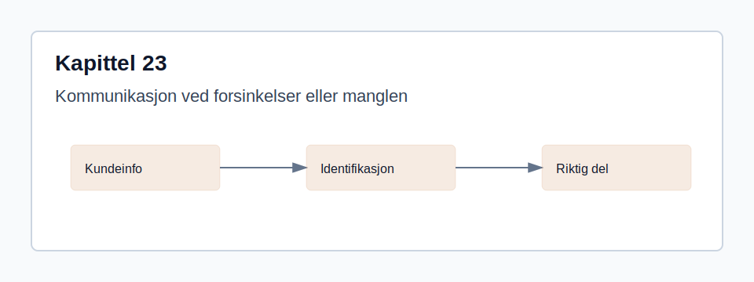

## Tekniske systemillustrasjoner

## Grundig forklaring
Hvordan restordre, utgåtte deler og forsinkelser kommuniseres må forstås både teknisk og praktisk. I marine reservedeler er det sjelden nok å vite hva kunden kaller delen. Medarbeideren må forstå hvilken funksjon delen har, hvor den sitter, hvilken motorvariant den tilhører, og hva som skjer dersom feil del bestilles. Derfor skal tekniske data, kundens beskrivelse og dokumentert katalogoppslag alltid vurderes sammen.

En god sak har fire kjennetegn: den har tydelig identifikasjon, tydelig problem- eller delbeskrivelse, tydelig beslutningsgrunnlag og tydelig oppfølging. Dersom ett av disse punktene mangler, skal saken markeres som usikker før kunden får et bindende svar.

## Praktisk verkstedeksempel
Et verksted står med demontert komponent og trenger rask avklaring. Medarbeideren registrerer kunde, fartøy, motorinformasjon og tidsfrist, ber om bilder av typeplate og komponent, sjekker katalog og lager, og sender et kort skriftlig svar med valgt del, grunnlag for valget og neste oppdateringstidspunkt.

## Kundesupporteksempel
Kunde: 'Motoren går dårlig, kan dere sende riktig del?' Profesjonelt svar: 'Vi kan hjelpe, men først må vi skille mellom symptom og delbehov. Send serienummer, bilde av motorplate, bilde av området feilen gjelder og en kort beskrivelse av når feilen oppstår. Da kan vi foreslå riktig del eller riktig neste feilsøkingstrinn.'

## Vanlige feil og årsaker
- feil eller ufullstendig serienummer.
- delnummer som er erstattet uten at saken dokumenteres.
- symptom som tolkes som delbehov uten feilsøking.
- kunde har bilde av lignende del, men ikke korrekt motorvariant.
- manglende avklaring av antall, side, posisjon eller leveringstid.

## Feilsøkingsflyt

```mermaid
flowchart TD
    A[Symptom eller forespørsel mottatt] --> B[Samle serienummer, bilder og historikk]
    B --> C{Er motor og variant sikkert identifisert?}
    C -- Nei --> D[Be om mer dokumentasjon før del bekreftes]
    C -- Ja --> E[Kontroller delnummer og posisjon i katalog]
    E --> F{Stemmer symptom med foreslått del?}
    F -- Nei --> G[Foreslå feilsøking eller teknisk kontroll]
    F -- Ja --> H[Kontroller lager, pris og levering]
    H --> I[Send dokumentert kundesvar]
```

## Vedlikeholdsprosedyre
1. Avklar driftstimer, siste service og driftsmiljø.
2. Kontroller olje, filter, kjølevæske, sjøvannskrets, reimer, slanger og elektriske kontakter.
3. Sammenlign vedlikeholdsbehov med produsentens intervaller og faktisk bruk.
4. Anbefal servicekit når flere slitedeler bør skiftes samtidig.
5. Dokumenter hva som er anbefalt, hva kunden bestiller og eventuelle avvik fra normal prosedyre.

## Serienummeridentifikasjon
Serienummeridentifikasjon starter med å finne typeplate, motornummer eller annen unik identifikasjon. Be om bilde, ikke bare avskrift, fordi feil tegn, mellomrom og prefiks kan endre katalogoppslaget. Når serienummer ikke finnes, bygges identifikasjonen med modell, produksjonsår, bilder, tidligere fakturaer, servicehistorikk og delnummer fra monterte komponenter.

Minimumsdata bør være: fabrikat, modell, serienummer, eventuell product number/arrangement/CPL/motornummer, bilde av typeplate og bilde av motorens installasjon. Ved tvil skal saken stoppes for avklaring før del bekreftes.

## Reservedelsidentifikasjon
Reservedelsidentifikasjon skal bekrefte delnummer, posisjon, antall per motor, variant, side og eventuell erstatning. Dersom kunden oppgir et gammelt nummer, må det kontrolleres mot supersession. Dersom kunden bare sender bilde, skal bildet brukes som støtte, ikke som eneste grunnlag for bestilling.

Sjekk alltid om delnummeret gjelder enkeltkomponent, reparasjonssett, servicekit eller komplett enhet. Kontroller også om varen er høyre/venstre, gammel/ny type, standard/oversize eller knyttet til en bestemt produksjonsperiode.

## Bestillingsprosedyre
1. Opprett eller oppdater sak med kunde, fartøy, kontaktperson og tidsfrist.
2. Verifiser motoridentifikasjon og lagre bildedokumentasjon.
3. Finn korrekt delnummer i relevant katalog eller leverandørgrunnlag.
4. Kontroller supersession, antall, lagerstatus, pris, returvilkår og leveringstid.
5. Send ordrebekreftelse med delnummer, beskrivelse, antall, pris, levering og forbehold.
6. Følg opp leveransen til kunden har mottatt varen eller saken er lukket.

## Kvalitetspunkter før svar
- Har vi nok data til å gi et sikkert svar?
- Er delnummeret kontrollert mot riktig motorvariant?
- Er kundens tidsfrist realistisk med valgt fraktmåte?
- Er eventuelle forbehold skrevet tydelig?
- Kan en kollega forstå beslutningen ved å lese saken senere?

## Kapittelsammendrag
Hovedpoenget i kapittel 23 er at profesjonelt reservedelsarbeid krever struktur. Teknisk kunnskap, engelske fagtermer, praktisk feilsøking, dokumentasjon og kundedialog må henge sammen. Når medarbeideren jobber systematisk, reduseres feilbestillinger, kunden får bedre svar, og verkstedet kan planlegge arbeidet tryggere.

## Kryssreferanser
- For forrige tema, se kapittel 22: Hvordan håndtere uklare eller mangelfulle opplysninger.
- For neste tema, se kapittel 24: Oppfølging etter bestilling og leveranse.
- For grunnleggende identifikasjon, se kapittel 12 og 17.
- For merkevise eksempler, se kapitlene 26-32.

## Fordypning for intern opplæring
Dette kapitlet skal brukes som arbeidsstandard, ikke bare som lesestoff. Når en ny medarbeider møter en sak om forsinkelser, skal vedkommende trene på å gå rolig fra fakta til vurdering og deretter til handling. I en marinemotorforhandler er konsekvensen av en feil ofte større enn verdien av selve delen. En feil impeller, feil sensor, feil filterinnsats eller feil pakningssett kan føre til tapt verkstedtid, utsatt avgang, irritert kunde og i verste fall ny driftsstans. Derfor skal hver sak behandles som en teknisk beslutning med sporbar dokumentasjon.

Profesjonelt nivå i dette kapitlet betyr at medarbeideren kan arbeide sikkert med forsinkelser. Før kunden får et bindende svar, skal opplysningene i saken kontrolleres mot motorens identitet, faktisk installasjon og relevant produsentterminologi. Det praktiske målet er ikke å finne et raskt nummer, men å kunne forklare hvorfor valgt del, kontrollpunkt eller kundesvar er riktig for akkurat denne motoren. Når informasjon mangler, skal medarbeideren beskrive hva som mangler, hvorfor det er nødvendig, og hvilket neste steg som bringer saken videre.

## Tekniske forklaringer
Teknisk forståelse i dette kapitlet skal bygges rundt årsaksforklaring, alternativ løsning, del-leveranse, forventningsstyring og ny oppfølgingstid. Medarbeideren må skille mellom synlig symptom, sannsynlig systemfeil og bestillbar komponent. En del kan se riktig ut på bilde, men likevel være feil dersom posisjon, variant, rating, kjøleroppsett, elektrisk plugg, monteringsside eller servicehistorikk ikke stemmer. Derfor skal teknisk vurdering alltid kobles til både funksjon og dokumentasjon: hva gjør komponenten, hvilket system påvirker den, og hvilken produsentkilde bekrefter at den passer.

I praksis betyr dette at tekniske data skal kobles til motorens faktiske installasjon. Marine motorer står ofte trangt, er utsatt for salt, vibrasjon, fukt og ujevnt belastningsmønster, og de kan være bygget om gjennom mange år. En motor kan ha original kjøler, ettermontert eksosbend, alternativ dynamo, endret filterbrakett eller annen sjøvannspumpe enn standard. Slike forhold gjør at delidentifikasjon må bygge på både produsentdata og synlig dokumentasjon fra motoren.

Produsentterminologi er en del av den tekniske forståelsen. Bruk uttrykk som Serial Number, Engine Number, Part Number, Service Kit, Exploded View, Supersession når de er relevante. Ikke oversett dem på en måte som fjerner presisjon. Skriv for eksempel «Engine Serial Number (ESN)» første gang og deretter «ESN» i saken dersom produsenten bruker dette. Skriv «Arrangement Number» når CAT-data krever det, «Product Number» når Volvo Penta bruker det, «CPL» når Cummins-konfigurasjon må kontrolleres, og «Model Code» når Yanmar-identifikasjon bygger på modellkode. Dette gjør dialogen med internasjonale leverandører mer presis.

## Illustrasjonsforslag
- Oversiktsdiagram som viser hvor forsinkelser passer inn i total arbeidsflyt fra kundeforespørsel til levert del.
- Nærbilde av typeplate/motorskilt med markering av serienummer, motornummer, modell og eventuell variantkode.
- Sprengskisse med markert posisjon, delnummer, antall per motor og mulige alternative versjoner.
- Feilsøkingsflyt med beslutningspunkter: mangler data, stemmer symptom, kreves mer teknisk kontroll, kan ordre bekreftes.
- Sammenligningsbilde av gammel og ny del der forskjell i tilkobling, side, lengde eller sensorplugg er markert.

## Virkelige verkstedseksempler
Eksempel 1: Et verksted står med en demontert komponent på benken og kunden venter på avklaring før fartøyet kan settes tilbake i drift. Verkstedet sender et nærbilde av delen, men ingen motorplate. En uerfaren medarbeider kan bli fristet til å søke på nummeret som står på støpegodset. En profesjonell medarbeider svarer at støpenummer ikke nødvendigvis er bestillbart delnummer, ber om bilde av typeplate, oversiktsbilde av motoren og bilde av monteringsstedet, og forklarer at dette hindrer feilbestilling. Når informasjonen kommer, kontrolleres delnummer mot sprengskisse, posisjon og antall. Først da gis pris og leveringstid.

Eksempel 2: En kunde ringer sent på dagen og sier at motoren har høy temperatur etter service. Kunden ønsker ny termostat. Medarbeideren skal ikke automatisk konkludere med termostatfeil. Spørsmålene bør avklare om impeller er byttet, om sjøvannsfilteret er rent, om kjølevæskenivået er riktig, om alarmen kommer ved tomgang eller belastning, og om det finnes lekkasje rundt varmeveksler eller slanger. Dersom kunden likevel vil bestille termostat, dokumenteres at feilsøking er anbefalt, og delnummer kontrolleres mot serienummer før ordre.

Eksempel 3: En intern selger mottar en gammel faktura med et delnummer som ikke lenger finnes. Riktig prosess er å kontrollere supersession, se om ny del krever tilhørende pakning, boltsett eller adapter, og notere både gammelt og nytt nummer i saken. Kunden skal få vite at delen er erstattet, hva som leveres, og om det finnes monteringsforbehold.

## Reservedelsidentifisering i praksis
Reservedelsidentifisering skal følge en fast rekkefølge. Først kontrolleres motorens identitet. Deretter kontrolleres delens system: drivstoff, luft, kjøling, smøring, eksos, elektrisk eller mekanisk kraftoverføring. Så kontrolleres posisjon i sprengskisse eller parts list. Til slutt kontrolleres antall, variant, supersession og leveringsstatus. Denne rekkefølgen hindrer at medarbeideren hopper direkte fra kundens ord til et tilfeldig delnummer.

Når en del har synlig nummer, må nummeret tolkes riktig. Mange komponenter har produksjonsnummer, støpenummer, leverandørnummer eller revisjonskode som ikke er det samme som bestillbart part number. Et filter kan ha nummer fra filterprodusent, men motorprodusentens parts catalogue kan bruke et annet nummer. En pumpe kan ha nummer på lokk, hus og komplett enhet. Spør derfor alltid: gjelder nummeret komplett del, reparasjonssett, underkomponent eller produsentens råkomponent?

## Serienummer og motornummer
Serienummer og motornummer er grunnlaget for korrekt katalogoppslag. Be kunden sende bilde av typeplate eller dataplate. Dersom kunden skriver nummeret manuelt, skal nummeret likevel kontrolleres mot bilde når det er mulig. Noter hele nummeret, inkludert prefiks, suffiks, bindestrek, mellomrom og eventuelle bokstaver. På enkelte produsenter kan små forskjeller peke til forskjellig produksjonsperiode, rating eller konfigurasjon.

Bruk motornummer sammen med modell, variant og applikasjon. En motor som driver generator kan ha andre deler enn en fremdriftsmotor. En motor i yrkesbåt kan ha annen rating enn samme motor i fritidsbåt. En eldre motor kan være bygget om med ny dynamo, annen sjøvannspumpe eller uoriginal filterbrakett. Dersom typeplate mangler, bygg identifikasjonen gjennom flere kilder: servicebok, tidligere faktura, bilder av motorens sider, nummer på pumpe, filter, turbo og gear, samt opplysninger om fartøy og produksjonsår.

## Feilsøking steg for steg
1. Definer symptomet med kundens egne ord og skriv det i saken. Skill mellom «kunden ønsker del» og «kunden beskriver feil».
2. Avklar når feilen oppstår: start, tomgang, belastning, marsjfart, varm motor, kald motor eller etter nylig service.
3. Kontroller grunnleggende forhold: væskenivå, filter, luft i drivstoff, sjøvannsstrøm, reimer, elektriske kontakter, sikringer og synlige lekkasjer.
4. Knytt symptomet til system: lav effekt peker ofte mot luft/drivstoff/eksos, høy temperatur mot kjøling, lavt oljetrykk mot smøring/sensor, startproblem mot batteri/starter/gløding/drivstoff.
5. Be om bilder eller måledata dersom symptomet ikke kan kobles sikkert til en del. Dette kan være bilde av alarmdisplay, trykkmåling, temperaturmåling eller bilde av montert komponent.
6. Kontroller relevant delnummer mot serienummer og variant. Dersom flere alternativer finnes, forklar kunden hva som skiller dem.
7. Dokumenter anbefalt tiltak, usikkerhet og eventuelle forbehold før ordre bekreftes.

## Vedlikehold
Vedlikehold skal vurderes mot driftstimer, produsentens maintenance schedule og faktisk driftsmiljø. Marine motorer som går korte turer, mye tomgang eller i salt miljø kan trenge hyppigere kontroll enn standard intervall antyder. Nye medarbeidere skal lære å spørre om siste service, hvilke filter som ble byttet, hvilken olje som ble brukt, om impeller er kontrollert, og om kjølevæske eller anoder er byttet etter plan.

En god vedlikeholdsanbefaling er konkret. I stedet for å skrive «ta service», bør medarbeideren foreslå relevante deler: olje- og drivstoffilter, luftfilter, impeller, reim, pakninger, anoder, kjølevæske og eventuelt servicekit. Dersom kunden har ukjent servicehistorikk, bør komplett servicekit vurderes. Dersom kunden har hatt overoppheting, bør sjøvannskrets og varmeveksler kontrolleres før bare én komponent byttes.

## Vanlige feil
- Serienummer leses feil fordi et tegn forveksles, for eksempel O/0 eller I/1.
- Kunden oppgir modellnavn, men ikke variant, rating eller applikasjon.
- Del velges ut fra bilde alene uten kontroll mot sprengskisse eller produsentkatalog.
- Supersession aksepteres uten å kontrollere om ny del krever tilbehør, pakning eller ombygging.
- Hastepress gjør at leveringsløfte gis før lagerstatus og fraktmulighet er bekreftet.
- Saksnotat mangler grunnlaget for beslutningen, slik at kollega ikke kan etterprøve valget.

## Kontrollspørsmål
- Hva er den viktigste tekniske risikoen i en sak som gjelder forsinkelser?
- Hvilke opplysninger må dokumenteres før bindende delnummer bekreftes?
- Hvordan forklarer du kunden hvorfor bilde av typeplate er nødvendig?
- Når bør du stoppe en ordre og be om mer dokumentasjon?
- Hvilke engelske produsentuttrykk bør du kunne bruke i denne typen sak?
- Hvordan dokumenterer du at et delnummer er erstattet av et nytt nummer?

## Praktisk sjekkliste for medarbeider
- Les saken som om en kollega skal overta den i morgen.
- Kontroller at motoridentifikasjon er dokumentert med bilde eller sikker kilde.
- Sjekk at delnummeret er knyttet til riktig posisjon i katalogen.
- Skriv tydelig om kunden har bedt om enkeltkomponent, servicekit eller komplett enhet.
- Noter om varen er spesialbestilling, utgått, erstattet eller ikke returbar.
- Send kundesvar med neste steg, ikke bare et løst delnummer.

## Kapittelspesifikk systemforståelse
For dette kapitlet er kjernen å forstå håndtering av forsinkelser, restordre og utgåtte deler. Medarbeideren skal kunne forklare dette med praktiske ord til både kunde og kollega. Det betyr at teknisk teori må kobles til konkrete handlinger: hvilke data skal innhentes, hvilke komponenter kan være berørt, hvilken produsentterminologi skal brukes, og hva må dokumenteres før saken kan gå videre. Kunden tåler ofte venting bedre enn usikkerhet; gi tidlige og konkrete oppdateringer.

Når systemet vurderes, skal medarbeideren først plassere problemet i riktig teknisk sammenheng. Dersom kunden beskriver en alarm, må man finne ut om alarmen kommer fra reelt mekanisk avvik, elektrisk sensorfeil, feil etter service eller feil tolkning av instrumentet. Dersom kunden beskriver en del, må man avklare om kunden mener komplett enhet, servicekit, reparasjonssett eller enkeltkomponent. Dersom kunden beskriver motoren med vanlig navn, må man kontrollere om produsenten bruker mer presise begreper i katalogen.

## Komponentoversikt og arbeidsgrense
Relevante komponenter og opplysninger i dette kapitlet omfatter: ETA, backorder, discontinued, alternative part, remanufactured part og partial delivery. Listen er ikke ment som en erstatning for produsentens parts catalogue, men som en praktisk påminnelse om hva nye medarbeidere skal tenke på før de søker del. I interne saker skal komponentnavn skrives så presist som mulig. Bruk for eksempel «sjøvannspumpe / raw water pump» i stedet for bare «pumpe» når funksjonen er kjent, og «varmeveksler / heat exchanger» i stedet for bare «kjøler» når det er den komponenten saken gjelder.

Arbeidsgrensen for en reservedelsmedarbeider er også viktig. Medarbeideren skal ikke overta mekanikerens ansvar for demontering, måling eller diagnose på motoren, men skal kunne stille riktige spørsmål og foreslå riktig dokumentasjon. Når en sak går fra enkel delidentifikasjon til teknisk diagnose, skal dette markeres i saken. Da kan verksted, teknisk ansvarlig eller leverandør involveres med et klart spørsmål og et ryddig faktagrunnlag.

## Praktisk beslutningsregel
Bruk denne regelen i alle saker knyttet til kapitlet: Hvis motoridentifikasjon, komponentposisjon eller symptom ikke er sikkert nok dokumentert, skal medarbeideren ikke gi bindende delbekreftelse. Kunden kan få et foreløpig svar, men svaret må inneholde hva som mangler, hvorfor det mangler, og hva som skjer når informasjonen er mottatt. Dette er ikke treg service; det er profesjonell risikokontroll.

## Målrettet fordypning kapittel 21-30
### Forsinkelser, restordre og alternative løsninger
Forsinkelser må kommuniseres tidlig, konkret og uten å skyve ansvar bort fra saken. Bruk tydelige begreper som backorder, estimated time of arrival (ETA), discontinued, superseded part og alternative part når de er relevante. Kunden bør få vite hva som er bekreftet, hva som er usikkert, og når neste oppdatering kommer. Ikke skriv bare «forsinket»; skriv om delen er på restordre, i produksjon, under transport eller erstattet av nytt nummer.

Ved manglende tilgjengelighet skal alternativer vurderes kontrollert. Det kan være originaldel fra annen lagerlokasjon, remanufactured part, repair kit, midlertidig servicekomponent eller komplett enhet. Hver alternativ løsning må kontrolleres mot serienummer, variant og installasjon. Dersom kunden velger en løsning med risiko, skal risikoen dokumenteres skriftlig før bestilling.

### Praktisk anvendelse i opplæring
Bruk kapitlet som caseøvelse der deltakeren skal skrive et kundesvar, identifisere nødvendige produsentdata og velge neste tekniske kontrollpunkt. Deltakeren skal også forklare hva som kan besvares av reservedelsavdelingen, og hva som må avklares av verksted, teknisk ansvarlig eller leverandør. Målet er at medarbeideren kan arbeide raskt, men fortsatt med sporbarhet og korrekt produsentterminologi.

## Realistisk opplæring i praksis
### Verkstedhistorie
En typisk sak i dette temaet starter med transport forsinkes før helg. Verkstedet trenger et raskt svar, men den erfarne medarbeideren stopper opp og spør først: hva vet vi sikkert, hva antar vi, og hva kan gi følgeskade hvis vi tar feil? I praksis betyr det at forventningsstyring må kobles til bilde, serienummer, komponentposisjon og kundens symptom før saken lukkes. Historien skal brukes i opplæring som en øvelse i å skrive et kort saksnotat: observasjon, vurdering, neste handling og forbehold.

### Kundehistorie
Kunden beskriver ofte problemet med driftsspråk: «motoren går tungt», «alarm kommer etter ti minutter», «jeg trenger den samme delen som sist» eller «båten skal ut i morgen». En profesjonell respons er rolig og konkret: bekreft behovet, forklar hvorfor identifikasjon trengs, be om riktig dokumentasjon og gi et realistisk tidspunkt for neste svar. Ikke korriger kunden unødvendig; oversett kundens språk til teknisk språk i saken.

### Typiske feil nye ansatte gjør
- søker på første synlige nummer uten å avklare om det er støpenummer, leverandørnummer eller bestillbart part number.
- lover levering før lagerstatus, frakt og returvilkår er kontrollert.
- antar at tidligere faktura alltid gjelder samme motorvariant.
- blander symptom og årsak, spesielt ved varme, lav effekt, startproblem og alarm.
- skriver for korte notater slik at kollega ikke kan forstå hvorfor valget ble tatt.

### Tips fra erfarne mekanikere og reservedelsselgere
- Se alltid etter systemet rundt delen: slanger, braketter, sensorer, reimer, kjølere og tilkoblinger forteller ofte mer enn delen alene.
- Still ett presist spørsmål om gangen når kunden er stresset; mange dårlige svar kommer av for lange spørsmålslister.
- Sammenlign gammel og ny del mot funksjon, ikke bare form. Riktig del skal passe, men også løse riktig problem.
- En erfaren reservedelsselger tenker i risiko: Hva er billigst å avklare nå, og hva blir dyrt hvis vi hopper over det?

### Vanlige kundespørsmål
| Spørsmål fra kunde | Profesjonelt svar |
|---|---|
| «Kan du bare sende samme del som sist?» | «Ja, hvis vi først bekrefter at det gjelder samme motor, samme posisjon og ingen supersession siden sist.» |
| «Holder det med bilde?» | «Bilde hjelper, men vi trenger også motoridentitet for å sikre variant og delnummer.» |
| «Hvorfor tar dette tid?» | «Fordi feil del kan gi ny driftsstans. Vi kontrollerer grunnlaget før vi lover levering.» |

### Beslutningstre for saken
| Trinn | Spørsmål | Handling |
|---|---|---|
| 1 | Er motoridentitet dokumentert med bilde eller sikker historikk? | Hvis nei: be om typeplate/dataplate eller alternativ dokumentasjon. |
| 2 | Er komponentens funksjon og posisjon kjent? | Hvis nei: be om oversiktsbilde og bilde av monteringssted. |
| 3 | Stemmer kundens symptom med delen som ønskes? | Hvis nei: anbefal feilsøking før del bestilles. |
| 4 | Finnes det supersession, kit eller variantvalg? | Kontroller produsentkilde og skriv forbehold i saken. |
| 5 | Kan pris, levering og returvilkår bekreftes? | Send dokumentert svar med neste steg og tydelig gyldighet. |

### Rask oppslagstabell
| Situasjon | Kontroller først | Vanlig fallgruve |
|---|---|---|
| Hasteordre | sikker motor-ID, lager, fraktfrist | levering loves før teknisk kontroll |
| Del fra bilde | posisjon, skala, tilkoblinger, nummer | bilde brukes som eneste beslutningsgrunnlag |
| Gammelt delnummer | supersession og kitinnhold | ny del krever ekstra pakning eller adapter |
| Uklart symptom | driftssituasjon, alarm, siste service | symptom blir tolket som sikker komponentfeil |

### Praktisk sjekkliste og inspeksjonsrutine
- Start med motoridentitet: fabrikat, modell, serienummer, variant, applikasjon og bilde av skilt.
- Kontroller området rundt komponenten: lekkasje, korrosjon, knekte fester, slitasje, varmemerker og uoriginale endringer.
- Spør om siste vedlikehold: olje, filter, impeller, reimer, kjølevæske, anoder og drivstoffilter.
- Noter driftstype: fritidsbruk, yrkesbruk, generator, fremdrift, tomgangsdrift eller langvarig høy belastning.
- Avklar om saken gjelder akutt drift, planlagt service, reklamasjon eller lagerpåfyll.

### Generelle vedlikeholdsintervaller som opplæringspunkt
| Kontrollpunkt | Typisk vurdering i opplæring | Må verifiseres |
|---|---|---|
| Olje og oljefilter | ofte basert på timer og kalender | produsentens maintenance schedule |
| Drivstoffilter/vannutskiller | hyppigere ved dårlig drivstoff eller sesongstart | motor- og filterspesifikasjon |
| Impeller og sjøvannskrets | kontrolleres særlig før sesong og etter varmgang | produsentens intervall og installasjon |
| Reimer, slanger og klemmer | visuell kontroll ved service og feilsøking | dimensjon, stramming og delnummer |

### Produsentverifikasjon
Alle konkrete delnumre, momentverdier, serviceintervaller, garantikrav, programvaredata og produsentspesifikke grenser skal kontrolleres mot offisiell produsentdokumentasjon før de brukes i tilbud, ordre eller verkstedinstruks. Marker tydelig i saken når svaret bygger på antakelse, eldre historikk, bilde uten motor-ID eller generell erfaring. Intervaller i tabellen er generelle opplæringspunkter. Faktiske intervaller styres av produsent, motorvariant, driftstimer, kalenderkrav, belastning og miljø.

## Produsentverifikasjon og faglig forbehold
Denne manualen skal brukes som intern opplæring og arbeidsmetode. Produsentspesifikke delnumre, intervaller, momentverdier, garantikrav og tekniske grenseverdier skal verifiseres mot gjeldende produsentdokumentasjon før de brukes i kundeordre eller verkstedinstruks. Marker saken internt dersom opplysningen bygger på antakelse, eldre historikk eller bilde uten bekreftet motoridentitet.

## Quiz med fasit
1. Hvilke tekniske data bør alltid samles før en del bekreftes?
2. Hvorfor er engelsk terminologi viktig i marine reservedeler?
3. Hva bør gjøres dersom kunden bare sender et bilde av delen?
4. Hvilke punkter bør kontrolleres før ordrebekreftelse sendes?
5. Hvorfor skal feilsøking dokumenteres, selv når kunden allerede ber om en bestemt del?

### Svar
1. Fabrikat, modell, serienummer, variantdata, bilde av typeplate, delnummer, posisjon og kundens symptombeskrivelse.
2. Fordi kataloger, portaler, servicemanualer og leverandørdialog ofte bruker engelske begreper som må forstås presist.
3. Be om serienummer, oversiktsbilde av motoren og eventuelle nummer på delen; bildet brukes som støtte, ikke eneste grunnlag.
4. Delnummer, antall, variant, pris, lagerstatus, leveringstid, frakt, returvilkår og eventuelle forbehold.
5. Fordi symptomet kan ha flere årsaker, og dokumentasjon viser hvorfor anbefalingen ble gitt.

---

# Kapittel 24: Oppfølging etter bestilling og leveranse

## Kapittelrolle
Dette kapitlet gir en grundig praktisk innføring i leveranseoppfølging. Temaet er viktig fordi reservedelsarbeid i marine miljøer kombinerer teknisk forståelse, presis kundedialog, dokumentert saksbehandling og realistisk leveranseoppfølging. Målet er at en ny medarbeider skal kunne bruke kunnskapen direkte i arbeid med verksted, kunde, lager og leverandør.

## Læringsmål
Etter kapitlet skal deltakeren kunne:
- forklare hovedbegrepene innen leveranseoppfølging
- bruke serienummer, modellinformasjon og delnummer i praktisk reservedelsarbeid
- kommunisere trygt med kunde, verksted, lager og leverandør
- dokumentere beslutninger slik at andre kan etterprøve saken
- kjenne igjen vanlige feil og velge riktig neste handling

## English technical terminology
- **Serial Number:** engelsk fagterm som ofte brukes i kataloger, servicelitteratur, leverandørportaler og internasjonal kundedialog.
- **Part Number:** engelsk fagterm som ofte brukes i kataloger, servicelitteratur, leverandørportaler og internasjonal kundedialog.
- **Engine Model:** engelsk fagterm som ofte brukes i kataloger, servicelitteratur, leverandørportaler og internasjonal kundedialog.
- **Variant:** engelsk fagterm som ofte brukes i kataloger, servicelitteratur, leverandørportaler og internasjonal kundedialog.
- **Service Kit:** engelsk fagterm som ofte brukes i kataloger, servicelitteratur, leverandørportaler og internasjonal kundedialog.
- **Troubleshooting:** engelsk fagterm som ofte brukes i kataloger, servicelitteratur, leverandørportaler og internasjonal kundedialog.
- **Maintenance:** engelsk fagterm som ofte brukes i kataloger, servicelitteratur, leverandørportaler og internasjonal kundedialog.
- **Ordering Procedure:** engelsk fagterm som ofte brukes i kataloger, servicelitteratur, leverandørportaler og internasjonal kundedialog.
- **Supersession:** engelsk fagterm som ofte brukes i kataloger, servicelitteratur, leverandørportaler og internasjonal kundedialog.
- **Technical Support:** engelsk fagterm som ofte brukes i kataloger, servicelitteratur, leverandørportaler og internasjonal kundedialog.

## Hoveddiagram
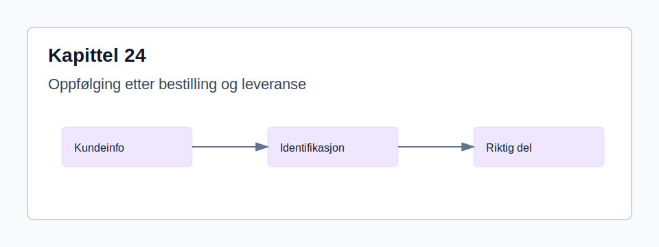

## Tekniske systemillustrasjoner

## Grundig forklaring
Hvordan leverte deler følges opp og avvik lukkes må forstås både teknisk og praktisk. I marine reservedeler er det sjelden nok å vite hva kunden kaller delen. Medarbeideren må forstå hvilken funksjon delen har, hvor den sitter, hvilken motorvariant den tilhører, og hva som skjer dersom feil del bestilles. Derfor skal tekniske data, kundens beskrivelse og dokumentert katalogoppslag alltid vurderes sammen.

En god sak har fire kjennetegn: den har tydelig identifikasjon, tydelig problem- eller delbeskrivelse, tydelig beslutningsgrunnlag og tydelig oppfølging. Dersom ett av disse punktene mangler, skal saken markeres som usikker før kunden får et bindende svar.

## Praktisk verkstedeksempel
Et verksted står med demontert komponent og trenger rask avklaring. Medarbeideren registrerer kunde, fartøy, motorinformasjon og tidsfrist, ber om bilder av typeplate og komponent, sjekker katalog og lager, og sender et kort skriftlig svar med valgt del, grunnlag for valget og neste oppdateringstidspunkt.

## Kundesupporteksempel
Kunde: 'Motoren går dårlig, kan dere sende riktig del?' Profesjonelt svar: 'Vi kan hjelpe, men først må vi skille mellom symptom og delbehov. Send serienummer, bilde av motorplate, bilde av området feilen gjelder og en kort beskrivelse av når feilen oppstår. Da kan vi foreslå riktig del eller riktig neste feilsøkingstrinn.'

## Vanlige feil og årsaker
- feil eller ufullstendig serienummer.
- delnummer som er erstattet uten at saken dokumenteres.
- symptom som tolkes som delbehov uten feilsøking.
- kunde har bilde av lignende del, men ikke korrekt motorvariant.
- manglende avklaring av antall, side, posisjon eller leveringstid.

## Feilsøkingsflyt

```mermaid
flowchart TD
    A[Symptom eller forespørsel mottatt] --> B[Samle serienummer, bilder og historikk]
    B --> C{Er motor og variant sikkert identifisert?}
    C -- Nei --> D[Be om mer dokumentasjon før del bekreftes]
    C -- Ja --> E[Kontroller delnummer og posisjon i katalog]
    E --> F{Stemmer symptom med foreslått del?}
    F -- Nei --> G[Foreslå feilsøking eller teknisk kontroll]
    F -- Ja --> H[Kontroller lager, pris og levering]
    H --> I[Send dokumentert kundesvar]
```

## Vedlikeholdsprosedyre
1. Avklar driftstimer, siste service og driftsmiljø.
2. Kontroller olje, filter, kjølevæske, sjøvannskrets, reimer, slanger og elektriske kontakter.
3. Sammenlign vedlikeholdsbehov med produsentens intervaller og faktisk bruk.
4. Anbefal servicekit når flere slitedeler bør skiftes samtidig.
5. Dokumenter hva som er anbefalt, hva kunden bestiller og eventuelle avvik fra normal prosedyre.

## Serienummeridentifikasjon
Serienummeridentifikasjon starter med å finne typeplate, motornummer eller annen unik identifikasjon. Be om bilde, ikke bare avskrift, fordi feil tegn, mellomrom og prefiks kan endre katalogoppslaget. Når serienummer ikke finnes, bygges identifikasjonen med modell, produksjonsår, bilder, tidligere fakturaer, servicehistorikk og delnummer fra monterte komponenter.

Minimumsdata bør være: fabrikat, modell, serienummer, eventuell product number/arrangement/CPL/motornummer, bilde av typeplate og bilde av motorens installasjon. Ved tvil skal saken stoppes for avklaring før del bekreftes.

## Reservedelsidentifikasjon
Reservedelsidentifikasjon skal bekrefte delnummer, posisjon, antall per motor, variant, side og eventuell erstatning. Dersom kunden oppgir et gammelt nummer, må det kontrolleres mot supersession. Dersom kunden bare sender bilde, skal bildet brukes som støtte, ikke som eneste grunnlag for bestilling.

Sjekk alltid om delnummeret gjelder enkeltkomponent, reparasjonssett, servicekit eller komplett enhet. Kontroller også om varen er høyre/venstre, gammel/ny type, standard/oversize eller knyttet til en bestemt produksjonsperiode.

## Bestillingsprosedyre
1. Opprett eller oppdater sak med kunde, fartøy, kontaktperson og tidsfrist.
2. Verifiser motoridentifikasjon og lagre bildedokumentasjon.
3. Finn korrekt delnummer i relevant katalog eller leverandørgrunnlag.
4. Kontroller supersession, antall, lagerstatus, pris, returvilkår og leveringstid.
5. Send ordrebekreftelse med delnummer, beskrivelse, antall, pris, levering og forbehold.
6. Følg opp leveransen til kunden har mottatt varen eller saken er lukket.

## Kvalitetspunkter før svar
- Har vi nok data til å gi et sikkert svar?
- Er delnummeret kontrollert mot riktig motorvariant?
- Er kundens tidsfrist realistisk med valgt fraktmåte?
- Er eventuelle forbehold skrevet tydelig?
- Kan en kollega forstå beslutningen ved å lese saken senere?

## Kapittelsammendrag
Hovedpoenget i kapittel 24 er at profesjonelt reservedelsarbeid krever struktur. Teknisk kunnskap, engelske fagtermer, praktisk feilsøking, dokumentasjon og kundedialog må henge sammen. Når medarbeideren jobber systematisk, reduseres feilbestillinger, kunden får bedre svar, og verkstedet kan planlegge arbeidet tryggere.

## Kryssreferanser
- For forrige tema, se kapittel 23: Kommunikasjon ved forsinkelser eller manglende tilgjengelighet.
- For neste tema, se kapittel 25: Klagebehandling og løsning av kundereaksjoner.
- For grunnleggende identifikasjon, se kapittel 12 og 17.
- For merkevise eksempler, se kapitlene 26-32.

## Fordypning for intern opplæring
Dette kapitlet skal brukes som arbeidsstandard, ikke bare som lesestoff. Når en ny medarbeider møter en sak om leveranseoppfølging, skal vedkommende trene på å gå rolig fra fakta til vurdering og deretter til handling. I en marinemotorforhandler er konsekvensen av en feil ofte større enn verdien av selve delen. En feil impeller, feil sensor, feil filterinnsats eller feil pakningssett kan føre til tapt verkstedtid, utsatt avgang, irritert kunde og i verste fall ny driftsstans. Derfor skal hver sak behandles som en teknisk beslutning med sporbar dokumentasjon.

Profesjonelt nivå i dette kapitlet betyr at medarbeideren kan arbeide sikkert med leveranseoppfølging. Før kunden får et bindende svar, skal opplysningene i saken kontrolleres mot motorens identitet, faktisk installasjon og relevant produsentterminologi. Det praktiske målet er ikke å finne et raskt nummer, men å kunne forklare hvorfor valgt del, kontrollpunkt eller kundesvar er riktig for akkurat denne motoren. Når informasjon mangler, skal medarbeideren beskrive hva som mangler, hvorfor det er nødvendig, og hvilket neste steg som bringer saken videre.

## Tekniske forklaringer
Teknisk forståelse i dette kapitlet skal bygges rundt sporingsnummer, mottakskontroll, restordre, retur, reklamasjon og læring etter sak. Medarbeideren må skille mellom synlig symptom, sannsynlig systemfeil og bestillbar komponent. En del kan se riktig ut på bilde, men likevel være feil dersom posisjon, variant, rating, kjøleroppsett, elektrisk plugg, monteringsside eller servicehistorikk ikke stemmer. Derfor skal teknisk vurdering alltid kobles til både funksjon og dokumentasjon: hva gjør komponenten, hvilket system påvirker den, og hvilken produsentkilde bekrefter at den passer.

I praksis betyr dette at tekniske data skal kobles til motorens faktiske installasjon. Marine motorer står ofte trangt, er utsatt for salt, vibrasjon, fukt og ujevnt belastningsmønster, og de kan være bygget om gjennom mange år. En motor kan ha original kjøler, ettermontert eksosbend, alternativ dynamo, endret filterbrakett eller annen sjøvannspumpe enn standard. Slike forhold gjør at delidentifikasjon må bygge på både produsentdata og synlig dokumentasjon fra motoren.

Produsentterminologi er en del av den tekniske forståelsen. Bruk uttrykk som Serial Number, Engine Number, Part Number, Service Kit, Exploded View, Supersession når de er relevante. Ikke oversett dem på en måte som fjerner presisjon. Skriv for eksempel «Engine Serial Number (ESN)» første gang og deretter «ESN» i saken dersom produsenten bruker dette. Skriv «Arrangement Number» når CAT-data krever det, «Product Number» når Volvo Penta bruker det, «CPL» når Cummins-konfigurasjon må kontrolleres, og «Model Code» når Yanmar-identifikasjon bygger på modellkode. Dette gjør dialogen med internasjonale leverandører mer presis.

## Illustrasjonsforslag
- Oversiktsdiagram som viser hvor leveranseoppfølging passer inn i total arbeidsflyt fra kundeforespørsel til levert del.
- Nærbilde av typeplate/motorskilt med markering av serienummer, motornummer, modell og eventuell variantkode.
- Sprengskisse med markert posisjon, delnummer, antall per motor og mulige alternative versjoner.
- Feilsøkingsflyt med beslutningspunkter: mangler data, stemmer symptom, kreves mer teknisk kontroll, kan ordre bekreftes.
- Sammenligningsbilde av gammel og ny del der forskjell i tilkobling, side, lengde eller sensorplugg er markert.

## Virkelige verkstedseksempler
Eksempel 1: Et verksted står med en demontert komponent på benken og kunden venter på avklaring før fartøyet kan settes tilbake i drift. Verkstedet sender et nærbilde av delen, men ingen motorplate. En uerfaren medarbeider kan bli fristet til å søke på nummeret som står på støpegodset. En profesjonell medarbeider svarer at støpenummer ikke nødvendigvis er bestillbart delnummer, ber om bilde av typeplate, oversiktsbilde av motoren og bilde av monteringsstedet, og forklarer at dette hindrer feilbestilling. Når informasjonen kommer, kontrolleres delnummer mot sprengskisse, posisjon og antall. Først da gis pris og leveringstid.

Eksempel 2: En kunde ringer sent på dagen og sier at motoren har høy temperatur etter service. Kunden ønsker ny termostat. Medarbeideren skal ikke automatisk konkludere med termostatfeil. Spørsmålene bør avklare om impeller er byttet, om sjøvannsfilteret er rent, om kjølevæskenivået er riktig, om alarmen kommer ved tomgang eller belastning, og om det finnes lekkasje rundt varmeveksler eller slanger. Dersom kunden likevel vil bestille termostat, dokumenteres at feilsøking er anbefalt, og delnummer kontrolleres mot serienummer før ordre.

Eksempel 3: En intern selger mottar en gammel faktura med et delnummer som ikke lenger finnes. Riktig prosess er å kontrollere supersession, se om ny del krever tilhørende pakning, boltsett eller adapter, og notere både gammelt og nytt nummer i saken. Kunden skal få vite at delen er erstattet, hva som leveres, og om det finnes monteringsforbehold.

## Reservedelsidentifisering i praksis
Reservedelsidentifisering skal følge en fast rekkefølge. Først kontrolleres motorens identitet. Deretter kontrolleres delens system: drivstoff, luft, kjøling, smøring, eksos, elektrisk eller mekanisk kraftoverføring. Så kontrolleres posisjon i sprengskisse eller parts list. Til slutt kontrolleres antall, variant, supersession og leveringsstatus. Denne rekkefølgen hindrer at medarbeideren hopper direkte fra kundens ord til et tilfeldig delnummer.

Når en del har synlig nummer, må nummeret tolkes riktig. Mange komponenter har produksjonsnummer, støpenummer, leverandørnummer eller revisjonskode som ikke er det samme som bestillbart part number. Et filter kan ha nummer fra filterprodusent, men motorprodusentens parts catalogue kan bruke et annet nummer. En pumpe kan ha nummer på lokk, hus og komplett enhet. Spør derfor alltid: gjelder nummeret komplett del, reparasjonssett, underkomponent eller produsentens råkomponent?

## Serienummer og motornummer
Serienummer og motornummer er grunnlaget for korrekt katalogoppslag. Be kunden sende bilde av typeplate eller dataplate. Dersom kunden skriver nummeret manuelt, skal nummeret likevel kontrolleres mot bilde når det er mulig. Noter hele nummeret, inkludert prefiks, suffiks, bindestrek, mellomrom og eventuelle bokstaver. På enkelte produsenter kan små forskjeller peke til forskjellig produksjonsperiode, rating eller konfigurasjon.

Bruk motornummer sammen med modell, variant og applikasjon. En motor som driver generator kan ha andre deler enn en fremdriftsmotor. En motor i yrkesbåt kan ha annen rating enn samme motor i fritidsbåt. En eldre motor kan være bygget om med ny dynamo, annen sjøvannspumpe eller uoriginal filterbrakett. Dersom typeplate mangler, bygg identifikasjonen gjennom flere kilder: servicebok, tidligere faktura, bilder av motorens sider, nummer på pumpe, filter, turbo og gear, samt opplysninger om fartøy og produksjonsår.

## Feilsøking steg for steg
1. Definer symptomet med kundens egne ord og skriv det i saken. Skill mellom «kunden ønsker del» og «kunden beskriver feil».
2. Avklar når feilen oppstår: start, tomgang, belastning, marsjfart, varm motor, kald motor eller etter nylig service.
3. Kontroller grunnleggende forhold: væskenivå, filter, luft i drivstoff, sjøvannsstrøm, reimer, elektriske kontakter, sikringer og synlige lekkasjer.
4. Knytt symptomet til system: lav effekt peker ofte mot luft/drivstoff/eksos, høy temperatur mot kjøling, lavt oljetrykk mot smøring/sensor, startproblem mot batteri/starter/gløding/drivstoff.
5. Be om bilder eller måledata dersom symptomet ikke kan kobles sikkert til en del. Dette kan være bilde av alarmdisplay, trykkmåling, temperaturmåling eller bilde av montert komponent.
6. Kontroller relevant delnummer mot serienummer og variant. Dersom flere alternativer finnes, forklar kunden hva som skiller dem.
7. Dokumenter anbefalt tiltak, usikkerhet og eventuelle forbehold før ordre bekreftes.

## Vedlikehold
Vedlikehold skal vurderes mot driftstimer, produsentens maintenance schedule og faktisk driftsmiljø. Marine motorer som går korte turer, mye tomgang eller i salt miljø kan trenge hyppigere kontroll enn standard intervall antyder. Nye medarbeidere skal lære å spørre om siste service, hvilke filter som ble byttet, hvilken olje som ble brukt, om impeller er kontrollert, og om kjølevæske eller anoder er byttet etter plan.

En god vedlikeholdsanbefaling er konkret. I stedet for å skrive «ta service», bør medarbeideren foreslå relevante deler: olje- og drivstoffilter, luftfilter, impeller, reim, pakninger, anoder, kjølevæske og eventuelt servicekit. Dersom kunden har ukjent servicehistorikk, bør komplett servicekit vurderes. Dersom kunden har hatt overoppheting, bør sjøvannskrets og varmeveksler kontrolleres før bare én komponent byttes.

## Vanlige feil
- Serienummer leses feil fordi et tegn forveksles, for eksempel O/0 eller I/1.
- Kunden oppgir modellnavn, men ikke variant, rating eller applikasjon.
- Del velges ut fra bilde alene uten kontroll mot sprengskisse eller produsentkatalog.
- Supersession aksepteres uten å kontrollere om ny del krever tilbehør, pakning eller ombygging.
- Hastepress gjør at leveringsløfte gis før lagerstatus og fraktmulighet er bekreftet.
- Saksnotat mangler grunnlaget for beslutningen, slik at kollega ikke kan etterprøve valget.

## Kontrollspørsmål
- Hva er den viktigste tekniske risikoen i en sak som gjelder leveranseoppfølging?
- Hvilke opplysninger må dokumenteres før bindende delnummer bekreftes?
- Hvordan forklarer du kunden hvorfor bilde av typeplate er nødvendig?
- Når bør du stoppe en ordre og be om mer dokumentasjon?
- Hvilke engelske produsentuttrykk bør du kunne bruke i denne typen sak?
- Hvordan dokumenterer du at et delnummer er erstattet av et nytt nummer?

## Praktisk sjekkliste for medarbeider
- Les saken som om en kollega skal overta den i morgen.
- Kontroller at motoridentifikasjon er dokumentert med bilde eller sikker kilde.
- Sjekk at delnummeret er knyttet til riktig posisjon i katalogen.
- Skriv tydelig om kunden har bedt om enkeltkomponent, servicekit eller komplett enhet.
- Noter om varen er spesialbestilling, utgått, erstattet eller ikke returbar.
- Send kundesvar med neste steg, ikke bare et løst delnummer.

## Kapittelspesifikk systemforståelse
For dette kapitlet er kjernen å forstå oppfølging etter bestilling og levering. Medarbeideren skal kunne forklare dette med praktiske ord til både kunde og kollega. Det betyr at teknisk teori må kobles til konkrete handlinger: hvilke data skal innhentes, hvilke komponenter kan være berørt, hvilken produsentterminologi skal brukes, og hva må dokumenteres før saken kan gå videre. Oppfølging etter levering er en del av kvalitetssystemet, ikke bare kundeservice.

Når systemet vurderes, skal medarbeideren først plassere problemet i riktig teknisk sammenheng. Dersom kunden beskriver en alarm, må man finne ut om alarmen kommer fra reelt mekanisk avvik, elektrisk sensorfeil, feil etter service eller feil tolkning av instrumentet. Dersom kunden beskriver en del, må man avklare om kunden mener komplett enhet, servicekit, reparasjonssett eller enkeltkomponent. Dersom kunden beskriver motoren med vanlig navn, må man kontrollere om produsenten bruker mer presise begreper i katalogen.

## Komponentoversikt og arbeidsgrense
Relevante komponenter og opplysninger i dette kapitlet omfatter: ordrebekreftelse, sporingsnummer, mottak, montering, avvik, retur og erfaringsoverføring. Listen er ikke ment som en erstatning for produsentens parts catalogue, men som en praktisk påminnelse om hva nye medarbeidere skal tenke på før de søker del. I interne saker skal komponentnavn skrives så presist som mulig. Bruk for eksempel «sjøvannspumpe / raw water pump» i stedet for bare «pumpe» når funksjonen er kjent, og «varmeveksler / heat exchanger» i stedet for bare «kjøler» når det er den komponenten saken gjelder.

Arbeidsgrensen for en reservedelsmedarbeider er også viktig. Medarbeideren skal ikke overta mekanikerens ansvar for demontering, måling eller diagnose på motoren, men skal kunne stille riktige spørsmål og foreslå riktig dokumentasjon. Når en sak går fra enkel delidentifikasjon til teknisk diagnose, skal dette markeres i saken. Da kan verksted, teknisk ansvarlig eller leverandør involveres med et klart spørsmål og et ryddig faktagrunnlag.

## Praktisk beslutningsregel
Bruk denne regelen i alle saker knyttet til kapitlet: Hvis motoridentifikasjon, komponentposisjon eller symptom ikke er sikkert nok dokumentert, skal medarbeideren ikke gi bindende delbekreftelse. Kunden kan få et foreløpig svar, men svaret må inneholde hva som mangler, hvorfor det mangler, og hva som skjer når informasjonen er mottatt. Dette er ikke treg service; det er profesjonell risikokontroll.

## Målrettet fordypning kapittel 21-30
### Oppfølging etter ordre og leveranse
Oppfølging etter bestilling handler om å sikre at teknisk løsning faktisk når frem til kunden og kan brukes. Når varen er sendt, bør saken inneholde sporingsnummer, forventet leveringsdato, hva som er sendt, og eventuelle monteringsforbehold. Ved mottak kan kunden eller verkstedet oppfordres til å sammenligne gammel og ny del før montering, særlig ved pumper, sensorer, elektronikk, eksoskomponenter og kjøledeler.

Dersom kunden melder at delen ikke passer, skal saken ikke behandles som ren retur før teknisk avvik er avklart. Kontroller motoridentifikasjon, delnummer, supersession, posisjon, sidevalg og om motoren kan være ombygget. Oppfølgingen gir også læring: hvis samme type avvik gjentar seg, bør kontrollisten eller katalogrutinen forbedres.

### Praktisk anvendelse i opplæring
Bruk kapitlet som caseøvelse der deltakeren skal skrive et kundesvar, identifisere nødvendige produsentdata og velge neste tekniske kontrollpunkt. Deltakeren skal også forklare hva som kan besvares av reservedelsavdelingen, og hva som må avklares av verksted, teknisk ansvarlig eller leverandør. Målet er at medarbeideren kan arbeide raskt, men fortsatt med sporbarhet og korrekt produsentterminologi.

## Realistisk opplæring i praksis
### Verkstedhistorie
En typisk sak i dette temaet starter med pakken er levert, men ikke mottatt på verksted. Verkstedet trenger et raskt svar, men den erfarne medarbeideren stopper opp og spør først: hva vet vi sikkert, hva antar vi, og hva kan gi følgeskade hvis vi tar feil? I praksis betyr det at sporing og lukking må kobles til bilde, serienummer, komponentposisjon og kundens symptom før saken lukkes. Historien skal brukes i opplæring som en øvelse i å skrive et kort saksnotat: observasjon, vurdering, neste handling og forbehold.

### Kundehistorie
Kunden beskriver ofte problemet med driftsspråk: «motoren går tungt», «alarm kommer etter ti minutter», «jeg trenger den samme delen som sist» eller «båten skal ut i morgen». En profesjonell respons er rolig og konkret: bekreft behovet, forklar hvorfor identifikasjon trengs, be om riktig dokumentasjon og gi et realistisk tidspunkt for neste svar. Ikke korriger kunden unødvendig; oversett kundens språk til teknisk språk i saken.

### Typiske feil nye ansatte gjør
- søker på første synlige nummer uten å avklare om det er støpenummer, leverandørnummer eller bestillbart part number.
- lover levering før lagerstatus, frakt og returvilkår er kontrollert.
- antar at tidligere faktura alltid gjelder samme motorvariant.
- blander symptom og årsak, spesielt ved varme, lav effekt, startproblem og alarm.
- skriver for korte notater slik at kollega ikke kan forstå hvorfor valget ble tatt.

### Tips fra erfarne mekanikere og reservedelsselgere
- Se alltid etter systemet rundt delen: slanger, braketter, sensorer, reimer, kjølere og tilkoblinger forteller ofte mer enn delen alene.
- Still ett presist spørsmål om gangen når kunden er stresset; mange dårlige svar kommer av for lange spørsmålslister.
- Sammenlign gammel og ny del mot funksjon, ikke bare form. Riktig del skal passe, men også løse riktig problem.
- En erfaren reservedelsselger tenker i risiko: Hva er billigst å avklare nå, og hva blir dyrt hvis vi hopper over det?

### Vanlige kundespørsmål
| Spørsmål fra kunde | Profesjonelt svar |
|---|---|
| «Kan du bare sende samme del som sist?» | «Ja, hvis vi først bekrefter at det gjelder samme motor, samme posisjon og ingen supersession siden sist.» |
| «Holder det med bilde?» | «Bilde hjelper, men vi trenger også motoridentitet for å sikre variant og delnummer.» |
| «Hvorfor tar dette tid?» | «Fordi feil del kan gi ny driftsstans. Vi kontrollerer grunnlaget før vi lover levering.» |

### Beslutningstre for saken
| Trinn | Spørsmål | Handling |
|---|---|---|
| 1 | Er motoridentitet dokumentert med bilde eller sikker historikk? | Hvis nei: be om typeplate/dataplate eller alternativ dokumentasjon. |
| 2 | Er komponentens funksjon og posisjon kjent? | Hvis nei: be om oversiktsbilde og bilde av monteringssted. |
| 3 | Stemmer kundens symptom med delen som ønskes? | Hvis nei: anbefal feilsøking før del bestilles. |
| 4 | Finnes det supersession, kit eller variantvalg? | Kontroller produsentkilde og skriv forbehold i saken. |
| 5 | Kan pris, levering og returvilkår bekreftes? | Send dokumentert svar med neste steg og tydelig gyldighet. |

### Rask oppslagstabell
| Situasjon | Kontroller først | Vanlig fallgruve |
|---|---|---|
| Hasteordre | sikker motor-ID, lager, fraktfrist | levering loves før teknisk kontroll |
| Del fra bilde | posisjon, skala, tilkoblinger, nummer | bilde brukes som eneste beslutningsgrunnlag |
| Gammelt delnummer | supersession og kitinnhold | ny del krever ekstra pakning eller adapter |
| Uklart symptom | driftssituasjon, alarm, siste service | symptom blir tolket som sikker komponentfeil |

### Praktisk sjekkliste og inspeksjonsrutine
- Start med motoridentitet: fabrikat, modell, serienummer, variant, applikasjon og bilde av skilt.
- Kontroller området rundt komponenten: lekkasje, korrosjon, knekte fester, slitasje, varmemerker og uoriginale endringer.
- Spør om siste vedlikehold: olje, filter, impeller, reimer, kjølevæske, anoder og drivstoffilter.
- Noter driftstype: fritidsbruk, yrkesbruk, generator, fremdrift, tomgangsdrift eller langvarig høy belastning.
- Avklar om saken gjelder akutt drift, planlagt service, reklamasjon eller lagerpåfyll.

### Generelle vedlikeholdsintervaller som opplæringspunkt
| Kontrollpunkt | Typisk vurdering i opplæring | Må verifiseres |
|---|---|---|
| Olje og oljefilter | ofte basert på timer og kalender | produsentens maintenance schedule |
| Drivstoffilter/vannutskiller | hyppigere ved dårlig drivstoff eller sesongstart | motor- og filterspesifikasjon |
| Impeller og sjøvannskrets | kontrolleres særlig før sesong og etter varmgang | produsentens intervall og installasjon |
| Reimer, slanger og klemmer | visuell kontroll ved service og feilsøking | dimensjon, stramming og delnummer |

### Produsentverifikasjon
Alle konkrete delnumre, momentverdier, serviceintervaller, garantikrav, programvaredata og produsentspesifikke grenser skal kontrolleres mot offisiell produsentdokumentasjon før de brukes i tilbud, ordre eller verkstedinstruks. Marker tydelig i saken når svaret bygger på antakelse, eldre historikk, bilde uten motor-ID eller generell erfaring. Intervaller i tabellen er generelle opplæringspunkter. Faktiske intervaller styres av produsent, motorvariant, driftstimer, kalenderkrav, belastning og miljø.

## Produsentverifikasjon og faglig forbehold
Denne manualen skal brukes som intern opplæring og arbeidsmetode. Produsentspesifikke delnumre, intervaller, momentverdier, garantikrav og tekniske grenseverdier skal verifiseres mot gjeldende produsentdokumentasjon før de brukes i kundeordre eller verkstedinstruks. Marker saken internt dersom opplysningen bygger på antakelse, eldre historikk eller bilde uten bekreftet motoridentitet.

## Quiz med fasit
1. Hvilke tekniske data bør alltid samles før en del bekreftes?
2. Hvorfor er engelsk terminologi viktig i marine reservedeler?
3. Hva bør gjøres dersom kunden bare sender et bilde av delen?
4. Hvilke punkter bør kontrolleres før ordrebekreftelse sendes?
5. Hvorfor skal feilsøking dokumenteres, selv når kunden allerede ber om en bestemt del?

### Svar
1. Fabrikat, modell, serienummer, variantdata, bilde av typeplate, delnummer, posisjon og kundens symptombeskrivelse.
2. Fordi kataloger, portaler, servicemanualer og leverandørdialog ofte bruker engelske begreper som må forstås presist.
3. Be om serienummer, oversiktsbilde av motoren og eventuelle nummer på delen; bildet brukes som støtte, ikke eneste grunnlag.
4. Delnummer, antall, variant, pris, lagerstatus, leveringstid, frakt, returvilkår og eventuelle forbehold.
5. Fordi symptomet kan ha flere årsaker, og dokumentasjon viser hvorfor anbefalingen ble gitt.

---

# Kapittel 25: Klagebehandling og løsning av kundereaksjoner

## Kapittelrolle
Dette kapitlet gir en grundig praktisk innføring i klagebehandling. Temaet er viktig fordi reservedelsarbeid i marine miljøer kombinerer teknisk forståelse, presis kundedialog, dokumentert saksbehandling og realistisk leveranseoppfølging. Målet er at en ny medarbeider skal kunne bruke kunnskapen direkte i arbeid med verksted, kunde, lager og leverandør.

## Læringsmål
Etter kapitlet skal deltakeren kunne:
- forklare hovedbegrepene innen klagebehandling
- bruke serienummer, modellinformasjon og delnummer i praktisk reservedelsarbeid
- kommunisere trygt med kunde, verksted, lager og leverandør
- dokumentere beslutninger slik at andre kan etterprøve saken
- kjenne igjen vanlige feil og velge riktig neste handling

## English technical terminology
- **Serial Number:** engelsk fagterm som ofte brukes i kataloger, servicelitteratur, leverandørportaler og internasjonal kundedialog.
- **Part Number:** engelsk fagterm som ofte brukes i kataloger, servicelitteratur, leverandørportaler og internasjonal kundedialog.
- **Engine Model:** engelsk fagterm som ofte brukes i kataloger, servicelitteratur, leverandørportaler og internasjonal kundedialog.
- **Variant:** engelsk fagterm som ofte brukes i kataloger, servicelitteratur, leverandørportaler og internasjonal kundedialog.
- **Service Kit:** engelsk fagterm som ofte brukes i kataloger, servicelitteratur, leverandørportaler og internasjonal kundedialog.
- **Troubleshooting:** engelsk fagterm som ofte brukes i kataloger, servicelitteratur, leverandørportaler og internasjonal kundedialog.
- **Maintenance:** engelsk fagterm som ofte brukes i kataloger, servicelitteratur, leverandørportaler og internasjonal kundedialog.
- **Ordering Procedure:** engelsk fagterm som ofte brukes i kataloger, servicelitteratur, leverandørportaler og internasjonal kundedialog.
- **Supersession:** engelsk fagterm som ofte brukes i kataloger, servicelitteratur, leverandørportaler og internasjonal kundedialog.
- **Technical Support:** engelsk fagterm som ofte brukes i kataloger, servicelitteratur, leverandørportaler og internasjonal kundedialog.

## Hoveddiagram

## Tekniske systemillustrasjoner

## Grundig forklaring
Hvordan reklamasjon og misnøye håndteres saklig må forstås både teknisk og praktisk. I marine reservedeler er det sjelden nok å vite hva kunden kaller delen. Medarbeideren må forstå hvilken funksjon delen har, hvor den sitter, hvilken motorvariant den tilhører, og hva som skjer dersom feil del bestilles. Derfor skal tekniske data, kundens beskrivelse og dokumentert katalogoppslag alltid vurderes sammen.

En god sak har fire kjennetegn: den har tydelig identifikasjon, tydelig problem- eller delbeskrivelse, tydelig beslutningsgrunnlag og tydelig oppfølging. Dersom ett av disse punktene mangler, skal saken markeres som usikker før kunden får et bindende svar.

## Praktisk verkstedeksempel
Et verksted står med demontert komponent og trenger rask avklaring. Medarbeideren registrerer kunde, fartøy, motorinformasjon og tidsfrist, ber om bilder av typeplate og komponent, sjekker katalog og lager, og sender et kort skriftlig svar med valgt del, grunnlag for valget og neste oppdateringstidspunkt.

## Kundesupporteksempel
Kunde: 'Motoren går dårlig, kan dere sende riktig del?' Profesjonelt svar: 'Vi kan hjelpe, men først må vi skille mellom symptom og delbehov. Send serienummer, bilde av motorplate, bilde av området feilen gjelder og en kort beskrivelse av når feilen oppstår. Da kan vi foreslå riktig del eller riktig neste feilsøkingstrinn.'

## Vanlige feil og årsaker
- feil eller ufullstendig serienummer.
- delnummer som er erstattet uten at saken dokumenteres.
- symptom som tolkes som delbehov uten feilsøking.
- kunde har bilde av lignende del, men ikke korrekt motorvariant.
- manglende avklaring av antall, side, posisjon eller leveringstid.

## Feilsøkingsflyt
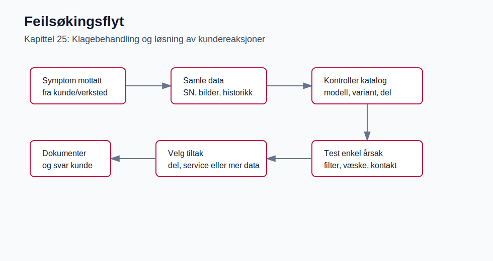

```mermaid
flowchart TD
    A[Symptom eller forespørsel mottatt] --> B[Samle serienummer, bilder og historikk]
    B --> C{Er motor og variant sikkert identifisert?}
    C -- Nei --> D[Be om mer dokumentasjon før del bekreftes]
    C -- Ja --> E[Kontroller delnummer og posisjon i katalog]
    E --> F{Stemmer symptom med foreslått del?}
    F -- Nei --> G[Foreslå feilsøking eller teknisk kontroll]
    F -- Ja --> H[Kontroller lager, pris og levering]
    H --> I[Send dokumentert kundesvar]
```

## Vedlikeholdsprosedyre
1. Avklar driftstimer, siste service og driftsmiljø.
2. Kontroller olje, filter, kjølevæske, sjøvannskrets, reimer, slanger og elektriske kontakter.
3. Sammenlign vedlikeholdsbehov med produsentens intervaller og faktisk bruk.
4. Anbefal servicekit når flere slitedeler bør skiftes samtidig.
5. Dokumenter hva som er anbefalt, hva kunden bestiller og eventuelle avvik fra normal prosedyre.

## Serienummeridentifikasjon
Serienummeridentifikasjon starter med å finne typeplate, motornummer eller annen unik identifikasjon. Be om bilde, ikke bare avskrift, fordi feil tegn, mellomrom og prefiks kan endre katalogoppslaget. Når serienummer ikke finnes, bygges identifikasjonen med modell, produksjonsår, bilder, tidligere fakturaer, servicehistorikk og delnummer fra monterte komponenter.

Minimumsdata bør være: fabrikat, modell, serienummer, eventuell product number/arrangement/CPL/motornummer, bilde av typeplate og bilde av motorens installasjon. Ved tvil skal saken stoppes for avklaring før del bekreftes.

## Reservedelsidentifikasjon
Reservedelsidentifikasjon skal bekrefte delnummer, posisjon, antall per motor, variant, side og eventuell erstatning. Dersom kunden oppgir et gammelt nummer, må det kontrolleres mot supersession. Dersom kunden bare sender bilde, skal bildet brukes som støtte, ikke som eneste grunnlag for bestilling.

Sjekk alltid om delnummeret gjelder enkeltkomponent, reparasjonssett, servicekit eller komplett enhet. Kontroller også om varen er høyre/venstre, gammel/ny type, standard/oversize eller knyttet til en bestemt produksjonsperiode.

## Bestillingsprosedyre
1. Opprett eller oppdater sak med kunde, fartøy, kontaktperson og tidsfrist.
2. Verifiser motoridentifikasjon og lagre bildedokumentasjon.
3. Finn korrekt delnummer i relevant katalog eller leverandørgrunnlag.
4. Kontroller supersession, antall, lagerstatus, pris, returvilkår og leveringstid.
5. Send ordrebekreftelse med delnummer, beskrivelse, antall, pris, levering og forbehold.
6. Følg opp leveransen til kunden har mottatt varen eller saken er lukket.

## Kvalitetspunkter før svar
- Har vi nok data til å gi et sikkert svar?
- Er delnummeret kontrollert mot riktig motorvariant?
- Er kundens tidsfrist realistisk med valgt fraktmåte?
- Er eventuelle forbehold skrevet tydelig?
- Kan en kollega forstå beslutningen ved å lese saken senere?

## Kapittelsammendrag
Hovedpoenget i kapittel 25 er at profesjonelt reservedelsarbeid krever struktur. Teknisk kunnskap, engelske fagtermer, praktisk feilsøking, dokumentasjon og kundedialog må henge sammen. Når medarbeideren jobber systematisk, reduseres feilbestillinger, kunden får bedre svar, og verkstedet kan planlegge arbeidet tryggere.

## Kryssreferanser
- For forrige tema, se kapittel 24: Oppfølging etter bestilling og leveranse.
- For neste tema, se kapittel 26: Caterpillar identifikasjon, vanlige deler og typiske utfordringer.
- For grunnleggende identifikasjon, se kapittel 12 og 17.
- For merkevise eksempler, se kapitlene 26-32.

## Fordypning for intern opplæring
Dette kapitlet skal brukes som arbeidsstandard, ikke bare som lesestoff. Når en ny medarbeider møter en sak om klagebehandling, skal vedkommende trene på å gå rolig fra fakta til vurdering og deretter til handling. I en marinemotorforhandler er konsekvensen av en feil ofte større enn verdien av selve delen. En feil impeller, feil sensor, feil filterinnsats eller feil pakningssett kan føre til tapt verkstedtid, utsatt avgang, irritert kunde og i verste fall ny driftsstans. Derfor skal hver sak behandles som en teknisk beslutning med sporbar dokumentasjon.

Profesjonelt nivå i dette kapitlet betyr at medarbeideren kan arbeide sikkert med klagebehandling. Før kunden får et bindende svar, skal opplysningene i saken kontrolleres mot motorens identitet, faktisk installasjon og relevant produsentterminologi. Det praktiske målet er ikke å finne et raskt nummer, men å kunne forklare hvorfor valgt del, kontrollpunkt eller kundesvar er riktig for akkurat denne motoren. Når informasjon mangler, skal medarbeideren beskrive hva som mangler, hvorfor det er nødvendig, og hvilket neste steg som bringer saken videre.

## Tekniske forklaringer
Teknisk forståelse i dette kapitlet skal bygges rundt faktaavklaring, teknisk vurdering, kundeopplevelse, garanti og korrigerende tiltak. Medarbeideren må skille mellom synlig symptom, sannsynlig systemfeil og bestillbar komponent. En del kan se riktig ut på bilde, men likevel være feil dersom posisjon, variant, rating, kjøleroppsett, elektrisk plugg, monteringsside eller servicehistorikk ikke stemmer. Derfor skal teknisk vurdering alltid kobles til både funksjon og dokumentasjon: hva gjør komponenten, hvilket system påvirker den, og hvilken produsentkilde bekrefter at den passer.

I praksis betyr dette at tekniske data skal kobles til motorens faktiske installasjon. Marine motorer står ofte trangt, er utsatt for salt, vibrasjon, fukt og ujevnt belastningsmønster, og de kan være bygget om gjennom mange år. En motor kan ha original kjøler, ettermontert eksosbend, alternativ dynamo, endret filterbrakett eller annen sjøvannspumpe enn standard. Slike forhold gjør at delidentifikasjon må bygge på både produsentdata og synlig dokumentasjon fra motoren.

Produsentterminologi er en del av den tekniske forståelsen. Bruk uttrykk som Serial Number, Engine Number, Part Number, Service Kit, Exploded View, Supersession når de er relevante. Ikke oversett dem på en måte som fjerner presisjon. Skriv for eksempel «Engine Serial Number (ESN)» første gang og deretter «ESN» i saken dersom produsenten bruker dette. Skriv «Arrangement Number» når CAT-data krever det, «Product Number» når Volvo Penta bruker det, «CPL» når Cummins-konfigurasjon må kontrolleres, og «Model Code» når Yanmar-identifikasjon bygger på modellkode. Dette gjør dialogen med internasjonale leverandører mer presis.

## Illustrasjonsforslag
- Oversiktsdiagram som viser hvor klagebehandling passer inn i total arbeidsflyt fra kundeforespørsel til levert del.
- Nærbilde av typeplate/motorskilt med markering av serienummer, motornummer, modell og eventuell variantkode.
- Sprengskisse med markert posisjon, delnummer, antall per motor og mulige alternative versjoner.
- Feilsøkingsflyt med beslutningspunkter: mangler data, stemmer symptom, kreves mer teknisk kontroll, kan ordre bekreftes.
- Sammenligningsbilde av gammel og ny del der forskjell i tilkobling, side, lengde eller sensorplugg er markert.

## Virkelige verkstedseksempler
Eksempel 1: Et verksted står med en demontert komponent på benken og kunden venter på avklaring før fartøyet kan settes tilbake i drift. Verkstedet sender et nærbilde av delen, men ingen motorplate. En uerfaren medarbeider kan bli fristet til å søke på nummeret som står på støpegodset. En profesjonell medarbeider svarer at støpenummer ikke nødvendigvis er bestillbart delnummer, ber om bilde av typeplate, oversiktsbilde av motoren og bilde av monteringsstedet, og forklarer at dette hindrer feilbestilling. Når informasjonen kommer, kontrolleres delnummer mot sprengskisse, posisjon og antall. Først da gis pris og leveringstid.

Eksempel 2: En kunde ringer sent på dagen og sier at motoren har høy temperatur etter service. Kunden ønsker ny termostat. Medarbeideren skal ikke automatisk konkludere med termostatfeil. Spørsmålene bør avklare om impeller er byttet, om sjøvannsfilteret er rent, om kjølevæskenivået er riktig, om alarmen kommer ved tomgang eller belastning, og om det finnes lekkasje rundt varmeveksler eller slanger. Dersom kunden likevel vil bestille termostat, dokumenteres at feilsøking er anbefalt, og delnummer kontrolleres mot serienummer før ordre.

Eksempel 3: En intern selger mottar en gammel faktura med et delnummer som ikke lenger finnes. Riktig prosess er å kontrollere supersession, se om ny del krever tilhørende pakning, boltsett eller adapter, og notere både gammelt og nytt nummer i saken. Kunden skal få vite at delen er erstattet, hva som leveres, og om det finnes monteringsforbehold.

## Reservedelsidentifisering i praksis
Reservedelsidentifisering skal følge en fast rekkefølge. Først kontrolleres motorens identitet. Deretter kontrolleres delens system: drivstoff, luft, kjøling, smøring, eksos, elektrisk eller mekanisk kraftoverføring. Så kontrolleres posisjon i sprengskisse eller parts list. Til slutt kontrolleres antall, variant, supersession og leveringsstatus. Denne rekkefølgen hindrer at medarbeideren hopper direkte fra kundens ord til et tilfeldig delnummer.

Når en del har synlig nummer, må nummeret tolkes riktig. Mange komponenter har produksjonsnummer, støpenummer, leverandørnummer eller revisjonskode som ikke er det samme som bestillbart part number. Et filter kan ha nummer fra filterprodusent, men motorprodusentens parts catalogue kan bruke et annet nummer. En pumpe kan ha nummer på lokk, hus og komplett enhet. Spør derfor alltid: gjelder nummeret komplett del, reparasjonssett, underkomponent eller produsentens råkomponent?

## Serienummer og motornummer
Serienummer og motornummer er grunnlaget for korrekt katalogoppslag. Be kunden sende bilde av typeplate eller dataplate. Dersom kunden skriver nummeret manuelt, skal nummeret likevel kontrolleres mot bilde når det er mulig. Noter hele nummeret, inkludert prefiks, suffiks, bindestrek, mellomrom og eventuelle bokstaver. På enkelte produsenter kan små forskjeller peke til forskjellig produksjonsperiode, rating eller konfigurasjon.

Bruk motornummer sammen med modell, variant og applikasjon. En motor som driver generator kan ha andre deler enn en fremdriftsmotor. En motor i yrkesbåt kan ha annen rating enn samme motor i fritidsbåt. En eldre motor kan være bygget om med ny dynamo, annen sjøvannspumpe eller uoriginal filterbrakett. Dersom typeplate mangler, bygg identifikasjonen gjennom flere kilder: servicebok, tidligere faktura, bilder av motorens sider, nummer på pumpe, filter, turbo og gear, samt opplysninger om fartøy og produksjonsår.

## Feilsøking steg for steg
1. Definer symptomet med kundens egne ord og skriv det i saken. Skill mellom «kunden ønsker del» og «kunden beskriver feil».
2. Avklar når feilen oppstår: start, tomgang, belastning, marsjfart, varm motor, kald motor eller etter nylig service.
3. Kontroller grunnleggende forhold: væskenivå, filter, luft i drivstoff, sjøvannsstrøm, reimer, elektriske kontakter, sikringer og synlige lekkasjer.
4. Knytt symptomet til system: lav effekt peker ofte mot luft/drivstoff/eksos, høy temperatur mot kjøling, lavt oljetrykk mot smøring/sensor, startproblem mot batteri/starter/gløding/drivstoff.
5. Be om bilder eller måledata dersom symptomet ikke kan kobles sikkert til en del. Dette kan være bilde av alarmdisplay, trykkmåling, temperaturmåling eller bilde av montert komponent.
6. Kontroller relevant delnummer mot serienummer og variant. Dersom flere alternativer finnes, forklar kunden hva som skiller dem.
7. Dokumenter anbefalt tiltak, usikkerhet og eventuelle forbehold før ordre bekreftes.

## Vedlikehold
Vedlikehold skal vurderes mot driftstimer, produsentens maintenance schedule og faktisk driftsmiljø. Marine motorer som går korte turer, mye tomgang eller i salt miljø kan trenge hyppigere kontroll enn standard intervall antyder. Nye medarbeidere skal lære å spørre om siste service, hvilke filter som ble byttet, hvilken olje som ble brukt, om impeller er kontrollert, og om kjølevæske eller anoder er byttet etter plan.

En god vedlikeholdsanbefaling er konkret. I stedet for å skrive «ta service», bør medarbeideren foreslå relevante deler: olje- og drivstoffilter, luftfilter, impeller, reim, pakninger, anoder, kjølevæske og eventuelt servicekit. Dersom kunden har ukjent servicehistorikk, bør komplett servicekit vurderes. Dersom kunden har hatt overoppheting, bør sjøvannskrets og varmeveksler kontrolleres før bare én komponent byttes.

## Vanlige feil
- Serienummer leses feil fordi et tegn forveksles, for eksempel O/0 eller I/1.
- Kunden oppgir modellnavn, men ikke variant, rating eller applikasjon.
- Del velges ut fra bilde alene uten kontroll mot sprengskisse eller produsentkatalog.
- Supersession aksepteres uten å kontrollere om ny del krever tilbehør, pakning eller ombygging.
- Hastepress gjør at leveringsløfte gis før lagerstatus og fraktmulighet er bekreftet.
- Saksnotat mangler grunnlaget for beslutningen, slik at kollega ikke kan etterprøve valget.

## Kontrollspørsmål
- Hva er den viktigste tekniske risikoen i en sak som gjelder klagebehandling?
- Hvilke opplysninger må dokumenteres før bindende delnummer bekreftes?
- Hvordan forklarer du kunden hvorfor bilde av typeplate er nødvendig?
- Når bør du stoppe en ordre og be om mer dokumentasjon?
- Hvilke engelske produsentuttrykk bør du kunne bruke i denne typen sak?
- Hvordan dokumenterer du at et delnummer er erstattet av et nytt nummer?

## Praktisk sjekkliste for medarbeider
- Les saken som om en kollega skal overta den i morgen.
- Kontroller at motoridentifikasjon er dokumentert med bilde eller sikker kilde.
- Sjekk at delnummeret er knyttet til riktig posisjon i katalogen.
- Skriv tydelig om kunden har bedt om enkeltkomponent, servicekit eller komplett enhet.
- Noter om varen er spesialbestilling, utgått, erstattet eller ikke returbar.
- Send kundesvar med neste steg, ikke bare et løst delnummer.

## Kapittelspesifikk systemforståelse
For dette kapitlet er kjernen å forstå klagebehandling og teknisk avviksavklaring. Medarbeideren skal kunne forklare dette med praktiske ord til både kunde og kollega. Det betyr at teknisk teori må kobles til konkrete handlinger: hvilke data skal innhentes, hvilke komponenter kan være berørt, hvilken produsentterminologi skal brukes, og hva må dokumenteres før saken kan gå videre. Klagebehandling skal samle fakta før skyld plasseres.

Når systemet vurderes, skal medarbeideren først plassere problemet i riktig teknisk sammenheng. Dersom kunden beskriver en alarm, må man finne ut om alarmen kommer fra reelt mekanisk avvik, elektrisk sensorfeil, feil etter service eller feil tolkning av instrumentet. Dersom kunden beskriver en del, må man avklare om kunden mener komplett enhet, servicekit, reparasjonssett eller enkeltkomponent. Dersom kunden beskriver motoren med vanlig navn, må man kontrollere om produsenten bruker mer presise begreper i katalogen.

## Komponentoversikt og arbeidsgrense
Relevante komponenter og opplysninger i dette kapitlet omfatter: reklamasjon, feil del, transportskade, monteringsfeil, garantivurdering og korrigerende tiltak. Listen er ikke ment som en erstatning for produsentens parts catalogue, men som en praktisk påminnelse om hva nye medarbeidere skal tenke på før de søker del. I interne saker skal komponentnavn skrives så presist som mulig. Bruk for eksempel «sjøvannspumpe / raw water pump» i stedet for bare «pumpe» når funksjonen er kjent, og «varmeveksler / heat exchanger» i stedet for bare «kjøler» når det er den komponenten saken gjelder.

Arbeidsgrensen for en reservedelsmedarbeider er også viktig. Medarbeideren skal ikke overta mekanikerens ansvar for demontering, måling eller diagnose på motoren, men skal kunne stille riktige spørsmål og foreslå riktig dokumentasjon. Når en sak går fra enkel delidentifikasjon til teknisk diagnose, skal dette markeres i saken. Da kan verksted, teknisk ansvarlig eller leverandør involveres med et klart spørsmål og et ryddig faktagrunnlag.

## Praktisk beslutningsregel
Bruk denne regelen i alle saker knyttet til kapitlet: Hvis motoridentifikasjon, komponentposisjon eller symptom ikke er sikkert nok dokumentert, skal medarbeideren ikke gi bindende delbekreftelse. Kunden kan få et foreløpig svar, men svaret må inneholde hva som mangler, hvorfor det mangler, og hva som skjer når informasjonen er mottatt. Dette er ikke treg service; det er profesjonell risikokontroll.

## Målrettet fordypning kapittel 21-30
### Klagebehandling med teknisk faktagrunnlag
Klagebehandling skal starte med fakta, ikke forsvar. Be om ordrenummer, bilder av emballasje, gammel og ny del, typeplate, monteringssted og beskrivelse av avviket. Skill mellom feilplukk, feilbestilling, katalogavvik, transportskade, monteringsfeil og endret motorinstallasjon. Hver kategori krever ulik løsning og ulik dokumentasjon.

Profesjonelt språk er viktig. Skriv «vi undersøker årsaken» i stedet for å plassere skyld tidlig. Dersom feilen skyldes manglende data fra kunden, skal dette dokumenteres saklig uten å gjøre dialogen konfliktfylt. Dersom feilen skyldes intern prosess, skal kunden få tydelig løsning og saken bør brukes som intern læring. Målet er både å løse kundens problem og redusere sannsynligheten for gjentakelse.

### Praktisk anvendelse i opplæring
Bruk kapitlet som caseøvelse der deltakeren skal skrive et kundesvar, identifisere nødvendige produsentdata og velge neste tekniske kontrollpunkt. Deltakeren skal også forklare hva som kan besvares av reservedelsavdelingen, og hva som må avklares av verksted, teknisk ansvarlig eller leverandør. Målet er at medarbeideren kan arbeide raskt, men fortsatt med sporbarhet og korrekt produsentterminologi.

## Realistisk opplæring i praksis
### Verkstedhistorie
En typisk sak i dette temaet starter med kunde mener feil del er levert. Verkstedet trenger et raskt svar, men den erfarne medarbeideren stopper opp og spør først: hva vet vi sikkert, hva antar vi, og hva kan gi følgeskade hvis vi tar feil? I praksis betyr det at fakta og reklamasjon må kobles til bilde, serienummer, komponentposisjon og kundens symptom før saken lukkes. Historien skal brukes i opplæring som en øvelse i å skrive et kort saksnotat: observasjon, vurdering, neste handling og forbehold.

### Kundehistorie
Kunden beskriver ofte problemet med driftsspråk: «motoren går tungt», «alarm kommer etter ti minutter», «jeg trenger den samme delen som sist» eller «båten skal ut i morgen». En profesjonell respons er rolig og konkret: bekreft behovet, forklar hvorfor identifikasjon trengs, be om riktig dokumentasjon og gi et realistisk tidspunkt for neste svar. Ikke korriger kunden unødvendig; oversett kundens språk til teknisk språk i saken.

### Typiske feil nye ansatte gjør
- søker på første synlige nummer uten å avklare om det er støpenummer, leverandørnummer eller bestillbart part number.
- lover levering før lagerstatus, frakt og returvilkår er kontrollert.
- antar at tidligere faktura alltid gjelder samme motorvariant.
- blander symptom og årsak, spesielt ved varme, lav effekt, startproblem og alarm.
- skriver for korte notater slik at kollega ikke kan forstå hvorfor valget ble tatt.

### Tips fra erfarne mekanikere og reservedelsselgere
- Se alltid etter systemet rundt delen: slanger, braketter, sensorer, reimer, kjølere og tilkoblinger forteller ofte mer enn delen alene.
- Still ett presist spørsmål om gangen når kunden er stresset; mange dårlige svar kommer av for lange spørsmålslister.
- Sammenlign gammel og ny del mot funksjon, ikke bare form. Riktig del skal passe, men også løse riktig problem.
- En erfaren reservedelsselger tenker i risiko: Hva er billigst å avklare nå, og hva blir dyrt hvis vi hopper over det?

### Vanlige kundespørsmål
| Spørsmål fra kunde | Profesjonelt svar |
|---|---|
| «Kan du bare sende samme del som sist?» | «Ja, hvis vi først bekrefter at det gjelder samme motor, samme posisjon og ingen supersession siden sist.» |
| «Holder det med bilde?» | «Bilde hjelper, men vi trenger også motoridentitet for å sikre variant og delnummer.» |
| «Hvorfor tar dette tid?» | «Fordi feil del kan gi ny driftsstans. Vi kontrollerer grunnlaget før vi lover levering.» |

### Beslutningstre for saken
| Trinn | Spørsmål | Handling |
|---|---|---|
| 1 | Er motoridentitet dokumentert med bilde eller sikker historikk? | Hvis nei: be om typeplate/dataplate eller alternativ dokumentasjon. |
| 2 | Er komponentens funksjon og posisjon kjent? | Hvis nei: be om oversiktsbilde og bilde av monteringssted. |
| 3 | Stemmer kundens symptom med delen som ønskes? | Hvis nei: anbefal feilsøking før del bestilles. |
| 4 | Finnes det supersession, kit eller variantvalg? | Kontroller produsentkilde og skriv forbehold i saken. |
| 5 | Kan pris, levering og returvilkår bekreftes? | Send dokumentert svar med neste steg og tydelig gyldighet. |

### Rask oppslagstabell
| Situasjon | Kontroller først | Vanlig fallgruve |
|---|---|---|
| Hasteordre | sikker motor-ID, lager, fraktfrist | levering loves før teknisk kontroll |
| Del fra bilde | posisjon, skala, tilkoblinger, nummer | bilde brukes som eneste beslutningsgrunnlag |
| Gammelt delnummer | supersession og kitinnhold | ny del krever ekstra pakning eller adapter |
| Uklart symptom | driftssituasjon, alarm, siste service | symptom blir tolket som sikker komponentfeil |

### Praktisk sjekkliste og inspeksjonsrutine
- Start med motoridentitet: fabrikat, modell, serienummer, variant, applikasjon og bilde av skilt.
- Kontroller området rundt komponenten: lekkasje, korrosjon, knekte fester, slitasje, varmemerker og uoriginale endringer.
- Spør om siste vedlikehold: olje, filter, impeller, reimer, kjølevæske, anoder og drivstoffilter.
- Noter driftstype: fritidsbruk, yrkesbruk, generator, fremdrift, tomgangsdrift eller langvarig høy belastning.
- Avklar om saken gjelder akutt drift, planlagt service, reklamasjon eller lagerpåfyll.

### Generelle vedlikeholdsintervaller som opplæringspunkt
| Kontrollpunkt | Typisk vurdering i opplæring | Må verifiseres |
|---|---|---|
| Olje og oljefilter | ofte basert på timer og kalender | produsentens maintenance schedule |
| Drivstoffilter/vannutskiller | hyppigere ved dårlig drivstoff eller sesongstart | motor- og filterspesifikasjon |
| Impeller og sjøvannskrets | kontrolleres særlig før sesong og etter varmgang | produsentens intervall og installasjon |
| Reimer, slanger og klemmer | visuell kontroll ved service og feilsøking | dimensjon, stramming og delnummer |

### Produsentverifikasjon
Alle konkrete delnumre, momentverdier, serviceintervaller, garantikrav, programvaredata og produsentspesifikke grenser skal kontrolleres mot offisiell produsentdokumentasjon før de brukes i tilbud, ordre eller verkstedinstruks. Marker tydelig i saken når svaret bygger på antakelse, eldre historikk, bilde uten motor-ID eller generell erfaring. Intervaller i tabellen er generelle opplæringspunkter. Faktiske intervaller styres av produsent, motorvariant, driftstimer, kalenderkrav, belastning og miljø.

## Produsentverifikasjon og faglig forbehold
Denne manualen skal brukes som intern opplæring og arbeidsmetode. Produsentspesifikke delnumre, intervaller, momentverdier, garantikrav og tekniske grenseverdier skal verifiseres mot gjeldende produsentdokumentasjon før de brukes i kundeordre eller verkstedinstruks. Marker saken internt dersom opplysningen bygger på antakelse, eldre historikk eller bilde uten bekreftet motoridentitet.

## Quiz med fasit
1. Hvilke tekniske data bør alltid samles før en del bekreftes?
2. Hvorfor er engelsk terminologi viktig i marine reservedeler?
3. Hva bør gjøres dersom kunden bare sender et bilde av delen?
4. Hvilke punkter bør kontrolleres før ordrebekreftelse sendes?
5. Hvorfor skal feilsøking dokumenteres, selv når kunden allerede ber om en bestemt del?

### Svar
1. Fabrikat, modell, serienummer, variantdata, bilde av typeplate, delnummer, posisjon og kundens symptombeskrivelse.
2. Fordi kataloger, portaler, servicemanualer og leverandørdialog ofte bruker engelske begreper som må forstås presist.
3. Be om serienummer, oversiktsbilde av motoren og eventuelle nummer på delen; bildet brukes som støtte, ikke eneste grunnlag.
4. Delnummer, antall, variant, pris, lagerstatus, leveringstid, frakt, returvilkår og eventuelle forbehold.
5. Fordi symptomet kan ha flere årsaker, og dokumentasjon viser hvorfor anbefalingen ble gitt.

---

# Kapittel 26: Caterpillar identifikasjon, vanlige deler og typiske utfordringer

## Kapittelrolle
Caterpillar (CAT) krever systematisk identifikasjon fordi samme motorfamilie kan finnes i flere marine installasjoner, effektnivåer og produksjonsperioder. En profesjonell medarbeider skal ikke bare finne en del som ligner, men dokumentere hvorfor den valgte delen passer til akkurat denne motoren.

## Læringsmål
Etter kapitlet skal deltakeren kunne:
- forklare hovedbegrepene innen reservedelsarbeid
- bruke serienummer, modellinformasjon og delnummer i praktisk reservedelsarbeid
- kommunisere trygt med kunde, verksted, lager og leverandør
- dokumentere beslutninger slik at andre kan etterprøve saken
- kjenne igjen vanlige feil og velge riktig neste handling

## English technical terminology
- **Engine Serial Number (ESN):** engelsk fagterm som ofte brukes i kataloger, servicelitteratur, leverandørportaler og internasjonal kundedialog.
- **Arrangement Number:** engelsk fagterm som ofte brukes i kataloger, servicelitteratur, leverandørportaler og internasjonal kundedialog.
- **Engine Model:** engelsk fagterm som ofte brukes i kataloger, servicelitteratur, leverandørportaler og internasjonal kundedialog.
- **Parts Manual:** engelsk fagterm som ofte brukes i kataloger, servicelitteratur, leverandørportaler og internasjonal kundedialog.
- **Service Information System:** engelsk fagterm som ofte brukes i kataloger, servicelitteratur, leverandørportaler og internasjonal kundedialog.
- **Part Number:** engelsk fagterm som ofte brukes i kataloger, servicelitteratur, leverandørportaler og internasjonal kundedialog.
- **Supersession:** engelsk fagterm som ofte brukes i kataloger, servicelitteratur, leverandørportaler og internasjonal kundedialog.
- **Service Kit:** engelsk fagterm som ofte brukes i kataloger, servicelitteratur, leverandørportaler og internasjonal kundedialog.
- **Troubleshooting:** engelsk fagterm som ofte brukes i kataloger, servicelitteratur, leverandørportaler og internasjonal kundedialog.

## Hoveddiagram
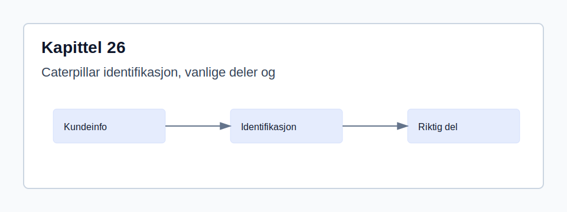

## Tekniske systemillustrasjoner

## Grundig forklaring
Hvordan kapitlets tema brukes i praktisk arbeid må forstås både teknisk og praktisk. I marine reservedeler er det sjelden nok å vite hva kunden kaller delen. Medarbeideren må forstå hvilken funksjon delen har, hvor den sitter, hvilken motorvariant den tilhører, og hva som skjer dersom feil del bestilles. Derfor skal tekniske data, kundens beskrivelse og dokumentert katalogoppslag alltid vurderes sammen.

En god sak har fire kjennetegn: den har tydelig identifikasjon, tydelig problem- eller delbeskrivelse, tydelig beslutningsgrunnlag og tydelig oppfølging. Dersom ett av disse punktene mangler, skal saken markeres som usikker før kunden får et bindende svar.

## Praktisk verkstedeksempel
Et verksted kontakter support fordi en Caterpillar (CAT)-motor skal klargjøres før avgang. De oppgir bare motormodell og et gammelt filter som eksempel. Riktig arbeidsmåte er å be om typeplate, bilde av eksisterende filter, driftstimer og om kunden ønsker enkeltfilter eller komplett servicekit. Når data er kontrollert, sendes et svar med korrekt delnummer, antall, leveringstid og forbehold om eventuelle erstatningsnummer.

## Kundesupporteksempel
Kunde: 'Jeg trenger en pumpe til Caterpillar (CAT), helst i dag.' Profesjonelt svar: 'Jeg skal hjelpe deg raskt. For å unngå feil pumpe trenger jeg bilde av motorskiltet, bilde av pumpen montert og et nærbilde av eventuelt nummer på pumpen. Når jeg har dette, kontrollerer jeg riktig variant og gir deg lagerstatus og raskeste fraktalternativ.'

## Vanlige feil og årsaker
- lav effekt ved belastning på grunn av tette filtre eller turbo-/luftproblem.
- høy kjølevæsketemperatur på grunn av impeller, varmeveksler eller sjøvannsstrøm.
- oljelekkasje ved pakninger eller kjølere.
- feil sensor eller alarm etter utskifting uten korrekt variantkontroll.

## Feilsøkingsflyt
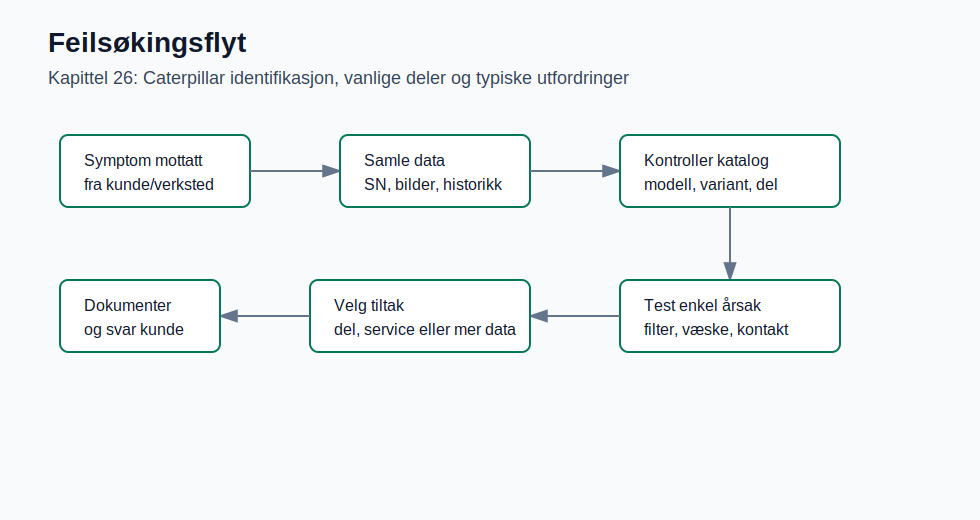

```mermaid
flowchart TD
    A[Symptom eller forespørsel mottatt] --> B[Samle serienummer, bilder og historikk]
    B --> C{Er motor og variant sikkert identifisert?}
    C -- Nei --> D[Be om mer dokumentasjon før del bekreftes]
    C -- Ja --> E[Kontroller delnummer og posisjon i katalog]
    E --> F{Stemmer symptom med foreslått del?}
    F -- Nei --> G[Foreslå feilsøking eller teknisk kontroll]
    F -- Ja --> H[Kontroller lager, pris og levering]
    H --> I[Send dokumentert kundesvar]
```

## Vedlikeholdsprosedyre
1. Avklar driftstimer, siste service og driftsmiljø.
2. Kontroller olje, filter, kjølevæske, sjøvannskrets, reimer, slanger og elektriske kontakter.
3. Sammenlign vedlikeholdsbehov med produsentens intervaller og faktisk bruk.
4. Anbefal servicekit når flere slitedeler bør skiftes samtidig.
5. Dokumenter hva som er anbefalt, hva kunden bestiller og eventuelle avvik fra normal prosedyre.

## Serienummeridentifikasjon
Start med Engine Serial Number og arrangement number. CAT-deler kan skille på arrangement selv når motorbetegnelsen er lik. Be alltid om bilde av typeplate og noter prefiks, serienummer og arrangement slik det står skrevet.

Minimumsdata bør være: fabrikat, modell, serienummer, eventuell product number/arrangement/CPL/motornummer, bilde av typeplate og bilde av motorens installasjon. Ved tvil skal saken stoppes for avklaring før del bekreftes.

## Reservedelsidentifikasjon
Kontroller filter, pakninger, pumper, injektorer, turbo, sensorer og kjøledeler mot arrangement number. Ved eldre CAT-motorer må du kontrollere supersession og om kunden har original eller ettermontert mariniseringsutstyr.

Sjekk alltid om delnummeret gjelder enkeltkomponent, reparasjonssett, servicekit eller komplett enhet. Kontroller også om varen er høyre/venstre, gammel/ny type, standard/oversize eller knyttet til en bestemt produksjonsperiode.

## Bestillingsprosedyre
1. Opprett eller oppdater sak med kunde, fartøy, kontaktperson og tidsfrist.
2. Verifiser motoridentifikasjon og lagre bildedokumentasjon.
3. Finn korrekt delnummer i relevant katalog eller leverandørgrunnlag.
4. Kontroller supersession, antall, lagerstatus, pris, returvilkår og leveringstid.
5. Send ordrebekreftelse med delnummer, beskrivelse, antall, pris, levering og forbehold.
6. Følg opp leveransen til kunden har mottatt varen eller saken er lukket.

## Kvalitetspunkter før svar
- Har vi nok data til å gi et sikkert svar?
- Er delnummeret kontrollert mot riktig motorvariant?
- Er kundens tidsfrist realistisk med valgt fraktmåte?
- Er eventuelle forbehold skrevet tydelig?
- Kan en kollega forstå beslutningen ved å lese saken senere?

## Kapittelsammendrag
Hovedpoenget i kapittel 26 er at profesjonelt reservedelsarbeid krever struktur. Teknisk kunnskap, engelske fagtermer, praktisk feilsøking, dokumentasjon og kundedialog må henge sammen. Når medarbeideren jobber systematisk, reduseres feilbestillinger, kunden får bedre svar, og verkstedet kan planlegge arbeidet tryggere.

## Kryssreferanser
- For forrige tema, se kapittel 25: Klagebehandling og løsning av kundereaksjoner.
- For neste tema, se kapittel 27: Volvo Penta serienummer, delvalg og servicekunnskap.
- For grunnleggende identifikasjon, se kapittel 12 og 17.

## Fordypning for intern opplæring
Dette kapitlet skal brukes som arbeidsstandard, ikke bare som lesestoff. Når en ny medarbeider møter en sak om Caterpillar (CAT), skal vedkommende trene på å gå rolig fra fakta til vurdering og deretter til handling. I en marinemotorforhandler er konsekvensen av en feil ofte større enn verdien av selve delen. En feil impeller, feil sensor, feil filterinnsats eller feil pakningssett kan føre til tapt verkstedtid, utsatt avgang, irritert kunde og i verste fall ny driftsstans. Derfor skal hver sak behandles som en teknisk beslutning med sporbar dokumentasjon.

I produsentdialog skal medarbeideren bruke produsentens egne betegnelser når de finnes: Engine Serial Number (ESN), Arrangement Number, Engine Model, Parts Manual, Service Information System. Dette gir bedre presisjon overfor leverandør, reduserer risiko for misforståelser og gjør saken lettere å kontrollere senere.

Profesjonelt nivå i dette kapitlet betyr at medarbeideren kan arbeide sikkert med CAT-identifikasjon. Før kunden får et bindende svar, skal opplysningene i saken kontrolleres mot motorens identitet, faktisk installasjon og relevant produsentterminologi. Det praktiske målet er ikke å finne et raskt nummer, men å kunne forklare hvorfor valgt del, kontrollpunkt eller kundesvar er riktig for akkurat denne motoren. Når informasjon mangler, skal medarbeideren beskrive hva som mangler, hvorfor det er nødvendig, og hvilket neste steg som bringer saken videre.

## Tekniske forklaringer
Teknisk forståelse i dette kapitlet skal bygges rundt Engine Serial Number, Serial Number Prefix, Arrangement Number, Parts Manual, SIS, reman og supersession. Medarbeideren må skille mellom synlig symptom, sannsynlig systemfeil og bestillbar komponent. En del kan se riktig ut på bilde, men likevel være feil dersom posisjon, variant, rating, kjøleroppsett, elektrisk plugg, monteringsside eller servicehistorikk ikke stemmer. Derfor skal teknisk vurdering alltid kobles til både funksjon og dokumentasjon: hva gjør komponenten, hvilket system påvirker den, og hvilken produsentkilde bekrefter at den passer.

I praksis betyr dette at tekniske data skal kobles til motorens faktiske installasjon. Marine motorer står ofte trangt, er utsatt for salt, vibrasjon, fukt og ujevnt belastningsmønster, og de kan være bygget om gjennom mange år. En motor kan ha original kjøler, ettermontert eksosbend, alternativ dynamo, endret filterbrakett eller annen sjøvannspumpe enn standard. Slike forhold gjør at delidentifikasjon må bygge på både produsentdata og synlig dokumentasjon fra motoren.

Produsentterminologi er en del av den tekniske forståelsen. Bruk uttrykk som Engine Serial Number (ESN), Arrangement Number, Engine Model, Parts Manual, Service Information System, Serial Number Prefix når de er relevante. Ikke oversett dem på en måte som fjerner presisjon. Skriv for eksempel «Engine Serial Number (ESN)» første gang og deretter «ESN» i saken dersom produsenten bruker dette. Skriv «Arrangement Number» når CAT-data krever det, «Product Number» når Volvo Penta bruker det, «CPL» når Cummins-konfigurasjon må kontrolleres, og «Model Code» når Yanmar-identifikasjon bygger på modellkode. Dette gjør dialogen med internasjonale leverandører mer presis.

## Illustrasjonsforslag
- Oversiktsdiagram som viser hvor Caterpillar (CAT) passer inn i total arbeidsflyt fra kundeforespørsel til levert del.
- Nærbilde av typeplate/motorskilt med markering av serienummer, motornummer, modell og eventuell variantkode.
- Sprengskisse med markert posisjon, delnummer, antall per motor og mulige alternative versjoner.
- Feilsøkingsflyt med beslutningspunkter: mangler data, stemmer symptom, kreves mer teknisk kontroll, kan ordre bekreftes.
- Sammenligningsbilde av gammel og ny del der forskjell i tilkobling, side, lengde eller sensorplugg er markert.

## Virkelige verkstedseksempler
Eksempel 1: Et verksted står med en demontert komponent på benken og kunden venter på avklaring før fartøyet kan settes tilbake i drift. Verkstedet sender et nærbilde av delen, men ingen motorplate. En uerfaren medarbeider kan bli fristet til å søke på nummeret som står på støpegodset. En profesjonell medarbeider svarer at støpenummer ikke nødvendigvis er bestillbart delnummer, ber om bilde av typeplate, oversiktsbilde av motoren og bilde av monteringsstedet, og forklarer at dette hindrer feilbestilling. Når informasjonen kommer, kontrolleres delnummer mot sprengskisse, posisjon og antall. Først da gis pris og leveringstid.

Eksempel 2: En kunde ringer sent på dagen og sier at motoren har høy temperatur etter service. Kunden ønsker ny termostat. Medarbeideren skal ikke automatisk konkludere med termostatfeil. Spørsmålene bør avklare om impeller er byttet, om sjøvannsfilteret er rent, om kjølevæskenivået er riktig, om alarmen kommer ved tomgang eller belastning, og om det finnes lekkasje rundt varmeveksler eller slanger. Dersom kunden likevel vil bestille termostat, dokumenteres at feilsøking er anbefalt, og delnummer kontrolleres mot serienummer før ordre.

Eksempel 3: En intern selger mottar en gammel faktura med et delnummer som ikke lenger finnes. Riktig prosess er å kontrollere supersession, se om ny del krever tilhørende pakning, boltsett eller adapter, og notere både gammelt og nytt nummer i saken. Kunden skal få vite at delen er erstattet, hva som leveres, og om det finnes monteringsforbehold.

## Reservedelsidentifisering i praksis
Reservedelsidentifisering skal følge en fast rekkefølge. Først kontrolleres motorens identitet. Deretter kontrolleres delens system: drivstoff, luft, kjøling, smøring, eksos, elektrisk eller mekanisk kraftoverføring. Så kontrolleres posisjon i sprengskisse eller parts list. Til slutt kontrolleres antall, variant, supersession og leveringsstatus. Denne rekkefølgen hindrer at medarbeideren hopper direkte fra kundens ord til et tilfeldig delnummer.

Når en del har synlig nummer, må nummeret tolkes riktig. Mange komponenter har produksjonsnummer, støpenummer, leverandørnummer eller revisjonskode som ikke er det samme som bestillbart part number. Et filter kan ha nummer fra filterprodusent, men motorprodusentens parts catalogue kan bruke et annet nummer. En pumpe kan ha nummer på lokk, hus og komplett enhet. Spør derfor alltid: gjelder nummeret komplett del, reparasjonssett, underkomponent eller produsentens råkomponent?

## Serienummer og motornummer
Serienummer og motornummer er grunnlaget for korrekt katalogoppslag. Be kunden sende bilde av typeplate eller dataplate. Dersom kunden skriver nummeret manuelt, skal nummeret likevel kontrolleres mot bilde når det er mulig. Noter hele nummeret, inkludert prefiks, suffiks, bindestrek, mellomrom og eventuelle bokstaver. På enkelte produsenter kan små forskjeller peke til forskjellig produksjonsperiode, rating eller konfigurasjon.

Bruk motornummer sammen med modell, variant og applikasjon. En motor som driver generator kan ha andre deler enn en fremdriftsmotor. En motor i yrkesbåt kan ha annen rating enn samme motor i fritidsbåt. En eldre motor kan være bygget om med ny dynamo, annen sjøvannspumpe eller uoriginal filterbrakett. Dersom typeplate mangler, bygg identifikasjonen gjennom flere kilder: servicebok, tidligere faktura, bilder av motorens sider, nummer på pumpe, filter, turbo og gear, samt opplysninger om fartøy og produksjonsår.

## Feilsøking steg for steg
1. Definer symptomet med kundens egne ord og skriv det i saken. Skill mellom «kunden ønsker del» og «kunden beskriver feil».
2. Avklar når feilen oppstår: start, tomgang, belastning, marsjfart, varm motor, kald motor eller etter nylig service.
3. Kontroller grunnleggende forhold: væskenivå, filter, luft i drivstoff, sjøvannsstrøm, reimer, elektriske kontakter, sikringer og synlige lekkasjer.
4. Knytt symptomet til system: lav effekt peker ofte mot luft/drivstoff/eksos, høy temperatur mot kjøling, lavt oljetrykk mot smøring/sensor, startproblem mot batteri/starter/gløding/drivstoff.
5. Be om bilder eller måledata dersom symptomet ikke kan kobles sikkert til en del. Dette kan være bilde av alarmdisplay, trykkmåling, temperaturmåling eller bilde av montert komponent.
6. Kontroller relevant delnummer mot serienummer og variant. Dersom flere alternativer finnes, forklar kunden hva som skiller dem.
7. Dokumenter anbefalt tiltak, usikkerhet og eventuelle forbehold før ordre bekreftes.

## Vedlikehold
Vedlikehold skal vurderes mot driftstimer, produsentens maintenance schedule og faktisk driftsmiljø. Marine motorer som går korte turer, mye tomgang eller i salt miljø kan trenge hyppigere kontroll enn standard intervall antyder. Nye medarbeidere skal lære å spørre om siste service, hvilke filter som ble byttet, hvilken olje som ble brukt, om impeller er kontrollert, og om kjølevæske eller anoder er byttet etter plan.

En god vedlikeholdsanbefaling er konkret. I stedet for å skrive «ta service», bør medarbeideren foreslå relevante deler: olje- og drivstoffilter, luftfilter, impeller, reim, pakninger, anoder, kjølevæske og eventuelt servicekit. Dersom kunden har ukjent servicehistorikk, bør komplett servicekit vurderes. Dersom kunden har hatt overoppheting, bør sjøvannskrets og varmeveksler kontrolleres før bare én komponent byttes.

## Vanlige feil
- Serienummer leses feil fordi et tegn forveksles, for eksempel O/0 eller I/1.
- Kunden oppgir modellnavn, men ikke variant, rating eller applikasjon.
- Del velges ut fra bilde alene uten kontroll mot sprengskisse eller produsentkatalog.
- Supersession aksepteres uten å kontrollere om ny del krever tilbehør, pakning eller ombygging.
- Hastepress gjør at leveringsløfte gis før lagerstatus og fraktmulighet er bekreftet.
- Saksnotat mangler grunnlaget for beslutningen, slik at kollega ikke kan etterprøve valget.

## Kontrollspørsmål
- Hva er den viktigste tekniske risikoen i en sak som gjelder Caterpillar (CAT)?
- Hvilke opplysninger må dokumenteres før bindende delnummer bekreftes?
- Hvordan forklarer du kunden hvorfor bilde av typeplate er nødvendig?
- Når bør du stoppe en ordre og be om mer dokumentasjon?
- Hvilke engelske produsentuttrykk bør du kunne bruke i denne typen sak?
- Hvordan dokumenterer du at et delnummer er erstattet av et nytt nummer?

## Praktisk sjekkliste for medarbeider
- Les saken som om en kollega skal overta den i morgen.
- Kontroller at motoridentifikasjon er dokumentert med bilde eller sikker kilde.
- Sjekk at delnummeret er knyttet til riktig posisjon i katalogen.
- Skriv tydelig om kunden har bedt om enkeltkomponent, servicekit eller komplett enhet.
- Noter om varen er spesialbestilling, utgått, erstattet eller ikke returbar.
- Send kundesvar med neste steg, ikke bare et løst delnummer.

## Kapittelspesifikk systemforståelse
For dette kapitlet er kjernen å forstå CAT-identifikasjon med Engine Serial Number, Serial Number Prefix og Arrangement Number. Medarbeideren skal kunne forklare dette med praktiske ord til både kunde og kollega. Det betyr at teknisk teori må kobles til konkrete handlinger: hvilke data skal innhentes, hvilke komponenter kan være berørt, hvilken produsentterminologi skal brukes, og hva må dokumenteres før saken kan gå videre. CAT-saker skal aldri baseres på engine model alene dersom arrangement number er tilgjengelig.

Når systemet vurderes, skal medarbeideren først plassere problemet i riktig teknisk sammenheng. Dersom kunden beskriver en alarm, må man finne ut om alarmen kommer fra reelt mekanisk avvik, elektrisk sensorfeil, feil etter service eller feil tolkning av instrumentet. Dersom kunden beskriver en del, må man avklare om kunden mener komplett enhet, servicekit, reparasjonssett eller enkeltkomponent. Dersom kunden beskriver motoren med vanlig navn, må man kontrollere om produsenten bruker mer presise begreper i katalogen.

## Komponentoversikt og arbeidsgrense
Relevante komponenter og opplysninger i dette kapitlet omfatter: dataplate, arrangement number, engine model, parts manual, SIS, reman, injectors, turbo, water pump og filters. Listen er ikke ment som en erstatning for produsentens parts catalogue, men som en praktisk påminnelse om hva nye medarbeidere skal tenke på før de søker del. I interne saker skal komponentnavn skrives så presist som mulig. Bruk for eksempel «sjøvannspumpe / raw water pump» i stedet for bare «pumpe» når funksjonen er kjent, og «varmeveksler / heat exchanger» i stedet for bare «kjøler» når det er den komponenten saken gjelder.

Arbeidsgrensen for en reservedelsmedarbeider er også viktig. Medarbeideren skal ikke overta mekanikerens ansvar for demontering, måling eller diagnose på motoren, men skal kunne stille riktige spørsmål og foreslå riktig dokumentasjon. Når en sak går fra enkel delidentifikasjon til teknisk diagnose, skal dette markeres i saken. Da kan verksted, teknisk ansvarlig eller leverandør involveres med et klart spørsmål og et ryddig faktagrunnlag.

## Praktisk beslutningsregel
Bruk denne regelen i alle saker knyttet til kapitlet: Hvis motoridentifikasjon, komponentposisjon eller symptom ikke er sikkert nok dokumentert, skal medarbeideren ikke gi bindende delbekreftelse. Kunden kan få et foreløpig svar, men svaret må inneholde hva som mangler, hvorfor det mangler, og hva som skjer når informasjonen er mottatt. Dette er ikke treg service; det er profesjonell risikokontroll.

## Målrettet fordypning kapittel 21-30
### CAT: Engine Serial Number, Arrangement Number og parts manual
For Caterpillar (CAT) er Engine Serial Number, ofte med Serial Number Prefix, og Arrangement Number sentrale identifikasjonsdata. Engine Model alene er ikke nok fordi samme modell kan ha ulike arrangements med forskjellige filtre, pumper, turbo, injectors, sensors og cooling components. I CAT-saker skal medarbeideren be om bilde av dataplate og kontrollere om arrangement number finnes i dokumentasjonen.

Reservedelsidentifisering bør skje mot CAT parts manual eller tilsvarende autorisert kilde. Vær oppmerksom på reman-alternativer, supersession og komponenter der støpenummer ikke er bestillbart part number. Ved verkstedcase med lav effekt bør support avklare fuel filters, air restriction, turbocharger, aftercooler og exhaust restriction før injektor eller pumpe foreslås. Ved høy temperatur bør raw water pump, heat exchanger, coolant level, thermostat og belt drive vurderes systematisk.

### Praktisk anvendelse i opplæring
Bruk kapitlet som caseøvelse der deltakeren skal skrive et kundesvar, identifisere nødvendige produsentdata og velge neste tekniske kontrollpunkt. Deltakeren skal også forklare hva som kan besvares av reservedelsavdelingen, og hva som må avklares av verksted, teknisk ansvarlig eller leverandør. Målet er at medarbeideren kan arbeide raskt, men fortsatt med sporbarhet og korrekt produsentterminologi.

## Realistisk opplæring i praksis
### Verkstedhistorie
En typisk sak i dette temaet starter med CAT-motor med manglende Arrangement Number. Verkstedet trenger et raskt svar, men den erfarne medarbeideren stopper opp og spør først: hva vet vi sikkert, hva antar vi, og hva kan gi følgeskade hvis vi tar feil? I praksis betyr det at ESN, prefix, arrangement og SIS må kobles til bilde, serienummer, komponentposisjon og kundens symptom før saken lukkes. Historien skal brukes i opplæring som en øvelse i å skrive et kort saksnotat: observasjon, vurdering, neste handling og forbehold.

### Kundehistorie
Kunden beskriver ofte problemet med driftsspråk: «motoren går tungt», «alarm kommer etter ti minutter», «jeg trenger den samme delen som sist» eller «båten skal ut i morgen». En profesjonell respons er rolig og konkret: bekreft behovet, forklar hvorfor identifikasjon trengs, be om riktig dokumentasjon og gi et realistisk tidspunkt for neste svar. Ikke korriger kunden unødvendig; oversett kundens språk til teknisk språk i saken.

### Typiske feil nye ansatte gjør
- søker på første synlige nummer uten å avklare om det er støpenummer, leverandørnummer eller bestillbart part number.
- lover levering før lagerstatus, frakt og returvilkår er kontrollert.
- antar at tidligere faktura alltid gjelder samme motorvariant.
- blander symptom og årsak, spesielt ved varme, lav effekt, startproblem og alarm.
- skriver for korte notater slik at kollega ikke kan forstå hvorfor valget ble tatt.

### Tips fra erfarne mekanikere og reservedelsselgere
- Se alltid etter systemet rundt delen: slanger, braketter, sensorer, reimer, kjølere og tilkoblinger forteller ofte mer enn delen alene.
- Still ett presist spørsmål om gangen når kunden er stresset; mange dårlige svar kommer av for lange spørsmålslister.
- Sammenlign gammel og ny del mot funksjon, ikke bare form. Riktig del skal passe, men også løse riktig problem.
- En erfaren reservedelsselger tenker i risiko: Hva er billigst å avklare nå, og hva blir dyrt hvis vi hopper over det?

### Vanlige kundespørsmål
| Spørsmål fra kunde | Profesjonelt svar |
|---|---|
| «Kan du bare sende samme del som sist?» | «Ja, hvis vi først bekrefter at det gjelder samme motor, samme posisjon og ingen supersession siden sist.» |
| «Holder det med bilde?» | «Bilde hjelper, men vi trenger også motoridentitet for å sikre variant og delnummer.» |
| «Hvorfor tar dette tid?» | «Fordi feil del kan gi ny driftsstans. Vi kontrollerer grunnlaget før vi lover levering.» |

### Beslutningstre for saken
| Trinn | Spørsmål | Handling |
|---|---|---|
| 1 | Er motoridentitet dokumentert med bilde eller sikker historikk? | Hvis nei: be om typeplate/dataplate eller alternativ dokumentasjon. |
| 2 | Er komponentens funksjon og posisjon kjent? | Hvis nei: be om oversiktsbilde og bilde av monteringssted. |
| 3 | Stemmer kundens symptom med delen som ønskes? | Hvis nei: anbefal feilsøking før del bestilles. |
| 4 | Finnes det supersession, kit eller variantvalg? | Kontroller produsentkilde og skriv forbehold i saken. |
| 5 | Kan pris, levering og returvilkår bekreftes? | Send dokumentert svar med neste steg og tydelig gyldighet. |

### Rask oppslagstabell
| Situasjon | Kontroller først | Vanlig fallgruve |
|---|---|---|
| Hasteordre | sikker motor-ID, lager, fraktfrist | levering loves før teknisk kontroll |
| Del fra bilde | posisjon, skala, tilkoblinger, nummer | bilde brukes som eneste beslutningsgrunnlag |
| Gammelt delnummer | supersession og kitinnhold | ny del krever ekstra pakning eller adapter |
| Uklart symptom | driftssituasjon, alarm, siste service | symptom blir tolket som sikker komponentfeil |

### Praktisk sjekkliste og inspeksjonsrutine
- Start med motoridentitet: fabrikat, modell, serienummer, variant, applikasjon og bilde av skilt.
- Kontroller området rundt komponenten: lekkasje, korrosjon, knekte fester, slitasje, varmemerker og uoriginale endringer.
- Spør om siste vedlikehold: olje, filter, impeller, reimer, kjølevæske, anoder og drivstoffilter.
- Noter driftstype: fritidsbruk, yrkesbruk, generator, fremdrift, tomgangsdrift eller langvarig høy belastning.
- Avklar om saken gjelder akutt drift, planlagt service, reklamasjon eller lagerpåfyll.

### Generelle vedlikeholdsintervaller som opplæringspunkt
| Kontrollpunkt | Typisk vurdering i opplæring | Må verifiseres |
|---|---|---|
| Olje og oljefilter | ofte basert på timer og kalender | produsentens maintenance schedule |
| Drivstoffilter/vannutskiller | hyppigere ved dårlig drivstoff eller sesongstart | motor- og filterspesifikasjon |
| Impeller og sjøvannskrets | kontrolleres særlig før sesong og etter varmgang | produsentens intervall og installasjon |
| Reimer, slanger og klemmer | visuell kontroll ved service og feilsøking | dimensjon, stramming og delnummer |

### Produsentverifikasjon
CAT SIS, Parts Manual, Service Information og eventuelle dealer-notater må brukes før ESN, Serial Number Prefix, Arrangement Number, reman og supersession blir bindende. Marker tydelig i saken når svaret bygger på antakelse, eldre historikk, bilde uten motor-ID eller generell erfaring. Intervaller i tabellen er generelle opplæringspunkter. Faktiske intervaller styres av produsent, motorvariant, driftstimer, kalenderkrav, belastning og miljø.

## Produsentverifikasjon og faglig forbehold
For Caterpillar (CAT) skal Engine Serial Number, Serial Number Prefix, Arrangement Number, Parts Manual, SIS-data, reman-alternativer og supersession alltid kontrolleres i autorisert dokumentasjon før bindende delbekreftelse. Marker saken internt dersom opplysningen bygger på antakelse, eldre historikk eller bilde uten bekreftet motoridentitet.

## Quiz med fasit
1. Hvilke tekniske data bør alltid samles før en del bekreftes?
2. Hvorfor er engelsk terminologi viktig i marine reservedeler?
3. Hva bør gjøres dersom kunden bare sender et bilde av delen?
4. Hvilke punkter bør kontrolleres før ordrebekreftelse sendes?
5. Hvorfor skal feilsøking dokumenteres, selv når kunden allerede ber om en bestemt del?

### Svar
1. Fabrikat, modell, serienummer, variantdata, bilde av typeplate, delnummer, posisjon og kundens symptombeskrivelse.
2. Fordi kataloger, portaler, servicemanualer og leverandørdialog ofte bruker engelske begreper som må forstås presist.
3. Be om serienummer, oversiktsbilde av motoren og eventuelle nummer på delen; bildet brukes som støtte, ikke eneste grunnlag.
4. Delnummer, antall, variant, pris, lagerstatus, leveringstid, frakt, returvilkår og eventuelle forbehold.
5. Fordi symptomet kan ha flere årsaker, og dokumentasjon viser hvorfor anbefalingen ble gitt.

---

# Kapittel 27: Volvo Penta serienummer, delvalg og servicekunnskap

## Kapittelrolle
Volvo Penta krever systematisk identifikasjon fordi samme motorfamilie kan finnes i flere marine installasjoner, effektnivåer og produksjonsperioder. En profesjonell medarbeider skal ikke bare finne en del som ligner, men dokumentere hvorfor den valgte delen passer til akkurat denne motoren.

## Læringsmål
Etter kapitlet skal deltakeren kunne:
- forklare hovedbegrepene innen reservedelsarbeid
- bruke serienummer, modellinformasjon og delnummer i praktisk reservedelsarbeid
- kommunisere trygt med kunde, verksted, lager og leverandør
- dokumentere beslutninger slik at andre kan etterprøve saken
- kjenne igjen vanlige feil og velge riktig neste handling

## English technical terminology
- **Product Number:** engelsk fagterm som ofte brukes i kataloger, servicelitteratur, leverandørportaler og internasjonal kundedialog.
- **Engine Serial Number:** engelsk fagterm som ofte brukes i kataloger, servicelitteratur, leverandørportaler og internasjonal kundedialog.
- **Engine Type:** engelsk fagterm som ofte brukes i kataloger, servicelitteratur, leverandørportaler og internasjonal kundedialog.
- **Drive/Reverse Gear:** engelsk fagterm som ofte brukes i kataloger, servicelitteratur, leverandørportaler og internasjonal kundedialog.
- **Exploded View:** engelsk fagterm som ofte brukes i kataloger, servicelitteratur, leverandørportaler og internasjonal kundedialog.
- **Part Number:** engelsk fagterm som ofte brukes i kataloger, servicelitteratur, leverandørportaler og internasjonal kundedialog.
- **Supersession:** engelsk fagterm som ofte brukes i kataloger, servicelitteratur, leverandørportaler og internasjonal kundedialog.
- **Service Kit:** engelsk fagterm som ofte brukes i kataloger, servicelitteratur, leverandørportaler og internasjonal kundedialog.
- **Troubleshooting:** engelsk fagterm som ofte brukes i kataloger, servicelitteratur, leverandørportaler og internasjonal kundedialog.

## Hoveddiagram
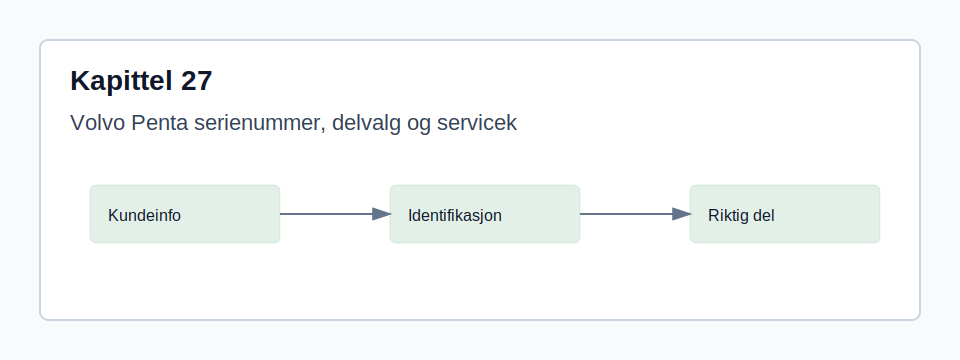

## Tekniske systemillustrasjoner

## Grundig forklaring
Hvordan kapitlets tema brukes i praktisk arbeid må forstås både teknisk og praktisk. I marine reservedeler er det sjelden nok å vite hva kunden kaller delen. Medarbeideren må forstå hvilken funksjon delen har, hvor den sitter, hvilken motorvariant den tilhører, og hva som skjer dersom feil del bestilles. Derfor skal tekniske data, kundens beskrivelse og dokumentert katalogoppslag alltid vurderes sammen.

En god sak har fire kjennetegn: den har tydelig identifikasjon, tydelig problem- eller delbeskrivelse, tydelig beslutningsgrunnlag og tydelig oppfølging. Dersom ett av disse punktene mangler, skal saken markeres som usikker før kunden får et bindende svar.

## Praktisk verkstedeksempel
Et verksted kontakter support fordi en Volvo Penta-motor skal klargjøres før avgang. De oppgir bare motormodell og et gammelt filter som eksempel. Riktig arbeidsmåte er å be om typeplate, bilde av eksisterende filter, driftstimer og om kunden ønsker enkeltfilter eller komplett servicekit. Når data er kontrollert, sendes et svar med korrekt delnummer, antall, leveringstid og forbehold om eventuelle erstatningsnummer.

## Kundesupporteksempel
Kunde: 'Jeg trenger en pumpe til Volvo Penta, helst i dag.' Profesjonelt svar: 'Jeg skal hjelpe deg raskt. For å unngå feil pumpe trenger jeg bilde av motorskiltet, bilde av pumpen montert og et nærbilde av eventuelt nummer på pumpen. Når jeg har dette, kontrollerer jeg riktig variant og gir deg lagerstatus og raskeste fraktalternativ.'

## Vanlige feil og årsaker
- feil impeller fordi sjøvannspumpevariant ikke ble kontrollert.
- eksoslekkasje rundt bend eller pakning.
- temperaturalarm etter service på kjølekrets.
- feil filtersett fordi motorvariant ble lest ufullstendig.

## Feilsøkingsflyt
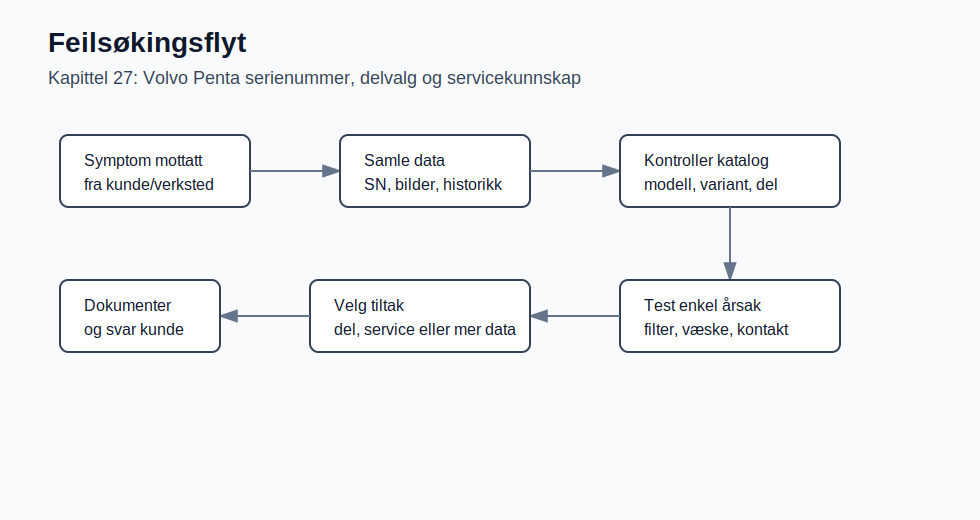

```mermaid
flowchart TD
    A[Symptom eller forespørsel mottatt] --> B[Samle serienummer, bilder og historikk]
    B --> C{Er motor og variant sikkert identifisert?}
    C -- Nei --> D[Be om mer dokumentasjon før del bekreftes]
    C -- Ja --> E[Kontroller delnummer og posisjon i katalog]
    E --> F{Stemmer symptom med foreslått del?}
    F -- Nei --> G[Foreslå feilsøking eller teknisk kontroll]
    F -- Ja --> H[Kontroller lager, pris og levering]
    H --> I[Send dokumentert kundesvar]
```

## Vedlikeholdsprosedyre
1. Avklar driftstimer, siste service og driftsmiljø.
2. Kontroller olje, filter, kjølevæske, sjøvannskrets, reimer, slanger og elektriske kontakter.
3. Sammenlign vedlikeholdsbehov med produsentens intervaller og faktisk bruk.
4. Anbefal servicekit når flere slitedeler bør skiftes samtidig.
5. Dokumenter hva som er anbefalt, hva kunden bestiller og eventuelle avvik fra normal prosedyre.

## Serienummeridentifikasjon
Volvo Penta identifiseres med modell, serienummer og ofte product number på motorskiltet. Kontroller også gear, drev eller installasjonstype når kunden spør om deler nær fremdriftslinjen.

Minimumsdata bør være: fabrikat, modell, serienummer, eventuell product number/arrangement/CPL/motornummer, bilde av typeplate og bilde av motorens installasjon. Ved tvil skal saken stoppes for avklaring før del bekreftes.

## Reservedelsidentifikasjon
Bruk product number, serienummer og sprengskisse for å skille mellom servicekit, impeller, belter, kjølere, eksosbend, sensorer og elektriske komponenter.

Sjekk alltid om delnummeret gjelder enkeltkomponent, reparasjonssett, servicekit eller komplett enhet. Kontroller også om varen er høyre/venstre, gammel/ny type, standard/oversize eller knyttet til en bestemt produksjonsperiode.

## Bestillingsprosedyre
1. Opprett eller oppdater sak med kunde, fartøy, kontaktperson og tidsfrist.
2. Verifiser motoridentifikasjon og lagre bildedokumentasjon.
3. Finn korrekt delnummer i relevant katalog eller leverandørgrunnlag.
4. Kontroller supersession, antall, lagerstatus, pris, returvilkår og leveringstid.
5. Send ordrebekreftelse med delnummer, beskrivelse, antall, pris, levering og forbehold.
6. Følg opp leveransen til kunden har mottatt varen eller saken er lukket.

## Kvalitetspunkter før svar
- Har vi nok data til å gi et sikkert svar?
- Er delnummeret kontrollert mot riktig motorvariant?
- Er kundens tidsfrist realistisk med valgt fraktmåte?
- Er eventuelle forbehold skrevet tydelig?
- Kan en kollega forstå beslutningen ved å lese saken senere?

## Kapittelsammendrag
Hovedpoenget i kapittel 27 er at profesjonelt reservedelsarbeid krever struktur. Teknisk kunnskap, engelske fagtermer, praktisk feilsøking, dokumentasjon og kundedialog må henge sammen. Når medarbeideren jobber systematisk, reduseres feilbestillinger, kunden får bedre svar, og verkstedet kan planlegge arbeidet tryggere.

## Kryssreferanser
- For forrige tema, se kapittel 26: Caterpillar identifikasjon, vanlige deler og typiske utfordringer.
- For neste tema, se kapittel 28: Mitsubishi motorvarianter og reservedelspraksis.
- For grunnleggende identifikasjon, se kapittel 12 og 17.

## Fordypning for intern opplæring
Dette kapitlet skal brukes som arbeidsstandard, ikke bare som lesestoff. Når en ny medarbeider møter en sak om Volvo Penta, skal vedkommende trene på å gå rolig fra fakta til vurdering og deretter til handling. I en marinemotorforhandler er konsekvensen av en feil ofte større enn verdien av selve delen. En feil impeller, feil sensor, feil filterinnsats eller feil pakningssett kan føre til tapt verkstedtid, utsatt avgang, irritert kunde og i verste fall ny driftsstans. Derfor skal hver sak behandles som en teknisk beslutning med sporbar dokumentasjon.

I produsentdialog skal medarbeideren bruke produsentens egne betegnelser når de finnes: Product Number, Engine Type, Serial Number, Drive Unit, Marine Gear. Dette gir bedre presisjon overfor leverandør, reduserer risiko for misforståelser og gjør saken lettere å kontrollere senere.

Profesjonelt nivå i dette kapitlet betyr at medarbeideren kan arbeide sikkert med Volvo Penta-identifikasjon. Før kunden får et bindende svar, skal opplysningene i saken kontrolleres mot motorens identitet, faktisk installasjon og relevant produsentterminologi. Det praktiske målet er ikke å finne et raskt nummer, men å kunne forklare hvorfor valgt del, kontrollpunkt eller kundesvar er riktig for akkurat denne motoren. Når informasjon mangler, skal medarbeideren beskrive hva som mangler, hvorfor det er nødvendig, og hvilket neste steg som bringer saken videre.

## Tekniske forklaringer
Teknisk forståelse i dette kapitlet skal bygges rundt Engine Type, Serial Number, Product Number, drive, marine gear, service kit og supersession. Medarbeideren må skille mellom synlig symptom, sannsynlig systemfeil og bestillbar komponent. En del kan se riktig ut på bilde, men likevel være feil dersom posisjon, variant, rating, kjøleroppsett, elektrisk plugg, monteringsside eller servicehistorikk ikke stemmer. Derfor skal teknisk vurdering alltid kobles til både funksjon og dokumentasjon: hva gjør komponenten, hvilket system påvirker den, og hvilken produsentkilde bekrefter at den passer.

I praksis betyr dette at tekniske data skal kobles til motorens faktiske installasjon. Marine motorer står ofte trangt, er utsatt for salt, vibrasjon, fukt og ujevnt belastningsmønster, og de kan være bygget om gjennom mange år. En motor kan ha original kjøler, ettermontert eksosbend, alternativ dynamo, endret filterbrakett eller annen sjøvannspumpe enn standard. Slike forhold gjør at delidentifikasjon må bygge på både produsentdata og synlig dokumentasjon fra motoren.

Produsentterminologi er en del av den tekniske forståelsen. Bruk uttrykk som Product Number, Engine Type, Serial Number, Drive Unit, Marine Gear, Exploded View når de er relevante. Ikke oversett dem på en måte som fjerner presisjon. Skriv for eksempel «Engine Serial Number (ESN)» første gang og deretter «ESN» i saken dersom produsenten bruker dette. Skriv «Arrangement Number» når CAT-data krever det, «Product Number» når Volvo Penta bruker det, «CPL» når Cummins-konfigurasjon må kontrolleres, og «Model Code» når Yanmar-identifikasjon bygger på modellkode. Dette gjør dialogen med internasjonale leverandører mer presis.

## Illustrasjonsforslag
- Oversiktsdiagram som viser hvor Volvo Penta passer inn i total arbeidsflyt fra kundeforespørsel til levert del.
- Nærbilde av typeplate/motorskilt med markering av serienummer, motornummer, modell og eventuell variantkode.
- Sprengskisse med markert posisjon, delnummer, antall per motor og mulige alternative versjoner.
- Feilsøkingsflyt med beslutningspunkter: mangler data, stemmer symptom, kreves mer teknisk kontroll, kan ordre bekreftes.
- Sammenligningsbilde av gammel og ny del der forskjell i tilkobling, side, lengde eller sensorplugg er markert.

## Virkelige verkstedseksempler
Eksempel 1: Et verksted står med en demontert komponent på benken og kunden venter på avklaring før fartøyet kan settes tilbake i drift. Verkstedet sender et nærbilde av delen, men ingen motorplate. En uerfaren medarbeider kan bli fristet til å søke på nummeret som står på støpegodset. En profesjonell medarbeider svarer at støpenummer ikke nødvendigvis er bestillbart delnummer, ber om bilde av typeplate, oversiktsbilde av motoren og bilde av monteringsstedet, og forklarer at dette hindrer feilbestilling. Når informasjonen kommer, kontrolleres delnummer mot sprengskisse, posisjon og antall. Først da gis pris og leveringstid.

Eksempel 2: En kunde ringer sent på dagen og sier at motoren har høy temperatur etter service. Kunden ønsker ny termostat. Medarbeideren skal ikke automatisk konkludere med termostatfeil. Spørsmålene bør avklare om impeller er byttet, om sjøvannsfilteret er rent, om kjølevæskenivået er riktig, om alarmen kommer ved tomgang eller belastning, og om det finnes lekkasje rundt varmeveksler eller slanger. Dersom kunden likevel vil bestille termostat, dokumenteres at feilsøking er anbefalt, og delnummer kontrolleres mot serienummer før ordre.

Eksempel 3: En intern selger mottar en gammel faktura med et delnummer som ikke lenger finnes. Riktig prosess er å kontrollere supersession, se om ny del krever tilhørende pakning, boltsett eller adapter, og notere både gammelt og nytt nummer i saken. Kunden skal få vite at delen er erstattet, hva som leveres, og om det finnes monteringsforbehold.

## Reservedelsidentifisering i praksis
Reservedelsidentifisering skal følge en fast rekkefølge. Først kontrolleres motorens identitet. Deretter kontrolleres delens system: drivstoff, luft, kjøling, smøring, eksos, elektrisk eller mekanisk kraftoverføring. Så kontrolleres posisjon i sprengskisse eller parts list. Til slutt kontrolleres antall, variant, supersession og leveringsstatus. Denne rekkefølgen hindrer at medarbeideren hopper direkte fra kundens ord til et tilfeldig delnummer.

Når en del har synlig nummer, må nummeret tolkes riktig. Mange komponenter har produksjonsnummer, støpenummer, leverandørnummer eller revisjonskode som ikke er det samme som bestillbart part number. Et filter kan ha nummer fra filterprodusent, men motorprodusentens parts catalogue kan bruke et annet nummer. En pumpe kan ha nummer på lokk, hus og komplett enhet. Spør derfor alltid: gjelder nummeret komplett del, reparasjonssett, underkomponent eller produsentens råkomponent?

## Serienummer og motornummer
Serienummer og motornummer er grunnlaget for korrekt katalogoppslag. Be kunden sende bilde av typeplate eller dataplate. Dersom kunden skriver nummeret manuelt, skal nummeret likevel kontrolleres mot bilde når det er mulig. Noter hele nummeret, inkludert prefiks, suffiks, bindestrek, mellomrom og eventuelle bokstaver. På enkelte produsenter kan små forskjeller peke til forskjellig produksjonsperiode, rating eller konfigurasjon.

Bruk motornummer sammen med modell, variant og applikasjon. En motor som driver generator kan ha andre deler enn en fremdriftsmotor. En motor i yrkesbåt kan ha annen rating enn samme motor i fritidsbåt. En eldre motor kan være bygget om med ny dynamo, annen sjøvannspumpe eller uoriginal filterbrakett. Dersom typeplate mangler, bygg identifikasjonen gjennom flere kilder: servicebok, tidligere faktura, bilder av motorens sider, nummer på pumpe, filter, turbo og gear, samt opplysninger om fartøy og produksjonsår.

## Feilsøking steg for steg
1. Definer symptomet med kundens egne ord og skriv det i saken. Skill mellom «kunden ønsker del» og «kunden beskriver feil».
2. Avklar når feilen oppstår: start, tomgang, belastning, marsjfart, varm motor, kald motor eller etter nylig service.
3. Kontroller grunnleggende forhold: væskenivå, filter, luft i drivstoff, sjøvannsstrøm, reimer, elektriske kontakter, sikringer og synlige lekkasjer.
4. Knytt symptomet til system: lav effekt peker ofte mot luft/drivstoff/eksos, høy temperatur mot kjøling, lavt oljetrykk mot smøring/sensor, startproblem mot batteri/starter/gløding/drivstoff.
5. Be om bilder eller måledata dersom symptomet ikke kan kobles sikkert til en del. Dette kan være bilde av alarmdisplay, trykkmåling, temperaturmåling eller bilde av montert komponent.
6. Kontroller relevant delnummer mot serienummer og variant. Dersom flere alternativer finnes, forklar kunden hva som skiller dem.
7. Dokumenter anbefalt tiltak, usikkerhet og eventuelle forbehold før ordre bekreftes.

## Vedlikehold
Vedlikehold skal vurderes mot driftstimer, produsentens maintenance schedule og faktisk driftsmiljø. Marine motorer som går korte turer, mye tomgang eller i salt miljø kan trenge hyppigere kontroll enn standard intervall antyder. Nye medarbeidere skal lære å spørre om siste service, hvilke filter som ble byttet, hvilken olje som ble brukt, om impeller er kontrollert, og om kjølevæske eller anoder er byttet etter plan.

En god vedlikeholdsanbefaling er konkret. I stedet for å skrive «ta service», bør medarbeideren foreslå relevante deler: olje- og drivstoffilter, luftfilter, impeller, reim, pakninger, anoder, kjølevæske og eventuelt servicekit. Dersom kunden har ukjent servicehistorikk, bør komplett servicekit vurderes. Dersom kunden har hatt overoppheting, bør sjøvannskrets og varmeveksler kontrolleres før bare én komponent byttes.

## Vanlige feil
- Serienummer leses feil fordi et tegn forveksles, for eksempel O/0 eller I/1.
- Kunden oppgir modellnavn, men ikke variant, rating eller applikasjon.
- Del velges ut fra bilde alene uten kontroll mot sprengskisse eller produsentkatalog.
- Supersession aksepteres uten å kontrollere om ny del krever tilbehør, pakning eller ombygging.
- Hastepress gjør at leveringsløfte gis før lagerstatus og fraktmulighet er bekreftet.
- Saksnotat mangler grunnlaget for beslutningen, slik at kollega ikke kan etterprøve valget.

## Kontrollspørsmål
- Hva er den viktigste tekniske risikoen i en sak som gjelder Volvo Penta?
- Hvilke opplysninger må dokumenteres før bindende delnummer bekreftes?
- Hvordan forklarer du kunden hvorfor bilde av typeplate er nødvendig?
- Når bør du stoppe en ordre og be om mer dokumentasjon?
- Hvilke engelske produsentuttrykk bør du kunne bruke i denne typen sak?
- Hvordan dokumenterer du at et delnummer er erstattet av et nytt nummer?

## Praktisk sjekkliste for medarbeider
- Les saken som om en kollega skal overta den i morgen.
- Kontroller at motoridentifikasjon er dokumentert med bilde eller sikker kilde.
- Sjekk at delnummeret er knyttet til riktig posisjon i katalogen.
- Skriv tydelig om kunden har bedt om enkeltkomponent, servicekit eller komplett enhet.
- Noter om varen er spesialbestilling, utgått, erstattet eller ikke returbar.
- Send kundesvar med neste steg, ikke bare et løst delnummer.

## Kapittelspesifikk systemforståelse
For dette kapitlet er kjernen å forstå Volvo Penta-identifikasjon med Engine Type, Serial Number og Product Number. Medarbeideren skal kunne forklare dette med praktiske ord til både kunde og kollega. Det betyr at teknisk teori må kobles til konkrete handlinger: hvilke data skal innhentes, hvilke komponenter kan være berørt, hvilken produsentterminologi skal brukes, og hva må dokumenteres før saken kan gå videre. Volvo Penta-delvalg krever ofte både motor- og drev-/gearopplysninger.

Når systemet vurderes, skal medarbeideren først plassere problemet i riktig teknisk sammenheng. Dersom kunden beskriver en alarm, må man finne ut om alarmen kommer fra reelt mekanisk avvik, elektrisk sensorfeil, feil etter service eller feil tolkning av instrumentet. Dersom kunden beskriver en del, må man avklare om kunden mener komplett enhet, servicekit, reparasjonssett eller enkeltkomponent. Dersom kunden beskriver motoren med vanlig navn, må man kontrollere om produsenten bruker mer presise begreper i katalogen.

## Komponentoversikt og arbeidsgrense
Relevante komponenter og opplysninger i dette kapitlet omfatter: motorskilt, product number, drive unit, marine gear, service protocol, impeller, heat exchanger og exhaust elbow. Listen er ikke ment som en erstatning for produsentens parts catalogue, men som en praktisk påminnelse om hva nye medarbeidere skal tenke på før de søker del. I interne saker skal komponentnavn skrives så presist som mulig. Bruk for eksempel «sjøvannspumpe / raw water pump» i stedet for bare «pumpe» når funksjonen er kjent, og «varmeveksler / heat exchanger» i stedet for bare «kjøler» når det er den komponenten saken gjelder.

Arbeidsgrensen for en reservedelsmedarbeider er også viktig. Medarbeideren skal ikke overta mekanikerens ansvar for demontering, måling eller diagnose på motoren, men skal kunne stille riktige spørsmål og foreslå riktig dokumentasjon. Når en sak går fra enkel delidentifikasjon til teknisk diagnose, skal dette markeres i saken. Da kan verksted, teknisk ansvarlig eller leverandør involveres med et klart spørsmål og et ryddig faktagrunnlag.

## Praktisk beslutningsregel
Bruk denne regelen i alle saker knyttet til kapitlet: Hvis motoridentifikasjon, komponentposisjon eller symptom ikke er sikkert nok dokumentert, skal medarbeideren ikke gi bindende delbekreftelse. Kunden kan få et foreløpig svar, men svaret må inneholde hva som mangler, hvorfor det mangler, og hva som skjer når informasjonen er mottatt. Dette er ikke treg service; det er profesjonell risikokontroll.

## Målrettet fordypning kapittel 21-30
### Volvo Penta: Engine Type, Product Number og drivlinje
Volvo Penta krever ofte at Engine Type, Serial Number og Product Number leses samlet. I tillegg kan drive unit, sterndrive, marine gear eller reverse gear være avgjørende for deler nær fremdrift, kjøling og eksos. En forespørsel om impeller, eksosbend, belter eller kjøleslange kan kreve både motor- og installasjonsdata.

I kundedialog bør medarbeideren bruke Volvo Penta-begreper som product number, engine type, serial number, drive og service kit. Ved serviceforespørsel skal innholdet i kit kontrolleres, fordi kunder ofte bruker «servicekit» om alt fra filtersats til full sesongservice med impeller og anoder. Ved overoppheting etter service må raw water flow, impeller cover, sjøvannsfilter, heat exchanger og exhaust elbow vurderes før én del bekreftes.

### Praktisk anvendelse i opplæring
Bruk kapitlet som caseøvelse der deltakeren skal skrive et kundesvar, identifisere nødvendige produsentdata og velge neste tekniske kontrollpunkt. Deltakeren skal også forklare hva som kan besvares av reservedelsavdelingen, og hva som må avklares av verksted, teknisk ansvarlig eller leverandør. Målet er at medarbeideren kan arbeide raskt, men fortsatt med sporbarhet og korrekt produsentterminologi.

## Realistisk opplæring i praksis
### Verkstedhistorie
En typisk sak i dette temaet starter med D4-kunde oppgir bare motortype. Verkstedet trenger et raskt svar, men den erfarne medarbeideren stopper opp og spør først: hva vet vi sikkert, hva antar vi, og hva kan gi følgeskade hvis vi tar feil? I praksis betyr det at Product Number, serial og drivlinje må kobles til bilde, serienummer, komponentposisjon og kundens symptom før saken lukkes. Historien skal brukes i opplæring som en øvelse i å skrive et kort saksnotat: observasjon, vurdering, neste handling og forbehold.

### Kundehistorie
Kunden beskriver ofte problemet med driftsspråk: «motoren går tungt», «alarm kommer etter ti minutter», «jeg trenger den samme delen som sist» eller «båten skal ut i morgen». En profesjonell respons er rolig og konkret: bekreft behovet, forklar hvorfor identifikasjon trengs, be om riktig dokumentasjon og gi et realistisk tidspunkt for neste svar. Ikke korriger kunden unødvendig; oversett kundens språk til teknisk språk i saken.

### Typiske feil nye ansatte gjør
- søker på første synlige nummer uten å avklare om det er støpenummer, leverandørnummer eller bestillbart part number.
- lover levering før lagerstatus, frakt og returvilkår er kontrollert.
- antar at tidligere faktura alltid gjelder samme motorvariant.
- blander symptom og årsak, spesielt ved varme, lav effekt, startproblem og alarm.
- skriver for korte notater slik at kollega ikke kan forstå hvorfor valget ble tatt.

### Tips fra erfarne mekanikere og reservedelsselgere
- Se alltid etter systemet rundt delen: slanger, braketter, sensorer, reimer, kjølere og tilkoblinger forteller ofte mer enn delen alene.
- Still ett presist spørsmål om gangen når kunden er stresset; mange dårlige svar kommer av for lange spørsmålslister.
- Sammenlign gammel og ny del mot funksjon, ikke bare form. Riktig del skal passe, men også løse riktig problem.
- En erfaren reservedelsselger tenker i risiko: Hva er billigst å avklare nå, og hva blir dyrt hvis vi hopper over det?

### Vanlige kundespørsmål
| Spørsmål fra kunde | Profesjonelt svar |
|---|---|
| «Kan du bare sende samme del som sist?» | «Ja, hvis vi først bekrefter at det gjelder samme motor, samme posisjon og ingen supersession siden sist.» |
| «Holder det med bilde?» | «Bilde hjelper, men vi trenger også motoridentitet for å sikre variant og delnummer.» |
| «Hvorfor tar dette tid?» | «Fordi feil del kan gi ny driftsstans. Vi kontrollerer grunnlaget før vi lover levering.» |

### Beslutningstre for saken
| Trinn | Spørsmål | Handling |
|---|---|---|
| 1 | Er motoridentitet dokumentert med bilde eller sikker historikk? | Hvis nei: be om typeplate/dataplate eller alternativ dokumentasjon. |
| 2 | Er komponentens funksjon og posisjon kjent? | Hvis nei: be om oversiktsbilde og bilde av monteringssted. |
| 3 | Stemmer kundens symptom med delen som ønskes? | Hvis nei: anbefal feilsøking før del bestilles. |
| 4 | Finnes det supersession, kit eller variantvalg? | Kontroller produsentkilde og skriv forbehold i saken. |
| 5 | Kan pris, levering og returvilkår bekreftes? | Send dokumentert svar med neste steg og tydelig gyldighet. |

### Rask oppslagstabell
| Situasjon | Kontroller først | Vanlig fallgruve |
|---|---|---|
| Hasteordre | sikker motor-ID, lager, fraktfrist | levering loves før teknisk kontroll |
| Del fra bilde | posisjon, skala, tilkoblinger, nummer | bilde brukes som eneste beslutningsgrunnlag |
| Gammelt delnummer | supersession og kitinnhold | ny del krever ekstra pakning eller adapter |
| Uklart symptom | driftssituasjon, alarm, siste service | symptom blir tolket som sikker komponentfeil |

### Praktisk sjekkliste og inspeksjonsrutine
- Start med motoridentitet: fabrikat, modell, serienummer, variant, applikasjon og bilde av skilt.
- Kontroller området rundt komponenten: lekkasje, korrosjon, knekte fester, slitasje, varmemerker og uoriginale endringer.
- Spør om siste vedlikehold: olje, filter, impeller, reimer, kjølevæske, anoder og drivstoffilter.
- Noter driftstype: fritidsbruk, yrkesbruk, generator, fremdrift, tomgangsdrift eller langvarig høy belastning.
- Avklar om saken gjelder akutt drift, planlagt service, reklamasjon eller lagerpåfyll.

### Generelle vedlikeholdsintervaller som opplæringspunkt
| Kontrollpunkt | Typisk vurdering i opplæring | Må verifiseres |
|---|---|---|
| Olje og oljefilter | ofte basert på timer og kalender | produsentens maintenance schedule |
| Drivstoffilter/vannutskiller | hyppigere ved dårlig drivstoff eller sesongstart | motor- og filterspesifikasjon |
| Impeller og sjøvannskrets | kontrolleres særlig før sesong og etter varmgang | produsentens intervall og installasjon |
| Reimer, slanger og klemmer | visuell kontroll ved service og feilsøking | dimensjon, stramming og delnummer |

### Produsentverifikasjon
Volvo Penta-dokumentasjon må kontrollere Engine Type, Serial Number, Product Number, drive/marine gear og servicekit før tilbud gis. Marker tydelig i saken når svaret bygger på antakelse, eldre historikk, bilde uten motor-ID eller generell erfaring. Intervaller i tabellen er generelle opplæringspunkter. Faktiske intervaller styres av produsent, motorvariant, driftstimer, kalenderkrav, belastning og miljø.

## Produsentverifikasjon og faglig forbehold
For Volvo Penta skal Engine Type, Serial Number, Product Number, drev eller marine gear, servicekit, tidligere supersession og eventuelle monteringsnotater kontrolleres i Volvo Penta-dokumentasjon før bestilling. Marker saken internt dersom opplysningen bygger på antakelse, eldre historikk eller bilde uten bekreftet motoridentitet.

## Quiz med fasit
1. Hvilke tekniske data bør alltid samles før en del bekreftes?
2. Hvorfor er engelsk terminologi viktig i marine reservedeler?
3. Hva bør gjøres dersom kunden bare sender et bilde av delen?
4. Hvilke punkter bør kontrolleres før ordrebekreftelse sendes?
5. Hvorfor skal feilsøking dokumenteres, selv når kunden allerede ber om en bestemt del?

### Svar
1. Fabrikat, modell, serienummer, variantdata, bilde av typeplate, delnummer, posisjon og kundens symptombeskrivelse.
2. Fordi kataloger, portaler, servicemanualer og leverandørdialog ofte bruker engelske begreper som må forstås presist.
3. Be om serienummer, oversiktsbilde av motoren og eventuelle nummer på delen; bildet brukes som støtte, ikke eneste grunnlag.
4. Delnummer, antall, variant, pris, lagerstatus, leveringstid, frakt, returvilkår og eventuelle forbehold.
5. Fordi symptomet kan ha flere årsaker, og dokumentasjon viser hvorfor anbefalingen ble gitt.

---

# Kapittel 28: Mitsubishi motorvarianter og reservedelspraksis

## Kapittelrolle
Mitsubishi krever systematisk identifikasjon fordi samme motorfamilie kan finnes i flere marine installasjoner, effektnivåer og produksjonsperioder. En profesjonell medarbeider skal ikke bare finne en del som ligner, men dokumentere hvorfor den valgte delen passer til akkurat denne motoren.

## Læringsmål
Etter kapitlet skal deltakeren kunne:
- forklare hovedbegrepene innen reservedelsarbeid
- bruke serienummer, modellinformasjon og delnummer i praktisk reservedelsarbeid
- kommunisere trygt med kunde, verksted, lager og leverandør
- dokumentere beslutninger slik at andre kan etterprøve saken
- kjenne igjen vanlige feil og velge riktig neste handling

## English technical terminology
- **Base Engine:** engelsk fagterm som ofte brukes i kataloger, servicelitteratur, leverandørportaler og internasjonal kundedialog.
- **Marine Conversion:** engelsk fagterm som ofte brukes i kataloger, servicelitteratur, leverandørportaler og internasjonal kundedialog.
- **Engine Code:** engelsk fagterm som ofte brukes i kataloger, servicelitteratur, leverandørportaler og internasjonal kundedialog.
- **Serial Number:** engelsk fagterm som ofte brukes i kataloger, servicelitteratur, leverandørportaler og internasjonal kundedialog.
- **Application:** engelsk fagterm som ofte brukes i kataloger, servicelitteratur, leverandørportaler og internasjonal kundedialog.
- **Part Number:** engelsk fagterm som ofte brukes i kataloger, servicelitteratur, leverandørportaler og internasjonal kundedialog.
- **Supersession:** engelsk fagterm som ofte brukes i kataloger, servicelitteratur, leverandørportaler og internasjonal kundedialog.
- **Service Kit:** engelsk fagterm som ofte brukes i kataloger, servicelitteratur, leverandørportaler og internasjonal kundedialog.
- **Troubleshooting:** engelsk fagterm som ofte brukes i kataloger, servicelitteratur, leverandørportaler og internasjonal kundedialog.

## Hoveddiagram

## Tekniske systemillustrasjoner

## Grundig forklaring
Hvordan kapitlets tema brukes i praktisk arbeid må forstås både teknisk og praktisk. I marine reservedeler er det sjelden nok å vite hva kunden kaller delen. Medarbeideren må forstå hvilken funksjon delen har, hvor den sitter, hvilken motorvariant den tilhører, og hva som skjer dersom feil del bestilles. Derfor skal tekniske data, kundens beskrivelse og dokumentert katalogoppslag alltid vurderes sammen.

En god sak har fire kjennetegn: den har tydelig identifikasjon, tydelig problem- eller delbeskrivelse, tydelig beslutningsgrunnlag og tydelig oppfølging. Dersom ett av disse punktene mangler, skal saken markeres som usikker før kunden får et bindende svar.

## Praktisk verkstedeksempel
Et verksted kontakter support fordi en Mitsubishi-motor skal klargjøres før avgang. De oppgir bare motormodell og et gammelt filter som eksempel. Riktig arbeidsmåte er å be om typeplate, bilde av eksisterende filter, driftstimer og om kunden ønsker enkeltfilter eller komplett servicekit. Når data er kontrollert, sendes et svar med korrekt delnummer, antall, leveringstid og forbehold om eventuelle erstatningsnummer.

## Kundesupporteksempel
Kunde: 'Jeg trenger en pumpe til Mitsubishi, helst i dag.' Profesjonelt svar: 'Jeg skal hjelpe deg raskt. For å unngå feil pumpe trenger jeg bilde av motorskiltet, bilde av pumpen montert og et nærbilde av eventuelt nummer på pumpen. Når jeg har dette, kontrollerer jeg riktig variant og gir deg lagerstatus og raskeste fraktalternativ.'

## Vanlige feil og årsaker
- kunde oppgir bare Mitsubishi-modell uten mariniseringsdata.
- feil sjøvannspumpe fordi motoren er konvertert av tredjepart.
- startproblem knyttet til gløding eller drivstofftilførsel.
- lekkasje i ettermontert kjølesystem.

## Feilsøkingsflyt

```mermaid
flowchart TD
    A[Symptom eller forespørsel mottatt] --> B[Samle serienummer, bilder og historikk]
    B --> C{Er motor og variant sikkert identifisert?}
    C -- Nei --> D[Be om mer dokumentasjon før del bekreftes]
    C -- Ja --> E[Kontroller delnummer og posisjon i katalog]
    E --> F{Stemmer symptom med foreslått del?}
    F -- Nei --> G[Foreslå feilsøking eller teknisk kontroll]
    F -- Ja --> H[Kontroller lager, pris og levering]
    H --> I[Send dokumentert kundesvar]
```

## Vedlikeholdsprosedyre
1. Avklar driftstimer, siste service og driftsmiljø.
2. Kontroller olje, filter, kjølevæske, sjøvannskrets, reimer, slanger og elektriske kontakter.
3. Sammenlign vedlikeholdsbehov med produsentens intervaller og faktisk bruk.
4. Anbefal servicekit når flere slitedeler bør skiftes samtidig.
5. Dokumenter hva som er anbefalt, hva kunden bestiller og eventuelle avvik fra normal prosedyre.

## Serienummeridentifikasjon
Mitsubishi kan være basismotor i flere marine løsninger. Identifiser motorkode og serienummer, men avklar også hvem som har marinisert motoren, fordi kjøling, eksos og pumper kan være levert av en annen aktør.

Minimumsdata bør være: fabrikat, modell, serienummer, eventuell product number/arrangement/CPL/motornummer, bilde av typeplate og bilde av motorens installasjon. Ved tvil skal saken stoppes for avklaring før del bekreftes.

## Reservedelsidentifikasjon
Delvalg må skille mellom Mitsubishi-basismotordeler og marine konverteringsdeler. Filtre, glødeplugger, dyser og interne motordeler følger ofte basismotor, mens sjøvannspumpe, eksos og varmeveksler kan være mariniseringsspesifikke.

Sjekk alltid om delnummeret gjelder enkeltkomponent, reparasjonssett, servicekit eller komplett enhet. Kontroller også om varen er høyre/venstre, gammel/ny type, standard/oversize eller knyttet til en bestemt produksjonsperiode.

## Bestillingsprosedyre
1. Opprett eller oppdater sak med kunde, fartøy, kontaktperson og tidsfrist.
2. Verifiser motoridentifikasjon og lagre bildedokumentasjon.
3. Finn korrekt delnummer i relevant katalog eller leverandørgrunnlag.
4. Kontroller supersession, antall, lagerstatus, pris, returvilkår og leveringstid.
5. Send ordrebekreftelse med delnummer, beskrivelse, antall, pris, levering og forbehold.
6. Følg opp leveransen til kunden har mottatt varen eller saken er lukket.

## Kvalitetspunkter før svar
- Har vi nok data til å gi et sikkert svar?
- Er delnummeret kontrollert mot riktig motorvariant?
- Er kundens tidsfrist realistisk med valgt fraktmåte?
- Er eventuelle forbehold skrevet tydelig?
- Kan en kollega forstå beslutningen ved å lese saken senere?

## Kapittelsammendrag
Hovedpoenget i kapittel 28 er at profesjonelt reservedelsarbeid krever struktur. Teknisk kunnskap, engelske fagtermer, praktisk feilsøking, dokumentasjon og kundedialog må henge sammen. Når medarbeideren jobber systematisk, reduseres feilbestillinger, kunden får bedre svar, og verkstedet kan planlegge arbeidet tryggere.

## Kryssreferanser
- For forrige tema, se kapittel 27: Volvo Penta serienummer, delvalg og servicekunnskap.
- For neste tema, se kapittel 29: Cummins identifikasjon og bestillingsveiledning.
- For grunnleggende identifikasjon, se kapittel 12 og 17.

## Fordypning for intern opplæring
Dette kapitlet skal brukes som arbeidsstandard, ikke bare som lesestoff. Når en ny medarbeider møter en sak om Mitsubishi, skal vedkommende trene på å gå rolig fra fakta til vurdering og deretter til handling. I en marinemotorforhandler er konsekvensen av en feil ofte større enn verdien av selve delen. En feil impeller, feil sensor, feil filterinnsats eller feil pakningssett kan føre til tapt verkstedtid, utsatt avgang, irritert kunde og i verste fall ny driftsstans. Derfor skal hver sak behandles som en teknisk beslutning med sporbar dokumentasjon.

I produsentdialog skal medarbeideren bruke produsentens egne betegnelser når de finnes: Base Engine, Engine Code, Serial Number, Marine Conversion, Application. Dette gir bedre presisjon overfor leverandør, reduserer risiko for misforståelser og gjør saken lettere å kontrollere senere.

Profesjonelt nivå i dette kapitlet betyr at medarbeideren kan arbeide sikkert med Mitsubishi-praksis. Før kunden får et bindende svar, skal opplysningene i saken kontrolleres mot motorens identitet, faktisk installasjon og relevant produsentterminologi. Det praktiske målet er ikke å finne et raskt nummer, men å kunne forklare hvorfor valgt del, kontrollpunkt eller kundesvar er riktig for akkurat denne motoren. Når informasjon mangler, skal medarbeideren beskrive hva som mangler, hvorfor det er nødvendig, og hvilket neste steg som bringer saken videre.

## Tekniske forklaringer
Teknisk forståelse i dette kapitlet skal bygges rundt engine model, serial number, mariniseringsleverandør, base engine og komponentleverandør. Medarbeideren må skille mellom synlig symptom, sannsynlig systemfeil og bestillbar komponent. En del kan se riktig ut på bilde, men likevel være feil dersom posisjon, variant, rating, kjøleroppsett, elektrisk plugg, monteringsside eller servicehistorikk ikke stemmer. Derfor skal teknisk vurdering alltid kobles til både funksjon og dokumentasjon: hva gjør komponenten, hvilket system påvirker den, og hvilken produsentkilde bekrefter at den passer.

I praksis betyr dette at tekniske data skal kobles til motorens faktiske installasjon. Marine motorer står ofte trangt, er utsatt for salt, vibrasjon, fukt og ujevnt belastningsmønster, og de kan være bygget om gjennom mange år. En motor kan ha original kjøler, ettermontert eksosbend, alternativ dynamo, endret filterbrakett eller annen sjøvannspumpe enn standard. Slike forhold gjør at delidentifikasjon må bygge på både produsentdata og synlig dokumentasjon fra motoren.

Produsentterminologi er en del av den tekniske forståelsen. Bruk uttrykk som Base Engine, Engine Code, Serial Number, Marine Conversion, Application, Parts List når de er relevante. Ikke oversett dem på en måte som fjerner presisjon. Skriv for eksempel «Engine Serial Number (ESN)» første gang og deretter «ESN» i saken dersom produsenten bruker dette. Skriv «Arrangement Number» når CAT-data krever det, «Product Number» når Volvo Penta bruker det, «CPL» når Cummins-konfigurasjon må kontrolleres, og «Model Code» når Yanmar-identifikasjon bygger på modellkode. Dette gjør dialogen med internasjonale leverandører mer presis.

## Illustrasjonsforslag
- Oversiktsdiagram som viser hvor Mitsubishi passer inn i total arbeidsflyt fra kundeforespørsel til levert del.
- Nærbilde av typeplate/motorskilt med markering av serienummer, motornummer, modell og eventuell variantkode.
- Sprengskisse med markert posisjon, delnummer, antall per motor og mulige alternative versjoner.
- Feilsøkingsflyt med beslutningspunkter: mangler data, stemmer symptom, kreves mer teknisk kontroll, kan ordre bekreftes.
- Sammenligningsbilde av gammel og ny del der forskjell i tilkobling, side, lengde eller sensorplugg er markert.

## Virkelige verkstedseksempler
Eksempel 1: Et verksted står med en demontert komponent på benken og kunden venter på avklaring før fartøyet kan settes tilbake i drift. Verkstedet sender et nærbilde av delen, men ingen motorplate. En uerfaren medarbeider kan bli fristet til å søke på nummeret som står på støpegodset. En profesjonell medarbeider svarer at støpenummer ikke nødvendigvis er bestillbart delnummer, ber om bilde av typeplate, oversiktsbilde av motoren og bilde av monteringsstedet, og forklarer at dette hindrer feilbestilling. Når informasjonen kommer, kontrolleres delnummer mot sprengskisse, posisjon og antall. Først da gis pris og leveringstid.

Eksempel 2: En kunde ringer sent på dagen og sier at motoren har høy temperatur etter service. Kunden ønsker ny termostat. Medarbeideren skal ikke automatisk konkludere med termostatfeil. Spørsmålene bør avklare om impeller er byttet, om sjøvannsfilteret er rent, om kjølevæskenivået er riktig, om alarmen kommer ved tomgang eller belastning, og om det finnes lekkasje rundt varmeveksler eller slanger. Dersom kunden likevel vil bestille termostat, dokumenteres at feilsøking er anbefalt, og delnummer kontrolleres mot serienummer før ordre.

Eksempel 3: En intern selger mottar en gammel faktura med et delnummer som ikke lenger finnes. Riktig prosess er å kontrollere supersession, se om ny del krever tilhørende pakning, boltsett eller adapter, og notere både gammelt og nytt nummer i saken. Kunden skal få vite at delen er erstattet, hva som leveres, og om det finnes monteringsforbehold.

## Reservedelsidentifisering i praksis
Reservedelsidentifisering skal følge en fast rekkefølge. Først kontrolleres motorens identitet. Deretter kontrolleres delens system: drivstoff, luft, kjøling, smøring, eksos, elektrisk eller mekanisk kraftoverføring. Så kontrolleres posisjon i sprengskisse eller parts list. Til slutt kontrolleres antall, variant, supersession og leveringsstatus. Denne rekkefølgen hindrer at medarbeideren hopper direkte fra kundens ord til et tilfeldig delnummer.

Når en del har synlig nummer, må nummeret tolkes riktig. Mange komponenter har produksjonsnummer, støpenummer, leverandørnummer eller revisjonskode som ikke er det samme som bestillbart part number. Et filter kan ha nummer fra filterprodusent, men motorprodusentens parts catalogue kan bruke et annet nummer. En pumpe kan ha nummer på lokk, hus og komplett enhet. Spør derfor alltid: gjelder nummeret komplett del, reparasjonssett, underkomponent eller produsentens råkomponent?

## Serienummer og motornummer
Serienummer og motornummer er grunnlaget for korrekt katalogoppslag. Be kunden sende bilde av typeplate eller dataplate. Dersom kunden skriver nummeret manuelt, skal nummeret likevel kontrolleres mot bilde når det er mulig. Noter hele nummeret, inkludert prefiks, suffiks, bindestrek, mellomrom og eventuelle bokstaver. På enkelte produsenter kan små forskjeller peke til forskjellig produksjonsperiode, rating eller konfigurasjon.

Bruk motornummer sammen med modell, variant og applikasjon. En motor som driver generator kan ha andre deler enn en fremdriftsmotor. En motor i yrkesbåt kan ha annen rating enn samme motor i fritidsbåt. En eldre motor kan være bygget om med ny dynamo, annen sjøvannspumpe eller uoriginal filterbrakett. Dersom typeplate mangler, bygg identifikasjonen gjennom flere kilder: servicebok, tidligere faktura, bilder av motorens sider, nummer på pumpe, filter, turbo og gear, samt opplysninger om fartøy og produksjonsår.

## Feilsøking steg for steg
1. Definer symptomet med kundens egne ord og skriv det i saken. Skill mellom «kunden ønsker del» og «kunden beskriver feil».
2. Avklar når feilen oppstår: start, tomgang, belastning, marsjfart, varm motor, kald motor eller etter nylig service.
3. Kontroller grunnleggende forhold: væskenivå, filter, luft i drivstoff, sjøvannsstrøm, reimer, elektriske kontakter, sikringer og synlige lekkasjer.
4. Knytt symptomet til system: lav effekt peker ofte mot luft/drivstoff/eksos, høy temperatur mot kjøling, lavt oljetrykk mot smøring/sensor, startproblem mot batteri/starter/gløding/drivstoff.
5. Be om bilder eller måledata dersom symptomet ikke kan kobles sikkert til en del. Dette kan være bilde av alarmdisplay, trykkmåling, temperaturmåling eller bilde av montert komponent.
6. Kontroller relevant delnummer mot serienummer og variant. Dersom flere alternativer finnes, forklar kunden hva som skiller dem.
7. Dokumenter anbefalt tiltak, usikkerhet og eventuelle forbehold før ordre bekreftes.

## Vedlikehold
Vedlikehold skal vurderes mot driftstimer, produsentens maintenance schedule og faktisk driftsmiljø. Marine motorer som går korte turer, mye tomgang eller i salt miljø kan trenge hyppigere kontroll enn standard intervall antyder. Nye medarbeidere skal lære å spørre om siste service, hvilke filter som ble byttet, hvilken olje som ble brukt, om impeller er kontrollert, og om kjølevæske eller anoder er byttet etter plan.

En god vedlikeholdsanbefaling er konkret. I stedet for å skrive «ta service», bør medarbeideren foreslå relevante deler: olje- og drivstoffilter, luftfilter, impeller, reim, pakninger, anoder, kjølevæske og eventuelt servicekit. Dersom kunden har ukjent servicehistorikk, bør komplett servicekit vurderes. Dersom kunden har hatt overoppheting, bør sjøvannskrets og varmeveksler kontrolleres før bare én komponent byttes.

## Vanlige feil
- Serienummer leses feil fordi et tegn forveksles, for eksempel O/0 eller I/1.
- Kunden oppgir modellnavn, men ikke variant, rating eller applikasjon.
- Del velges ut fra bilde alene uten kontroll mot sprengskisse eller produsentkatalog.
- Supersession aksepteres uten å kontrollere om ny del krever tilbehør, pakning eller ombygging.
- Hastepress gjør at leveringsløfte gis før lagerstatus og fraktmulighet er bekreftet.
- Saksnotat mangler grunnlaget for beslutningen, slik at kollega ikke kan etterprøve valget.

## Kontrollspørsmål
- Hva er den viktigste tekniske risikoen i en sak som gjelder Mitsubishi?
- Hvilke opplysninger må dokumenteres før bindende delnummer bekreftes?
- Hvordan forklarer du kunden hvorfor bilde av typeplate er nødvendig?
- Når bør du stoppe en ordre og be om mer dokumentasjon?
- Hvilke engelske produsentuttrykk bør du kunne bruke i denne typen sak?
- Hvordan dokumenterer du at et delnummer er erstattet av et nytt nummer?

## Praktisk sjekkliste for medarbeider
- Les saken som om en kollega skal overta den i morgen.
- Kontroller at motoridentifikasjon er dokumentert med bilde eller sikker kilde.
- Sjekk at delnummeret er knyttet til riktig posisjon i katalogen.
- Skriv tydelig om kunden har bedt om enkeltkomponent, servicekit eller komplett enhet.
- Noter om varen er spesialbestilling, utgått, erstattet eller ikke returbar.
- Send kundesvar med neste steg, ikke bare et løst delnummer.

## Kapittelspesifikk systemforståelse
For dette kapitlet er kjernen å forstå Mitsubishi som basismotor og mariniserte installasjoner. Medarbeideren skal kunne forklare dette med praktiske ord til både kunde og kollega. Det betyr at teknisk teori må kobles til konkrete handlinger: hvilke data skal innhentes, hvilke komponenter kan være berørt, hvilken produsentterminologi skal brukes, og hva må dokumenteres før saken kan gå videre. Skill alltid mellom Mitsubishi-basismotordeler og deler levert av mariniseringsleverandør.

Når systemet vurderes, skal medarbeideren først plassere problemet i riktig teknisk sammenheng. Dersom kunden beskriver en alarm, må man finne ut om alarmen kommer fra reelt mekanisk avvik, elektrisk sensorfeil, feil etter service eller feil tolkning av instrumentet. Dersom kunden beskriver en del, må man avklare om kunden mener komplett enhet, servicekit, reparasjonssett eller enkeltkomponent. Dersom kunden beskriver motoren med vanlig navn, må man kontrollere om produsenten bruker mer presise begreper i katalogen.

## Komponentoversikt og arbeidsgrense
Relevante komponenter og opplysninger i dette kapitlet omfatter: engine code, serial number, base engine, marine conversion, injection pump, glow plug, heat exchanger og raw water pump. Listen er ikke ment som en erstatning for produsentens parts catalogue, men som en praktisk påminnelse om hva nye medarbeidere skal tenke på før de søker del. I interne saker skal komponentnavn skrives så presist som mulig. Bruk for eksempel «sjøvannspumpe / raw water pump» i stedet for bare «pumpe» når funksjonen er kjent, og «varmeveksler / heat exchanger» i stedet for bare «kjøler» når det er den komponenten saken gjelder.

Arbeidsgrensen for en reservedelsmedarbeider er også viktig. Medarbeideren skal ikke overta mekanikerens ansvar for demontering, måling eller diagnose på motoren, men skal kunne stille riktige spørsmål og foreslå riktig dokumentasjon. Når en sak går fra enkel delidentifikasjon til teknisk diagnose, skal dette markeres i saken. Da kan verksted, teknisk ansvarlig eller leverandør involveres med et klart spørsmål og et ryddig faktagrunnlag.

## Praktisk beslutningsregel
Bruk denne regelen i alle saker knyttet til kapitlet: Hvis motoridentifikasjon, komponentposisjon eller symptom ikke er sikkert nok dokumentert, skal medarbeideren ikke gi bindende delbekreftelse. Kunden kan få et foreløpig svar, men svaret må inneholde hva som mangler, hvorfor det mangler, og hva som skjer når informasjonen er mottatt. Dette er ikke treg service; det er profesjonell risikokontroll.

## Målrettet fordypning kapittel 21-30
### Mitsubishi: basismotor og marine conversion
Mitsubishi-saker krever særlig oppmerksomhet fordi motoren ofte kan være basismotor i en mariniseringsløsning. Engine code og serial number identifiserer grunnmotoren, men raw water pump, heat exchanger, exhaust manifold, brackets og enkelte serviceoppsett kan være levert av mariniseringsleverandør. Spør derfor alltid om hvem som har levert marine conversion dersom saken gjelder kjøling, eksos eller installasjonsdeler.

Deler som glow plugs, enkelte gaskets, injectors og interne motorkomponenter kan ofte knyttes til basismotoren, mens sjøvannspumpe og varmeveksler ikke nødvendigvis følger Mitsubishi-katalogen. Ved verkstedcase med startproblem bør batteri, starter, glødesystem, fuel supply og luft i drivstoff vurderes. Ved feil del skal man kontrollere om gammel del er original Mitsubishi, mariniseringsdel eller ettermarkedskomponent.

### Praktisk anvendelse i opplæring
Bruk kapitlet som caseøvelse der deltakeren skal skrive et kundesvar, identifisere nødvendige produsentdata og velge neste tekniske kontrollpunkt. Deltakeren skal også forklare hva som kan besvares av reservedelsavdelingen, og hva som må avklares av verksted, teknisk ansvarlig eller leverandør. Målet er at medarbeideren kan arbeide raskt, men fortsatt med sporbarhet og korrekt produsentterminologi.

## Realistisk opplæring i praksis
### Verkstedhistorie
En typisk sak i dette temaet starter med base engine og mariniseringsdel blandes. Verkstedet trenger et raskt svar, men den erfarne medarbeideren stopper opp og spør først: hva vet vi sikkert, hva antar vi, og hva kan gi følgeskade hvis vi tar feil? I praksis betyr det at modell, serienummer og marinisering må kobles til bilde, serienummer, komponentposisjon og kundens symptom før saken lukkes. Historien skal brukes i opplæring som en øvelse i å skrive et kort saksnotat: observasjon, vurdering, neste handling og forbehold.

### Kundehistorie
Kunden beskriver ofte problemet med driftsspråk: «motoren går tungt», «alarm kommer etter ti minutter», «jeg trenger den samme delen som sist» eller «båten skal ut i morgen». En profesjonell respons er rolig og konkret: bekreft behovet, forklar hvorfor identifikasjon trengs, be om riktig dokumentasjon og gi et realistisk tidspunkt for neste svar. Ikke korriger kunden unødvendig; oversett kundens språk til teknisk språk i saken.

### Typiske feil nye ansatte gjør
- søker på første synlige nummer uten å avklare om det er støpenummer, leverandørnummer eller bestillbart part number.
- lover levering før lagerstatus, frakt og returvilkår er kontrollert.
- antar at tidligere faktura alltid gjelder samme motorvariant.
- blander symptom og årsak, spesielt ved varme, lav effekt, startproblem og alarm.
- skriver for korte notater slik at kollega ikke kan forstå hvorfor valget ble tatt.

### Tips fra erfarne mekanikere og reservedelsselgere
- Se alltid etter systemet rundt delen: slanger, braketter, sensorer, reimer, kjølere og tilkoblinger forteller ofte mer enn delen alene.
- Still ett presist spørsmål om gangen når kunden er stresset; mange dårlige svar kommer av for lange spørsmålslister.
- Sammenlign gammel og ny del mot funksjon, ikke bare form. Riktig del skal passe, men også løse riktig problem.
- En erfaren reservedelsselger tenker i risiko: Hva er billigst å avklare nå, og hva blir dyrt hvis vi hopper over det?

### Vanlige kundespørsmål
| Spørsmål fra kunde | Profesjonelt svar |
|---|---|
| «Kan du bare sende samme del som sist?» | «Ja, hvis vi først bekrefter at det gjelder samme motor, samme posisjon og ingen supersession siden sist.» |
| «Holder det med bilde?» | «Bilde hjelper, men vi trenger også motoridentitet for å sikre variant og delnummer.» |
| «Hvorfor tar dette tid?» | «Fordi feil del kan gi ny driftsstans. Vi kontrollerer grunnlaget før vi lover levering.» |

### Beslutningstre for saken
| Trinn | Spørsmål | Handling |
|---|---|---|
| 1 | Er motoridentitet dokumentert med bilde eller sikker historikk? | Hvis nei: be om typeplate/dataplate eller alternativ dokumentasjon. |
| 2 | Er komponentens funksjon og posisjon kjent? | Hvis nei: be om oversiktsbilde og bilde av monteringssted. |
| 3 | Stemmer kundens symptom med delen som ønskes? | Hvis nei: anbefal feilsøking før del bestilles. |
| 4 | Finnes det supersession, kit eller variantvalg? | Kontroller produsentkilde og skriv forbehold i saken. |
| 5 | Kan pris, levering og returvilkår bekreftes? | Send dokumentert svar med neste steg og tydelig gyldighet. |

### Rask oppslagstabell
| Situasjon | Kontroller først | Vanlig fallgruve |
|---|---|---|
| Hasteordre | sikker motor-ID, lager, fraktfrist | levering loves før teknisk kontroll |
| Del fra bilde | posisjon, skala, tilkoblinger, nummer | bilde brukes som eneste beslutningsgrunnlag |
| Gammelt delnummer | supersession og kitinnhold | ny del krever ekstra pakning eller adapter |
| Uklart symptom | driftssituasjon, alarm, siste service | symptom blir tolket som sikker komponentfeil |

### Praktisk sjekkliste og inspeksjonsrutine
- Start med motoridentitet: fabrikat, modell, serienummer, variant, applikasjon og bilde av skilt.
- Kontroller området rundt komponenten: lekkasje, korrosjon, knekte fester, slitasje, varmemerker og uoriginale endringer.
- Spør om siste vedlikehold: olje, filter, impeller, reimer, kjølevæske, anoder og drivstoffilter.
- Noter driftstype: fritidsbruk, yrkesbruk, generator, fremdrift, tomgangsdrift eller langvarig høy belastning.
- Avklar om saken gjelder akutt drift, planlagt service, reklamasjon eller lagerpåfyll.

### Generelle vedlikeholdsintervaller som opplæringspunkt
| Kontrollpunkt | Typisk vurdering i opplæring | Må verifiseres |
|---|---|---|
| Olje og oljefilter | ofte basert på timer og kalender | produsentens maintenance schedule |
| Drivstoffilter/vannutskiller | hyppigere ved dårlig drivstoff eller sesongstart | motor- og filterspesifikasjon |
| Impeller og sjøvannskrets | kontrolleres særlig før sesong og etter varmgang | produsentens intervall og installasjon |
| Reimer, slanger og klemmer | visuell kontroll ved service og feilsøking | dimensjon, stramming og delnummer |

### Produsentverifikasjon
Mitsubishi-data må kontrolleres mot både base engine og mariniseringsleverandør der dette er relevant. Marker tydelig i saken når svaret bygger på antakelse, eldre historikk, bilde uten motor-ID eller generell erfaring. Intervaller i tabellen er generelle opplæringspunkter. Faktiske intervaller styres av produsent, motorvariant, driftstimer, kalenderkrav, belastning og miljø.

## Produsentverifikasjon og faglig forbehold
For Mitsubishi skal engine model, serial number, mariniseringsleverandør, base engine-data og komponentleverandør kontrolleres mot relevant produsent- eller leverandørdokumentasjon. Ikke forutsett at industrimotor og marinemotor bruker samme del. Marker saken internt dersom opplysningen bygger på antakelse, eldre historikk eller bilde uten bekreftet motoridentitet.

## Quiz med fasit
1. Hvilke tekniske data bør alltid samles før en del bekreftes?
2. Hvorfor er engelsk terminologi viktig i marine reservedeler?
3. Hva bør gjøres dersom kunden bare sender et bilde av delen?
4. Hvilke punkter bør kontrolleres før ordrebekreftelse sendes?
5. Hvorfor skal feilsøking dokumenteres, selv når kunden allerede ber om en bestemt del?

### Svar
1. Fabrikat, modell, serienummer, variantdata, bilde av typeplate, delnummer, posisjon og kundens symptombeskrivelse.
2. Fordi kataloger, portaler, servicemanualer og leverandørdialog ofte bruker engelske begreper som må forstås presist.
3. Be om serienummer, oversiktsbilde av motoren og eventuelle nummer på delen; bildet brukes som støtte, ikke eneste grunnlag.
4. Delnummer, antall, variant, pris, lagerstatus, leveringstid, frakt, returvilkår og eventuelle forbehold.
5. Fordi symptomet kan ha flere årsaker, og dokumentasjon viser hvorfor anbefalingen ble gitt.

---

# Kapittel 29: Cummins identifikasjon og bestillingsveiledning

## Kapittelrolle
Cummins krever systematisk identifikasjon fordi samme motorfamilie kan finnes i flere marine installasjoner, effektnivåer og produksjonsperioder. En profesjonell medarbeider skal ikke bare finne en del som ligner, men dokumentere hvorfor den valgte delen passer til akkurat denne motoren.

## Læringsmål
Etter kapitlet skal deltakeren kunne:
- forklare hovedbegrepene innen reservedelsarbeid
- bruke serienummer, modellinformasjon og delnummer i praktisk reservedelsarbeid
- kommunisere trygt med kunde, verksted, lager og leverandør
- dokumentere beslutninger slik at andre kan etterprøve saken
- kjenne igjen vanlige feil og velge riktig neste handling

## English technical terminology
- **Engine Serial Number (ESN):** engelsk fagterm som ofte brukes i kataloger, servicelitteratur, leverandørportaler og internasjonal kundedialog.
- **CPL:** engelsk fagterm som ofte brukes i kataloger, servicelitteratur, leverandørportaler og internasjonal kundedialog.
- **Dataplate:** engelsk fagterm som ofte brukes i kataloger, servicelitteratur, leverandørportaler og internasjonal kundedialog.
- **Bill of Material:** engelsk fagterm som ofte brukes i kataloger, servicelitteratur, leverandørportaler og internasjonal kundedialog.
- **QuickServe:** engelsk fagterm som ofte brukes i kataloger, servicelitteratur, leverandørportaler og internasjonal kundedialog.
- **Part Number:** engelsk fagterm som ofte brukes i kataloger, servicelitteratur, leverandørportaler og internasjonal kundedialog.
- **Supersession:** engelsk fagterm som ofte brukes i kataloger, servicelitteratur, leverandørportaler og internasjonal kundedialog.
- **Service Kit:** engelsk fagterm som ofte brukes i kataloger, servicelitteratur, leverandørportaler og internasjonal kundedialog.
- **Troubleshooting:** engelsk fagterm som ofte brukes i kataloger, servicelitteratur, leverandørportaler og internasjonal kundedialog.

## Hoveddiagram

## Tekniske systemillustrasjoner

## Grundig forklaring
Hvordan kapitlets tema brukes i praktisk arbeid må forstås både teknisk og praktisk. I marine reservedeler er det sjelden nok å vite hva kunden kaller delen. Medarbeideren må forstå hvilken funksjon delen har, hvor den sitter, hvilken motorvariant den tilhører, og hva som skjer dersom feil del bestilles. Derfor skal tekniske data, kundens beskrivelse og dokumentert katalogoppslag alltid vurderes sammen.

En god sak har fire kjennetegn: den har tydelig identifikasjon, tydelig problem- eller delbeskrivelse, tydelig beslutningsgrunnlag og tydelig oppfølging. Dersom ett av disse punktene mangler, skal saken markeres som usikker før kunden får et bindende svar.

## Praktisk verkstedeksempel
Et verksted kontakter support fordi en Cummins-motor skal klargjøres før avgang. De oppgir bare motormodell og et gammelt filter som eksempel. Riktig arbeidsmåte er å be om typeplate, bilde av eksisterende filter, driftstimer og om kunden ønsker enkeltfilter eller komplett servicekit. Når data er kontrollert, sendes et svar med korrekt delnummer, antall, leveringstid og forbehold om eventuelle erstatningsnummer.

## Kundesupporteksempel
Kunde: 'Jeg trenger en pumpe til Cummins, helst i dag.' Profesjonelt svar: 'Jeg skal hjelpe deg raskt. For å unngå feil pumpe trenger jeg bilde av motorskiltet, bilde av pumpen montert og et nærbilde av eventuelt nummer på pumpen. Når jeg har dette, kontrollerer jeg riktig variant og gir deg lagerstatus og raskeste fraktalternativ.'

## Vanlige feil og årsaker
- feil injektorvariant fordi CPL ikke ble kontrollert.
- lavt drivstofftrykk fra filter, luft eller pumpe.
- sensoralarm etter montering av feil generasjon sensor.
- kjøleproblem i sjøvannskrets eller varmeveksler.

## Feilsøkingsflyt
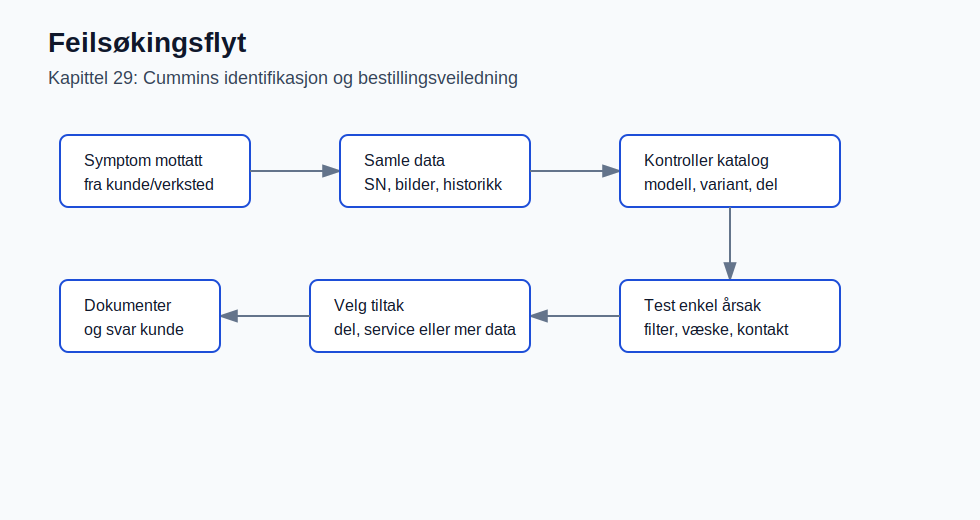

```mermaid
flowchart TD
    A[Symptom eller forespørsel mottatt] --> B[Samle serienummer, bilder og historikk]
    B --> C{Er motor og variant sikkert identifisert?}
    C -- Nei --> D[Be om mer dokumentasjon før del bekreftes]
    C -- Ja --> E[Kontroller delnummer og posisjon i katalog]
    E --> F{Stemmer symptom med foreslått del?}
    F -- Nei --> G[Foreslå feilsøking eller teknisk kontroll]
    F -- Ja --> H[Kontroller lager, pris og levering]
    H --> I[Send dokumentert kundesvar]
```

## Vedlikeholdsprosedyre
1. Avklar driftstimer, siste service og driftsmiljø.
2. Kontroller olje, filter, kjølevæske, sjøvannskrets, reimer, slanger og elektriske kontakter.
3. Sammenlign vedlikeholdsbehov med produsentens intervaller og faktisk bruk.
4. Anbefal servicekit når flere slitedeler bør skiftes samtidig.
5. Dokumenter hva som er anbefalt, hva kunden bestiller og eventuelle avvik fra normal prosedyre.

## Serienummeridentifikasjon
Cummins identifiseres primært med Engine Serial Number fra dataplate. CPL eller tilsvarende konfigurasjonsdata kan være nødvendig for å velge riktig injektor, turbo, pumpe eller elektronisk komponent.

Minimumsdata bør være: fabrikat, modell, serienummer, eventuell product number/arrangement/CPL/motornummer, bilde av typeplate og bilde av motorens installasjon. Ved tvil skal saken stoppes for avklaring før del bekreftes.

## Reservedelsidentifikasjon
Kontroller ESN, CPL, modell og applikasjon før delnummer bekreftes. Ved motordeler med flere revisjoner må supersession og kompatibilitet dokumenteres.

Sjekk alltid om delnummeret gjelder enkeltkomponent, reparasjonssett, servicekit eller komplett enhet. Kontroller også om varen er høyre/venstre, gammel/ny type, standard/oversize eller knyttet til en bestemt produksjonsperiode.

## Bestillingsprosedyre
1. Opprett eller oppdater sak med kunde, fartøy, kontaktperson og tidsfrist.
2. Verifiser motoridentifikasjon og lagre bildedokumentasjon.
3. Finn korrekt delnummer i relevant katalog eller leverandørgrunnlag.
4. Kontroller supersession, antall, lagerstatus, pris, returvilkår og leveringstid.
5. Send ordrebekreftelse med delnummer, beskrivelse, antall, pris, levering og forbehold.
6. Følg opp leveransen til kunden har mottatt varen eller saken er lukket.

## Kvalitetspunkter før svar
- Har vi nok data til å gi et sikkert svar?
- Er delnummeret kontrollert mot riktig motorvariant?
- Er kundens tidsfrist realistisk med valgt fraktmåte?
- Er eventuelle forbehold skrevet tydelig?
- Kan en kollega forstå beslutningen ved å lese saken senere?

## Kapittelsammendrag
Hovedpoenget i kapittel 29 er at profesjonelt reservedelsarbeid krever struktur. Teknisk kunnskap, engelske fagtermer, praktisk feilsøking, dokumentasjon og kundedialog må henge sammen. Når medarbeideren jobber systematisk, reduseres feilbestillinger, kunden får bedre svar, og verkstedet kan planlegge arbeidet tryggere.

## Kryssreferanser
- For forrige tema, se kapittel 28: Mitsubishi motorvarianter og reservedelspraksis.
- For neste tema, se kapittel 30: MAN motorfamilier og standardiserte løsninger.
- For grunnleggende identifikasjon, se kapittel 12 og 17.

## Fordypning for intern opplæring
Dette kapitlet skal brukes som arbeidsstandard, ikke bare som lesestoff. Når en ny medarbeider møter en sak om Cummins, skal vedkommende trene på å gå rolig fra fakta til vurdering og deretter til handling. I en marinemotorforhandler er konsekvensen av en feil ofte større enn verdien av selve delen. En feil impeller, feil sensor, feil filterinnsats eller feil pakningssett kan føre til tapt verkstedtid, utsatt avgang, irritert kunde og i verste fall ny driftsstans. Derfor skal hver sak behandles som en teknisk beslutning med sporbar dokumentasjon.

I produsentdialog skal medarbeideren bruke produsentens egne betegnelser når de finnes: Engine Serial Number (ESN), Dataplate, CPL, Control Parts List, QuickServe. Dette gir bedre presisjon overfor leverandør, reduserer risiko for misforståelser og gjør saken lettere å kontrollere senere.

Profesjonelt nivå i dette kapitlet betyr at medarbeideren kan arbeide sikkert med Cummins-identifikasjon. Før kunden får et bindende svar, skal opplysningene i saken kontrolleres mot motorens identitet, faktisk installasjon og relevant produsentterminologi. Det praktiske målet er ikke å finne et raskt nummer, men å kunne forklare hvorfor valgt del, kontrollpunkt eller kundesvar er riktig for akkurat denne motoren. Når informasjon mangler, skal medarbeideren beskrive hva som mangler, hvorfor det er nødvendig, og hvilket neste steg som bringer saken videre.

## Tekniske forklaringer
Teknisk forståelse i dette kapitlet skal bygges rundt Engine Serial Number, CPL, dataplate, QuickServe, Bill of Material og supersession. Medarbeideren må skille mellom synlig symptom, sannsynlig systemfeil og bestillbar komponent. En del kan se riktig ut på bilde, men likevel være feil dersom posisjon, variant, rating, kjøleroppsett, elektrisk plugg, monteringsside eller servicehistorikk ikke stemmer. Derfor skal teknisk vurdering alltid kobles til både funksjon og dokumentasjon: hva gjør komponenten, hvilket system påvirker den, og hvilken produsentkilde bekrefter at den passer.

I praksis betyr dette at tekniske data skal kobles til motorens faktiske installasjon. Marine motorer står ofte trangt, er utsatt for salt, vibrasjon, fukt og ujevnt belastningsmønster, og de kan være bygget om gjennom mange år. En motor kan ha original kjøler, ettermontert eksosbend, alternativ dynamo, endret filterbrakett eller annen sjøvannspumpe enn standard. Slike forhold gjør at delidentifikasjon må bygge på både produsentdata og synlig dokumentasjon fra motoren.

Produsentterminologi er en del av den tekniske forståelsen. Bruk uttrykk som Engine Serial Number (ESN), Dataplate, CPL, Control Parts List, QuickServe, Bill of Material når de er relevante. Ikke oversett dem på en måte som fjerner presisjon. Skriv for eksempel «Engine Serial Number (ESN)» første gang og deretter «ESN» i saken dersom produsenten bruker dette. Skriv «Arrangement Number» når CAT-data krever det, «Product Number» når Volvo Penta bruker det, «CPL» når Cummins-konfigurasjon må kontrolleres, og «Model Code» når Yanmar-identifikasjon bygger på modellkode. Dette gjør dialogen med internasjonale leverandører mer presis.

## Illustrasjonsforslag
- Oversiktsdiagram som viser hvor Cummins passer inn i total arbeidsflyt fra kundeforespørsel til levert del.
- Nærbilde av typeplate/motorskilt med markering av serienummer, motornummer, modell og eventuell variantkode.
- Sprengskisse med markert posisjon, delnummer, antall per motor og mulige alternative versjoner.
- Feilsøkingsflyt med beslutningspunkter: mangler data, stemmer symptom, kreves mer teknisk kontroll, kan ordre bekreftes.
- Sammenligningsbilde av gammel og ny del der forskjell i tilkobling, side, lengde eller sensorplugg er markert.

## Virkelige verkstedseksempler
Eksempel 1: Et verksted står med en demontert komponent på benken og kunden venter på avklaring før fartøyet kan settes tilbake i drift. Verkstedet sender et nærbilde av delen, men ingen motorplate. En uerfaren medarbeider kan bli fristet til å søke på nummeret som står på støpegodset. En profesjonell medarbeider svarer at støpenummer ikke nødvendigvis er bestillbart delnummer, ber om bilde av typeplate, oversiktsbilde av motoren og bilde av monteringsstedet, og forklarer at dette hindrer feilbestilling. Når informasjonen kommer, kontrolleres delnummer mot sprengskisse, posisjon og antall. Først da gis pris og leveringstid.

Eksempel 2: En kunde ringer sent på dagen og sier at motoren har høy temperatur etter service. Kunden ønsker ny termostat. Medarbeideren skal ikke automatisk konkludere med termostatfeil. Spørsmålene bør avklare om impeller er byttet, om sjøvannsfilteret er rent, om kjølevæskenivået er riktig, om alarmen kommer ved tomgang eller belastning, og om det finnes lekkasje rundt varmeveksler eller slanger. Dersom kunden likevel vil bestille termostat, dokumenteres at feilsøking er anbefalt, og delnummer kontrolleres mot serienummer før ordre.

Eksempel 3: En intern selger mottar en gammel faktura med et delnummer som ikke lenger finnes. Riktig prosess er å kontrollere supersession, se om ny del krever tilhørende pakning, boltsett eller adapter, og notere både gammelt og nytt nummer i saken. Kunden skal få vite at delen er erstattet, hva som leveres, og om det finnes monteringsforbehold.

## Reservedelsidentifisering i praksis
Reservedelsidentifisering skal følge en fast rekkefølge. Først kontrolleres motorens identitet. Deretter kontrolleres delens system: drivstoff, luft, kjøling, smøring, eksos, elektrisk eller mekanisk kraftoverføring. Så kontrolleres posisjon i sprengskisse eller parts list. Til slutt kontrolleres antall, variant, supersession og leveringsstatus. Denne rekkefølgen hindrer at medarbeideren hopper direkte fra kundens ord til et tilfeldig delnummer.

Når en del har synlig nummer, må nummeret tolkes riktig. Mange komponenter har produksjonsnummer, støpenummer, leverandørnummer eller revisjonskode som ikke er det samme som bestillbart part number. Et filter kan ha nummer fra filterprodusent, men motorprodusentens parts catalogue kan bruke et annet nummer. En pumpe kan ha nummer på lokk, hus og komplett enhet. Spør derfor alltid: gjelder nummeret komplett del, reparasjonssett, underkomponent eller produsentens råkomponent?

## Serienummer og motornummer
Serienummer og motornummer er grunnlaget for korrekt katalogoppslag. Be kunden sende bilde av typeplate eller dataplate. Dersom kunden skriver nummeret manuelt, skal nummeret likevel kontrolleres mot bilde når det er mulig. Noter hele nummeret, inkludert prefiks, suffiks, bindestrek, mellomrom og eventuelle bokstaver. På enkelte produsenter kan små forskjeller peke til forskjellig produksjonsperiode, rating eller konfigurasjon.

Bruk motornummer sammen med modell, variant og applikasjon. En motor som driver generator kan ha andre deler enn en fremdriftsmotor. En motor i yrkesbåt kan ha annen rating enn samme motor i fritidsbåt. En eldre motor kan være bygget om med ny dynamo, annen sjøvannspumpe eller uoriginal filterbrakett. Dersom typeplate mangler, bygg identifikasjonen gjennom flere kilder: servicebok, tidligere faktura, bilder av motorens sider, nummer på pumpe, filter, turbo og gear, samt opplysninger om fartøy og produksjonsår.

## Feilsøking steg for steg
1. Definer symptomet med kundens egne ord og skriv det i saken. Skill mellom «kunden ønsker del» og «kunden beskriver feil».
2. Avklar når feilen oppstår: start, tomgang, belastning, marsjfart, varm motor, kald motor eller etter nylig service.
3. Kontroller grunnleggende forhold: væskenivå, filter, luft i drivstoff, sjøvannsstrøm, reimer, elektriske kontakter, sikringer og synlige lekkasjer.
4. Knytt symptomet til system: lav effekt peker ofte mot luft/drivstoff/eksos, høy temperatur mot kjøling, lavt oljetrykk mot smøring/sensor, startproblem mot batteri/starter/gløding/drivstoff.
5. Be om bilder eller måledata dersom symptomet ikke kan kobles sikkert til en del. Dette kan være bilde av alarmdisplay, trykkmåling, temperaturmåling eller bilde av montert komponent.
6. Kontroller relevant delnummer mot serienummer og variant. Dersom flere alternativer finnes, forklar kunden hva som skiller dem.
7. Dokumenter anbefalt tiltak, usikkerhet og eventuelle forbehold før ordre bekreftes.

## Vedlikehold
Vedlikehold skal vurderes mot driftstimer, produsentens maintenance schedule og faktisk driftsmiljø. Marine motorer som går korte turer, mye tomgang eller i salt miljø kan trenge hyppigere kontroll enn standard intervall antyder. Nye medarbeidere skal lære å spørre om siste service, hvilke filter som ble byttet, hvilken olje som ble brukt, om impeller er kontrollert, og om kjølevæske eller anoder er byttet etter plan.

En god vedlikeholdsanbefaling er konkret. I stedet for å skrive «ta service», bør medarbeideren foreslå relevante deler: olje- og drivstoffilter, luftfilter, impeller, reim, pakninger, anoder, kjølevæske og eventuelt servicekit. Dersom kunden har ukjent servicehistorikk, bør komplett servicekit vurderes. Dersom kunden har hatt overoppheting, bør sjøvannskrets og varmeveksler kontrolleres før bare én komponent byttes.

## Vanlige feil
- Serienummer leses feil fordi et tegn forveksles, for eksempel O/0 eller I/1.
- Kunden oppgir modellnavn, men ikke variant, rating eller applikasjon.
- Del velges ut fra bilde alene uten kontroll mot sprengskisse eller produsentkatalog.
- Supersession aksepteres uten å kontrollere om ny del krever tilbehør, pakning eller ombygging.
- Hastepress gjør at leveringsløfte gis før lagerstatus og fraktmulighet er bekreftet.
- Saksnotat mangler grunnlaget for beslutningen, slik at kollega ikke kan etterprøve valget.

## Kontrollspørsmål
- Hva er den viktigste tekniske risikoen i en sak som gjelder Cummins?
- Hvilke opplysninger må dokumenteres før bindende delnummer bekreftes?
- Hvordan forklarer du kunden hvorfor bilde av typeplate er nødvendig?
- Når bør du stoppe en ordre og be om mer dokumentasjon?
- Hvilke engelske produsentuttrykk bør du kunne bruke i denne typen sak?
- Hvordan dokumenterer du at et delnummer er erstattet av et nytt nummer?

## Praktisk sjekkliste for medarbeider
- Les saken som om en kollega skal overta den i morgen.
- Kontroller at motoridentifikasjon er dokumentert med bilde eller sikker kilde.
- Sjekk at delnummeret er knyttet til riktig posisjon i katalogen.
- Skriv tydelig om kunden har bedt om enkeltkomponent, servicekit eller komplett enhet.
- Noter om varen er spesialbestilling, utgått, erstattet eller ikke returbar.
- Send kundesvar med neste steg, ikke bare et løst delnummer.

## Kapittelspesifikk systemforståelse
For dette kapitlet er kjernen å forstå Cummins-identifikasjon med ESN, dataplate og CPL. Medarbeideren skal kunne forklare dette med praktiske ord til både kunde og kollega. Det betyr at teknisk teori må kobles til konkrete handlinger: hvilke data skal innhentes, hvilke komponenter kan være berørt, hvilken produsentterminologi skal brukes, og hva må dokumenteres før saken kan gå videre. Cummins-saker skal kontrollere CPL når komponenten kan være konfigurasjonsstyrt.

Når systemet vurderes, skal medarbeideren først plassere problemet i riktig teknisk sammenheng. Dersom kunden beskriver en alarm, må man finne ut om alarmen kommer fra reelt mekanisk avvik, elektrisk sensorfeil, feil etter service eller feil tolkning av instrumentet. Dersom kunden beskriver en del, må man avklare om kunden mener komplett enhet, servicekit, reparasjonssett eller enkeltkomponent. Dersom kunden beskriver motoren med vanlig navn, må man kontrollere om produsenten bruker mer presise begreper i katalogen.

## Komponentoversikt og arbeidsgrense
Relevante komponenter og opplysninger i dette kapitlet omfatter: Engine Serial Number, dataplate, CPL, QuickServe, Bill of Material, fuel pump, injector, turbo og sensor. Listen er ikke ment som en erstatning for produsentens parts catalogue, men som en praktisk påminnelse om hva nye medarbeidere skal tenke på før de søker del. I interne saker skal komponentnavn skrives så presist som mulig. Bruk for eksempel «sjøvannspumpe / raw water pump» i stedet for bare «pumpe» når funksjonen er kjent, og «varmeveksler / heat exchanger» i stedet for bare «kjøler» når det er den komponenten saken gjelder.

Arbeidsgrensen for en reservedelsmedarbeider er også viktig. Medarbeideren skal ikke overta mekanikerens ansvar for demontering, måling eller diagnose på motoren, men skal kunne stille riktige spørsmål og foreslå riktig dokumentasjon. Når en sak går fra enkel delidentifikasjon til teknisk diagnose, skal dette markeres i saken. Da kan verksted, teknisk ansvarlig eller leverandør involveres med et klart spørsmål og et ryddig faktagrunnlag.

## Praktisk beslutningsregel
Bruk denne regelen i alle saker knyttet til kapitlet: Hvis motoridentifikasjon, komponentposisjon eller symptom ikke er sikkert nok dokumentert, skal medarbeideren ikke gi bindende delbekreftelse. Kunden kan få et foreløpig svar, men svaret må inneholde hva som mangler, hvorfor det mangler, og hva som skjer når informasjonen er mottatt. Dette er ikke treg service; det er profesjonell risikokontroll.

## Målrettet fordypning kapittel 21-30
### Cummins: ESN, dataplate og CPL
For Cummins er Engine Serial Number (ESN) hovednøkkelen. Dataplate skal fotograferes, og CPL eller annen konfigurasjonsinformasjon skal kontrolleres når komponenten kan variere med motorkonfigurasjon. Dette gjelder særlig injectors, turbocharger, fuel pump, ECM-relaterte komponenter, sensors og enkelte cooling parts. QuickServe eller tilsvarende kilde bør brukes der tilgjengelig.

Ved Cummins-feilsøking skal support skille mellom elektrisk alarm, fuel supply issue, air handling problem og mechanical fault. Lav effekt kan skyldes tette fuel filters, luft i drivstoff, boost leak, turboavvik eller sensorinput. Når kunde oppgir et gammelt part number, må supersession dokumenteres, og det må kontrolleres om nytt nummer krever tilleggsdeler. ESN bør alltid stå i tilbud og ordregrunnlag.

### Praktisk anvendelse i opplæring
Bruk kapitlet som caseøvelse der deltakeren skal skrive et kundesvar, identifisere nødvendige produsentdata og velge neste tekniske kontrollpunkt. Deltakeren skal også forklare hva som kan besvares av reservedelsavdelingen, og hva som må avklares av verksted, teknisk ansvarlig eller leverandør. Målet er at medarbeideren kan arbeide raskt, men fortsatt med sporbarhet og korrekt produsentterminologi.

## Realistisk opplæring i praksis
### Verkstedhistorie
En typisk sak i dette temaet starter med CPL mangler i forespørselen. Verkstedet trenger et raskt svar, men den erfarne medarbeideren stopper opp og spør først: hva vet vi sikkert, hva antar vi, og hva kan gi følgeskade hvis vi tar feil? I praksis betyr det at ESN, CPL og QuickServe/BOM må kobles til bilde, serienummer, komponentposisjon og kundens symptom før saken lukkes. Historien skal brukes i opplæring som en øvelse i å skrive et kort saksnotat: observasjon, vurdering, neste handling og forbehold.

### Kundehistorie
Kunden beskriver ofte problemet med driftsspråk: «motoren går tungt», «alarm kommer etter ti minutter», «jeg trenger den samme delen som sist» eller «båten skal ut i morgen». En profesjonell respons er rolig og konkret: bekreft behovet, forklar hvorfor identifikasjon trengs, be om riktig dokumentasjon og gi et realistisk tidspunkt for neste svar. Ikke korriger kunden unødvendig; oversett kundens språk til teknisk språk i saken.

### Typiske feil nye ansatte gjør
- søker på første synlige nummer uten å avklare om det er støpenummer, leverandørnummer eller bestillbart part number.
- lover levering før lagerstatus, frakt og returvilkår er kontrollert.
- antar at tidligere faktura alltid gjelder samme motorvariant.
- blander symptom og årsak, spesielt ved varme, lav effekt, startproblem og alarm.
- skriver for korte notater slik at kollega ikke kan forstå hvorfor valget ble tatt.

### Tips fra erfarne mekanikere og reservedelsselgere
- Se alltid etter systemet rundt delen: slanger, braketter, sensorer, reimer, kjølere og tilkoblinger forteller ofte mer enn delen alene.
- Still ett presist spørsmål om gangen når kunden er stresset; mange dårlige svar kommer av for lange spørsmålslister.
- Sammenlign gammel og ny del mot funksjon, ikke bare form. Riktig del skal passe, men også løse riktig problem.
- En erfaren reservedelsselger tenker i risiko: Hva er billigst å avklare nå, og hva blir dyrt hvis vi hopper over det?

### Vanlige kundespørsmål
| Spørsmål fra kunde | Profesjonelt svar |
|---|---|
| «Kan du bare sende samme del som sist?» | «Ja, hvis vi først bekrefter at det gjelder samme motor, samme posisjon og ingen supersession siden sist.» |
| «Holder det med bilde?» | «Bilde hjelper, men vi trenger også motoridentitet for å sikre variant og delnummer.» |
| «Hvorfor tar dette tid?» | «Fordi feil del kan gi ny driftsstans. Vi kontrollerer grunnlaget før vi lover levering.» |

### Beslutningstre for saken
| Trinn | Spørsmål | Handling |
|---|---|---|
| 1 | Er motoridentitet dokumentert med bilde eller sikker historikk? | Hvis nei: be om typeplate/dataplate eller alternativ dokumentasjon. |
| 2 | Er komponentens funksjon og posisjon kjent? | Hvis nei: be om oversiktsbilde og bilde av monteringssted. |
| 3 | Stemmer kundens symptom med delen som ønskes? | Hvis nei: anbefal feilsøking før del bestilles. |
| 4 | Finnes det supersession, kit eller variantvalg? | Kontroller produsentkilde og skriv forbehold i saken. |
| 5 | Kan pris, levering og returvilkår bekreftes? | Send dokumentert svar med neste steg og tydelig gyldighet. |

### Rask oppslagstabell
| Situasjon | Kontroller først | Vanlig fallgruve |
|---|---|---|
| Hasteordre | sikker motor-ID, lager, fraktfrist | levering loves før teknisk kontroll |
| Del fra bilde | posisjon, skala, tilkoblinger, nummer | bilde brukes som eneste beslutningsgrunnlag |
| Gammelt delnummer | supersession og kitinnhold | ny del krever ekstra pakning eller adapter |
| Uklart symptom | driftssituasjon, alarm, siste service | symptom blir tolket som sikker komponentfeil |

### Praktisk sjekkliste og inspeksjonsrutine
- Start med motoridentitet: fabrikat, modell, serienummer, variant, applikasjon og bilde av skilt.
- Kontroller området rundt komponenten: lekkasje, korrosjon, knekte fester, slitasje, varmemerker og uoriginale endringer.
- Spør om siste vedlikehold: olje, filter, impeller, reimer, kjølevæske, anoder og drivstoffilter.
- Noter driftstype: fritidsbruk, yrkesbruk, generator, fremdrift, tomgangsdrift eller langvarig høy belastning.
- Avklar om saken gjelder akutt drift, planlagt service, reklamasjon eller lagerpåfyll.

### Generelle vedlikeholdsintervaller som opplæringspunkt
| Kontrollpunkt | Typisk vurdering i opplæring | Må verifiseres |
|---|---|---|
| Olje og oljefilter | ofte basert på timer og kalender | produsentens maintenance schedule |
| Drivstoffilter/vannutskiller | hyppigere ved dårlig drivstoff eller sesongstart | motor- og filterspesifikasjon |
| Impeller og sjøvannskrets | kontrolleres særlig før sesong og etter varmgang | produsentens intervall og installasjon |
| Reimer, slanger og klemmer | visuell kontroll ved service og feilsøking | dimensjon, stramming og delnummer |

### Produsentverifikasjon
Cummins QuickServe/BOM, ESN og CPL må kontrolleres før injektorer, pumper, elektronikk eller kit bekreftes. Marker tydelig i saken når svaret bygger på antakelse, eldre historikk, bilde uten motor-ID eller generell erfaring. Intervaller i tabellen er generelle opplæringspunkter. Faktiske intervaller styres av produsent, motorvariant, driftstimer, kalenderkrav, belastning og miljø.

## Produsentverifikasjon og faglig forbehold
For Cummins skal Engine Serial Number, CPL, dataplate, QuickServe-/BOM-data, rating, supersession og service bulletins kontrolleres i offisiell kilde før pris, levering eller teknisk anbefaling gis. Marker saken internt dersom opplysningen bygger på antakelse, eldre historikk eller bilde uten bekreftet motoridentitet.

## Quiz med fasit
1. Hvilke tekniske data bør alltid samles før en del bekreftes?
2. Hvorfor er engelsk terminologi viktig i marine reservedeler?
3. Hva bør gjøres dersom kunden bare sender et bilde av delen?
4. Hvilke punkter bør kontrolleres før ordrebekreftelse sendes?
5. Hvorfor skal feilsøking dokumenteres, selv når kunden allerede ber om en bestemt del?

### Svar
1. Fabrikat, modell, serienummer, variantdata, bilde av typeplate, delnummer, posisjon og kundens symptombeskrivelse.
2. Fordi kataloger, portaler, servicemanualer og leverandørdialog ofte bruker engelske begreper som må forstås presist.
3. Be om serienummer, oversiktsbilde av motoren og eventuelle nummer på delen; bildet brukes som støtte, ikke eneste grunnlag.
4. Delnummer, antall, variant, pris, lagerstatus, leveringstid, frakt, returvilkår og eventuelle forbehold.
5. Fordi symptomet kan ha flere årsaker, og dokumentasjon viser hvorfor anbefalingen ble gitt.

---

# Kapittel 30: MAN motorfamilier og standardiserte løsninger

## Kapittelrolle
MAN krever systematisk identifikasjon fordi samme motorfamilie kan finnes i flere marine installasjoner, effektnivåer og produksjonsperioder. En profesjonell medarbeider skal ikke bare finne en del som ligner, men dokumentere hvorfor den valgte delen passer til akkurat denne motoren.

## Læringsmål
Etter kapitlet skal deltakeren kunne:
- forklare hovedbegrepene innen reservedelsarbeid
- bruke serienummer, modellinformasjon og delnummer i praktisk reservedelsarbeid
- kommunisere trygt med kunde, verksted, lager og leverandør
- dokumentere beslutninger slik at andre kan etterprøve saken
- kjenne igjen vanlige feil og velge riktig neste handling

## English technical terminology
- **Engine Type:** engelsk fagterm som ofte brukes i kataloger, servicelitteratur, leverandørportaler og internasjonal kundedialog.
- **Engine Number:** engelsk fagterm som ofte brukes i kataloger, servicelitteratur, leverandørportaler og internasjonal kundedialog.
- **Rating:** engelsk fagterm som ofte brukes i kataloger, servicelitteratur, leverandørportaler og internasjonal kundedialog.
- **Service Kit:** engelsk fagterm som ofte brukes i kataloger, servicelitteratur, leverandørportaler og internasjonal kundedialog.
- **Electronic Control Unit:** engelsk fagterm som ofte brukes i kataloger, servicelitteratur, leverandørportaler og internasjonal kundedialog.
- **Part Number:** engelsk fagterm som ofte brukes i kataloger, servicelitteratur, leverandørportaler og internasjonal kundedialog.
- **Supersession:** engelsk fagterm som ofte brukes i kataloger, servicelitteratur, leverandørportaler og internasjonal kundedialog.
- **Service Kit:** engelsk fagterm som ofte brukes i kataloger, servicelitteratur, leverandørportaler og internasjonal kundedialog.
- **Troubleshooting:** engelsk fagterm som ofte brukes i kataloger, servicelitteratur, leverandørportaler og internasjonal kundedialog.

## Hoveddiagram
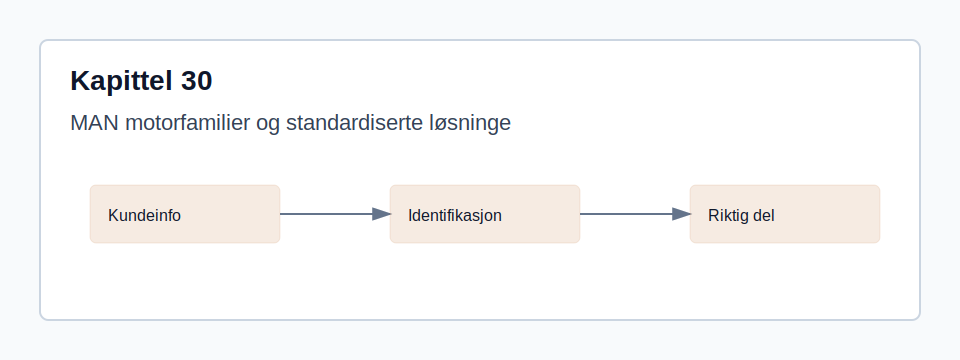

## Tekniske systemillustrasjoner

## Grundig forklaring
Hvordan kapitlets tema brukes i praktisk arbeid må forstås både teknisk og praktisk. I marine reservedeler er det sjelden nok å vite hva kunden kaller delen. Medarbeideren må forstå hvilken funksjon delen har, hvor den sitter, hvilken motorvariant den tilhører, og hva som skjer dersom feil del bestilles. Derfor skal tekniske data, kundens beskrivelse og dokumentert katalogoppslag alltid vurderes sammen.

En god sak har fire kjennetegn: den har tydelig identifikasjon, tydelig problem- eller delbeskrivelse, tydelig beslutningsgrunnlag og tydelig oppfølging. Dersom ett av disse punktene mangler, skal saken markeres som usikker før kunden får et bindende svar.

## Praktisk verkstedeksempel
Et verksted kontakter support fordi en MAN-motor skal klargjøres før avgang. De oppgir bare motormodell og et gammelt filter som eksempel. Riktig arbeidsmåte er å be om typeplate, bilde av eksisterende filter, driftstimer og om kunden ønsker enkeltfilter eller komplett servicekit. Når data er kontrollert, sendes et svar med korrekt delnummer, antall, leveringstid og forbehold om eventuelle erstatningsnummer.

## Kundesupporteksempel
Kunde: 'Jeg trenger en pumpe til MAN, helst i dag.' Profesjonelt svar: 'Jeg skal hjelpe deg raskt. For å unngå feil pumpe trenger jeg bilde av motorskiltet, bilde av pumpen montert og et nærbilde av eventuelt nummer på pumpen. Når jeg har dette, kontrollerer jeg riktig variant og gir deg lagerstatus og raskeste fraktalternativ.'

## Vanlige feil og årsaker
- røyk eller lav effekt ved luft-/drivstoffproblem.
- høy temperatur på grunn av kjøler, sjøvann eller termostat.
- alarm fra elektronisk styring etter feil sensorvalg.
- lekkasje rundt kjøler eller eksoskomponent.

## Feilsøkingsflyt
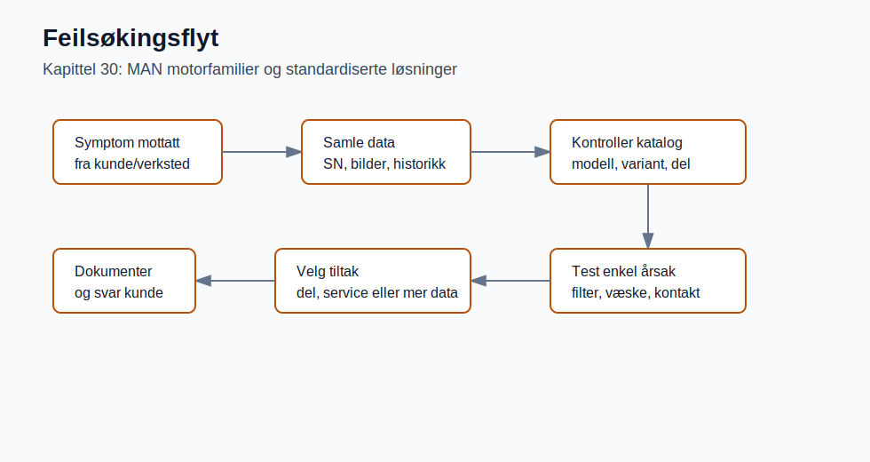

```mermaid
flowchart TD
    A[Symptom eller forespørsel mottatt] --> B[Samle serienummer, bilder og historikk]
    B --> C{Er motor og variant sikkert identifisert?}
    C -- Nei --> D[Be om mer dokumentasjon før del bekreftes]
    C -- Ja --> E[Kontroller delnummer og posisjon i katalog]
    E --> F{Stemmer symptom med foreslått del?}
    F -- Nei --> G[Foreslå feilsøking eller teknisk kontroll]
    F -- Ja --> H[Kontroller lager, pris og levering]
    H --> I[Send dokumentert kundesvar]
```

## Vedlikeholdsprosedyre
1. Avklar driftstimer, siste service og driftsmiljø.
2. Kontroller olje, filter, kjølevæske, sjøvannskrets, reimer, slanger og elektriske kontakter.
3. Sammenlign vedlikeholdsbehov med produsentens intervaller og faktisk bruk.
4. Anbefal servicekit når flere slitedeler bør skiftes samtidig.
5. Dokumenter hva som er anbefalt, hva kunden bestiller og eventuelle avvik fra normal prosedyre.

## Serienummeridentifikasjon
MAN-motorer krever korrekt motortype, motornummer og ytelsesvariant. Høyytelses marine motorer kan ha deler som ser like ut, men som er bundet til rating, produksjonsperiode eller styresystem.

Minimumsdata bør være: fabrikat, modell, serienummer, eventuell product number/arrangement/CPL/motornummer, bilde av typeplate og bilde av motorens installasjon. Ved tvil skal saken stoppes for avklaring før del bekreftes.

## Reservedelsidentifikasjon
Kontroller servicekit, filtre, reimer, kjølere, injeksjonskomponenter og elektronikk mot motornummer. Ved elektroniske komponenter skal programvare- eller styreenhetsvariant vurderes før levering.

Sjekk alltid om delnummeret gjelder enkeltkomponent, reparasjonssett, servicekit eller komplett enhet. Kontroller også om varen er høyre/venstre, gammel/ny type, standard/oversize eller knyttet til en bestemt produksjonsperiode.

## Bestillingsprosedyre
1. Opprett eller oppdater sak med kunde, fartøy, kontaktperson og tidsfrist.
2. Verifiser motoridentifikasjon og lagre bildedokumentasjon.
3. Finn korrekt delnummer i relevant katalog eller leverandørgrunnlag.
4. Kontroller supersession, antall, lagerstatus, pris, returvilkår og leveringstid.
5. Send ordrebekreftelse med delnummer, beskrivelse, antall, pris, levering og forbehold.
6. Følg opp leveransen til kunden har mottatt varen eller saken er lukket.

## Kvalitetspunkter før svar
- Har vi nok data til å gi et sikkert svar?
- Er delnummeret kontrollert mot riktig motorvariant?
- Er kundens tidsfrist realistisk med valgt fraktmåte?
- Er eventuelle forbehold skrevet tydelig?
- Kan en kollega forstå beslutningen ved å lese saken senere?

## Kapittelsammendrag
Hovedpoenget i kapittel 30 er at profesjonelt reservedelsarbeid krever struktur. Teknisk kunnskap, engelske fagtermer, praktisk feilsøking, dokumentasjon og kundedialog må henge sammen. Når medarbeideren jobber systematisk, reduseres feilbestillinger, kunden får bedre svar, og verkstedet kan planlegge arbeidet tryggere.

## Kryssreferanser
- For forrige tema, se kapittel 29: Cummins identifikasjon og bestillingsveiledning.
- For neste tema, se kapittel 31: Scania marine bruk, motoropplysninger og reservedelsnøkkel.
- For grunnleggende identifikasjon, se kapittel 12 og 17.

## Fordypning for intern opplæring
Dette kapitlet skal brukes som arbeidsstandard, ikke bare som lesestoff. Når en ny medarbeider møter en sak om MAN, skal vedkommende trene på å gå rolig fra fakta til vurdering og deretter til handling. I en marinemotorforhandler er konsekvensen av en feil ofte større enn verdien av selve delen. En feil impeller, feil sensor, feil filterinnsats eller feil pakningssett kan føre til tapt verkstedtid, utsatt avgang, irritert kunde og i verste fall ny driftsstans. Derfor skal hver sak behandles som en teknisk beslutning med sporbar dokumentasjon.

I produsentdialog skal medarbeideren bruke produsentens egne betegnelser når de finnes: Engine Type, Engine Number, Rating, Electronic Control Unit, Service Kit. Dette gir bedre presisjon overfor leverandør, reduserer risiko for misforståelser og gjør saken lettere å kontrollere senere.

Profesjonelt nivå i dette kapitlet betyr at medarbeideren kan arbeide sikkert med MAN-systemer. Før kunden får et bindende svar, skal opplysningene i saken kontrolleres mot motorens identitet, faktisk installasjon og relevant produsentterminologi. Det praktiske målet er ikke å finne et raskt nummer, men å kunne forklare hvorfor valgt del, kontrollpunkt eller kundesvar er riktig for akkurat denne motoren. Når informasjon mangler, skal medarbeideren beskrive hva som mangler, hvorfor det er nødvendig, og hvilket neste steg som bringer saken videre.

## Tekniske forklaringer
Teknisk forståelse i dette kapitlet skal bygges rundt engine type, engine number, rating, service documentation, ECU-related parts og marine application. Medarbeideren må skille mellom synlig symptom, sannsynlig systemfeil og bestillbar komponent. En del kan se riktig ut på bilde, men likevel være feil dersom posisjon, variant, rating, kjøleroppsett, elektrisk plugg, monteringsside eller servicehistorikk ikke stemmer. Derfor skal teknisk vurdering alltid kobles til både funksjon og dokumentasjon: hva gjør komponenten, hvilket system påvirker den, og hvilken produsentkilde bekrefter at den passer.

I praksis betyr dette at tekniske data skal kobles til motorens faktiske installasjon. Marine motorer står ofte trangt, er utsatt for salt, vibrasjon, fukt og ujevnt belastningsmønster, og de kan være bygget om gjennom mange år. En motor kan ha original kjøler, ettermontert eksosbend, alternativ dynamo, endret filterbrakett eller annen sjøvannspumpe enn standard. Slike forhold gjør at delidentifikasjon må bygge på både produsentdata og synlig dokumentasjon fra motoren.

Produsentterminologi er en del av den tekniske forståelsen. Bruk uttrykk som Engine Type, Engine Number, Rating, Electronic Control Unit, Service Kit, Fuel Injection når de er relevante. Ikke oversett dem på en måte som fjerner presisjon. Skriv for eksempel «Engine Serial Number (ESN)» første gang og deretter «ESN» i saken dersom produsenten bruker dette. Skriv «Arrangement Number» når CAT-data krever det, «Product Number» når Volvo Penta bruker det, «CPL» når Cummins-konfigurasjon må kontrolleres, og «Model Code» når Yanmar-identifikasjon bygger på modellkode. Dette gjør dialogen med internasjonale leverandører mer presis.

## Illustrasjonsforslag
- Oversiktsdiagram som viser hvor MAN passer inn i total arbeidsflyt fra kundeforespørsel til levert del.
- Nærbilde av typeplate/motorskilt med markering av serienummer, motornummer, modell og eventuell variantkode.
- Sprengskisse med markert posisjon, delnummer, antall per motor og mulige alternative versjoner.
- Feilsøkingsflyt med beslutningspunkter: mangler data, stemmer symptom, kreves mer teknisk kontroll, kan ordre bekreftes.
- Sammenligningsbilde av gammel og ny del der forskjell i tilkobling, side, lengde eller sensorplugg er markert.

## Virkelige verkstedseksempler
Eksempel 1: Et verksted står med en demontert komponent på benken og kunden venter på avklaring før fartøyet kan settes tilbake i drift. Verkstedet sender et nærbilde av delen, men ingen motorplate. En uerfaren medarbeider kan bli fristet til å søke på nummeret som står på støpegodset. En profesjonell medarbeider svarer at støpenummer ikke nødvendigvis er bestillbart delnummer, ber om bilde av typeplate, oversiktsbilde av motoren og bilde av monteringsstedet, og forklarer at dette hindrer feilbestilling. Når informasjonen kommer, kontrolleres delnummer mot sprengskisse, posisjon og antall. Først da gis pris og leveringstid.

Eksempel 2: En kunde ringer sent på dagen og sier at motoren har høy temperatur etter service. Kunden ønsker ny termostat. Medarbeideren skal ikke automatisk konkludere med termostatfeil. Spørsmålene bør avklare om impeller er byttet, om sjøvannsfilteret er rent, om kjølevæskenivået er riktig, om alarmen kommer ved tomgang eller belastning, og om det finnes lekkasje rundt varmeveksler eller slanger. Dersom kunden likevel vil bestille termostat, dokumenteres at feilsøking er anbefalt, og delnummer kontrolleres mot serienummer før ordre.

Eksempel 3: En intern selger mottar en gammel faktura med et delnummer som ikke lenger finnes. Riktig prosess er å kontrollere supersession, se om ny del krever tilhørende pakning, boltsett eller adapter, og notere både gammelt og nytt nummer i saken. Kunden skal få vite at delen er erstattet, hva som leveres, og om det finnes monteringsforbehold.

## Reservedelsidentifisering i praksis
Reservedelsidentifisering skal følge en fast rekkefølge. Først kontrolleres motorens identitet. Deretter kontrolleres delens system: drivstoff, luft, kjøling, smøring, eksos, elektrisk eller mekanisk kraftoverføring. Så kontrolleres posisjon i sprengskisse eller parts list. Til slutt kontrolleres antall, variant, supersession og leveringsstatus. Denne rekkefølgen hindrer at medarbeideren hopper direkte fra kundens ord til et tilfeldig delnummer.

Når en del har synlig nummer, må nummeret tolkes riktig. Mange komponenter har produksjonsnummer, støpenummer, leverandørnummer eller revisjonskode som ikke er det samme som bestillbart part number. Et filter kan ha nummer fra filterprodusent, men motorprodusentens parts catalogue kan bruke et annet nummer. En pumpe kan ha nummer på lokk, hus og komplett enhet. Spør derfor alltid: gjelder nummeret komplett del, reparasjonssett, underkomponent eller produsentens råkomponent?

## Serienummer og motornummer
Serienummer og motornummer er grunnlaget for korrekt katalogoppslag. Be kunden sende bilde av typeplate eller dataplate. Dersom kunden skriver nummeret manuelt, skal nummeret likevel kontrolleres mot bilde når det er mulig. Noter hele nummeret, inkludert prefiks, suffiks, bindestrek, mellomrom og eventuelle bokstaver. På enkelte produsenter kan små forskjeller peke til forskjellig produksjonsperiode, rating eller konfigurasjon.

Bruk motornummer sammen med modell, variant og applikasjon. En motor som driver generator kan ha andre deler enn en fremdriftsmotor. En motor i yrkesbåt kan ha annen rating enn samme motor i fritidsbåt. En eldre motor kan være bygget om med ny dynamo, annen sjøvannspumpe eller uoriginal filterbrakett. Dersom typeplate mangler, bygg identifikasjonen gjennom flere kilder: servicebok, tidligere faktura, bilder av motorens sider, nummer på pumpe, filter, turbo og gear, samt opplysninger om fartøy og produksjonsår.

## Feilsøking steg for steg
1. Definer symptomet med kundens egne ord og skriv det i saken. Skill mellom «kunden ønsker del» og «kunden beskriver feil».
2. Avklar når feilen oppstår: start, tomgang, belastning, marsjfart, varm motor, kald motor eller etter nylig service.
3. Kontroller grunnleggende forhold: væskenivå, filter, luft i drivstoff, sjøvannsstrøm, reimer, elektriske kontakter, sikringer og synlige lekkasjer.
4. Knytt symptomet til system: lav effekt peker ofte mot luft/drivstoff/eksos, høy temperatur mot kjøling, lavt oljetrykk mot smøring/sensor, startproblem mot batteri/starter/gløding/drivstoff.
5. Be om bilder eller måledata dersom symptomet ikke kan kobles sikkert til en del. Dette kan være bilde av alarmdisplay, trykkmåling, temperaturmåling eller bilde av montert komponent.
6. Kontroller relevant delnummer mot serienummer og variant. Dersom flere alternativer finnes, forklar kunden hva som skiller dem.
7. Dokumenter anbefalt tiltak, usikkerhet og eventuelle forbehold før ordre bekreftes.

## Vedlikehold
Vedlikehold skal vurderes mot driftstimer, produsentens maintenance schedule og faktisk driftsmiljø. Marine motorer som går korte turer, mye tomgang eller i salt miljø kan trenge hyppigere kontroll enn standard intervall antyder. Nye medarbeidere skal lære å spørre om siste service, hvilke filter som ble byttet, hvilken olje som ble brukt, om impeller er kontrollert, og om kjølevæske eller anoder er byttet etter plan.

En god vedlikeholdsanbefaling er konkret. I stedet for å skrive «ta service», bør medarbeideren foreslå relevante deler: olje- og drivstoffilter, luftfilter, impeller, reim, pakninger, anoder, kjølevæske og eventuelt servicekit. Dersom kunden har ukjent servicehistorikk, bør komplett servicekit vurderes. Dersom kunden har hatt overoppheting, bør sjøvannskrets og varmeveksler kontrolleres før bare én komponent byttes.

## Vanlige feil
- Serienummer leses feil fordi et tegn forveksles, for eksempel O/0 eller I/1.
- Kunden oppgir modellnavn, men ikke variant, rating eller applikasjon.
- Del velges ut fra bilde alene uten kontroll mot sprengskisse eller produsentkatalog.
- Supersession aksepteres uten å kontrollere om ny del krever tilbehør, pakning eller ombygging.
- Hastepress gjør at leveringsløfte gis før lagerstatus og fraktmulighet er bekreftet.
- Saksnotat mangler grunnlaget for beslutningen, slik at kollega ikke kan etterprøve valget.

## Kontrollspørsmål
- Hva er den viktigste tekniske risikoen i en sak som gjelder MAN?
- Hvilke opplysninger må dokumenteres før bindende delnummer bekreftes?
- Hvordan forklarer du kunden hvorfor bilde av typeplate er nødvendig?
- Når bør du stoppe en ordre og be om mer dokumentasjon?
- Hvilke engelske produsentuttrykk bør du kunne bruke i denne typen sak?
- Hvordan dokumenterer du at et delnummer er erstattet av et nytt nummer?

## Praktisk sjekkliste for medarbeider
- Les saken som om en kollega skal overta den i morgen.
- Kontroller at motoridentifikasjon er dokumentert med bilde eller sikker kilde.
- Sjekk at delnummeret er knyttet til riktig posisjon i katalogen.
- Skriv tydelig om kunden har bedt om enkeltkomponent, servicekit eller komplett enhet.
- Noter om varen er spesialbestilling, utgått, erstattet eller ikke returbar.
- Send kundesvar med neste steg, ikke bare et løst delnummer.

## Kapittelspesifikk systemforståelse
For dette kapitlet er kjernen å forstå MAN-identifikasjon med engine type, engine number og rating. Medarbeideren skal kunne forklare dette med praktiske ord til både kunde og kollega. Det betyr at teknisk teori må kobles til konkrete handlinger: hvilke data skal innhentes, hvilke komponenter kan være berørt, hvilken produsentterminologi skal brukes, og hva må dokumenteres før saken kan gå videre. MAN high performance marine motorer krever særlig kontroll av rating og elektronikkvariant.

Når systemet vurderes, skal medarbeideren først plassere problemet i riktig teknisk sammenheng. Dersom kunden beskriver en alarm, må man finne ut om alarmen kommer fra reelt mekanisk avvik, elektrisk sensorfeil, feil etter service eller feil tolkning av instrumentet. Dersom kunden beskriver en del, må man avklare om kunden mener komplett enhet, servicekit, reparasjonssett eller enkeltkomponent. Dersom kunden beskriver motoren med vanlig navn, må man kontrollere om produsenten bruker mer presise begreper i katalogen.

## Komponentoversikt og arbeidsgrense
Relevante komponenter og opplysninger i dette kapitlet omfatter: engine number, rating, ECU, service kit, charge air cooler, fuel injection, belts og filters. Listen er ikke ment som en erstatning for produsentens parts catalogue, men som en praktisk påminnelse om hva nye medarbeidere skal tenke på før de søker del. I interne saker skal komponentnavn skrives så presist som mulig. Bruk for eksempel «sjøvannspumpe / raw water pump» i stedet for bare «pumpe» når funksjonen er kjent, og «varmeveksler / heat exchanger» i stedet for bare «kjøler» når det er den komponenten saken gjelder.

Arbeidsgrensen for en reservedelsmedarbeider er også viktig. Medarbeideren skal ikke overta mekanikerens ansvar for demontering, måling eller diagnose på motoren, men skal kunne stille riktige spørsmål og foreslå riktig dokumentasjon. Når en sak går fra enkel delidentifikasjon til teknisk diagnose, skal dette markeres i saken. Da kan verksted, teknisk ansvarlig eller leverandør involveres med et klart spørsmål og et ryddig faktagrunnlag.

## Praktisk beslutningsregel
Bruk denne regelen i alle saker knyttet til kapitlet: Hvis motoridentifikasjon, komponentposisjon eller symptom ikke er sikkert nok dokumentert, skal medarbeideren ikke gi bindende delbekreftelse. Kunden kan få et foreløpig svar, men svaret må inneholde hva som mangler, hvorfor det mangler, og hva som skjer når informasjonen er mottatt. Dette er ikke treg service; det er profesjonell risikokontroll.

## Målrettet fordypning kapittel 21-30
### MAN: engine number, rating og elektronikkvariant
MAN marine motorer krever presis identifikasjon av engine type, engine number og rating. Høyytelsesmotorer kan ha komponenter som ser like ut, men som er bundet til effektklasse, produksjonsperiode eller elektronisk styring. Ved elektroniske komponenter må ECU, sensorvariant og eventuell software-/calibration-avhengighet vurderes før levering.

I praktiske saker bør service kit, filters, belts, charge air cooler, raw water circuit, fuel injection components og sensors kontrolleres mot motornummer. Ved røyk eller lav effekt må luftfilter, ladeluftlekkasje, turbo, fuel filters og belastning vurderes. Ved temperaturproblem må sea water flow, heat exchanger, coolant pump, thermostat og belt drive kontrolleres. MAN-saker bør dokumenteres ekstra tydelig når kunden har hastebehov, fordi feil elektronikk- eller ratingavhengig del kan gi kostbar forsinkelse.

### Praktisk anvendelse i opplæring
Bruk kapitlet som caseøvelse der deltakeren skal skrive et kundesvar, identifisere nødvendige produsentdata og velge neste tekniske kontrollpunkt. Deltakeren skal også forklare hva som kan besvares av reservedelsavdelingen, og hva som må avklares av verksted, teknisk ansvarlig eller leverandør. Målet er at medarbeideren kan arbeide raskt, men fortsatt med sporbarhet og korrekt produsentterminologi.

## Realistisk opplæring i praksis
### Verkstedhistorie
En typisk sak i dette temaet starter med elektronisk komponent krever korrekt rating. Verkstedet trenger et raskt svar, men den erfarne medarbeideren stopper opp og spør først: hva vet vi sikkert, hva antar vi, og hva kan gi følgeskade hvis vi tar feil? I praksis betyr det at engine number, rating og ECU må kobles til bilde, serienummer, komponentposisjon og kundens symptom før saken lukkes. Historien skal brukes i opplæring som en øvelse i å skrive et kort saksnotat: observasjon, vurdering, neste handling og forbehold.

### Kundehistorie
Kunden beskriver ofte problemet med driftsspråk: «motoren går tungt», «alarm kommer etter ti minutter», «jeg trenger den samme delen som sist» eller «båten skal ut i morgen». En profesjonell respons er rolig og konkret: bekreft behovet, forklar hvorfor identifikasjon trengs, be om riktig dokumentasjon og gi et realistisk tidspunkt for neste svar. Ikke korriger kunden unødvendig; oversett kundens språk til teknisk språk i saken.

### Typiske feil nye ansatte gjør
- søker på første synlige nummer uten å avklare om det er støpenummer, leverandørnummer eller bestillbart part number.
- lover levering før lagerstatus, frakt og returvilkår er kontrollert.
- antar at tidligere faktura alltid gjelder samme motorvariant.
- blander symptom og årsak, spesielt ved varme, lav effekt, startproblem og alarm.
- skriver for korte notater slik at kollega ikke kan forstå hvorfor valget ble tatt.

### Tips fra erfarne mekanikere og reservedelsselgere
- Se alltid etter systemet rundt delen: slanger, braketter, sensorer, reimer, kjølere og tilkoblinger forteller ofte mer enn delen alene.
- Still ett presist spørsmål om gangen når kunden er stresset; mange dårlige svar kommer av for lange spørsmålslister.
- Sammenlign gammel og ny del mot funksjon, ikke bare form. Riktig del skal passe, men også løse riktig problem.
- En erfaren reservedelsselger tenker i risiko: Hva er billigst å avklare nå, og hva blir dyrt hvis vi hopper over det?

### Vanlige kundespørsmål
| Spørsmål fra kunde | Profesjonelt svar |
|---|---|
| «Kan du bare sende samme del som sist?» | «Ja, hvis vi først bekrefter at det gjelder samme motor, samme posisjon og ingen supersession siden sist.» |
| «Holder det med bilde?» | «Bilde hjelper, men vi trenger også motoridentitet for å sikre variant og delnummer.» |
| «Hvorfor tar dette tid?» | «Fordi feil del kan gi ny driftsstans. Vi kontrollerer grunnlaget før vi lover levering.» |

### Beslutningstre for saken
| Trinn | Spørsmål | Handling |
|---|---|---|
| 1 | Er motoridentitet dokumentert med bilde eller sikker historikk? | Hvis nei: be om typeplate/dataplate eller alternativ dokumentasjon. |
| 2 | Er komponentens funksjon og posisjon kjent? | Hvis nei: be om oversiktsbilde og bilde av monteringssted. |
| 3 | Stemmer kundens symptom med delen som ønskes? | Hvis nei: anbefal feilsøking før del bestilles. |
| 4 | Finnes det supersession, kit eller variantvalg? | Kontroller produsentkilde og skriv forbehold i saken. |
| 5 | Kan pris, levering og returvilkår bekreftes? | Send dokumentert svar med neste steg og tydelig gyldighet. |

### Rask oppslagstabell
| Situasjon | Kontroller først | Vanlig fallgruve |
|---|---|---|
| Hasteordre | sikker motor-ID, lager, fraktfrist | levering loves før teknisk kontroll |
| Del fra bilde | posisjon, skala, tilkoblinger, nummer | bilde brukes som eneste beslutningsgrunnlag |
| Gammelt delnummer | supersession og kitinnhold | ny del krever ekstra pakning eller adapter |
| Uklart symptom | driftssituasjon, alarm, siste service | symptom blir tolket som sikker komponentfeil |

### Praktisk sjekkliste og inspeksjonsrutine
- Start med motoridentitet: fabrikat, modell, serienummer, variant, applikasjon og bilde av skilt.
- Kontroller området rundt komponenten: lekkasje, korrosjon, knekte fester, slitasje, varmemerker og uoriginale endringer.
- Spør om siste vedlikehold: olje, filter, impeller, reimer, kjølevæske, anoder og drivstoffilter.
- Noter driftstype: fritidsbruk, yrkesbruk, generator, fremdrift, tomgangsdrift eller langvarig høy belastning.
- Avklar om saken gjelder akutt drift, planlagt service, reklamasjon eller lagerpåfyll.

### Generelle vedlikeholdsintervaller som opplæringspunkt
| Kontrollpunkt | Typisk vurdering i opplæring | Må verifiseres |
|---|---|---|
| Olje og oljefilter | ofte basert på timer og kalender | produsentens maintenance schedule |
| Drivstoffilter/vannutskiller | hyppigere ved dårlig drivstoff eller sesongstart | motor- og filterspesifikasjon |
| Impeller og sjøvannskrets | kontrolleres særlig før sesong og etter varmgang | produsentens intervall og installasjon |
| Reimer, slanger og klemmer | visuell kontroll ved service og feilsøking | dimensjon, stramming og delnummer |

### Produsentverifikasjon
MAN engine number, rating, ECU/software-relaterte deler og service bulletins må kontrolleres i autorisert kilde. Marker tydelig i saken når svaret bygger på antakelse, eldre historikk, bilde uten motor-ID eller generell erfaring. Intervaller i tabellen er generelle opplæringspunkter. Faktiske intervaller styres av produsent, motorvariant, driftstimer, kalenderkrav, belastning og miljø.

## Produsentverifikasjon og faglig forbehold
For MAN skal engine type, engine number, rating, marine application, service documentation og ECU-/software-relaterte komponenter kontrolleres mot MAN-dokumentasjon eller autorisert leverandør før ordre bekreftes. Marker saken internt dersom opplysningen bygger på antakelse, eldre historikk eller bilde uten bekreftet motoridentitet.

## Quiz med fasit
1. Hvilke tekniske data bør alltid samles før en del bekreftes?
2. Hvorfor er engelsk terminologi viktig i marine reservedeler?
3. Hva bør gjøres dersom kunden bare sender et bilde av delen?
4. Hvilke punkter bør kontrolleres før ordrebekreftelse sendes?
5. Hvorfor skal feilsøking dokumenteres, selv når kunden allerede ber om en bestemt del?

### Svar
1. Fabrikat, modell, serienummer, variantdata, bilde av typeplate, delnummer, posisjon og kundens symptombeskrivelse.
2. Fordi kataloger, portaler, servicemanualer og leverandørdialog ofte bruker engelske begreper som må forstås presist.
3. Be om serienummer, oversiktsbilde av motoren og eventuelle nummer på delen; bildet brukes som støtte, ikke eneste grunnlag.
4. Delnummer, antall, variant, pris, lagerstatus, leveringstid, frakt, returvilkår og eventuelle forbehold.
5. Fordi symptomet kan ha flere årsaker, og dokumentasjon viser hvorfor anbefalingen ble gitt.

---

# Kapittel 31: Scania marine bruk, motoropplysninger og reservedelsnøkkel

## Kapittelrolle
Scania krever systematisk identifikasjon fordi samme motorfamilie kan finnes i flere marine installasjoner, effektnivåer og produksjonsperioder. En profesjonell medarbeider skal ikke bare finne en del som ligner, men dokumentere hvorfor den valgte delen passer til akkurat denne motoren.

## Læringsmål
Etter kapitlet skal deltakeren kunne:
- forklare hovedbegrepene innen reservedelsarbeid
- bruke serienummer, modellinformasjon og delnummer i praktisk reservedelsarbeid
- kommunisere trygt med kunde, verksted, lager og leverandør
- dokumentere beslutninger slik at andre kan etterprøve saken
- kjenne igjen vanlige feil og velge riktig neste handling

## English technical terminology
- **Engine Number:** engelsk fagterm som ofte brukes i kataloger, servicelitteratur, leverandørportaler og internasjonal kundedialog.
- **Engine Family:** engelsk fagterm som ofte brukes i kataloger, servicelitteratur, leverandørportaler og internasjonal kundedialog.
- **Application:** engelsk fagterm som ofte brukes i kataloger, servicelitteratur, leverandørportaler og internasjonal kundedialog.
- **Rating:** engelsk fagterm som ofte brukes i kataloger, servicelitteratur, leverandørportaler og internasjonal kundedialog.
- **Parts Catalogue:** engelsk fagterm som ofte brukes i kataloger, servicelitteratur, leverandørportaler og internasjonal kundedialog.
- **Part Number:** engelsk fagterm som ofte brukes i kataloger, servicelitteratur, leverandørportaler og internasjonal kundedialog.
- **Supersession:** engelsk fagterm som ofte brukes i kataloger, servicelitteratur, leverandørportaler og internasjonal kundedialog.
- **Service Kit:** engelsk fagterm som ofte brukes i kataloger, servicelitteratur, leverandørportaler og internasjonal kundedialog.
- **Troubleshooting:** engelsk fagterm som ofte brukes i kataloger, servicelitteratur, leverandørportaler og internasjonal kundedialog.

## Hoveddiagram
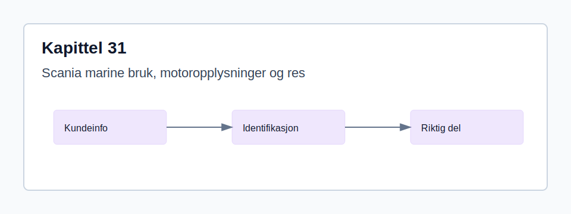

## Tekniske systemillustrasjoner

## Grundig forklaring
Hvordan kapitlets tema brukes i praktisk arbeid må forstås både teknisk og praktisk. I marine reservedeler er det sjelden nok å vite hva kunden kaller delen. Medarbeideren må forstå hvilken funksjon delen har, hvor den sitter, hvilken motorvariant den tilhører, og hva som skjer dersom feil del bestilles. Derfor skal tekniske data, kundens beskrivelse og dokumentert katalogoppslag alltid vurderes sammen.

En god sak har fire kjennetegn: den har tydelig identifikasjon, tydelig problem- eller delbeskrivelse, tydelig beslutningsgrunnlag og tydelig oppfølging. Dersom ett av disse punktene mangler, skal saken markeres som usikker før kunden får et bindende svar.

## Praktisk verkstedeksempel
Et verksted kontakter support fordi en Scania-motor skal klargjøres før avgang. De oppgir bare motormodell og et gammelt filter som eksempel. Riktig arbeidsmåte er å be om typeplate, bilde av eksisterende filter, driftstimer og om kunden ønsker enkeltfilter eller komplett servicekit. Når data er kontrollert, sendes et svar med korrekt delnummer, antall, leveringstid og forbehold om eventuelle erstatningsnummer.

## Kundesupporteksempel
Kunde: 'Jeg trenger en pumpe til Scania, helst i dag.' Profesjonelt svar: 'Jeg skal hjelpe deg raskt. For å unngå feil pumpe trenger jeg bilde av motorskiltet, bilde av pumpen montert og et nærbilde av eventuelt nummer på pumpen. Når jeg har dette, kontrollerer jeg riktig variant og gir deg lagerstatus og raskeste fraktalternativ.'

## Vanlige feil og årsaker
- feil servicekit fordi applikasjon ikke ble kontrollert.
- varmeproblem ved sjøvannsgjennomstrømning eller varmeveksler.
- drivstoffrelatert effektfall.
- elektrisk alarm fra sensor eller kontakt.

## Feilsøkingsflyt

```mermaid
flowchart TD
    A[Symptom eller forespørsel mottatt] --> B[Samle serienummer, bilder og historikk]
    B --> C{Er motor og variant sikkert identifisert?}
    C -- Nei --> D[Be om mer dokumentasjon før del bekreftes]
    C -- Ja --> E[Kontroller delnummer og posisjon i katalog]
    E --> F{Stemmer symptom med foreslått del?}
    F -- Nei --> G[Foreslå feilsøking eller teknisk kontroll]
    F -- Ja --> H[Kontroller lager, pris og levering]
    H --> I[Send dokumentert kundesvar]
```

## Vedlikeholdsprosedyre
1. Avklar driftstimer, siste service og driftsmiljø.
2. Kontroller olje, filter, kjølevæske, sjøvannskrets, reimer, slanger og elektriske kontakter.
3. Sammenlign vedlikeholdsbehov med produsentens intervaller og faktisk bruk.
4. Anbefal servicekit når flere slitedeler bør skiftes samtidig.
5. Dokumenter hva som er anbefalt, hva kunden bestiller og eventuelle avvik fra normal prosedyre.

## Serienummeridentifikasjon
Scania krever motornummer, motorfamilie og applikasjonsdata. Marine installasjoner kan variere etter effektuttak, kjøling, klassekrav og om motoren driver propell, generator eller hjelpeutstyr.

Minimumsdata bør være: fabrikat, modell, serienummer, eventuell product number/arrangement/CPL/motornummer, bilde av typeplate og bilde av motorens installasjon. Ved tvil skal saken stoppes for avklaring før del bekreftes.

## Reservedelsidentifikasjon
Bruk motornummer og applikasjon for å velge filtre, reimer, sensorer, drivstoffkomponenter, kjøledeler og pakninger. Kontroller om delen er industribasert eller marinspesifikk.

Sjekk alltid om delnummeret gjelder enkeltkomponent, reparasjonssett, servicekit eller komplett enhet. Kontroller også om varen er høyre/venstre, gammel/ny type, standard/oversize eller knyttet til en bestemt produksjonsperiode.

## Bestillingsprosedyre
1. Opprett eller oppdater sak med kunde, fartøy, kontaktperson og tidsfrist.
2. Verifiser motoridentifikasjon og lagre bildedokumentasjon.
3. Finn korrekt delnummer i relevant katalog eller leverandørgrunnlag.
4. Kontroller supersession, antall, lagerstatus, pris, returvilkår og leveringstid.
5. Send ordrebekreftelse med delnummer, beskrivelse, antall, pris, levering og forbehold.
6. Følg opp leveransen til kunden har mottatt varen eller saken er lukket.

## Kvalitetspunkter før svar
- Har vi nok data til å gi et sikkert svar?
- Er delnummeret kontrollert mot riktig motorvariant?
- Er kundens tidsfrist realistisk med valgt fraktmåte?
- Er eventuelle forbehold skrevet tydelig?
- Kan en kollega forstå beslutningen ved å lese saken senere?

## Kapittelsammendrag
Hovedpoenget i kapittel 31 er at profesjonelt reservedelsarbeid krever struktur. Teknisk kunnskap, engelske fagtermer, praktisk feilsøking, dokumentasjon og kundedialog må henge sammen. Når medarbeideren jobber systematisk, reduseres feilbestillinger, kunden får bedre svar, og verkstedet kan planlegge arbeidet tryggere.

## Kryssreferanser
- For forrige tema, se kapittel 30: MAN motorfamilier og standardiserte løsninger.
- For neste tema, se kapittel 32: Yanmar typiske motorer, delnummer og støttepunkt.
- For grunnleggende identifikasjon, se kapittel 12 og 17.

## Fordypning for intern opplæring
Dette kapitlet skal brukes som arbeidsstandard, ikke bare som lesestoff. Når en ny medarbeider møter en sak om Scania, skal vedkommende trene på å gå rolig fra fakta til vurdering og deretter til handling. I en marinemotorforhandler er konsekvensen av en feil ofte større enn verdien av selve delen. En feil impeller, feil sensor, feil filterinnsats eller feil pakningssett kan føre til tapt verkstedtid, utsatt avgang, irritert kunde og i verste fall ny driftsstans. Derfor skal hver sak behandles som en teknisk beslutning med sporbar dokumentasjon.

I produsentdialog skal medarbeideren bruke produsentens egne betegnelser når de finnes: Engine Number, Engine Family, Application, Rating, Parts Catalogue. Dette gir bedre presisjon overfor leverandør, reduserer risiko for misforståelser og gjør saken lettere å kontrollere senere.

Profesjonelt nivå i dette kapitlet betyr at medarbeideren kan arbeide sikkert med Scania Marine. Før kunden får et bindende svar, skal opplysningene i saken kontrolleres mot motorens identitet, faktisk installasjon og relevant produsentterminologi. Det praktiske målet er ikke å finne et raskt nummer, men å kunne forklare hvorfor valgt del, kontrollpunkt eller kundesvar er riktig for akkurat denne motoren. Når informasjon mangler, skal medarbeideren beskrive hva som mangler, hvorfor det er nødvendig, og hvilket neste steg som bringer saken videre.

## Tekniske forklaringer
Teknisk forståelse i dette kapitlet skal bygges rundt engine number, engine family, application, rating, parts catalogue og service interval. Medarbeideren må skille mellom synlig symptom, sannsynlig systemfeil og bestillbar komponent. En del kan se riktig ut på bilde, men likevel være feil dersom posisjon, variant, rating, kjøleroppsett, elektrisk plugg, monteringsside eller servicehistorikk ikke stemmer. Derfor skal teknisk vurdering alltid kobles til både funksjon og dokumentasjon: hva gjør komponenten, hvilket system påvirker den, og hvilken produsentkilde bekrefter at den passer.

I praksis betyr dette at tekniske data skal kobles til motorens faktiske installasjon. Marine motorer står ofte trangt, er utsatt for salt, vibrasjon, fukt og ujevnt belastningsmønster, og de kan være bygget om gjennom mange år. En motor kan ha original kjøler, ettermontert eksosbend, alternativ dynamo, endret filterbrakett eller annen sjøvannspumpe enn standard. Slike forhold gjør at delidentifikasjon må bygge på både produsentdata og synlig dokumentasjon fra motoren.

Produsentterminologi er en del av den tekniske forståelsen. Bruk uttrykk som Engine Number, Engine Family, Application, Rating, Parts Catalogue, PDE/XPI når de er relevante. Ikke oversett dem på en måte som fjerner presisjon. Skriv for eksempel «Engine Serial Number (ESN)» første gang og deretter «ESN» i saken dersom produsenten bruker dette. Skriv «Arrangement Number» når CAT-data krever det, «Product Number» når Volvo Penta bruker det, «CPL» når Cummins-konfigurasjon må kontrolleres, og «Model Code» når Yanmar-identifikasjon bygger på modellkode. Dette gjør dialogen med internasjonale leverandører mer presis.

## Illustrasjonsforslag
- Oversiktsdiagram som viser hvor Scania passer inn i total arbeidsflyt fra kundeforespørsel til levert del.
- Nærbilde av typeplate/motorskilt med markering av serienummer, motornummer, modell og eventuell variantkode.
- Sprengskisse med markert posisjon, delnummer, antall per motor og mulige alternative versjoner.
- Feilsøkingsflyt med beslutningspunkter: mangler data, stemmer symptom, kreves mer teknisk kontroll, kan ordre bekreftes.
- Sammenligningsbilde av gammel og ny del der forskjell i tilkobling, side, lengde eller sensorplugg er markert.

## Virkelige verkstedseksempler
Eksempel 1: Et verksted står med en demontert komponent på benken og kunden venter på avklaring før fartøyet kan settes tilbake i drift. Verkstedet sender et nærbilde av delen, men ingen motorplate. En uerfaren medarbeider kan bli fristet til å søke på nummeret som står på støpegodset. En profesjonell medarbeider svarer at støpenummer ikke nødvendigvis er bestillbart delnummer, ber om bilde av typeplate, oversiktsbilde av motoren og bilde av monteringsstedet, og forklarer at dette hindrer feilbestilling. Når informasjonen kommer, kontrolleres delnummer mot sprengskisse, posisjon og antall. Først da gis pris og leveringstid.

Eksempel 2: En kunde ringer sent på dagen og sier at motoren har høy temperatur etter service. Kunden ønsker ny termostat. Medarbeideren skal ikke automatisk konkludere med termostatfeil. Spørsmålene bør avklare om impeller er byttet, om sjøvannsfilteret er rent, om kjølevæskenivået er riktig, om alarmen kommer ved tomgang eller belastning, og om det finnes lekkasje rundt varmeveksler eller slanger. Dersom kunden likevel vil bestille termostat, dokumenteres at feilsøking er anbefalt, og delnummer kontrolleres mot serienummer før ordre.

Eksempel 3: En intern selger mottar en gammel faktura med et delnummer som ikke lenger finnes. Riktig prosess er å kontrollere supersession, se om ny del krever tilhørende pakning, boltsett eller adapter, og notere både gammelt og nytt nummer i saken. Kunden skal få vite at delen er erstattet, hva som leveres, og om det finnes monteringsforbehold.

## Reservedelsidentifisering i praksis
Reservedelsidentifisering skal følge en fast rekkefølge. Først kontrolleres motorens identitet. Deretter kontrolleres delens system: drivstoff, luft, kjøling, smøring, eksos, elektrisk eller mekanisk kraftoverføring. Så kontrolleres posisjon i sprengskisse eller parts list. Til slutt kontrolleres antall, variant, supersession og leveringsstatus. Denne rekkefølgen hindrer at medarbeideren hopper direkte fra kundens ord til et tilfeldig delnummer.

Når en del har synlig nummer, må nummeret tolkes riktig. Mange komponenter har produksjonsnummer, støpenummer, leverandørnummer eller revisjonskode som ikke er det samme som bestillbart part number. Et filter kan ha nummer fra filterprodusent, men motorprodusentens parts catalogue kan bruke et annet nummer. En pumpe kan ha nummer på lokk, hus og komplett enhet. Spør derfor alltid: gjelder nummeret komplett del, reparasjonssett, underkomponent eller produsentens råkomponent?

## Serienummer og motornummer
Serienummer og motornummer er grunnlaget for korrekt katalogoppslag. Be kunden sende bilde av typeplate eller dataplate. Dersom kunden skriver nummeret manuelt, skal nummeret likevel kontrolleres mot bilde når det er mulig. Noter hele nummeret, inkludert prefiks, suffiks, bindestrek, mellomrom og eventuelle bokstaver. På enkelte produsenter kan små forskjeller peke til forskjellig produksjonsperiode, rating eller konfigurasjon.

Bruk motornummer sammen med modell, variant og applikasjon. En motor som driver generator kan ha andre deler enn en fremdriftsmotor. En motor i yrkesbåt kan ha annen rating enn samme motor i fritidsbåt. En eldre motor kan være bygget om med ny dynamo, annen sjøvannspumpe eller uoriginal filterbrakett. Dersom typeplate mangler, bygg identifikasjonen gjennom flere kilder: servicebok, tidligere faktura, bilder av motorens sider, nummer på pumpe, filter, turbo og gear, samt opplysninger om fartøy og produksjonsår.

## Feilsøking steg for steg
1. Definer symptomet med kundens egne ord og skriv det i saken. Skill mellom «kunden ønsker del» og «kunden beskriver feil».
2. Avklar når feilen oppstår: start, tomgang, belastning, marsjfart, varm motor, kald motor eller etter nylig service.
3. Kontroller grunnleggende forhold: væskenivå, filter, luft i drivstoff, sjøvannsstrøm, reimer, elektriske kontakter, sikringer og synlige lekkasjer.
4. Knytt symptomet til system: lav effekt peker ofte mot luft/drivstoff/eksos, høy temperatur mot kjøling, lavt oljetrykk mot smøring/sensor, startproblem mot batteri/starter/gløding/drivstoff.
5. Be om bilder eller måledata dersom symptomet ikke kan kobles sikkert til en del. Dette kan være bilde av alarmdisplay, trykkmåling, temperaturmåling eller bilde av montert komponent.
6. Kontroller relevant delnummer mot serienummer og variant. Dersom flere alternativer finnes, forklar kunden hva som skiller dem.
7. Dokumenter anbefalt tiltak, usikkerhet og eventuelle forbehold før ordre bekreftes.

## Vedlikehold
Vedlikehold skal vurderes mot driftstimer, produsentens maintenance schedule og faktisk driftsmiljø. Marine motorer som går korte turer, mye tomgang eller i salt miljø kan trenge hyppigere kontroll enn standard intervall antyder. Nye medarbeidere skal lære å spørre om siste service, hvilke filter som ble byttet, hvilken olje som ble brukt, om impeller er kontrollert, og om kjølevæske eller anoder er byttet etter plan.

En god vedlikeholdsanbefaling er konkret. I stedet for å skrive «ta service», bør medarbeideren foreslå relevante deler: olje- og drivstoffilter, luftfilter, impeller, reim, pakninger, anoder, kjølevæske og eventuelt servicekit. Dersom kunden har ukjent servicehistorikk, bør komplett servicekit vurderes. Dersom kunden har hatt overoppheting, bør sjøvannskrets og varmeveksler kontrolleres før bare én komponent byttes.

## Vanlige feil
- Serienummer leses feil fordi et tegn forveksles, for eksempel O/0 eller I/1.
- Kunden oppgir modellnavn, men ikke variant, rating eller applikasjon.
- Del velges ut fra bilde alene uten kontroll mot sprengskisse eller produsentkatalog.
- Supersession aksepteres uten å kontrollere om ny del krever tilbehør, pakning eller ombygging.
- Hastepress gjør at leveringsløfte gis før lagerstatus og fraktmulighet er bekreftet.
- Saksnotat mangler grunnlaget for beslutningen, slik at kollega ikke kan etterprøve valget.

## Kontrollspørsmål
- Hva er den viktigste tekniske risikoen i en sak som gjelder Scania?
- Hvilke opplysninger må dokumenteres før bindende delnummer bekreftes?
- Hvordan forklarer du kunden hvorfor bilde av typeplate er nødvendig?
- Når bør du stoppe en ordre og be om mer dokumentasjon?
- Hvilke engelske produsentuttrykk bør du kunne bruke i denne typen sak?
- Hvordan dokumenterer du at et delnummer er erstattet av et nytt nummer?

## Praktisk sjekkliste for medarbeider
- Les saken som om en kollega skal overta den i morgen.
- Kontroller at motoridentifikasjon er dokumentert med bilde eller sikker kilde.
- Sjekk at delnummeret er knyttet til riktig posisjon i katalogen.
- Skriv tydelig om kunden har bedt om enkeltkomponent, servicekit eller komplett enhet.
- Noter om varen er spesialbestilling, utgått, erstattet eller ikke returbar.
- Send kundesvar med neste steg, ikke bare et løst delnummer.

## Kapittelspesifikk systemforståelse
For dette kapitlet er kjernen å forstå Scania-identifikasjon med engine number, engine family og application. Medarbeideren skal kunne forklare dette med praktiske ord til både kunde og kollega. Det betyr at teknisk teori må kobles til konkrete handlinger: hvilke data skal innhentes, hvilke komponenter kan være berørt, hvilken produsentterminologi skal brukes, og hva må dokumenteres før saken kan gå videre. Scania-delvalg må knyttes til applikasjon: fremdrift, generator eller hjelpeutstyr.

Når systemet vurderes, skal medarbeideren først plassere problemet i riktig teknisk sammenheng. Dersom kunden beskriver en alarm, må man finne ut om alarmen kommer fra reelt mekanisk avvik, elektrisk sensorfeil, feil etter service eller feil tolkning av instrumentet. Dersom kunden beskriver en del, må man avklare om kunden mener komplett enhet, servicekit, reparasjonssett eller enkeltkomponent. Dersom kunden beskriver motoren med vanlig navn, må man kontrollere om produsenten bruker mer presise begreper i katalogen.

## Komponentoversikt og arbeidsgrense
Relevante komponenter og opplysninger i dette kapitlet omfatter: engine family, rating, control unit, PDE/XPI, filters, coolant system, sensors og marine installation. Listen er ikke ment som en erstatning for produsentens parts catalogue, men som en praktisk påminnelse om hva nye medarbeidere skal tenke på før de søker del. I interne saker skal komponentnavn skrives så presist som mulig. Bruk for eksempel «sjøvannspumpe / raw water pump» i stedet for bare «pumpe» når funksjonen er kjent, og «varmeveksler / heat exchanger» i stedet for bare «kjøler» når det er den komponenten saken gjelder.

Arbeidsgrensen for en reservedelsmedarbeider er også viktig. Medarbeideren skal ikke overta mekanikerens ansvar for demontering, måling eller diagnose på motoren, men skal kunne stille riktige spørsmål og foreslå riktig dokumentasjon. Når en sak går fra enkel delidentifikasjon til teknisk diagnose, skal dette markeres i saken. Da kan verksted, teknisk ansvarlig eller leverandør involveres med et klart spørsmål og et ryddig faktagrunnlag.

## Praktisk beslutningsregel
Bruk denne regelen i alle saker knyttet til kapitlet: Hvis motoridentifikasjon, komponentposisjon eller symptom ikke er sikkert nok dokumentert, skal medarbeideren ikke gi bindende delbekreftelse. Kunden kan få et foreløpig svar, men svaret må inneholde hva som mangler, hvorfor det mangler, og hva som skjer når informasjonen er mottatt. Dette er ikke treg service; det er profesjonell risikokontroll.

## Målrettet fordypning kapittel 31-40
### Scania: engine number, application og marine installasjon
Scania-saker skal bygges rundt engine number, engine family, application og rating. I marine installasjoner må medarbeideren avklare om motoren brukes til fremdrift, generator eller hjelpeutstyr. Dette påvirker belastningsprofil, kjøling, servicekit og enkelte komponentvalg. Bruk begreper som engine number, engine family, application, rating, parts catalogue og control unit når du kommuniserer internt eller med leverandør.

Praktisk feilsøking må knyttes til system. Lav effekt kan skyldes fuel supply, filters, charge air leak, turbo eller sensorinput. Høy temperatur kan skyldes sjøvannsgjennomstrømning, heat exchanger, coolant pump eller termostat. Ved elektriske alarmer bør kontakt, kabel, sensor og styreenhet vurderes før komponent bestilles. Scania-delvalg må dokumentere om delen er marinspesifikk eller delt med industrimotor.

### Praktisk anvendelse i opplæring
Bruk dette kapitlet i en case der deltakeren må avgjøre hvilke opplysninger som er sikre, hvilke som mangler, og om saken kan gå til tilbud eller må stoppes for avklaring. Deltakeren skal skrive en kort intern vurdering og et profesjonelt kundesvar. Instruktøren bør særlig se etter korrekt bruk av produsentterminologi, tydelige forbehold og evne til å skille reservedelsidentifikasjon fra mekanisk diagnose.

## Realistisk opplæring i praksis
### Verkstedhistorie
En typisk sak i dette temaet starter med samme motorfamilie finnes i flere applikasjoner. Verkstedet trenger et raskt svar, men den erfarne medarbeideren stopper opp og spør først: hva vet vi sikkert, hva antar vi, og hva kan gi følgeskade hvis vi tar feil? I praksis betyr det at engine number og rating må kobles til bilde, serienummer, komponentposisjon og kundens symptom før saken lukkes. Historien skal brukes i opplæring som en øvelse i å skrive et kort saksnotat: observasjon, vurdering, neste handling og forbehold.

### Kundehistorie
Kunden beskriver ofte problemet med driftsspråk: «motoren går tungt», «alarm kommer etter ti minutter», «jeg trenger den samme delen som sist» eller «båten skal ut i morgen». En profesjonell respons er rolig og konkret: bekreft behovet, forklar hvorfor identifikasjon trengs, be om riktig dokumentasjon og gi et realistisk tidspunkt for neste svar. Ikke korriger kunden unødvendig; oversett kundens språk til teknisk språk i saken.

### Typiske feil nye ansatte gjør
- søker på første synlige nummer uten å avklare om det er støpenummer, leverandørnummer eller bestillbart part number.
- lover levering før lagerstatus, frakt og returvilkår er kontrollert.
- antar at tidligere faktura alltid gjelder samme motorvariant.
- blander symptom og årsak, spesielt ved varme, lav effekt, startproblem og alarm.
- skriver for korte notater slik at kollega ikke kan forstå hvorfor valget ble tatt.

### Tips fra erfarne mekanikere og reservedelsselgere
- Se alltid etter systemet rundt delen: slanger, braketter, sensorer, reimer, kjølere og tilkoblinger forteller ofte mer enn delen alene.
- Still ett presist spørsmål om gangen når kunden er stresset; mange dårlige svar kommer av for lange spørsmålslister.
- Sammenlign gammel og ny del mot funksjon, ikke bare form. Riktig del skal passe, men også løse riktig problem.
- En erfaren reservedelsselger tenker i risiko: Hva er billigst å avklare nå, og hva blir dyrt hvis vi hopper over det?

### Vanlige kundespørsmål
| Spørsmål fra kunde | Profesjonelt svar |
|---|---|
| «Kan du bare sende samme del som sist?» | «Ja, hvis vi først bekrefter at det gjelder samme motor, samme posisjon og ingen supersession siden sist.» |
| «Holder det med bilde?» | «Bilde hjelper, men vi trenger også motoridentitet for å sikre variant og delnummer.» |
| «Hvorfor tar dette tid?» | «Fordi feil del kan gi ny driftsstans. Vi kontrollerer grunnlaget før vi lover levering.» |

### Beslutningstre for saken
| Trinn | Spørsmål | Handling |
|---|---|---|
| 1 | Er motoridentitet dokumentert med bilde eller sikker historikk? | Hvis nei: be om typeplate/dataplate eller alternativ dokumentasjon. |
| 2 | Er komponentens funksjon og posisjon kjent? | Hvis nei: be om oversiktsbilde og bilde av monteringssted. |
| 3 | Stemmer kundens symptom med delen som ønskes? | Hvis nei: anbefal feilsøking før del bestilles. |
| 4 | Finnes det supersession, kit eller variantvalg? | Kontroller produsentkilde og skriv forbehold i saken. |
| 5 | Kan pris, levering og returvilkår bekreftes? | Send dokumentert svar med neste steg og tydelig gyldighet. |

### Rask oppslagstabell
| Situasjon | Kontroller først | Vanlig fallgruve |
|---|---|---|
| Hasteordre | sikker motor-ID, lager, fraktfrist | levering loves før teknisk kontroll |
| Del fra bilde | posisjon, skala, tilkoblinger, nummer | bilde brukes som eneste beslutningsgrunnlag |
| Gammelt delnummer | supersession og kitinnhold | ny del krever ekstra pakning eller adapter |
| Uklart symptom | driftssituasjon, alarm, siste service | symptom blir tolket som sikker komponentfeil |

### Praktisk sjekkliste og inspeksjonsrutine
- Start med motoridentitet: fabrikat, modell, serienummer, variant, applikasjon og bilde av skilt.
- Kontroller området rundt komponenten: lekkasje, korrosjon, knekte fester, slitasje, varmemerker og uoriginale endringer.
- Spør om siste vedlikehold: olje, filter, impeller, reimer, kjølevæske, anoder og drivstoffilter.
- Noter driftstype: fritidsbruk, yrkesbruk, generator, fremdrift, tomgangsdrift eller langvarig høy belastning.
- Avklar om saken gjelder akutt drift, planlagt service, reklamasjon eller lagerpåfyll.

### Generelle vedlikeholdsintervaller som opplæringspunkt
| Kontrollpunkt | Typisk vurdering i opplæring | Må verifiseres |
|---|---|---|
| Olje og oljefilter | ofte basert på timer og kalender | produsentens maintenance schedule |
| Drivstoffilter/vannutskiller | hyppigere ved dårlig drivstoff eller sesongstart | motor- og filterspesifikasjon |
| Impeller og sjøvannskrets | kontrolleres særlig før sesong og etter varmgang | produsentens intervall og installasjon |
| Reimer, slanger og klemmer | visuell kontroll ved service og feilsøking | dimensjon, stramming og delnummer |

### Produsentverifikasjon
Scania engine number, application, rating og katalogdata må kontrolleres før delnummer eller intervall låses. Marker tydelig i saken når svaret bygger på antakelse, eldre historikk, bilde uten motor-ID eller generell erfaring. Intervaller i tabellen er generelle opplæringspunkter. Faktiske intervaller styres av produsent, motorvariant, driftstimer, kalenderkrav, belastning og miljø.

## Produsentverifikasjon og faglig forbehold
For Scania skal engine number, engine family, application, rating, parts catalogue og service interval kontrolleres i Scania-dokumentasjon. Vær særlig nøye når samme motorfamilie finnes i flere ratings eller installasjoner. Marker saken internt dersom opplysningen bygger på antakelse, eldre historikk eller bilde uten bekreftet motoridentitet.

## Quiz med fasit
1. Hvilke tekniske data bør alltid samles før en del bekreftes?
2. Hvorfor er engelsk terminologi viktig i marine reservedeler?
3. Hva bør gjøres dersom kunden bare sender et bilde av delen?
4. Hvilke punkter bør kontrolleres før ordrebekreftelse sendes?
5. Hvorfor skal feilsøking dokumenteres, selv når kunden allerede ber om en bestemt del?

### Svar
1. Fabrikat, modell, serienummer, variantdata, bilde av typeplate, delnummer, posisjon og kundens symptombeskrivelse.
2. Fordi kataloger, portaler, servicemanualer og leverandørdialog ofte bruker engelske begreper som må forstås presist.
3. Be om serienummer, oversiktsbilde av motoren og eventuelle nummer på delen; bildet brukes som støtte, ikke eneste grunnlag.
4. Delnummer, antall, variant, pris, lagerstatus, leveringstid, frakt, returvilkår og eventuelle forbehold.
5. Fordi symptomet kan ha flere årsaker, og dokumentasjon viser hvorfor anbefalingen ble gitt.

---

# Kapittel 32: Yanmar typiske motorer, delnummer og støttepunkt

## Kapittelrolle
Yanmar krever systematisk identifikasjon fordi samme motorfamilie kan finnes i flere marine installasjoner, effektnivåer og produksjonsperioder. En profesjonell medarbeider skal ikke bare finne en del som ligner, men dokumentere hvorfor den valgte delen passer til akkurat denne motoren.

## Læringsmål
Etter kapitlet skal deltakeren kunne:
- forklare hovedbegrepene innen reservedelsarbeid
- bruke serienummer, modellinformasjon og delnummer i praktisk reservedelsarbeid
- kommunisere trygt med kunde, verksted, lager og leverandør
- dokumentere beslutninger slik at andre kan etterprøve saken
- kjenne igjen vanlige feil og velge riktig neste handling

## English technical terminology
- **Model Code:** engelsk fagterm som ofte brukes i kataloger, servicelitteratur, leverandørportaler og internasjonal kundedialog.
- **Serial Number:** engelsk fagterm som ofte brukes i kataloger, servicelitteratur, leverandørportaler og internasjonal kundedialog.
- **Marine Gear:** engelsk fagterm som ofte brukes i kataloger, servicelitteratur, leverandørportaler og internasjonal kundedialog.
- **Saildrive:** engelsk fagterm som ofte brukes i kataloger, servicelitteratur, leverandørportaler og internasjonal kundedialog.
- **Parts List:** engelsk fagterm som ofte brukes i kataloger, servicelitteratur, leverandørportaler og internasjonal kundedialog.
- **Part Number:** engelsk fagterm som ofte brukes i kataloger, servicelitteratur, leverandørportaler og internasjonal kundedialog.
- **Supersession:** engelsk fagterm som ofte brukes i kataloger, servicelitteratur, leverandørportaler og internasjonal kundedialog.
- **Service Kit:** engelsk fagterm som ofte brukes i kataloger, servicelitteratur, leverandørportaler og internasjonal kundedialog.
- **Troubleshooting:** engelsk fagterm som ofte brukes i kataloger, servicelitteratur, leverandørportaler og internasjonal kundedialog.

## Hoveddiagram
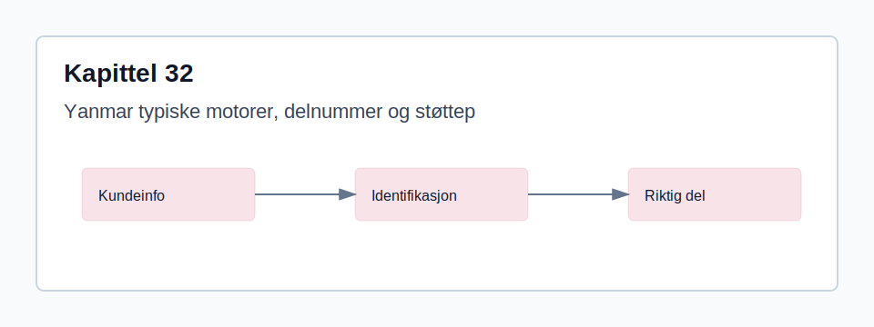

## Tekniske systemillustrasjoner

## Grundig forklaring
Hvordan kapitlets tema brukes i praktisk arbeid må forstås både teknisk og praktisk. I marine reservedeler er det sjelden nok å vite hva kunden kaller delen. Medarbeideren må forstå hvilken funksjon delen har, hvor den sitter, hvilken motorvariant den tilhører, og hva som skjer dersom feil del bestilles. Derfor skal tekniske data, kundens beskrivelse og dokumentert katalogoppslag alltid vurderes sammen.

En god sak har fire kjennetegn: den har tydelig identifikasjon, tydelig problem- eller delbeskrivelse, tydelig beslutningsgrunnlag og tydelig oppfølging. Dersom ett av disse punktene mangler, skal saken markeres som usikker før kunden får et bindende svar.

## Praktisk verkstedeksempel
Et verksted kontakter support fordi en Yanmar-motor skal klargjøres før avgang. De oppgir bare motormodell og et gammelt filter som eksempel. Riktig arbeidsmåte er å be om typeplate, bilde av eksisterende filter, driftstimer og om kunden ønsker enkeltfilter eller komplett servicekit. Når data er kontrollert, sendes et svar med korrekt delnummer, antall, leveringstid og forbehold om eventuelle erstatningsnummer.

## Kundesupporteksempel
Kunde: 'Jeg trenger en pumpe til Yanmar, helst i dag.' Profesjonelt svar: 'Jeg skal hjelpe deg raskt. For å unngå feil pumpe trenger jeg bilde av motorskiltet, bilde av pumpen montert og et nærbilde av eventuelt nummer på pumpen. Når jeg har dette, kontrollerer jeg riktig variant og gir deg lagerstatus og raskeste fraktalternativ.'

## Vanlige feil og årsaker
- feil impeller på grunn av pumpevariant.
- startproblem fra batteri, starter eller gløding.
- overoppheting ved tett sjøvannsinntak eller slitt impeller.
- feil reimlengde etter ombygging.

## Feilsøkingsflyt
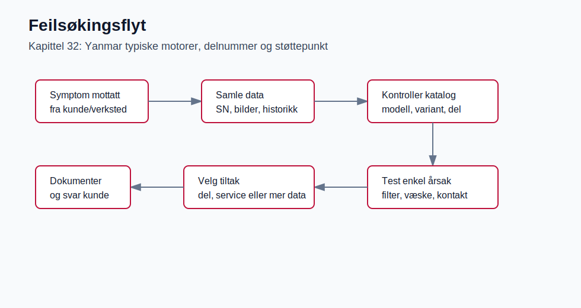

```mermaid
flowchart TD
    A[Symptom eller forespørsel mottatt] --> B[Samle serienummer, bilder og historikk]
    B --> C{Er motor og variant sikkert identifisert?}
    C -- Nei --> D[Be om mer dokumentasjon før del bekreftes]
    C -- Ja --> E[Kontroller delnummer og posisjon i katalog]
    E --> F{Stemmer symptom med foreslått del?}
    F -- Nei --> G[Foreslå feilsøking eller teknisk kontroll]
    F -- Ja --> H[Kontroller lager, pris og levering]
    H --> I[Send dokumentert kundesvar]
```

## Vedlikeholdsprosedyre
1. Avklar driftstimer, siste service og driftsmiljø.
2. Kontroller olje, filter, kjølevæske, sjøvannskrets, reimer, slanger og elektriske kontakter.
3. Sammenlign vedlikeholdsbehov med produsentens intervaller og faktisk bruk.
4. Anbefal servicekit når flere slitedeler bør skiftes samtidig.
5. Dokumenter hva som er anbefalt, hva kunden bestiller og eventuelle avvik fra normal prosedyre.

## Serienummeridentifikasjon
Yanmar identifiseres med modellkode og serienummer. På mindre fartøy er det også viktig å avklare marine gear, saildrive eller drev når forespørselen gjelder fremdrift, kjøling eller installasjonsdeler.

Minimumsdata bør være: fabrikat, modell, serienummer, eventuell product number/arrangement/CPL/motornummer, bilde av typeplate og bilde av motorens installasjon. Ved tvil skal saken stoppes for avklaring før del bekreftes.

## Reservedelsidentifikasjon
Kontroller modellkode, serienummer og montert utstyr før impeller, filtre, reimer, starter, dynamo, pumper eller pakninger bekreftes. Bilder er ofte avgjørende fordi små motorer kan ha trang og ombygget installasjon.

Sjekk alltid om delnummeret gjelder enkeltkomponent, reparasjonssett, servicekit eller komplett enhet. Kontroller også om varen er høyre/venstre, gammel/ny type, standard/oversize eller knyttet til en bestemt produksjonsperiode.

## Bestillingsprosedyre
1. Opprett eller oppdater sak med kunde, fartøy, kontaktperson og tidsfrist.
2. Verifiser motoridentifikasjon og lagre bildedokumentasjon.
3. Finn korrekt delnummer i relevant katalog eller leverandørgrunnlag.
4. Kontroller supersession, antall, lagerstatus, pris, returvilkår og leveringstid.
5. Send ordrebekreftelse med delnummer, beskrivelse, antall, pris, levering og forbehold.
6. Følg opp leveransen til kunden har mottatt varen eller saken er lukket.

## Kvalitetspunkter før svar
- Har vi nok data til å gi et sikkert svar?
- Er delnummeret kontrollert mot riktig motorvariant?
- Er kundens tidsfrist realistisk med valgt fraktmåte?
- Er eventuelle forbehold skrevet tydelig?
- Kan en kollega forstå beslutningen ved å lese saken senere?

## Kapittelsammendrag
Hovedpoenget i kapittel 32 er at profesjonelt reservedelsarbeid krever struktur. Teknisk kunnskap, engelske fagtermer, praktisk feilsøking, dokumentasjon og kundedialog må henge sammen. Når medarbeideren jobber systematisk, reduseres feilbestillinger, kunden får bedre svar, og verkstedet kan planlegge arbeidet tryggere.

## Kryssreferanser
- For forrige tema, se kapittel 31: Scania marine bruk, motoropplysninger og reservedelsnøkkel.
- For neste tema, se kapittel 33: Hvordan arbeide med eldre motorer og historiske deler.
- For grunnleggende identifikasjon, se kapittel 12 og 17.

## Fordypning for intern opplæring
Dette kapitlet skal brukes som arbeidsstandard, ikke bare som lesestoff. Når en ny medarbeider møter en sak om Yanmar, skal vedkommende trene på å gå rolig fra fakta til vurdering og deretter til handling. I en marinemotorforhandler er konsekvensen av en feil ofte større enn verdien av selve delen. En feil impeller, feil sensor, feil filterinnsats eller feil pakningssett kan føre til tapt verkstedtid, utsatt avgang, irritert kunde og i verste fall ny driftsstans. Derfor skal hver sak behandles som en teknisk beslutning med sporbar dokumentasjon.

I produsentdialog skal medarbeideren bruke produsentens egne betegnelser når de finnes: Model Code, Serial Number, Marine Gear, Saildrive, Parts List. Dette gir bedre presisjon overfor leverandør, reduserer risiko for misforståelser og gjør saken lettere å kontrollere senere.

Profesjonelt nivå i dette kapitlet betyr at medarbeideren kan arbeide sikkert med Yanmar-identifikasjon. Før kunden får et bindende svar, skal opplysningene i saken kontrolleres mot motorens identitet, faktisk installasjon og relevant produsentterminologi. Det praktiske målet er ikke å finne et raskt nummer, men å kunne forklare hvorfor valgt del, kontrollpunkt eller kundesvar er riktig for akkurat denne motoren. Når informasjon mangler, skal medarbeideren beskrive hva som mangler, hvorfor det er nødvendig, og hvilket neste steg som bringer saken videre.

## Tekniske forklaringer
Teknisk forståelse i dette kapitlet skal bygges rundt model code, serial number, marine gear, saildrive, service kit og compact installation. Medarbeideren må skille mellom synlig symptom, sannsynlig systemfeil og bestillbar komponent. En del kan se riktig ut på bilde, men likevel være feil dersom posisjon, variant, rating, kjøleroppsett, elektrisk plugg, monteringsside eller servicehistorikk ikke stemmer. Derfor skal teknisk vurdering alltid kobles til både funksjon og dokumentasjon: hva gjør komponenten, hvilket system påvirker den, og hvilken produsentkilde bekrefter at den passer.

I praksis betyr dette at tekniske data skal kobles til motorens faktiske installasjon. Marine motorer står ofte trangt, er utsatt for salt, vibrasjon, fukt og ujevnt belastningsmønster, og de kan være bygget om gjennom mange år. En motor kan ha original kjøler, ettermontert eksosbend, alternativ dynamo, endret filterbrakett eller annen sjøvannspumpe enn standard. Slike forhold gjør at delidentifikasjon må bygge på både produsentdata og synlig dokumentasjon fra motoren.

Produsentterminologi er en del av den tekniske forståelsen. Bruk uttrykk som Model Code, Serial Number, Marine Gear, Saildrive, Parts List, Raw Water Pump når de er relevante. Ikke oversett dem på en måte som fjerner presisjon. Skriv for eksempel «Engine Serial Number (ESN)» første gang og deretter «ESN» i saken dersom produsenten bruker dette. Skriv «Arrangement Number» når CAT-data krever det, «Product Number» når Volvo Penta bruker det, «CPL» når Cummins-konfigurasjon må kontrolleres, og «Model Code» når Yanmar-identifikasjon bygger på modellkode. Dette gjør dialogen med internasjonale leverandører mer presis.

## Illustrasjonsforslag
- Oversiktsdiagram som viser hvor Yanmar passer inn i total arbeidsflyt fra kundeforespørsel til levert del.
- Nærbilde av typeplate/motorskilt med markering av serienummer, motornummer, modell og eventuell variantkode.
- Sprengskisse med markert posisjon, delnummer, antall per motor og mulige alternative versjoner.
- Feilsøkingsflyt med beslutningspunkter: mangler data, stemmer symptom, kreves mer teknisk kontroll, kan ordre bekreftes.
- Sammenligningsbilde av gammel og ny del der forskjell i tilkobling, side, lengde eller sensorplugg er markert.

## Virkelige verkstedseksempler
Eksempel 1: Et verksted står med en demontert komponent på benken og kunden venter på avklaring før fartøyet kan settes tilbake i drift. Verkstedet sender et nærbilde av delen, men ingen motorplate. En uerfaren medarbeider kan bli fristet til å søke på nummeret som står på støpegodset. En profesjonell medarbeider svarer at støpenummer ikke nødvendigvis er bestillbart delnummer, ber om bilde av typeplate, oversiktsbilde av motoren og bilde av monteringsstedet, og forklarer at dette hindrer feilbestilling. Når informasjonen kommer, kontrolleres delnummer mot sprengskisse, posisjon og antall. Først da gis pris og leveringstid.

Eksempel 2: En kunde ringer sent på dagen og sier at motoren har høy temperatur etter service. Kunden ønsker ny termostat. Medarbeideren skal ikke automatisk konkludere med termostatfeil. Spørsmålene bør avklare om impeller er byttet, om sjøvannsfilteret er rent, om kjølevæskenivået er riktig, om alarmen kommer ved tomgang eller belastning, og om det finnes lekkasje rundt varmeveksler eller slanger. Dersom kunden likevel vil bestille termostat, dokumenteres at feilsøking er anbefalt, og delnummer kontrolleres mot serienummer før ordre.

Eksempel 3: En intern selger mottar en gammel faktura med et delnummer som ikke lenger finnes. Riktig prosess er å kontrollere supersession, se om ny del krever tilhørende pakning, boltsett eller adapter, og notere både gammelt og nytt nummer i saken. Kunden skal få vite at delen er erstattet, hva som leveres, og om det finnes monteringsforbehold.

## Reservedelsidentifisering i praksis
Reservedelsidentifisering skal følge en fast rekkefølge. Først kontrolleres motorens identitet. Deretter kontrolleres delens system: drivstoff, luft, kjøling, smøring, eksos, elektrisk eller mekanisk kraftoverføring. Så kontrolleres posisjon i sprengskisse eller parts list. Til slutt kontrolleres antall, variant, supersession og leveringsstatus. Denne rekkefølgen hindrer at medarbeideren hopper direkte fra kundens ord til et tilfeldig delnummer.

Når en del har synlig nummer, må nummeret tolkes riktig. Mange komponenter har produksjonsnummer, støpenummer, leverandørnummer eller revisjonskode som ikke er det samme som bestillbart part number. Et filter kan ha nummer fra filterprodusent, men motorprodusentens parts catalogue kan bruke et annet nummer. En pumpe kan ha nummer på lokk, hus og komplett enhet. Spør derfor alltid: gjelder nummeret komplett del, reparasjonssett, underkomponent eller produsentens råkomponent?

## Serienummer og motornummer
Serienummer og motornummer er grunnlaget for korrekt katalogoppslag. Be kunden sende bilde av typeplate eller dataplate. Dersom kunden skriver nummeret manuelt, skal nummeret likevel kontrolleres mot bilde når det er mulig. Noter hele nummeret, inkludert prefiks, suffiks, bindestrek, mellomrom og eventuelle bokstaver. På enkelte produsenter kan små forskjeller peke til forskjellig produksjonsperiode, rating eller konfigurasjon.

Bruk motornummer sammen med modell, variant og applikasjon. En motor som driver generator kan ha andre deler enn en fremdriftsmotor. En motor i yrkesbåt kan ha annen rating enn samme motor i fritidsbåt. En eldre motor kan være bygget om med ny dynamo, annen sjøvannspumpe eller uoriginal filterbrakett. Dersom typeplate mangler, bygg identifikasjonen gjennom flere kilder: servicebok, tidligere faktura, bilder av motorens sider, nummer på pumpe, filter, turbo og gear, samt opplysninger om fartøy og produksjonsår.

## Feilsøking steg for steg
1. Definer symptomet med kundens egne ord og skriv det i saken. Skill mellom «kunden ønsker del» og «kunden beskriver feil».
2. Avklar når feilen oppstår: start, tomgang, belastning, marsjfart, varm motor, kald motor eller etter nylig service.
3. Kontroller grunnleggende forhold: væskenivå, filter, luft i drivstoff, sjøvannsstrøm, reimer, elektriske kontakter, sikringer og synlige lekkasjer.
4. Knytt symptomet til system: lav effekt peker ofte mot luft/drivstoff/eksos, høy temperatur mot kjøling, lavt oljetrykk mot smøring/sensor, startproblem mot batteri/starter/gløding/drivstoff.
5. Be om bilder eller måledata dersom symptomet ikke kan kobles sikkert til en del. Dette kan være bilde av alarmdisplay, trykkmåling, temperaturmåling eller bilde av montert komponent.
6. Kontroller relevant delnummer mot serienummer og variant. Dersom flere alternativer finnes, forklar kunden hva som skiller dem.
7. Dokumenter anbefalt tiltak, usikkerhet og eventuelle forbehold før ordre bekreftes.

## Vedlikehold
Vedlikehold skal vurderes mot driftstimer, produsentens maintenance schedule og faktisk driftsmiljø. Marine motorer som går korte turer, mye tomgang eller i salt miljø kan trenge hyppigere kontroll enn standard intervall antyder. Nye medarbeidere skal lære å spørre om siste service, hvilke filter som ble byttet, hvilken olje som ble brukt, om impeller er kontrollert, og om kjølevæske eller anoder er byttet etter plan.

En god vedlikeholdsanbefaling er konkret. I stedet for å skrive «ta service», bør medarbeideren foreslå relevante deler: olje- og drivstoffilter, luftfilter, impeller, reim, pakninger, anoder, kjølevæske og eventuelt servicekit. Dersom kunden har ukjent servicehistorikk, bør komplett servicekit vurderes. Dersom kunden har hatt overoppheting, bør sjøvannskrets og varmeveksler kontrolleres før bare én komponent byttes.

## Vanlige feil
- Serienummer leses feil fordi et tegn forveksles, for eksempel O/0 eller I/1.
- Kunden oppgir modellnavn, men ikke variant, rating eller applikasjon.
- Del velges ut fra bilde alene uten kontroll mot sprengskisse eller produsentkatalog.
- Supersession aksepteres uten å kontrollere om ny del krever tilbehør, pakning eller ombygging.
- Hastepress gjør at leveringsløfte gis før lagerstatus og fraktmulighet er bekreftet.
- Saksnotat mangler grunnlaget for beslutningen, slik at kollega ikke kan etterprøve valget.

## Kontrollspørsmål
- Hva er den viktigste tekniske risikoen i en sak som gjelder Yanmar?
- Hvilke opplysninger må dokumenteres før bindende delnummer bekreftes?
- Hvordan forklarer du kunden hvorfor bilde av typeplate er nødvendig?
- Når bør du stoppe en ordre og be om mer dokumentasjon?
- Hvilke engelske produsentuttrykk bør du kunne bruke i denne typen sak?
- Hvordan dokumenterer du at et delnummer er erstattet av et nytt nummer?

## Praktisk sjekkliste for medarbeider
- Les saken som om en kollega skal overta den i morgen.
- Kontroller at motoridentifikasjon er dokumentert med bilde eller sikker kilde.
- Sjekk at delnummeret er knyttet til riktig posisjon i katalogen.
- Skriv tydelig om kunden har bedt om enkeltkomponent, servicekit eller komplett enhet.
- Noter om varen er spesialbestilling, utgått, erstattet eller ikke returbar.
- Send kundesvar med neste steg, ikke bare et løst delnummer.

## Kapittelspesifikk systemforståelse
For dette kapitlet er kjernen å forstå Yanmar-identifikasjon med model code, serial number og marine gear. Medarbeideren skal kunne forklare dette med praktiske ord til både kunde og kollega. Det betyr at teknisk teori må kobles til konkrete handlinger: hvilke data skal innhentes, hvilke komponenter kan være berørt, hvilken produsentterminologi skal brukes, og hva må dokumenteres før saken kan gå videre. Yanmar-saker krever ofte gode bilder fordi små motorrom og ombygginger påvirker delvalg.

Når systemet vurderes, skal medarbeideren først plassere problemet i riktig teknisk sammenheng. Dersom kunden beskriver en alarm, må man finne ut om alarmen kommer fra reelt mekanisk avvik, elektrisk sensorfeil, feil etter service eller feil tolkning av instrumentet. Dersom kunden beskriver en del, må man avklare om kunden mener komplett enhet, servicekit, reparasjonssett eller enkeltkomponent. Dersom kunden beskriver motoren med vanlig navn, må man kontrollere om produsenten bruker mer presise begreper i katalogen.

## Komponentoversikt og arbeidsgrense
Relevante komponenter og opplysninger i dette kapitlet omfatter: model code, serial number, saildrive, marine gear, mixing elbow, raw water pump, impeller og service kit. Listen er ikke ment som en erstatning for produsentens parts catalogue, men som en praktisk påminnelse om hva nye medarbeidere skal tenke på før de søker del. I interne saker skal komponentnavn skrives så presist som mulig. Bruk for eksempel «sjøvannspumpe / raw water pump» i stedet for bare «pumpe» når funksjonen er kjent, og «varmeveksler / heat exchanger» i stedet for bare «kjøler» når det er den komponenten saken gjelder.

Arbeidsgrensen for en reservedelsmedarbeider er også viktig. Medarbeideren skal ikke overta mekanikerens ansvar for demontering, måling eller diagnose på motoren, men skal kunne stille riktige spørsmål og foreslå riktig dokumentasjon. Når en sak går fra enkel delidentifikasjon til teknisk diagnose, skal dette markeres i saken. Da kan verksted, teknisk ansvarlig eller leverandør involveres med et klart spørsmål og et ryddig faktagrunnlag.

## Praktisk beslutningsregel
Bruk denne regelen i alle saker knyttet til kapitlet: Hvis motoridentifikasjon, komponentposisjon eller symptom ikke er sikkert nok dokumentert, skal medarbeideren ikke gi bindende delbekreftelse. Kunden kan få et foreløpig svar, men svaret må inneholde hva som mangler, hvorfor det mangler, og hva som skjer når informasjonen er mottatt. Dette er ikke treg service; det er profesjonell risikokontroll.

## Målrettet fordypning kapittel 31-40
### Yanmar: model code, serial number og kompakte installasjoner
Yanmar finnes ofte i mindre fartøy, seilbåter og kompakte motorrom. Model code, serial number og opplysninger om marine gear eller saildrive er derfor avgjørende. En forespørsel om impeller, mixing elbow, belt, starter, alternator eller raw water pump må knyttes til både motor og installasjon. Bilder er ofte ekstra viktige fordi motoren kan være trangt montert og endret gjennom tidligere service.

Vanlige verkstedcase er overoppheting etter impellerhavari, eksoslekkasje ved mixing elbow, startproblem fra batteri/starter/gløding eller feil reimlengde etter ombygging. Medarbeideren skal be om bilde av typeplate, eksisterende del og oversiktsbilde av front eller side der delen sitter. Ved saildrive-relaterte saker må egen identifikasjon på drev/gear innhentes.

### Praktisk anvendelse i opplæring
Bruk dette kapitlet i en case der deltakeren må avgjøre hvilke opplysninger som er sikre, hvilke som mangler, og om saken kan gå til tilbud eller må stoppes for avklaring. Deltakeren skal skrive en kort intern vurdering og et profesjonelt kundesvar. Instruktøren bør særlig se etter korrekt bruk av produsentterminologi, tydelige forbehold og evne til å skille reservedelsidentifikasjon fra mekanisk diagnose.

## Realistisk opplæring i praksis
### Verkstedhistorie
En typisk sak i dette temaet starter med modellkode mangler siste suffiks. Verkstedet trenger et raskt svar, men den erfarne medarbeideren stopper opp og spør først: hva vet vi sikkert, hva antar vi, og hva kan gi følgeskade hvis vi tar feil? I praksis betyr det at model code, serial og gear/saildrive må kobles til bilde, serienummer, komponentposisjon og kundens symptom før saken lukkes. Historien skal brukes i opplæring som en øvelse i å skrive et kort saksnotat: observasjon, vurdering, neste handling og forbehold.

### Kundehistorie
Kunden beskriver ofte problemet med driftsspråk: «motoren går tungt», «alarm kommer etter ti minutter», «jeg trenger den samme delen som sist» eller «båten skal ut i morgen». En profesjonell respons er rolig og konkret: bekreft behovet, forklar hvorfor identifikasjon trengs, be om riktig dokumentasjon og gi et realistisk tidspunkt for neste svar. Ikke korriger kunden unødvendig; oversett kundens språk til teknisk språk i saken.

### Typiske feil nye ansatte gjør
- søker på første synlige nummer uten å avklare om det er støpenummer, leverandørnummer eller bestillbart part number.
- lover levering før lagerstatus, frakt og returvilkår er kontrollert.
- antar at tidligere faktura alltid gjelder samme motorvariant.
- blander symptom og årsak, spesielt ved varme, lav effekt, startproblem og alarm.
- skriver for korte notater slik at kollega ikke kan forstå hvorfor valget ble tatt.

### Tips fra erfarne mekanikere og reservedelsselgere
- Se alltid etter systemet rundt delen: slanger, braketter, sensorer, reimer, kjølere og tilkoblinger forteller ofte mer enn delen alene.
- Still ett presist spørsmål om gangen når kunden er stresset; mange dårlige svar kommer av for lange spørsmålslister.
- Sammenlign gammel og ny del mot funksjon, ikke bare form. Riktig del skal passe, men også løse riktig problem.
- En erfaren reservedelsselger tenker i risiko: Hva er billigst å avklare nå, og hva blir dyrt hvis vi hopper over det?

### Vanlige kundespørsmål
| Spørsmål fra kunde | Profesjonelt svar |
|---|---|
| «Kan du bare sende samme del som sist?» | «Ja, hvis vi først bekrefter at det gjelder samme motor, samme posisjon og ingen supersession siden sist.» |
| «Holder det med bilde?» | «Bilde hjelper, men vi trenger også motoridentitet for å sikre variant og delnummer.» |
| «Hvorfor tar dette tid?» | «Fordi feil del kan gi ny driftsstans. Vi kontrollerer grunnlaget før vi lover levering.» |

### Beslutningstre for saken
| Trinn | Spørsmål | Handling |
|---|---|---|
| 1 | Er motoridentitet dokumentert med bilde eller sikker historikk? | Hvis nei: be om typeplate/dataplate eller alternativ dokumentasjon. |
| 2 | Er komponentens funksjon og posisjon kjent? | Hvis nei: be om oversiktsbilde og bilde av monteringssted. |
| 3 | Stemmer kundens symptom med delen som ønskes? | Hvis nei: anbefal feilsøking før del bestilles. |
| 4 | Finnes det supersession, kit eller variantvalg? | Kontroller produsentkilde og skriv forbehold i saken. |
| 5 | Kan pris, levering og returvilkår bekreftes? | Send dokumentert svar med neste steg og tydelig gyldighet. |

### Rask oppslagstabell
| Situasjon | Kontroller først | Vanlig fallgruve |
|---|---|---|
| Hasteordre | sikker motor-ID, lager, fraktfrist | levering loves før teknisk kontroll |
| Del fra bilde | posisjon, skala, tilkoblinger, nummer | bilde brukes som eneste beslutningsgrunnlag |
| Gammelt delnummer | supersession og kitinnhold | ny del krever ekstra pakning eller adapter |
| Uklart symptom | driftssituasjon, alarm, siste service | symptom blir tolket som sikker komponentfeil |

### Praktisk sjekkliste og inspeksjonsrutine
- Start med motoridentitet: fabrikat, modell, serienummer, variant, applikasjon og bilde av skilt.
- Kontroller området rundt komponenten: lekkasje, korrosjon, knekte fester, slitasje, varmemerker og uoriginale endringer.
- Spør om siste vedlikehold: olje, filter, impeller, reimer, kjølevæske, anoder og drivstoffilter.
- Noter driftstype: fritidsbruk, yrkesbruk, generator, fremdrift, tomgangsdrift eller langvarig høy belastning.
- Avklar om saken gjelder akutt drift, planlagt service, reklamasjon eller lagerpåfyll.

### Generelle vedlikeholdsintervaller som opplæringspunkt
| Kontrollpunkt | Typisk vurdering i opplæring | Må verifiseres |
|---|---|---|
| Olje og oljefilter | ofte basert på timer og kalender | produsentens maintenance schedule |
| Drivstoffilter/vannutskiller | hyppigere ved dårlig drivstoff eller sesongstart | motor- og filterspesifikasjon |
| Impeller og sjøvannskrets | kontrolleres særlig før sesong og etter varmgang | produsentens intervall og installasjon |
| Reimer, slanger og klemmer | visuell kontroll ved service og feilsøking | dimensjon, stramming og delnummer |

### Produsentverifikasjon
Yanmar model code, serial number, marine gear/saildrive og servicekit må kontrolleres i Yanmar-kilde. Marker tydelig i saken når svaret bygger på antakelse, eldre historikk, bilde uten motor-ID eller generell erfaring. Intervaller i tabellen er generelle opplæringspunkter. Faktiske intervaller styres av produsent, motorvariant, driftstimer, kalenderkrav, belastning og miljø.

## Produsentverifikasjon og faglig forbehold
For Yanmar skal model code, serial number, marine gear eller saildrive, servicekit og variantinformasjon kontrolleres mot Yanmar-dokumentasjon før delnummer låses. Marker saken internt dersom opplysningen bygger på antakelse, eldre historikk eller bilde uten bekreftet motoridentitet.

## Quiz med fasit
1. Hvilke tekniske data bør alltid samles før en del bekreftes?
2. Hvorfor er engelsk terminologi viktig i marine reservedeler?
3. Hva bør gjøres dersom kunden bare sender et bilde av delen?
4. Hvilke punkter bør kontrolleres før ordrebekreftelse sendes?
5. Hvorfor skal feilsøking dokumenteres, selv når kunden allerede ber om en bestemt del?

### Svar
1. Fabrikat, modell, serienummer, variantdata, bilde av typeplate, delnummer, posisjon og kundens symptombeskrivelse.
2. Fordi kataloger, portaler, servicemanualer og leverandørdialog ofte bruker engelske begreper som må forstås presist.
3. Be om serienummer, oversiktsbilde av motoren og eventuelle nummer på delen; bildet brukes som støtte, ikke eneste grunnlag.
4. Delnummer, antall, variant, pris, lagerstatus, leveringstid, frakt, returvilkår og eventuelle forbehold.
5. Fordi symptomet kan ha flere årsaker, og dokumentasjon viser hvorfor anbefalingen ble gitt.

---

# Kapittel 33: Hvordan arbeide med eldre motorer og historiske deler

## Kapittelrolle
Dette kapitlet gir en grundig praktisk innføring i eldre motorer. Temaet er viktig fordi reservedelsarbeid i marine miljøer kombinerer teknisk forståelse, presis kundedialog, dokumentert saksbehandling og realistisk leveranseoppfølging. Målet er at en ny medarbeider skal kunne bruke kunnskapen direkte i arbeid med verksted, kunde, lager og leverandør.

## Læringsmål
Etter kapitlet skal deltakeren kunne:
- forklare hovedbegrepene innen eldre motorer
- bruke serienummer, modellinformasjon og delnummer i praktisk reservedelsarbeid
- kommunisere trygt med kunde, verksted, lager og leverandør
- dokumentere beslutninger slik at andre kan etterprøve saken
- kjenne igjen vanlige feil og velge riktig neste handling

## English technical terminology
- **Serial Number:** engelsk fagterm som ofte brukes i kataloger, servicelitteratur, leverandørportaler og internasjonal kundedialog.
- **Part Number:** engelsk fagterm som ofte brukes i kataloger, servicelitteratur, leverandørportaler og internasjonal kundedialog.
- **Engine Model:** engelsk fagterm som ofte brukes i kataloger, servicelitteratur, leverandørportaler og internasjonal kundedialog.
- **Variant:** engelsk fagterm som ofte brukes i kataloger, servicelitteratur, leverandørportaler og internasjonal kundedialog.
- **Service Kit:** engelsk fagterm som ofte brukes i kataloger, servicelitteratur, leverandørportaler og internasjonal kundedialog.
- **Troubleshooting:** engelsk fagterm som ofte brukes i kataloger, servicelitteratur, leverandørportaler og internasjonal kundedialog.
- **Maintenance:** engelsk fagterm som ofte brukes i kataloger, servicelitteratur, leverandørportaler og internasjonal kundedialog.
- **Ordering Procedure:** engelsk fagterm som ofte brukes i kataloger, servicelitteratur, leverandørportaler og internasjonal kundedialog.
- **Supersession:** engelsk fagterm som ofte brukes i kataloger, servicelitteratur, leverandørportaler og internasjonal kundedialog.
- **Technical Support:** engelsk fagterm som ofte brukes i kataloger, servicelitteratur, leverandørportaler og internasjonal kundedialog.

## Hoveddiagram
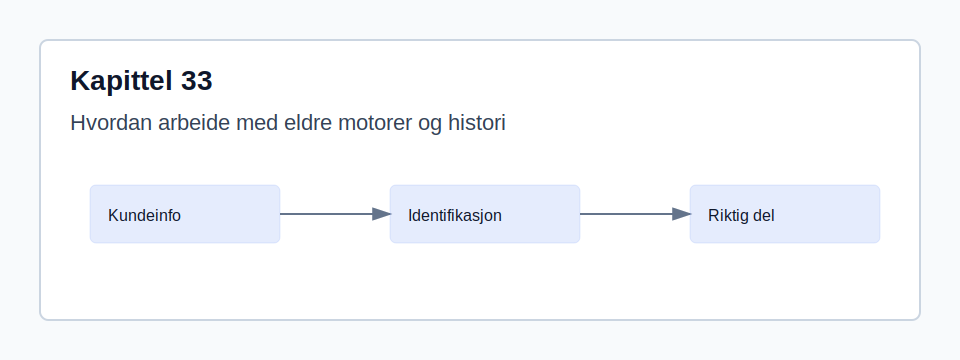

## Tekniske systemillustrasjoner

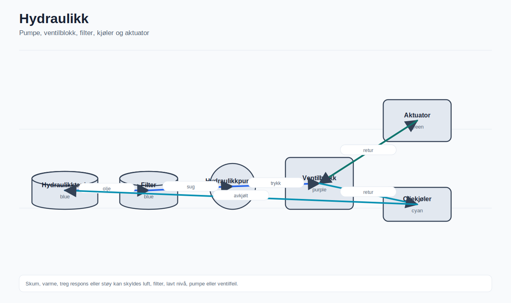

## Grundig forklaring
Hvordan historiske deler, utgåtte nummer og ombygde motorer håndteres må forstås både teknisk og praktisk. I marine reservedeler er det sjelden nok å vite hva kunden kaller delen. Medarbeideren må forstå hvilken funksjon delen har, hvor den sitter, hvilken motorvariant den tilhører, og hva som skjer dersom feil del bestilles. Derfor skal tekniske data, kundens beskrivelse og dokumentert katalogoppslag alltid vurderes sammen.

En god sak har fire kjennetegn: den har tydelig identifikasjon, tydelig problem- eller delbeskrivelse, tydelig beslutningsgrunnlag og tydelig oppfølging. Dersom ett av disse punktene mangler, skal saken markeres som usikker før kunden får et bindende svar.

## Praktisk verkstedeksempel
Et verksted står med demontert komponent og trenger rask avklaring. Medarbeideren registrerer kunde, fartøy, motorinformasjon og tidsfrist, ber om bilder av typeplate og komponent, sjekker katalog og lager, og sender et kort skriftlig svar med valgt del, grunnlag for valget og neste oppdateringstidspunkt.

## Kundesupporteksempel
Kunde: 'Motoren går dårlig, kan dere sende riktig del?' Profesjonelt svar: 'Vi kan hjelpe, men først må vi skille mellom symptom og delbehov. Send serienummer, bilde av motorplate, bilde av området feilen gjelder og en kort beskrivelse av når feilen oppstår. Da kan vi foreslå riktig del eller riktig neste feilsøkingstrinn.'

## Vanlige feil og årsaker
- feil eller ufullstendig serienummer.
- delnummer som er erstattet uten at saken dokumenteres.
- symptom som tolkes som delbehov uten feilsøking.
- kunde har bilde av lignende del, men ikke korrekt motorvariant.
- manglende avklaring av antall, side, posisjon eller leveringstid.

## Feilsøkingsflyt
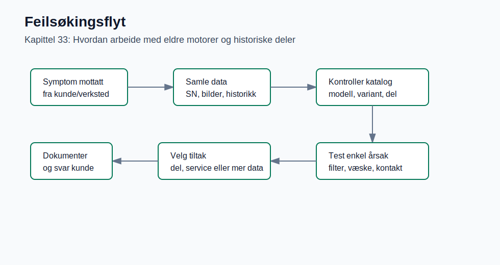

```mermaid
flowchart TD
    A[Symptom eller forespørsel mottatt] --> B[Samle serienummer, bilder og historikk]
    B --> C{Er motor og variant sikkert identifisert?}
    C -- Nei --> D[Be om mer dokumentasjon før del bekreftes]
    C -- Ja --> E[Kontroller delnummer og posisjon i katalog]
    E --> F{Stemmer symptom med foreslått del?}
    F -- Nei --> G[Foreslå feilsøking eller teknisk kontroll]
    F -- Ja --> H[Kontroller lager, pris og levering]
    H --> I[Send dokumentert kundesvar]
```

## Vedlikeholdsprosedyre
1. Avklar driftstimer, siste service og driftsmiljø.
2. Kontroller olje, filter, kjølevæske, sjøvannskrets, reimer, slanger og elektriske kontakter.
3. Sammenlign vedlikeholdsbehov med produsentens intervaller og faktisk bruk.
4. Anbefal servicekit når flere slitedeler bør skiftes samtidig.
5. Dokumenter hva som er anbefalt, hva kunden bestiller og eventuelle avvik fra normal prosedyre.

## Serienummeridentifikasjon
Serienummeridentifikasjon starter med å finne typeplate, motornummer eller annen unik identifikasjon. Be om bilde, ikke bare avskrift, fordi feil tegn, mellomrom og prefiks kan endre katalogoppslaget. Når serienummer ikke finnes, bygges identifikasjonen med modell, produksjonsår, bilder, tidligere fakturaer, servicehistorikk og delnummer fra monterte komponenter.

Minimumsdata bør være: fabrikat, modell, serienummer, eventuell product number/arrangement/CPL/motornummer, bilde av typeplate og bilde av motorens installasjon. Ved tvil skal saken stoppes for avklaring før del bekreftes.

## Reservedelsidentifikasjon
Reservedelsidentifikasjon skal bekrefte delnummer, posisjon, antall per motor, variant, side og eventuell erstatning. Dersom kunden oppgir et gammelt nummer, må det kontrolleres mot supersession. Dersom kunden bare sender bilde, skal bildet brukes som støtte, ikke som eneste grunnlag for bestilling.

Sjekk alltid om delnummeret gjelder enkeltkomponent, reparasjonssett, servicekit eller komplett enhet. Kontroller også om varen er høyre/venstre, gammel/ny type, standard/oversize eller knyttet til en bestemt produksjonsperiode.

## Bestillingsprosedyre
1. Opprett eller oppdater sak med kunde, fartøy, kontaktperson og tidsfrist.
2. Verifiser motoridentifikasjon og lagre bildedokumentasjon.
3. Finn korrekt delnummer i relevant katalog eller leverandørgrunnlag.
4. Kontroller supersession, antall, lagerstatus, pris, returvilkår og leveringstid.
5. Send ordrebekreftelse med delnummer, beskrivelse, antall, pris, levering og forbehold.
6. Følg opp leveransen til kunden har mottatt varen eller saken er lukket.

## Kvalitetspunkter før svar
- Har vi nok data til å gi et sikkert svar?
- Er delnummeret kontrollert mot riktig motorvariant?
- Er kundens tidsfrist realistisk med valgt fraktmåte?
- Er eventuelle forbehold skrevet tydelig?
- Kan en kollega forstå beslutningen ved å lese saken senere?

## Kapittelsammendrag
Hovedpoenget i kapittel 33 er at profesjonelt reservedelsarbeid krever struktur. Teknisk kunnskap, engelske fagtermer, praktisk feilsøking, dokumentasjon og kundedialog må henge sammen. Når medarbeideren jobber systematisk, reduseres feilbestillinger, kunden får bedre svar, og verkstedet kan planlegge arbeidet tryggere.

## Kryssreferanser
- For forrige tema, se kapittel 32: Yanmar typiske motorer, delnummer og støttepunkt.
- For neste tema, se kapittel 34: Hvordan håndtere motorer med manglende dokumentasjon.
- For grunnleggende identifikasjon, se kapittel 12 og 17.
- For merkevise eksempler, se kapitlene 26-32.

## Fordypning for intern opplæring
Dette kapitlet skal brukes som arbeidsstandard, ikke bare som lesestoff. Når en ny medarbeider møter en sak om eldre motorer, skal vedkommende trene på å gå rolig fra fakta til vurdering og deretter til handling. I en marinemotorforhandler er konsekvensen av en feil ofte større enn verdien av selve delen. En feil impeller, feil sensor, feil filterinnsats eller feil pakningssett kan føre til tapt verkstedtid, utsatt avgang, irritert kunde og i verste fall ny driftsstans. Derfor skal hver sak behandles som en teknisk beslutning med sporbar dokumentasjon.

Profesjonelt nivå i dette kapitlet betyr at medarbeideren kan arbeide sikkert med eldre motorer. Før kunden får et bindende svar, skal opplysningene i saken kontrolleres mot motorens identitet, faktisk installasjon og relevant produsentterminologi. Det praktiske målet er ikke å finne et raskt nummer, men å kunne forklare hvorfor valgt del, kontrollpunkt eller kundesvar er riktig for akkurat denne motoren. Når informasjon mangler, skal medarbeideren beskrive hva som mangler, hvorfor det er nødvendig, og hvilket neste steg som bringer saken videre.

## Tekniske forklaringer
Teknisk forståelse i dette kapitlet skal bygges rundt utgåtte delnummer, historiske kataloger, retrofit, reparasjonssett og teknisk sammenligning. Medarbeideren må skille mellom synlig symptom, sannsynlig systemfeil og bestillbar komponent. En del kan se riktig ut på bilde, men likevel være feil dersom posisjon, variant, rating, kjøleroppsett, elektrisk plugg, monteringsside eller servicehistorikk ikke stemmer. Derfor skal teknisk vurdering alltid kobles til både funksjon og dokumentasjon: hva gjør komponenten, hvilket system påvirker den, og hvilken produsentkilde bekrefter at den passer.

I praksis betyr dette at tekniske data skal kobles til motorens faktiske installasjon. Marine motorer står ofte trangt, er utsatt for salt, vibrasjon, fukt og ujevnt belastningsmønster, og de kan være bygget om gjennom mange år. En motor kan ha original kjøler, ettermontert eksosbend, alternativ dynamo, endret filterbrakett eller annen sjøvannspumpe enn standard. Slike forhold gjør at delidentifikasjon må bygge på både produsentdata og synlig dokumentasjon fra motoren.

Produsentterminologi er en del av den tekniske forståelsen. Bruk uttrykk som Serial Number, Engine Number, Part Number, Service Kit, Exploded View, Supersession når de er relevante. Ikke oversett dem på en måte som fjerner presisjon. Skriv for eksempel «Engine Serial Number (ESN)» første gang og deretter «ESN» i saken dersom produsenten bruker dette. Skriv «Arrangement Number» når CAT-data krever det, «Product Number» når Volvo Penta bruker det, «CPL» når Cummins-konfigurasjon må kontrolleres, og «Model Code» når Yanmar-identifikasjon bygger på modellkode. Dette gjør dialogen med internasjonale leverandører mer presis.

## Illustrasjonsforslag
- Oversiktsdiagram som viser hvor eldre motorer passer inn i total arbeidsflyt fra kundeforespørsel til levert del.
- Nærbilde av typeplate/motorskilt med markering av serienummer, motornummer, modell og eventuell variantkode.
- Sprengskisse med markert posisjon, delnummer, antall per motor og mulige alternative versjoner.
- Feilsøkingsflyt med beslutningspunkter: mangler data, stemmer symptom, kreves mer teknisk kontroll, kan ordre bekreftes.
- Sammenligningsbilde av gammel og ny del der forskjell i tilkobling, side, lengde eller sensorplugg er markert.

## Virkelige verkstedseksempler
Eksempel 1: Et verksted står med en demontert komponent på benken og kunden venter på avklaring før fartøyet kan settes tilbake i drift. Verkstedet sender et nærbilde av delen, men ingen motorplate. En uerfaren medarbeider kan bli fristet til å søke på nummeret som står på støpegodset. En profesjonell medarbeider svarer at støpenummer ikke nødvendigvis er bestillbart delnummer, ber om bilde av typeplate, oversiktsbilde av motoren og bilde av monteringsstedet, og forklarer at dette hindrer feilbestilling. Når informasjonen kommer, kontrolleres delnummer mot sprengskisse, posisjon og antall. Først da gis pris og leveringstid.

Eksempel 2: En kunde ringer sent på dagen og sier at motoren har høy temperatur etter service. Kunden ønsker ny termostat. Medarbeideren skal ikke automatisk konkludere med termostatfeil. Spørsmålene bør avklare om impeller er byttet, om sjøvannsfilteret er rent, om kjølevæskenivået er riktig, om alarmen kommer ved tomgang eller belastning, og om det finnes lekkasje rundt varmeveksler eller slanger. Dersom kunden likevel vil bestille termostat, dokumenteres at feilsøking er anbefalt, og delnummer kontrolleres mot serienummer før ordre.

Eksempel 3: En intern selger mottar en gammel faktura med et delnummer som ikke lenger finnes. Riktig prosess er å kontrollere supersession, se om ny del krever tilhørende pakning, boltsett eller adapter, og notere både gammelt og nytt nummer i saken. Kunden skal få vite at delen er erstattet, hva som leveres, og om det finnes monteringsforbehold.

## Reservedelsidentifisering i praksis
Reservedelsidentifisering skal følge en fast rekkefølge. Først kontrolleres motorens identitet. Deretter kontrolleres delens system: drivstoff, luft, kjøling, smøring, eksos, elektrisk eller mekanisk kraftoverføring. Så kontrolleres posisjon i sprengskisse eller parts list. Til slutt kontrolleres antall, variant, supersession og leveringsstatus. Denne rekkefølgen hindrer at medarbeideren hopper direkte fra kundens ord til et tilfeldig delnummer.

Når en del har synlig nummer, må nummeret tolkes riktig. Mange komponenter har produksjonsnummer, støpenummer, leverandørnummer eller revisjonskode som ikke er det samme som bestillbart part number. Et filter kan ha nummer fra filterprodusent, men motorprodusentens parts catalogue kan bruke et annet nummer. En pumpe kan ha nummer på lokk, hus og komplett enhet. Spør derfor alltid: gjelder nummeret komplett del, reparasjonssett, underkomponent eller produsentens råkomponent?

## Serienummer og motornummer
Serienummer og motornummer er grunnlaget for korrekt katalogoppslag. Be kunden sende bilde av typeplate eller dataplate. Dersom kunden skriver nummeret manuelt, skal nummeret likevel kontrolleres mot bilde når det er mulig. Noter hele nummeret, inkludert prefiks, suffiks, bindestrek, mellomrom og eventuelle bokstaver. På enkelte produsenter kan små forskjeller peke til forskjellig produksjonsperiode, rating eller konfigurasjon.

Bruk motornummer sammen med modell, variant og applikasjon. En motor som driver generator kan ha andre deler enn en fremdriftsmotor. En motor i yrkesbåt kan ha annen rating enn samme motor i fritidsbåt. En eldre motor kan være bygget om med ny dynamo, annen sjøvannspumpe eller uoriginal filterbrakett. Dersom typeplate mangler, bygg identifikasjonen gjennom flere kilder: servicebok, tidligere faktura, bilder av motorens sider, nummer på pumpe, filter, turbo og gear, samt opplysninger om fartøy og produksjonsår.

## Feilsøking steg for steg
1. Definer symptomet med kundens egne ord og skriv det i saken. Skill mellom «kunden ønsker del» og «kunden beskriver feil».
2. Avklar når feilen oppstår: start, tomgang, belastning, marsjfart, varm motor, kald motor eller etter nylig service.
3. Kontroller grunnleggende forhold: væskenivå, filter, luft i drivstoff, sjøvannsstrøm, reimer, elektriske kontakter, sikringer og synlige lekkasjer.
4. Knytt symptomet til system: lav effekt peker ofte mot luft/drivstoff/eksos, høy temperatur mot kjøling, lavt oljetrykk mot smøring/sensor, startproblem mot batteri/starter/gløding/drivstoff.
5. Be om bilder eller måledata dersom symptomet ikke kan kobles sikkert til en del. Dette kan være bilde av alarmdisplay, trykkmåling, temperaturmåling eller bilde av montert komponent.
6. Kontroller relevant delnummer mot serienummer og variant. Dersom flere alternativer finnes, forklar kunden hva som skiller dem.
7. Dokumenter anbefalt tiltak, usikkerhet og eventuelle forbehold før ordre bekreftes.

## Vedlikehold
Vedlikehold skal vurderes mot driftstimer, produsentens maintenance schedule og faktisk driftsmiljø. Marine motorer som går korte turer, mye tomgang eller i salt miljø kan trenge hyppigere kontroll enn standard intervall antyder. Nye medarbeidere skal lære å spørre om siste service, hvilke filter som ble byttet, hvilken olje som ble brukt, om impeller er kontrollert, og om kjølevæske eller anoder er byttet etter plan.

En god vedlikeholdsanbefaling er konkret. I stedet for å skrive «ta service», bør medarbeideren foreslå relevante deler: olje- og drivstoffilter, luftfilter, impeller, reim, pakninger, anoder, kjølevæske og eventuelt servicekit. Dersom kunden har ukjent servicehistorikk, bør komplett servicekit vurderes. Dersom kunden har hatt overoppheting, bør sjøvannskrets og varmeveksler kontrolleres før bare én komponent byttes.

## Vanlige feil
- Serienummer leses feil fordi et tegn forveksles, for eksempel O/0 eller I/1.
- Kunden oppgir modellnavn, men ikke variant, rating eller applikasjon.
- Del velges ut fra bilde alene uten kontroll mot sprengskisse eller produsentkatalog.
- Supersession aksepteres uten å kontrollere om ny del krever tilbehør, pakning eller ombygging.
- Hastepress gjør at leveringsløfte gis før lagerstatus og fraktmulighet er bekreftet.
- Saksnotat mangler grunnlaget for beslutningen, slik at kollega ikke kan etterprøve valget.

## Kontrollspørsmål
- Hva er den viktigste tekniske risikoen i en sak som gjelder eldre motorer?
- Hvilke opplysninger må dokumenteres før bindende delnummer bekreftes?
- Hvordan forklarer du kunden hvorfor bilde av typeplate er nødvendig?
- Når bør du stoppe en ordre og be om mer dokumentasjon?
- Hvilke engelske produsentuttrykk bør du kunne bruke i denne typen sak?
- Hvordan dokumenterer du at et delnummer er erstattet av et nytt nummer?

## Praktisk sjekkliste for medarbeider
- Les saken som om en kollega skal overta den i morgen.
- Kontroller at motoridentifikasjon er dokumentert med bilde eller sikker kilde.
- Sjekk at delnummeret er knyttet til riktig posisjon i katalogen.
- Skriv tydelig om kunden har bedt om enkeltkomponent, servicekit eller komplett enhet.
- Noter om varen er spesialbestilling, utgått, erstattet eller ikke returbar.
- Send kundesvar med neste steg, ikke bare et løst delnummer.

## Kapittelspesifikk systemforståelse
For dette kapitlet er kjernen å forstå arbeid med eldre motorer, historiske deler og utgåtte nummer. Medarbeideren skal kunne forklare dette med praktiske ord til både kunde og kollega. Det betyr at teknisk teori må kobles til konkrete handlinger: hvilke data skal innhentes, hvilke komponenter kan være berørt, hvilken produsentterminologi skal brukes, og hva må dokumenteres før saken kan gå videre. Eldre motorer krever mer dokumentasjon, ikke mindre, fordi standard portaler kan mangle data.

Når systemet vurderes, skal medarbeideren først plassere problemet i riktig teknisk sammenheng. Dersom kunden beskriver en alarm, må man finne ut om alarmen kommer fra reelt mekanisk avvik, elektrisk sensorfeil, feil etter service eller feil tolkning av instrumentet. Dersom kunden beskriver en del, må man avklare om kunden mener komplett enhet, servicekit, reparasjonssett eller enkeltkomponent. Dersom kunden beskriver motoren med vanlig navn, må man kontrollere om produsenten bruker mer presise begreper i katalogen.

## Komponentoversikt og arbeidsgrense
Relevante komponenter og opplysninger i dette kapitlet omfatter: legacy part number, supersession, reman, used part, repair kit, old invoice og paper manual. Listen er ikke ment som en erstatning for produsentens parts catalogue, men som en praktisk påminnelse om hva nye medarbeidere skal tenke på før de søker del. I interne saker skal komponentnavn skrives så presist som mulig. Bruk for eksempel «sjøvannspumpe / raw water pump» i stedet for bare «pumpe» når funksjonen er kjent, og «varmeveksler / heat exchanger» i stedet for bare «kjøler» når det er den komponenten saken gjelder.

Arbeidsgrensen for en reservedelsmedarbeider er også viktig. Medarbeideren skal ikke overta mekanikerens ansvar for demontering, måling eller diagnose på motoren, men skal kunne stille riktige spørsmål og foreslå riktig dokumentasjon. Når en sak går fra enkel delidentifikasjon til teknisk diagnose, skal dette markeres i saken. Da kan verksted, teknisk ansvarlig eller leverandør involveres med et klart spørsmål og et ryddig faktagrunnlag.

## Praktisk beslutningsregel
Bruk denne regelen i alle saker knyttet til kapitlet: Hvis motoridentifikasjon, komponentposisjon eller symptom ikke er sikkert nok dokumentert, skal medarbeideren ikke gi bindende delbekreftelse. Kunden kan få et foreløpig svar, men svaret må inneholde hva som mangler, hvorfor det mangler, og hva som skjer når informasjonen er mottatt. Dette er ikke treg service; det er profesjonell risikokontroll.

## Målrettet fordypning kapittel 31-40
### Eldre motorer og historiske reservedeler
Eldre motorer krever mer metodikk fordi portaler, delnummer og leverandørtilgang kan være ufullstendige. Bruk tidligere fakturaer, gamle parts manuals, servicebok, bilder, komponentnummer og måldata som samlet grunnlag. Begreper som legacy part number, supersession, discontinued, remanufactured, repair kit og alternative part skal brukes presist.

Når del er utgått, skal medarbeideren skille mellom original erstatning, reman-løsning, reparasjonssett, brukt del eller teknisk ombygging. Ikke lov kompatibilitet uten dokumentasjon. Ved eldre motorer er det også vanlig at installasjonen er endret: annen dynamo, filterbrakett, sjøvannspumpe, eksosbend eller kjøler. Derfor skal bilder av montert løsning alltid veie tungt sammen med katalogdata.

### Praktisk anvendelse i opplæring
Bruk dette kapitlet i en case der deltakeren må avgjøre hvilke opplysninger som er sikre, hvilke som mangler, og om saken kan gå til tilbud eller må stoppes for avklaring. Deltakeren skal skrive en kort intern vurdering og et profesjonelt kundesvar. Instruktøren bør særlig se etter korrekt bruk av produsentterminologi, tydelige forbehold og evne til å skille reservedelsidentifikasjon fra mekanisk diagnose.

## Realistisk opplæring i praksis
### Verkstedhistorie
En typisk sak i dette temaet starter med utgått delnummer finnes bare på gammel faktura. Verkstedet trenger et raskt svar, men den erfarne medarbeideren stopper opp og spør først: hva vet vi sikkert, hva antar vi, og hva kan gi følgeskade hvis vi tar feil? I praksis betyr det at historikk og retrofit må kobles til bilde, serienummer, komponentposisjon og kundens symptom før saken lukkes. Historien skal brukes i opplæring som en øvelse i å skrive et kort saksnotat: observasjon, vurdering, neste handling og forbehold.

### Kundehistorie
Kunden beskriver ofte problemet med driftsspråk: «motoren går tungt», «alarm kommer etter ti minutter», «jeg trenger den samme delen som sist» eller «båten skal ut i morgen». En profesjonell respons er rolig og konkret: bekreft behovet, forklar hvorfor identifikasjon trengs, be om riktig dokumentasjon og gi et realistisk tidspunkt for neste svar. Ikke korriger kunden unødvendig; oversett kundens språk til teknisk språk i saken.

### Typiske feil nye ansatte gjør
- søker på første synlige nummer uten å avklare om det er støpenummer, leverandørnummer eller bestillbart part number.
- lover levering før lagerstatus, frakt og returvilkår er kontrollert.
- antar at tidligere faktura alltid gjelder samme motorvariant.
- blander symptom og årsak, spesielt ved varme, lav effekt, startproblem og alarm.
- skriver for korte notater slik at kollega ikke kan forstå hvorfor valget ble tatt.

### Tips fra erfarne mekanikere og reservedelsselgere
- Se alltid etter systemet rundt delen: slanger, braketter, sensorer, reimer, kjølere og tilkoblinger forteller ofte mer enn delen alene.
- Still ett presist spørsmål om gangen når kunden er stresset; mange dårlige svar kommer av for lange spørsmålslister.
- Sammenlign gammel og ny del mot funksjon, ikke bare form. Riktig del skal passe, men også løse riktig problem.
- En erfaren reservedelsselger tenker i risiko: Hva er billigst å avklare nå, og hva blir dyrt hvis vi hopper over det?

### Vanlige kundespørsmål
| Spørsmål fra kunde | Profesjonelt svar |
|---|---|
| «Kan du bare sende samme del som sist?» | «Ja, hvis vi først bekrefter at det gjelder samme motor, samme posisjon og ingen supersession siden sist.» |
| «Holder det med bilde?» | «Bilde hjelper, men vi trenger også motoridentitet for å sikre variant og delnummer.» |
| «Hvorfor tar dette tid?» | «Fordi feil del kan gi ny driftsstans. Vi kontrollerer grunnlaget før vi lover levering.» |

### Beslutningstre for saken
| Trinn | Spørsmål | Handling |
|---|---|---|
| 1 | Er motoridentitet dokumentert med bilde eller sikker historikk? | Hvis nei: be om typeplate/dataplate eller alternativ dokumentasjon. |
| 2 | Er komponentens funksjon og posisjon kjent? | Hvis nei: be om oversiktsbilde og bilde av monteringssted. |
| 3 | Stemmer kundens symptom med delen som ønskes? | Hvis nei: anbefal feilsøking før del bestilles. |
| 4 | Finnes det supersession, kit eller variantvalg? | Kontroller produsentkilde og skriv forbehold i saken. |
| 5 | Kan pris, levering og returvilkår bekreftes? | Send dokumentert svar med neste steg og tydelig gyldighet. |

### Rask oppslagstabell
| Situasjon | Kontroller først | Vanlig fallgruve |
|---|---|---|
| Hasteordre | sikker motor-ID, lager, fraktfrist | levering loves før teknisk kontroll |
| Del fra bilde | posisjon, skala, tilkoblinger, nummer | bilde brukes som eneste beslutningsgrunnlag |
| Gammelt delnummer | supersession og kitinnhold | ny del krever ekstra pakning eller adapter |
| Uklart symptom | driftssituasjon, alarm, siste service | symptom blir tolket som sikker komponentfeil |

### Praktisk sjekkliste og inspeksjonsrutine
- Start med motoridentitet: fabrikat, modell, serienummer, variant, applikasjon og bilde av skilt.
- Kontroller området rundt komponenten: lekkasje, korrosjon, knekte fester, slitasje, varmemerker og uoriginale endringer.
- Spør om siste vedlikehold: olje, filter, impeller, reimer, kjølevæske, anoder og drivstoffilter.
- Noter driftstype: fritidsbruk, yrkesbruk, generator, fremdrift, tomgangsdrift eller langvarig høy belastning.
- Avklar om saken gjelder akutt drift, planlagt service, reklamasjon eller lagerpåfyll.

### Generelle vedlikeholdsintervaller som opplæringspunkt
| Kontrollpunkt | Typisk vurdering i opplæring | Må verifiseres |
|---|---|---|
| Olje og oljefilter | ofte basert på timer og kalender | produsentens maintenance schedule |
| Drivstoffilter/vannutskiller | hyppigere ved dårlig drivstoff eller sesongstart | motor- og filterspesifikasjon |
| Impeller og sjøvannskrets | kontrolleres særlig før sesong og etter varmgang | produsentens intervall og installasjon |
| Reimer, slanger og klemmer | visuell kontroll ved service og feilsøking | dimensjon, stramming og delnummer |

### Produsentverifikasjon
Alle konkrete delnumre, momentverdier, serviceintervaller, garantikrav, programvaredata og produsentspesifikke grenser skal kontrolleres mot offisiell produsentdokumentasjon før de brukes i tilbud, ordre eller verkstedinstruks. Marker tydelig i saken når svaret bygger på antakelse, eldre historikk, bilde uten motor-ID eller generell erfaring. Intervaller i tabellen er generelle opplæringspunkter. Faktiske intervaller styres av produsent, motorvariant, driftstimer, kalenderkrav, belastning og miljø.

## Produsentverifikasjon og faglig forbehold
Når saken gjelder delnummer, serienummer, serviceintervall, momentdata, garanti, elektronikk eller kompatibilitet, skal opplysningen verifiseres mot produsentens dokumentasjon eller autorisert leverandør før bindende tilbud eller teknisk konklusjon gis. Manualen beskriver arbeidsmetode og risikopunkter; den erstatter ikke gjeldende parts catalogue, service manual, service bulletin eller produsentportal. Marker saken internt dersom opplysningen bygger på antakelse, eldre historikk eller bilde uten bekreftet motoridentitet.

## Quiz med fasit
1. Hvilke tekniske data bør alltid samles før en del bekreftes?
2. Hvorfor er engelsk terminologi viktig i marine reservedeler?
3. Hva bør gjøres dersom kunden bare sender et bilde av delen?
4. Hvilke punkter bør kontrolleres før ordrebekreftelse sendes?
5. Hvorfor skal feilsøking dokumenteres, selv når kunden allerede ber om en bestemt del?

### Svar
1. Fabrikat, modell, serienummer, variantdata, bilde av typeplate, delnummer, posisjon og kundens symptombeskrivelse.
2. Fordi kataloger, portaler, servicemanualer og leverandørdialog ofte bruker engelske begreper som må forstås presist.
3. Be om serienummer, oversiktsbilde av motoren og eventuelle nummer på delen; bildet brukes som støtte, ikke eneste grunnlag.
4. Delnummer, antall, variant, pris, lagerstatus, leveringstid, frakt, returvilkår og eventuelle forbehold.
5. Fordi symptomet kan ha flere årsaker, og dokumentasjon viser hvorfor anbefalingen ble gitt.

---

# Kapittel 34: Hvordan håndtere motorer med manglende dokumentasjon

## Kapittelrolle
Dette kapitlet gir en grundig praktisk innføring i manglende dokumentasjon. Temaet er viktig fordi reservedelsarbeid i marine miljøer kombinerer teknisk forståelse, presis kundedialog, dokumentert saksbehandling og realistisk leveranseoppfølging. Målet er at en ny medarbeider skal kunne bruke kunnskapen direkte i arbeid med verksted, kunde, lager og leverandør.

## Læringsmål
Etter kapitlet skal deltakeren kunne:
- forklare hovedbegrepene innen manglende dokumentasjon
- bruke serienummer, modellinformasjon og delnummer i praktisk reservedelsarbeid
- kommunisere trygt med kunde, verksted, lager og leverandør
- dokumentere beslutninger slik at andre kan etterprøve saken
- kjenne igjen vanlige feil og velge riktig neste handling

## English technical terminology
- **Serial Number:** engelsk fagterm som ofte brukes i kataloger, servicelitteratur, leverandørportaler og internasjonal kundedialog.
- **Part Number:** engelsk fagterm som ofte brukes i kataloger, servicelitteratur, leverandørportaler og internasjonal kundedialog.
- **Engine Model:** engelsk fagterm som ofte brukes i kataloger, servicelitteratur, leverandørportaler og internasjonal kundedialog.
- **Variant:** engelsk fagterm som ofte brukes i kataloger, servicelitteratur, leverandørportaler og internasjonal kundedialog.
- **Service Kit:** engelsk fagterm som ofte brukes i kataloger, servicelitteratur, leverandørportaler og internasjonal kundedialog.
- **Troubleshooting:** engelsk fagterm som ofte brukes i kataloger, servicelitteratur, leverandørportaler og internasjonal kundedialog.
- **Maintenance:** engelsk fagterm som ofte brukes i kataloger, servicelitteratur, leverandørportaler og internasjonal kundedialog.
- **Ordering Procedure:** engelsk fagterm som ofte brukes i kataloger, servicelitteratur, leverandørportaler og internasjonal kundedialog.
- **Supersession:** engelsk fagterm som ofte brukes i kataloger, servicelitteratur, leverandørportaler og internasjonal kundedialog.
- **Technical Support:** engelsk fagterm som ofte brukes i kataloger, servicelitteratur, leverandørportaler og internasjonal kundedialog.

## Hoveddiagram
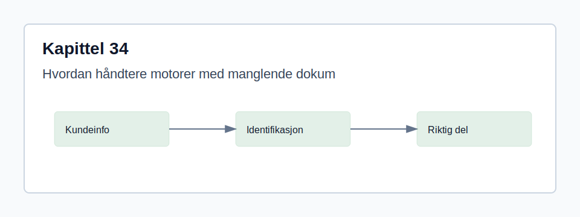

## Tekniske systemillustrasjoner

## Grundig forklaring
Hvordan identifikasjon bygges opp når typeplate eller historikk mangler må forstås både teknisk og praktisk. I marine reservedeler er det sjelden nok å vite hva kunden kaller delen. Medarbeideren må forstå hvilken funksjon delen har, hvor den sitter, hvilken motorvariant den tilhører, og hva som skjer dersom feil del bestilles. Derfor skal tekniske data, kundens beskrivelse og dokumentert katalogoppslag alltid vurderes sammen.

En god sak har fire kjennetegn: den har tydelig identifikasjon, tydelig problem- eller delbeskrivelse, tydelig beslutningsgrunnlag og tydelig oppfølging. Dersom ett av disse punktene mangler, skal saken markeres som usikker før kunden får et bindende svar.

## Praktisk verkstedeksempel
Et verksted står med demontert komponent og trenger rask avklaring. Medarbeideren registrerer kunde, fartøy, motorinformasjon og tidsfrist, ber om bilder av typeplate og komponent, sjekker katalog og lager, og sender et kort skriftlig svar med valgt del, grunnlag for valget og neste oppdateringstidspunkt.

## Kundesupporteksempel
Kunde: 'Motoren går dårlig, kan dere sende riktig del?' Profesjonelt svar: 'Vi kan hjelpe, men først må vi skille mellom symptom og delbehov. Send serienummer, bilde av motorplate, bilde av området feilen gjelder og en kort beskrivelse av når feilen oppstår. Da kan vi foreslå riktig del eller riktig neste feilsøkingstrinn.'

## Vanlige feil og årsaker
- feil eller ufullstendig serienummer.
- delnummer som er erstattet uten at saken dokumenteres.
- symptom som tolkes som delbehov uten feilsøking.
- kunde har bilde av lignende del, men ikke korrekt motorvariant.
- manglende avklaring av antall, side, posisjon eller leveringstid.

## Feilsøkingsflyt
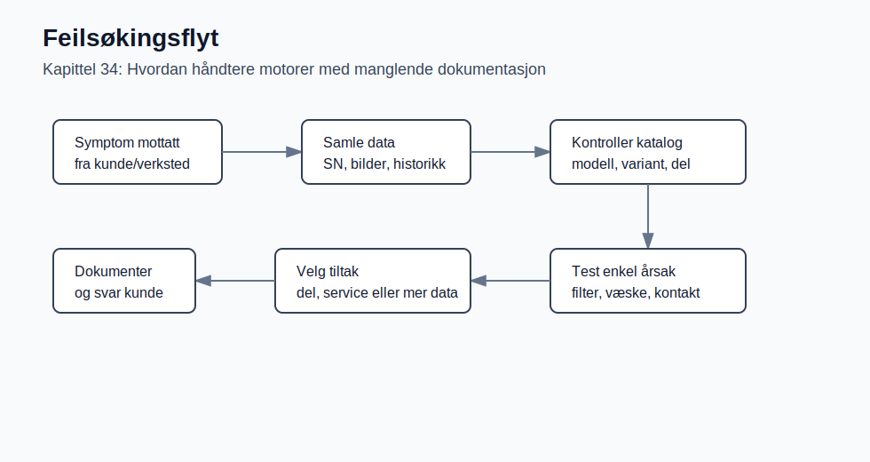

```mermaid
flowchart TD
    A[Symptom eller forespørsel mottatt] --> B[Samle serienummer, bilder og historikk]
    B --> C{Er motor og variant sikkert identifisert?}
    C -- Nei --> D[Be om mer dokumentasjon før del bekreftes]
    C -- Ja --> E[Kontroller delnummer og posisjon i katalog]
    E --> F{Stemmer symptom med foreslått del?}
    F -- Nei --> G[Foreslå feilsøking eller teknisk kontroll]
    F -- Ja --> H[Kontroller lager, pris og levering]
    H --> I[Send dokumentert kundesvar]
```

## Vedlikeholdsprosedyre
1. Avklar driftstimer, siste service og driftsmiljø.
2. Kontroller olje, filter, kjølevæske, sjøvannskrets, reimer, slanger og elektriske kontakter.
3. Sammenlign vedlikeholdsbehov med produsentens intervaller og faktisk bruk.
4. Anbefal servicekit når flere slitedeler bør skiftes samtidig.
5. Dokumenter hva som er anbefalt, hva kunden bestiller og eventuelle avvik fra normal prosedyre.

## Serienummeridentifikasjon
Serienummeridentifikasjon starter med å finne typeplate, motornummer eller annen unik identifikasjon. Be om bilde, ikke bare avskrift, fordi feil tegn, mellomrom og prefiks kan endre katalogoppslaget. Når serienummer ikke finnes, bygges identifikasjonen med modell, produksjonsår, bilder, tidligere fakturaer, servicehistorikk og delnummer fra monterte komponenter.

Minimumsdata bør være: fabrikat, modell, serienummer, eventuell product number/arrangement/CPL/motornummer, bilde av typeplate og bilde av motorens installasjon. Ved tvil skal saken stoppes for avklaring før del bekreftes.

## Reservedelsidentifikasjon
Reservedelsidentifikasjon skal bekrefte delnummer, posisjon, antall per motor, variant, side og eventuell erstatning. Dersom kunden oppgir et gammelt nummer, må det kontrolleres mot supersession. Dersom kunden bare sender bilde, skal bildet brukes som støtte, ikke som eneste grunnlag for bestilling.

Sjekk alltid om delnummeret gjelder enkeltkomponent, reparasjonssett, servicekit eller komplett enhet. Kontroller også om varen er høyre/venstre, gammel/ny type, standard/oversize eller knyttet til en bestemt produksjonsperiode.

## Bestillingsprosedyre
1. Opprett eller oppdater sak med kunde, fartøy, kontaktperson og tidsfrist.
2. Verifiser motoridentifikasjon og lagre bildedokumentasjon.
3. Finn korrekt delnummer i relevant katalog eller leverandørgrunnlag.
4. Kontroller supersession, antall, lagerstatus, pris, returvilkår og leveringstid.
5. Send ordrebekreftelse med delnummer, beskrivelse, antall, pris, levering og forbehold.
6. Følg opp leveransen til kunden har mottatt varen eller saken er lukket.

## Kvalitetspunkter før svar
- Har vi nok data til å gi et sikkert svar?
- Er delnummeret kontrollert mot riktig motorvariant?
- Er kundens tidsfrist realistisk med valgt fraktmåte?
- Er eventuelle forbehold skrevet tydelig?
- Kan en kollega forstå beslutningen ved å lese saken senere?

## Kapittelsammendrag
Hovedpoenget i kapittel 34 er at profesjonelt reservedelsarbeid krever struktur. Teknisk kunnskap, engelske fagtermer, praktisk feilsøking, dokumentasjon og kundedialog må henge sammen. Når medarbeideren jobber systematisk, reduseres feilbestillinger, kunden får bedre svar, og verkstedet kan planlegge arbeidet tryggere.

## Kryssreferanser
- For forrige tema, se kapittel 33: Hvordan arbeide med eldre motorer og historiske deler.
- For neste tema, se kapittel 35: Bruk av skjemaer, bilder og tekniske opplysninger i support.
- For grunnleggende identifikasjon, se kapittel 12 og 17.
- For merkevise eksempler, se kapitlene 26-32.

## Fordypning for intern opplæring
Dette kapitlet skal brukes som arbeidsstandard, ikke bare som lesestoff. Når en ny medarbeider møter en sak om manglende dokumentasjon, skal vedkommende trene på å gå rolig fra fakta til vurdering og deretter til handling. I en marinemotorforhandler er konsekvensen av en feil ofte større enn verdien av selve delen. En feil impeller, feil sensor, feil filterinnsats eller feil pakningssett kan føre til tapt verkstedtid, utsatt avgang, irritert kunde og i verste fall ny driftsstans. Derfor skal hver sak behandles som en teknisk beslutning med sporbar dokumentasjon.

Profesjonelt nivå i dette kapitlet betyr at medarbeideren kan arbeide sikkert med manglende dokumentasjon. Før kunden får et bindende svar, skal opplysningene i saken kontrolleres mot motorens identitet, faktisk installasjon og relevant produsentterminologi. Det praktiske målet er ikke å finne et raskt nummer, men å kunne forklare hvorfor valgt del, kontrollpunkt eller kundesvar er riktig for akkurat denne motoren. Når informasjon mangler, skal medarbeideren beskrive hva som mangler, hvorfor det er nødvendig, og hvilket neste steg som bringer saken videre.

## Tekniske forklaringer
Teknisk forståelse i dette kapitlet skal bygges rundt bilder, måling, tidligere faktura, komponentnummer, fartøydata og risikomarkering. Medarbeideren må skille mellom synlig symptom, sannsynlig systemfeil og bestillbar komponent. En del kan se riktig ut på bilde, men likevel være feil dersom posisjon, variant, rating, kjøleroppsett, elektrisk plugg, monteringsside eller servicehistorikk ikke stemmer. Derfor skal teknisk vurdering alltid kobles til både funksjon og dokumentasjon: hva gjør komponenten, hvilket system påvirker den, og hvilken produsentkilde bekrefter at den passer.

I praksis betyr dette at tekniske data skal kobles til motorens faktiske installasjon. Marine motorer står ofte trangt, er utsatt for salt, vibrasjon, fukt og ujevnt belastningsmønster, og de kan være bygget om gjennom mange år. En motor kan ha original kjøler, ettermontert eksosbend, alternativ dynamo, endret filterbrakett eller annen sjøvannspumpe enn standard. Slike forhold gjør at delidentifikasjon må bygge på både produsentdata og synlig dokumentasjon fra motoren.

Produsentterminologi er en del av den tekniske forståelsen. Bruk uttrykk som Serial Number, Engine Number, Part Number, Service Kit, Exploded View, Supersession når de er relevante. Ikke oversett dem på en måte som fjerner presisjon. Skriv for eksempel «Engine Serial Number (ESN)» første gang og deretter «ESN» i saken dersom produsenten bruker dette. Skriv «Arrangement Number» når CAT-data krever det, «Product Number» når Volvo Penta bruker det, «CPL» når Cummins-konfigurasjon må kontrolleres, og «Model Code» når Yanmar-identifikasjon bygger på modellkode. Dette gjør dialogen med internasjonale leverandører mer presis.

## Illustrasjonsforslag
- Oversiktsdiagram som viser hvor manglende dokumentasjon passer inn i total arbeidsflyt fra kundeforespørsel til levert del.
- Nærbilde av typeplate/motorskilt med markering av serienummer, motornummer, modell og eventuell variantkode.
- Sprengskisse med markert posisjon, delnummer, antall per motor og mulige alternative versjoner.
- Feilsøkingsflyt med beslutningspunkter: mangler data, stemmer symptom, kreves mer teknisk kontroll, kan ordre bekreftes.
- Sammenligningsbilde av gammel og ny del der forskjell i tilkobling, side, lengde eller sensorplugg er markert.

## Virkelige verkstedseksempler
Eksempel 1: Et verksted står med en demontert komponent på benken og kunden venter på avklaring før fartøyet kan settes tilbake i drift. Verkstedet sender et nærbilde av delen, men ingen motorplate. En uerfaren medarbeider kan bli fristet til å søke på nummeret som står på støpegodset. En profesjonell medarbeider svarer at støpenummer ikke nødvendigvis er bestillbart delnummer, ber om bilde av typeplate, oversiktsbilde av motoren og bilde av monteringsstedet, og forklarer at dette hindrer feilbestilling. Når informasjonen kommer, kontrolleres delnummer mot sprengskisse, posisjon og antall. Først da gis pris og leveringstid.

Eksempel 2: En kunde ringer sent på dagen og sier at motoren har høy temperatur etter service. Kunden ønsker ny termostat. Medarbeideren skal ikke automatisk konkludere med termostatfeil. Spørsmålene bør avklare om impeller er byttet, om sjøvannsfilteret er rent, om kjølevæskenivået er riktig, om alarmen kommer ved tomgang eller belastning, og om det finnes lekkasje rundt varmeveksler eller slanger. Dersom kunden likevel vil bestille termostat, dokumenteres at feilsøking er anbefalt, og delnummer kontrolleres mot serienummer før ordre.

Eksempel 3: En intern selger mottar en gammel faktura med et delnummer som ikke lenger finnes. Riktig prosess er å kontrollere supersession, se om ny del krever tilhørende pakning, boltsett eller adapter, og notere både gammelt og nytt nummer i saken. Kunden skal få vite at delen er erstattet, hva som leveres, og om det finnes monteringsforbehold.

## Reservedelsidentifisering i praksis
Reservedelsidentifisering skal følge en fast rekkefølge. Først kontrolleres motorens identitet. Deretter kontrolleres delens system: drivstoff, luft, kjøling, smøring, eksos, elektrisk eller mekanisk kraftoverføring. Så kontrolleres posisjon i sprengskisse eller parts list. Til slutt kontrolleres antall, variant, supersession og leveringsstatus. Denne rekkefølgen hindrer at medarbeideren hopper direkte fra kundens ord til et tilfeldig delnummer.

Når en del har synlig nummer, må nummeret tolkes riktig. Mange komponenter har produksjonsnummer, støpenummer, leverandørnummer eller revisjonskode som ikke er det samme som bestillbart part number. Et filter kan ha nummer fra filterprodusent, men motorprodusentens parts catalogue kan bruke et annet nummer. En pumpe kan ha nummer på lokk, hus og komplett enhet. Spør derfor alltid: gjelder nummeret komplett del, reparasjonssett, underkomponent eller produsentens råkomponent?

## Serienummer og motornummer
Serienummer og motornummer er grunnlaget for korrekt katalogoppslag. Be kunden sende bilde av typeplate eller dataplate. Dersom kunden skriver nummeret manuelt, skal nummeret likevel kontrolleres mot bilde når det er mulig. Noter hele nummeret, inkludert prefiks, suffiks, bindestrek, mellomrom og eventuelle bokstaver. På enkelte produsenter kan små forskjeller peke til forskjellig produksjonsperiode, rating eller konfigurasjon.

Bruk motornummer sammen med modell, variant og applikasjon. En motor som driver generator kan ha andre deler enn en fremdriftsmotor. En motor i yrkesbåt kan ha annen rating enn samme motor i fritidsbåt. En eldre motor kan være bygget om med ny dynamo, annen sjøvannspumpe eller uoriginal filterbrakett. Dersom typeplate mangler, bygg identifikasjonen gjennom flere kilder: servicebok, tidligere faktura, bilder av motorens sider, nummer på pumpe, filter, turbo og gear, samt opplysninger om fartøy og produksjonsår.

## Feilsøking steg for steg
1. Definer symptomet med kundens egne ord og skriv det i saken. Skill mellom «kunden ønsker del» og «kunden beskriver feil».
2. Avklar når feilen oppstår: start, tomgang, belastning, marsjfart, varm motor, kald motor eller etter nylig service.
3. Kontroller grunnleggende forhold: væskenivå, filter, luft i drivstoff, sjøvannsstrøm, reimer, elektriske kontakter, sikringer og synlige lekkasjer.
4. Knytt symptomet til system: lav effekt peker ofte mot luft/drivstoff/eksos, høy temperatur mot kjøling, lavt oljetrykk mot smøring/sensor, startproblem mot batteri/starter/gløding/drivstoff.
5. Be om bilder eller måledata dersom symptomet ikke kan kobles sikkert til en del. Dette kan være bilde av alarmdisplay, trykkmåling, temperaturmåling eller bilde av montert komponent.
6. Kontroller relevant delnummer mot serienummer og variant. Dersom flere alternativer finnes, forklar kunden hva som skiller dem.
7. Dokumenter anbefalt tiltak, usikkerhet og eventuelle forbehold før ordre bekreftes.

## Vedlikehold
Vedlikehold skal vurderes mot driftstimer, produsentens maintenance schedule og faktisk driftsmiljø. Marine motorer som går korte turer, mye tomgang eller i salt miljø kan trenge hyppigere kontroll enn standard intervall antyder. Nye medarbeidere skal lære å spørre om siste service, hvilke filter som ble byttet, hvilken olje som ble brukt, om impeller er kontrollert, og om kjølevæske eller anoder er byttet etter plan.

En god vedlikeholdsanbefaling er konkret. I stedet for å skrive «ta service», bør medarbeideren foreslå relevante deler: olje- og drivstoffilter, luftfilter, impeller, reim, pakninger, anoder, kjølevæske og eventuelt servicekit. Dersom kunden har ukjent servicehistorikk, bør komplett servicekit vurderes. Dersom kunden har hatt overoppheting, bør sjøvannskrets og varmeveksler kontrolleres før bare én komponent byttes.

## Vanlige feil
- Serienummer leses feil fordi et tegn forveksles, for eksempel O/0 eller I/1.
- Kunden oppgir modellnavn, men ikke variant, rating eller applikasjon.
- Del velges ut fra bilde alene uten kontroll mot sprengskisse eller produsentkatalog.
- Supersession aksepteres uten å kontrollere om ny del krever tilbehør, pakning eller ombygging.
- Hastepress gjør at leveringsløfte gis før lagerstatus og fraktmulighet er bekreftet.
- Saksnotat mangler grunnlaget for beslutningen, slik at kollega ikke kan etterprøve valget.

## Kontrollspørsmål
- Hva er den viktigste tekniske risikoen i en sak som gjelder manglende dokumentasjon?
- Hvilke opplysninger må dokumenteres før bindende delnummer bekreftes?
- Hvordan forklarer du kunden hvorfor bilde av typeplate er nødvendig?
- Når bør du stoppe en ordre og be om mer dokumentasjon?
- Hvilke engelske produsentuttrykk bør du kunne bruke i denne typen sak?
- Hvordan dokumenterer du at et delnummer er erstattet av et nytt nummer?

## Praktisk sjekkliste for medarbeider
- Les saken som om en kollega skal overta den i morgen.
- Kontroller at motoridentifikasjon er dokumentert med bilde eller sikker kilde.
- Sjekk at delnummeret er knyttet til riktig posisjon i katalogen.
- Skriv tydelig om kunden har bedt om enkeltkomponent, servicekit eller komplett enhet.
- Noter om varen er spesialbestilling, utgått, erstattet eller ikke returbar.
- Send kundesvar med neste steg, ikke bare et løst delnummer.

## Kapittelspesifikk systemforståelse
For dette kapitlet er kjernen å forstå identifikasjon når dokumentasjon mangler. Medarbeideren skal kunne forklare dette med praktiske ord til både kunde og kollega. Det betyr at teknisk teori må kobles til konkrete handlinger: hvilke data skal innhentes, hvilke komponenter kan være berørt, hvilken produsentterminologi skal brukes, og hva må dokumenteres før saken kan gå videre. Når typeplate mangler, bygges saken med flere svake bevis som til sammen gir trygg nok identifikasjon.

Når systemet vurderes, skal medarbeideren først plassere problemet i riktig teknisk sammenheng. Dersom kunden beskriver en alarm, må man finne ut om alarmen kommer fra reelt mekanisk avvik, elektrisk sensorfeil, feil etter service eller feil tolkning av instrumentet. Dersom kunden beskriver en del, må man avklare om kunden mener komplett enhet, servicekit, reparasjonssett eller enkeltkomponent. Dersom kunden beskriver motoren med vanlig navn, må man kontrollere om produsenten bruker mer presise begreper i katalogen.

## Komponentoversikt og arbeidsgrense
Relevante komponenter og opplysninger i dette kapitlet omfatter: bildeanalyse, innstansing, komponentnummer, fartøyhistorikk, servicebok og målskisse. Listen er ikke ment som en erstatning for produsentens parts catalogue, men som en praktisk påminnelse om hva nye medarbeidere skal tenke på før de søker del. I interne saker skal komponentnavn skrives så presist som mulig. Bruk for eksempel «sjøvannspumpe / raw water pump» i stedet for bare «pumpe» når funksjonen er kjent, og «varmeveksler / heat exchanger» i stedet for bare «kjøler» når det er den komponenten saken gjelder.

Arbeidsgrensen for en reservedelsmedarbeider er også viktig. Medarbeideren skal ikke overta mekanikerens ansvar for demontering, måling eller diagnose på motoren, men skal kunne stille riktige spørsmål og foreslå riktig dokumentasjon. Når en sak går fra enkel delidentifikasjon til teknisk diagnose, skal dette markeres i saken. Da kan verksted, teknisk ansvarlig eller leverandør involveres med et klart spørsmål og et ryddig faktagrunnlag.

## Praktisk beslutningsregel
Bruk denne regelen i alle saker knyttet til kapitlet: Hvis motoridentifikasjon, komponentposisjon eller symptom ikke er sikkert nok dokumentert, skal medarbeideren ikke gi bindende delbekreftelse. Kunden kan få et foreløpig svar, men svaret må inneholde hva som mangler, hvorfor det mangler, og hva som skjer når informasjonen er mottatt. Dette er ikke treg service; det er profesjonell risikokontroll.

## Målrettet fordypning kapittel 31-40
### Manglende dokumentasjon og identifikasjon gjennom flere spor
Når typeplate mangler, skal saken bygges gjennom flere uavhengige spor. Be om bilder av alle motorsider, gearplate, pumpeplate, turboetikett, filterbrakett, ECU-label, gamle fakturaer og servicehistorikk. Dersom kunden kan oppgi fartøytype, byggeår eller tidligere verksted, kan dette gi støtteinformasjon. Målet er ikke å gjette, men å redusere usikkerhet til et akseptabelt nivå.

I slike saker skal forbehold skrives tydelig. Dersom identifikasjonen bygger på sannsynlighet, må kunden forstå risikoen før bestilling. Medarbeideren bør også vurdere om saken skal eskaleres til teknisk ansvarlig eller leverandør. Manglende dokumentasjon er særlig kritisk ved elektronikk, injeksjonskomponenter, pumper og kjøledeler som kan ha flere fysiske varianter.

### Praktisk anvendelse i opplæring
Bruk dette kapitlet i en case der deltakeren må avgjøre hvilke opplysninger som er sikre, hvilke som mangler, og om saken kan gå til tilbud eller må stoppes for avklaring. Deltakeren skal skrive en kort intern vurdering og et profesjonelt kundesvar. Instruktøren bør særlig se etter korrekt bruk av produsentterminologi, tydelige forbehold og evne til å skille reservedelsidentifikasjon fra mekanisk diagnose.

## Realistisk opplæring i praksis
### Verkstedhistorie
En typisk sak i dette temaet starter med typeplate er borte etter lakkering. Verkstedet trenger et raskt svar, men den erfarne medarbeideren stopper opp og spør først: hva vet vi sikkert, hva antar vi, og hva kan gi følgeskade hvis vi tar feil? I praksis betyr det at alternativ identifikasjon må kobles til bilde, serienummer, komponentposisjon og kundens symptom før saken lukkes. Historien skal brukes i opplæring som en øvelse i å skrive et kort saksnotat: observasjon, vurdering, neste handling og forbehold.

### Kundehistorie
Kunden beskriver ofte problemet med driftsspråk: «motoren går tungt», «alarm kommer etter ti minutter», «jeg trenger den samme delen som sist» eller «båten skal ut i morgen». En profesjonell respons er rolig og konkret: bekreft behovet, forklar hvorfor identifikasjon trengs, be om riktig dokumentasjon og gi et realistisk tidspunkt for neste svar. Ikke korriger kunden unødvendig; oversett kundens språk til teknisk språk i saken.

### Typiske feil nye ansatte gjør
- søker på første synlige nummer uten å avklare om det er støpenummer, leverandørnummer eller bestillbart part number.
- lover levering før lagerstatus, frakt og returvilkår er kontrollert.
- antar at tidligere faktura alltid gjelder samme motorvariant.
- blander symptom og årsak, spesielt ved varme, lav effekt, startproblem og alarm.
- skriver for korte notater slik at kollega ikke kan forstå hvorfor valget ble tatt.

### Tips fra erfarne mekanikere og reservedelsselgere
- Se alltid etter systemet rundt delen: slanger, braketter, sensorer, reimer, kjølere og tilkoblinger forteller ofte mer enn delen alene.
- Still ett presist spørsmål om gangen når kunden er stresset; mange dårlige svar kommer av for lange spørsmålslister.
- Sammenlign gammel og ny del mot funksjon, ikke bare form. Riktig del skal passe, men også løse riktig problem.
- En erfaren reservedelsselger tenker i risiko: Hva er billigst å avklare nå, og hva blir dyrt hvis vi hopper over det?

### Vanlige kundespørsmål
| Spørsmål fra kunde | Profesjonelt svar |
|---|---|
| «Kan du bare sende samme del som sist?» | «Ja, hvis vi først bekrefter at det gjelder samme motor, samme posisjon og ingen supersession siden sist.» |
| «Holder det med bilde?» | «Bilde hjelper, men vi trenger også motoridentitet for å sikre variant og delnummer.» |
| «Hvorfor tar dette tid?» | «Fordi feil del kan gi ny driftsstans. Vi kontrollerer grunnlaget før vi lover levering.» |

### Beslutningstre for saken
| Trinn | Spørsmål | Handling |
|---|---|---|
| 1 | Er motoridentitet dokumentert med bilde eller sikker historikk? | Hvis nei: be om typeplate/dataplate eller alternativ dokumentasjon. |
| 2 | Er komponentens funksjon og posisjon kjent? | Hvis nei: be om oversiktsbilde og bilde av monteringssted. |
| 3 | Stemmer kundens symptom med delen som ønskes? | Hvis nei: anbefal feilsøking før del bestilles. |
| 4 | Finnes det supersession, kit eller variantvalg? | Kontroller produsentkilde og skriv forbehold i saken. |
| 5 | Kan pris, levering og returvilkår bekreftes? | Send dokumentert svar med neste steg og tydelig gyldighet. |

### Rask oppslagstabell
| Situasjon | Kontroller først | Vanlig fallgruve |
|---|---|---|
| Hasteordre | sikker motor-ID, lager, fraktfrist | levering loves før teknisk kontroll |
| Del fra bilde | posisjon, skala, tilkoblinger, nummer | bilde brukes som eneste beslutningsgrunnlag |
| Gammelt delnummer | supersession og kitinnhold | ny del krever ekstra pakning eller adapter |
| Uklart symptom | driftssituasjon, alarm, siste service | symptom blir tolket som sikker komponentfeil |

### Praktisk sjekkliste og inspeksjonsrutine
- Start med motoridentitet: fabrikat, modell, serienummer, variant, applikasjon og bilde av skilt.
- Kontroller området rundt komponenten: lekkasje, korrosjon, knekte fester, slitasje, varmemerker og uoriginale endringer.
- Spør om siste vedlikehold: olje, filter, impeller, reimer, kjølevæske, anoder og drivstoffilter.
- Noter driftstype: fritidsbruk, yrkesbruk, generator, fremdrift, tomgangsdrift eller langvarig høy belastning.
- Avklar om saken gjelder akutt drift, planlagt service, reklamasjon eller lagerpåfyll.

### Generelle vedlikeholdsintervaller som opplæringspunkt
| Kontrollpunkt | Typisk vurdering i opplæring | Må verifiseres |
|---|---|---|
| Olje og oljefilter | ofte basert på timer og kalender | produsentens maintenance schedule |
| Drivstoffilter/vannutskiller | hyppigere ved dårlig drivstoff eller sesongstart | motor- og filterspesifikasjon |
| Impeller og sjøvannskrets | kontrolleres særlig før sesong og etter varmgang | produsentens intervall og installasjon |
| Reimer, slanger og klemmer | visuell kontroll ved service og feilsøking | dimensjon, stramming og delnummer |

### Produsentverifikasjon
Alle konkrete delnumre, momentverdier, serviceintervaller, garantikrav, programvaredata og produsentspesifikke grenser skal kontrolleres mot offisiell produsentdokumentasjon før de brukes i tilbud, ordre eller verkstedinstruks. Marker tydelig i saken når svaret bygger på antakelse, eldre historikk, bilde uten motor-ID eller generell erfaring. Intervaller i tabellen er generelle opplæringspunkter. Faktiske intervaller styres av produsent, motorvariant, driftstimer, kalenderkrav, belastning og miljø.

## Produsentverifikasjon og faglig forbehold
Når saken gjelder delnummer, serienummer, serviceintervall, momentdata, garanti, elektronikk eller kompatibilitet, skal opplysningen verifiseres mot produsentens dokumentasjon eller autorisert leverandør før bindende tilbud eller teknisk konklusjon gis. Manualen beskriver arbeidsmetode og risikopunkter; den erstatter ikke gjeldende parts catalogue, service manual, service bulletin eller produsentportal. Marker saken internt dersom opplysningen bygger på antakelse, eldre historikk eller bilde uten bekreftet motoridentitet.

## Quiz med fasit
1. Hvilke tekniske data bør alltid samles før en del bekreftes?
2. Hvorfor er engelsk terminologi viktig i marine reservedeler?
3. Hva bør gjøres dersom kunden bare sender et bilde av delen?
4. Hvilke punkter bør kontrolleres før ordrebekreftelse sendes?
5. Hvorfor skal feilsøking dokumenteres, selv når kunden allerede ber om en bestemt del?

### Svar
1. Fabrikat, modell, serienummer, variantdata, bilde av typeplate, delnummer, posisjon og kundens symptombeskrivelse.
2. Fordi kataloger, portaler, servicemanualer og leverandørdialog ofte bruker engelske begreper som må forstås presist.
3. Be om serienummer, oversiktsbilde av motoren og eventuelle nummer på delen; bildet brukes som støtte, ikke eneste grunnlag.
4. Delnummer, antall, variant, pris, lagerstatus, leveringstid, frakt, returvilkår og eventuelle forbehold.
5. Fordi symptomet kan ha flere årsaker, og dokumentasjon viser hvorfor anbefalingen ble gitt.

---

# Kapittel 35: Bruk av skjemaer, bilder og tekniske opplysninger i support

## Kapittelrolle
Dette kapitlet gir en grundig praktisk innføring i bilder og skjemaer. Temaet er viktig fordi reservedelsarbeid i marine miljøer kombinerer teknisk forståelse, presis kundedialog, dokumentert saksbehandling og realistisk leveranseoppfølging. Målet er at en ny medarbeider skal kunne bruke kunnskapen direkte i arbeid med verksted, kunde, lager og leverandør.

## Læringsmål
Etter kapitlet skal deltakeren kunne:
- forklare hovedbegrepene innen bilder og skjemaer
- bruke serienummer, modellinformasjon og delnummer i praktisk reservedelsarbeid
- kommunisere trygt med kunde, verksted, lager og leverandør
- dokumentere beslutninger slik at andre kan etterprøve saken
- kjenne igjen vanlige feil og velge riktig neste handling

## English technical terminology
- **Serial Number:** engelsk fagterm som ofte brukes i kataloger, servicelitteratur, leverandørportaler og internasjonal kundedialog.
- **Part Number:** engelsk fagterm som ofte brukes i kataloger, servicelitteratur, leverandørportaler og internasjonal kundedialog.
- **Engine Model:** engelsk fagterm som ofte brukes i kataloger, servicelitteratur, leverandørportaler og internasjonal kundedialog.
- **Variant:** engelsk fagterm som ofte brukes i kataloger, servicelitteratur, leverandørportaler og internasjonal kundedialog.
- **Service Kit:** engelsk fagterm som ofte brukes i kataloger, servicelitteratur, leverandørportaler og internasjonal kundedialog.
- **Troubleshooting:** engelsk fagterm som ofte brukes i kataloger, servicelitteratur, leverandørportaler og internasjonal kundedialog.
- **Maintenance:** engelsk fagterm som ofte brukes i kataloger, servicelitteratur, leverandørportaler og internasjonal kundedialog.
- **Ordering Procedure:** engelsk fagterm som ofte brukes i kataloger, servicelitteratur, leverandørportaler og internasjonal kundedialog.
- **Supersession:** engelsk fagterm som ofte brukes i kataloger, servicelitteratur, leverandørportaler og internasjonal kundedialog.
- **Technical Support:** engelsk fagterm som ofte brukes i kataloger, servicelitteratur, leverandørportaler og internasjonal kundedialog.

## Hoveddiagram
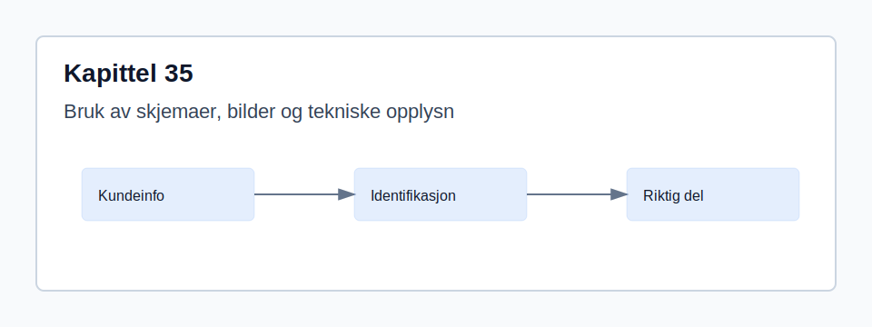

## Tekniske systemillustrasjoner

## Grundig forklaring
Hvordan teknisk underlag brukes i support må forstås både teknisk og praktisk. I marine reservedeler er det sjelden nok å vite hva kunden kaller delen. Medarbeideren må forstå hvilken funksjon delen har, hvor den sitter, hvilken motorvariant den tilhører, og hva som skjer dersom feil del bestilles. Derfor skal tekniske data, kundens beskrivelse og dokumentert katalogoppslag alltid vurderes sammen.

En god sak har fire kjennetegn: den har tydelig identifikasjon, tydelig problem- eller delbeskrivelse, tydelig beslutningsgrunnlag og tydelig oppfølging. Dersom ett av disse punktene mangler, skal saken markeres som usikker før kunden får et bindende svar.

## Praktisk verkstedeksempel
Et verksted står med demontert komponent og trenger rask avklaring. Medarbeideren registrerer kunde, fartøy, motorinformasjon og tidsfrist, ber om bilder av typeplate og komponent, sjekker katalog og lager, og sender et kort skriftlig svar med valgt del, grunnlag for valget og neste oppdateringstidspunkt.

## Kundesupporteksempel
Kunde: 'Motoren går dårlig, kan dere sende riktig del?' Profesjonelt svar: 'Vi kan hjelpe, men først må vi skille mellom symptom og delbehov. Send serienummer, bilde av motorplate, bilde av området feilen gjelder og en kort beskrivelse av når feilen oppstår. Da kan vi foreslå riktig del eller riktig neste feilsøkingstrinn.'

## Vanlige feil og årsaker
- feil eller ufullstendig serienummer.
- delnummer som er erstattet uten at saken dokumenteres.
- symptom som tolkes som delbehov uten feilsøking.
- kunde har bilde av lignende del, men ikke korrekt motorvariant.
- manglende avklaring av antall, side, posisjon eller leveringstid.

## Feilsøkingsflyt
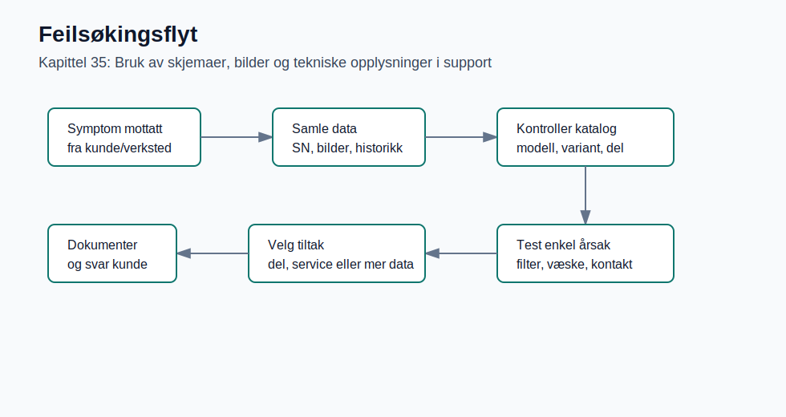

```mermaid
flowchart TD
    A[Symptom eller forespørsel mottatt] --> B[Samle serienummer, bilder og historikk]
    B --> C{Er motor og variant sikkert identifisert?}
    C -- Nei --> D[Be om mer dokumentasjon før del bekreftes]
    C -- Ja --> E[Kontroller delnummer og posisjon i katalog]
    E --> F{Stemmer symptom med foreslått del?}
    F -- Nei --> G[Foreslå feilsøking eller teknisk kontroll]
    F -- Ja --> H[Kontroller lager, pris og levering]
    H --> I[Send dokumentert kundesvar]
```

## Vedlikeholdsprosedyre
1. Avklar driftstimer, siste service og driftsmiljø.
2. Kontroller olje, filter, kjølevæske, sjøvannskrets, reimer, slanger og elektriske kontakter.
3. Sammenlign vedlikeholdsbehov med produsentens intervaller og faktisk bruk.
4. Anbefal servicekit når flere slitedeler bør skiftes samtidig.
5. Dokumenter hva som er anbefalt, hva kunden bestiller og eventuelle avvik fra normal prosedyre.

## Serienummeridentifikasjon
Serienummeridentifikasjon starter med å finne typeplate, motornummer eller annen unik identifikasjon. Be om bilde, ikke bare avskrift, fordi feil tegn, mellomrom og prefiks kan endre katalogoppslaget. Når serienummer ikke finnes, bygges identifikasjonen med modell, produksjonsår, bilder, tidligere fakturaer, servicehistorikk og delnummer fra monterte komponenter.

Minimumsdata bør være: fabrikat, modell, serienummer, eventuell product number/arrangement/CPL/motornummer, bilde av typeplate og bilde av motorens installasjon. Ved tvil skal saken stoppes for avklaring før del bekreftes.

## Reservedelsidentifikasjon
Reservedelsidentifikasjon skal bekrefte delnummer, posisjon, antall per motor, variant, side og eventuell erstatning. Dersom kunden oppgir et gammelt nummer, må det kontrolleres mot supersession. Dersom kunden bare sender bilde, skal bildet brukes som støtte, ikke som eneste grunnlag for bestilling.

Sjekk alltid om delnummeret gjelder enkeltkomponent, reparasjonssett, servicekit eller komplett enhet. Kontroller også om varen er høyre/venstre, gammel/ny type, standard/oversize eller knyttet til en bestemt produksjonsperiode.

## Bestillingsprosedyre
1. Opprett eller oppdater sak med kunde, fartøy, kontaktperson og tidsfrist.
2. Verifiser motoridentifikasjon og lagre bildedokumentasjon.
3. Finn korrekt delnummer i relevant katalog eller leverandørgrunnlag.
4. Kontroller supersession, antall, lagerstatus, pris, returvilkår og leveringstid.
5. Send ordrebekreftelse med delnummer, beskrivelse, antall, pris, levering og forbehold.
6. Følg opp leveransen til kunden har mottatt varen eller saken er lukket.

## Kvalitetspunkter før svar
- Har vi nok data til å gi et sikkert svar?
- Er delnummeret kontrollert mot riktig motorvariant?
- Er kundens tidsfrist realistisk med valgt fraktmåte?
- Er eventuelle forbehold skrevet tydelig?
- Kan en kollega forstå beslutningen ved å lese saken senere?

## Kapittelsammendrag
Hovedpoenget i kapittel 35 er at profesjonelt reservedelsarbeid krever struktur. Teknisk kunnskap, engelske fagtermer, praktisk feilsøking, dokumentasjon og kundedialog må henge sammen. Når medarbeideren jobber systematisk, reduseres feilbestillinger, kunden får bedre svar, og verkstedet kan planlegge arbeidet tryggere.

## Kryssreferanser
- For forrige tema, se kapittel 34: Hvordan håndtere motorer med manglende dokumentasjon.
- For neste tema, se kapittel 36: Sikkerhet ved håndtering av olje, gasser, elektriske systemer og tunge deler.
- For grunnleggende identifikasjon, se kapittel 12 og 17.
- For merkevise eksempler, se kapitlene 26-32.

## Fordypning for intern opplæring
Dette kapitlet skal brukes som arbeidsstandard, ikke bare som lesestoff. Når en ny medarbeider møter en sak om bilder og teknisk underlag, skal vedkommende trene på å gå rolig fra fakta til vurdering og deretter til handling. I en marinemotorforhandler er konsekvensen av en feil ofte større enn verdien av selve delen. En feil impeller, feil sensor, feil filterinnsats eller feil pakningssett kan føre til tapt verkstedtid, utsatt avgang, irritert kunde og i verste fall ny driftsstans. Derfor skal hver sak behandles som en teknisk beslutning med sporbar dokumentasjon.

Profesjonelt nivå i dette kapitlet betyr at medarbeideren kan arbeide sikkert med tekniske vedlegg. Før kunden får et bindende svar, skal opplysningene i saken kontrolleres mot motorens identitet, faktisk installasjon og relevant produsentterminologi. Det praktiske målet er ikke å finne et raskt nummer, men å kunne forklare hvorfor valgt del, kontrollpunkt eller kundesvar er riktig for akkurat denne motoren. Når informasjon mangler, skal medarbeideren beskrive hva som mangler, hvorfor det er nødvendig, og hvilket neste steg som bringer saken videre.

## Tekniske forklaringer
Teknisk forståelse i dette kapitlet skal bygges rundt bilder, skjema, måledata, alarmkode, dataplate og standardisert supportmal. Medarbeideren må skille mellom synlig symptom, sannsynlig systemfeil og bestillbar komponent. En del kan se riktig ut på bilde, men likevel være feil dersom posisjon, variant, rating, kjøleroppsett, elektrisk plugg, monteringsside eller servicehistorikk ikke stemmer. Derfor skal teknisk vurdering alltid kobles til både funksjon og dokumentasjon: hva gjør komponenten, hvilket system påvirker den, og hvilken produsentkilde bekrefter at den passer.

I praksis betyr dette at tekniske data skal kobles til motorens faktiske installasjon. Marine motorer står ofte trangt, er utsatt for salt, vibrasjon, fukt og ujevnt belastningsmønster, og de kan være bygget om gjennom mange år. En motor kan ha original kjøler, ettermontert eksosbend, alternativ dynamo, endret filterbrakett eller annen sjøvannspumpe enn standard. Slike forhold gjør at delidentifikasjon må bygge på både produsentdata og synlig dokumentasjon fra motoren.

Produsentterminologi er en del av den tekniske forståelsen. Bruk uttrykk som Serial Number, Engine Number, Part Number, Service Kit, Exploded View, Supersession når de er relevante. Ikke oversett dem på en måte som fjerner presisjon. Skriv for eksempel «Engine Serial Number (ESN)» første gang og deretter «ESN» i saken dersom produsenten bruker dette. Skriv «Arrangement Number» når CAT-data krever det, «Product Number» når Volvo Penta bruker det, «CPL» når Cummins-konfigurasjon må kontrolleres, og «Model Code» når Yanmar-identifikasjon bygger på modellkode. Dette gjør dialogen med internasjonale leverandører mer presis.

## Illustrasjonsforslag
- Oversiktsdiagram som viser hvor bilder og teknisk underlag passer inn i total arbeidsflyt fra kundeforespørsel til levert del.
- Nærbilde av typeplate/motorskilt med markering av serienummer, motornummer, modell og eventuell variantkode.
- Sprengskisse med markert posisjon, delnummer, antall per motor og mulige alternative versjoner.
- Feilsøkingsflyt med beslutningspunkter: mangler data, stemmer symptom, kreves mer teknisk kontroll, kan ordre bekreftes.
- Sammenligningsbilde av gammel og ny del der forskjell i tilkobling, side, lengde eller sensorplugg er markert.

## Virkelige verkstedseksempler
Eksempel 1: Et verksted står med en demontert komponent på benken og kunden venter på avklaring før fartøyet kan settes tilbake i drift. Verkstedet sender et nærbilde av delen, men ingen motorplate. En uerfaren medarbeider kan bli fristet til å søke på nummeret som står på støpegodset. En profesjonell medarbeider svarer at støpenummer ikke nødvendigvis er bestillbart delnummer, ber om bilde av typeplate, oversiktsbilde av motoren og bilde av monteringsstedet, og forklarer at dette hindrer feilbestilling. Når informasjonen kommer, kontrolleres delnummer mot sprengskisse, posisjon og antall. Først da gis pris og leveringstid.

Eksempel 2: En kunde ringer sent på dagen og sier at motoren har høy temperatur etter service. Kunden ønsker ny termostat. Medarbeideren skal ikke automatisk konkludere med termostatfeil. Spørsmålene bør avklare om impeller er byttet, om sjøvannsfilteret er rent, om kjølevæskenivået er riktig, om alarmen kommer ved tomgang eller belastning, og om det finnes lekkasje rundt varmeveksler eller slanger. Dersom kunden likevel vil bestille termostat, dokumenteres at feilsøking er anbefalt, og delnummer kontrolleres mot serienummer før ordre.

Eksempel 3: En intern selger mottar en gammel faktura med et delnummer som ikke lenger finnes. Riktig prosess er å kontrollere supersession, se om ny del krever tilhørende pakning, boltsett eller adapter, og notere både gammelt og nytt nummer i saken. Kunden skal få vite at delen er erstattet, hva som leveres, og om det finnes monteringsforbehold.

## Reservedelsidentifisering i praksis
Reservedelsidentifisering skal følge en fast rekkefølge. Først kontrolleres motorens identitet. Deretter kontrolleres delens system: drivstoff, luft, kjøling, smøring, eksos, elektrisk eller mekanisk kraftoverføring. Så kontrolleres posisjon i sprengskisse eller parts list. Til slutt kontrolleres antall, variant, supersession og leveringsstatus. Denne rekkefølgen hindrer at medarbeideren hopper direkte fra kundens ord til et tilfeldig delnummer.

Når en del har synlig nummer, må nummeret tolkes riktig. Mange komponenter har produksjonsnummer, støpenummer, leverandørnummer eller revisjonskode som ikke er det samme som bestillbart part number. Et filter kan ha nummer fra filterprodusent, men motorprodusentens parts catalogue kan bruke et annet nummer. En pumpe kan ha nummer på lokk, hus og komplett enhet. Spør derfor alltid: gjelder nummeret komplett del, reparasjonssett, underkomponent eller produsentens råkomponent?

## Serienummer og motornummer
Serienummer og motornummer er grunnlaget for korrekt katalogoppslag. Be kunden sende bilde av typeplate eller dataplate. Dersom kunden skriver nummeret manuelt, skal nummeret likevel kontrolleres mot bilde når det er mulig. Noter hele nummeret, inkludert prefiks, suffiks, bindestrek, mellomrom og eventuelle bokstaver. På enkelte produsenter kan små forskjeller peke til forskjellig produksjonsperiode, rating eller konfigurasjon.

Bruk motornummer sammen med modell, variant og applikasjon. En motor som driver generator kan ha andre deler enn en fremdriftsmotor. En motor i yrkesbåt kan ha annen rating enn samme motor i fritidsbåt. En eldre motor kan være bygget om med ny dynamo, annen sjøvannspumpe eller uoriginal filterbrakett. Dersom typeplate mangler, bygg identifikasjonen gjennom flere kilder: servicebok, tidligere faktura, bilder av motorens sider, nummer på pumpe, filter, turbo og gear, samt opplysninger om fartøy og produksjonsår.

## Feilsøking steg for steg
1. Definer symptomet med kundens egne ord og skriv det i saken. Skill mellom «kunden ønsker del» og «kunden beskriver feil».
2. Avklar når feilen oppstår: start, tomgang, belastning, marsjfart, varm motor, kald motor eller etter nylig service.
3. Kontroller grunnleggende forhold: væskenivå, filter, luft i drivstoff, sjøvannsstrøm, reimer, elektriske kontakter, sikringer og synlige lekkasjer.
4. Knytt symptomet til system: lav effekt peker ofte mot luft/drivstoff/eksos, høy temperatur mot kjøling, lavt oljetrykk mot smøring/sensor, startproblem mot batteri/starter/gløding/drivstoff.
5. Be om bilder eller måledata dersom symptomet ikke kan kobles sikkert til en del. Dette kan være bilde av alarmdisplay, trykkmåling, temperaturmåling eller bilde av montert komponent.
6. Kontroller relevant delnummer mot serienummer og variant. Dersom flere alternativer finnes, forklar kunden hva som skiller dem.
7. Dokumenter anbefalt tiltak, usikkerhet og eventuelle forbehold før ordre bekreftes.

## Vedlikehold
Vedlikehold skal vurderes mot driftstimer, produsentens maintenance schedule og faktisk driftsmiljø. Marine motorer som går korte turer, mye tomgang eller i salt miljø kan trenge hyppigere kontroll enn standard intervall antyder. Nye medarbeidere skal lære å spørre om siste service, hvilke filter som ble byttet, hvilken olje som ble brukt, om impeller er kontrollert, og om kjølevæske eller anoder er byttet etter plan.

En god vedlikeholdsanbefaling er konkret. I stedet for å skrive «ta service», bør medarbeideren foreslå relevante deler: olje- og drivstoffilter, luftfilter, impeller, reim, pakninger, anoder, kjølevæske og eventuelt servicekit. Dersom kunden har ukjent servicehistorikk, bør komplett servicekit vurderes. Dersom kunden har hatt overoppheting, bør sjøvannskrets og varmeveksler kontrolleres før bare én komponent byttes.

## Vanlige feil
- Serienummer leses feil fordi et tegn forveksles, for eksempel O/0 eller I/1.
- Kunden oppgir modellnavn, men ikke variant, rating eller applikasjon.
- Del velges ut fra bilde alene uten kontroll mot sprengskisse eller produsentkatalog.
- Supersession aksepteres uten å kontrollere om ny del krever tilbehør, pakning eller ombygging.
- Hastepress gjør at leveringsløfte gis før lagerstatus og fraktmulighet er bekreftet.
- Saksnotat mangler grunnlaget for beslutningen, slik at kollega ikke kan etterprøve valget.

## Kontrollspørsmål
- Hva er den viktigste tekniske risikoen i en sak som gjelder bilder og teknisk underlag?
- Hvilke opplysninger må dokumenteres før bindende delnummer bekreftes?
- Hvordan forklarer du kunden hvorfor bilde av typeplate er nødvendig?
- Når bør du stoppe en ordre og be om mer dokumentasjon?
- Hvilke engelske produsentuttrykk bør du kunne bruke i denne typen sak?
- Hvordan dokumenterer du at et delnummer er erstattet av et nytt nummer?

## Praktisk sjekkliste for medarbeider
- Les saken som om en kollega skal overta den i morgen.
- Kontroller at motoridentifikasjon er dokumentert med bilde eller sikker kilde.
- Sjekk at delnummeret er knyttet til riktig posisjon i katalogen.
- Skriv tydelig om kunden har bedt om enkeltkomponent, servicekit eller komplett enhet.
- Noter om varen er spesialbestilling, utgått, erstattet eller ikke returbar.
- Send kundesvar med neste steg, ikke bare et løst delnummer.

## Kapittelspesifikk systemforståelse
For dette kapitlet er kjernen å forstå bruk av bilder, skjemaer og teknisk underlag i support. Medarbeideren skal kunne forklare dette med praktiske ord til både kunde og kollega. Det betyr at teknisk teori må kobles til konkrete handlinger: hvilke data skal innhentes, hvilke komponenter kan være berørt, hvilken produsentterminologi skal brukes, og hva må dokumenteres før saken kan gå videre. Riktig bilde skal vise både detaljen og sammenhengen delen står i.

Når systemet vurderes, skal medarbeideren først plassere problemet i riktig teknisk sammenheng. Dersom kunden beskriver en alarm, må man finne ut om alarmen kommer fra reelt mekanisk avvik, elektrisk sensorfeil, feil etter service eller feil tolkning av instrumentet. Dersom kunden beskriver en del, må man avklare om kunden mener komplett enhet, servicekit, reparasjonssett eller enkeltkomponent. Dersom kunden beskriver motoren med vanlig navn, må man kontrollere om produsenten bruker mer presise begreper i katalogen.

## Komponentoversikt og arbeidsgrense
Relevante komponenter og opplysninger i dette kapitlet omfatter: bildekrav, målepunkt, skjema, service bulletin, parts list, exploded view og installasjonsbilde. Listen er ikke ment som en erstatning for produsentens parts catalogue, men som en praktisk påminnelse om hva nye medarbeidere skal tenke på før de søker del. I interne saker skal komponentnavn skrives så presist som mulig. Bruk for eksempel «sjøvannspumpe / raw water pump» i stedet for bare «pumpe» når funksjonen er kjent, og «varmeveksler / heat exchanger» i stedet for bare «kjøler» når det er den komponenten saken gjelder.

Arbeidsgrensen for en reservedelsmedarbeider er også viktig. Medarbeideren skal ikke overta mekanikerens ansvar for demontering, måling eller diagnose på motoren, men skal kunne stille riktige spørsmål og foreslå riktig dokumentasjon. Når en sak går fra enkel delidentifikasjon til teknisk diagnose, skal dette markeres i saken. Da kan verksted, teknisk ansvarlig eller leverandør involveres med et klart spørsmål og et ryddig faktagrunnlag.

## Praktisk beslutningsregel
Bruk denne regelen i alle saker knyttet til kapitlet: Hvis motoridentifikasjon, komponentposisjon eller symptom ikke er sikkert nok dokumentert, skal medarbeideren ikke gi bindende delbekreftelse. Kunden kan få et foreløpig svar, men svaret må inneholde hva som mangler, hvorfor det mangler, og hva som skjer når informasjonen er mottatt. Dette er ikke treg service; det er profesjonell risikokontroll.

## Målrettet fordypning kapittel 31-40
### Bilder, skjemaer og teknisk underlag som supportverktøy
Bilder skal være styrt dokumentasjon, ikke tilfeldige vedlegg. Et godt bildeoppsett består av oversiktsbilde, nærbilde av typeplate, nærbilde av delen og bilde av monteringsstedet. For slanger, reimer, aksler og rør kan målskisse være nødvendig. For elektriske komponenter bør pluggtype, pinneantall og kabelmerking vises. For pumper bør både tilkoblinger og eventuelle nummer på huset vises.

Skjemaer bør brukes for gjentakende sakstyper: servicekit, pumpesak, sensorfeil, overoppheting, startproblem og ukjent motor. Et godt skjema ber om akkurat nok data til å starte katalogoppslag og feilsøking. Service bulletins og exploded view bør legges ved internt når de forklarer supersession eller monteringsendring.

### Praktisk anvendelse i opplæring
Bruk dette kapitlet i en case der deltakeren må avgjøre hvilke opplysninger som er sikre, hvilke som mangler, og om saken kan gå til tilbud eller må stoppes for avklaring. Deltakeren skal skrive en kort intern vurdering og et profesjonelt kundesvar. Instruktøren bør særlig se etter korrekt bruk av produsentterminologi, tydelige forbehold og evne til å skille reservedelsidentifikasjon fra mekanisk diagnose.

## Realistisk opplæring i praksis
### Verkstedhistorie
En typisk sak i dette temaet starter med nærbilde viser del, men ikke plassering. Verkstedet trenger et raskt svar, men den erfarne medarbeideren stopper opp og spør først: hva vet vi sikkert, hva antar vi, og hva kan gi følgeskade hvis vi tar feil? I praksis betyr det at visuell dokumentasjon må kobles til bilde, serienummer, komponentposisjon og kundens symptom før saken lukkes. Historien skal brukes i opplæring som en øvelse i å skrive et kort saksnotat: observasjon, vurdering, neste handling og forbehold.

### Kundehistorie
Kunden beskriver ofte problemet med driftsspråk: «motoren går tungt», «alarm kommer etter ti minutter», «jeg trenger den samme delen som sist» eller «båten skal ut i morgen». En profesjonell respons er rolig og konkret: bekreft behovet, forklar hvorfor identifikasjon trengs, be om riktig dokumentasjon og gi et realistisk tidspunkt for neste svar. Ikke korriger kunden unødvendig; oversett kundens språk til teknisk språk i saken.

### Typiske feil nye ansatte gjør
- søker på første synlige nummer uten å avklare om det er støpenummer, leverandørnummer eller bestillbart part number.
- lover levering før lagerstatus, frakt og returvilkår er kontrollert.
- antar at tidligere faktura alltid gjelder samme motorvariant.
- blander symptom og årsak, spesielt ved varme, lav effekt, startproblem og alarm.
- skriver for korte notater slik at kollega ikke kan forstå hvorfor valget ble tatt.

### Tips fra erfarne mekanikere og reservedelsselgere
- Se alltid etter systemet rundt delen: slanger, braketter, sensorer, reimer, kjølere og tilkoblinger forteller ofte mer enn delen alene.
- Still ett presist spørsmål om gangen når kunden er stresset; mange dårlige svar kommer av for lange spørsmålslister.
- Sammenlign gammel og ny del mot funksjon, ikke bare form. Riktig del skal passe, men også løse riktig problem.
- En erfaren reservedelsselger tenker i risiko: Hva er billigst å avklare nå, og hva blir dyrt hvis vi hopper over det?

### Vanlige kundespørsmål
| Spørsmål fra kunde | Profesjonelt svar |
|---|---|
| «Kan du bare sende samme del som sist?» | «Ja, hvis vi først bekrefter at det gjelder samme motor, samme posisjon og ingen supersession siden sist.» |
| «Holder det med bilde?» | «Bilde hjelper, men vi trenger også motoridentitet for å sikre variant og delnummer.» |
| «Hvorfor tar dette tid?» | «Fordi feil del kan gi ny driftsstans. Vi kontrollerer grunnlaget før vi lover levering.» |

### Beslutningstre for saken
| Trinn | Spørsmål | Handling |
|---|---|---|
| 1 | Er motoridentitet dokumentert med bilde eller sikker historikk? | Hvis nei: be om typeplate/dataplate eller alternativ dokumentasjon. |
| 2 | Er komponentens funksjon og posisjon kjent? | Hvis nei: be om oversiktsbilde og bilde av monteringssted. |
| 3 | Stemmer kundens symptom med delen som ønskes? | Hvis nei: anbefal feilsøking før del bestilles. |
| 4 | Finnes det supersession, kit eller variantvalg? | Kontroller produsentkilde og skriv forbehold i saken. |
| 5 | Kan pris, levering og returvilkår bekreftes? | Send dokumentert svar med neste steg og tydelig gyldighet. |

### Rask oppslagstabell
| Situasjon | Kontroller først | Vanlig fallgruve |
|---|---|---|
| Hasteordre | sikker motor-ID, lager, fraktfrist | levering loves før teknisk kontroll |
| Del fra bilde | posisjon, skala, tilkoblinger, nummer | bilde brukes som eneste beslutningsgrunnlag |
| Gammelt delnummer | supersession og kitinnhold | ny del krever ekstra pakning eller adapter |
| Uklart symptom | driftssituasjon, alarm, siste service | symptom blir tolket som sikker komponentfeil |

### Praktisk sjekkliste og inspeksjonsrutine
- Start med motoridentitet: fabrikat, modell, serienummer, variant, applikasjon og bilde av skilt.
- Kontroller området rundt komponenten: lekkasje, korrosjon, knekte fester, slitasje, varmemerker og uoriginale endringer.
- Spør om siste vedlikehold: olje, filter, impeller, reimer, kjølevæske, anoder og drivstoffilter.
- Noter driftstype: fritidsbruk, yrkesbruk, generator, fremdrift, tomgangsdrift eller langvarig høy belastning.
- Avklar om saken gjelder akutt drift, planlagt service, reklamasjon eller lagerpåfyll.

### Generelle vedlikeholdsintervaller som opplæringspunkt
| Kontrollpunkt | Typisk vurdering i opplæring | Må verifiseres |
|---|---|---|
| Olje og oljefilter | ofte basert på timer og kalender | produsentens maintenance schedule |
| Drivstoffilter/vannutskiller | hyppigere ved dårlig drivstoff eller sesongstart | motor- og filterspesifikasjon |
| Impeller og sjøvannskrets | kontrolleres særlig før sesong og etter varmgang | produsentens intervall og installasjon |
| Reimer, slanger og klemmer | visuell kontroll ved service og feilsøking | dimensjon, stramming og delnummer |

### Produsentverifikasjon
Alle konkrete delnumre, momentverdier, serviceintervaller, garantikrav, programvaredata og produsentspesifikke grenser skal kontrolleres mot offisiell produsentdokumentasjon før de brukes i tilbud, ordre eller verkstedinstruks. Marker tydelig i saken når svaret bygger på antakelse, eldre historikk, bilde uten motor-ID eller generell erfaring. Intervaller i tabellen er generelle opplæringspunkter. Faktiske intervaller styres av produsent, motorvariant, driftstimer, kalenderkrav, belastning og miljø.

## Produsentverifikasjon og faglig forbehold
Når saken gjelder delnummer, serienummer, serviceintervall, momentdata, garanti, elektronikk eller kompatibilitet, skal opplysningen verifiseres mot produsentens dokumentasjon eller autorisert leverandør før bindende tilbud eller teknisk konklusjon gis. Manualen beskriver arbeidsmetode og risikopunkter; den erstatter ikke gjeldende parts catalogue, service manual, service bulletin eller produsentportal. Marker saken internt dersom opplysningen bygger på antakelse, eldre historikk eller bilde uten bekreftet motoridentitet.

## Quiz med fasit
1. Hvilke tekniske data bør alltid samles før en del bekreftes?
2. Hvorfor er engelsk terminologi viktig i marine reservedeler?
3. Hva bør gjøres dersom kunden bare sender et bilde av delen?
4. Hvilke punkter bør kontrolleres før ordrebekreftelse sendes?
5. Hvorfor skal feilsøking dokumenteres, selv når kunden allerede ber om en bestemt del?

### Svar
1. Fabrikat, modell, serienummer, variantdata, bilde av typeplate, delnummer, posisjon og kundens symptombeskrivelse.
2. Fordi kataloger, portaler, servicemanualer og leverandørdialog ofte bruker engelske begreper som må forstås presist.
3. Be om serienummer, oversiktsbilde av motoren og eventuelle nummer på delen; bildet brukes som støtte, ikke eneste grunnlag.
4. Delnummer, antall, variant, pris, lagerstatus, leveringstid, frakt, returvilkår og eventuelle forbehold.
5. Fordi symptomet kan ha flere årsaker, og dokumentasjon viser hvorfor anbefalingen ble gitt.

---

# Kapittel 36: Sikkerhet ved håndtering av olje, gasser, elektriske systemer og tunge deler

## Kapittelrolle
Dette kapitlet gir en grundig praktisk innføring i sikkerhet. Temaet er viktig fordi reservedelsarbeid i marine miljøer kombinerer teknisk forståelse, presis kundedialog, dokumentert saksbehandling og realistisk leveranseoppfølging. Målet er at en ny medarbeider skal kunne bruke kunnskapen direkte i arbeid med verksted, kunde, lager og leverandør.

## Læringsmål
Etter kapitlet skal deltakeren kunne:
- forklare hovedbegrepene innen sikkerhet
- bruke serienummer, modellinformasjon og delnummer i praktisk reservedelsarbeid
- kommunisere trygt med kunde, verksted, lager og leverandør
- dokumentere beslutninger slik at andre kan etterprøve saken
- kjenne igjen vanlige feil og velge riktig neste handling

## English technical terminology
- **Serial Number:** engelsk fagterm som ofte brukes i kataloger, servicelitteratur, leverandørportaler og internasjonal kundedialog.
- **Part Number:** engelsk fagterm som ofte brukes i kataloger, servicelitteratur, leverandørportaler og internasjonal kundedialog.
- **Engine Model:** engelsk fagterm som ofte brukes i kataloger, servicelitteratur, leverandørportaler og internasjonal kundedialog.
- **Variant:** engelsk fagterm som ofte brukes i kataloger, servicelitteratur, leverandørportaler og internasjonal kundedialog.
- **Service Kit:** engelsk fagterm som ofte brukes i kataloger, servicelitteratur, leverandørportaler og internasjonal kundedialog.
- **Troubleshooting:** engelsk fagterm som ofte brukes i kataloger, servicelitteratur, leverandørportaler og internasjonal kundedialog.
- **Maintenance:** engelsk fagterm som ofte brukes i kataloger, servicelitteratur, leverandørportaler og internasjonal kundedialog.
- **Ordering Procedure:** engelsk fagterm som ofte brukes i kataloger, servicelitteratur, leverandørportaler og internasjonal kundedialog.
- **Supersession:** engelsk fagterm som ofte brukes i kataloger, servicelitteratur, leverandørportaler og internasjonal kundedialog.
- **Technical Support:** engelsk fagterm som ofte brukes i kataloger, servicelitteratur, leverandørportaler og internasjonal kundedialog.

## Hoveddiagram

## Tekniske systemillustrasjoner

## Grundig forklaring
Hvordan olje, gass, strøm og tunge deler håndteres sikkert må forstås både teknisk og praktisk. I marine reservedeler er det sjelden nok å vite hva kunden kaller delen. Medarbeideren må forstå hvilken funksjon delen har, hvor den sitter, hvilken motorvariant den tilhører, og hva som skjer dersom feil del bestilles. Derfor skal tekniske data, kundens beskrivelse og dokumentert katalogoppslag alltid vurderes sammen.

En god sak har fire kjennetegn: den har tydelig identifikasjon, tydelig problem- eller delbeskrivelse, tydelig beslutningsgrunnlag og tydelig oppfølging. Dersom ett av disse punktene mangler, skal saken markeres som usikker før kunden får et bindende svar.

## Praktisk verkstedeksempel
Et verksted står med demontert komponent og trenger rask avklaring. Medarbeideren registrerer kunde, fartøy, motorinformasjon og tidsfrist, ber om bilder av typeplate og komponent, sjekker katalog og lager, og sender et kort skriftlig svar med valgt del, grunnlag for valget og neste oppdateringstidspunkt.

## Kundesupporteksempel
Kunde: 'Motoren går dårlig, kan dere sende riktig del?' Profesjonelt svar: 'Vi kan hjelpe, men først må vi skille mellom symptom og delbehov. Send serienummer, bilde av motorplate, bilde av området feilen gjelder og en kort beskrivelse av når feilen oppstår. Da kan vi foreslå riktig del eller riktig neste feilsøkingstrinn.'

## Vanlige feil og årsaker
- feil eller ufullstendig serienummer.
- delnummer som er erstattet uten at saken dokumenteres.
- symptom som tolkes som delbehov uten feilsøking.
- kunde har bilde av lignende del, men ikke korrekt motorvariant.
- manglende avklaring av antall, side, posisjon eller leveringstid.

## Feilsøkingsflyt
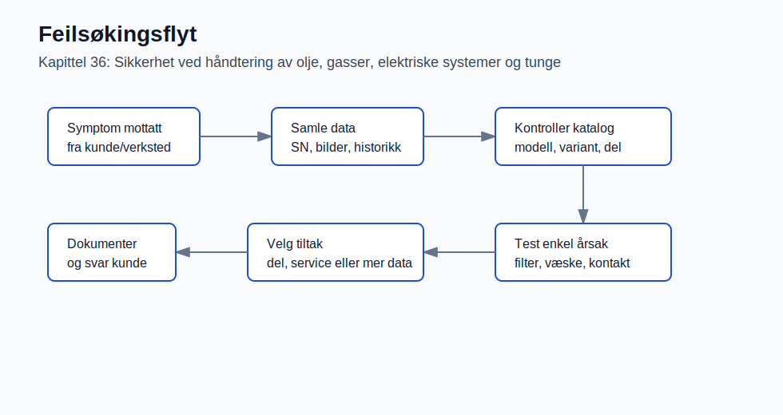

```mermaid
flowchart TD
    A[Symptom eller forespørsel mottatt] --> B[Samle serienummer, bilder og historikk]
    B --> C{Er motor og variant sikkert identifisert?}
    C -- Nei --> D[Be om mer dokumentasjon før del bekreftes]
    C -- Ja --> E[Kontroller delnummer og posisjon i katalog]
    E --> F{Stemmer symptom med foreslått del?}
    F -- Nei --> G[Foreslå feilsøking eller teknisk kontroll]
    F -- Ja --> H[Kontroller lager, pris og levering]
    H --> I[Send dokumentert kundesvar]
```

## Vedlikeholdsprosedyre
1. Avklar driftstimer, siste service og driftsmiljø.
2. Kontroller olje, filter, kjølevæske, sjøvannskrets, reimer, slanger og elektriske kontakter.
3. Sammenlign vedlikeholdsbehov med produsentens intervaller og faktisk bruk.
4. Anbefal servicekit når flere slitedeler bør skiftes samtidig.
5. Dokumenter hva som er anbefalt, hva kunden bestiller og eventuelle avvik fra normal prosedyre.

## Serienummeridentifikasjon
Serienummeridentifikasjon starter med å finne typeplate, motornummer eller annen unik identifikasjon. Be om bilde, ikke bare avskrift, fordi feil tegn, mellomrom og prefiks kan endre katalogoppslaget. Når serienummer ikke finnes, bygges identifikasjonen med modell, produksjonsår, bilder, tidligere fakturaer, servicehistorikk og delnummer fra monterte komponenter.

Minimumsdata bør være: fabrikat, modell, serienummer, eventuell product number/arrangement/CPL/motornummer, bilde av typeplate og bilde av motorens installasjon. Ved tvil skal saken stoppes for avklaring før del bekreftes.

## Reservedelsidentifikasjon
Reservedelsidentifikasjon skal bekrefte delnummer, posisjon, antall per motor, variant, side og eventuell erstatning. Dersom kunden oppgir et gammelt nummer, må det kontrolleres mot supersession. Dersom kunden bare sender bilde, skal bildet brukes som støtte, ikke som eneste grunnlag for bestilling.

Sjekk alltid om delnummeret gjelder enkeltkomponent, reparasjonssett, servicekit eller komplett enhet. Kontroller også om varen er høyre/venstre, gammel/ny type, standard/oversize eller knyttet til en bestemt produksjonsperiode.

## Bestillingsprosedyre
1. Opprett eller oppdater sak med kunde, fartøy, kontaktperson og tidsfrist.
2. Verifiser motoridentifikasjon og lagre bildedokumentasjon.
3. Finn korrekt delnummer i relevant katalog eller leverandørgrunnlag.
4. Kontroller supersession, antall, lagerstatus, pris, returvilkår og leveringstid.
5. Send ordrebekreftelse med delnummer, beskrivelse, antall, pris, levering og forbehold.
6. Følg opp leveransen til kunden har mottatt varen eller saken er lukket.

## Kvalitetspunkter før svar
- Har vi nok data til å gi et sikkert svar?
- Er delnummeret kontrollert mot riktig motorvariant?
- Er kundens tidsfrist realistisk med valgt fraktmåte?
- Er eventuelle forbehold skrevet tydelig?
- Kan en kollega forstå beslutningen ved å lese saken senere?

## Kapittelsammendrag
Hovedpoenget i kapittel 36 er at profesjonelt reservedelsarbeid krever struktur. Teknisk kunnskap, engelske fagtermer, praktisk feilsøking, dokumentasjon og kundedialog må henge sammen. Når medarbeideren jobber systematisk, reduseres feilbestillinger, kunden får bedre svar, og verkstedet kan planlegge arbeidet tryggere.

## Kryssreferanser
- For forrige tema, se kapittel 35: Bruk av skjemaer, bilder og tekniske opplysninger i support.
- For neste tema, se kapittel 37: Miljøhensyn og korrekt avfallshåndtering.
- For grunnleggende identifikasjon, se kapittel 12 og 17.
- For merkevise eksempler, se kapitlene 26-32.

## Fordypning for intern opplæring
Dette kapitlet skal brukes som arbeidsstandard, ikke bare som lesestoff. Når en ny medarbeider møter en sak om sikkerhet, skal vedkommende trene på å gå rolig fra fakta til vurdering og deretter til handling. I en marinemotorforhandler er konsekvensen av en feil ofte større enn verdien av selve delen. En feil impeller, feil sensor, feil filterinnsats eller feil pakningssett kan føre til tapt verkstedtid, utsatt avgang, irritert kunde og i verste fall ny driftsstans. Derfor skal hver sak behandles som en teknisk beslutning med sporbar dokumentasjon.

Profesjonelt nivå i dette kapitlet betyr at medarbeideren kan arbeide sikkert med sikker håndtering. Før kunden får et bindende svar, skal opplysningene i saken kontrolleres mot motorens identitet, faktisk installasjon og relevant produsentterminologi. Det praktiske målet er ikke å finne et raskt nummer, men å kunne forklare hvorfor valgt del, kontrollpunkt eller kundesvar er riktig for akkurat denne motoren. Når informasjon mangler, skal medarbeideren beskrive hva som mangler, hvorfor det er nødvendig, og hvilket neste steg som bringer saken videre.

## Tekniske forklaringer
Teknisk forståelse i dette kapitlet skal bygges rundt olje, drivstoff, gasser, batteri, elektriske anlegg, tunge deler og løfteutstyr. Medarbeideren må skille mellom synlig symptom, sannsynlig systemfeil og bestillbar komponent. En del kan se riktig ut på bilde, men likevel være feil dersom posisjon, variant, rating, kjøleroppsett, elektrisk plugg, monteringsside eller servicehistorikk ikke stemmer. Derfor skal teknisk vurdering alltid kobles til både funksjon og dokumentasjon: hva gjør komponenten, hvilket system påvirker den, og hvilken produsentkilde bekrefter at den passer.

I praksis betyr dette at tekniske data skal kobles til motorens faktiske installasjon. Marine motorer står ofte trangt, er utsatt for salt, vibrasjon, fukt og ujevnt belastningsmønster, og de kan være bygget om gjennom mange år. En motor kan ha original kjøler, ettermontert eksosbend, alternativ dynamo, endret filterbrakett eller annen sjøvannspumpe enn standard. Slike forhold gjør at delidentifikasjon må bygge på både produsentdata og synlig dokumentasjon fra motoren.

Produsentterminologi er en del av den tekniske forståelsen. Bruk uttrykk som Serial Number, Engine Number, Part Number, Service Kit, Exploded View, Supersession når de er relevante. Ikke oversett dem på en måte som fjerner presisjon. Skriv for eksempel «Engine Serial Number (ESN)» første gang og deretter «ESN» i saken dersom produsenten bruker dette. Skriv «Arrangement Number» når CAT-data krever det, «Product Number» når Volvo Penta bruker det, «CPL» når Cummins-konfigurasjon må kontrolleres, og «Model Code» når Yanmar-identifikasjon bygger på modellkode. Dette gjør dialogen med internasjonale leverandører mer presis.

## Illustrasjonsforslag
- Oversiktsdiagram som viser hvor sikkerhet passer inn i total arbeidsflyt fra kundeforespørsel til levert del.
- Nærbilde av typeplate/motorskilt med markering av serienummer, motornummer, modell og eventuell variantkode.
- Sprengskisse med markert posisjon, delnummer, antall per motor og mulige alternative versjoner.
- Feilsøkingsflyt med beslutningspunkter: mangler data, stemmer symptom, kreves mer teknisk kontroll, kan ordre bekreftes.
- Sammenligningsbilde av gammel og ny del der forskjell i tilkobling, side, lengde eller sensorplugg er markert.

## Virkelige verkstedseksempler
Eksempel 1: Et verksted står med en demontert komponent på benken og kunden venter på avklaring før fartøyet kan settes tilbake i drift. Verkstedet sender et nærbilde av delen, men ingen motorplate. En uerfaren medarbeider kan bli fristet til å søke på nummeret som står på støpegodset. En profesjonell medarbeider svarer at støpenummer ikke nødvendigvis er bestillbart delnummer, ber om bilde av typeplate, oversiktsbilde av motoren og bilde av monteringsstedet, og forklarer at dette hindrer feilbestilling. Når informasjonen kommer, kontrolleres delnummer mot sprengskisse, posisjon og antall. Først da gis pris og leveringstid.

Eksempel 2: En kunde ringer sent på dagen og sier at motoren har høy temperatur etter service. Kunden ønsker ny termostat. Medarbeideren skal ikke automatisk konkludere med termostatfeil. Spørsmålene bør avklare om impeller er byttet, om sjøvannsfilteret er rent, om kjølevæskenivået er riktig, om alarmen kommer ved tomgang eller belastning, og om det finnes lekkasje rundt varmeveksler eller slanger. Dersom kunden likevel vil bestille termostat, dokumenteres at feilsøking er anbefalt, og delnummer kontrolleres mot serienummer før ordre.

Eksempel 3: En intern selger mottar en gammel faktura med et delnummer som ikke lenger finnes. Riktig prosess er å kontrollere supersession, se om ny del krever tilhørende pakning, boltsett eller adapter, og notere både gammelt og nytt nummer i saken. Kunden skal få vite at delen er erstattet, hva som leveres, og om det finnes monteringsforbehold.

## Reservedelsidentifisering i praksis
Reservedelsidentifisering skal følge en fast rekkefølge. Først kontrolleres motorens identitet. Deretter kontrolleres delens system: drivstoff, luft, kjøling, smøring, eksos, elektrisk eller mekanisk kraftoverføring. Så kontrolleres posisjon i sprengskisse eller parts list. Til slutt kontrolleres antall, variant, supersession og leveringsstatus. Denne rekkefølgen hindrer at medarbeideren hopper direkte fra kundens ord til et tilfeldig delnummer.

Når en del har synlig nummer, må nummeret tolkes riktig. Mange komponenter har produksjonsnummer, støpenummer, leverandørnummer eller revisjonskode som ikke er det samme som bestillbart part number. Et filter kan ha nummer fra filterprodusent, men motorprodusentens parts catalogue kan bruke et annet nummer. En pumpe kan ha nummer på lokk, hus og komplett enhet. Spør derfor alltid: gjelder nummeret komplett del, reparasjonssett, underkomponent eller produsentens råkomponent?

## Serienummer og motornummer
Serienummer og motornummer er grunnlaget for korrekt katalogoppslag. Be kunden sende bilde av typeplate eller dataplate. Dersom kunden skriver nummeret manuelt, skal nummeret likevel kontrolleres mot bilde når det er mulig. Noter hele nummeret, inkludert prefiks, suffiks, bindestrek, mellomrom og eventuelle bokstaver. På enkelte produsenter kan små forskjeller peke til forskjellig produksjonsperiode, rating eller konfigurasjon.

Bruk motornummer sammen med modell, variant og applikasjon. En motor som driver generator kan ha andre deler enn en fremdriftsmotor. En motor i yrkesbåt kan ha annen rating enn samme motor i fritidsbåt. En eldre motor kan være bygget om med ny dynamo, annen sjøvannspumpe eller uoriginal filterbrakett. Dersom typeplate mangler, bygg identifikasjonen gjennom flere kilder: servicebok, tidligere faktura, bilder av motorens sider, nummer på pumpe, filter, turbo og gear, samt opplysninger om fartøy og produksjonsår.

## Feilsøking steg for steg
1. Definer symptomet med kundens egne ord og skriv det i saken. Skill mellom «kunden ønsker del» og «kunden beskriver feil».
2. Avklar når feilen oppstår: start, tomgang, belastning, marsjfart, varm motor, kald motor eller etter nylig service.
3. Kontroller grunnleggende forhold: væskenivå, filter, luft i drivstoff, sjøvannsstrøm, reimer, elektriske kontakter, sikringer og synlige lekkasjer.
4. Knytt symptomet til system: lav effekt peker ofte mot luft/drivstoff/eksos, høy temperatur mot kjøling, lavt oljetrykk mot smøring/sensor, startproblem mot batteri/starter/gløding/drivstoff.
5. Be om bilder eller måledata dersom symptomet ikke kan kobles sikkert til en del. Dette kan være bilde av alarmdisplay, trykkmåling, temperaturmåling eller bilde av montert komponent.
6. Kontroller relevant delnummer mot serienummer og variant. Dersom flere alternativer finnes, forklar kunden hva som skiller dem.
7. Dokumenter anbefalt tiltak, usikkerhet og eventuelle forbehold før ordre bekreftes.

## Vedlikehold
Vedlikehold skal vurderes mot driftstimer, produsentens maintenance schedule og faktisk driftsmiljø. Marine motorer som går korte turer, mye tomgang eller i salt miljø kan trenge hyppigere kontroll enn standard intervall antyder. Nye medarbeidere skal lære å spørre om siste service, hvilke filter som ble byttet, hvilken olje som ble brukt, om impeller er kontrollert, og om kjølevæske eller anoder er byttet etter plan.

En god vedlikeholdsanbefaling er konkret. I stedet for å skrive «ta service», bør medarbeideren foreslå relevante deler: olje- og drivstoffilter, luftfilter, impeller, reim, pakninger, anoder, kjølevæske og eventuelt servicekit. Dersom kunden har ukjent servicehistorikk, bør komplett servicekit vurderes. Dersom kunden har hatt overoppheting, bør sjøvannskrets og varmeveksler kontrolleres før bare én komponent byttes.

## Vanlige feil
- Serienummer leses feil fordi et tegn forveksles, for eksempel O/0 eller I/1.
- Kunden oppgir modellnavn, men ikke variant, rating eller applikasjon.
- Del velges ut fra bilde alene uten kontroll mot sprengskisse eller produsentkatalog.
- Supersession aksepteres uten å kontrollere om ny del krever tilbehør, pakning eller ombygging.
- Hastepress gjør at leveringsløfte gis før lagerstatus og fraktmulighet er bekreftet.
- Saksnotat mangler grunnlaget for beslutningen, slik at kollega ikke kan etterprøve valget.

## Kontrollspørsmål
- Hva er den viktigste tekniske risikoen i en sak som gjelder sikkerhet?
- Hvilke opplysninger må dokumenteres før bindende delnummer bekreftes?
- Hvordan forklarer du kunden hvorfor bilde av typeplate er nødvendig?
- Når bør du stoppe en ordre og be om mer dokumentasjon?
- Hvilke engelske produsentuttrykk bør du kunne bruke i denne typen sak?
- Hvordan dokumenterer du at et delnummer er erstattet av et nytt nummer?

## Praktisk sjekkliste for medarbeider
- Les saken som om en kollega skal overta den i morgen.
- Kontroller at motoridentifikasjon er dokumentert med bilde eller sikker kilde.
- Sjekk at delnummeret er knyttet til riktig posisjon i katalogen.
- Skriv tydelig om kunden har bedt om enkeltkomponent, servicekit eller komplett enhet.
- Noter om varen er spesialbestilling, utgått, erstattet eller ikke returbar.
- Send kundesvar med neste steg, ikke bare et løst delnummer.

## Kapittelspesifikk systemforståelse
For dette kapitlet er kjernen å forstå sikker håndtering av olje, gasser, elektriske systemer og tunge deler. Medarbeideren skal kunne forklare dette med praktiske ord til både kunde og kollega. Det betyr at teknisk teori må kobles til konkrete handlinger: hvilke data skal innhentes, hvilke komponenter kan være berørt, hvilken produsentterminologi skal brukes, og hva må dokumenteres før saken kan gå videre. Sikkerhet skal inn i reservedelsarbeidet fordi feil informasjon kan påvirke verkstedets risiko.

Når systemet vurderes, skal medarbeideren først plassere problemet i riktig teknisk sammenheng. Dersom kunden beskriver en alarm, må man finne ut om alarmen kommer fra reelt mekanisk avvik, elektrisk sensorfeil, feil etter service eller feil tolkning av instrumentet. Dersom kunden beskriver en del, må man avklare om kunden mener komplett enhet, servicekit, reparasjonssett eller enkeltkomponent. Dersom kunden beskriver motoren med vanlig navn, må man kontrollere om produsenten bruker mer presise begreper i katalogen.

## Komponentoversikt og arbeidsgrense
Relevante komponenter og opplysninger i dette kapitlet omfatter: SDS, PPE, lockout, lifting point, battery isolation, hot surface og spill kit. Listen er ikke ment som en erstatning for produsentens parts catalogue, men som en praktisk påminnelse om hva nye medarbeidere skal tenke på før de søker del. I interne saker skal komponentnavn skrives så presist som mulig. Bruk for eksempel «sjøvannspumpe / raw water pump» i stedet for bare «pumpe» når funksjonen er kjent, og «varmeveksler / heat exchanger» i stedet for bare «kjøler» når det er den komponenten saken gjelder.

Arbeidsgrensen for en reservedelsmedarbeider er også viktig. Medarbeideren skal ikke overta mekanikerens ansvar for demontering, måling eller diagnose på motoren, men skal kunne stille riktige spørsmål og foreslå riktig dokumentasjon. Når en sak går fra enkel delidentifikasjon til teknisk diagnose, skal dette markeres i saken. Da kan verksted, teknisk ansvarlig eller leverandør involveres med et klart spørsmål og et ryddig faktagrunnlag.

## Praktisk beslutningsregel
Bruk denne regelen i alle saker knyttet til kapitlet: Hvis motoridentifikasjon, komponentposisjon eller symptom ikke er sikkert nok dokumentert, skal medarbeideren ikke gi bindende delbekreftelse. Kunden kan få et foreløpig svar, men svaret må inneholde hva som mangler, hvorfor det mangler, og hva som skjer når informasjonen er mottatt. Dette er ikke treg service; det er profesjonell risikokontroll.

## Målrettet fordypning kapittel 31-40
### Sikkerhet i reservedelsarbeid og teknisk rådgivning
Selv om reservedelsmedarbeideren ofte sitter ved telefon eller PC, påvirker svarene sikkerheten i verkstedet. Feil løftepunkt, feil pakning, feil elektrisk komponent eller manglende advarsel om trykksatt system kan skape risiko. Bruk begreper som SDS, PPE, lockout/tagout, battery isolation, hot surface, lifting point og spill kit når saken krever det.

Ved arbeid med olje, drivstoff, kjølevæske, batteri og tunge komponenter skal medarbeideren unngå å gi monteringsinstruksjoner uten produsentgrunnlag. Henvis til service manual og verkstedkompetanse. Ved farlige symptomer, som drivstofflekkasje på varm motor, røykutvikling, elektrisk kortslutning eller kraftig overoppheting, skal saken prioriteres og sikker drift stoppes til verksted har vurdert motoren.

### Praktisk anvendelse i opplæring
Bruk dette kapitlet i en case der deltakeren må avgjøre hvilke opplysninger som er sikre, hvilke som mangler, og om saken kan gå til tilbud eller må stoppes for avklaring. Deltakeren skal skrive en kort intern vurdering og et profesjonelt kundesvar. Instruktøren bør særlig se etter korrekt bruk av produsentterminologi, tydelige forbehold og evne til å skille reservedelsidentifikasjon fra mekanisk diagnose.

## Realistisk opplæring i praksis
### Verkstedhistorie
En typisk sak i dette temaet starter med tung komponent flyttes uten løfteplan. Verkstedet trenger et raskt svar, men den erfarne medarbeideren stopper opp og spør først: hva vet vi sikkert, hva antar vi, og hva kan gi følgeskade hvis vi tar feil? I praksis betyr det at HMS, olje, strøm og løft må kobles til bilde, serienummer, komponentposisjon og kundens symptom før saken lukkes. Historien skal brukes i opplæring som en øvelse i å skrive et kort saksnotat: observasjon, vurdering, neste handling og forbehold.

### Kundehistorie
Kunden beskriver ofte problemet med driftsspråk: «motoren går tungt», «alarm kommer etter ti minutter», «jeg trenger den samme delen som sist» eller «båten skal ut i morgen». En profesjonell respons er rolig og konkret: bekreft behovet, forklar hvorfor identifikasjon trengs, be om riktig dokumentasjon og gi et realistisk tidspunkt for neste svar. Ikke korriger kunden unødvendig; oversett kundens språk til teknisk språk i saken.

### Typiske feil nye ansatte gjør
- søker på første synlige nummer uten å avklare om det er støpenummer, leverandørnummer eller bestillbart part number.
- lover levering før lagerstatus, frakt og returvilkår er kontrollert.
- antar at tidligere faktura alltid gjelder samme motorvariant.
- blander symptom og årsak, spesielt ved varme, lav effekt, startproblem og alarm.
- skriver for korte notater slik at kollega ikke kan forstå hvorfor valget ble tatt.

### Tips fra erfarne mekanikere og reservedelsselgere
- Se alltid etter systemet rundt delen: slanger, braketter, sensorer, reimer, kjølere og tilkoblinger forteller ofte mer enn delen alene.
- Still ett presist spørsmål om gangen når kunden er stresset; mange dårlige svar kommer av for lange spørsmålslister.
- Sammenlign gammel og ny del mot funksjon, ikke bare form. Riktig del skal passe, men også løse riktig problem.
- En erfaren reservedelsselger tenker i risiko: Hva er billigst å avklare nå, og hva blir dyrt hvis vi hopper over det?

### Vanlige kundespørsmål
| Spørsmål fra kunde | Profesjonelt svar |
|---|---|
| «Kan du bare sende samme del som sist?» | «Ja, hvis vi først bekrefter at det gjelder samme motor, samme posisjon og ingen supersession siden sist.» |
| «Holder det med bilde?» | «Bilde hjelper, men vi trenger også motoridentitet for å sikre variant og delnummer.» |
| «Hvorfor tar dette tid?» | «Fordi feil del kan gi ny driftsstans. Vi kontrollerer grunnlaget før vi lover levering.» |

### Beslutningstre for saken
| Trinn | Spørsmål | Handling |
|---|---|---|
| 1 | Er motoridentitet dokumentert med bilde eller sikker historikk? | Hvis nei: be om typeplate/dataplate eller alternativ dokumentasjon. |
| 2 | Er komponentens funksjon og posisjon kjent? | Hvis nei: be om oversiktsbilde og bilde av monteringssted. |
| 3 | Stemmer kundens symptom med delen som ønskes? | Hvis nei: anbefal feilsøking før del bestilles. |
| 4 | Finnes det supersession, kit eller variantvalg? | Kontroller produsentkilde og skriv forbehold i saken. |
| 5 | Kan pris, levering og returvilkår bekreftes? | Send dokumentert svar med neste steg og tydelig gyldighet. |

### Rask oppslagstabell
| Situasjon | Kontroller først | Vanlig fallgruve |
|---|---|---|
| Hasteordre | sikker motor-ID, lager, fraktfrist | levering loves før teknisk kontroll |
| Del fra bilde | posisjon, skala, tilkoblinger, nummer | bilde brukes som eneste beslutningsgrunnlag |
| Gammelt delnummer | supersession og kitinnhold | ny del krever ekstra pakning eller adapter |
| Uklart symptom | driftssituasjon, alarm, siste service | symptom blir tolket som sikker komponentfeil |

### Praktisk sjekkliste og inspeksjonsrutine
- Start med motoridentitet: fabrikat, modell, serienummer, variant, applikasjon og bilde av skilt.
- Kontroller området rundt komponenten: lekkasje, korrosjon, knekte fester, slitasje, varmemerker og uoriginale endringer.
- Spør om siste vedlikehold: olje, filter, impeller, reimer, kjølevæske, anoder og drivstoffilter.
- Noter driftstype: fritidsbruk, yrkesbruk, generator, fremdrift, tomgangsdrift eller langvarig høy belastning.
- Avklar om saken gjelder akutt drift, planlagt service, reklamasjon eller lagerpåfyll.

### Generelle vedlikeholdsintervaller som opplæringspunkt
| Kontrollpunkt | Typisk vurdering i opplæring | Må verifiseres |
|---|---|---|
| Olje og oljefilter | ofte basert på timer og kalender | produsentens maintenance schedule |
| Drivstoffilter/vannutskiller | hyppigere ved dårlig drivstoff eller sesongstart | motor- og filterspesifikasjon |
| Impeller og sjøvannskrets | kontrolleres særlig før sesong og etter varmgang | produsentens intervall og installasjon |
| Reimer, slanger og klemmer | visuell kontroll ved service og feilsøking | dimensjon, stramming og delnummer |

### Produsentverifikasjon
Alle konkrete delnumre, momentverdier, serviceintervaller, garantikrav, programvaredata og produsentspesifikke grenser skal kontrolleres mot offisiell produsentdokumentasjon før de brukes i tilbud, ordre eller verkstedinstruks. Marker tydelig i saken når svaret bygger på antakelse, eldre historikk, bilde uten motor-ID eller generell erfaring. Intervaller i tabellen er generelle opplæringspunkter. Faktiske intervaller styres av produsent, motorvariant, driftstimer, kalenderkrav, belastning og miljø.

## Produsentverifikasjon og faglig forbehold
Denne manualen skal brukes som intern opplæring og arbeidsmetode. Produsentspesifikke delnumre, intervaller, momentverdier, garantikrav og tekniske grenseverdier skal verifiseres mot gjeldende produsentdokumentasjon før de brukes i kundeordre eller verkstedinstruks. Marker saken internt dersom opplysningen bygger på antakelse, eldre historikk eller bilde uten bekreftet motoridentitet.

## Quiz med fasit
1. Hvilke tekniske data bør alltid samles før en del bekreftes?
2. Hvorfor er engelsk terminologi viktig i marine reservedeler?
3. Hva bør gjøres dersom kunden bare sender et bilde av delen?
4. Hvilke punkter bør kontrolleres før ordrebekreftelse sendes?
5. Hvorfor skal feilsøking dokumenteres, selv når kunden allerede ber om en bestemt del?

### Svar
1. Fabrikat, modell, serienummer, variantdata, bilde av typeplate, delnummer, posisjon og kundens symptombeskrivelse.
2. Fordi kataloger, portaler, servicemanualer og leverandørdialog ofte bruker engelske begreper som må forstås presist.
3. Be om serienummer, oversiktsbilde av motoren og eventuelle nummer på delen; bildet brukes som støtte, ikke eneste grunnlag.
4. Delnummer, antall, variant, pris, lagerstatus, leveringstid, frakt, returvilkår og eventuelle forbehold.
5. Fordi symptomet kan ha flere årsaker, og dokumentasjon viser hvorfor anbefalingen ble gitt.

---

# Kapittel 37: Miljøhensyn og korrekt avfallshåndtering

## Kapittelrolle
Dette kapitlet gir en grundig praktisk innføring i miljø. Temaet er viktig fordi reservedelsarbeid i marine miljøer kombinerer teknisk forståelse, presis kundedialog, dokumentert saksbehandling og realistisk leveranseoppfølging. Målet er at en ny medarbeider skal kunne bruke kunnskapen direkte i arbeid med verksted, kunde, lager og leverandør.

## Læringsmål
Etter kapitlet skal deltakeren kunne:
- forklare hovedbegrepene innen miljø
- bruke serienummer, modellinformasjon og delnummer i praktisk reservedelsarbeid
- kommunisere trygt med kunde, verksted, lager og leverandør
- dokumentere beslutninger slik at andre kan etterprøve saken
- kjenne igjen vanlige feil og velge riktig neste handling

## English technical terminology
- **Serial Number:** engelsk fagterm som ofte brukes i kataloger, servicelitteratur, leverandørportaler og internasjonal kundedialog.
- **Part Number:** engelsk fagterm som ofte brukes i kataloger, servicelitteratur, leverandørportaler og internasjonal kundedialog.
- **Engine Model:** engelsk fagterm som ofte brukes i kataloger, servicelitteratur, leverandørportaler og internasjonal kundedialog.
- **Variant:** engelsk fagterm som ofte brukes i kataloger, servicelitteratur, leverandørportaler og internasjonal kundedialog.
- **Service Kit:** engelsk fagterm som ofte brukes i kataloger, servicelitteratur, leverandørportaler og internasjonal kundedialog.
- **Troubleshooting:** engelsk fagterm som ofte brukes i kataloger, servicelitteratur, leverandørportaler og internasjonal kundedialog.
- **Maintenance:** engelsk fagterm som ofte brukes i kataloger, servicelitteratur, leverandørportaler og internasjonal kundedialog.
- **Ordering Procedure:** engelsk fagterm som ofte brukes i kataloger, servicelitteratur, leverandørportaler og internasjonal kundedialog.
- **Supersession:** engelsk fagterm som ofte brukes i kataloger, servicelitteratur, leverandørportaler og internasjonal kundedialog.
- **Technical Support:** engelsk fagterm som ofte brukes i kataloger, servicelitteratur, leverandørportaler og internasjonal kundedialog.

## Hoveddiagram

## Tekniske systemillustrasjoner

## Grundig forklaring
Hvordan avfall, væsker og emballasje håndteres forsvarlig må forstås både teknisk og praktisk. I marine reservedeler er det sjelden nok å vite hva kunden kaller delen. Medarbeideren må forstå hvilken funksjon delen har, hvor den sitter, hvilken motorvariant den tilhører, og hva som skjer dersom feil del bestilles. Derfor skal tekniske data, kundens beskrivelse og dokumentert katalogoppslag alltid vurderes sammen.

En god sak har fire kjennetegn: den har tydelig identifikasjon, tydelig problem- eller delbeskrivelse, tydelig beslutningsgrunnlag og tydelig oppfølging. Dersom ett av disse punktene mangler, skal saken markeres som usikker før kunden får et bindende svar.

## Praktisk verkstedeksempel
Et verksted står med demontert komponent og trenger rask avklaring. Medarbeideren registrerer kunde, fartøy, motorinformasjon og tidsfrist, ber om bilder av typeplate og komponent, sjekker katalog og lager, og sender et kort skriftlig svar med valgt del, grunnlag for valget og neste oppdateringstidspunkt.

## Kundesupporteksempel
Kunde: 'Motoren går dårlig, kan dere sende riktig del?' Profesjonelt svar: 'Vi kan hjelpe, men først må vi skille mellom symptom og delbehov. Send serienummer, bilde av motorplate, bilde av området feilen gjelder og en kort beskrivelse av når feilen oppstår. Da kan vi foreslå riktig del eller riktig neste feilsøkingstrinn.'

## Vanlige feil og årsaker
- feil eller ufullstendig serienummer.
- delnummer som er erstattet uten at saken dokumenteres.
- symptom som tolkes som delbehov uten feilsøking.
- kunde har bilde av lignende del, men ikke korrekt motorvariant.
- manglende avklaring av antall, side, posisjon eller leveringstid.

## Feilsøkingsflyt
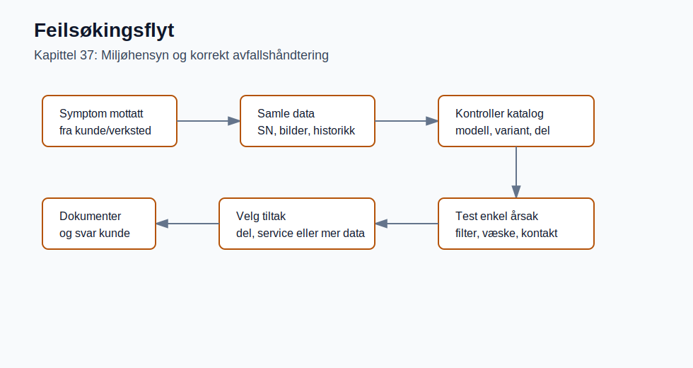

```mermaid
flowchart TD
    A[Symptom eller forespørsel mottatt] --> B[Samle serienummer, bilder og historikk]
    B --> C{Er motor og variant sikkert identifisert?}
    C -- Nei --> D[Be om mer dokumentasjon før del bekreftes]
    C -- Ja --> E[Kontroller delnummer og posisjon i katalog]
    E --> F{Stemmer symptom med foreslått del?}
    F -- Nei --> G[Foreslå feilsøking eller teknisk kontroll]
    F -- Ja --> H[Kontroller lager, pris og levering]
    H --> I[Send dokumentert kundesvar]
```

## Vedlikeholdsprosedyre
1. Avklar driftstimer, siste service og driftsmiljø.
2. Kontroller olje, filter, kjølevæske, sjøvannskrets, reimer, slanger og elektriske kontakter.
3. Sammenlign vedlikeholdsbehov med produsentens intervaller og faktisk bruk.
4. Anbefal servicekit når flere slitedeler bør skiftes samtidig.
5. Dokumenter hva som er anbefalt, hva kunden bestiller og eventuelle avvik fra normal prosedyre.

## Serienummeridentifikasjon
Serienummeridentifikasjon starter med å finne typeplate, motornummer eller annen unik identifikasjon. Be om bilde, ikke bare avskrift, fordi feil tegn, mellomrom og prefiks kan endre katalogoppslaget. Når serienummer ikke finnes, bygges identifikasjonen med modell, produksjonsår, bilder, tidligere fakturaer, servicehistorikk og delnummer fra monterte komponenter.

Minimumsdata bør være: fabrikat, modell, serienummer, eventuell product number/arrangement/CPL/motornummer, bilde av typeplate og bilde av motorens installasjon. Ved tvil skal saken stoppes for avklaring før del bekreftes.

## Reservedelsidentifikasjon
Reservedelsidentifikasjon skal bekrefte delnummer, posisjon, antall per motor, variant, side og eventuell erstatning. Dersom kunden oppgir et gammelt nummer, må det kontrolleres mot supersession. Dersom kunden bare sender bilde, skal bildet brukes som støtte, ikke som eneste grunnlag for bestilling.

Sjekk alltid om delnummeret gjelder enkeltkomponent, reparasjonssett, servicekit eller komplett enhet. Kontroller også om varen er høyre/venstre, gammel/ny type, standard/oversize eller knyttet til en bestemt produksjonsperiode.

## Bestillingsprosedyre
1. Opprett eller oppdater sak med kunde, fartøy, kontaktperson og tidsfrist.
2. Verifiser motoridentifikasjon og lagre bildedokumentasjon.
3. Finn korrekt delnummer i relevant katalog eller leverandørgrunnlag.
4. Kontroller supersession, antall, lagerstatus, pris, returvilkår og leveringstid.
5. Send ordrebekreftelse med delnummer, beskrivelse, antall, pris, levering og forbehold.
6. Følg opp leveransen til kunden har mottatt varen eller saken er lukket.

## Kvalitetspunkter før svar
- Har vi nok data til å gi et sikkert svar?
- Er delnummeret kontrollert mot riktig motorvariant?
- Er kundens tidsfrist realistisk med valgt fraktmåte?
- Er eventuelle forbehold skrevet tydelig?
- Kan en kollega forstå beslutningen ved å lese saken senere?

## Kapittelsammendrag
Hovedpoenget i kapittel 37 er at profesjonelt reservedelsarbeid krever struktur. Teknisk kunnskap, engelske fagtermer, praktisk feilsøking, dokumentasjon og kundedialog må henge sammen. Når medarbeideren jobber systematisk, reduseres feilbestillinger, kunden får bedre svar, og verkstedet kan planlegge arbeidet tryggere.

## Kryssreferanser
- For forrige tema, se kapittel 36: Sikkerhet ved håndtering av olje, gasser, elektriske systemer og tunge deler.
- For neste tema, se kapittel 38: Kontrollist for mottak av forespørsel om reservedeler.
- For grunnleggende identifikasjon, se kapittel 12 og 17.
- For merkevise eksempler, se kapitlene 26-32.

## Fordypning for intern opplæring
Dette kapitlet skal brukes som arbeidsstandard, ikke bare som lesestoff. Når en ny medarbeider møter en sak om miljø, skal vedkommende trene på å gå rolig fra fakta til vurdering og deretter til handling. I en marinemotorforhandler er konsekvensen av en feil ofte større enn verdien av selve delen. En feil impeller, feil sensor, feil filterinnsats eller feil pakningssett kan føre til tapt verkstedtid, utsatt avgang, irritert kunde og i verste fall ny driftsstans. Derfor skal hver sak behandles som en teknisk beslutning med sporbar dokumentasjon.

Profesjonelt nivå i dette kapitlet betyr at medarbeideren kan arbeide sikkert med miljø og avfall. Før kunden får et bindende svar, skal opplysningene i saken kontrolleres mot motorens identitet, faktisk installasjon og relevant produsentterminologi. Det praktiske målet er ikke å finne et raskt nummer, men å kunne forklare hvorfor valgt del, kontrollpunkt eller kundesvar er riktig for akkurat denne motoren. Når informasjon mangler, skal medarbeideren beskrive hva som mangler, hvorfor det er nødvendig, og hvilket neste steg som bringer saken videre.

## Tekniske forklaringer
Teknisk forståelse i dette kapitlet skal bygges rundt spillolje, filter, kjølevæske, batterier, absorberende materiell og dokumentert avfallslinje. Medarbeideren må skille mellom synlig symptom, sannsynlig systemfeil og bestillbar komponent. En del kan se riktig ut på bilde, men likevel være feil dersom posisjon, variant, rating, kjøleroppsett, elektrisk plugg, monteringsside eller servicehistorikk ikke stemmer. Derfor skal teknisk vurdering alltid kobles til både funksjon og dokumentasjon: hva gjør komponenten, hvilket system påvirker den, og hvilken produsentkilde bekrefter at den passer.

I praksis betyr dette at tekniske data skal kobles til motorens faktiske installasjon. Marine motorer står ofte trangt, er utsatt for salt, vibrasjon, fukt og ujevnt belastningsmønster, og de kan være bygget om gjennom mange år. En motor kan ha original kjøler, ettermontert eksosbend, alternativ dynamo, endret filterbrakett eller annen sjøvannspumpe enn standard. Slike forhold gjør at delidentifikasjon må bygge på både produsentdata og synlig dokumentasjon fra motoren.

Produsentterminologi er en del av den tekniske forståelsen. Bruk uttrykk som Serial Number, Engine Number, Part Number, Service Kit, Exploded View, Supersession når de er relevante. Ikke oversett dem på en måte som fjerner presisjon. Skriv for eksempel «Engine Serial Number (ESN)» første gang og deretter «ESN» i saken dersom produsenten bruker dette. Skriv «Arrangement Number» når CAT-data krever det, «Product Number» når Volvo Penta bruker det, «CPL» når Cummins-konfigurasjon må kontrolleres, og «Model Code» når Yanmar-identifikasjon bygger på modellkode. Dette gjør dialogen med internasjonale leverandører mer presis.

## Illustrasjonsforslag
- Oversiktsdiagram som viser hvor miljø passer inn i total arbeidsflyt fra kundeforespørsel til levert del.
- Nærbilde av typeplate/motorskilt med markering av serienummer, motornummer, modell og eventuell variantkode.
- Sprengskisse med markert posisjon, delnummer, antall per motor og mulige alternative versjoner.
- Feilsøkingsflyt med beslutningspunkter: mangler data, stemmer symptom, kreves mer teknisk kontroll, kan ordre bekreftes.
- Sammenligningsbilde av gammel og ny del der forskjell i tilkobling, side, lengde eller sensorplugg er markert.

## Virkelige verkstedseksempler
Eksempel 1: Et verksted står med en demontert komponent på benken og kunden venter på avklaring før fartøyet kan settes tilbake i drift. Verkstedet sender et nærbilde av delen, men ingen motorplate. En uerfaren medarbeider kan bli fristet til å søke på nummeret som står på støpegodset. En profesjonell medarbeider svarer at støpenummer ikke nødvendigvis er bestillbart delnummer, ber om bilde av typeplate, oversiktsbilde av motoren og bilde av monteringsstedet, og forklarer at dette hindrer feilbestilling. Når informasjonen kommer, kontrolleres delnummer mot sprengskisse, posisjon og antall. Først da gis pris og leveringstid.

Eksempel 2: En kunde ringer sent på dagen og sier at motoren har høy temperatur etter service. Kunden ønsker ny termostat. Medarbeideren skal ikke automatisk konkludere med termostatfeil. Spørsmålene bør avklare om impeller er byttet, om sjøvannsfilteret er rent, om kjølevæskenivået er riktig, om alarmen kommer ved tomgang eller belastning, og om det finnes lekkasje rundt varmeveksler eller slanger. Dersom kunden likevel vil bestille termostat, dokumenteres at feilsøking er anbefalt, og delnummer kontrolleres mot serienummer før ordre.

Eksempel 3: En intern selger mottar en gammel faktura med et delnummer som ikke lenger finnes. Riktig prosess er å kontrollere supersession, se om ny del krever tilhørende pakning, boltsett eller adapter, og notere både gammelt og nytt nummer i saken. Kunden skal få vite at delen er erstattet, hva som leveres, og om det finnes monteringsforbehold.

## Reservedelsidentifisering i praksis
Reservedelsidentifisering skal følge en fast rekkefølge. Først kontrolleres motorens identitet. Deretter kontrolleres delens system: drivstoff, luft, kjøling, smøring, eksos, elektrisk eller mekanisk kraftoverføring. Så kontrolleres posisjon i sprengskisse eller parts list. Til slutt kontrolleres antall, variant, supersession og leveringsstatus. Denne rekkefølgen hindrer at medarbeideren hopper direkte fra kundens ord til et tilfeldig delnummer.

Når en del har synlig nummer, må nummeret tolkes riktig. Mange komponenter har produksjonsnummer, støpenummer, leverandørnummer eller revisjonskode som ikke er det samme som bestillbart part number. Et filter kan ha nummer fra filterprodusent, men motorprodusentens parts catalogue kan bruke et annet nummer. En pumpe kan ha nummer på lokk, hus og komplett enhet. Spør derfor alltid: gjelder nummeret komplett del, reparasjonssett, underkomponent eller produsentens råkomponent?

## Serienummer og motornummer
Serienummer og motornummer er grunnlaget for korrekt katalogoppslag. Be kunden sende bilde av typeplate eller dataplate. Dersom kunden skriver nummeret manuelt, skal nummeret likevel kontrolleres mot bilde når det er mulig. Noter hele nummeret, inkludert prefiks, suffiks, bindestrek, mellomrom og eventuelle bokstaver. På enkelte produsenter kan små forskjeller peke til forskjellig produksjonsperiode, rating eller konfigurasjon.

Bruk motornummer sammen med modell, variant og applikasjon. En motor som driver generator kan ha andre deler enn en fremdriftsmotor. En motor i yrkesbåt kan ha annen rating enn samme motor i fritidsbåt. En eldre motor kan være bygget om med ny dynamo, annen sjøvannspumpe eller uoriginal filterbrakett. Dersom typeplate mangler, bygg identifikasjonen gjennom flere kilder: servicebok, tidligere faktura, bilder av motorens sider, nummer på pumpe, filter, turbo og gear, samt opplysninger om fartøy og produksjonsår.

## Feilsøking steg for steg
1. Definer symptomet med kundens egne ord og skriv det i saken. Skill mellom «kunden ønsker del» og «kunden beskriver feil».
2. Avklar når feilen oppstår: start, tomgang, belastning, marsjfart, varm motor, kald motor eller etter nylig service.
3. Kontroller grunnleggende forhold: væskenivå, filter, luft i drivstoff, sjøvannsstrøm, reimer, elektriske kontakter, sikringer og synlige lekkasjer.
4. Knytt symptomet til system: lav effekt peker ofte mot luft/drivstoff/eksos, høy temperatur mot kjøling, lavt oljetrykk mot smøring/sensor, startproblem mot batteri/starter/gløding/drivstoff.
5. Be om bilder eller måledata dersom symptomet ikke kan kobles sikkert til en del. Dette kan være bilde av alarmdisplay, trykkmåling, temperaturmåling eller bilde av montert komponent.
6. Kontroller relevant delnummer mot serienummer og variant. Dersom flere alternativer finnes, forklar kunden hva som skiller dem.
7. Dokumenter anbefalt tiltak, usikkerhet og eventuelle forbehold før ordre bekreftes.

## Vedlikehold
Vedlikehold skal vurderes mot driftstimer, produsentens maintenance schedule og faktisk driftsmiljø. Marine motorer som går korte turer, mye tomgang eller i salt miljø kan trenge hyppigere kontroll enn standard intervall antyder. Nye medarbeidere skal lære å spørre om siste service, hvilke filter som ble byttet, hvilken olje som ble brukt, om impeller er kontrollert, og om kjølevæske eller anoder er byttet etter plan.

En god vedlikeholdsanbefaling er konkret. I stedet for å skrive «ta service», bør medarbeideren foreslå relevante deler: olje- og drivstoffilter, luftfilter, impeller, reim, pakninger, anoder, kjølevæske og eventuelt servicekit. Dersom kunden har ukjent servicehistorikk, bør komplett servicekit vurderes. Dersom kunden har hatt overoppheting, bør sjøvannskrets og varmeveksler kontrolleres før bare én komponent byttes.

## Vanlige feil
- Serienummer leses feil fordi et tegn forveksles, for eksempel O/0 eller I/1.
- Kunden oppgir modellnavn, men ikke variant, rating eller applikasjon.
- Del velges ut fra bilde alene uten kontroll mot sprengskisse eller produsentkatalog.
- Supersession aksepteres uten å kontrollere om ny del krever tilbehør, pakning eller ombygging.
- Hastepress gjør at leveringsløfte gis før lagerstatus og fraktmulighet er bekreftet.
- Saksnotat mangler grunnlaget for beslutningen, slik at kollega ikke kan etterprøve valget.

## Kontrollspørsmål
- Hva er den viktigste tekniske risikoen i en sak som gjelder miljø?
- Hvilke opplysninger må dokumenteres før bindende delnummer bekreftes?
- Hvordan forklarer du kunden hvorfor bilde av typeplate er nødvendig?
- Når bør du stoppe en ordre og be om mer dokumentasjon?
- Hvilke engelske produsentuttrykk bør du kunne bruke i denne typen sak?
- Hvordan dokumenterer du at et delnummer er erstattet av et nytt nummer?

## Praktisk sjekkliste for medarbeider
- Les saken som om en kollega skal overta den i morgen.
- Kontroller at motoridentifikasjon er dokumentert med bilde eller sikker kilde.
- Sjekk at delnummeret er knyttet til riktig posisjon i katalogen.
- Skriv tydelig om kunden har bedt om enkeltkomponent, servicekit eller komplett enhet.
- Noter om varen er spesialbestilling, utgått, erstattet eller ikke returbar.
- Send kundesvar med neste steg, ikke bare et løst delnummer.

## Kapittelspesifikk systemforståelse
For dette kapitlet er kjernen å forstå miljøhensyn og avfallshåndtering. Medarbeideren skal kunne forklare dette med praktiske ord til både kunde og kollega. Det betyr at teknisk teori må kobles til konkrete handlinger: hvilke data skal innhentes, hvilke komponenter kan være berørt, hvilken produsentterminologi skal brukes, og hva må dokumenteres før saken kan gå videre. Miljøarbeid handler om rutiner som hindrer at små lekkasjer og feil sortering blir normal praksis.

Når systemet vurderes, skal medarbeideren først plassere problemet i riktig teknisk sammenheng. Dersom kunden beskriver en alarm, må man finne ut om alarmen kommer fra reelt mekanisk avvik, elektrisk sensorfeil, feil etter service eller feil tolkning av instrumentet. Dersom kunden beskriver en del, må man avklare om kunden mener komplett enhet, servicekit, reparasjonssett eller enkeltkomponent. Dersom kunden beskriver motoren med vanlig navn, må man kontrollere om produsenten bruker mer presise begreper i katalogen.

## Komponentoversikt og arbeidsgrense
Relevante komponenter og opplysninger i dette kapitlet omfatter: spillolje, brukte filtre, kjølevæske, absorbent, emballasje, farlig avfall og returordning. Listen er ikke ment som en erstatning for produsentens parts catalogue, men som en praktisk påminnelse om hva nye medarbeidere skal tenke på før de søker del. I interne saker skal komponentnavn skrives så presist som mulig. Bruk for eksempel «sjøvannspumpe / raw water pump» i stedet for bare «pumpe» når funksjonen er kjent, og «varmeveksler / heat exchanger» i stedet for bare «kjøler» når det er den komponenten saken gjelder.

Arbeidsgrensen for en reservedelsmedarbeider er også viktig. Medarbeideren skal ikke overta mekanikerens ansvar for demontering, måling eller diagnose på motoren, men skal kunne stille riktige spørsmål og foreslå riktig dokumentasjon. Når en sak går fra enkel delidentifikasjon til teknisk diagnose, skal dette markeres i saken. Da kan verksted, teknisk ansvarlig eller leverandør involveres med et klart spørsmål og et ryddig faktagrunnlag.

## Praktisk beslutningsregel
Bruk denne regelen i alle saker knyttet til kapitlet: Hvis motoridentifikasjon, komponentposisjon eller symptom ikke er sikkert nok dokumentert, skal medarbeideren ikke gi bindende delbekreftelse. Kunden kan få et foreløpig svar, men svaret må inneholde hva som mangler, hvorfor det mangler, og hva som skjer når informasjonen er mottatt. Dette er ikke treg service; det er profesjonell risikokontroll.

## Målrettet fordypning kapittel 31-40
### Miljøhensyn som del av servicekvalitet
Miljøarbeid i marine reservedeler handler om rutiner for spillolje, brukte filtre, kjølevæske, absorbenter, emballasje og farlig avfall. Når medarbeideren anbefaler servicekit, bør det også være naturlig å minne om korrekt håndtering av brukte filtre, olje og kjølevæske. Dette er særlig relevant for verksteder, havner og mobile serviceteknikere.

Ved retur og reklamasjon må væskefylte komponenter håndteres forsvarlig. Pumper, kjølere og filterhus skal tømmes og pakkes slik at transport ikke fører til lekkasje. Emballasje bør beskytte både delen og miljøet. Miljøhensyn er også økonomisk: lekkasje under transport kan gi avvist retur, gebyr eller skade på andre varer.

### Praktisk anvendelse i opplæring
Bruk dette kapitlet i en case der deltakeren må avgjøre hvilke opplysninger som er sikre, hvilke som mangler, og om saken kan gå til tilbud eller må stoppes for avklaring. Deltakeren skal skrive en kort intern vurdering og et profesjonelt kundesvar. Instruktøren bør særlig se etter korrekt bruk av produsentterminologi, tydelige forbehold og evne til å skille reservedelsidentifikasjon fra mekanisk diagnose.

## Realistisk opplæring i praksis
### Verkstedhistorie
En typisk sak i dette temaet starter med brukt kjølevæske står umerket. Verkstedet trenger et raskt svar, men den erfarne medarbeideren stopper opp og spør først: hva vet vi sikkert, hva antar vi, og hva kan gi følgeskade hvis vi tar feil? I praksis betyr det at avfall og miljøkontroll må kobles til bilde, serienummer, komponentposisjon og kundens symptom før saken lukkes. Historien skal brukes i opplæring som en øvelse i å skrive et kort saksnotat: observasjon, vurdering, neste handling og forbehold.

### Kundehistorie
Kunden beskriver ofte problemet med driftsspråk: «motoren går tungt», «alarm kommer etter ti minutter», «jeg trenger den samme delen som sist» eller «båten skal ut i morgen». En profesjonell respons er rolig og konkret: bekreft behovet, forklar hvorfor identifikasjon trengs, be om riktig dokumentasjon og gi et realistisk tidspunkt for neste svar. Ikke korriger kunden unødvendig; oversett kundens språk til teknisk språk i saken.

### Typiske feil nye ansatte gjør
- søker på første synlige nummer uten å avklare om det er støpenummer, leverandørnummer eller bestillbart part number.
- lover levering før lagerstatus, frakt og returvilkår er kontrollert.
- antar at tidligere faktura alltid gjelder samme motorvariant.
- blander symptom og årsak, spesielt ved varme, lav effekt, startproblem og alarm.
- skriver for korte notater slik at kollega ikke kan forstå hvorfor valget ble tatt.

### Tips fra erfarne mekanikere og reservedelsselgere
- Se alltid etter systemet rundt delen: slanger, braketter, sensorer, reimer, kjølere og tilkoblinger forteller ofte mer enn delen alene.
- Still ett presist spørsmål om gangen når kunden er stresset; mange dårlige svar kommer av for lange spørsmålslister.
- Sammenlign gammel og ny del mot funksjon, ikke bare form. Riktig del skal passe, men også løse riktig problem.
- En erfaren reservedelsselger tenker i risiko: Hva er billigst å avklare nå, og hva blir dyrt hvis vi hopper over det?

### Vanlige kundespørsmål
| Spørsmål fra kunde | Profesjonelt svar |
|---|---|
| «Kan du bare sende samme del som sist?» | «Ja, hvis vi først bekrefter at det gjelder samme motor, samme posisjon og ingen supersession siden sist.» |
| «Holder det med bilde?» | «Bilde hjelper, men vi trenger også motoridentitet for å sikre variant og delnummer.» |
| «Hvorfor tar dette tid?» | «Fordi feil del kan gi ny driftsstans. Vi kontrollerer grunnlaget før vi lover levering.» |

### Beslutningstre for saken
| Trinn | Spørsmål | Handling |
|---|---|---|
| 1 | Er motoridentitet dokumentert med bilde eller sikker historikk? | Hvis nei: be om typeplate/dataplate eller alternativ dokumentasjon. |
| 2 | Er komponentens funksjon og posisjon kjent? | Hvis nei: be om oversiktsbilde og bilde av monteringssted. |
| 3 | Stemmer kundens symptom med delen som ønskes? | Hvis nei: anbefal feilsøking før del bestilles. |
| 4 | Finnes det supersession, kit eller variantvalg? | Kontroller produsentkilde og skriv forbehold i saken. |
| 5 | Kan pris, levering og returvilkår bekreftes? | Send dokumentert svar med neste steg og tydelig gyldighet. |

### Rask oppslagstabell
| Situasjon | Kontroller først | Vanlig fallgruve |
|---|---|---|
| Hasteordre | sikker motor-ID, lager, fraktfrist | levering loves før teknisk kontroll |
| Del fra bilde | posisjon, skala, tilkoblinger, nummer | bilde brukes som eneste beslutningsgrunnlag |
| Gammelt delnummer | supersession og kitinnhold | ny del krever ekstra pakning eller adapter |
| Uklart symptom | driftssituasjon, alarm, siste service | symptom blir tolket som sikker komponentfeil |

### Praktisk sjekkliste og inspeksjonsrutine
- Start med motoridentitet: fabrikat, modell, serienummer, variant, applikasjon og bilde av skilt.
- Kontroller området rundt komponenten: lekkasje, korrosjon, knekte fester, slitasje, varmemerker og uoriginale endringer.
- Spør om siste vedlikehold: olje, filter, impeller, reimer, kjølevæske, anoder og drivstoffilter.
- Noter driftstype: fritidsbruk, yrkesbruk, generator, fremdrift, tomgangsdrift eller langvarig høy belastning.
- Avklar om saken gjelder akutt drift, planlagt service, reklamasjon eller lagerpåfyll.

### Generelle vedlikeholdsintervaller som opplæringspunkt
| Kontrollpunkt | Typisk vurdering i opplæring | Må verifiseres |
|---|---|---|
| Olje og oljefilter | ofte basert på timer og kalender | produsentens maintenance schedule |
| Drivstoffilter/vannutskiller | hyppigere ved dårlig drivstoff eller sesongstart | motor- og filterspesifikasjon |
| Impeller og sjøvannskrets | kontrolleres særlig før sesong og etter varmgang | produsentens intervall og installasjon |
| Reimer, slanger og klemmer | visuell kontroll ved service og feilsøking | dimensjon, stramming og delnummer |

### Produsentverifikasjon
Alle konkrete delnumre, momentverdier, serviceintervaller, garantikrav, programvaredata og produsentspesifikke grenser skal kontrolleres mot offisiell produsentdokumentasjon før de brukes i tilbud, ordre eller verkstedinstruks. Marker tydelig i saken når svaret bygger på antakelse, eldre historikk, bilde uten motor-ID eller generell erfaring. Intervaller i tabellen er generelle opplæringspunkter. Faktiske intervaller styres av produsent, motorvariant, driftstimer, kalenderkrav, belastning og miljø.

## Produsentverifikasjon og faglig forbehold
Denne manualen skal brukes som intern opplæring og arbeidsmetode. Produsentspesifikke delnumre, intervaller, momentverdier, garantikrav og tekniske grenseverdier skal verifiseres mot gjeldende produsentdokumentasjon før de brukes i kundeordre eller verkstedinstruks. Marker saken internt dersom opplysningen bygger på antakelse, eldre historikk eller bilde uten bekreftet motoridentitet.

## Quiz med fasit
1. Hvilke tekniske data bør alltid samles før en del bekreftes?
2. Hvorfor er engelsk terminologi viktig i marine reservedeler?
3. Hva bør gjøres dersom kunden bare sender et bilde av delen?
4. Hvilke punkter bør kontrolleres før ordrebekreftelse sendes?
5. Hvorfor skal feilsøking dokumenteres, selv når kunden allerede ber om en bestemt del?

### Svar
1. Fabrikat, modell, serienummer, variantdata, bilde av typeplate, delnummer, posisjon og kundens symptombeskrivelse.
2. Fordi kataloger, portaler, servicemanualer og leverandørdialog ofte bruker engelske begreper som må forstås presist.
3. Be om serienummer, oversiktsbilde av motoren og eventuelle nummer på delen; bildet brukes som støtte, ikke eneste grunnlag.
4. Delnummer, antall, variant, pris, lagerstatus, leveringstid, frakt, returvilkår og eventuelle forbehold.
5. Fordi symptomet kan ha flere årsaker, og dokumentasjon viser hvorfor anbefalingen ble gitt.

---

# Kapittel 38: Kontrollist for mottak av forespørsel om reservedeler

## Kapittelrolle
Dette kapitlet gir en grundig praktisk innføring i mottakskontroll. Temaet er viktig fordi reservedelsarbeid i marine miljøer kombinerer teknisk forståelse, presis kundedialog, dokumentert saksbehandling og realistisk leveranseoppfølging. Målet er at en ny medarbeider skal kunne bruke kunnskapen direkte i arbeid med verksted, kunde, lager og leverandør.

## Læringsmål
Etter kapitlet skal deltakeren kunne:
- forklare hovedbegrepene innen mottakskontroll
- bruke serienummer, modellinformasjon og delnummer i praktisk reservedelsarbeid
- kommunisere trygt med kunde, verksted, lager og leverandør
- dokumentere beslutninger slik at andre kan etterprøve saken
- kjenne igjen vanlige feil og velge riktig neste handling

## English technical terminology
- **Serial Number:** engelsk fagterm som ofte brukes i kataloger, servicelitteratur, leverandørportaler og internasjonal kundedialog.
- **Part Number:** engelsk fagterm som ofte brukes i kataloger, servicelitteratur, leverandørportaler og internasjonal kundedialog.
- **Engine Model:** engelsk fagterm som ofte brukes i kataloger, servicelitteratur, leverandørportaler og internasjonal kundedialog.
- **Variant:** engelsk fagterm som ofte brukes i kataloger, servicelitteratur, leverandørportaler og internasjonal kundedialog.
- **Service Kit:** engelsk fagterm som ofte brukes i kataloger, servicelitteratur, leverandørportaler og internasjonal kundedialog.
- **Troubleshooting:** engelsk fagterm som ofte brukes i kataloger, servicelitteratur, leverandørportaler og internasjonal kundedialog.
- **Maintenance:** engelsk fagterm som ofte brukes i kataloger, servicelitteratur, leverandørportaler og internasjonal kundedialog.
- **Ordering Procedure:** engelsk fagterm som ofte brukes i kataloger, servicelitteratur, leverandørportaler og internasjonal kundedialog.
- **Supersession:** engelsk fagterm som ofte brukes i kataloger, servicelitteratur, leverandørportaler og internasjonal kundedialog.
- **Technical Support:** engelsk fagterm som ofte brukes i kataloger, servicelitteratur, leverandørportaler og internasjonal kundedialog.

## Hoveddiagram

## Tekniske systemillustrasjoner

## Grundig forklaring
Hvordan første registrering av forespørsel kvalitetssikres må forstås både teknisk og praktisk. I marine reservedeler er det sjelden nok å vite hva kunden kaller delen. Medarbeideren må forstå hvilken funksjon delen har, hvor den sitter, hvilken motorvariant den tilhører, og hva som skjer dersom feil del bestilles. Derfor skal tekniske data, kundens beskrivelse og dokumentert katalogoppslag alltid vurderes sammen.

En god sak har fire kjennetegn: den har tydelig identifikasjon, tydelig problem- eller delbeskrivelse, tydelig beslutningsgrunnlag og tydelig oppfølging. Dersom ett av disse punktene mangler, skal saken markeres som usikker før kunden får et bindende svar.

## Praktisk verkstedeksempel
Et verksted står med demontert komponent og trenger rask avklaring. Medarbeideren registrerer kunde, fartøy, motorinformasjon og tidsfrist, ber om bilder av typeplate og komponent, sjekker katalog og lager, og sender et kort skriftlig svar med valgt del, grunnlag for valget og neste oppdateringstidspunkt.

## Kundesupporteksempel
Kunde: 'Motoren går dårlig, kan dere sende riktig del?' Profesjonelt svar: 'Vi kan hjelpe, men først må vi skille mellom symptom og delbehov. Send serienummer, bilde av motorplate, bilde av området feilen gjelder og en kort beskrivelse av når feilen oppstår. Da kan vi foreslå riktig del eller riktig neste feilsøkingstrinn.'

## Vanlige feil og årsaker
- feil eller ufullstendig serienummer.
- delnummer som er erstattet uten at saken dokumenteres.
- symptom som tolkes som delbehov uten feilsøking.
- kunde har bilde av lignende del, men ikke korrekt motorvariant.
- manglende avklaring av antall, side, posisjon eller leveringstid.

## Feilsøkingsflyt
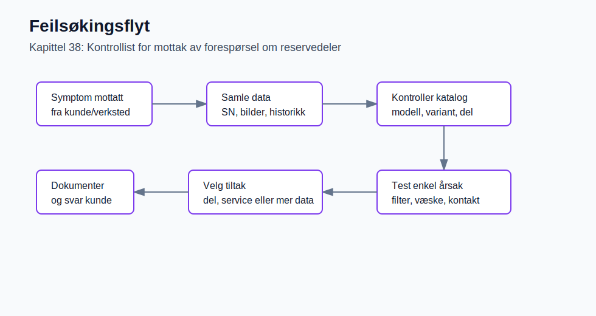

```mermaid
flowchart TD
    A[Symptom eller forespørsel mottatt] --> B[Samle serienummer, bilder og historikk]
    B --> C{Er motor og variant sikkert identifisert?}
    C -- Nei --> D[Be om mer dokumentasjon før del bekreftes]
    C -- Ja --> E[Kontroller delnummer og posisjon i katalog]
    E --> F{Stemmer symptom med foreslått del?}
    F -- Nei --> G[Foreslå feilsøking eller teknisk kontroll]
    F -- Ja --> H[Kontroller lager, pris og levering]
    H --> I[Send dokumentert kundesvar]
```

## Vedlikeholdsprosedyre
1. Avklar driftstimer, siste service og driftsmiljø.
2. Kontroller olje, filter, kjølevæske, sjøvannskrets, reimer, slanger og elektriske kontakter.
3. Sammenlign vedlikeholdsbehov med produsentens intervaller og faktisk bruk.
4. Anbefal servicekit når flere slitedeler bør skiftes samtidig.
5. Dokumenter hva som er anbefalt, hva kunden bestiller og eventuelle avvik fra normal prosedyre.

## Serienummeridentifikasjon
Serienummeridentifikasjon starter med å finne typeplate, motornummer eller annen unik identifikasjon. Be om bilde, ikke bare avskrift, fordi feil tegn, mellomrom og prefiks kan endre katalogoppslaget. Når serienummer ikke finnes, bygges identifikasjonen med modell, produksjonsår, bilder, tidligere fakturaer, servicehistorikk og delnummer fra monterte komponenter.

Minimumsdata bør være: fabrikat, modell, serienummer, eventuell product number/arrangement/CPL/motornummer, bilde av typeplate og bilde av motorens installasjon. Ved tvil skal saken stoppes for avklaring før del bekreftes.

## Reservedelsidentifikasjon
Reservedelsidentifikasjon skal bekrefte delnummer, posisjon, antall per motor, variant, side og eventuell erstatning. Dersom kunden oppgir et gammelt nummer, må det kontrolleres mot supersession. Dersom kunden bare sender bilde, skal bildet brukes som støtte, ikke som eneste grunnlag for bestilling.

Sjekk alltid om delnummeret gjelder enkeltkomponent, reparasjonssett, servicekit eller komplett enhet. Kontroller også om varen er høyre/venstre, gammel/ny type, standard/oversize eller knyttet til en bestemt produksjonsperiode.

## Bestillingsprosedyre
1. Opprett eller oppdater sak med kunde, fartøy, kontaktperson og tidsfrist.
2. Verifiser motoridentifikasjon og lagre bildedokumentasjon.
3. Finn korrekt delnummer i relevant katalog eller leverandørgrunnlag.
4. Kontroller supersession, antall, lagerstatus, pris, returvilkår og leveringstid.
5. Send ordrebekreftelse med delnummer, beskrivelse, antall, pris, levering og forbehold.
6. Følg opp leveransen til kunden har mottatt varen eller saken er lukket.

## Kvalitetspunkter før svar
- Har vi nok data til å gi et sikkert svar?
- Er delnummeret kontrollert mot riktig motorvariant?
- Er kundens tidsfrist realistisk med valgt fraktmåte?
- Er eventuelle forbehold skrevet tydelig?
- Kan en kollega forstå beslutningen ved å lese saken senere?

## Kapittelsammendrag
Hovedpoenget i kapittel 38 er at profesjonelt reservedelsarbeid krever struktur. Teknisk kunnskap, engelske fagtermer, praktisk feilsøking, dokumentasjon og kundedialog må henge sammen. Når medarbeideren jobber systematisk, reduseres feilbestillinger, kunden får bedre svar, og verkstedet kan planlegge arbeidet tryggere.

## Kryssreferanser
- For forrige tema, se kapittel 37: Miljøhensyn og korrekt avfallshåndtering.
- For neste tema, se kapittel 39: Kontrollist for validering av serienummer og delnummer.
- For grunnleggende identifikasjon, se kapittel 12 og 17.
- For merkevise eksempler, se kapitlene 26-32.

## Fordypning for intern opplæring
Dette kapitlet skal brukes som arbeidsstandard, ikke bare som lesestoff. Når en ny medarbeider møter en sak om mottak av forespørsel, skal vedkommende trene på å gå rolig fra fakta til vurdering og deretter til handling. I en marinemotorforhandler er konsekvensen av en feil ofte større enn verdien av selve delen. En feil impeller, feil sensor, feil filterinnsats eller feil pakningssett kan føre til tapt verkstedtid, utsatt avgang, irritert kunde og i verste fall ny driftsstans. Derfor skal hver sak behandles som en teknisk beslutning med sporbar dokumentasjon.

Profesjonelt nivå i dette kapitlet betyr at medarbeideren kan arbeide sikkert med mottak av forespørsel. Før kunden får et bindende svar, skal opplysningene i saken kontrolleres mot motorens identitet, faktisk installasjon og relevant produsentterminologi. Det praktiske målet er ikke å finne et raskt nummer, men å kunne forklare hvorfor valgt del, kontrollpunkt eller kundesvar er riktig for akkurat denne motoren. Når informasjon mangler, skal medarbeideren beskrive hva som mangler, hvorfor det er nødvendig, og hvilket neste steg som bringer saken videre.

## Tekniske forklaringer
Teknisk forståelse i dette kapitlet skal bygges rundt første spørsmål, motoridentitet, ønsket del, symptom, hastegrad og kontaktpunkt. Medarbeideren må skille mellom synlig symptom, sannsynlig systemfeil og bestillbar komponent. En del kan se riktig ut på bilde, men likevel være feil dersom posisjon, variant, rating, kjøleroppsett, elektrisk plugg, monteringsside eller servicehistorikk ikke stemmer. Derfor skal teknisk vurdering alltid kobles til både funksjon og dokumentasjon: hva gjør komponenten, hvilket system påvirker den, og hvilken produsentkilde bekrefter at den passer.

I praksis betyr dette at tekniske data skal kobles til motorens faktiske installasjon. Marine motorer står ofte trangt, er utsatt for salt, vibrasjon, fukt og ujevnt belastningsmønster, og de kan være bygget om gjennom mange år. En motor kan ha original kjøler, ettermontert eksosbend, alternativ dynamo, endret filterbrakett eller annen sjøvannspumpe enn standard. Slike forhold gjør at delidentifikasjon må bygge på både produsentdata og synlig dokumentasjon fra motoren.

Produsentterminologi er en del av den tekniske forståelsen. Bruk uttrykk som Serial Number, Engine Number, Part Number, Service Kit, Exploded View, Supersession når de er relevante. Ikke oversett dem på en måte som fjerner presisjon. Skriv for eksempel «Engine Serial Number (ESN)» første gang og deretter «ESN» i saken dersom produsenten bruker dette. Skriv «Arrangement Number» når CAT-data krever det, «Product Number» når Volvo Penta bruker det, «CPL» når Cummins-konfigurasjon må kontrolleres, og «Model Code» når Yanmar-identifikasjon bygger på modellkode. Dette gjør dialogen med internasjonale leverandører mer presis.

## Illustrasjonsforslag
- Oversiktsdiagram som viser hvor mottak av forespørsel passer inn i total arbeidsflyt fra kundeforespørsel til levert del.
- Nærbilde av typeplate/motorskilt med markering av serienummer, motornummer, modell og eventuell variantkode.
- Sprengskisse med markert posisjon, delnummer, antall per motor og mulige alternative versjoner.
- Feilsøkingsflyt med beslutningspunkter: mangler data, stemmer symptom, kreves mer teknisk kontroll, kan ordre bekreftes.
- Sammenligningsbilde av gammel og ny del der forskjell i tilkobling, side, lengde eller sensorplugg er markert.

## Virkelige verkstedseksempler
Eksempel 1: Et verksted står med en demontert komponent på benken og kunden venter på avklaring før fartøyet kan settes tilbake i drift. Verkstedet sender et nærbilde av delen, men ingen motorplate. En uerfaren medarbeider kan bli fristet til å søke på nummeret som står på støpegodset. En profesjonell medarbeider svarer at støpenummer ikke nødvendigvis er bestillbart delnummer, ber om bilde av typeplate, oversiktsbilde av motoren og bilde av monteringsstedet, og forklarer at dette hindrer feilbestilling. Når informasjonen kommer, kontrolleres delnummer mot sprengskisse, posisjon og antall. Først da gis pris og leveringstid.

Eksempel 2: En kunde ringer sent på dagen og sier at motoren har høy temperatur etter service. Kunden ønsker ny termostat. Medarbeideren skal ikke automatisk konkludere med termostatfeil. Spørsmålene bør avklare om impeller er byttet, om sjøvannsfilteret er rent, om kjølevæskenivået er riktig, om alarmen kommer ved tomgang eller belastning, og om det finnes lekkasje rundt varmeveksler eller slanger. Dersom kunden likevel vil bestille termostat, dokumenteres at feilsøking er anbefalt, og delnummer kontrolleres mot serienummer før ordre.

Eksempel 3: En intern selger mottar en gammel faktura med et delnummer som ikke lenger finnes. Riktig prosess er å kontrollere supersession, se om ny del krever tilhørende pakning, boltsett eller adapter, og notere både gammelt og nytt nummer i saken. Kunden skal få vite at delen er erstattet, hva som leveres, og om det finnes monteringsforbehold.

## Reservedelsidentifisering i praksis
Reservedelsidentifisering skal følge en fast rekkefølge. Først kontrolleres motorens identitet. Deretter kontrolleres delens system: drivstoff, luft, kjøling, smøring, eksos, elektrisk eller mekanisk kraftoverføring. Så kontrolleres posisjon i sprengskisse eller parts list. Til slutt kontrolleres antall, variant, supersession og leveringsstatus. Denne rekkefølgen hindrer at medarbeideren hopper direkte fra kundens ord til et tilfeldig delnummer.

Når en del har synlig nummer, må nummeret tolkes riktig. Mange komponenter har produksjonsnummer, støpenummer, leverandørnummer eller revisjonskode som ikke er det samme som bestillbart part number. Et filter kan ha nummer fra filterprodusent, men motorprodusentens parts catalogue kan bruke et annet nummer. En pumpe kan ha nummer på lokk, hus og komplett enhet. Spør derfor alltid: gjelder nummeret komplett del, reparasjonssett, underkomponent eller produsentens råkomponent?

## Serienummer og motornummer
Serienummer og motornummer er grunnlaget for korrekt katalogoppslag. Be kunden sende bilde av typeplate eller dataplate. Dersom kunden skriver nummeret manuelt, skal nummeret likevel kontrolleres mot bilde når det er mulig. Noter hele nummeret, inkludert prefiks, suffiks, bindestrek, mellomrom og eventuelle bokstaver. På enkelte produsenter kan små forskjeller peke til forskjellig produksjonsperiode, rating eller konfigurasjon.

Bruk motornummer sammen med modell, variant og applikasjon. En motor som driver generator kan ha andre deler enn en fremdriftsmotor. En motor i yrkesbåt kan ha annen rating enn samme motor i fritidsbåt. En eldre motor kan være bygget om med ny dynamo, annen sjøvannspumpe eller uoriginal filterbrakett. Dersom typeplate mangler, bygg identifikasjonen gjennom flere kilder: servicebok, tidligere faktura, bilder av motorens sider, nummer på pumpe, filter, turbo og gear, samt opplysninger om fartøy og produksjonsår.

## Feilsøking steg for steg
1. Definer symptomet med kundens egne ord og skriv det i saken. Skill mellom «kunden ønsker del» og «kunden beskriver feil».
2. Avklar når feilen oppstår: start, tomgang, belastning, marsjfart, varm motor, kald motor eller etter nylig service.
3. Kontroller grunnleggende forhold: væskenivå, filter, luft i drivstoff, sjøvannsstrøm, reimer, elektriske kontakter, sikringer og synlige lekkasjer.
4. Knytt symptomet til system: lav effekt peker ofte mot luft/drivstoff/eksos, høy temperatur mot kjøling, lavt oljetrykk mot smøring/sensor, startproblem mot batteri/starter/gløding/drivstoff.
5. Be om bilder eller måledata dersom symptomet ikke kan kobles sikkert til en del. Dette kan være bilde av alarmdisplay, trykkmåling, temperaturmåling eller bilde av montert komponent.
6. Kontroller relevant delnummer mot serienummer og variant. Dersom flere alternativer finnes, forklar kunden hva som skiller dem.
7. Dokumenter anbefalt tiltak, usikkerhet og eventuelle forbehold før ordre bekreftes.

## Vedlikehold
Vedlikehold skal vurderes mot driftstimer, produsentens maintenance schedule og faktisk driftsmiljø. Marine motorer som går korte turer, mye tomgang eller i salt miljø kan trenge hyppigere kontroll enn standard intervall antyder. Nye medarbeidere skal lære å spørre om siste service, hvilke filter som ble byttet, hvilken olje som ble brukt, om impeller er kontrollert, og om kjølevæske eller anoder er byttet etter plan.

En god vedlikeholdsanbefaling er konkret. I stedet for å skrive «ta service», bør medarbeideren foreslå relevante deler: olje- og drivstoffilter, luftfilter, impeller, reim, pakninger, anoder, kjølevæske og eventuelt servicekit. Dersom kunden har ukjent servicehistorikk, bør komplett servicekit vurderes. Dersom kunden har hatt overoppheting, bør sjøvannskrets og varmeveksler kontrolleres før bare én komponent byttes.

## Vanlige feil
- Serienummer leses feil fordi et tegn forveksles, for eksempel O/0 eller I/1.
- Kunden oppgir modellnavn, men ikke variant, rating eller applikasjon.
- Del velges ut fra bilde alene uten kontroll mot sprengskisse eller produsentkatalog.
- Supersession aksepteres uten å kontrollere om ny del krever tilbehør, pakning eller ombygging.
- Hastepress gjør at leveringsløfte gis før lagerstatus og fraktmulighet er bekreftet.
- Saksnotat mangler grunnlaget for beslutningen, slik at kollega ikke kan etterprøve valget.

## Kontrollspørsmål
- Hva er den viktigste tekniske risikoen i en sak som gjelder mottak av forespørsel?
- Hvilke opplysninger må dokumenteres før bindende delnummer bekreftes?
- Hvordan forklarer du kunden hvorfor bilde av typeplate er nødvendig?
- Når bør du stoppe en ordre og be om mer dokumentasjon?
- Hvilke engelske produsentuttrykk bør du kunne bruke i denne typen sak?
- Hvordan dokumenterer du at et delnummer er erstattet av et nytt nummer?

## Praktisk sjekkliste for medarbeider
- Les saken som om en kollega skal overta den i morgen.
- Kontroller at motoridentifikasjon er dokumentert med bilde eller sikker kilde.
- Sjekk at delnummeret er knyttet til riktig posisjon i katalogen.
- Skriv tydelig om kunden har bedt om enkeltkomponent, servicekit eller komplett enhet.
- Noter om varen er spesialbestilling, utgått, erstattet eller ikke returbar.
- Send kundesvar med neste steg, ikke bare et løst delnummer.

## Kapittelspesifikk systemforståelse
For dette kapitlet er kjernen å forstå mottak av reservedelsforespørsel. Medarbeideren skal kunne forklare dette med praktiske ord til både kunde og kollega. Det betyr at teknisk teori må kobles til konkrete handlinger: hvilke data skal innhentes, hvilke komponenter kan være berørt, hvilken produsentterminologi skal brukes, og hva må dokumenteres før saken kan gå videre. God mottakskontroll gjør resten av saken enklere og raskere.

Når systemet vurderes, skal medarbeideren først plassere problemet i riktig teknisk sammenheng. Dersom kunden beskriver en alarm, må man finne ut om alarmen kommer fra reelt mekanisk avvik, elektrisk sensorfeil, feil etter service eller feil tolkning av instrumentet. Dersom kunden beskriver en del, må man avklare om kunden mener komplett enhet, servicekit, reparasjonssett eller enkeltkomponent. Dersom kunden beskriver motoren med vanlig navn, må man kontrollere om produsenten bruker mer presise begreper i katalogen.

## Komponentoversikt og arbeidsgrense
Relevante komponenter og opplysninger i dette kapitlet omfatter: førstesvar, kundeidentitet, fartøy, motorinfo, delønske, symptom, hastegrad og dokumentasjon. Listen er ikke ment som en erstatning for produsentens parts catalogue, men som en praktisk påminnelse om hva nye medarbeidere skal tenke på før de søker del. I interne saker skal komponentnavn skrives så presist som mulig. Bruk for eksempel «sjøvannspumpe / raw water pump» i stedet for bare «pumpe» når funksjonen er kjent, og «varmeveksler / heat exchanger» i stedet for bare «kjøler» når det er den komponenten saken gjelder.

Arbeidsgrensen for en reservedelsmedarbeider er også viktig. Medarbeideren skal ikke overta mekanikerens ansvar for demontering, måling eller diagnose på motoren, men skal kunne stille riktige spørsmål og foreslå riktig dokumentasjon. Når en sak går fra enkel delidentifikasjon til teknisk diagnose, skal dette markeres i saken. Da kan verksted, teknisk ansvarlig eller leverandør involveres med et klart spørsmål og et ryddig faktagrunnlag.

## Praktisk beslutningsregel
Bruk denne regelen i alle saker knyttet til kapitlet: Hvis motoridentifikasjon, komponentposisjon eller symptom ikke er sikkert nok dokumentert, skal medarbeideren ikke gi bindende delbekreftelse. Kunden kan få et foreløpig svar, men svaret må inneholde hva som mangler, hvorfor det mangler, og hva som skjer når informasjonen er mottatt. Dette er ikke treg service; det er profesjonell risikokontroll.

## Målrettet fordypning kapittel 31-40
### Mottakskontroll som første kvalitetsbarriere
Mottak av forespørsel er første og kanskje viktigste kvalitetsbarriere. Registrer kunde, fartøy, kontaktperson, tidsfrist, motorfabrikat, modell, serienummer/motornummer, ønsket del, symptom og dokumentasjon. Dersom dette ikke gjøres ved første kontakt, flyttes usikkerheten videre til katalogoppslag, tilbud og bestilling.

En god mottaksmelding kan være standardisert: «Vi trenger motorplate, bilde av delen og oversiktsbilde av motoren før vi bekrefter delnummer.» Dette gjør opplæringen enklere og gir lik praksis mellom medarbeidere. Mottakskontrollen skal også markere hastegrad: ordinær service, planlagt reparasjon, driftsstans, sikkerhetsrisiko eller avgangsfrist.

### Praktisk anvendelse i opplæring
Bruk dette kapitlet i en case der deltakeren må avgjøre hvilke opplysninger som er sikre, hvilke som mangler, og om saken kan gå til tilbud eller må stoppes for avklaring. Deltakeren skal skrive en kort intern vurdering og et profesjonelt kundesvar. Instruktøren bør særlig se etter korrekt bruk av produsentterminologi, tydelige forbehold og evne til å skille reservedelsidentifikasjon fra mekanisk diagnose.

## Realistisk opplæring i praksis
### Verkstedhistorie
En typisk sak i dette temaet starter med første telefon mangler tekniske data. Verkstedet trenger et raskt svar, men den erfarne medarbeideren stopper opp og spør først: hva vet vi sikkert, hva antar vi, og hva kan gi følgeskade hvis vi tar feil? I praksis betyr det at mottaksskjema må kobles til bilde, serienummer, komponentposisjon og kundens symptom før saken lukkes. Historien skal brukes i opplæring som en øvelse i å skrive et kort saksnotat: observasjon, vurdering, neste handling og forbehold.

### Kundehistorie
Kunden beskriver ofte problemet med driftsspråk: «motoren går tungt», «alarm kommer etter ti minutter», «jeg trenger den samme delen som sist» eller «båten skal ut i morgen». En profesjonell respons er rolig og konkret: bekreft behovet, forklar hvorfor identifikasjon trengs, be om riktig dokumentasjon og gi et realistisk tidspunkt for neste svar. Ikke korriger kunden unødvendig; oversett kundens språk til teknisk språk i saken.

### Typiske feil nye ansatte gjør
- søker på første synlige nummer uten å avklare om det er støpenummer, leverandørnummer eller bestillbart part number.
- lover levering før lagerstatus, frakt og returvilkår er kontrollert.
- antar at tidligere faktura alltid gjelder samme motorvariant.
- blander symptom og årsak, spesielt ved varme, lav effekt, startproblem og alarm.
- skriver for korte notater slik at kollega ikke kan forstå hvorfor valget ble tatt.

### Tips fra erfarne mekanikere og reservedelsselgere
- Se alltid etter systemet rundt delen: slanger, braketter, sensorer, reimer, kjølere og tilkoblinger forteller ofte mer enn delen alene.
- Still ett presist spørsmål om gangen når kunden er stresset; mange dårlige svar kommer av for lange spørsmålslister.
- Sammenlign gammel og ny del mot funksjon, ikke bare form. Riktig del skal passe, men også løse riktig problem.
- En erfaren reservedelsselger tenker i risiko: Hva er billigst å avklare nå, og hva blir dyrt hvis vi hopper over det?

### Vanlige kundespørsmål
| Spørsmål fra kunde | Profesjonelt svar |
|---|---|
| «Kan du bare sende samme del som sist?» | «Ja, hvis vi først bekrefter at det gjelder samme motor, samme posisjon og ingen supersession siden sist.» |
| «Holder det med bilde?» | «Bilde hjelper, men vi trenger også motoridentitet for å sikre variant og delnummer.» |
| «Hvorfor tar dette tid?» | «Fordi feil del kan gi ny driftsstans. Vi kontrollerer grunnlaget før vi lover levering.» |

### Beslutningstre for saken
| Trinn | Spørsmål | Handling |
|---|---|---|
| 1 | Er motoridentitet dokumentert med bilde eller sikker historikk? | Hvis nei: be om typeplate/dataplate eller alternativ dokumentasjon. |
| 2 | Er komponentens funksjon og posisjon kjent? | Hvis nei: be om oversiktsbilde og bilde av monteringssted. |
| 3 | Stemmer kundens symptom med delen som ønskes? | Hvis nei: anbefal feilsøking før del bestilles. |
| 4 | Finnes det supersession, kit eller variantvalg? | Kontroller produsentkilde og skriv forbehold i saken. |
| 5 | Kan pris, levering og returvilkår bekreftes? | Send dokumentert svar med neste steg og tydelig gyldighet. |

### Rask oppslagstabell
| Situasjon | Kontroller først | Vanlig fallgruve |
|---|---|---|
| Hasteordre | sikker motor-ID, lager, fraktfrist | levering loves før teknisk kontroll |
| Del fra bilde | posisjon, skala, tilkoblinger, nummer | bilde brukes som eneste beslutningsgrunnlag |
| Gammelt delnummer | supersession og kitinnhold | ny del krever ekstra pakning eller adapter |
| Uklart symptom | driftssituasjon, alarm, siste service | symptom blir tolket som sikker komponentfeil |

### Praktisk sjekkliste og inspeksjonsrutine
- Start med motoridentitet: fabrikat, modell, serienummer, variant, applikasjon og bilde av skilt.
- Kontroller området rundt komponenten: lekkasje, korrosjon, knekte fester, slitasje, varmemerker og uoriginale endringer.
- Spør om siste vedlikehold: olje, filter, impeller, reimer, kjølevæske, anoder og drivstoffilter.
- Noter driftstype: fritidsbruk, yrkesbruk, generator, fremdrift, tomgangsdrift eller langvarig høy belastning.
- Avklar om saken gjelder akutt drift, planlagt service, reklamasjon eller lagerpåfyll.

### Generelle vedlikeholdsintervaller som opplæringspunkt
| Kontrollpunkt | Typisk vurdering i opplæring | Må verifiseres |
|---|---|---|
| Olje og oljefilter | ofte basert på timer og kalender | produsentens maintenance schedule |
| Drivstoffilter/vannutskiller | hyppigere ved dårlig drivstoff eller sesongstart | motor- og filterspesifikasjon |
| Impeller og sjøvannskrets | kontrolleres særlig før sesong og etter varmgang | produsentens intervall og installasjon |
| Reimer, slanger og klemmer | visuell kontroll ved service og feilsøking | dimensjon, stramming og delnummer |

### Produsentverifikasjon
Alle konkrete delnumre, momentverdier, serviceintervaller, garantikrav, programvaredata og produsentspesifikke grenser skal kontrolleres mot offisiell produsentdokumentasjon før de brukes i tilbud, ordre eller verkstedinstruks. Marker tydelig i saken når svaret bygger på antakelse, eldre historikk, bilde uten motor-ID eller generell erfaring. Intervaller i tabellen er generelle opplæringspunkter. Faktiske intervaller styres av produsent, motorvariant, driftstimer, kalenderkrav, belastning og miljø.

## Produsentverifikasjon og faglig forbehold
Når saken gjelder delnummer, serienummer, serviceintervall, momentdata, garanti, elektronikk eller kompatibilitet, skal opplysningen verifiseres mot produsentens dokumentasjon eller autorisert leverandør før bindende tilbud eller teknisk konklusjon gis. Manualen beskriver arbeidsmetode og risikopunkter; den erstatter ikke gjeldende parts catalogue, service manual, service bulletin eller produsentportal. Marker saken internt dersom opplysningen bygger på antakelse, eldre historikk eller bilde uten bekreftet motoridentitet.

## Quiz med fasit
1. Hvilke tekniske data bør alltid samles før en del bekreftes?
2. Hvorfor er engelsk terminologi viktig i marine reservedeler?
3. Hva bør gjøres dersom kunden bare sender et bilde av delen?
4. Hvilke punkter bør kontrolleres før ordrebekreftelse sendes?
5. Hvorfor skal feilsøking dokumenteres, selv når kunden allerede ber om en bestemt del?

### Svar
1. Fabrikat, modell, serienummer, variantdata, bilde av typeplate, delnummer, posisjon og kundens symptombeskrivelse.
2. Fordi kataloger, portaler, servicemanualer og leverandørdialog ofte bruker engelske begreper som må forstås presist.
3. Be om serienummer, oversiktsbilde av motoren og eventuelle nummer på delen; bildet brukes som støtte, ikke eneste grunnlag.
4. Delnummer, antall, variant, pris, lagerstatus, leveringstid, frakt, returvilkår og eventuelle forbehold.
5. Fordi symptomet kan ha flere årsaker, og dokumentasjon viser hvorfor anbefalingen ble gitt.

---

# Kapittel 39: Kontrollist for validering av serienummer og delnummer

## Kapittelrolle
Dette kapitlet gir en grundig praktisk innføring i validering. Temaet er viktig fordi reservedelsarbeid i marine miljøer kombinerer teknisk forståelse, presis kundedialog, dokumentert saksbehandling og realistisk leveranseoppfølging. Målet er at en ny medarbeider skal kunne bruke kunnskapen direkte i arbeid med verksted, kunde, lager og leverandør.

## Læringsmål
Etter kapitlet skal deltakeren kunne:
- forklare hovedbegrepene innen validering
- bruke serienummer, modellinformasjon og delnummer i praktisk reservedelsarbeid
- kommunisere trygt med kunde, verksted, lager og leverandør
- dokumentere beslutninger slik at andre kan etterprøve saken
- kjenne igjen vanlige feil og velge riktig neste handling

## English technical terminology
- **Serial Number:** engelsk fagterm som ofte brukes i kataloger, servicelitteratur, leverandørportaler og internasjonal kundedialog.
- **Part Number:** engelsk fagterm som ofte brukes i kataloger, servicelitteratur, leverandørportaler og internasjonal kundedialog.
- **Engine Model:** engelsk fagterm som ofte brukes i kataloger, servicelitteratur, leverandørportaler og internasjonal kundedialog.
- **Variant:** engelsk fagterm som ofte brukes i kataloger, servicelitteratur, leverandørportaler og internasjonal kundedialog.
- **Service Kit:** engelsk fagterm som ofte brukes i kataloger, servicelitteratur, leverandørportaler og internasjonal kundedialog.
- **Troubleshooting:** engelsk fagterm som ofte brukes i kataloger, servicelitteratur, leverandørportaler og internasjonal kundedialog.
- **Maintenance:** engelsk fagterm som ofte brukes i kataloger, servicelitteratur, leverandørportaler og internasjonal kundedialog.
- **Ordering Procedure:** engelsk fagterm som ofte brukes i kataloger, servicelitteratur, leverandørportaler og internasjonal kundedialog.
- **Supersession:** engelsk fagterm som ofte brukes i kataloger, servicelitteratur, leverandørportaler og internasjonal kundedialog.
- **Technical Support:** engelsk fagterm som ofte brukes i kataloger, servicelitteratur, leverandørportaler og internasjonal kundedialog.

## Hoveddiagram

## Tekniske systemillustrasjoner

## Grundig forklaring
Hvordan serienummer og delnummer kontrolleres før svar må forstås både teknisk og praktisk. I marine reservedeler er det sjelden nok å vite hva kunden kaller delen. Medarbeideren må forstå hvilken funksjon delen har, hvor den sitter, hvilken motorvariant den tilhører, og hva som skjer dersom feil del bestilles. Derfor skal tekniske data, kundens beskrivelse og dokumentert katalogoppslag alltid vurderes sammen.

En god sak har fire kjennetegn: den har tydelig identifikasjon, tydelig problem- eller delbeskrivelse, tydelig beslutningsgrunnlag og tydelig oppfølging. Dersom ett av disse punktene mangler, skal saken markeres som usikker før kunden får et bindende svar.

## Praktisk verkstedeksempel
Et verksted står med demontert komponent og trenger rask avklaring. Medarbeideren registrerer kunde, fartøy, motorinformasjon og tidsfrist, ber om bilder av typeplate og komponent, sjekker katalog og lager, og sender et kort skriftlig svar med valgt del, grunnlag for valget og neste oppdateringstidspunkt.

## Kundesupporteksempel
Kunde: 'Motoren går dårlig, kan dere sende riktig del?' Profesjonelt svar: 'Vi kan hjelpe, men først må vi skille mellom symptom og delbehov. Send serienummer, bilde av motorplate, bilde av området feilen gjelder og en kort beskrivelse av når feilen oppstår. Da kan vi foreslå riktig del eller riktig neste feilsøkingstrinn.'

## Vanlige feil og årsaker
- feil eller ufullstendig serienummer.
- delnummer som er erstattet uten at saken dokumenteres.
- symptom som tolkes som delbehov uten feilsøking.
- kunde har bilde av lignende del, men ikke korrekt motorvariant.
- manglende avklaring av antall, side, posisjon eller leveringstid.

## Feilsøkingsflyt

```mermaid
flowchart TD
    A[Symptom eller forespørsel mottatt] --> B[Samle serienummer, bilder og historikk]
    B --> C{Er motor og variant sikkert identifisert?}
    C -- Nei --> D[Be om mer dokumentasjon før del bekreftes]
    C -- Ja --> E[Kontroller delnummer og posisjon i katalog]
    E --> F{Stemmer symptom med foreslått del?}
    F -- Nei --> G[Foreslå feilsøking eller teknisk kontroll]
    F -- Ja --> H[Kontroller lager, pris og levering]
    H --> I[Send dokumentert kundesvar]
```

## Vedlikeholdsprosedyre
1. Avklar driftstimer, siste service og driftsmiljø.
2. Kontroller olje, filter, kjølevæske, sjøvannskrets, reimer, slanger og elektriske kontakter.
3. Sammenlign vedlikeholdsbehov med produsentens intervaller og faktisk bruk.
4. Anbefal servicekit når flere slitedeler bør skiftes samtidig.
5. Dokumenter hva som er anbefalt, hva kunden bestiller og eventuelle avvik fra normal prosedyre.

## Serienummeridentifikasjon
Serienummeridentifikasjon starter med å finne typeplate, motornummer eller annen unik identifikasjon. Be om bilde, ikke bare avskrift, fordi feil tegn, mellomrom og prefiks kan endre katalogoppslaget. Når serienummer ikke finnes, bygges identifikasjonen med modell, produksjonsår, bilder, tidligere fakturaer, servicehistorikk og delnummer fra monterte komponenter.

Minimumsdata bør være: fabrikat, modell, serienummer, eventuell product number/arrangement/CPL/motornummer, bilde av typeplate og bilde av motorens installasjon. Ved tvil skal saken stoppes for avklaring før del bekreftes.

## Reservedelsidentifikasjon
Reservedelsidentifikasjon skal bekrefte delnummer, posisjon, antall per motor, variant, side og eventuell erstatning. Dersom kunden oppgir et gammelt nummer, må det kontrolleres mot supersession. Dersom kunden bare sender bilde, skal bildet brukes som støtte, ikke som eneste grunnlag for bestilling.

Sjekk alltid om delnummeret gjelder enkeltkomponent, reparasjonssett, servicekit eller komplett enhet. Kontroller også om varen er høyre/venstre, gammel/ny type, standard/oversize eller knyttet til en bestemt produksjonsperiode.

## Bestillingsprosedyre
1. Opprett eller oppdater sak med kunde, fartøy, kontaktperson og tidsfrist.
2. Verifiser motoridentifikasjon og lagre bildedokumentasjon.
3. Finn korrekt delnummer i relevant katalog eller leverandørgrunnlag.
4. Kontroller supersession, antall, lagerstatus, pris, returvilkår og leveringstid.
5. Send ordrebekreftelse med delnummer, beskrivelse, antall, pris, levering og forbehold.
6. Følg opp leveransen til kunden har mottatt varen eller saken er lukket.

## Kvalitetspunkter før svar
- Har vi nok data til å gi et sikkert svar?
- Er delnummeret kontrollert mot riktig motorvariant?
- Er kundens tidsfrist realistisk med valgt fraktmåte?
- Er eventuelle forbehold skrevet tydelig?
- Kan en kollega forstå beslutningen ved å lese saken senere?

## Kapittelsammendrag
Hovedpoenget i kapittel 39 er at profesjonelt reservedelsarbeid krever struktur. Teknisk kunnskap, engelske fagtermer, praktisk feilsøking, dokumentasjon og kundedialog må henge sammen. Når medarbeideren jobber systematisk, reduseres feilbestillinger, kunden får bedre svar, og verkstedet kan planlegge arbeidet tryggere.

## Kryssreferanser
- For forrige tema, se kapittel 38: Kontrollist for mottak av forespørsel om reservedeler.
- For neste tema, se kapittel 40: Kontrollist for ordreoppfølging og kundesvar.
- For grunnleggende identifikasjon, se kapittel 12 og 17.
- For merkevise eksempler, se kapitlene 26-32.

## Fordypning for intern opplæring
Dette kapitlet skal brukes som arbeidsstandard, ikke bare som lesestoff. Når en ny medarbeider møter en sak om validering, skal vedkommende trene på å gå rolig fra fakta til vurdering og deretter til handling. I en marinemotorforhandler er konsekvensen av en feil ofte større enn verdien av selve delen. En feil impeller, feil sensor, feil filterinnsats eller feil pakningssett kan føre til tapt verkstedtid, utsatt avgang, irritert kunde og i verste fall ny driftsstans. Derfor skal hver sak behandles som en teknisk beslutning med sporbar dokumentasjon.

Profesjonelt nivå i dette kapitlet betyr at medarbeideren kan arbeide sikkert med validering. Før kunden får et bindende svar, skal opplysningene i saken kontrolleres mot motorens identitet, faktisk installasjon og relevant produsentterminologi. Det praktiske målet er ikke å finne et raskt nummer, men å kunne forklare hvorfor valgt del, kontrollpunkt eller kundesvar er riktig for akkurat denne motoren. Når informasjon mangler, skal medarbeideren beskrive hva som mangler, hvorfor det er nødvendig, og hvilket neste steg som bringer saken videre.

## Tekniske forklaringer
Teknisk forståelse i dette kapitlet skal bygges rundt serienummer, delnummer, variant, posisjon, supersession, lagerstatus og ordrenotat. Medarbeideren må skille mellom synlig symptom, sannsynlig systemfeil og bestillbar komponent. En del kan se riktig ut på bilde, men likevel være feil dersom posisjon, variant, rating, kjøleroppsett, elektrisk plugg, monteringsside eller servicehistorikk ikke stemmer. Derfor skal teknisk vurdering alltid kobles til både funksjon og dokumentasjon: hva gjør komponenten, hvilket system påvirker den, og hvilken produsentkilde bekrefter at den passer.

I praksis betyr dette at tekniske data skal kobles til motorens faktiske installasjon. Marine motorer står ofte trangt, er utsatt for salt, vibrasjon, fukt og ujevnt belastningsmønster, og de kan være bygget om gjennom mange år. En motor kan ha original kjøler, ettermontert eksosbend, alternativ dynamo, endret filterbrakett eller annen sjøvannspumpe enn standard. Slike forhold gjør at delidentifikasjon må bygge på både produsentdata og synlig dokumentasjon fra motoren.

Produsentterminologi er en del av den tekniske forståelsen. Bruk uttrykk som Serial Number, Engine Number, Part Number, Service Kit, Exploded View, Supersession når de er relevante. Ikke oversett dem på en måte som fjerner presisjon. Skriv for eksempel «Engine Serial Number (ESN)» første gang og deretter «ESN» i saken dersom produsenten bruker dette. Skriv «Arrangement Number» når CAT-data krever det, «Product Number» når Volvo Penta bruker det, «CPL» når Cummins-konfigurasjon må kontrolleres, og «Model Code» når Yanmar-identifikasjon bygger på modellkode. Dette gjør dialogen med internasjonale leverandører mer presis.

## Illustrasjonsforslag
- Oversiktsdiagram som viser hvor validering passer inn i total arbeidsflyt fra kundeforespørsel til levert del.
- Nærbilde av typeplate/motorskilt med markering av serienummer, motornummer, modell og eventuell variantkode.
- Sprengskisse med markert posisjon, delnummer, antall per motor og mulige alternative versjoner.
- Feilsøkingsflyt med beslutningspunkter: mangler data, stemmer symptom, kreves mer teknisk kontroll, kan ordre bekreftes.
- Sammenligningsbilde av gammel og ny del der forskjell i tilkobling, side, lengde eller sensorplugg er markert.

## Virkelige verkstedseksempler
Eksempel 1: Et verksted står med en demontert komponent på benken og kunden venter på avklaring før fartøyet kan settes tilbake i drift. Verkstedet sender et nærbilde av delen, men ingen motorplate. En uerfaren medarbeider kan bli fristet til å søke på nummeret som står på støpegodset. En profesjonell medarbeider svarer at støpenummer ikke nødvendigvis er bestillbart delnummer, ber om bilde av typeplate, oversiktsbilde av motoren og bilde av monteringsstedet, og forklarer at dette hindrer feilbestilling. Når informasjonen kommer, kontrolleres delnummer mot sprengskisse, posisjon og antall. Først da gis pris og leveringstid.

Eksempel 2: En kunde ringer sent på dagen og sier at motoren har høy temperatur etter service. Kunden ønsker ny termostat. Medarbeideren skal ikke automatisk konkludere med termostatfeil. Spørsmålene bør avklare om impeller er byttet, om sjøvannsfilteret er rent, om kjølevæskenivået er riktig, om alarmen kommer ved tomgang eller belastning, og om det finnes lekkasje rundt varmeveksler eller slanger. Dersom kunden likevel vil bestille termostat, dokumenteres at feilsøking er anbefalt, og delnummer kontrolleres mot serienummer før ordre.

Eksempel 3: En intern selger mottar en gammel faktura med et delnummer som ikke lenger finnes. Riktig prosess er å kontrollere supersession, se om ny del krever tilhørende pakning, boltsett eller adapter, og notere både gammelt og nytt nummer i saken. Kunden skal få vite at delen er erstattet, hva som leveres, og om det finnes monteringsforbehold.

## Reservedelsidentifisering i praksis
Reservedelsidentifisering skal følge en fast rekkefølge. Først kontrolleres motorens identitet. Deretter kontrolleres delens system: drivstoff, luft, kjøling, smøring, eksos, elektrisk eller mekanisk kraftoverføring. Så kontrolleres posisjon i sprengskisse eller parts list. Til slutt kontrolleres antall, variant, supersession og leveringsstatus. Denne rekkefølgen hindrer at medarbeideren hopper direkte fra kundens ord til et tilfeldig delnummer.

Når en del har synlig nummer, må nummeret tolkes riktig. Mange komponenter har produksjonsnummer, støpenummer, leverandørnummer eller revisjonskode som ikke er det samme som bestillbart part number. Et filter kan ha nummer fra filterprodusent, men motorprodusentens parts catalogue kan bruke et annet nummer. En pumpe kan ha nummer på lokk, hus og komplett enhet. Spør derfor alltid: gjelder nummeret komplett del, reparasjonssett, underkomponent eller produsentens råkomponent?

## Serienummer og motornummer
Serienummer og motornummer er grunnlaget for korrekt katalogoppslag. Be kunden sende bilde av typeplate eller dataplate. Dersom kunden skriver nummeret manuelt, skal nummeret likevel kontrolleres mot bilde når det er mulig. Noter hele nummeret, inkludert prefiks, suffiks, bindestrek, mellomrom og eventuelle bokstaver. På enkelte produsenter kan små forskjeller peke til forskjellig produksjonsperiode, rating eller konfigurasjon.

Bruk motornummer sammen med modell, variant og applikasjon. En motor som driver generator kan ha andre deler enn en fremdriftsmotor. En motor i yrkesbåt kan ha annen rating enn samme motor i fritidsbåt. En eldre motor kan være bygget om med ny dynamo, annen sjøvannspumpe eller uoriginal filterbrakett. Dersom typeplate mangler, bygg identifikasjonen gjennom flere kilder: servicebok, tidligere faktura, bilder av motorens sider, nummer på pumpe, filter, turbo og gear, samt opplysninger om fartøy og produksjonsår.

## Feilsøking steg for steg
1. Definer symptomet med kundens egne ord og skriv det i saken. Skill mellom «kunden ønsker del» og «kunden beskriver feil».
2. Avklar når feilen oppstår: start, tomgang, belastning, marsjfart, varm motor, kald motor eller etter nylig service.
3. Kontroller grunnleggende forhold: væskenivå, filter, luft i drivstoff, sjøvannsstrøm, reimer, elektriske kontakter, sikringer og synlige lekkasjer.
4. Knytt symptomet til system: lav effekt peker ofte mot luft/drivstoff/eksos, høy temperatur mot kjøling, lavt oljetrykk mot smøring/sensor, startproblem mot batteri/starter/gløding/drivstoff.
5. Be om bilder eller måledata dersom symptomet ikke kan kobles sikkert til en del. Dette kan være bilde av alarmdisplay, trykkmåling, temperaturmåling eller bilde av montert komponent.
6. Kontroller relevant delnummer mot serienummer og variant. Dersom flere alternativer finnes, forklar kunden hva som skiller dem.
7. Dokumenter anbefalt tiltak, usikkerhet og eventuelle forbehold før ordre bekreftes.

## Vedlikehold
Vedlikehold skal vurderes mot driftstimer, produsentens maintenance schedule og faktisk driftsmiljø. Marine motorer som går korte turer, mye tomgang eller i salt miljø kan trenge hyppigere kontroll enn standard intervall antyder. Nye medarbeidere skal lære å spørre om siste service, hvilke filter som ble byttet, hvilken olje som ble brukt, om impeller er kontrollert, og om kjølevæske eller anoder er byttet etter plan.

En god vedlikeholdsanbefaling er konkret. I stedet for å skrive «ta service», bør medarbeideren foreslå relevante deler: olje- og drivstoffilter, luftfilter, impeller, reim, pakninger, anoder, kjølevæske og eventuelt servicekit. Dersom kunden har ukjent servicehistorikk, bør komplett servicekit vurderes. Dersom kunden har hatt overoppheting, bør sjøvannskrets og varmeveksler kontrolleres før bare én komponent byttes.

## Vanlige feil
- Serienummer leses feil fordi et tegn forveksles, for eksempel O/0 eller I/1.
- Kunden oppgir modellnavn, men ikke variant, rating eller applikasjon.
- Del velges ut fra bilde alene uten kontroll mot sprengskisse eller produsentkatalog.
- Supersession aksepteres uten å kontrollere om ny del krever tilbehør, pakning eller ombygging.
- Hastepress gjør at leveringsløfte gis før lagerstatus og fraktmulighet er bekreftet.
- Saksnotat mangler grunnlaget for beslutningen, slik at kollega ikke kan etterprøve valget.

## Kontrollspørsmål
- Hva er den viktigste tekniske risikoen i en sak som gjelder validering?
- Hvilke opplysninger må dokumenteres før bindende delnummer bekreftes?
- Hvordan forklarer du kunden hvorfor bilde av typeplate er nødvendig?
- Når bør du stoppe en ordre og be om mer dokumentasjon?
- Hvilke engelske produsentuttrykk bør du kunne bruke i denne typen sak?
- Hvordan dokumenterer du at et delnummer er erstattet av et nytt nummer?

## Praktisk sjekkliste for medarbeider
- Les saken som om en kollega skal overta den i morgen.
- Kontroller at motoridentifikasjon er dokumentert med bilde eller sikker kilde.
- Sjekk at delnummeret er knyttet til riktig posisjon i katalogen.
- Skriv tydelig om kunden har bedt om enkeltkomponent, servicekit eller komplett enhet.
- Noter om varen er spesialbestilling, utgått, erstattet eller ikke returbar.
- Send kundesvar med neste steg, ikke bare et løst delnummer.

## Kapittelspesifikk systemforståelse
For dette kapitlet er kjernen å forstå validering av serienummer og delnummer. Medarbeideren skal kunne forklare dette med praktiske ord til både kunde og kollega. Det betyr at teknisk teori må kobles til konkrete handlinger: hvilke data skal innhentes, hvilke komponenter kan være berørt, hvilken produsentterminologi skal brukes, og hva må dokumenteres før saken kan gå videre. Validering er en aktiv kontroll, ikke bare å lese det kunden har skrevet.

Når systemet vurderes, skal medarbeideren først plassere problemet i riktig teknisk sammenheng. Dersom kunden beskriver en alarm, må man finne ut om alarmen kommer fra reelt mekanisk avvik, elektrisk sensorfeil, feil etter service eller feil tolkning av instrumentet. Dersom kunden beskriver en del, må man avklare om kunden mener komplett enhet, servicekit, reparasjonssett eller enkeltkomponent. Dersom kunden beskriver motoren med vanlig navn, må man kontrollere om produsenten bruker mer presise begreper i katalogen.

## Komponentoversikt og arbeidsgrense
Relevante komponenter og opplysninger i dette kapitlet omfatter: typeplate, katalogoppslag, supersession, quantity, position, serial break og variant. Listen er ikke ment som en erstatning for produsentens parts catalogue, men som en praktisk påminnelse om hva nye medarbeidere skal tenke på før de søker del. I interne saker skal komponentnavn skrives så presist som mulig. Bruk for eksempel «sjøvannspumpe / raw water pump» i stedet for bare «pumpe» når funksjonen er kjent, og «varmeveksler / heat exchanger» i stedet for bare «kjøler» når det er den komponenten saken gjelder.

Arbeidsgrensen for en reservedelsmedarbeider er også viktig. Medarbeideren skal ikke overta mekanikerens ansvar for demontering, måling eller diagnose på motoren, men skal kunne stille riktige spørsmål og foreslå riktig dokumentasjon. Når en sak går fra enkel delidentifikasjon til teknisk diagnose, skal dette markeres i saken. Da kan verksted, teknisk ansvarlig eller leverandør involveres med et klart spørsmål og et ryddig faktagrunnlag.

## Praktisk beslutningsregel
Bruk denne regelen i alle saker knyttet til kapitlet: Hvis motoridentifikasjon, komponentposisjon eller symptom ikke er sikkert nok dokumentert, skal medarbeideren ikke gi bindende delbekreftelse. Kunden kan få et foreløpig svar, men svaret må inneholde hva som mangler, hvorfor det mangler, og hva som skjer når informasjonen er mottatt. Dette er ikke treg service; det er profesjonell risikokontroll.

## Målrettet fordypning kapittel 31-40
### Validering av serienummer og delnummer
Validering betyr å kontrollere data aktivt mot en kilde, ikke bare kopiere kundens opplysninger. Serienummer skal sjekkes mot riktig produsentlogikk: CAT Arrangement Number, Volvo Penta Product Number, Cummins CPL, MAN/Scania engine number eller Yanmar model code der dette er relevant. Delnummer skal kontrolleres mot posisjon, antall, sidevalg, serial break og supersession.

Ved avvik skal saken stoppes og avklares. Hvis kundens delnummer ikke finnes, kan det være gammelt nummer, støpenummer, leverandørnummer eller feil avskrift. Hvis katalogen viser flere alternativer, skal forskjellen beskrives før kunden velger eller før verkstedet sender mer dokumentasjon. Validering er det punktet som oftest hindrer feilbestilling.

### Praktisk anvendelse i opplæring
Bruk dette kapitlet i en case der deltakeren må avgjøre hvilke opplysninger som er sikre, hvilke som mangler, og om saken kan gå til tilbud eller må stoppes for avklaring. Deltakeren skal skrive en kort intern vurdering og et profesjonelt kundesvar. Instruktøren bør særlig se etter korrekt bruk av produsentterminologi, tydelige forbehold og evne til å skille reservedelsidentifikasjon fra mekanisk diagnose.

## Realistisk opplæring i praksis
### Verkstedhistorie
En typisk sak i dette temaet starter med serienummer og delnummer stemmer ikke. Verkstedet trenger et raskt svar, men den erfarne medarbeideren stopper opp og spør først: hva vet vi sikkert, hva antar vi, og hva kan gi følgeskade hvis vi tar feil? I praksis betyr det at kontroll før bekreftelse må kobles til bilde, serienummer, komponentposisjon og kundens symptom før saken lukkes. Historien skal brukes i opplæring som en øvelse i å skrive et kort saksnotat: observasjon, vurdering, neste handling og forbehold.

### Kundehistorie
Kunden beskriver ofte problemet med driftsspråk: «motoren går tungt», «alarm kommer etter ti minutter», «jeg trenger den samme delen som sist» eller «båten skal ut i morgen». En profesjonell respons er rolig og konkret: bekreft behovet, forklar hvorfor identifikasjon trengs, be om riktig dokumentasjon og gi et realistisk tidspunkt for neste svar. Ikke korriger kunden unødvendig; oversett kundens språk til teknisk språk i saken.

### Typiske feil nye ansatte gjør
- søker på første synlige nummer uten å avklare om det er støpenummer, leverandørnummer eller bestillbart part number.
- lover levering før lagerstatus, frakt og returvilkår er kontrollert.
- antar at tidligere faktura alltid gjelder samme motorvariant.
- blander symptom og årsak, spesielt ved varme, lav effekt, startproblem og alarm.
- skriver for korte notater slik at kollega ikke kan forstå hvorfor valget ble tatt.

### Tips fra erfarne mekanikere og reservedelsselgere
- Se alltid etter systemet rundt delen: slanger, braketter, sensorer, reimer, kjølere og tilkoblinger forteller ofte mer enn delen alene.
- Still ett presist spørsmål om gangen når kunden er stresset; mange dårlige svar kommer av for lange spørsmålslister.
- Sammenlign gammel og ny del mot funksjon, ikke bare form. Riktig del skal passe, men også løse riktig problem.
- En erfaren reservedelsselger tenker i risiko: Hva er billigst å avklare nå, og hva blir dyrt hvis vi hopper over det?

### Vanlige kundespørsmål
| Spørsmål fra kunde | Profesjonelt svar |
|---|---|
| «Kan du bare sende samme del som sist?» | «Ja, hvis vi først bekrefter at det gjelder samme motor, samme posisjon og ingen supersession siden sist.» |
| «Holder det med bilde?» | «Bilde hjelper, men vi trenger også motoridentitet for å sikre variant og delnummer.» |
| «Hvorfor tar dette tid?» | «Fordi feil del kan gi ny driftsstans. Vi kontrollerer grunnlaget før vi lover levering.» |

### Beslutningstre for saken
| Trinn | Spørsmål | Handling |
|---|---|---|
| 1 | Er motoridentitet dokumentert med bilde eller sikker historikk? | Hvis nei: be om typeplate/dataplate eller alternativ dokumentasjon. |
| 2 | Er komponentens funksjon og posisjon kjent? | Hvis nei: be om oversiktsbilde og bilde av monteringssted. |
| 3 | Stemmer kundens symptom med delen som ønskes? | Hvis nei: anbefal feilsøking før del bestilles. |
| 4 | Finnes det supersession, kit eller variantvalg? | Kontroller produsentkilde og skriv forbehold i saken. |
| 5 | Kan pris, levering og returvilkår bekreftes? | Send dokumentert svar med neste steg og tydelig gyldighet. |

### Rask oppslagstabell
| Situasjon | Kontroller først | Vanlig fallgruve |
|---|---|---|
| Hasteordre | sikker motor-ID, lager, fraktfrist | levering loves før teknisk kontroll |
| Del fra bilde | posisjon, skala, tilkoblinger, nummer | bilde brukes som eneste beslutningsgrunnlag |
| Gammelt delnummer | supersession og kitinnhold | ny del krever ekstra pakning eller adapter |
| Uklart symptom | driftssituasjon, alarm, siste service | symptom blir tolket som sikker komponentfeil |

### Praktisk sjekkliste og inspeksjonsrutine
- Start med motoridentitet: fabrikat, modell, serienummer, variant, applikasjon og bilde av skilt.
- Kontroller området rundt komponenten: lekkasje, korrosjon, knekte fester, slitasje, varmemerker og uoriginale endringer.
- Spør om siste vedlikehold: olje, filter, impeller, reimer, kjølevæske, anoder og drivstoffilter.
- Noter driftstype: fritidsbruk, yrkesbruk, generator, fremdrift, tomgangsdrift eller langvarig høy belastning.
- Avklar om saken gjelder akutt drift, planlagt service, reklamasjon eller lagerpåfyll.

### Generelle vedlikeholdsintervaller som opplæringspunkt
| Kontrollpunkt | Typisk vurdering i opplæring | Må verifiseres |
|---|---|---|
| Olje og oljefilter | ofte basert på timer og kalender | produsentens maintenance schedule |
| Drivstoffilter/vannutskiller | hyppigere ved dårlig drivstoff eller sesongstart | motor- og filterspesifikasjon |
| Impeller og sjøvannskrets | kontrolleres særlig før sesong og etter varmgang | produsentens intervall og installasjon |
| Reimer, slanger og klemmer | visuell kontroll ved service og feilsøking | dimensjon, stramming og delnummer |

### Produsentverifikasjon
Alle konkrete delnumre, momentverdier, serviceintervaller, garantikrav, programvaredata og produsentspesifikke grenser skal kontrolleres mot offisiell produsentdokumentasjon før de brukes i tilbud, ordre eller verkstedinstruks. Marker tydelig i saken når svaret bygger på antakelse, eldre historikk, bilde uten motor-ID eller generell erfaring. Intervaller i tabellen er generelle opplæringspunkter. Faktiske intervaller styres av produsent, motorvariant, driftstimer, kalenderkrav, belastning og miljø.

## Produsentverifikasjon og faglig forbehold
Når saken gjelder delnummer, serienummer, serviceintervall, momentdata, garanti, elektronikk eller kompatibilitet, skal opplysningen verifiseres mot produsentens dokumentasjon eller autorisert leverandør før bindende tilbud eller teknisk konklusjon gis. Manualen beskriver arbeidsmetode og risikopunkter; den erstatter ikke gjeldende parts catalogue, service manual, service bulletin eller produsentportal. Marker saken internt dersom opplysningen bygger på antakelse, eldre historikk eller bilde uten bekreftet motoridentitet.

## Quiz med fasit
1. Hvilke tekniske data bør alltid samles før en del bekreftes?
2. Hvorfor er engelsk terminologi viktig i marine reservedeler?
3. Hva bør gjøres dersom kunden bare sender et bilde av delen?
4. Hvilke punkter bør kontrolleres før ordrebekreftelse sendes?
5. Hvorfor skal feilsøking dokumenteres, selv når kunden allerede ber om en bestemt del?

### Svar
1. Fabrikat, modell, serienummer, variantdata, bilde av typeplate, delnummer, posisjon og kundens symptombeskrivelse.
2. Fordi kataloger, portaler, servicemanualer og leverandørdialog ofte bruker engelske begreper som må forstås presist.
3. Be om serienummer, oversiktsbilde av motoren og eventuelle nummer på delen; bildet brukes som støtte, ikke eneste grunnlag.
4. Delnummer, antall, variant, pris, lagerstatus, leveringstid, frakt, returvilkår og eventuelle forbehold.
5. Fordi symptomet kan ha flere årsaker, og dokumentasjon viser hvorfor anbefalingen ble gitt.

---

# Kapittel 40: Kontrollist for ordreoppfølging og kundesvar

## Kapittelrolle
Dette kapitlet gir en grundig praktisk innføring i kundesvar. Temaet er viktig fordi reservedelsarbeid i marine miljøer kombinerer teknisk forståelse, presis kundedialog, dokumentert saksbehandling og realistisk leveranseoppfølging. Målet er at en ny medarbeider skal kunne bruke kunnskapen direkte i arbeid med verksted, kunde, lager og leverandør.

## Læringsmål
Etter kapitlet skal deltakeren kunne:
- forklare hovedbegrepene innen kundesvar
- bruke serienummer, modellinformasjon og delnummer i praktisk reservedelsarbeid
- kommunisere trygt med kunde, verksted, lager og leverandør
- dokumentere beslutninger slik at andre kan etterprøve saken
- kjenne igjen vanlige feil og velge riktig neste handling

## English technical terminology
- **Serial Number:** engelsk fagterm som ofte brukes i kataloger, servicelitteratur, leverandørportaler og internasjonal kundedialog.
- **Part Number:** engelsk fagterm som ofte brukes i kataloger, servicelitteratur, leverandørportaler og internasjonal kundedialog.
- **Engine Model:** engelsk fagterm som ofte brukes i kataloger, servicelitteratur, leverandørportaler og internasjonal kundedialog.
- **Variant:** engelsk fagterm som ofte brukes i kataloger, servicelitteratur, leverandørportaler og internasjonal kundedialog.
- **Service Kit:** engelsk fagterm som ofte brukes i kataloger, servicelitteratur, leverandørportaler og internasjonal kundedialog.
- **Troubleshooting:** engelsk fagterm som ofte brukes i kataloger, servicelitteratur, leverandørportaler og internasjonal kundedialog.
- **Maintenance:** engelsk fagterm som ofte brukes i kataloger, servicelitteratur, leverandørportaler og internasjonal kundedialog.
- **Ordering Procedure:** engelsk fagterm som ofte brukes i kataloger, servicelitteratur, leverandørportaler og internasjonal kundedialog.
- **Supersession:** engelsk fagterm som ofte brukes i kataloger, servicelitteratur, leverandørportaler og internasjonal kundedialog.
- **Technical Support:** engelsk fagterm som ofte brukes i kataloger, servicelitteratur, leverandørportaler og internasjonal kundedialog.

## Hoveddiagram

## Tekniske systemillustrasjoner

## Grundig forklaring
Hvordan ordrestatus og svar holdes presise må forstås både teknisk og praktisk. I marine reservedeler er det sjelden nok å vite hva kunden kaller delen. Medarbeideren må forstå hvilken funksjon delen har, hvor den sitter, hvilken motorvariant den tilhører, og hva som skjer dersom feil del bestilles. Derfor skal tekniske data, kundens beskrivelse og dokumentert katalogoppslag alltid vurderes sammen.

En god sak har fire kjennetegn: den har tydelig identifikasjon, tydelig problem- eller delbeskrivelse, tydelig beslutningsgrunnlag og tydelig oppfølging. Dersom ett av disse punktene mangler, skal saken markeres som usikker før kunden får et bindende svar.

## Praktisk verkstedeksempel
Et verksted står med demontert komponent og trenger rask avklaring. Medarbeideren registrerer kunde, fartøy, motorinformasjon og tidsfrist, ber om bilder av typeplate og komponent, sjekker katalog og lager, og sender et kort skriftlig svar med valgt del, grunnlag for valget og neste oppdateringstidspunkt.

## Kundesupporteksempel
Kunde: 'Motoren går dårlig, kan dere sende riktig del?' Profesjonelt svar: 'Vi kan hjelpe, men først må vi skille mellom symptom og delbehov. Send serienummer, bilde av motorplate, bilde av området feilen gjelder og en kort beskrivelse av når feilen oppstår. Da kan vi foreslå riktig del eller riktig neste feilsøkingstrinn.'

## Vanlige feil og årsaker
- feil eller ufullstendig serienummer.
- delnummer som er erstattet uten at saken dokumenteres.
- symptom som tolkes som delbehov uten feilsøking.
- kunde har bilde av lignende del, men ikke korrekt motorvariant.
- manglende avklaring av antall, side, posisjon eller leveringstid.

## Feilsøkingsflyt
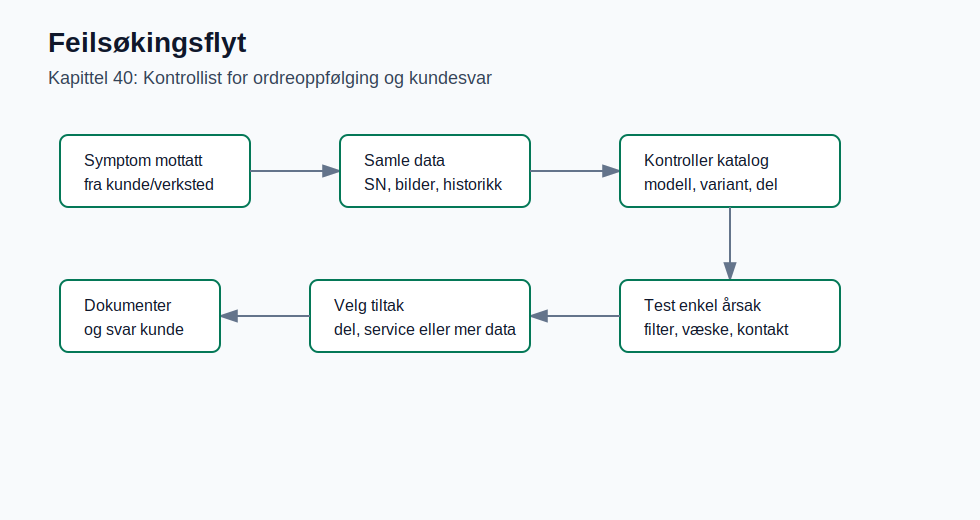

```mermaid
flowchart TD
    A[Symptom eller forespørsel mottatt] --> B[Samle serienummer, bilder og historikk]
    B --> C{Er motor og variant sikkert identifisert?}
    C -- Nei --> D[Be om mer dokumentasjon før del bekreftes]
    C -- Ja --> E[Kontroller delnummer og posisjon i katalog]
    E --> F{Stemmer symptom med foreslått del?}
    F -- Nei --> G[Foreslå feilsøking eller teknisk kontroll]
    F -- Ja --> H[Kontroller lager, pris og levering]
    H --> I[Send dokumentert kundesvar]
```

## Vedlikeholdsprosedyre
1. Avklar driftstimer, siste service og driftsmiljø.
2. Kontroller olje, filter, kjølevæske, sjøvannskrets, reimer, slanger og elektriske kontakter.
3. Sammenlign vedlikeholdsbehov med produsentens intervaller og faktisk bruk.
4. Anbefal servicekit når flere slitedeler bør skiftes samtidig.
5. Dokumenter hva som er anbefalt, hva kunden bestiller og eventuelle avvik fra normal prosedyre.

## Serienummeridentifikasjon
Serienummeridentifikasjon starter med å finne typeplate, motornummer eller annen unik identifikasjon. Be om bilde, ikke bare avskrift, fordi feil tegn, mellomrom og prefiks kan endre katalogoppslaget. Når serienummer ikke finnes, bygges identifikasjonen med modell, produksjonsår, bilder, tidligere fakturaer, servicehistorikk og delnummer fra monterte komponenter.

Minimumsdata bør være: fabrikat, modell, serienummer, eventuell product number/arrangement/CPL/motornummer, bilde av typeplate og bilde av motorens installasjon. Ved tvil skal saken stoppes for avklaring før del bekreftes.

## Reservedelsidentifikasjon
Reservedelsidentifikasjon skal bekrefte delnummer, posisjon, antall per motor, variant, side og eventuell erstatning. Dersom kunden oppgir et gammelt nummer, må det kontrolleres mot supersession. Dersom kunden bare sender bilde, skal bildet brukes som støtte, ikke som eneste grunnlag for bestilling.

Sjekk alltid om delnummeret gjelder enkeltkomponent, reparasjonssett, servicekit eller komplett enhet. Kontroller også om varen er høyre/venstre, gammel/ny type, standard/oversize eller knyttet til en bestemt produksjonsperiode.

## Bestillingsprosedyre
1. Opprett eller oppdater sak med kunde, fartøy, kontaktperson og tidsfrist.
2. Verifiser motoridentifikasjon og lagre bildedokumentasjon.
3. Finn korrekt delnummer i relevant katalog eller leverandørgrunnlag.
4. Kontroller supersession, antall, lagerstatus, pris, returvilkår og leveringstid.
5. Send ordrebekreftelse med delnummer, beskrivelse, antall, pris, levering og forbehold.
6. Følg opp leveransen til kunden har mottatt varen eller saken er lukket.

## Kvalitetspunkter før svar
- Har vi nok data til å gi et sikkert svar?
- Er delnummeret kontrollert mot riktig motorvariant?
- Er kundens tidsfrist realistisk med valgt fraktmåte?
- Er eventuelle forbehold skrevet tydelig?
- Kan en kollega forstå beslutningen ved å lese saken senere?

## Kapittelsammendrag
Hovedpoenget i kapittel 40 er at profesjonelt reservedelsarbeid krever struktur. Teknisk kunnskap, engelske fagtermer, praktisk feilsøking, dokumentasjon og kundedialog må henge sammen. Når medarbeideren jobber systematisk, reduseres feilbestillinger, kunden får bedre svar, og verkstedet kan planlegge arbeidet tryggere.

## Kryssreferanser
- For forrige tema, se kapittel 39: Kontrollist for validering av serienummer og delnummer.
- For neste tema, se kapittel 41: Kontrollist for feilsøking ved manglende match mellom del og motor.
- For grunnleggende identifikasjon, se kapittel 12 og 17.
- For merkevise eksempler, se kapitlene 26-32.

## Fordypning for intern opplæring
Dette kapitlet skal brukes som arbeidsstandard, ikke bare som lesestoff. Når en ny medarbeider møter en sak om ordreoppfølging, skal vedkommende trene på å gå rolig fra fakta til vurdering og deretter til handling. I en marinemotorforhandler er konsekvensen av en feil ofte større enn verdien av selve delen. En feil impeller, feil sensor, feil filterinnsats eller feil pakningssett kan føre til tapt verkstedtid, utsatt avgang, irritert kunde og i verste fall ny driftsstans. Derfor skal hver sak behandles som en teknisk beslutning med sporbar dokumentasjon.

Profesjonelt nivå i dette kapitlet betyr at medarbeideren kan arbeide sikkert med ordreoppfølging. Før kunden får et bindende svar, skal opplysningene i saken kontrolleres mot motorens identitet, faktisk installasjon og relevant produsentterminologi. Det praktiske målet er ikke å finne et raskt nummer, men å kunne forklare hvorfor valgt del, kontrollpunkt eller kundesvar er riktig for akkurat denne motoren. Når informasjon mangler, skal medarbeideren beskrive hva som mangler, hvorfor det er nødvendig, og hvilket neste steg som bringer saken videre.

## Tekniske forklaringer
Teknisk forståelse i dette kapitlet skal bygges rundt statuskontroll, leveringsløfte, avvik, kundesvar, intern oppgave og avslutning. Medarbeideren må skille mellom synlig symptom, sannsynlig systemfeil og bestillbar komponent. En del kan se riktig ut på bilde, men likevel være feil dersom posisjon, variant, rating, kjøleroppsett, elektrisk plugg, monteringsside eller servicehistorikk ikke stemmer. Derfor skal teknisk vurdering alltid kobles til både funksjon og dokumentasjon: hva gjør komponenten, hvilket system påvirker den, og hvilken produsentkilde bekrefter at den passer.

I praksis betyr dette at tekniske data skal kobles til motorens faktiske installasjon. Marine motorer står ofte trangt, er utsatt for salt, vibrasjon, fukt og ujevnt belastningsmønster, og de kan være bygget om gjennom mange år. En motor kan ha original kjøler, ettermontert eksosbend, alternativ dynamo, endret filterbrakett eller annen sjøvannspumpe enn standard. Slike forhold gjør at delidentifikasjon må bygge på både produsentdata og synlig dokumentasjon fra motoren.

Produsentterminologi er en del av den tekniske forståelsen. Bruk uttrykk som Serial Number, Engine Number, Part Number, Service Kit, Exploded View, Supersession når de er relevante. Ikke oversett dem på en måte som fjerner presisjon. Skriv for eksempel «Engine Serial Number (ESN)» første gang og deretter «ESN» i saken dersom produsenten bruker dette. Skriv «Arrangement Number» når CAT-data krever det, «Product Number» når Volvo Penta bruker det, «CPL» når Cummins-konfigurasjon må kontrolleres, og «Model Code» når Yanmar-identifikasjon bygger på modellkode. Dette gjør dialogen med internasjonale leverandører mer presis.

## Illustrasjonsforslag
- Oversiktsdiagram som viser hvor ordreoppfølging passer inn i total arbeidsflyt fra kundeforespørsel til levert del.
- Nærbilde av typeplate/motorskilt med markering av serienummer, motornummer, modell og eventuell variantkode.
- Sprengskisse med markert posisjon, delnummer, antall per motor og mulige alternative versjoner.
- Feilsøkingsflyt med beslutningspunkter: mangler data, stemmer symptom, kreves mer teknisk kontroll, kan ordre bekreftes.
- Sammenligningsbilde av gammel og ny del der forskjell i tilkobling, side, lengde eller sensorplugg er markert.

## Virkelige verkstedseksempler
Eksempel 1: Et verksted står med en demontert komponent på benken og kunden venter på avklaring før fartøyet kan settes tilbake i drift. Verkstedet sender et nærbilde av delen, men ingen motorplate. En uerfaren medarbeider kan bli fristet til å søke på nummeret som står på støpegodset. En profesjonell medarbeider svarer at støpenummer ikke nødvendigvis er bestillbart delnummer, ber om bilde av typeplate, oversiktsbilde av motoren og bilde av monteringsstedet, og forklarer at dette hindrer feilbestilling. Når informasjonen kommer, kontrolleres delnummer mot sprengskisse, posisjon og antall. Først da gis pris og leveringstid.

Eksempel 2: En kunde ringer sent på dagen og sier at motoren har høy temperatur etter service. Kunden ønsker ny termostat. Medarbeideren skal ikke automatisk konkludere med termostatfeil. Spørsmålene bør avklare om impeller er byttet, om sjøvannsfilteret er rent, om kjølevæskenivået er riktig, om alarmen kommer ved tomgang eller belastning, og om det finnes lekkasje rundt varmeveksler eller slanger. Dersom kunden likevel vil bestille termostat, dokumenteres at feilsøking er anbefalt, og delnummer kontrolleres mot serienummer før ordre.

Eksempel 3: En intern selger mottar en gammel faktura med et delnummer som ikke lenger finnes. Riktig prosess er å kontrollere supersession, se om ny del krever tilhørende pakning, boltsett eller adapter, og notere både gammelt og nytt nummer i saken. Kunden skal få vite at delen er erstattet, hva som leveres, og om det finnes monteringsforbehold.

## Reservedelsidentifisering i praksis
Reservedelsidentifisering skal følge en fast rekkefølge. Først kontrolleres motorens identitet. Deretter kontrolleres delens system: drivstoff, luft, kjøling, smøring, eksos, elektrisk eller mekanisk kraftoverføring. Så kontrolleres posisjon i sprengskisse eller parts list. Til slutt kontrolleres antall, variant, supersession og leveringsstatus. Denne rekkefølgen hindrer at medarbeideren hopper direkte fra kundens ord til et tilfeldig delnummer.

Når en del har synlig nummer, må nummeret tolkes riktig. Mange komponenter har produksjonsnummer, støpenummer, leverandørnummer eller revisjonskode som ikke er det samme som bestillbart part number. Et filter kan ha nummer fra filterprodusent, men motorprodusentens parts catalogue kan bruke et annet nummer. En pumpe kan ha nummer på lokk, hus og komplett enhet. Spør derfor alltid: gjelder nummeret komplett del, reparasjonssett, underkomponent eller produsentens råkomponent?

## Serienummer og motornummer
Serienummer og motornummer er grunnlaget for korrekt katalogoppslag. Be kunden sende bilde av typeplate eller dataplate. Dersom kunden skriver nummeret manuelt, skal nummeret likevel kontrolleres mot bilde når det er mulig. Noter hele nummeret, inkludert prefiks, suffiks, bindestrek, mellomrom og eventuelle bokstaver. På enkelte produsenter kan små forskjeller peke til forskjellig produksjonsperiode, rating eller konfigurasjon.

Bruk motornummer sammen med modell, variant og applikasjon. En motor som driver generator kan ha andre deler enn en fremdriftsmotor. En motor i yrkesbåt kan ha annen rating enn samme motor i fritidsbåt. En eldre motor kan være bygget om med ny dynamo, annen sjøvannspumpe eller uoriginal filterbrakett. Dersom typeplate mangler, bygg identifikasjonen gjennom flere kilder: servicebok, tidligere faktura, bilder av motorens sider, nummer på pumpe, filter, turbo og gear, samt opplysninger om fartøy og produksjonsår.

## Feilsøking steg for steg
1. Definer symptomet med kundens egne ord og skriv det i saken. Skill mellom «kunden ønsker del» og «kunden beskriver feil».
2. Avklar når feilen oppstår: start, tomgang, belastning, marsjfart, varm motor, kald motor eller etter nylig service.
3. Kontroller grunnleggende forhold: væskenivå, filter, luft i drivstoff, sjøvannsstrøm, reimer, elektriske kontakter, sikringer og synlige lekkasjer.
4. Knytt symptomet til system: lav effekt peker ofte mot luft/drivstoff/eksos, høy temperatur mot kjøling, lavt oljetrykk mot smøring/sensor, startproblem mot batteri/starter/gløding/drivstoff.
5. Be om bilder eller måledata dersom symptomet ikke kan kobles sikkert til en del. Dette kan være bilde av alarmdisplay, trykkmåling, temperaturmåling eller bilde av montert komponent.
6. Kontroller relevant delnummer mot serienummer og variant. Dersom flere alternativer finnes, forklar kunden hva som skiller dem.
7. Dokumenter anbefalt tiltak, usikkerhet og eventuelle forbehold før ordre bekreftes.

## Vedlikehold
Vedlikehold skal vurderes mot driftstimer, produsentens maintenance schedule og faktisk driftsmiljø. Marine motorer som går korte turer, mye tomgang eller i salt miljø kan trenge hyppigere kontroll enn standard intervall antyder. Nye medarbeidere skal lære å spørre om siste service, hvilke filter som ble byttet, hvilken olje som ble brukt, om impeller er kontrollert, og om kjølevæske eller anoder er byttet etter plan.

En god vedlikeholdsanbefaling er konkret. I stedet for å skrive «ta service», bør medarbeideren foreslå relevante deler: olje- og drivstoffilter, luftfilter, impeller, reim, pakninger, anoder, kjølevæske og eventuelt servicekit. Dersom kunden har ukjent servicehistorikk, bør komplett servicekit vurderes. Dersom kunden har hatt overoppheting, bør sjøvannskrets og varmeveksler kontrolleres før bare én komponent byttes.

## Vanlige feil
- Serienummer leses feil fordi et tegn forveksles, for eksempel O/0 eller I/1.
- Kunden oppgir modellnavn, men ikke variant, rating eller applikasjon.
- Del velges ut fra bilde alene uten kontroll mot sprengskisse eller produsentkatalog.
- Supersession aksepteres uten å kontrollere om ny del krever tilbehør, pakning eller ombygging.
- Hastepress gjør at leveringsløfte gis før lagerstatus og fraktmulighet er bekreftet.
- Saksnotat mangler grunnlaget for beslutningen, slik at kollega ikke kan etterprøve valget.

## Kontrollspørsmål
- Hva er den viktigste tekniske risikoen i en sak som gjelder ordreoppfølging?
- Hvilke opplysninger må dokumenteres før bindende delnummer bekreftes?
- Hvordan forklarer du kunden hvorfor bilde av typeplate er nødvendig?
- Når bør du stoppe en ordre og be om mer dokumentasjon?
- Hvilke engelske produsentuttrykk bør du kunne bruke i denne typen sak?
- Hvordan dokumenterer du at et delnummer er erstattet av et nytt nummer?

## Praktisk sjekkliste for medarbeider
- Les saken som om en kollega skal overta den i morgen.
- Kontroller at motoridentifikasjon er dokumentert med bilde eller sikker kilde.
- Sjekk at delnummeret er knyttet til riktig posisjon i katalogen.
- Skriv tydelig om kunden har bedt om enkeltkomponent, servicekit eller komplett enhet.
- Noter om varen er spesialbestilling, utgått, erstattet eller ikke returbar.
- Send kundesvar med neste steg, ikke bare et løst delnummer.

## Kapittelspesifikk systemforståelse
For dette kapitlet er kjernen å forstå ordreoppfølging og kundesvar. Medarbeideren skal kunne forklare dette med praktiske ord til både kunde og kollega. Det betyr at teknisk teori må kobles til konkrete handlinger: hvilke data skal innhentes, hvilke komponenter kan være berørt, hvilken produsentterminologi skal brukes, og hva må dokumenteres før saken kan gå videre. Kundesvar skal alltid inneholde neste steg eller forventet tidspunkt for ny oppdatering.

Når systemet vurderes, skal medarbeideren først plassere problemet i riktig teknisk sammenheng. Dersom kunden beskriver en alarm, må man finne ut om alarmen kommer fra reelt mekanisk avvik, elektrisk sensorfeil, feil etter service eller feil tolkning av instrumentet. Dersom kunden beskriver en del, må man avklare om kunden mener komplett enhet, servicekit, reparasjonssett eller enkeltkomponent. Dersom kunden beskriver motoren med vanlig navn, må man kontrollere om produsenten bruker mer presise begreper i katalogen.

## Komponentoversikt og arbeidsgrense
Relevante komponenter og opplysninger i dette kapitlet omfatter: ETA, tracking, backorder, partial shipment, order confirmation og status update. Listen er ikke ment som en erstatning for produsentens parts catalogue, men som en praktisk påminnelse om hva nye medarbeidere skal tenke på før de søker del. I interne saker skal komponentnavn skrives så presist som mulig. Bruk for eksempel «sjøvannspumpe / raw water pump» i stedet for bare «pumpe» når funksjonen er kjent, og «varmeveksler / heat exchanger» i stedet for bare «kjøler» når det er den komponenten saken gjelder.

Arbeidsgrensen for en reservedelsmedarbeider er også viktig. Medarbeideren skal ikke overta mekanikerens ansvar for demontering, måling eller diagnose på motoren, men skal kunne stille riktige spørsmål og foreslå riktig dokumentasjon. Når en sak går fra enkel delidentifikasjon til teknisk diagnose, skal dette markeres i saken. Da kan verksted, teknisk ansvarlig eller leverandør involveres med et klart spørsmål og et ryddig faktagrunnlag.

## Praktisk beslutningsregel
Bruk denne regelen i alle saker knyttet til kapitlet: Hvis motoridentifikasjon, komponentposisjon eller symptom ikke er sikkert nok dokumentert, skal medarbeideren ikke gi bindende delbekreftelse. Kunden kan få et foreløpig svar, men svaret må inneholde hva som mangler, hvorfor det mangler, og hva som skjer når informasjonen er mottatt. Dette er ikke treg service; det er profesjonell risikokontroll.

## Målrettet fordypning kapittel 31-40
### Ordreoppfølging og presise kundesvar
Ordreoppfølging skal holde kunden informert uten at medarbeideren må starte saken på nytt hver gang. Saken bør ha status: venter på kundedata, venter på leverandør, tilbud sendt, bestilt, restordre, sendt, levert eller lukket. Kundesvar skal inneholde hva som er gjort, hva som mangler, forventet neste steg og tidspunkt for ny oppdatering.

Ved leverandørforsinkelse skal kunden få konkret informasjon: bekreftet ETA, usikker ETA, backorder, partial shipment eller alternativ leverandør. Ved teknisk usikkerhet skal svaret skille mellom pris/tilgjengelighet og teknisk godkjenning. Et godt kundesvar kan være kort, men må være komplett nok til at kunden forstår risiko, leveringsplan og ansvar for neste handling.

### Praktisk anvendelse i opplæring
Bruk dette kapitlet i en case der deltakeren må avgjøre hvilke opplysninger som er sikre, hvilke som mangler, og om saken kan gå til tilbud eller må stoppes for avklaring. Deltakeren skal skrive en kort intern vurdering og et profesjonelt kundesvar. Instruktøren bør særlig se etter korrekt bruk av produsentterminologi, tydelige forbehold og evne til å skille reservedelsidentifikasjon fra mekanisk diagnose.

## Realistisk opplæring i praksis
### Verkstedhistorie
En typisk sak i dette temaet starter med kunde spør før leverandør har svart. Verkstedet trenger et raskt svar, men den erfarne medarbeideren stopper opp og spør først: hva vet vi sikkert, hva antar vi, og hva kan gi følgeskade hvis vi tar feil? I praksis betyr det at status og kundesvar må kobles til bilde, serienummer, komponentposisjon og kundens symptom før saken lukkes. Historien skal brukes i opplæring som en øvelse i å skrive et kort saksnotat: observasjon, vurdering, neste handling og forbehold.

### Kundehistorie
Kunden beskriver ofte problemet med driftsspråk: «motoren går tungt», «alarm kommer etter ti minutter», «jeg trenger den samme delen som sist» eller «båten skal ut i morgen». En profesjonell respons er rolig og konkret: bekreft behovet, forklar hvorfor identifikasjon trengs, be om riktig dokumentasjon og gi et realistisk tidspunkt for neste svar. Ikke korriger kunden unødvendig; oversett kundens språk til teknisk språk i saken.

### Typiske feil nye ansatte gjør
- søker på første synlige nummer uten å avklare om det er støpenummer, leverandørnummer eller bestillbart part number.
- lover levering før lagerstatus, frakt og returvilkår er kontrollert.
- antar at tidligere faktura alltid gjelder samme motorvariant.
- blander symptom og årsak, spesielt ved varme, lav effekt, startproblem og alarm.
- skriver for korte notater slik at kollega ikke kan forstå hvorfor valget ble tatt.

### Tips fra erfarne mekanikere og reservedelsselgere
- Se alltid etter systemet rundt delen: slanger, braketter, sensorer, reimer, kjølere og tilkoblinger forteller ofte mer enn delen alene.
- Still ett presist spørsmål om gangen når kunden er stresset; mange dårlige svar kommer av for lange spørsmålslister.
- Sammenlign gammel og ny del mot funksjon, ikke bare form. Riktig del skal passe, men også løse riktig problem.
- En erfaren reservedelsselger tenker i risiko: Hva er billigst å avklare nå, og hva blir dyrt hvis vi hopper over det?

### Vanlige kundespørsmål
| Spørsmål fra kunde | Profesjonelt svar |
|---|---|
| «Kan du bare sende samme del som sist?» | «Ja, hvis vi først bekrefter at det gjelder samme motor, samme posisjon og ingen supersession siden sist.» |
| «Holder det med bilde?» | «Bilde hjelper, men vi trenger også motoridentitet for å sikre variant og delnummer.» |
| «Hvorfor tar dette tid?» | «Fordi feil del kan gi ny driftsstans. Vi kontrollerer grunnlaget før vi lover levering.» |

### Beslutningstre for saken
| Trinn | Spørsmål | Handling |
|---|---|---|
| 1 | Er motoridentitet dokumentert med bilde eller sikker historikk? | Hvis nei: be om typeplate/dataplate eller alternativ dokumentasjon. |
| 2 | Er komponentens funksjon og posisjon kjent? | Hvis nei: be om oversiktsbilde og bilde av monteringssted. |
| 3 | Stemmer kundens symptom med delen som ønskes? | Hvis nei: anbefal feilsøking før del bestilles. |
| 4 | Finnes det supersession, kit eller variantvalg? | Kontroller produsentkilde og skriv forbehold i saken. |
| 5 | Kan pris, levering og returvilkår bekreftes? | Send dokumentert svar med neste steg og tydelig gyldighet. |

### Rask oppslagstabell
| Situasjon | Kontroller først | Vanlig fallgruve |
|---|---|---|
| Hasteordre | sikker motor-ID, lager, fraktfrist | levering loves før teknisk kontroll |
| Del fra bilde | posisjon, skala, tilkoblinger, nummer | bilde brukes som eneste beslutningsgrunnlag |
| Gammelt delnummer | supersession og kitinnhold | ny del krever ekstra pakning eller adapter |
| Uklart symptom | driftssituasjon, alarm, siste service | symptom blir tolket som sikker komponentfeil |

### Praktisk sjekkliste og inspeksjonsrutine
- Start med motoridentitet: fabrikat, modell, serienummer, variant, applikasjon og bilde av skilt.
- Kontroller området rundt komponenten: lekkasje, korrosjon, knekte fester, slitasje, varmemerker og uoriginale endringer.
- Spør om siste vedlikehold: olje, filter, impeller, reimer, kjølevæske, anoder og drivstoffilter.
- Noter driftstype: fritidsbruk, yrkesbruk, generator, fremdrift, tomgangsdrift eller langvarig høy belastning.
- Avklar om saken gjelder akutt drift, planlagt service, reklamasjon eller lagerpåfyll.

### Generelle vedlikeholdsintervaller som opplæringspunkt
| Kontrollpunkt | Typisk vurdering i opplæring | Må verifiseres |
|---|---|---|
| Olje og oljefilter | ofte basert på timer og kalender | produsentens maintenance schedule |
| Drivstoffilter/vannutskiller | hyppigere ved dårlig drivstoff eller sesongstart | motor- og filterspesifikasjon |
| Impeller og sjøvannskrets | kontrolleres særlig før sesong og etter varmgang | produsentens intervall og installasjon |
| Reimer, slanger og klemmer | visuell kontroll ved service og feilsøking | dimensjon, stramming og delnummer |

### Produsentverifikasjon
Alle konkrete delnumre, momentverdier, serviceintervaller, garantikrav, programvaredata og produsentspesifikke grenser skal kontrolleres mot offisiell produsentdokumentasjon før de brukes i tilbud, ordre eller verkstedinstruks. Marker tydelig i saken når svaret bygger på antakelse, eldre historikk, bilde uten motor-ID eller generell erfaring. Intervaller i tabellen er generelle opplæringspunkter. Faktiske intervaller styres av produsent, motorvariant, driftstimer, kalenderkrav, belastning og miljø.

## Produsentverifikasjon og faglig forbehold
Denne manualen skal brukes som intern opplæring og arbeidsmetode. Produsentspesifikke delnumre, intervaller, momentverdier, garantikrav og tekniske grenseverdier skal verifiseres mot gjeldende produsentdokumentasjon før de brukes i kundeordre eller verkstedinstruks. Marker saken internt dersom opplysningen bygger på antakelse, eldre historikk eller bilde uten bekreftet motoridentitet.

## Quiz med fasit
1. Hvilke tekniske data bør alltid samles før en del bekreftes?
2. Hvorfor er engelsk terminologi viktig i marine reservedeler?
3. Hva bør gjøres dersom kunden bare sender et bilde av delen?
4. Hvilke punkter bør kontrolleres før ordrebekreftelse sendes?
5. Hvorfor skal feilsøking dokumenteres, selv når kunden allerede ber om en bestemt del?

### Svar
1. Fabrikat, modell, serienummer, variantdata, bilde av typeplate, delnummer, posisjon og kundens symptombeskrivelse.
2. Fordi kataloger, portaler, servicemanualer og leverandørdialog ofte bruker engelske begreper som må forstås presist.
3. Be om serienummer, oversiktsbilde av motoren og eventuelle nummer på delen; bildet brukes som støtte, ikke eneste grunnlag.
4. Delnummer, antall, variant, pris, lagerstatus, leveringstid, frakt, returvilkår og eventuelle forbehold.
5. Fordi symptomet kan ha flere årsaker, og dokumentasjon viser hvorfor anbefalingen ble gitt.

---

# Kapittel 41: Kontrollist for feilsøking ved manglende match mellom del og motor

## Kapittelrolle
Dette kapitlet gir en grundig praktisk innføring i mismatch. Temaet er viktig fordi reservedelsarbeid i marine miljøer kombinerer teknisk forståelse, presis kundedialog, dokumentert saksbehandling og realistisk leveranseoppfølging. Målet er at en ny medarbeider skal kunne bruke kunnskapen direkte i arbeid med verksted, kunde, lager og leverandør.

## Læringsmål
Etter kapitlet skal deltakeren kunne:
- forklare hovedbegrepene innen mismatch
- bruke serienummer, modellinformasjon og delnummer i praktisk reservedelsarbeid
- kommunisere trygt med kunde, verksted, lager og leverandør
- dokumentere beslutninger slik at andre kan etterprøve saken
- kjenne igjen vanlige feil og velge riktig neste handling

## English technical terminology
- **Serial Number:** engelsk fagterm som ofte brukes i kataloger, servicelitteratur, leverandørportaler og internasjonal kundedialog.
- **Part Number:** engelsk fagterm som ofte brukes i kataloger, servicelitteratur, leverandørportaler og internasjonal kundedialog.
- **Engine Model:** engelsk fagterm som ofte brukes i kataloger, servicelitteratur, leverandørportaler og internasjonal kundedialog.
- **Variant:** engelsk fagterm som ofte brukes i kataloger, servicelitteratur, leverandørportaler og internasjonal kundedialog.
- **Service Kit:** engelsk fagterm som ofte brukes i kataloger, servicelitteratur, leverandørportaler og internasjonal kundedialog.
- **Troubleshooting:** engelsk fagterm som ofte brukes i kataloger, servicelitteratur, leverandørportaler og internasjonal kundedialog.
- **Maintenance:** engelsk fagterm som ofte brukes i kataloger, servicelitteratur, leverandørportaler og internasjonal kundedialog.
- **Ordering Procedure:** engelsk fagterm som ofte brukes i kataloger, servicelitteratur, leverandørportaler og internasjonal kundedialog.
- **Supersession:** engelsk fagterm som ofte brukes i kataloger, servicelitteratur, leverandørportaler og internasjonal kundedialog.
- **Technical Support:** engelsk fagterm som ofte brukes i kataloger, servicelitteratur, leverandørportaler og internasjonal kundedialog.

## Hoveddiagram
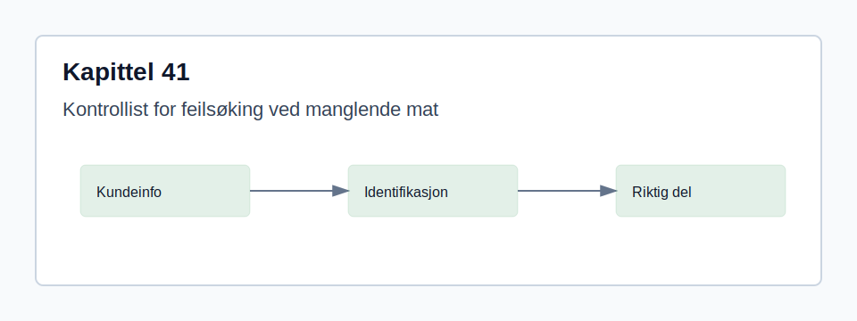

## Tekniske systemillustrasjoner

## Grundig forklaring
Hvordan avvik mellom motor og del løses må forstås både teknisk og praktisk. I marine reservedeler er det sjelden nok å vite hva kunden kaller delen. Medarbeideren må forstå hvilken funksjon delen har, hvor den sitter, hvilken motorvariant den tilhører, og hva som skjer dersom feil del bestilles. Derfor skal tekniske data, kundens beskrivelse og dokumentert katalogoppslag alltid vurderes sammen.

En god sak har fire kjennetegn: den har tydelig identifikasjon, tydelig problem- eller delbeskrivelse, tydelig beslutningsgrunnlag og tydelig oppfølging. Dersom ett av disse punktene mangler, skal saken markeres som usikker før kunden får et bindende svar.

## Praktisk verkstedeksempel
Et verksted står med demontert komponent og trenger rask avklaring. Medarbeideren registrerer kunde, fartøy, motorinformasjon og tidsfrist, ber om bilder av typeplate og komponent, sjekker katalog og lager, og sender et kort skriftlig svar med valgt del, grunnlag for valget og neste oppdateringstidspunkt.

## Kundesupporteksempel
Kunde: 'Motoren går dårlig, kan dere sende riktig del?' Profesjonelt svar: 'Vi kan hjelpe, men først må vi skille mellom symptom og delbehov. Send serienummer, bilde av motorplate, bilde av området feilen gjelder og en kort beskrivelse av når feilen oppstår. Da kan vi foreslå riktig del eller riktig neste feilsøkingstrinn.'

## Vanlige feil og årsaker
- feil eller ufullstendig serienummer.
- delnummer som er erstattet uten at saken dokumenteres.
- symptom som tolkes som delbehov uten feilsøking.
- kunde har bilde av lignende del, men ikke korrekt motorvariant.
- manglende avklaring av antall, side, posisjon eller leveringstid.

## Feilsøkingsflyt
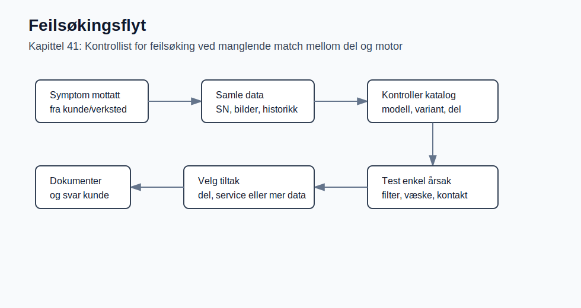

```mermaid
flowchart TD
    A[Symptom eller forespørsel mottatt] --> B[Samle serienummer, bilder og historikk]
    B --> C{Er motor og variant sikkert identifisert?}
    C -- Nei --> D[Be om mer dokumentasjon før del bekreftes]
    C -- Ja --> E[Kontroller delnummer og posisjon i katalog]
    E --> F{Stemmer symptom med foreslått del?}
    F -- Nei --> G[Foreslå feilsøking eller teknisk kontroll]
    F -- Ja --> H[Kontroller lager, pris og levering]
    H --> I[Send dokumentert kundesvar]
```

## Vedlikeholdsprosedyre
1. Avklar driftstimer, siste service og driftsmiljø.
2. Kontroller olje, filter, kjølevæske, sjøvannskrets, reimer, slanger og elektriske kontakter.
3. Sammenlign vedlikeholdsbehov med produsentens intervaller og faktisk bruk.
4. Anbefal servicekit når flere slitedeler bør skiftes samtidig.
5. Dokumenter hva som er anbefalt, hva kunden bestiller og eventuelle avvik fra normal prosedyre.

## Serienummeridentifikasjon
Serienummeridentifikasjon starter med å finne typeplate, motornummer eller annen unik identifikasjon. Be om bilde, ikke bare avskrift, fordi feil tegn, mellomrom og prefiks kan endre katalogoppslaget. Når serienummer ikke finnes, bygges identifikasjonen med modell, produksjonsår, bilder, tidligere fakturaer, servicehistorikk og delnummer fra monterte komponenter.

Minimumsdata bør være: fabrikat, modell, serienummer, eventuell product number/arrangement/CPL/motornummer, bilde av typeplate og bilde av motorens installasjon. Ved tvil skal saken stoppes for avklaring før del bekreftes.

## Reservedelsidentifikasjon
Reservedelsidentifikasjon skal bekrefte delnummer, posisjon, antall per motor, variant, side og eventuell erstatning. Dersom kunden oppgir et gammelt nummer, må det kontrolleres mot supersession. Dersom kunden bare sender bilde, skal bildet brukes som støtte, ikke som eneste grunnlag for bestilling.

Sjekk alltid om delnummeret gjelder enkeltkomponent, reparasjonssett, servicekit eller komplett enhet. Kontroller også om varen er høyre/venstre, gammel/ny type, standard/oversize eller knyttet til en bestemt produksjonsperiode.

## Bestillingsprosedyre
1. Opprett eller oppdater sak med kunde, fartøy, kontaktperson og tidsfrist.
2. Verifiser motoridentifikasjon og lagre bildedokumentasjon.
3. Finn korrekt delnummer i relevant katalog eller leverandørgrunnlag.
4. Kontroller supersession, antall, lagerstatus, pris, returvilkår og leveringstid.
5. Send ordrebekreftelse med delnummer, beskrivelse, antall, pris, levering og forbehold.
6. Følg opp leveransen til kunden har mottatt varen eller saken er lukket.

## Kvalitetspunkter før svar
- Har vi nok data til å gi et sikkert svar?
- Er delnummeret kontrollert mot riktig motorvariant?
- Er kundens tidsfrist realistisk med valgt fraktmåte?
- Er eventuelle forbehold skrevet tydelig?
- Kan en kollega forstå beslutningen ved å lese saken senere?

## Kapittelsammendrag
Hovedpoenget i kapittel 41 er at profesjonelt reservedelsarbeid krever struktur. Teknisk kunnskap, engelske fagtermer, praktisk feilsøking, dokumentasjon og kundedialog må henge sammen. Når medarbeideren jobber systematisk, reduseres feilbestillinger, kunden får bedre svar, og verkstedet kan planlegge arbeidet tryggere.

## Kryssreferanser
- For forrige tema, se kapittel 40: Kontrollist for ordreoppfølging og kundesvar.
- For neste tema, se kapittel 42: Kontrollist for kundesupport ved akutte situasjoner.
- For grunnleggende identifikasjon, se kapittel 12 og 17.
- For merkevise eksempler, se kapitlene 26-32.

## Fordypning for intern opplæring
Dette kapitlet skal brukes som arbeidsstandard, ikke bare som lesestoff. Når en ny medarbeider møter en sak om manglende match, skal vedkommende trene på å gå rolig fra fakta til vurdering og deretter til handling. I en marinemotorforhandler er konsekvensen av en feil ofte større enn verdien av selve delen. En feil impeller, feil sensor, feil filterinnsats eller feil pakningssett kan føre til tapt verkstedtid, utsatt avgang, irritert kunde og i verste fall ny driftsstans. Derfor skal hver sak behandles som en teknisk beslutning med sporbar dokumentasjon.

Profesjonelt nivå i dette kapitlet betyr at medarbeideren kan arbeide sikkert med mismatch mellom del og motor. Før kunden får et bindende svar, skal opplysningene i saken kontrolleres mot motorens identitet, faktisk installasjon og relevant produsentterminologi. Det praktiske målet er ikke å finne et raskt nummer, men å kunne forklare hvorfor valgt del, kontrollpunkt eller kundesvar er riktig for akkurat denne motoren. Når informasjon mangler, skal medarbeideren beskrive hva som mangler, hvorfor det er nødvendig, og hvilket neste steg som bringer saken videre.

## Tekniske forklaringer
Teknisk forståelse i dette kapitlet skal bygges rundt feil modell, feil variant, ettermontert komponent, gammel del og katalogposisjon. Medarbeideren må skille mellom synlig symptom, sannsynlig systemfeil og bestillbar komponent. En del kan se riktig ut på bilde, men likevel være feil dersom posisjon, variant, rating, kjøleroppsett, elektrisk plugg, monteringsside eller servicehistorikk ikke stemmer. Derfor skal teknisk vurdering alltid kobles til både funksjon og dokumentasjon: hva gjør komponenten, hvilket system påvirker den, og hvilken produsentkilde bekrefter at den passer.

I praksis betyr dette at tekniske data skal kobles til motorens faktiske installasjon. Marine motorer står ofte trangt, er utsatt for salt, vibrasjon, fukt og ujevnt belastningsmønster, og de kan være bygget om gjennom mange år. En motor kan ha original kjøler, ettermontert eksosbend, alternativ dynamo, endret filterbrakett eller annen sjøvannspumpe enn standard. Slike forhold gjør at delidentifikasjon må bygge på både produsentdata og synlig dokumentasjon fra motoren.

Produsentterminologi er en del av den tekniske forståelsen. Bruk uttrykk som Serial Number, Engine Number, Part Number, Service Kit, Exploded View, Supersession når de er relevante. Ikke oversett dem på en måte som fjerner presisjon. Skriv for eksempel «Engine Serial Number (ESN)» første gang og deretter «ESN» i saken dersom produsenten bruker dette. Skriv «Arrangement Number» når CAT-data krever det, «Product Number» når Volvo Penta bruker det, «CPL» når Cummins-konfigurasjon må kontrolleres, og «Model Code» når Yanmar-identifikasjon bygger på modellkode. Dette gjør dialogen med internasjonale leverandører mer presis.

## Illustrasjonsforslag
- Oversiktsdiagram som viser hvor manglende match passer inn i total arbeidsflyt fra kundeforespørsel til levert del.
- Nærbilde av typeplate/motorskilt med markering av serienummer, motornummer, modell og eventuell variantkode.
- Sprengskisse med markert posisjon, delnummer, antall per motor og mulige alternative versjoner.
- Feilsøkingsflyt med beslutningspunkter: mangler data, stemmer symptom, kreves mer teknisk kontroll, kan ordre bekreftes.
- Sammenligningsbilde av gammel og ny del der forskjell i tilkobling, side, lengde eller sensorplugg er markert.

## Virkelige verkstedseksempler
Eksempel 1: Et verksted står med en demontert komponent på benken og kunden venter på avklaring før fartøyet kan settes tilbake i drift. Verkstedet sender et nærbilde av delen, men ingen motorplate. En uerfaren medarbeider kan bli fristet til å søke på nummeret som står på støpegodset. En profesjonell medarbeider svarer at støpenummer ikke nødvendigvis er bestillbart delnummer, ber om bilde av typeplate, oversiktsbilde av motoren og bilde av monteringsstedet, og forklarer at dette hindrer feilbestilling. Når informasjonen kommer, kontrolleres delnummer mot sprengskisse, posisjon og antall. Først da gis pris og leveringstid.

Eksempel 2: En kunde ringer sent på dagen og sier at motoren har høy temperatur etter service. Kunden ønsker ny termostat. Medarbeideren skal ikke automatisk konkludere med termostatfeil. Spørsmålene bør avklare om impeller er byttet, om sjøvannsfilteret er rent, om kjølevæskenivået er riktig, om alarmen kommer ved tomgang eller belastning, og om det finnes lekkasje rundt varmeveksler eller slanger. Dersom kunden likevel vil bestille termostat, dokumenteres at feilsøking er anbefalt, og delnummer kontrolleres mot serienummer før ordre.

Eksempel 3: En intern selger mottar en gammel faktura med et delnummer som ikke lenger finnes. Riktig prosess er å kontrollere supersession, se om ny del krever tilhørende pakning, boltsett eller adapter, og notere både gammelt og nytt nummer i saken. Kunden skal få vite at delen er erstattet, hva som leveres, og om det finnes monteringsforbehold.

## Reservedelsidentifisering i praksis
Reservedelsidentifisering skal følge en fast rekkefølge. Først kontrolleres motorens identitet. Deretter kontrolleres delens system: drivstoff, luft, kjøling, smøring, eksos, elektrisk eller mekanisk kraftoverføring. Så kontrolleres posisjon i sprengskisse eller parts list. Til slutt kontrolleres antall, variant, supersession og leveringsstatus. Denne rekkefølgen hindrer at medarbeideren hopper direkte fra kundens ord til et tilfeldig delnummer.

Når en del har synlig nummer, må nummeret tolkes riktig. Mange komponenter har produksjonsnummer, støpenummer, leverandørnummer eller revisjonskode som ikke er det samme som bestillbart part number. Et filter kan ha nummer fra filterprodusent, men motorprodusentens parts catalogue kan bruke et annet nummer. En pumpe kan ha nummer på lokk, hus og komplett enhet. Spør derfor alltid: gjelder nummeret komplett del, reparasjonssett, underkomponent eller produsentens råkomponent?

## Serienummer og motornummer
Serienummer og motornummer er grunnlaget for korrekt katalogoppslag. Be kunden sende bilde av typeplate eller dataplate. Dersom kunden skriver nummeret manuelt, skal nummeret likevel kontrolleres mot bilde når det er mulig. Noter hele nummeret, inkludert prefiks, suffiks, bindestrek, mellomrom og eventuelle bokstaver. På enkelte produsenter kan små forskjeller peke til forskjellig produksjonsperiode, rating eller konfigurasjon.

Bruk motornummer sammen med modell, variant og applikasjon. En motor som driver generator kan ha andre deler enn en fremdriftsmotor. En motor i yrkesbåt kan ha annen rating enn samme motor i fritidsbåt. En eldre motor kan være bygget om med ny dynamo, annen sjøvannspumpe eller uoriginal filterbrakett. Dersom typeplate mangler, bygg identifikasjonen gjennom flere kilder: servicebok, tidligere faktura, bilder av motorens sider, nummer på pumpe, filter, turbo og gear, samt opplysninger om fartøy og produksjonsår.

## Feilsøking steg for steg
1. Definer symptomet med kundens egne ord og skriv det i saken. Skill mellom «kunden ønsker del» og «kunden beskriver feil».
2. Avklar når feilen oppstår: start, tomgang, belastning, marsjfart, varm motor, kald motor eller etter nylig service.
3. Kontroller grunnleggende forhold: væskenivå, filter, luft i drivstoff, sjøvannsstrøm, reimer, elektriske kontakter, sikringer og synlige lekkasjer.
4. Knytt symptomet til system: lav effekt peker ofte mot luft/drivstoff/eksos, høy temperatur mot kjøling, lavt oljetrykk mot smøring/sensor, startproblem mot batteri/starter/gløding/drivstoff.
5. Be om bilder eller måledata dersom symptomet ikke kan kobles sikkert til en del. Dette kan være bilde av alarmdisplay, trykkmåling, temperaturmåling eller bilde av montert komponent.
6. Kontroller relevant delnummer mot serienummer og variant. Dersom flere alternativer finnes, forklar kunden hva som skiller dem.
7. Dokumenter anbefalt tiltak, usikkerhet og eventuelle forbehold før ordre bekreftes.

## Vedlikehold
Vedlikehold skal vurderes mot driftstimer, produsentens maintenance schedule og faktisk driftsmiljø. Marine motorer som går korte turer, mye tomgang eller i salt miljø kan trenge hyppigere kontroll enn standard intervall antyder. Nye medarbeidere skal lære å spørre om siste service, hvilke filter som ble byttet, hvilken olje som ble brukt, om impeller er kontrollert, og om kjølevæske eller anoder er byttet etter plan.

En god vedlikeholdsanbefaling er konkret. I stedet for å skrive «ta service», bør medarbeideren foreslå relevante deler: olje- og drivstoffilter, luftfilter, impeller, reim, pakninger, anoder, kjølevæske og eventuelt servicekit. Dersom kunden har ukjent servicehistorikk, bør komplett servicekit vurderes. Dersom kunden har hatt overoppheting, bør sjøvannskrets og varmeveksler kontrolleres før bare én komponent byttes.

## Vanlige feil
- Serienummer leses feil fordi et tegn forveksles, for eksempel O/0 eller I/1.
- Kunden oppgir modellnavn, men ikke variant, rating eller applikasjon.
- Del velges ut fra bilde alene uten kontroll mot sprengskisse eller produsentkatalog.
- Supersession aksepteres uten å kontrollere om ny del krever tilbehør, pakning eller ombygging.
- Hastepress gjør at leveringsløfte gis før lagerstatus og fraktmulighet er bekreftet.
- Saksnotat mangler grunnlaget for beslutningen, slik at kollega ikke kan etterprøve valget.

## Kontrollspørsmål
- Hva er den viktigste tekniske risikoen i en sak som gjelder manglende match?
- Hvilke opplysninger må dokumenteres før bindende delnummer bekreftes?
- Hvordan forklarer du kunden hvorfor bilde av typeplate er nødvendig?
- Når bør du stoppe en ordre og be om mer dokumentasjon?
- Hvilke engelske produsentuttrykk bør du kunne bruke i denne typen sak?
- Hvordan dokumenterer du at et delnummer er erstattet av et nytt nummer?

## Praktisk sjekkliste for medarbeider
- Les saken som om en kollega skal overta den i morgen.
- Kontroller at motoridentifikasjon er dokumentert med bilde eller sikker kilde.
- Sjekk at delnummeret er knyttet til riktig posisjon i katalogen.
- Skriv tydelig om kunden har bedt om enkeltkomponent, servicekit eller komplett enhet.
- Noter om varen er spesialbestilling, utgått, erstattet eller ikke returbar.
- Send kundesvar med neste steg, ikke bare et løst delnummer.

## Kapittelspesifikk systemforståelse
For dette kapitlet er kjernen å forstå feilsøking ved manglende match mellom del og motor. Medarbeideren skal kunne forklare dette med praktiske ord til både kunde og kollega. Det betyr at teknisk teori må kobles til konkrete handlinger: hvilke data skal innhentes, hvilke komponenter kan være berørt, hvilken produsentterminologi skal brukes, og hva må dokumenteres før saken kan gå videre. Når del ikke passer, stopp montering og finn avviket før ny del bestilles.

Når systemet vurderes, skal medarbeideren først plassere problemet i riktig teknisk sammenheng. Dersom kunden beskriver en alarm, må man finne ut om alarmen kommer fra reelt mekanisk avvik, elektrisk sensorfeil, feil etter service eller feil tolkning av instrumentet. Dersom kunden beskriver en del, må man avklare om kunden mener komplett enhet, servicekit, reparasjonssett eller enkeltkomponent. Dersom kunden beskriver motoren med vanlig navn, må man kontrollere om produsenten bruker mer presise begreper i katalogen.

## Komponentoversikt og arbeidsgrense
Relevante komponenter og opplysninger i dette kapitlet omfatter: wrong variant, modified engine, serial break, old part, aftermarket conversion og sidevalg. Listen er ikke ment som en erstatning for produsentens parts catalogue, men som en praktisk påminnelse om hva nye medarbeidere skal tenke på før de søker del. I interne saker skal komponentnavn skrives så presist som mulig. Bruk for eksempel «sjøvannspumpe / raw water pump» i stedet for bare «pumpe» når funksjonen er kjent, og «varmeveksler / heat exchanger» i stedet for bare «kjøler» når det er den komponenten saken gjelder.

Arbeidsgrensen for en reservedelsmedarbeider er også viktig. Medarbeideren skal ikke overta mekanikerens ansvar for demontering, måling eller diagnose på motoren, men skal kunne stille riktige spørsmål og foreslå riktig dokumentasjon. Når en sak går fra enkel delidentifikasjon til teknisk diagnose, skal dette markeres i saken. Da kan verksted, teknisk ansvarlig eller leverandør involveres med et klart spørsmål og et ryddig faktagrunnlag.

## Praktisk beslutningsregel
Bruk denne regelen i alle saker knyttet til kapitlet: Hvis motoridentifikasjon, komponentposisjon eller symptom ikke er sikkert nok dokumentert, skal medarbeideren ikke gi bindende delbekreftelse. Kunden kan få et foreløpig svar, men svaret må inneholde hva som mangler, hvorfor det mangler, og hva som skjer når informasjonen er mottatt. Dette er ikke treg service; det er profesjonell risikokontroll.

## Målrettet fordypning kapittel 41-50
### Mismatch mellom del og motor
Når ny del ikke passer, skal montering stoppes før delen tilpasses fysisk. Første kontroll er alltid om motoridentifikasjon, delnummer, posisjon og supersession stemmer. Deretter kontrolleres serial break, sidevalg, gammel/ny type, komplett enhet kontra underkomponent, og om motoren er bygget om. Bruk begreper som wrong variant, modified engine, serial break, supersession, old part number og aftermarket conversion der de beskriver avviket presist.

Verkstedet bør sende bilde av gammel og ny del side om side, bilde av monteringssted, typeplate og eventuelle nummer på begge deler. Medarbeideren skal dokumentere hva som avviker: flens, aksel, plugg, gjenger, slangestuss, diameter, høyde eller brakett. Før ny del bestilles må årsaken være identifisert, ellers kan samme feil gjentas.

### Praktisk anvendelse i opplæring
Bruk kapitlet til en avsluttende case der deltakeren må vise selvstendig vurdering. Deltakeren skal identifisere teknisk risiko, skrive kundesvar, velge dokumentasjon, forklare eventuelle forbehold og angi når saken skal eskaleres. Dette er særlig viktig i sluttkapitlene, fordi de binder sammen teknikk, kvalitet, læring og praktisk drift.

## Realistisk opplæring i praksis
### Verkstedhistorie
En typisk sak i dette temaet starter med ny del passer ikke på monteringsstedet. Verkstedet trenger et raskt svar, men den erfarne medarbeideren stopper opp og spør først: hva vet vi sikkert, hva antar vi, og hva kan gi følgeskade hvis vi tar feil? I praksis betyr det at variantavvik og ettermontering må kobles til bilde, serienummer, komponentposisjon og kundens symptom før saken lukkes. Historien skal brukes i opplæring som en øvelse i å skrive et kort saksnotat: observasjon, vurdering, neste handling og forbehold.

### Kundehistorie
Kunden beskriver ofte problemet med driftsspråk: «motoren går tungt», «alarm kommer etter ti minutter», «jeg trenger den samme delen som sist» eller «båten skal ut i morgen». En profesjonell respons er rolig og konkret: bekreft behovet, forklar hvorfor identifikasjon trengs, be om riktig dokumentasjon og gi et realistisk tidspunkt for neste svar. Ikke korriger kunden unødvendig; oversett kundens språk til teknisk språk i saken.

### Typiske feil nye ansatte gjør
- søker på første synlige nummer uten å avklare om det er støpenummer, leverandørnummer eller bestillbart part number.
- lover levering før lagerstatus, frakt og returvilkår er kontrollert.
- antar at tidligere faktura alltid gjelder samme motorvariant.
- blander symptom og årsak, spesielt ved varme, lav effekt, startproblem og alarm.
- skriver for korte notater slik at kollega ikke kan forstå hvorfor valget ble tatt.

### Tips fra erfarne mekanikere og reservedelsselgere
- Se alltid etter systemet rundt delen: slanger, braketter, sensorer, reimer, kjølere og tilkoblinger forteller ofte mer enn delen alene.
- Still ett presist spørsmål om gangen når kunden er stresset; mange dårlige svar kommer av for lange spørsmålslister.
- Sammenlign gammel og ny del mot funksjon, ikke bare form. Riktig del skal passe, men også løse riktig problem.
- En erfaren reservedelsselger tenker i risiko: Hva er billigst å avklare nå, og hva blir dyrt hvis vi hopper over det?

### Vanlige kundespørsmål
| Spørsmål fra kunde | Profesjonelt svar |
|---|---|
| «Kan du bare sende samme del som sist?» | «Ja, hvis vi først bekrefter at det gjelder samme motor, samme posisjon og ingen supersession siden sist.» |
| «Holder det med bilde?» | «Bilde hjelper, men vi trenger også motoridentitet for å sikre variant og delnummer.» |
| «Hvorfor tar dette tid?» | «Fordi feil del kan gi ny driftsstans. Vi kontrollerer grunnlaget før vi lover levering.» |

### Beslutningstre for saken
| Trinn | Spørsmål | Handling |
|---|---|---|
| 1 | Er motoridentitet dokumentert med bilde eller sikker historikk? | Hvis nei: be om typeplate/dataplate eller alternativ dokumentasjon. |
| 2 | Er komponentens funksjon og posisjon kjent? | Hvis nei: be om oversiktsbilde og bilde av monteringssted. |
| 3 | Stemmer kundens symptom med delen som ønskes? | Hvis nei: anbefal feilsøking før del bestilles. |
| 4 | Finnes det supersession, kit eller variantvalg? | Kontroller produsentkilde og skriv forbehold i saken. |
| 5 | Kan pris, levering og returvilkår bekreftes? | Send dokumentert svar med neste steg og tydelig gyldighet. |

### Rask oppslagstabell
| Situasjon | Kontroller først | Vanlig fallgruve |
|---|---|---|
| Hasteordre | sikker motor-ID, lager, fraktfrist | levering loves før teknisk kontroll |
| Del fra bilde | posisjon, skala, tilkoblinger, nummer | bilde brukes som eneste beslutningsgrunnlag |
| Gammelt delnummer | supersession og kitinnhold | ny del krever ekstra pakning eller adapter |
| Uklart symptom | driftssituasjon, alarm, siste service | symptom blir tolket som sikker komponentfeil |

### Praktisk sjekkliste og inspeksjonsrutine
- Start med motoridentitet: fabrikat, modell, serienummer, variant, applikasjon og bilde av skilt.
- Kontroller området rundt komponenten: lekkasje, korrosjon, knekte fester, slitasje, varmemerker og uoriginale endringer.
- Spør om siste vedlikehold: olje, filter, impeller, reimer, kjølevæske, anoder og drivstoffilter.
- Noter driftstype: fritidsbruk, yrkesbruk, generator, fremdrift, tomgangsdrift eller langvarig høy belastning.
- Avklar om saken gjelder akutt drift, planlagt service, reklamasjon eller lagerpåfyll.

### Generelle vedlikeholdsintervaller som opplæringspunkt
| Kontrollpunkt | Typisk vurdering i opplæring | Må verifiseres |
|---|---|---|
| Olje og oljefilter | ofte basert på timer og kalender | produsentens maintenance schedule |
| Drivstoffilter/vannutskiller | hyppigere ved dårlig drivstoff eller sesongstart | motor- og filterspesifikasjon |
| Impeller og sjøvannskrets | kontrolleres særlig før sesong og etter varmgang | produsentens intervall og installasjon |
| Reimer, slanger og klemmer | visuell kontroll ved service og feilsøking | dimensjon, stramming og delnummer |

### Produsentverifikasjon
Alle konkrete delnumre, momentverdier, serviceintervaller, garantikrav, programvaredata og produsentspesifikke grenser skal kontrolleres mot offisiell produsentdokumentasjon før de brukes i tilbud, ordre eller verkstedinstruks. Marker tydelig i saken når svaret bygger på antakelse, eldre historikk, bilde uten motor-ID eller generell erfaring. Intervaller i tabellen er generelle opplæringspunkter. Faktiske intervaller styres av produsent, motorvariant, driftstimer, kalenderkrav, belastning og miljø.

## Produsentverifikasjon og faglig forbehold
Når saken gjelder delnummer, serienummer, serviceintervall, momentdata, garanti, elektronikk eller kompatibilitet, skal opplysningen verifiseres mot produsentens dokumentasjon eller autorisert leverandør før bindende tilbud eller teknisk konklusjon gis. Manualen beskriver arbeidsmetode og risikopunkter; den erstatter ikke gjeldende parts catalogue, service manual, service bulletin eller produsentportal. Marker saken internt dersom opplysningen bygger på antakelse, eldre historikk eller bilde uten bekreftet motoridentitet.

## Quiz med fasit
1. Hvilke tekniske data bør alltid samles før en del bekreftes?
2. Hvorfor er engelsk terminologi viktig i marine reservedeler?
3. Hva bør gjøres dersom kunden bare sender et bilde av delen?
4. Hvilke punkter bør kontrolleres før ordrebekreftelse sendes?
5. Hvorfor skal feilsøking dokumenteres, selv når kunden allerede ber om en bestemt del?

### Svar
1. Fabrikat, modell, serienummer, variantdata, bilde av typeplate, delnummer, posisjon og kundens symptombeskrivelse.
2. Fordi kataloger, portaler, servicemanualer og leverandørdialog ofte bruker engelske begreper som må forstås presist.
3. Be om serienummer, oversiktsbilde av motoren og eventuelle nummer på delen; bildet brukes som støtte, ikke eneste grunnlag.
4. Delnummer, antall, variant, pris, lagerstatus, leveringstid, frakt, returvilkår og eventuelle forbehold.
5. Fordi symptomet kan ha flere årsaker, og dokumentasjon viser hvorfor anbefalingen ble gitt.

---

# Kapittel 42: Kontrollist for kundesupport ved akutte situasjoner

## Kapittelrolle
Dette kapitlet gir en grundig praktisk innføring i akutt support. Temaet er viktig fordi reservedelsarbeid i marine miljøer kombinerer teknisk forståelse, presis kundedialog, dokumentert saksbehandling og realistisk leveranseoppfølging. Målet er at en ny medarbeider skal kunne bruke kunnskapen direkte i arbeid med verksted, kunde, lager og leverandør.

## Læringsmål
Etter kapitlet skal deltakeren kunne:
- forklare hovedbegrepene innen akutt support
- bruke serienummer, modellinformasjon og delnummer i praktisk reservedelsarbeid
- kommunisere trygt med kunde, verksted, lager og leverandør
- dokumentere beslutninger slik at andre kan etterprøve saken
- kjenne igjen vanlige feil og velge riktig neste handling

## English technical terminology
- **Serial Number:** engelsk fagterm som ofte brukes i kataloger, servicelitteratur, leverandørportaler og internasjonal kundedialog.
- **Part Number:** engelsk fagterm som ofte brukes i kataloger, servicelitteratur, leverandørportaler og internasjonal kundedialog.
- **Engine Model:** engelsk fagterm som ofte brukes i kataloger, servicelitteratur, leverandørportaler og internasjonal kundedialog.
- **Variant:** engelsk fagterm som ofte brukes i kataloger, servicelitteratur, leverandørportaler og internasjonal kundedialog.
- **Service Kit:** engelsk fagterm som ofte brukes i kataloger, servicelitteratur, leverandørportaler og internasjonal kundedialog.
- **Troubleshooting:** engelsk fagterm som ofte brukes i kataloger, servicelitteratur, leverandørportaler og internasjonal kundedialog.
- **Maintenance:** engelsk fagterm som ofte brukes i kataloger, servicelitteratur, leverandørportaler og internasjonal kundedialog.
- **Ordering Procedure:** engelsk fagterm som ofte brukes i kataloger, servicelitteratur, leverandørportaler og internasjonal kundedialog.
- **Supersession:** engelsk fagterm som ofte brukes i kataloger, servicelitteratur, leverandørportaler og internasjonal kundedialog.
- **Technical Support:** engelsk fagterm som ofte brukes i kataloger, servicelitteratur, leverandørportaler og internasjonal kundedialog.

## Hoveddiagram

## Tekniske systemillustrasjoner

## Grundig forklaring
Hvordan hastesaker med driftsstans håndteres må forstås både teknisk og praktisk. I marine reservedeler er det sjelden nok å vite hva kunden kaller delen. Medarbeideren må forstå hvilken funksjon delen har, hvor den sitter, hvilken motorvariant den tilhører, og hva som skjer dersom feil del bestilles. Derfor skal tekniske data, kundens beskrivelse og dokumentert katalogoppslag alltid vurderes sammen.

En god sak har fire kjennetegn: den har tydelig identifikasjon, tydelig problem- eller delbeskrivelse, tydelig beslutningsgrunnlag og tydelig oppfølging. Dersom ett av disse punktene mangler, skal saken markeres som usikker før kunden får et bindende svar.

## Praktisk verkstedeksempel
Et verksted står med demontert komponent og trenger rask avklaring. Medarbeideren registrerer kunde, fartøy, motorinformasjon og tidsfrist, ber om bilder av typeplate og komponent, sjekker katalog og lager, og sender et kort skriftlig svar med valgt del, grunnlag for valget og neste oppdateringstidspunkt.

## Kundesupporteksempel
Kunde: 'Motoren går dårlig, kan dere sende riktig del?' Profesjonelt svar: 'Vi kan hjelpe, men først må vi skille mellom symptom og delbehov. Send serienummer, bilde av motorplate, bilde av området feilen gjelder og en kort beskrivelse av når feilen oppstår. Da kan vi foreslå riktig del eller riktig neste feilsøkingstrinn.'

## Vanlige feil og årsaker
- feil eller ufullstendig serienummer.
- delnummer som er erstattet uten at saken dokumenteres.
- symptom som tolkes som delbehov uten feilsøking.
- kunde har bilde av lignende del, men ikke korrekt motorvariant.
- manglende avklaring av antall, side, posisjon eller leveringstid.

## Feilsøkingsflyt
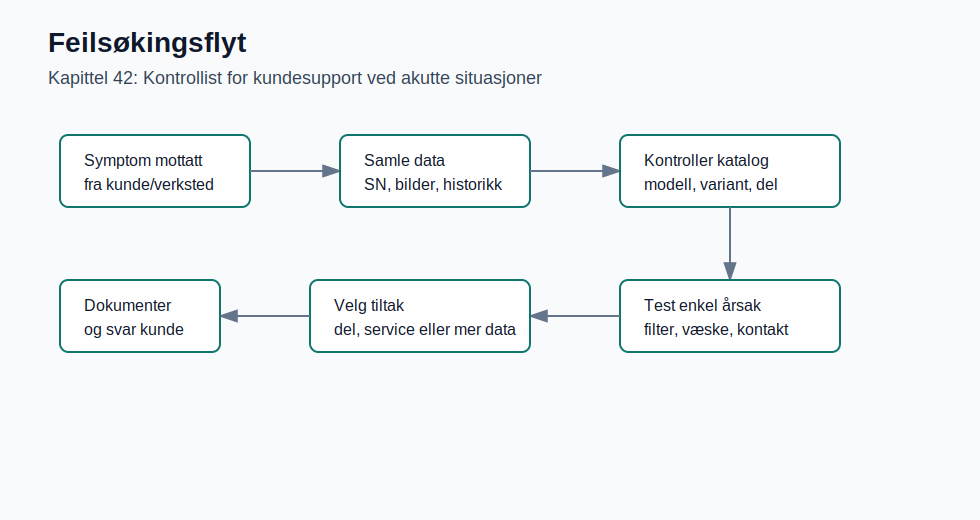

```mermaid
flowchart TD
    A[Symptom eller forespørsel mottatt] --> B[Samle serienummer, bilder og historikk]
    B --> C{Er motor og variant sikkert identifisert?}
    C -- Nei --> D[Be om mer dokumentasjon før del bekreftes]
    C -- Ja --> E[Kontroller delnummer og posisjon i katalog]
    E --> F{Stemmer symptom med foreslått del?}
    F -- Nei --> G[Foreslå feilsøking eller teknisk kontroll]
    F -- Ja --> H[Kontroller lager, pris og levering]
    H --> I[Send dokumentert kundesvar]
```

## Vedlikeholdsprosedyre
1. Avklar driftstimer, siste service og driftsmiljø.
2. Kontroller olje, filter, kjølevæske, sjøvannskrets, reimer, slanger og elektriske kontakter.
3. Sammenlign vedlikeholdsbehov med produsentens intervaller og faktisk bruk.
4. Anbefal servicekit når flere slitedeler bør skiftes samtidig.
5. Dokumenter hva som er anbefalt, hva kunden bestiller og eventuelle avvik fra normal prosedyre.

## Serienummeridentifikasjon
Serienummeridentifikasjon starter med å finne typeplate, motornummer eller annen unik identifikasjon. Be om bilde, ikke bare avskrift, fordi feil tegn, mellomrom og prefiks kan endre katalogoppslaget. Når serienummer ikke finnes, bygges identifikasjonen med modell, produksjonsår, bilder, tidligere fakturaer, servicehistorikk og delnummer fra monterte komponenter.

Minimumsdata bør være: fabrikat, modell, serienummer, eventuell product number/arrangement/CPL/motornummer, bilde av typeplate og bilde av motorens installasjon. Ved tvil skal saken stoppes for avklaring før del bekreftes.

## Reservedelsidentifikasjon
Reservedelsidentifikasjon skal bekrefte delnummer, posisjon, antall per motor, variant, side og eventuell erstatning. Dersom kunden oppgir et gammelt nummer, må det kontrolleres mot supersession. Dersom kunden bare sender bilde, skal bildet brukes som støtte, ikke som eneste grunnlag for bestilling.

Sjekk alltid om delnummeret gjelder enkeltkomponent, reparasjonssett, servicekit eller komplett enhet. Kontroller også om varen er høyre/venstre, gammel/ny type, standard/oversize eller knyttet til en bestemt produksjonsperiode.

## Bestillingsprosedyre
1. Opprett eller oppdater sak med kunde, fartøy, kontaktperson og tidsfrist.
2. Verifiser motoridentifikasjon og lagre bildedokumentasjon.
3. Finn korrekt delnummer i relevant katalog eller leverandørgrunnlag.
4. Kontroller supersession, antall, lagerstatus, pris, returvilkår og leveringstid.
5. Send ordrebekreftelse med delnummer, beskrivelse, antall, pris, levering og forbehold.
6. Følg opp leveransen til kunden har mottatt varen eller saken er lukket.

## Kvalitetspunkter før svar
- Har vi nok data til å gi et sikkert svar?
- Er delnummeret kontrollert mot riktig motorvariant?
- Er kundens tidsfrist realistisk med valgt fraktmåte?
- Er eventuelle forbehold skrevet tydelig?
- Kan en kollega forstå beslutningen ved å lese saken senere?

## Kapittelsammendrag
Hovedpoenget i kapittel 42 er at profesjonelt reservedelsarbeid krever struktur. Teknisk kunnskap, engelske fagtermer, praktisk feilsøking, dokumentasjon og kundedialog må henge sammen. Når medarbeideren jobber systematisk, reduseres feilbestillinger, kunden får bedre svar, og verkstedet kan planlegge arbeidet tryggere.

## Kryssreferanser
- For forrige tema, se kapittel 41: Kontrollist for feilsøking ved manglende match mellom del og motor.
- For neste tema, se kapittel 43: Vanlige læringsfelter for nye medarbeidere.
- For grunnleggende identifikasjon, se kapittel 12 og 17.
- For merkevise eksempler, se kapitlene 26-32.

## Fordypning for intern opplæring
Dette kapitlet skal brukes som arbeidsstandard, ikke bare som lesestoff. Når en ny medarbeider møter en sak om akutte situasjoner, skal vedkommende trene på å gå rolig fra fakta til vurdering og deretter til handling. I en marinemotorforhandler er konsekvensen av en feil ofte større enn verdien av selve delen. En feil impeller, feil sensor, feil filterinnsats eller feil pakningssett kan føre til tapt verkstedtid, utsatt avgang, irritert kunde og i verste fall ny driftsstans. Derfor skal hver sak behandles som en teknisk beslutning med sporbar dokumentasjon.

Profesjonelt nivå i dette kapitlet betyr at medarbeideren kan arbeide sikkert med akutt support. Før kunden får et bindende svar, skal opplysningene i saken kontrolleres mot motorens identitet, faktisk installasjon og relevant produsentterminologi. Det praktiske målet er ikke å finne et raskt nummer, men å kunne forklare hvorfor valgt del, kontrollpunkt eller kundesvar er riktig for akkurat denne motoren. Når informasjon mangler, skal medarbeideren beskrive hva som mangler, hvorfor det er nødvendig, og hvilket neste steg som bringer saken videre.

## Tekniske forklaringer
Teknisk forståelse i dette kapitlet skal bygges rundt driftsstans, sikkerhet, prioritering, minimumsdokumentasjon og tydelig tidslinje. Medarbeideren må skille mellom synlig symptom, sannsynlig systemfeil og bestillbar komponent. En del kan se riktig ut på bilde, men likevel være feil dersom posisjon, variant, rating, kjøleroppsett, elektrisk plugg, monteringsside eller servicehistorikk ikke stemmer. Derfor skal teknisk vurdering alltid kobles til både funksjon og dokumentasjon: hva gjør komponenten, hvilket system påvirker den, og hvilken produsentkilde bekrefter at den passer.

I praksis betyr dette at tekniske data skal kobles til motorens faktiske installasjon. Marine motorer står ofte trangt, er utsatt for salt, vibrasjon, fukt og ujevnt belastningsmønster, og de kan være bygget om gjennom mange år. En motor kan ha original kjøler, ettermontert eksosbend, alternativ dynamo, endret filterbrakett eller annen sjøvannspumpe enn standard. Slike forhold gjør at delidentifikasjon må bygge på både produsentdata og synlig dokumentasjon fra motoren.

Produsentterminologi er en del av den tekniske forståelsen. Bruk uttrykk som Serial Number, Engine Number, Part Number, Service Kit, Exploded View, Supersession når de er relevante. Ikke oversett dem på en måte som fjerner presisjon. Skriv for eksempel «Engine Serial Number (ESN)» første gang og deretter «ESN» i saken dersom produsenten bruker dette. Skriv «Arrangement Number» når CAT-data krever det, «Product Number» når Volvo Penta bruker det, «CPL» når Cummins-konfigurasjon må kontrolleres, og «Model Code» når Yanmar-identifikasjon bygger på modellkode. Dette gjør dialogen med internasjonale leverandører mer presis.

## Illustrasjonsforslag
- Oversiktsdiagram som viser hvor akutte situasjoner passer inn i total arbeidsflyt fra kundeforespørsel til levert del.
- Nærbilde av typeplate/motorskilt med markering av serienummer, motornummer, modell og eventuell variantkode.
- Sprengskisse med markert posisjon, delnummer, antall per motor og mulige alternative versjoner.
- Feilsøkingsflyt med beslutningspunkter: mangler data, stemmer symptom, kreves mer teknisk kontroll, kan ordre bekreftes.
- Sammenligningsbilde av gammel og ny del der forskjell i tilkobling, side, lengde eller sensorplugg er markert.

## Virkelige verkstedseksempler
Eksempel 1: Et verksted står med en demontert komponent på benken og kunden venter på avklaring før fartøyet kan settes tilbake i drift. Verkstedet sender et nærbilde av delen, men ingen motorplate. En uerfaren medarbeider kan bli fristet til å søke på nummeret som står på støpegodset. En profesjonell medarbeider svarer at støpenummer ikke nødvendigvis er bestillbart delnummer, ber om bilde av typeplate, oversiktsbilde av motoren og bilde av monteringsstedet, og forklarer at dette hindrer feilbestilling. Når informasjonen kommer, kontrolleres delnummer mot sprengskisse, posisjon og antall. Først da gis pris og leveringstid.

Eksempel 2: En kunde ringer sent på dagen og sier at motoren har høy temperatur etter service. Kunden ønsker ny termostat. Medarbeideren skal ikke automatisk konkludere med termostatfeil. Spørsmålene bør avklare om impeller er byttet, om sjøvannsfilteret er rent, om kjølevæskenivået er riktig, om alarmen kommer ved tomgang eller belastning, og om det finnes lekkasje rundt varmeveksler eller slanger. Dersom kunden likevel vil bestille termostat, dokumenteres at feilsøking er anbefalt, og delnummer kontrolleres mot serienummer før ordre.

Eksempel 3: En intern selger mottar en gammel faktura med et delnummer som ikke lenger finnes. Riktig prosess er å kontrollere supersession, se om ny del krever tilhørende pakning, boltsett eller adapter, og notere både gammelt og nytt nummer i saken. Kunden skal få vite at delen er erstattet, hva som leveres, og om det finnes monteringsforbehold.

## Reservedelsidentifisering i praksis
Reservedelsidentifisering skal følge en fast rekkefølge. Først kontrolleres motorens identitet. Deretter kontrolleres delens system: drivstoff, luft, kjøling, smøring, eksos, elektrisk eller mekanisk kraftoverføring. Så kontrolleres posisjon i sprengskisse eller parts list. Til slutt kontrolleres antall, variant, supersession og leveringsstatus. Denne rekkefølgen hindrer at medarbeideren hopper direkte fra kundens ord til et tilfeldig delnummer.

Når en del har synlig nummer, må nummeret tolkes riktig. Mange komponenter har produksjonsnummer, støpenummer, leverandørnummer eller revisjonskode som ikke er det samme som bestillbart part number. Et filter kan ha nummer fra filterprodusent, men motorprodusentens parts catalogue kan bruke et annet nummer. En pumpe kan ha nummer på lokk, hus og komplett enhet. Spør derfor alltid: gjelder nummeret komplett del, reparasjonssett, underkomponent eller produsentens råkomponent?

## Serienummer og motornummer
Serienummer og motornummer er grunnlaget for korrekt katalogoppslag. Be kunden sende bilde av typeplate eller dataplate. Dersom kunden skriver nummeret manuelt, skal nummeret likevel kontrolleres mot bilde når det er mulig. Noter hele nummeret, inkludert prefiks, suffiks, bindestrek, mellomrom og eventuelle bokstaver. På enkelte produsenter kan små forskjeller peke til forskjellig produksjonsperiode, rating eller konfigurasjon.

Bruk motornummer sammen med modell, variant og applikasjon. En motor som driver generator kan ha andre deler enn en fremdriftsmotor. En motor i yrkesbåt kan ha annen rating enn samme motor i fritidsbåt. En eldre motor kan være bygget om med ny dynamo, annen sjøvannspumpe eller uoriginal filterbrakett. Dersom typeplate mangler, bygg identifikasjonen gjennom flere kilder: servicebok, tidligere faktura, bilder av motorens sider, nummer på pumpe, filter, turbo og gear, samt opplysninger om fartøy og produksjonsår.

## Feilsøking steg for steg
1. Definer symptomet med kundens egne ord og skriv det i saken. Skill mellom «kunden ønsker del» og «kunden beskriver feil».
2. Avklar når feilen oppstår: start, tomgang, belastning, marsjfart, varm motor, kald motor eller etter nylig service.
3. Kontroller grunnleggende forhold: væskenivå, filter, luft i drivstoff, sjøvannsstrøm, reimer, elektriske kontakter, sikringer og synlige lekkasjer.
4. Knytt symptomet til system: lav effekt peker ofte mot luft/drivstoff/eksos, høy temperatur mot kjøling, lavt oljetrykk mot smøring/sensor, startproblem mot batteri/starter/gløding/drivstoff.
5. Be om bilder eller måledata dersom symptomet ikke kan kobles sikkert til en del. Dette kan være bilde av alarmdisplay, trykkmåling, temperaturmåling eller bilde av montert komponent.
6. Kontroller relevant delnummer mot serienummer og variant. Dersom flere alternativer finnes, forklar kunden hva som skiller dem.
7. Dokumenter anbefalt tiltak, usikkerhet og eventuelle forbehold før ordre bekreftes.

## Vedlikehold
Vedlikehold skal vurderes mot driftstimer, produsentens maintenance schedule og faktisk driftsmiljø. Marine motorer som går korte turer, mye tomgang eller i salt miljø kan trenge hyppigere kontroll enn standard intervall antyder. Nye medarbeidere skal lære å spørre om siste service, hvilke filter som ble byttet, hvilken olje som ble brukt, om impeller er kontrollert, og om kjølevæske eller anoder er byttet etter plan.

En god vedlikeholdsanbefaling er konkret. I stedet for å skrive «ta service», bør medarbeideren foreslå relevante deler: olje- og drivstoffilter, luftfilter, impeller, reim, pakninger, anoder, kjølevæske og eventuelt servicekit. Dersom kunden har ukjent servicehistorikk, bør komplett servicekit vurderes. Dersom kunden har hatt overoppheting, bør sjøvannskrets og varmeveksler kontrolleres før bare én komponent byttes.

## Vanlige feil
- Serienummer leses feil fordi et tegn forveksles, for eksempel O/0 eller I/1.
- Kunden oppgir modellnavn, men ikke variant, rating eller applikasjon.
- Del velges ut fra bilde alene uten kontroll mot sprengskisse eller produsentkatalog.
- Supersession aksepteres uten å kontrollere om ny del krever tilbehør, pakning eller ombygging.
- Hastepress gjør at leveringsløfte gis før lagerstatus og fraktmulighet er bekreftet.
- Saksnotat mangler grunnlaget for beslutningen, slik at kollega ikke kan etterprøve valget.

## Kontrollspørsmål
- Hva er den viktigste tekniske risikoen i en sak som gjelder akutte situasjoner?
- Hvilke opplysninger må dokumenteres før bindende delnummer bekreftes?
- Hvordan forklarer du kunden hvorfor bilde av typeplate er nødvendig?
- Når bør du stoppe en ordre og be om mer dokumentasjon?
- Hvilke engelske produsentuttrykk bør du kunne bruke i denne typen sak?
- Hvordan dokumenterer du at et delnummer er erstattet av et nytt nummer?

## Praktisk sjekkliste for medarbeider
- Les saken som om en kollega skal overta den i morgen.
- Kontroller at motoridentifikasjon er dokumentert med bilde eller sikker kilde.
- Sjekk at delnummeret er knyttet til riktig posisjon i katalogen.
- Skriv tydelig om kunden har bedt om enkeltkomponent, servicekit eller komplett enhet.
- Noter om varen er spesialbestilling, utgått, erstattet eller ikke returbar.
- Send kundesvar med neste steg, ikke bare et løst delnummer.

## Kapittelspesifikk systemforståelse
For dette kapitlet er kjernen å forstå akutt kundesupport. Medarbeideren skal kunne forklare dette med praktiske ord til både kunde og kollega. Det betyr at teknisk teori må kobles til konkrete handlinger: hvilke data skal innhentes, hvilke komponenter kan være berørt, hvilken produsentterminologi skal brukes, og hva må dokumenteres før saken kan gå videre. Akutte saker krever tydelig prioritering, men beslutningene må fortsatt dokumenteres.

Når systemet vurderes, skal medarbeideren først plassere problemet i riktig teknisk sammenheng. Dersom kunden beskriver en alarm, må man finne ut om alarmen kommer fra reelt mekanisk avvik, elektrisk sensorfeil, feil etter service eller feil tolkning av instrumentet. Dersom kunden beskriver en del, må man avklare om kunden mener komplett enhet, servicekit, reparasjonssett eller enkeltkomponent. Dersom kunden beskriver motoren med vanlig navn, må man kontrollere om produsenten bruker mer presise begreper i katalogen.

## Komponentoversikt og arbeidsgrense
Relevante komponenter og opplysninger i dette kapitlet omfatter: breakdown, vessel off-hire, express freight, critical part, temporary solution og escalation. Listen er ikke ment som en erstatning for produsentens parts catalogue, men som en praktisk påminnelse om hva nye medarbeidere skal tenke på før de søker del. I interne saker skal komponentnavn skrives så presist som mulig. Bruk for eksempel «sjøvannspumpe / raw water pump» i stedet for bare «pumpe» når funksjonen er kjent, og «varmeveksler / heat exchanger» i stedet for bare «kjøler» når det er den komponenten saken gjelder.

Arbeidsgrensen for en reservedelsmedarbeider er også viktig. Medarbeideren skal ikke overta mekanikerens ansvar for demontering, måling eller diagnose på motoren, men skal kunne stille riktige spørsmål og foreslå riktig dokumentasjon. Når en sak går fra enkel delidentifikasjon til teknisk diagnose, skal dette markeres i saken. Da kan verksted, teknisk ansvarlig eller leverandør involveres med et klart spørsmål og et ryddig faktagrunnlag.

## Praktisk beslutningsregel
Bruk denne regelen i alle saker knyttet til kapitlet: Hvis motoridentifikasjon, komponentposisjon eller symptom ikke er sikkert nok dokumentert, skal medarbeideren ikke gi bindende delbekreftelse. Kunden kan få et foreløpig svar, men svaret må inneholde hva som mangler, hvorfor det mangler, og hva som skjer når informasjonen er mottatt. Dette er ikke treg service; det er profesjonell risikokontroll.

## Målrettet fordypning kapittel 41-50
### Akutt kundesupport og driftsstans
Akutte saker må sorteres etter kritikalitet: sikkerhetsrisiko, fartøy ute av drift, avgangsfrist, fiskeri-/kontraktstap eller ordinær hasteservice. Medarbeideren skal etablere minimumsdata raskt: typeplate, komponentbilde, leveringssted, tidsfrist, kontaktperson og hvem som kan godkjenne kostnad. Samtidig sjekkes lager, alternativ lagerlokasjon og ekspressfrakt.

Akutt support krever korte meldinger og tydelige forbehold. Et godt svar er: «Vi prioriterer saken. Vi trenger serienummer og bilde av delen for å bekrefte riktig variant. Parallelt sjekker vi lager og raskeste transport.» Dersom kunden ber om utsendelse uten sikker identifikasjon, må risikoen bekreftes skriftlig.

### Praktisk anvendelse i opplæring
Bruk kapitlet til en avsluttende case der deltakeren må vise selvstendig vurdering. Deltakeren skal identifisere teknisk risiko, skrive kundesvar, velge dokumentasjon, forklare eventuelle forbehold og angi når saken skal eskaleres. Dette er særlig viktig i sluttkapitlene, fordi de binder sammen teknikk, kvalitet, læring og praktisk drift.

## Realistisk opplæring i praksis
### Verkstedhistorie
En typisk sak i dette temaet starter med fartøy ligger stille med varm motor. Verkstedet trenger et raskt svar, men den erfarne medarbeideren stopper opp og spør først: hva vet vi sikkert, hva antar vi, og hva kan gi følgeskade hvis vi tar feil? I praksis betyr det at triage og sikker respons må kobles til bilde, serienummer, komponentposisjon og kundens symptom før saken lukkes. Historien skal brukes i opplæring som en øvelse i å skrive et kort saksnotat: observasjon, vurdering, neste handling og forbehold.

### Kundehistorie
Kunden beskriver ofte problemet med driftsspråk: «motoren går tungt», «alarm kommer etter ti minutter», «jeg trenger den samme delen som sist» eller «båten skal ut i morgen». En profesjonell respons er rolig og konkret: bekreft behovet, forklar hvorfor identifikasjon trengs, be om riktig dokumentasjon og gi et realistisk tidspunkt for neste svar. Ikke korriger kunden unødvendig; oversett kundens språk til teknisk språk i saken.

### Typiske feil nye ansatte gjør
- søker på første synlige nummer uten å avklare om det er støpenummer, leverandørnummer eller bestillbart part number.
- lover levering før lagerstatus, frakt og returvilkår er kontrollert.
- antar at tidligere faktura alltid gjelder samme motorvariant.
- blander symptom og årsak, spesielt ved varme, lav effekt, startproblem og alarm.
- skriver for korte notater slik at kollega ikke kan forstå hvorfor valget ble tatt.

### Tips fra erfarne mekanikere og reservedelsselgere
- Se alltid etter systemet rundt delen: slanger, braketter, sensorer, reimer, kjølere og tilkoblinger forteller ofte mer enn delen alene.
- Still ett presist spørsmål om gangen når kunden er stresset; mange dårlige svar kommer av for lange spørsmålslister.
- Sammenlign gammel og ny del mot funksjon, ikke bare form. Riktig del skal passe, men også løse riktig problem.
- En erfaren reservedelsselger tenker i risiko: Hva er billigst å avklare nå, og hva blir dyrt hvis vi hopper over det?

### Vanlige kundespørsmål
| Spørsmål fra kunde | Profesjonelt svar |
|---|---|
| «Kan du bare sende samme del som sist?» | «Ja, hvis vi først bekrefter at det gjelder samme motor, samme posisjon og ingen supersession siden sist.» |
| «Holder det med bilde?» | «Bilde hjelper, men vi trenger også motoridentitet for å sikre variant og delnummer.» |
| «Hvorfor tar dette tid?» | «Fordi feil del kan gi ny driftsstans. Vi kontrollerer grunnlaget før vi lover levering.» |

### Beslutningstre for saken
| Trinn | Spørsmål | Handling |
|---|---|---|
| 1 | Er motoridentitet dokumentert med bilde eller sikker historikk? | Hvis nei: be om typeplate/dataplate eller alternativ dokumentasjon. |
| 2 | Er komponentens funksjon og posisjon kjent? | Hvis nei: be om oversiktsbilde og bilde av monteringssted. |
| 3 | Stemmer kundens symptom med delen som ønskes? | Hvis nei: anbefal feilsøking før del bestilles. |
| 4 | Finnes det supersession, kit eller variantvalg? | Kontroller produsentkilde og skriv forbehold i saken. |
| 5 | Kan pris, levering og returvilkår bekreftes? | Send dokumentert svar med neste steg og tydelig gyldighet. |

### Rask oppslagstabell
| Situasjon | Kontroller først | Vanlig fallgruve |
|---|---|---|
| Hasteordre | sikker motor-ID, lager, fraktfrist | levering loves før teknisk kontroll |
| Del fra bilde | posisjon, skala, tilkoblinger, nummer | bilde brukes som eneste beslutningsgrunnlag |
| Gammelt delnummer | supersession og kitinnhold | ny del krever ekstra pakning eller adapter |
| Uklart symptom | driftssituasjon, alarm, siste service | symptom blir tolket som sikker komponentfeil |

### Praktisk sjekkliste og inspeksjonsrutine
- Start med motoridentitet: fabrikat, modell, serienummer, variant, applikasjon og bilde av skilt.
- Kontroller området rundt komponenten: lekkasje, korrosjon, knekte fester, slitasje, varmemerker og uoriginale endringer.
- Spør om siste vedlikehold: olje, filter, impeller, reimer, kjølevæske, anoder og drivstoffilter.
- Noter driftstype: fritidsbruk, yrkesbruk, generator, fremdrift, tomgangsdrift eller langvarig høy belastning.
- Avklar om saken gjelder akutt drift, planlagt service, reklamasjon eller lagerpåfyll.

### Generelle vedlikeholdsintervaller som opplæringspunkt
| Kontrollpunkt | Typisk vurdering i opplæring | Må verifiseres |
|---|---|---|
| Olje og oljefilter | ofte basert på timer og kalender | produsentens maintenance schedule |
| Drivstoffilter/vannutskiller | hyppigere ved dårlig drivstoff eller sesongstart | motor- og filterspesifikasjon |
| Impeller og sjøvannskrets | kontrolleres særlig før sesong og etter varmgang | produsentens intervall og installasjon |
| Reimer, slanger og klemmer | visuell kontroll ved service og feilsøking | dimensjon, stramming og delnummer |

### Produsentverifikasjon
Alle konkrete delnumre, momentverdier, serviceintervaller, garantikrav, programvaredata og produsentspesifikke grenser skal kontrolleres mot offisiell produsentdokumentasjon før de brukes i tilbud, ordre eller verkstedinstruks. Marker tydelig i saken når svaret bygger på antakelse, eldre historikk, bilde uten motor-ID eller generell erfaring. Intervaller i tabellen er generelle opplæringspunkter. Faktiske intervaller styres av produsent, motorvariant, driftstimer, kalenderkrav, belastning og miljø.

## Produsentverifikasjon og faglig forbehold
Denne manualen skal brukes som intern opplæring og arbeidsmetode. Produsentspesifikke delnumre, intervaller, momentverdier, garantikrav og tekniske grenseverdier skal verifiseres mot gjeldende produsentdokumentasjon før de brukes i kundeordre eller verkstedinstruks. Marker saken internt dersom opplysningen bygger på antakelse, eldre historikk eller bilde uten bekreftet motoridentitet.

## Quiz med fasit
1. Hvilke tekniske data bør alltid samles før en del bekreftes?
2. Hvorfor er engelsk terminologi viktig i marine reservedeler?
3. Hva bør gjøres dersom kunden bare sender et bilde av delen?
4. Hvilke punkter bør kontrolleres før ordrebekreftelse sendes?
5. Hvorfor skal feilsøking dokumenteres, selv når kunden allerede ber om en bestemt del?

### Svar
1. Fabrikat, modell, serienummer, variantdata, bilde av typeplate, delnummer, posisjon og kundens symptombeskrivelse.
2. Fordi kataloger, portaler, servicemanualer og leverandørdialog ofte bruker engelske begreper som må forstås presist.
3. Be om serienummer, oversiktsbilde av motoren og eventuelle nummer på delen; bildet brukes som støtte, ikke eneste grunnlag.
4. Delnummer, antall, variant, pris, lagerstatus, leveringstid, frakt, returvilkår og eventuelle forbehold.
5. Fordi symptomet kan ha flere årsaker, og dokumentasjon viser hvorfor anbefalingen ble gitt.

---

# Kapittel 43: Vanlige læringsfelter for nye medarbeidere

## Kapittelrolle
Dette kapitlet gir en grundig praktisk innføring i opplæring. Temaet er viktig fordi reservedelsarbeid i marine miljøer kombinerer teknisk forståelse, presis kundedialog, dokumentert saksbehandling og realistisk leveranseoppfølging. Målet er at en ny medarbeider skal kunne bruke kunnskapen direkte i arbeid med verksted, kunde, lager og leverandør.

## Læringsmål
Etter kapitlet skal deltakeren kunne:
- forklare hovedbegrepene innen opplæring
- bruke serienummer, modellinformasjon og delnummer i praktisk reservedelsarbeid
- kommunisere trygt med kunde, verksted, lager og leverandør
- dokumentere beslutninger slik at andre kan etterprøve saken
- kjenne igjen vanlige feil og velge riktig neste handling

## English technical terminology
- **Serial Number:** engelsk fagterm som ofte brukes i kataloger, servicelitteratur, leverandørportaler og internasjonal kundedialog.
- **Part Number:** engelsk fagterm som ofte brukes i kataloger, servicelitteratur, leverandørportaler og internasjonal kundedialog.
- **Engine Model:** engelsk fagterm som ofte brukes i kataloger, servicelitteratur, leverandørportaler og internasjonal kundedialog.
- **Variant:** engelsk fagterm som ofte brukes i kataloger, servicelitteratur, leverandørportaler og internasjonal kundedialog.
- **Service Kit:** engelsk fagterm som ofte brukes i kataloger, servicelitteratur, leverandørportaler og internasjonal kundedialog.
- **Troubleshooting:** engelsk fagterm som ofte brukes i kataloger, servicelitteratur, leverandørportaler og internasjonal kundedialog.
- **Maintenance:** engelsk fagterm som ofte brukes i kataloger, servicelitteratur, leverandørportaler og internasjonal kundedialog.
- **Ordering Procedure:** engelsk fagterm som ofte brukes i kataloger, servicelitteratur, leverandørportaler og internasjonal kundedialog.
- **Supersession:** engelsk fagterm som ofte brukes i kataloger, servicelitteratur, leverandørportaler og internasjonal kundedialog.
- **Technical Support:** engelsk fagterm som ofte brukes i kataloger, servicelitteratur, leverandørportaler og internasjonal kundedialog.

## Hoveddiagram

## Tekniske systemillustrasjoner

## Grundig forklaring
Hva nye medarbeidere typisk må øve på må forstås både teknisk og praktisk. I marine reservedeler er det sjelden nok å vite hva kunden kaller delen. Medarbeideren må forstå hvilken funksjon delen har, hvor den sitter, hvilken motorvariant den tilhører, og hva som skjer dersom feil del bestilles. Derfor skal tekniske data, kundens beskrivelse og dokumentert katalogoppslag alltid vurderes sammen.

En god sak har fire kjennetegn: den har tydelig identifikasjon, tydelig problem- eller delbeskrivelse, tydelig beslutningsgrunnlag og tydelig oppfølging. Dersom ett av disse punktene mangler, skal saken markeres som usikker før kunden får et bindende svar.

## Praktisk verkstedeksempel
Et verksted står med demontert komponent og trenger rask avklaring. Medarbeideren registrerer kunde, fartøy, motorinformasjon og tidsfrist, ber om bilder av typeplate og komponent, sjekker katalog og lager, og sender et kort skriftlig svar med valgt del, grunnlag for valget og neste oppdateringstidspunkt.

## Kundesupporteksempel
Kunde: 'Motoren går dårlig, kan dere sende riktig del?' Profesjonelt svar: 'Vi kan hjelpe, men først må vi skille mellom symptom og delbehov. Send serienummer, bilde av motorplate, bilde av området feilen gjelder og en kort beskrivelse av når feilen oppstår. Da kan vi foreslå riktig del eller riktig neste feilsøkingstrinn.'

## Vanlige feil og årsaker
- feil eller ufullstendig serienummer.
- delnummer som er erstattet uten at saken dokumenteres.
- symptom som tolkes som delbehov uten feilsøking.
- kunde har bilde av lignende del, men ikke korrekt motorvariant.
- manglende avklaring av antall, side, posisjon eller leveringstid.

## Feilsøkingsflyt
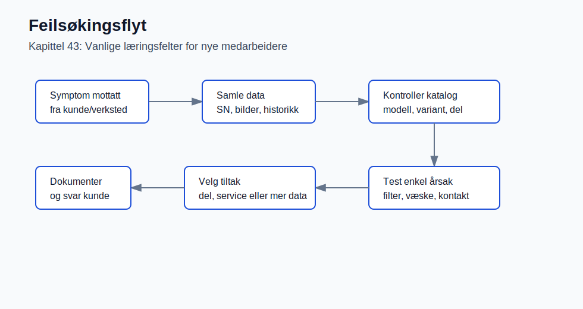

```mermaid
flowchart TD
    A[Symptom eller forespørsel mottatt] --> B[Samle serienummer, bilder og historikk]
    B --> C{Er motor og variant sikkert identifisert?}
    C -- Nei --> D[Be om mer dokumentasjon før del bekreftes]
    C -- Ja --> E[Kontroller delnummer og posisjon i katalog]
    E --> F{Stemmer symptom med foreslått del?}
    F -- Nei --> G[Foreslå feilsøking eller teknisk kontroll]
    F -- Ja --> H[Kontroller lager, pris og levering]
    H --> I[Send dokumentert kundesvar]
```

## Vedlikeholdsprosedyre
1. Avklar driftstimer, siste service og driftsmiljø.
2. Kontroller olje, filter, kjølevæske, sjøvannskrets, reimer, slanger og elektriske kontakter.
3. Sammenlign vedlikeholdsbehov med produsentens intervaller og faktisk bruk.
4. Anbefal servicekit når flere slitedeler bør skiftes samtidig.
5. Dokumenter hva som er anbefalt, hva kunden bestiller og eventuelle avvik fra normal prosedyre.

## Serienummeridentifikasjon
Serienummeridentifikasjon starter med å finne typeplate, motornummer eller annen unik identifikasjon. Be om bilde, ikke bare avskrift, fordi feil tegn, mellomrom og prefiks kan endre katalogoppslaget. Når serienummer ikke finnes, bygges identifikasjonen med modell, produksjonsår, bilder, tidligere fakturaer, servicehistorikk og delnummer fra monterte komponenter.

Minimumsdata bør være: fabrikat, modell, serienummer, eventuell product number/arrangement/CPL/motornummer, bilde av typeplate og bilde av motorens installasjon. Ved tvil skal saken stoppes for avklaring før del bekreftes.

## Reservedelsidentifikasjon
Reservedelsidentifikasjon skal bekrefte delnummer, posisjon, antall per motor, variant, side og eventuell erstatning. Dersom kunden oppgir et gammelt nummer, må det kontrolleres mot supersession. Dersom kunden bare sender bilde, skal bildet brukes som støtte, ikke som eneste grunnlag for bestilling.

Sjekk alltid om delnummeret gjelder enkeltkomponent, reparasjonssett, servicekit eller komplett enhet. Kontroller også om varen er høyre/venstre, gammel/ny type, standard/oversize eller knyttet til en bestemt produksjonsperiode.

## Bestillingsprosedyre
1. Opprett eller oppdater sak med kunde, fartøy, kontaktperson og tidsfrist.
2. Verifiser motoridentifikasjon og lagre bildedokumentasjon.
3. Finn korrekt delnummer i relevant katalog eller leverandørgrunnlag.
4. Kontroller supersession, antall, lagerstatus, pris, returvilkår og leveringstid.
5. Send ordrebekreftelse med delnummer, beskrivelse, antall, pris, levering og forbehold.
6. Følg opp leveransen til kunden har mottatt varen eller saken er lukket.

## Kvalitetspunkter før svar
- Har vi nok data til å gi et sikkert svar?
- Er delnummeret kontrollert mot riktig motorvariant?
- Er kundens tidsfrist realistisk med valgt fraktmåte?
- Er eventuelle forbehold skrevet tydelig?
- Kan en kollega forstå beslutningen ved å lese saken senere?

## Kapittelsammendrag
Hovedpoenget i kapittel 43 er at profesjonelt reservedelsarbeid krever struktur. Teknisk kunnskap, engelske fagtermer, praktisk feilsøking, dokumentasjon og kundedialog må henge sammen. Når medarbeideren jobber systematisk, reduseres feilbestillinger, kunden får bedre svar, og verkstedet kan planlegge arbeidet tryggere.

## Kryssreferanser
- For forrige tema, se kapittel 42: Kontrollist for kundesupport ved akutte situasjoner.
- For neste tema, se kapittel 44: Hvordan bygge erfaring gjennom praktisk arbeid og feilsøking.
- For grunnleggende identifikasjon, se kapittel 12 og 17.
- For merkevise eksempler, se kapitlene 26-32.

## Fordypning for intern opplæring
Dette kapitlet skal brukes som arbeidsstandard, ikke bare som lesestoff. Når en ny medarbeider møter en sak om læringsfelter, skal vedkommende trene på å gå rolig fra fakta til vurdering og deretter til handling. I en marinemotorforhandler er konsekvensen av en feil ofte større enn verdien av selve delen. En feil impeller, feil sensor, feil filterinnsats eller feil pakningssett kan føre til tapt verkstedtid, utsatt avgang, irritert kunde og i verste fall ny driftsstans. Derfor skal hver sak behandles som en teknisk beslutning med sporbar dokumentasjon.

Profesjonelt nivå i dette kapitlet betyr at medarbeideren kan arbeide sikkert med opplæring av nye medarbeidere. Før kunden får et bindende svar, skal opplysningene i saken kontrolleres mot motorens identitet, faktisk installasjon og relevant produsentterminologi. Det praktiske målet er ikke å finne et raskt nummer, men å kunne forklare hvorfor valgt del, kontrollpunkt eller kundesvar er riktig for akkurat denne motoren. Når informasjon mangler, skal medarbeideren beskrive hva som mangler, hvorfor det er nødvendig, og hvilket neste steg som bringer saken videre.

## Tekniske forklaringer
Teknisk forståelse i dette kapitlet skal bygges rundt vanlige læringsfelter, repetisjon, observasjon, casearbeid og kvalitet på saksnotat. Medarbeideren må skille mellom synlig symptom, sannsynlig systemfeil og bestillbar komponent. En del kan se riktig ut på bilde, men likevel være feil dersom posisjon, variant, rating, kjøleroppsett, elektrisk plugg, monteringsside eller servicehistorikk ikke stemmer. Derfor skal teknisk vurdering alltid kobles til både funksjon og dokumentasjon: hva gjør komponenten, hvilket system påvirker den, og hvilken produsentkilde bekrefter at den passer.

I praksis betyr dette at tekniske data skal kobles til motorens faktiske installasjon. Marine motorer står ofte trangt, er utsatt for salt, vibrasjon, fukt og ujevnt belastningsmønster, og de kan være bygget om gjennom mange år. En motor kan ha original kjøler, ettermontert eksosbend, alternativ dynamo, endret filterbrakett eller annen sjøvannspumpe enn standard. Slike forhold gjør at delidentifikasjon må bygge på både produsentdata og synlig dokumentasjon fra motoren.

Produsentterminologi er en del av den tekniske forståelsen. Bruk uttrykk som Serial Number, Engine Number, Part Number, Service Kit, Exploded View, Supersession når de er relevante. Ikke oversett dem på en måte som fjerner presisjon. Skriv for eksempel «Engine Serial Number (ESN)» første gang og deretter «ESN» i saken dersom produsenten bruker dette. Skriv «Arrangement Number» når CAT-data krever det, «Product Number» når Volvo Penta bruker det, «CPL» når Cummins-konfigurasjon må kontrolleres, og «Model Code» når Yanmar-identifikasjon bygger på modellkode. Dette gjør dialogen med internasjonale leverandører mer presis.

## Illustrasjonsforslag
- Oversiktsdiagram som viser hvor læringsfelter passer inn i total arbeidsflyt fra kundeforespørsel til levert del.
- Nærbilde av typeplate/motorskilt med markering av serienummer, motornummer, modell og eventuell variantkode.
- Sprengskisse med markert posisjon, delnummer, antall per motor og mulige alternative versjoner.
- Feilsøkingsflyt med beslutningspunkter: mangler data, stemmer symptom, kreves mer teknisk kontroll, kan ordre bekreftes.
- Sammenligningsbilde av gammel og ny del der forskjell i tilkobling, side, lengde eller sensorplugg er markert.

## Virkelige verkstedseksempler
Eksempel 1: Et verksted står med en demontert komponent på benken og kunden venter på avklaring før fartøyet kan settes tilbake i drift. Verkstedet sender et nærbilde av delen, men ingen motorplate. En uerfaren medarbeider kan bli fristet til å søke på nummeret som står på støpegodset. En profesjonell medarbeider svarer at støpenummer ikke nødvendigvis er bestillbart delnummer, ber om bilde av typeplate, oversiktsbilde av motoren og bilde av monteringsstedet, og forklarer at dette hindrer feilbestilling. Når informasjonen kommer, kontrolleres delnummer mot sprengskisse, posisjon og antall. Først da gis pris og leveringstid.

Eksempel 2: En kunde ringer sent på dagen og sier at motoren har høy temperatur etter service. Kunden ønsker ny termostat. Medarbeideren skal ikke automatisk konkludere med termostatfeil. Spørsmålene bør avklare om impeller er byttet, om sjøvannsfilteret er rent, om kjølevæskenivået er riktig, om alarmen kommer ved tomgang eller belastning, og om det finnes lekkasje rundt varmeveksler eller slanger. Dersom kunden likevel vil bestille termostat, dokumenteres at feilsøking er anbefalt, og delnummer kontrolleres mot serienummer før ordre.

Eksempel 3: En intern selger mottar en gammel faktura med et delnummer som ikke lenger finnes. Riktig prosess er å kontrollere supersession, se om ny del krever tilhørende pakning, boltsett eller adapter, og notere både gammelt og nytt nummer i saken. Kunden skal få vite at delen er erstattet, hva som leveres, og om det finnes monteringsforbehold.

## Reservedelsidentifisering i praksis
Reservedelsidentifisering skal følge en fast rekkefølge. Først kontrolleres motorens identitet. Deretter kontrolleres delens system: drivstoff, luft, kjøling, smøring, eksos, elektrisk eller mekanisk kraftoverføring. Så kontrolleres posisjon i sprengskisse eller parts list. Til slutt kontrolleres antall, variant, supersession og leveringsstatus. Denne rekkefølgen hindrer at medarbeideren hopper direkte fra kundens ord til et tilfeldig delnummer.

Når en del har synlig nummer, må nummeret tolkes riktig. Mange komponenter har produksjonsnummer, støpenummer, leverandørnummer eller revisjonskode som ikke er det samme som bestillbart part number. Et filter kan ha nummer fra filterprodusent, men motorprodusentens parts catalogue kan bruke et annet nummer. En pumpe kan ha nummer på lokk, hus og komplett enhet. Spør derfor alltid: gjelder nummeret komplett del, reparasjonssett, underkomponent eller produsentens råkomponent?

## Serienummer og motornummer
Serienummer og motornummer er grunnlaget for korrekt katalogoppslag. Be kunden sende bilde av typeplate eller dataplate. Dersom kunden skriver nummeret manuelt, skal nummeret likevel kontrolleres mot bilde når det er mulig. Noter hele nummeret, inkludert prefiks, suffiks, bindestrek, mellomrom og eventuelle bokstaver. På enkelte produsenter kan små forskjeller peke til forskjellig produksjonsperiode, rating eller konfigurasjon.

Bruk motornummer sammen med modell, variant og applikasjon. En motor som driver generator kan ha andre deler enn en fremdriftsmotor. En motor i yrkesbåt kan ha annen rating enn samme motor i fritidsbåt. En eldre motor kan være bygget om med ny dynamo, annen sjøvannspumpe eller uoriginal filterbrakett. Dersom typeplate mangler, bygg identifikasjonen gjennom flere kilder: servicebok, tidligere faktura, bilder av motorens sider, nummer på pumpe, filter, turbo og gear, samt opplysninger om fartøy og produksjonsår.

## Feilsøking steg for steg
1. Definer symptomet med kundens egne ord og skriv det i saken. Skill mellom «kunden ønsker del» og «kunden beskriver feil».
2. Avklar når feilen oppstår: start, tomgang, belastning, marsjfart, varm motor, kald motor eller etter nylig service.
3. Kontroller grunnleggende forhold: væskenivå, filter, luft i drivstoff, sjøvannsstrøm, reimer, elektriske kontakter, sikringer og synlige lekkasjer.
4. Knytt symptomet til system: lav effekt peker ofte mot luft/drivstoff/eksos, høy temperatur mot kjøling, lavt oljetrykk mot smøring/sensor, startproblem mot batteri/starter/gløding/drivstoff.
5. Be om bilder eller måledata dersom symptomet ikke kan kobles sikkert til en del. Dette kan være bilde av alarmdisplay, trykkmåling, temperaturmåling eller bilde av montert komponent.
6. Kontroller relevant delnummer mot serienummer og variant. Dersom flere alternativer finnes, forklar kunden hva som skiller dem.
7. Dokumenter anbefalt tiltak, usikkerhet og eventuelle forbehold før ordre bekreftes.

## Vedlikehold
Vedlikehold skal vurderes mot driftstimer, produsentens maintenance schedule og faktisk driftsmiljø. Marine motorer som går korte turer, mye tomgang eller i salt miljø kan trenge hyppigere kontroll enn standard intervall antyder. Nye medarbeidere skal lære å spørre om siste service, hvilke filter som ble byttet, hvilken olje som ble brukt, om impeller er kontrollert, og om kjølevæske eller anoder er byttet etter plan.

En god vedlikeholdsanbefaling er konkret. I stedet for å skrive «ta service», bør medarbeideren foreslå relevante deler: olje- og drivstoffilter, luftfilter, impeller, reim, pakninger, anoder, kjølevæske og eventuelt servicekit. Dersom kunden har ukjent servicehistorikk, bør komplett servicekit vurderes. Dersom kunden har hatt overoppheting, bør sjøvannskrets og varmeveksler kontrolleres før bare én komponent byttes.

## Vanlige feil
- Serienummer leses feil fordi et tegn forveksles, for eksempel O/0 eller I/1.
- Kunden oppgir modellnavn, men ikke variant, rating eller applikasjon.
- Del velges ut fra bilde alene uten kontroll mot sprengskisse eller produsentkatalog.
- Supersession aksepteres uten å kontrollere om ny del krever tilbehør, pakning eller ombygging.
- Hastepress gjør at leveringsløfte gis før lagerstatus og fraktmulighet er bekreftet.
- Saksnotat mangler grunnlaget for beslutningen, slik at kollega ikke kan etterprøve valget.

## Kontrollspørsmål
- Hva er den viktigste tekniske risikoen i en sak som gjelder læringsfelter?
- Hvilke opplysninger må dokumenteres før bindende delnummer bekreftes?
- Hvordan forklarer du kunden hvorfor bilde av typeplate er nødvendig?
- Når bør du stoppe en ordre og be om mer dokumentasjon?
- Hvilke engelske produsentuttrykk bør du kunne bruke i denne typen sak?
- Hvordan dokumenterer du at et delnummer er erstattet av et nytt nummer?

## Praktisk sjekkliste for medarbeider
- Les saken som om en kollega skal overta den i morgen.
- Kontroller at motoridentifikasjon er dokumentert med bilde eller sikker kilde.
- Sjekk at delnummeret er knyttet til riktig posisjon i katalogen.
- Skriv tydelig om kunden har bedt om enkeltkomponent, servicekit eller komplett enhet.
- Noter om varen er spesialbestilling, utgått, erstattet eller ikke returbar.
- Send kundesvar med neste steg, ikke bare et løst delnummer.

## Kapittelspesifikk systemforståelse
For dette kapitlet er kjernen å forstå læringsfelter for nye medarbeidere. Medarbeideren skal kunne forklare dette med praktiske ord til både kunde og kollega. Det betyr at teknisk teori må kobles til konkrete handlinger: hvilke data skal innhentes, hvilke komponenter kan være berørt, hvilken produsentterminologi skal brukes, og hva må dokumenteres før saken kan gå videre. Nye medarbeidere trenger mengdetrening i ekte saker med kontrollert veiledning.

Når systemet vurderes, skal medarbeideren først plassere problemet i riktig teknisk sammenheng. Dersom kunden beskriver en alarm, må man finne ut om alarmen kommer fra reelt mekanisk avvik, elektrisk sensorfeil, feil etter service eller feil tolkning av instrumentet. Dersom kunden beskriver en del, må man avklare om kunden mener komplett enhet, servicekit, reparasjonssett eller enkeltkomponent. Dersom kunden beskriver motoren med vanlig navn, må man kontrollere om produsenten bruker mer presise begreper i katalogen.

## Komponentoversikt og arbeidsgrense
Relevante komponenter og opplysninger i dette kapitlet omfatter: katalogtrening, motorforståelse, kundedialog, lagerlogikk, produsentterminologi og feilsøking. Listen er ikke ment som en erstatning for produsentens parts catalogue, men som en praktisk påminnelse om hva nye medarbeidere skal tenke på før de søker del. I interne saker skal komponentnavn skrives så presist som mulig. Bruk for eksempel «sjøvannspumpe / raw water pump» i stedet for bare «pumpe» når funksjonen er kjent, og «varmeveksler / heat exchanger» i stedet for bare «kjøler» når det er den komponenten saken gjelder.

Arbeidsgrensen for en reservedelsmedarbeider er også viktig. Medarbeideren skal ikke overta mekanikerens ansvar for demontering, måling eller diagnose på motoren, men skal kunne stille riktige spørsmål og foreslå riktig dokumentasjon. Når en sak går fra enkel delidentifikasjon til teknisk diagnose, skal dette markeres i saken. Da kan verksted, teknisk ansvarlig eller leverandør involveres med et klart spørsmål og et ryddig faktagrunnlag.

## Praktisk beslutningsregel
Bruk denne regelen i alle saker knyttet til kapitlet: Hvis motoridentifikasjon, komponentposisjon eller symptom ikke er sikkert nok dokumentert, skal medarbeideren ikke gi bindende delbekreftelse. Kunden kan få et foreløpig svar, men svaret må inneholde hva som mangler, hvorfor det mangler, og hva som skjer når informasjonen er mottatt. Dette er ikke treg service; det er profesjonell risikokontroll.

## Målrettet fordypning kapittel 41-50
### Læringsfelter for nye medarbeidere
Nye medarbeidere utvikler kompetanse i trinn. Først må de mestre språk og struktur: serienummer, delnummer, saksnotat og kundesvar. Deretter lærer de systemforståelse: luft, drivstoff, kjøling, smøring, elektrisk og fremdrift. Tredje nivå er produsentlogikk: CAT Arrangement Number, Volvo Penta Product Number, Cummins CPL, MAN/Scania engine number og Yanmar model code.

Opplæring bør bruke ekte, anonymiserte saker. Deltakeren skal forklare hva som er kjent, hva som mangler, hvilke risikoer som finnes, og hvilket svar kunden bør få. Læring skjer best når instruktør viser hvorfor en vurdering er trygg eller utrygg, ikke bare hva riktig delnummer er.

### Praktisk anvendelse i opplæring
Bruk kapitlet til en avsluttende case der deltakeren må vise selvstendig vurdering. Deltakeren skal identifisere teknisk risiko, skrive kundesvar, velge dokumentasjon, forklare eventuelle forbehold og angi når saken skal eskaleres. Dette er særlig viktig i sluttkapitlene, fordi de binder sammen teknikk, kvalitet, læring og praktisk drift.

## Realistisk opplæring i praksis
### Verkstedhistorie
En typisk sak i dette temaet starter med ny ansatt hopper over saksnotat. Verkstedet trenger et raskt svar, men den erfarne medarbeideren stopper opp og spør først: hva vet vi sikkert, hva antar vi, og hva kan gi følgeskade hvis vi tar feil? I praksis betyr det at opplæringsvaner må kobles til bilde, serienummer, komponentposisjon og kundens symptom før saken lukkes. Historien skal brukes i opplæring som en øvelse i å skrive et kort saksnotat: observasjon, vurdering, neste handling og forbehold.

### Kundehistorie
Kunden beskriver ofte problemet med driftsspråk: «motoren går tungt», «alarm kommer etter ti minutter», «jeg trenger den samme delen som sist» eller «båten skal ut i morgen». En profesjonell respons er rolig og konkret: bekreft behovet, forklar hvorfor identifikasjon trengs, be om riktig dokumentasjon og gi et realistisk tidspunkt for neste svar. Ikke korriger kunden unødvendig; oversett kundens språk til teknisk språk i saken.

### Typiske feil nye ansatte gjør
- søker på første synlige nummer uten å avklare om det er støpenummer, leverandørnummer eller bestillbart part number.
- lover levering før lagerstatus, frakt og returvilkår er kontrollert.
- antar at tidligere faktura alltid gjelder samme motorvariant.
- blander symptom og årsak, spesielt ved varme, lav effekt, startproblem og alarm.
- skriver for korte notater slik at kollega ikke kan forstå hvorfor valget ble tatt.

### Tips fra erfarne mekanikere og reservedelsselgere
- Se alltid etter systemet rundt delen: slanger, braketter, sensorer, reimer, kjølere og tilkoblinger forteller ofte mer enn delen alene.
- Still ett presist spørsmål om gangen når kunden er stresset; mange dårlige svar kommer av for lange spørsmålslister.
- Sammenlign gammel og ny del mot funksjon, ikke bare form. Riktig del skal passe, men også løse riktig problem.
- En erfaren reservedelsselger tenker i risiko: Hva er billigst å avklare nå, og hva blir dyrt hvis vi hopper over det?

### Vanlige kundespørsmål
| Spørsmål fra kunde | Profesjonelt svar |
|---|---|
| «Kan du bare sende samme del som sist?» | «Ja, hvis vi først bekrefter at det gjelder samme motor, samme posisjon og ingen supersession siden sist.» |
| «Holder det med bilde?» | «Bilde hjelper, men vi trenger også motoridentitet for å sikre variant og delnummer.» |
| «Hvorfor tar dette tid?» | «Fordi feil del kan gi ny driftsstans. Vi kontrollerer grunnlaget før vi lover levering.» |

### Beslutningstre for saken
| Trinn | Spørsmål | Handling |
|---|---|---|
| 1 | Er motoridentitet dokumentert med bilde eller sikker historikk? | Hvis nei: be om typeplate/dataplate eller alternativ dokumentasjon. |
| 2 | Er komponentens funksjon og posisjon kjent? | Hvis nei: be om oversiktsbilde og bilde av monteringssted. |
| 3 | Stemmer kundens symptom med delen som ønskes? | Hvis nei: anbefal feilsøking før del bestilles. |
| 4 | Finnes det supersession, kit eller variantvalg? | Kontroller produsentkilde og skriv forbehold i saken. |
| 5 | Kan pris, levering og returvilkår bekreftes? | Send dokumentert svar med neste steg og tydelig gyldighet. |

### Rask oppslagstabell
| Situasjon | Kontroller først | Vanlig fallgruve |
|---|---|---|
| Hasteordre | sikker motor-ID, lager, fraktfrist | levering loves før teknisk kontroll |
| Del fra bilde | posisjon, skala, tilkoblinger, nummer | bilde brukes som eneste beslutningsgrunnlag |
| Gammelt delnummer | supersession og kitinnhold | ny del krever ekstra pakning eller adapter |
| Uklart symptom | driftssituasjon, alarm, siste service | symptom blir tolket som sikker komponentfeil |

### Praktisk sjekkliste og inspeksjonsrutine
- Start med motoridentitet: fabrikat, modell, serienummer, variant, applikasjon og bilde av skilt.
- Kontroller området rundt komponenten: lekkasje, korrosjon, knekte fester, slitasje, varmemerker og uoriginale endringer.
- Spør om siste vedlikehold: olje, filter, impeller, reimer, kjølevæske, anoder og drivstoffilter.
- Noter driftstype: fritidsbruk, yrkesbruk, generator, fremdrift, tomgangsdrift eller langvarig høy belastning.
- Avklar om saken gjelder akutt drift, planlagt service, reklamasjon eller lagerpåfyll.

### Generelle vedlikeholdsintervaller som opplæringspunkt
| Kontrollpunkt | Typisk vurdering i opplæring | Må verifiseres |
|---|---|---|
| Olje og oljefilter | ofte basert på timer og kalender | produsentens maintenance schedule |
| Drivstoffilter/vannutskiller | hyppigere ved dårlig drivstoff eller sesongstart | motor- og filterspesifikasjon |
| Impeller og sjøvannskrets | kontrolleres særlig før sesong og etter varmgang | produsentens intervall og installasjon |
| Reimer, slanger og klemmer | visuell kontroll ved service og feilsøking | dimensjon, stramming og delnummer |

### Produsentverifikasjon
Alle konkrete delnumre, momentverdier, serviceintervaller, garantikrav, programvaredata og produsentspesifikke grenser skal kontrolleres mot offisiell produsentdokumentasjon før de brukes i tilbud, ordre eller verkstedinstruks. Marker tydelig i saken når svaret bygger på antakelse, eldre historikk, bilde uten motor-ID eller generell erfaring. Intervaller i tabellen er generelle opplæringspunkter. Faktiske intervaller styres av produsent, motorvariant, driftstimer, kalenderkrav, belastning og miljø.

## Produsentverifikasjon og faglig forbehold
Denne manualen skal brukes som intern opplæring og arbeidsmetode. Produsentspesifikke delnumre, intervaller, momentverdier, garantikrav og tekniske grenseverdier skal verifiseres mot gjeldende produsentdokumentasjon før de brukes i kundeordre eller verkstedinstruks. Marker saken internt dersom opplysningen bygger på antakelse, eldre historikk eller bilde uten bekreftet motoridentitet.

## Quiz med fasit
1. Hvilke tekniske data bør alltid samles før en del bekreftes?
2. Hvorfor er engelsk terminologi viktig i marine reservedeler?
3. Hva bør gjøres dersom kunden bare sender et bilde av delen?
4. Hvilke punkter bør kontrolleres før ordrebekreftelse sendes?
5. Hvorfor skal feilsøking dokumenteres, selv når kunden allerede ber om en bestemt del?

### Svar
1. Fabrikat, modell, serienummer, variantdata, bilde av typeplate, delnummer, posisjon og kundens symptombeskrivelse.
2. Fordi kataloger, portaler, servicemanualer og leverandørdialog ofte bruker engelske begreper som må forstås presist.
3. Be om serienummer, oversiktsbilde av motoren og eventuelle nummer på delen; bildet brukes som støtte, ikke eneste grunnlag.
4. Delnummer, antall, variant, pris, lagerstatus, leveringstid, frakt, returvilkår og eventuelle forbehold.
5. Fordi symptomet kan ha flere årsaker, og dokumentasjon viser hvorfor anbefalingen ble gitt.

---

# Kapittel 44: Hvordan bygge erfaring gjennom praktisk arbeid og feilsøking

## Kapittelrolle
Dette kapitlet gir en grundig praktisk innføring i erfaringsbygging. Temaet er viktig fordi reservedelsarbeid i marine miljøer kombinerer teknisk forståelse, presis kundedialog, dokumentert saksbehandling og realistisk leveranseoppfølging. Målet er at en ny medarbeider skal kunne bruke kunnskapen direkte i arbeid med verksted, kunde, lager og leverandør.

## Læringsmål
Etter kapitlet skal deltakeren kunne:
- forklare hovedbegrepene innen erfaringsbygging
- bruke serienummer, modellinformasjon og delnummer i praktisk reservedelsarbeid
- kommunisere trygt med kunde, verksted, lager og leverandør
- dokumentere beslutninger slik at andre kan etterprøve saken
- kjenne igjen vanlige feil og velge riktig neste handling

## English technical terminology
- **Serial Number:** engelsk fagterm som ofte brukes i kataloger, servicelitteratur, leverandørportaler og internasjonal kundedialog.
- **Part Number:** engelsk fagterm som ofte brukes i kataloger, servicelitteratur, leverandørportaler og internasjonal kundedialog.
- **Engine Model:** engelsk fagterm som ofte brukes i kataloger, servicelitteratur, leverandørportaler og internasjonal kundedialog.
- **Variant:** engelsk fagterm som ofte brukes i kataloger, servicelitteratur, leverandørportaler og internasjonal kundedialog.
- **Service Kit:** engelsk fagterm som ofte brukes i kataloger, servicelitteratur, leverandørportaler og internasjonal kundedialog.
- **Troubleshooting:** engelsk fagterm som ofte brukes i kataloger, servicelitteratur, leverandørportaler og internasjonal kundedialog.
- **Maintenance:** engelsk fagterm som ofte brukes i kataloger, servicelitteratur, leverandørportaler og internasjonal kundedialog.
- **Ordering Procedure:** engelsk fagterm som ofte brukes i kataloger, servicelitteratur, leverandørportaler og internasjonal kundedialog.
- **Supersession:** engelsk fagterm som ofte brukes i kataloger, servicelitteratur, leverandørportaler og internasjonal kundedialog.
- **Technical Support:** engelsk fagterm som ofte brukes i kataloger, servicelitteratur, leverandørportaler og internasjonal kundedialog.

## Hoveddiagram

## Tekniske systemillustrasjoner

## Grundig forklaring
Hvordan praktiske saker blir læring må forstås både teknisk og praktisk. I marine reservedeler er det sjelden nok å vite hva kunden kaller delen. Medarbeideren må forstå hvilken funksjon delen har, hvor den sitter, hvilken motorvariant den tilhører, og hva som skjer dersom feil del bestilles. Derfor skal tekniske data, kundens beskrivelse og dokumentert katalogoppslag alltid vurderes sammen.

En god sak har fire kjennetegn: den har tydelig identifikasjon, tydelig problem- eller delbeskrivelse, tydelig beslutningsgrunnlag og tydelig oppfølging. Dersom ett av disse punktene mangler, skal saken markeres som usikker før kunden får et bindende svar.

## Praktisk verkstedeksempel
Et verksted står med demontert komponent og trenger rask avklaring. Medarbeideren registrerer kunde, fartøy, motorinformasjon og tidsfrist, ber om bilder av typeplate og komponent, sjekker katalog og lager, og sender et kort skriftlig svar med valgt del, grunnlag for valget og neste oppdateringstidspunkt.

## Kundesupporteksempel
Kunde: 'Motoren går dårlig, kan dere sende riktig del?' Profesjonelt svar: 'Vi kan hjelpe, men først må vi skille mellom symptom og delbehov. Send serienummer, bilde av motorplate, bilde av området feilen gjelder og en kort beskrivelse av når feilen oppstår. Da kan vi foreslå riktig del eller riktig neste feilsøkingstrinn.'

## Vanlige feil og årsaker
- feil eller ufullstendig serienummer.
- delnummer som er erstattet uten at saken dokumenteres.
- symptom som tolkes som delbehov uten feilsøking.
- kunde har bilde av lignende del, men ikke korrekt motorvariant.
- manglende avklaring av antall, side, posisjon eller leveringstid.

## Feilsøkingsflyt
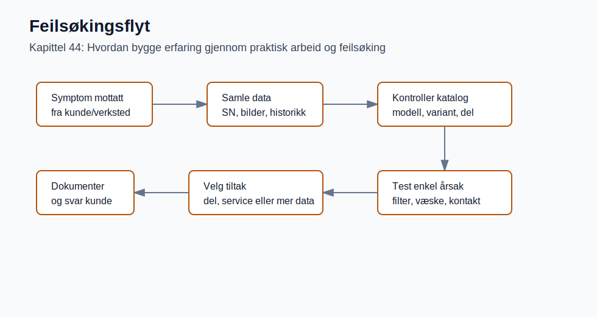

```mermaid
flowchart TD
    A[Symptom eller forespørsel mottatt] --> B[Samle serienummer, bilder og historikk]
    B --> C{Er motor og variant sikkert identifisert?}
    C -- Nei --> D[Be om mer dokumentasjon før del bekreftes]
    C -- Ja --> E[Kontroller delnummer og posisjon i katalog]
    E --> F{Stemmer symptom med foreslått del?}
    F -- Nei --> G[Foreslå feilsøking eller teknisk kontroll]
    F -- Ja --> H[Kontroller lager, pris og levering]
    H --> I[Send dokumentert kundesvar]
```

## Vedlikeholdsprosedyre
1. Avklar driftstimer, siste service og driftsmiljø.
2. Kontroller olje, filter, kjølevæske, sjøvannskrets, reimer, slanger og elektriske kontakter.
3. Sammenlign vedlikeholdsbehov med produsentens intervaller og faktisk bruk.
4. Anbefal servicekit når flere slitedeler bør skiftes samtidig.
5. Dokumenter hva som er anbefalt, hva kunden bestiller og eventuelle avvik fra normal prosedyre.

## Serienummeridentifikasjon
Serienummeridentifikasjon starter med å finne typeplate, motornummer eller annen unik identifikasjon. Be om bilde, ikke bare avskrift, fordi feil tegn, mellomrom og prefiks kan endre katalogoppslaget. Når serienummer ikke finnes, bygges identifikasjonen med modell, produksjonsår, bilder, tidligere fakturaer, servicehistorikk og delnummer fra monterte komponenter.

Minimumsdata bør være: fabrikat, modell, serienummer, eventuell product number/arrangement/CPL/motornummer, bilde av typeplate og bilde av motorens installasjon. Ved tvil skal saken stoppes for avklaring før del bekreftes.

## Reservedelsidentifikasjon
Reservedelsidentifikasjon skal bekrefte delnummer, posisjon, antall per motor, variant, side og eventuell erstatning. Dersom kunden oppgir et gammelt nummer, må det kontrolleres mot supersession. Dersom kunden bare sender bilde, skal bildet brukes som støtte, ikke som eneste grunnlag for bestilling.

Sjekk alltid om delnummeret gjelder enkeltkomponent, reparasjonssett, servicekit eller komplett enhet. Kontroller også om varen er høyre/venstre, gammel/ny type, standard/oversize eller knyttet til en bestemt produksjonsperiode.

## Bestillingsprosedyre
1. Opprett eller oppdater sak med kunde, fartøy, kontaktperson og tidsfrist.
2. Verifiser motoridentifikasjon og lagre bildedokumentasjon.
3. Finn korrekt delnummer i relevant katalog eller leverandørgrunnlag.
4. Kontroller supersession, antall, lagerstatus, pris, returvilkår og leveringstid.
5. Send ordrebekreftelse med delnummer, beskrivelse, antall, pris, levering og forbehold.
6. Følg opp leveransen til kunden har mottatt varen eller saken er lukket.

## Kvalitetspunkter før svar
- Har vi nok data til å gi et sikkert svar?
- Er delnummeret kontrollert mot riktig motorvariant?
- Er kundens tidsfrist realistisk med valgt fraktmåte?
- Er eventuelle forbehold skrevet tydelig?
- Kan en kollega forstå beslutningen ved å lese saken senere?

## Kapittelsammendrag
Hovedpoenget i kapittel 44 er at profesjonelt reservedelsarbeid krever struktur. Teknisk kunnskap, engelske fagtermer, praktisk feilsøking, dokumentasjon og kundedialog må henge sammen. Når medarbeideren jobber systematisk, reduseres feilbestillinger, kunden får bedre svar, og verkstedet kan planlegge arbeidet tryggere.

## Kryssreferanser
- For forrige tema, se kapittel 43: Vanlige læringsfelter for nye medarbeidere.
- For neste tema, se kapittel 45: Kvalitetsmål og rutiner for pålitelig service.
- For grunnleggende identifikasjon, se kapittel 12 og 17.
- For merkevise eksempler, se kapitlene 26-32.

## Fordypning for intern opplæring
Dette kapitlet skal brukes som arbeidsstandard, ikke bare som lesestoff. Når en ny medarbeider møter en sak om erfaringsbygging, skal vedkommende trene på å gå rolig fra fakta til vurdering og deretter til handling. I en marinemotorforhandler er konsekvensen av en feil ofte større enn verdien av selve delen. En feil impeller, feil sensor, feil filterinnsats eller feil pakningssett kan føre til tapt verkstedtid, utsatt avgang, irritert kunde og i verste fall ny driftsstans. Derfor skal hver sak behandles som en teknisk beslutning med sporbar dokumentasjon.

Profesjonelt nivå i dette kapitlet betyr at medarbeideren kan arbeide sikkert med erfaringsbygging. Før kunden får et bindende svar, skal opplysningene i saken kontrolleres mot motorens identitet, faktisk installasjon og relevant produsentterminologi. Det praktiske målet er ikke å finne et raskt nummer, men å kunne forklare hvorfor valgt del, kontrollpunkt eller kundesvar er riktig for akkurat denne motoren. Når informasjon mangler, skal medarbeideren beskrive hva som mangler, hvorfor det er nødvendig, og hvilket neste steg som bringer saken videre.

## Tekniske forklaringer
Teknisk forståelse i dette kapitlet skal bygges rundt verkstedcase, feilsøkingslogg, etterkontroll, kollegaveiledning og læringsnotat. Medarbeideren må skille mellom synlig symptom, sannsynlig systemfeil og bestillbar komponent. En del kan se riktig ut på bilde, men likevel være feil dersom posisjon, variant, rating, kjøleroppsett, elektrisk plugg, monteringsside eller servicehistorikk ikke stemmer. Derfor skal teknisk vurdering alltid kobles til både funksjon og dokumentasjon: hva gjør komponenten, hvilket system påvirker den, og hvilken produsentkilde bekrefter at den passer.

I praksis betyr dette at tekniske data skal kobles til motorens faktiske installasjon. Marine motorer står ofte trangt, er utsatt for salt, vibrasjon, fukt og ujevnt belastningsmønster, og de kan være bygget om gjennom mange år. En motor kan ha original kjøler, ettermontert eksosbend, alternativ dynamo, endret filterbrakett eller annen sjøvannspumpe enn standard. Slike forhold gjør at delidentifikasjon må bygge på både produsentdata og synlig dokumentasjon fra motoren.

Produsentterminologi er en del av den tekniske forståelsen. Bruk uttrykk som Serial Number, Engine Number, Part Number, Service Kit, Exploded View, Supersession når de er relevante. Ikke oversett dem på en måte som fjerner presisjon. Skriv for eksempel «Engine Serial Number (ESN)» første gang og deretter «ESN» i saken dersom produsenten bruker dette. Skriv «Arrangement Number» når CAT-data krever det, «Product Number» når Volvo Penta bruker det, «CPL» når Cummins-konfigurasjon må kontrolleres, og «Model Code» når Yanmar-identifikasjon bygger på modellkode. Dette gjør dialogen med internasjonale leverandører mer presis.

## Illustrasjonsforslag
- Oversiktsdiagram som viser hvor erfaringsbygging passer inn i total arbeidsflyt fra kundeforespørsel til levert del.
- Nærbilde av typeplate/motorskilt med markering av serienummer, motornummer, modell og eventuell variantkode.
- Sprengskisse med markert posisjon, delnummer, antall per motor og mulige alternative versjoner.
- Feilsøkingsflyt med beslutningspunkter: mangler data, stemmer symptom, kreves mer teknisk kontroll, kan ordre bekreftes.
- Sammenligningsbilde av gammel og ny del der forskjell i tilkobling, side, lengde eller sensorplugg er markert.

## Virkelige verkstedseksempler
Eksempel 1: Et verksted står med en demontert komponent på benken og kunden venter på avklaring før fartøyet kan settes tilbake i drift. Verkstedet sender et nærbilde av delen, men ingen motorplate. En uerfaren medarbeider kan bli fristet til å søke på nummeret som står på støpegodset. En profesjonell medarbeider svarer at støpenummer ikke nødvendigvis er bestillbart delnummer, ber om bilde av typeplate, oversiktsbilde av motoren og bilde av monteringsstedet, og forklarer at dette hindrer feilbestilling. Når informasjonen kommer, kontrolleres delnummer mot sprengskisse, posisjon og antall. Først da gis pris og leveringstid.

Eksempel 2: En kunde ringer sent på dagen og sier at motoren har høy temperatur etter service. Kunden ønsker ny termostat. Medarbeideren skal ikke automatisk konkludere med termostatfeil. Spørsmålene bør avklare om impeller er byttet, om sjøvannsfilteret er rent, om kjølevæskenivået er riktig, om alarmen kommer ved tomgang eller belastning, og om det finnes lekkasje rundt varmeveksler eller slanger. Dersom kunden likevel vil bestille termostat, dokumenteres at feilsøking er anbefalt, og delnummer kontrolleres mot serienummer før ordre.

Eksempel 3: En intern selger mottar en gammel faktura med et delnummer som ikke lenger finnes. Riktig prosess er å kontrollere supersession, se om ny del krever tilhørende pakning, boltsett eller adapter, og notere både gammelt og nytt nummer i saken. Kunden skal få vite at delen er erstattet, hva som leveres, og om det finnes monteringsforbehold.

## Reservedelsidentifisering i praksis
Reservedelsidentifisering skal følge en fast rekkefølge. Først kontrolleres motorens identitet. Deretter kontrolleres delens system: drivstoff, luft, kjøling, smøring, eksos, elektrisk eller mekanisk kraftoverføring. Så kontrolleres posisjon i sprengskisse eller parts list. Til slutt kontrolleres antall, variant, supersession og leveringsstatus. Denne rekkefølgen hindrer at medarbeideren hopper direkte fra kundens ord til et tilfeldig delnummer.

Når en del har synlig nummer, må nummeret tolkes riktig. Mange komponenter har produksjonsnummer, støpenummer, leverandørnummer eller revisjonskode som ikke er det samme som bestillbart part number. Et filter kan ha nummer fra filterprodusent, men motorprodusentens parts catalogue kan bruke et annet nummer. En pumpe kan ha nummer på lokk, hus og komplett enhet. Spør derfor alltid: gjelder nummeret komplett del, reparasjonssett, underkomponent eller produsentens råkomponent?

## Serienummer og motornummer
Serienummer og motornummer er grunnlaget for korrekt katalogoppslag. Be kunden sende bilde av typeplate eller dataplate. Dersom kunden skriver nummeret manuelt, skal nummeret likevel kontrolleres mot bilde når det er mulig. Noter hele nummeret, inkludert prefiks, suffiks, bindestrek, mellomrom og eventuelle bokstaver. På enkelte produsenter kan små forskjeller peke til forskjellig produksjonsperiode, rating eller konfigurasjon.

Bruk motornummer sammen med modell, variant og applikasjon. En motor som driver generator kan ha andre deler enn en fremdriftsmotor. En motor i yrkesbåt kan ha annen rating enn samme motor i fritidsbåt. En eldre motor kan være bygget om med ny dynamo, annen sjøvannspumpe eller uoriginal filterbrakett. Dersom typeplate mangler, bygg identifikasjonen gjennom flere kilder: servicebok, tidligere faktura, bilder av motorens sider, nummer på pumpe, filter, turbo og gear, samt opplysninger om fartøy og produksjonsår.

## Feilsøking steg for steg
1. Definer symptomet med kundens egne ord og skriv det i saken. Skill mellom «kunden ønsker del» og «kunden beskriver feil».
2. Avklar når feilen oppstår: start, tomgang, belastning, marsjfart, varm motor, kald motor eller etter nylig service.
3. Kontroller grunnleggende forhold: væskenivå, filter, luft i drivstoff, sjøvannsstrøm, reimer, elektriske kontakter, sikringer og synlige lekkasjer.
4. Knytt symptomet til system: lav effekt peker ofte mot luft/drivstoff/eksos, høy temperatur mot kjøling, lavt oljetrykk mot smøring/sensor, startproblem mot batteri/starter/gløding/drivstoff.
5. Be om bilder eller måledata dersom symptomet ikke kan kobles sikkert til en del. Dette kan være bilde av alarmdisplay, trykkmåling, temperaturmåling eller bilde av montert komponent.
6. Kontroller relevant delnummer mot serienummer og variant. Dersom flere alternativer finnes, forklar kunden hva som skiller dem.
7. Dokumenter anbefalt tiltak, usikkerhet og eventuelle forbehold før ordre bekreftes.

## Vedlikehold
Vedlikehold skal vurderes mot driftstimer, produsentens maintenance schedule og faktisk driftsmiljø. Marine motorer som går korte turer, mye tomgang eller i salt miljø kan trenge hyppigere kontroll enn standard intervall antyder. Nye medarbeidere skal lære å spørre om siste service, hvilke filter som ble byttet, hvilken olje som ble brukt, om impeller er kontrollert, og om kjølevæske eller anoder er byttet etter plan.

En god vedlikeholdsanbefaling er konkret. I stedet for å skrive «ta service», bør medarbeideren foreslå relevante deler: olje- og drivstoffilter, luftfilter, impeller, reim, pakninger, anoder, kjølevæske og eventuelt servicekit. Dersom kunden har ukjent servicehistorikk, bør komplett servicekit vurderes. Dersom kunden har hatt overoppheting, bør sjøvannskrets og varmeveksler kontrolleres før bare én komponent byttes.

## Vanlige feil
- Serienummer leses feil fordi et tegn forveksles, for eksempel O/0 eller I/1.
- Kunden oppgir modellnavn, men ikke variant, rating eller applikasjon.
- Del velges ut fra bilde alene uten kontroll mot sprengskisse eller produsentkatalog.
- Supersession aksepteres uten å kontrollere om ny del krever tilbehør, pakning eller ombygging.
- Hastepress gjør at leveringsløfte gis før lagerstatus og fraktmulighet er bekreftet.
- Saksnotat mangler grunnlaget for beslutningen, slik at kollega ikke kan etterprøve valget.

## Kontrollspørsmål
- Hva er den viktigste tekniske risikoen i en sak som gjelder erfaringsbygging?
- Hvilke opplysninger må dokumenteres før bindende delnummer bekreftes?
- Hvordan forklarer du kunden hvorfor bilde av typeplate er nødvendig?
- Når bør du stoppe en ordre og be om mer dokumentasjon?
- Hvilke engelske produsentuttrykk bør du kunne bruke i denne typen sak?
- Hvordan dokumenterer du at et delnummer er erstattet av et nytt nummer?

## Praktisk sjekkliste for medarbeider
- Les saken som om en kollega skal overta den i morgen.
- Kontroller at motoridentifikasjon er dokumentert med bilde eller sikker kilde.
- Sjekk at delnummeret er knyttet til riktig posisjon i katalogen.
- Skriv tydelig om kunden har bedt om enkeltkomponent, servicekit eller komplett enhet.
- Noter om varen er spesialbestilling, utgått, erstattet eller ikke returbar.
- Send kundesvar med neste steg, ikke bare et løst delnummer.

## Kapittelspesifikk systemforståelse
For dette kapitlet er kjernen å forstå erfaring gjennom praktisk arbeid. Medarbeideren skal kunne forklare dette med praktiske ord til både kunde og kollega. Det betyr at teknisk teori må kobles til konkrete handlinger: hvilke data skal innhentes, hvilke komponenter kan være berørt, hvilken produsentterminologi skal brukes, og hva må dokumenteres før saken kan gå videre. Erfaring bygges når saker evalueres, ikke bare når de avsluttes.

Når systemet vurderes, skal medarbeideren først plassere problemet i riktig teknisk sammenheng. Dersom kunden beskriver en alarm, må man finne ut om alarmen kommer fra reelt mekanisk avvik, elektrisk sensorfeil, feil etter service eller feil tolkning av instrumentet. Dersom kunden beskriver en del, må man avklare om kunden mener komplett enhet, servicekit, reparasjonssett eller enkeltkomponent. Dersom kunden beskriver motoren med vanlig navn, må man kontrollere om produsenten bruker mer presise begreper i katalogen.

## Komponentoversikt og arbeidsgrense
Relevante komponenter og opplysninger i dette kapitlet omfatter: case review, root cause, lesson learned, peer check, avvik og forbedring. Listen er ikke ment som en erstatning for produsentens parts catalogue, men som en praktisk påminnelse om hva nye medarbeidere skal tenke på før de søker del. I interne saker skal komponentnavn skrives så presist som mulig. Bruk for eksempel «sjøvannspumpe / raw water pump» i stedet for bare «pumpe» når funksjonen er kjent, og «varmeveksler / heat exchanger» i stedet for bare «kjøler» når det er den komponenten saken gjelder.

Arbeidsgrensen for en reservedelsmedarbeider er også viktig. Medarbeideren skal ikke overta mekanikerens ansvar for demontering, måling eller diagnose på motoren, men skal kunne stille riktige spørsmål og foreslå riktig dokumentasjon. Når en sak går fra enkel delidentifikasjon til teknisk diagnose, skal dette markeres i saken. Da kan verksted, teknisk ansvarlig eller leverandør involveres med et klart spørsmål og et ryddig faktagrunnlag.

## Praktisk beslutningsregel
Bruk denne regelen i alle saker knyttet til kapitlet: Hvis motoridentifikasjon, komponentposisjon eller symptom ikke er sikkert nok dokumentert, skal medarbeideren ikke gi bindende delbekreftelse. Kunden kan få et foreløpig svar, men svaret må inneholde hva som mangler, hvorfor det mangler, og hva som skjer når informasjonen er mottatt. Dette er ikke treg service; det er profesjonell risikokontroll.

## Målrettet fordypning kapittel 41-50
### Erfaring gjennom praktisk arbeid og feilsøking
Erfaring bygges når saker evalueres. Etter en vanskelig ordre bør teamet spørre: hva gjorde vi riktig, hva manglet, hvilke data kom sent, og kunne feil vært fanget tidligere? Slike case reviews gjør individuell erfaring om til felles standard. Bruk begreper som lesson learned, root cause, peer check og corrective action når dette passer i intern kvalitetsdialog.

Medarbeideren bør gradvis få ansvar for mer komplekse saker: først servicekit med komplett serienummer, deretter pumpesaker, så eldre motorer, elektronikk og hastesaker. Hver ny sakstype bør ha mentorstøtte til medarbeideren viser at de kan dokumentere beslutning og forbehold selvstendig.

### Praktisk anvendelse i opplæring
Bruk kapitlet til en avsluttende case der deltakeren må vise selvstendig vurdering. Deltakeren skal identifisere teknisk risiko, skrive kundesvar, velge dokumentasjon, forklare eventuelle forbehold og angi når saken skal eskaleres. Dette er særlig viktig i sluttkapitlene, fordi de binder sammen teknikk, kvalitet, læring og praktisk drift.

## Realistisk opplæring i praksis
### Verkstedhistorie
En typisk sak i dette temaet starter med samme feil gjentar seg i flere saker. Verkstedet trenger et raskt svar, men den erfarne medarbeideren stopper opp og spør først: hva vet vi sikkert, hva antar vi, og hva kan gi følgeskade hvis vi tar feil? I praksis betyr det at casegjennomgang må kobles til bilde, serienummer, komponentposisjon og kundens symptom før saken lukkes. Historien skal brukes i opplæring som en øvelse i å skrive et kort saksnotat: observasjon, vurdering, neste handling og forbehold.

### Kundehistorie
Kunden beskriver ofte problemet med driftsspråk: «motoren går tungt», «alarm kommer etter ti minutter», «jeg trenger den samme delen som sist» eller «båten skal ut i morgen». En profesjonell respons er rolig og konkret: bekreft behovet, forklar hvorfor identifikasjon trengs, be om riktig dokumentasjon og gi et realistisk tidspunkt for neste svar. Ikke korriger kunden unødvendig; oversett kundens språk til teknisk språk i saken.

### Typiske feil nye ansatte gjør
- søker på første synlige nummer uten å avklare om det er støpenummer, leverandørnummer eller bestillbart part number.
- lover levering før lagerstatus, frakt og returvilkår er kontrollert.
- antar at tidligere faktura alltid gjelder samme motorvariant.
- blander symptom og årsak, spesielt ved varme, lav effekt, startproblem og alarm.
- skriver for korte notater slik at kollega ikke kan forstå hvorfor valget ble tatt.

### Tips fra erfarne mekanikere og reservedelsselgere
- Se alltid etter systemet rundt delen: slanger, braketter, sensorer, reimer, kjølere og tilkoblinger forteller ofte mer enn delen alene.
- Still ett presist spørsmål om gangen når kunden er stresset; mange dårlige svar kommer av for lange spørsmålslister.
- Sammenlign gammel og ny del mot funksjon, ikke bare form. Riktig del skal passe, men også løse riktig problem.
- En erfaren reservedelsselger tenker i risiko: Hva er billigst å avklare nå, og hva blir dyrt hvis vi hopper over det?

### Vanlige kundespørsmål
| Spørsmål fra kunde | Profesjonelt svar |
|---|---|
| «Kan du bare sende samme del som sist?» | «Ja, hvis vi først bekrefter at det gjelder samme motor, samme posisjon og ingen supersession siden sist.» |
| «Holder det med bilde?» | «Bilde hjelper, men vi trenger også motoridentitet for å sikre variant og delnummer.» |
| «Hvorfor tar dette tid?» | «Fordi feil del kan gi ny driftsstans. Vi kontrollerer grunnlaget før vi lover levering.» |

### Beslutningstre for saken
| Trinn | Spørsmål | Handling |
|---|---|---|
| 1 | Er motoridentitet dokumentert med bilde eller sikker historikk? | Hvis nei: be om typeplate/dataplate eller alternativ dokumentasjon. |
| 2 | Er komponentens funksjon og posisjon kjent? | Hvis nei: be om oversiktsbilde og bilde av monteringssted. |
| 3 | Stemmer kundens symptom med delen som ønskes? | Hvis nei: anbefal feilsøking før del bestilles. |
| 4 | Finnes det supersession, kit eller variantvalg? | Kontroller produsentkilde og skriv forbehold i saken. |
| 5 | Kan pris, levering og returvilkår bekreftes? | Send dokumentert svar med neste steg og tydelig gyldighet. |

### Rask oppslagstabell
| Situasjon | Kontroller først | Vanlig fallgruve |
|---|---|---|
| Hasteordre | sikker motor-ID, lager, fraktfrist | levering loves før teknisk kontroll |
| Del fra bilde | posisjon, skala, tilkoblinger, nummer | bilde brukes som eneste beslutningsgrunnlag |
| Gammelt delnummer | supersession og kitinnhold | ny del krever ekstra pakning eller adapter |
| Uklart symptom | driftssituasjon, alarm, siste service | symptom blir tolket som sikker komponentfeil |

### Praktisk sjekkliste og inspeksjonsrutine
- Start med motoridentitet: fabrikat, modell, serienummer, variant, applikasjon og bilde av skilt.
- Kontroller området rundt komponenten: lekkasje, korrosjon, knekte fester, slitasje, varmemerker og uoriginale endringer.
- Spør om siste vedlikehold: olje, filter, impeller, reimer, kjølevæske, anoder og drivstoffilter.
- Noter driftstype: fritidsbruk, yrkesbruk, generator, fremdrift, tomgangsdrift eller langvarig høy belastning.
- Avklar om saken gjelder akutt drift, planlagt service, reklamasjon eller lagerpåfyll.

### Generelle vedlikeholdsintervaller som opplæringspunkt
| Kontrollpunkt | Typisk vurdering i opplæring | Må verifiseres |
|---|---|---|
| Olje og oljefilter | ofte basert på timer og kalender | produsentens maintenance schedule |
| Drivstoffilter/vannutskiller | hyppigere ved dårlig drivstoff eller sesongstart | motor- og filterspesifikasjon |
| Impeller og sjøvannskrets | kontrolleres særlig før sesong og etter varmgang | produsentens intervall og installasjon |
| Reimer, slanger og klemmer | visuell kontroll ved service og feilsøking | dimensjon, stramming og delnummer |

### Produsentverifikasjon
Alle konkrete delnumre, momentverdier, serviceintervaller, garantikrav, programvaredata og produsentspesifikke grenser skal kontrolleres mot offisiell produsentdokumentasjon før de brukes i tilbud, ordre eller verkstedinstruks. Marker tydelig i saken når svaret bygger på antakelse, eldre historikk, bilde uten motor-ID eller generell erfaring. Intervaller i tabellen er generelle opplæringspunkter. Faktiske intervaller styres av produsent, motorvariant, driftstimer, kalenderkrav, belastning og miljø.

## Produsentverifikasjon og faglig forbehold
Denne manualen skal brukes som intern opplæring og arbeidsmetode. Produsentspesifikke delnumre, intervaller, momentverdier, garantikrav og tekniske grenseverdier skal verifiseres mot gjeldende produsentdokumentasjon før de brukes i kundeordre eller verkstedinstruks. Marker saken internt dersom opplysningen bygger på antakelse, eldre historikk eller bilde uten bekreftet motoridentitet.

## Quiz med fasit
1. Hvilke tekniske data bør alltid samles før en del bekreftes?
2. Hvorfor er engelsk terminologi viktig i marine reservedeler?
3. Hva bør gjøres dersom kunden bare sender et bilde av delen?
4. Hvilke punkter bør kontrolleres før ordrebekreftelse sendes?
5. Hvorfor skal feilsøking dokumenteres, selv når kunden allerede ber om en bestemt del?

### Svar
1. Fabrikat, modell, serienummer, variantdata, bilde av typeplate, delnummer, posisjon og kundens symptombeskrivelse.
2. Fordi kataloger, portaler, servicemanualer og leverandørdialog ofte bruker engelske begreper som må forstås presist.
3. Be om serienummer, oversiktsbilde av motoren og eventuelle nummer på delen; bildet brukes som støtte, ikke eneste grunnlag.
4. Delnummer, antall, variant, pris, lagerstatus, leveringstid, frakt, returvilkår og eventuelle forbehold.
5. Fordi symptomet kan ha flere årsaker, og dokumentasjon viser hvorfor anbefalingen ble gitt.

---

# Kapittel 45: Kvalitetsmål og rutiner for pålitelig service

## Kapittelrolle
Dette kapitlet gir en grundig praktisk innføring i kvalitetsmål. Temaet er viktig fordi reservedelsarbeid i marine miljøer kombinerer teknisk forståelse, presis kundedialog, dokumentert saksbehandling og realistisk leveranseoppfølging. Målet er at en ny medarbeider skal kunne bruke kunnskapen direkte i arbeid med verksted, kunde, lager og leverandør.

## Læringsmål
Etter kapitlet skal deltakeren kunne:
- forklare hovedbegrepene innen kvalitetsmål
- bruke serienummer, modellinformasjon og delnummer i praktisk reservedelsarbeid
- kommunisere trygt med kunde, verksted, lager og leverandør
- dokumentere beslutninger slik at andre kan etterprøve saken
- kjenne igjen vanlige feil og velge riktig neste handling

## English technical terminology
- **Serial Number:** engelsk fagterm som ofte brukes i kataloger, servicelitteratur, leverandørportaler og internasjonal kundedialog.
- **Part Number:** engelsk fagterm som ofte brukes i kataloger, servicelitteratur, leverandørportaler og internasjonal kundedialog.
- **Engine Model:** engelsk fagterm som ofte brukes i kataloger, servicelitteratur, leverandørportaler og internasjonal kundedialog.
- **Variant:** engelsk fagterm som ofte brukes i kataloger, servicelitteratur, leverandørportaler og internasjonal kundedialog.
- **Service Kit:** engelsk fagterm som ofte brukes i kataloger, servicelitteratur, leverandørportaler og internasjonal kundedialog.
- **Troubleshooting:** engelsk fagterm som ofte brukes i kataloger, servicelitteratur, leverandørportaler og internasjonal kundedialog.
- **Maintenance:** engelsk fagterm som ofte brukes i kataloger, servicelitteratur, leverandørportaler og internasjonal kundedialog.
- **Ordering Procedure:** engelsk fagterm som ofte brukes i kataloger, servicelitteratur, leverandørportaler og internasjonal kundedialog.
- **Supersession:** engelsk fagterm som ofte brukes i kataloger, servicelitteratur, leverandørportaler og internasjonal kundedialog.
- **Technical Support:** engelsk fagterm som ofte brukes i kataloger, servicelitteratur, leverandørportaler og internasjonal kundedialog.

## Hoveddiagram

## Tekniske systemillustrasjoner

## Grundig forklaring
Hvordan servicekvalitet måles og forbedres må forstås både teknisk og praktisk. I marine reservedeler er det sjelden nok å vite hva kunden kaller delen. Medarbeideren må forstå hvilken funksjon delen har, hvor den sitter, hvilken motorvariant den tilhører, og hva som skjer dersom feil del bestilles. Derfor skal tekniske data, kundens beskrivelse og dokumentert katalogoppslag alltid vurderes sammen.

En god sak har fire kjennetegn: den har tydelig identifikasjon, tydelig problem- eller delbeskrivelse, tydelig beslutningsgrunnlag og tydelig oppfølging. Dersom ett av disse punktene mangler, skal saken markeres som usikker før kunden får et bindende svar.

## Praktisk verkstedeksempel
Et verksted står med demontert komponent og trenger rask avklaring. Medarbeideren registrerer kunde, fartøy, motorinformasjon og tidsfrist, ber om bilder av typeplate og komponent, sjekker katalog og lager, og sender et kort skriftlig svar med valgt del, grunnlag for valget og neste oppdateringstidspunkt.

## Kundesupporteksempel
Kunde: 'Motoren går dårlig, kan dere sende riktig del?' Profesjonelt svar: 'Vi kan hjelpe, men først må vi skille mellom symptom og delbehov. Send serienummer, bilde av motorplate, bilde av området feilen gjelder og en kort beskrivelse av når feilen oppstår. Da kan vi foreslå riktig del eller riktig neste feilsøkingstrinn.'

## Vanlige feil og årsaker
- feil eller ufullstendig serienummer.
- delnummer som er erstattet uten at saken dokumenteres.
- symptom som tolkes som delbehov uten feilsøking.
- kunde har bilde av lignende del, men ikke korrekt motorvariant.
- manglende avklaring av antall, side, posisjon eller leveringstid.

## Feilsøkingsflyt
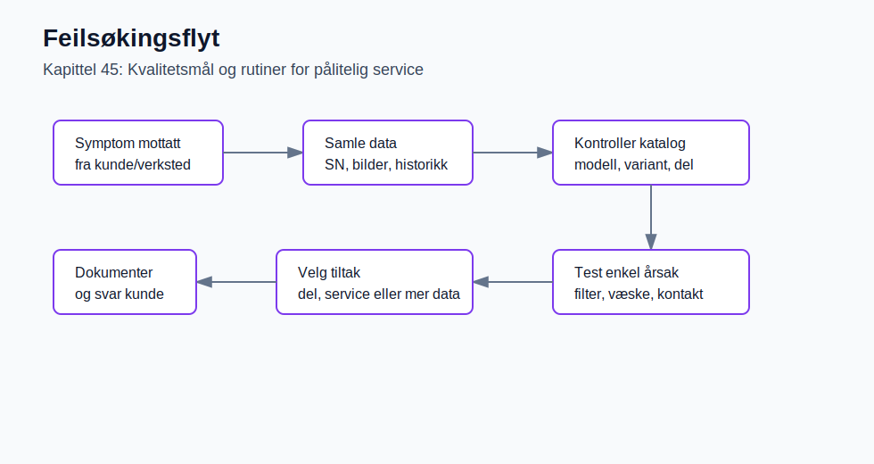

```mermaid
flowchart TD
    A[Symptom eller forespørsel mottatt] --> B[Samle serienummer, bilder og historikk]
    B --> C{Er motor og variant sikkert identifisert?}
    C -- Nei --> D[Be om mer dokumentasjon før del bekreftes]
    C -- Ja --> E[Kontroller delnummer og posisjon i katalog]
    E --> F{Stemmer symptom med foreslått del?}
    F -- Nei --> G[Foreslå feilsøking eller teknisk kontroll]
    F -- Ja --> H[Kontroller lager, pris og levering]
    H --> I[Send dokumentert kundesvar]
```

## Vedlikeholdsprosedyre
1. Avklar driftstimer, siste service og driftsmiljø.
2. Kontroller olje, filter, kjølevæske, sjøvannskrets, reimer, slanger og elektriske kontakter.
3. Sammenlign vedlikeholdsbehov med produsentens intervaller og faktisk bruk.
4. Anbefal servicekit når flere slitedeler bør skiftes samtidig.
5. Dokumenter hva som er anbefalt, hva kunden bestiller og eventuelle avvik fra normal prosedyre.

## Serienummeridentifikasjon
Serienummeridentifikasjon starter med å finne typeplate, motornummer eller annen unik identifikasjon. Be om bilde, ikke bare avskrift, fordi feil tegn, mellomrom og prefiks kan endre katalogoppslaget. Når serienummer ikke finnes, bygges identifikasjonen med modell, produksjonsår, bilder, tidligere fakturaer, servicehistorikk og delnummer fra monterte komponenter.

Minimumsdata bør være: fabrikat, modell, serienummer, eventuell product number/arrangement/CPL/motornummer, bilde av typeplate og bilde av motorens installasjon. Ved tvil skal saken stoppes for avklaring før del bekreftes.

## Reservedelsidentifikasjon
Reservedelsidentifikasjon skal bekrefte delnummer, posisjon, antall per motor, variant, side og eventuell erstatning. Dersom kunden oppgir et gammelt nummer, må det kontrolleres mot supersession. Dersom kunden bare sender bilde, skal bildet brukes som støtte, ikke som eneste grunnlag for bestilling.

Sjekk alltid om delnummeret gjelder enkeltkomponent, reparasjonssett, servicekit eller komplett enhet. Kontroller også om varen er høyre/venstre, gammel/ny type, standard/oversize eller knyttet til en bestemt produksjonsperiode.

## Bestillingsprosedyre
1. Opprett eller oppdater sak med kunde, fartøy, kontaktperson og tidsfrist.
2. Verifiser motoridentifikasjon og lagre bildedokumentasjon.
3. Finn korrekt delnummer i relevant katalog eller leverandørgrunnlag.
4. Kontroller supersession, antall, lagerstatus, pris, returvilkår og leveringstid.
5. Send ordrebekreftelse med delnummer, beskrivelse, antall, pris, levering og forbehold.
6. Følg opp leveransen til kunden har mottatt varen eller saken er lukket.

## Kvalitetspunkter før svar
- Har vi nok data til å gi et sikkert svar?
- Er delnummeret kontrollert mot riktig motorvariant?
- Er kundens tidsfrist realistisk med valgt fraktmåte?
- Er eventuelle forbehold skrevet tydelig?
- Kan en kollega forstå beslutningen ved å lese saken senere?

## Kapittelsammendrag
Hovedpoenget i kapittel 45 er at profesjonelt reservedelsarbeid krever struktur. Teknisk kunnskap, engelske fagtermer, praktisk feilsøking, dokumentasjon og kundedialog må henge sammen. Når medarbeideren jobber systematisk, reduseres feilbestillinger, kunden får bedre svar, og verkstedet kan planlegge arbeidet tryggere.

## Kryssreferanser
- For forrige tema, se kapittel 44: Hvordan bygge erfaring gjennom praktisk arbeid og feilsøking.
- For neste tema, se kapittel 46: Fremtidige utviklinger innen marine motorservice og reservedeler.
- For grunnleggende identifikasjon, se kapittel 12 og 17.
- For merkevise eksempler, se kapitlene 26-32.

## Fordypning for intern opplæring
Dette kapitlet skal brukes som arbeidsstandard, ikke bare som lesestoff. Når en ny medarbeider møter en sak om kvalitetsmål, skal vedkommende trene på å gå rolig fra fakta til vurdering og deretter til handling. I en marinemotorforhandler er konsekvensen av en feil ofte større enn verdien av selve delen. En feil impeller, feil sensor, feil filterinnsats eller feil pakningssett kan føre til tapt verkstedtid, utsatt avgang, irritert kunde og i verste fall ny driftsstans. Derfor skal hver sak behandles som en teknisk beslutning med sporbar dokumentasjon.

Profesjonelt nivå i dette kapitlet betyr at medarbeideren kan arbeide sikkert med kvalitetsmål. Før kunden får et bindende svar, skal opplysningene i saken kontrolleres mot motorens identitet, faktisk installasjon og relevant produsentterminologi. Det praktiske målet er ikke å finne et raskt nummer, men å kunne forklare hvorfor valgt del, kontrollpunkt eller kundesvar er riktig for akkurat denne motoren. Når informasjon mangler, skal medarbeideren beskrive hva som mangler, hvorfor det er nødvendig, og hvilket neste steg som bringer saken videre.

## Tekniske forklaringer
Teknisk forståelse i dette kapitlet skal bygges rundt feilrate, responstid, sporbarhet, reklamasjoner, kundesvar og forbedringsrutiner. Medarbeideren må skille mellom synlig symptom, sannsynlig systemfeil og bestillbar komponent. En del kan se riktig ut på bilde, men likevel være feil dersom posisjon, variant, rating, kjøleroppsett, elektrisk plugg, monteringsside eller servicehistorikk ikke stemmer. Derfor skal teknisk vurdering alltid kobles til både funksjon og dokumentasjon: hva gjør komponenten, hvilket system påvirker den, og hvilken produsentkilde bekrefter at den passer.

I praksis betyr dette at tekniske data skal kobles til motorens faktiske installasjon. Marine motorer står ofte trangt, er utsatt for salt, vibrasjon, fukt og ujevnt belastningsmønster, og de kan være bygget om gjennom mange år. En motor kan ha original kjøler, ettermontert eksosbend, alternativ dynamo, endret filterbrakett eller annen sjøvannspumpe enn standard. Slike forhold gjør at delidentifikasjon må bygge på både produsentdata og synlig dokumentasjon fra motoren.

Produsentterminologi er en del av den tekniske forståelsen. Bruk uttrykk som Serial Number, Engine Number, Part Number, Service Kit, Exploded View, Supersession når de er relevante. Ikke oversett dem på en måte som fjerner presisjon. Skriv for eksempel «Engine Serial Number (ESN)» første gang og deretter «ESN» i saken dersom produsenten bruker dette. Skriv «Arrangement Number» når CAT-data krever det, «Product Number» når Volvo Penta bruker det, «CPL» når Cummins-konfigurasjon må kontrolleres, og «Model Code» når Yanmar-identifikasjon bygger på modellkode. Dette gjør dialogen med internasjonale leverandører mer presis.

## Illustrasjonsforslag
- Oversiktsdiagram som viser hvor kvalitetsmål passer inn i total arbeidsflyt fra kundeforespørsel til levert del.
- Nærbilde av typeplate/motorskilt med markering av serienummer, motornummer, modell og eventuell variantkode.
- Sprengskisse med markert posisjon, delnummer, antall per motor og mulige alternative versjoner.
- Feilsøkingsflyt med beslutningspunkter: mangler data, stemmer symptom, kreves mer teknisk kontroll, kan ordre bekreftes.
- Sammenligningsbilde av gammel og ny del der forskjell i tilkobling, side, lengde eller sensorplugg er markert.

## Virkelige verkstedseksempler
Eksempel 1: Et verksted står med en demontert komponent på benken og kunden venter på avklaring før fartøyet kan settes tilbake i drift. Verkstedet sender et nærbilde av delen, men ingen motorplate. En uerfaren medarbeider kan bli fristet til å søke på nummeret som står på støpegodset. En profesjonell medarbeider svarer at støpenummer ikke nødvendigvis er bestillbart delnummer, ber om bilde av typeplate, oversiktsbilde av motoren og bilde av monteringsstedet, og forklarer at dette hindrer feilbestilling. Når informasjonen kommer, kontrolleres delnummer mot sprengskisse, posisjon og antall. Først da gis pris og leveringstid.

Eksempel 2: En kunde ringer sent på dagen og sier at motoren har høy temperatur etter service. Kunden ønsker ny termostat. Medarbeideren skal ikke automatisk konkludere med termostatfeil. Spørsmålene bør avklare om impeller er byttet, om sjøvannsfilteret er rent, om kjølevæskenivået er riktig, om alarmen kommer ved tomgang eller belastning, og om det finnes lekkasje rundt varmeveksler eller slanger. Dersom kunden likevel vil bestille termostat, dokumenteres at feilsøking er anbefalt, og delnummer kontrolleres mot serienummer før ordre.

Eksempel 3: En intern selger mottar en gammel faktura med et delnummer som ikke lenger finnes. Riktig prosess er å kontrollere supersession, se om ny del krever tilhørende pakning, boltsett eller adapter, og notere både gammelt og nytt nummer i saken. Kunden skal få vite at delen er erstattet, hva som leveres, og om det finnes monteringsforbehold.

## Reservedelsidentifisering i praksis
Reservedelsidentifisering skal følge en fast rekkefølge. Først kontrolleres motorens identitet. Deretter kontrolleres delens system: drivstoff, luft, kjøling, smøring, eksos, elektrisk eller mekanisk kraftoverføring. Så kontrolleres posisjon i sprengskisse eller parts list. Til slutt kontrolleres antall, variant, supersession og leveringsstatus. Denne rekkefølgen hindrer at medarbeideren hopper direkte fra kundens ord til et tilfeldig delnummer.

Når en del har synlig nummer, må nummeret tolkes riktig. Mange komponenter har produksjonsnummer, støpenummer, leverandørnummer eller revisjonskode som ikke er det samme som bestillbart part number. Et filter kan ha nummer fra filterprodusent, men motorprodusentens parts catalogue kan bruke et annet nummer. En pumpe kan ha nummer på lokk, hus og komplett enhet. Spør derfor alltid: gjelder nummeret komplett del, reparasjonssett, underkomponent eller produsentens råkomponent?

## Serienummer og motornummer
Serienummer og motornummer er grunnlaget for korrekt katalogoppslag. Be kunden sende bilde av typeplate eller dataplate. Dersom kunden skriver nummeret manuelt, skal nummeret likevel kontrolleres mot bilde når det er mulig. Noter hele nummeret, inkludert prefiks, suffiks, bindestrek, mellomrom og eventuelle bokstaver. På enkelte produsenter kan små forskjeller peke til forskjellig produksjonsperiode, rating eller konfigurasjon.

Bruk motornummer sammen med modell, variant og applikasjon. En motor som driver generator kan ha andre deler enn en fremdriftsmotor. En motor i yrkesbåt kan ha annen rating enn samme motor i fritidsbåt. En eldre motor kan være bygget om med ny dynamo, annen sjøvannspumpe eller uoriginal filterbrakett. Dersom typeplate mangler, bygg identifikasjonen gjennom flere kilder: servicebok, tidligere faktura, bilder av motorens sider, nummer på pumpe, filter, turbo og gear, samt opplysninger om fartøy og produksjonsår.

## Feilsøking steg for steg
1. Definer symptomet med kundens egne ord og skriv det i saken. Skill mellom «kunden ønsker del» og «kunden beskriver feil».
2. Avklar når feilen oppstår: start, tomgang, belastning, marsjfart, varm motor, kald motor eller etter nylig service.
3. Kontroller grunnleggende forhold: væskenivå, filter, luft i drivstoff, sjøvannsstrøm, reimer, elektriske kontakter, sikringer og synlige lekkasjer.
4. Knytt symptomet til system: lav effekt peker ofte mot luft/drivstoff/eksos, høy temperatur mot kjøling, lavt oljetrykk mot smøring/sensor, startproblem mot batteri/starter/gløding/drivstoff.
5. Be om bilder eller måledata dersom symptomet ikke kan kobles sikkert til en del. Dette kan være bilde av alarmdisplay, trykkmåling, temperaturmåling eller bilde av montert komponent.
6. Kontroller relevant delnummer mot serienummer og variant. Dersom flere alternativer finnes, forklar kunden hva som skiller dem.
7. Dokumenter anbefalt tiltak, usikkerhet og eventuelle forbehold før ordre bekreftes.

## Vedlikehold
Vedlikehold skal vurderes mot driftstimer, produsentens maintenance schedule og faktisk driftsmiljø. Marine motorer som går korte turer, mye tomgang eller i salt miljø kan trenge hyppigere kontroll enn standard intervall antyder. Nye medarbeidere skal lære å spørre om siste service, hvilke filter som ble byttet, hvilken olje som ble brukt, om impeller er kontrollert, og om kjølevæske eller anoder er byttet etter plan.

En god vedlikeholdsanbefaling er konkret. I stedet for å skrive «ta service», bør medarbeideren foreslå relevante deler: olje- og drivstoffilter, luftfilter, impeller, reim, pakninger, anoder, kjølevæske og eventuelt servicekit. Dersom kunden har ukjent servicehistorikk, bør komplett servicekit vurderes. Dersom kunden har hatt overoppheting, bør sjøvannskrets og varmeveksler kontrolleres før bare én komponent byttes.

## Vanlige feil
- Serienummer leses feil fordi et tegn forveksles, for eksempel O/0 eller I/1.
- Kunden oppgir modellnavn, men ikke variant, rating eller applikasjon.
- Del velges ut fra bilde alene uten kontroll mot sprengskisse eller produsentkatalog.
- Supersession aksepteres uten å kontrollere om ny del krever tilbehør, pakning eller ombygging.
- Hastepress gjør at leveringsløfte gis før lagerstatus og fraktmulighet er bekreftet.
- Saksnotat mangler grunnlaget for beslutningen, slik at kollega ikke kan etterprøve valget.

## Kontrollspørsmål
- Hva er den viktigste tekniske risikoen i en sak som gjelder kvalitetsmål?
- Hvilke opplysninger må dokumenteres før bindende delnummer bekreftes?
- Hvordan forklarer du kunden hvorfor bilde av typeplate er nødvendig?
- Når bør du stoppe en ordre og be om mer dokumentasjon?
- Hvilke engelske produsentuttrykk bør du kunne bruke i denne typen sak?
- Hvordan dokumenterer du at et delnummer er erstattet av et nytt nummer?

## Praktisk sjekkliste for medarbeider
- Les saken som om en kollega skal overta den i morgen.
- Kontroller at motoridentifikasjon er dokumentert med bilde eller sikker kilde.
- Sjekk at delnummeret er knyttet til riktig posisjon i katalogen.
- Skriv tydelig om kunden har bedt om enkeltkomponent, servicekit eller komplett enhet.
- Noter om varen er spesialbestilling, utgått, erstattet eller ikke returbar.
- Send kundesvar med neste steg, ikke bare et løst delnummer.

## Kapittelspesifikk systemforståelse
For dette kapitlet er kjernen å forstå kvalitetsmål og rutiner. Medarbeideren skal kunne forklare dette med praktiske ord til både kunde og kollega. Det betyr at teknisk teori må kobles til konkrete handlinger: hvilke data skal innhentes, hvilke komponenter kan være berørt, hvilken produsentterminologi skal brukes, og hva må dokumenteres før saken kan gå videre. Kvalitet må måles på både teknisk treffsikkerhet og kundens opplevelse av kontroll.

Når systemet vurderes, skal medarbeideren først plassere problemet i riktig teknisk sammenheng. Dersom kunden beskriver en alarm, må man finne ut om alarmen kommer fra reelt mekanisk avvik, elektrisk sensorfeil, feil etter service eller feil tolkning av instrumentet. Dersom kunden beskriver en del, må man avklare om kunden mener komplett enhet, servicekit, reparasjonssett eller enkeltkomponent. Dersom kunden beskriver motoren med vanlig navn, må man kontrollere om produsenten bruker mer presise begreper i katalogen.

## Komponentoversikt og arbeidsgrense
Relevante komponenter og opplysninger i dette kapitlet omfatter: first time right, response time, return rate, documentation quality og customer satisfaction. Listen er ikke ment som en erstatning for produsentens parts catalogue, men som en praktisk påminnelse om hva nye medarbeidere skal tenke på før de søker del. I interne saker skal komponentnavn skrives så presist som mulig. Bruk for eksempel «sjøvannspumpe / raw water pump» i stedet for bare «pumpe» når funksjonen er kjent, og «varmeveksler / heat exchanger» i stedet for bare «kjøler» når det er den komponenten saken gjelder.

Arbeidsgrensen for en reservedelsmedarbeider er også viktig. Medarbeideren skal ikke overta mekanikerens ansvar for demontering, måling eller diagnose på motoren, men skal kunne stille riktige spørsmål og foreslå riktig dokumentasjon. Når en sak går fra enkel delidentifikasjon til teknisk diagnose, skal dette markeres i saken. Da kan verksted, teknisk ansvarlig eller leverandør involveres med et klart spørsmål og et ryddig faktagrunnlag.

## Praktisk beslutningsregel
Bruk denne regelen i alle saker knyttet til kapitlet: Hvis motoridentifikasjon, komponentposisjon eller symptom ikke er sikkert nok dokumentert, skal medarbeideren ikke gi bindende delbekreftelse. Kunden kan få et foreløpig svar, men svaret må inneholde hva som mangler, hvorfor det mangler, og hva som skjer når informasjonen er mottatt. Dette er ikke treg service; det er profesjonell risikokontroll.

## Målrettet fordypning kapittel 41-50
### Kvalitetsmål og rutiner for pålitelig service
Kvalitet i reservedelsarbeid kan måles. Relevante mål er first time right, responstid, andel saker med komplett motoridentifikasjon, returandel, antall feilbestillinger, restordreoppfølging og kundetilfredshet. Tallene skal ikke brukes til skyld, men til å finne hvor prosessen må styrkes.

En god kvalitetsrutine har sjekkpunkt før tilbud, før ordre, ved varemottak og før leveranse. For tekniske saker bør peer check brukes når del er dyr, spesialbestilt, elektronisk, variantkritisk eller knyttet til driftsstans. Kvalitet betyr at kunden får riktig del med riktig forventning, ikke bare raskest mulig svar.

### Praktisk anvendelse i opplæring
Bruk kapitlet til en avsluttende case der deltakeren må vise selvstendig vurdering. Deltakeren skal identifisere teknisk risiko, skrive kundesvar, velge dokumentasjon, forklare eventuelle forbehold og angi når saken skal eskaleres. Dette er særlig viktig i sluttkapitlene, fordi de binder sammen teknikk, kvalitet, læring og praktisk drift.

## Realistisk opplæring i praksis
### Verkstedhistorie
En typisk sak i dette temaet starter med feilrate øker i høysesong. Verkstedet trenger et raskt svar, men den erfarne medarbeideren stopper opp og spør først: hva vet vi sikkert, hva antar vi, og hva kan gi følgeskade hvis vi tar feil? I praksis betyr det at måling og forbedring må kobles til bilde, serienummer, komponentposisjon og kundens symptom før saken lukkes. Historien skal brukes i opplæring som en øvelse i å skrive et kort saksnotat: observasjon, vurdering, neste handling og forbehold.

### Kundehistorie
Kunden beskriver ofte problemet med driftsspråk: «motoren går tungt», «alarm kommer etter ti minutter», «jeg trenger den samme delen som sist» eller «båten skal ut i morgen». En profesjonell respons er rolig og konkret: bekreft behovet, forklar hvorfor identifikasjon trengs, be om riktig dokumentasjon og gi et realistisk tidspunkt for neste svar. Ikke korriger kunden unødvendig; oversett kundens språk til teknisk språk i saken.

### Typiske feil nye ansatte gjør
- søker på første synlige nummer uten å avklare om det er støpenummer, leverandørnummer eller bestillbart part number.
- lover levering før lagerstatus, frakt og returvilkår er kontrollert.
- antar at tidligere faktura alltid gjelder samme motorvariant.
- blander symptom og årsak, spesielt ved varme, lav effekt, startproblem og alarm.
- skriver for korte notater slik at kollega ikke kan forstå hvorfor valget ble tatt.

### Tips fra erfarne mekanikere og reservedelsselgere
- Se alltid etter systemet rundt delen: slanger, braketter, sensorer, reimer, kjølere og tilkoblinger forteller ofte mer enn delen alene.
- Still ett presist spørsmål om gangen når kunden er stresset; mange dårlige svar kommer av for lange spørsmålslister.
- Sammenlign gammel og ny del mot funksjon, ikke bare form. Riktig del skal passe, men også løse riktig problem.
- En erfaren reservedelsselger tenker i risiko: Hva er billigst å avklare nå, og hva blir dyrt hvis vi hopper over det?

### Vanlige kundespørsmål
| Spørsmål fra kunde | Profesjonelt svar |
|---|---|
| «Kan du bare sende samme del som sist?» | «Ja, hvis vi først bekrefter at det gjelder samme motor, samme posisjon og ingen supersession siden sist.» |
| «Holder det med bilde?» | «Bilde hjelper, men vi trenger også motoridentitet for å sikre variant og delnummer.» |
| «Hvorfor tar dette tid?» | «Fordi feil del kan gi ny driftsstans. Vi kontrollerer grunnlaget før vi lover levering.» |

### Beslutningstre for saken
| Trinn | Spørsmål | Handling |
|---|---|---|
| 1 | Er motoridentitet dokumentert med bilde eller sikker historikk? | Hvis nei: be om typeplate/dataplate eller alternativ dokumentasjon. |
| 2 | Er komponentens funksjon og posisjon kjent? | Hvis nei: be om oversiktsbilde og bilde av monteringssted. |
| 3 | Stemmer kundens symptom med delen som ønskes? | Hvis nei: anbefal feilsøking før del bestilles. |
| 4 | Finnes det supersession, kit eller variantvalg? | Kontroller produsentkilde og skriv forbehold i saken. |
| 5 | Kan pris, levering og returvilkår bekreftes? | Send dokumentert svar med neste steg og tydelig gyldighet. |

### Rask oppslagstabell
| Situasjon | Kontroller først | Vanlig fallgruve |
|---|---|---|
| Hasteordre | sikker motor-ID, lager, fraktfrist | levering loves før teknisk kontroll |
| Del fra bilde | posisjon, skala, tilkoblinger, nummer | bilde brukes som eneste beslutningsgrunnlag |
| Gammelt delnummer | supersession og kitinnhold | ny del krever ekstra pakning eller adapter |
| Uklart symptom | driftssituasjon, alarm, siste service | symptom blir tolket som sikker komponentfeil |

### Praktisk sjekkliste og inspeksjonsrutine
- Start med motoridentitet: fabrikat, modell, serienummer, variant, applikasjon og bilde av skilt.
- Kontroller området rundt komponenten: lekkasje, korrosjon, knekte fester, slitasje, varmemerker og uoriginale endringer.
- Spør om siste vedlikehold: olje, filter, impeller, reimer, kjølevæske, anoder og drivstoffilter.
- Noter driftstype: fritidsbruk, yrkesbruk, generator, fremdrift, tomgangsdrift eller langvarig høy belastning.
- Avklar om saken gjelder akutt drift, planlagt service, reklamasjon eller lagerpåfyll.

### Generelle vedlikeholdsintervaller som opplæringspunkt
| Kontrollpunkt | Typisk vurdering i opplæring | Må verifiseres |
|---|---|---|
| Olje og oljefilter | ofte basert på timer og kalender | produsentens maintenance schedule |
| Drivstoffilter/vannutskiller | hyppigere ved dårlig drivstoff eller sesongstart | motor- og filterspesifikasjon |
| Impeller og sjøvannskrets | kontrolleres særlig før sesong og etter varmgang | produsentens intervall og installasjon |
| Reimer, slanger og klemmer | visuell kontroll ved service og feilsøking | dimensjon, stramming og delnummer |

### Produsentverifikasjon
Alle konkrete delnumre, momentverdier, serviceintervaller, garantikrav, programvaredata og produsentspesifikke grenser skal kontrolleres mot offisiell produsentdokumentasjon før de brukes i tilbud, ordre eller verkstedinstruks. Marker tydelig i saken når svaret bygger på antakelse, eldre historikk, bilde uten motor-ID eller generell erfaring. Intervaller i tabellen er generelle opplæringspunkter. Faktiske intervaller styres av produsent, motorvariant, driftstimer, kalenderkrav, belastning og miljø.

## Produsentverifikasjon og faglig forbehold
Denne manualen skal brukes som intern opplæring og arbeidsmetode. Produsentspesifikke delnumre, intervaller, momentverdier, garantikrav og tekniske grenseverdier skal verifiseres mot gjeldende produsentdokumentasjon før de brukes i kundeordre eller verkstedinstruks. Marker saken internt dersom opplysningen bygger på antakelse, eldre historikk eller bilde uten bekreftet motoridentitet.

## Quiz med fasit
1. Hvilke tekniske data bør alltid samles før en del bekreftes?
2. Hvorfor er engelsk terminologi viktig i marine reservedeler?
3. Hva bør gjøres dersom kunden bare sender et bilde av delen?
4. Hvilke punkter bør kontrolleres før ordrebekreftelse sendes?
5. Hvorfor skal feilsøking dokumenteres, selv når kunden allerede ber om en bestemt del?

### Svar
1. Fabrikat, modell, serienummer, variantdata, bilde av typeplate, delnummer, posisjon og kundens symptombeskrivelse.
2. Fordi kataloger, portaler, servicemanualer og leverandørdialog ofte bruker engelske begreper som må forstås presist.
3. Be om serienummer, oversiktsbilde av motoren og eventuelle nummer på delen; bildet brukes som støtte, ikke eneste grunnlag.
4. Delnummer, antall, variant, pris, lagerstatus, leveringstid, frakt, returvilkår og eventuelle forbehold.
5. Fordi symptomet kan ha flere årsaker, og dokumentasjon viser hvorfor anbefalingen ble gitt.

---

# Kapittel 46: Fremtidige utviklinger innen marine motorservice og reservedeler

## Kapittelrolle
Dette kapitlet gir en grundig praktisk innføring i fremtid. Temaet er viktig fordi reservedelsarbeid i marine miljøer kombinerer teknisk forståelse, presis kundedialog, dokumentert saksbehandling og realistisk leveranseoppfølging. Målet er at en ny medarbeider skal kunne bruke kunnskapen direkte i arbeid med verksted, kunde, lager og leverandør.

## Læringsmål
Etter kapitlet skal deltakeren kunne:
- forklare hovedbegrepene innen fremtid
- bruke serienummer, modellinformasjon og delnummer i praktisk reservedelsarbeid
- kommunisere trygt med kunde, verksted, lager og leverandør
- dokumentere beslutninger slik at andre kan etterprøve saken
- kjenne igjen vanlige feil og velge riktig neste handling

## English technical terminology
- **Serial Number:** engelsk fagterm som ofte brukes i kataloger, servicelitteratur, leverandørportaler og internasjonal kundedialog.
- **Part Number:** engelsk fagterm som ofte brukes i kataloger, servicelitteratur, leverandørportaler og internasjonal kundedialog.
- **Engine Model:** engelsk fagterm som ofte brukes i kataloger, servicelitteratur, leverandørportaler og internasjonal kundedialog.
- **Variant:** engelsk fagterm som ofte brukes i kataloger, servicelitteratur, leverandørportaler og internasjonal kundedialog.
- **Service Kit:** engelsk fagterm som ofte brukes i kataloger, servicelitteratur, leverandørportaler og internasjonal kundedialog.
- **Troubleshooting:** engelsk fagterm som ofte brukes i kataloger, servicelitteratur, leverandørportaler og internasjonal kundedialog.
- **Maintenance:** engelsk fagterm som ofte brukes i kataloger, servicelitteratur, leverandørportaler og internasjonal kundedialog.
- **Ordering Procedure:** engelsk fagterm som ofte brukes i kataloger, servicelitteratur, leverandørportaler og internasjonal kundedialog.
- **Supersession:** engelsk fagterm som ofte brukes i kataloger, servicelitteratur, leverandørportaler og internasjonal kundedialog.
- **Technical Support:** engelsk fagterm som ofte brukes i kataloger, servicelitteratur, leverandørportaler og internasjonal kundedialog.

## Hoveddiagram

## Tekniske systemillustrasjoner

## Grundig forklaring
Hvordan digitalisering, utslippskrav og sensordata endrer arbeidsfeltet må forstås både teknisk og praktisk. I marine reservedeler er det sjelden nok å vite hva kunden kaller delen. Medarbeideren må forstå hvilken funksjon delen har, hvor den sitter, hvilken motorvariant den tilhører, og hva som skjer dersom feil del bestilles. Derfor skal tekniske data, kundens beskrivelse og dokumentert katalogoppslag alltid vurderes sammen.

En god sak har fire kjennetegn: den har tydelig identifikasjon, tydelig problem- eller delbeskrivelse, tydelig beslutningsgrunnlag og tydelig oppfølging. Dersom ett av disse punktene mangler, skal saken markeres som usikker før kunden får et bindende svar.

## Praktisk verkstedeksempel
Et verksted står med demontert komponent og trenger rask avklaring. Medarbeideren registrerer kunde, fartøy, motorinformasjon og tidsfrist, ber om bilder av typeplate og komponent, sjekker katalog og lager, og sender et kort skriftlig svar med valgt del, grunnlag for valget og neste oppdateringstidspunkt.

## Kundesupporteksempel
Kunde: 'Motoren går dårlig, kan dere sende riktig del?' Profesjonelt svar: 'Vi kan hjelpe, men først må vi skille mellom symptom og delbehov. Send serienummer, bilde av motorplate, bilde av området feilen gjelder og en kort beskrivelse av når feilen oppstår. Da kan vi foreslå riktig del eller riktig neste feilsøkingstrinn.'

## Vanlige feil og årsaker
- feil eller ufullstendig serienummer.
- delnummer som er erstattet uten at saken dokumenteres.
- symptom som tolkes som delbehov uten feilsøking.
- kunde har bilde av lignende del, men ikke korrekt motorvariant.
- manglende avklaring av antall, side, posisjon eller leveringstid.

## Feilsøkingsflyt
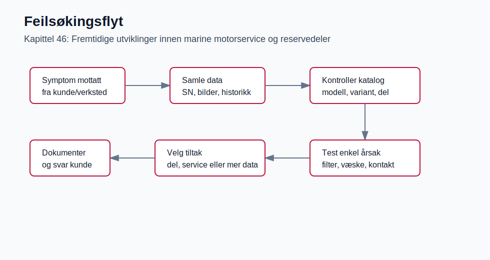

```mermaid
flowchart TD
    A[Symptom eller forespørsel mottatt] --> B[Samle serienummer, bilder og historikk]
    B --> C{Er motor og variant sikkert identifisert?}
    C -- Nei --> D[Be om mer dokumentasjon før del bekreftes]
    C -- Ja --> E[Kontroller delnummer og posisjon i katalog]
    E --> F{Stemmer symptom med foreslått del?}
    F -- Nei --> G[Foreslå feilsøking eller teknisk kontroll]
    F -- Ja --> H[Kontroller lager, pris og levering]
    H --> I[Send dokumentert kundesvar]
```

## Vedlikeholdsprosedyre
1. Avklar driftstimer, siste service og driftsmiljø.
2. Kontroller olje, filter, kjølevæske, sjøvannskrets, reimer, slanger og elektriske kontakter.
3. Sammenlign vedlikeholdsbehov med produsentens intervaller og faktisk bruk.
4. Anbefal servicekit når flere slitedeler bør skiftes samtidig.
5. Dokumenter hva som er anbefalt, hva kunden bestiller og eventuelle avvik fra normal prosedyre.

## Serienummeridentifikasjon
Serienummeridentifikasjon starter med å finne typeplate, motornummer eller annen unik identifikasjon. Be om bilde, ikke bare avskrift, fordi feil tegn, mellomrom og prefiks kan endre katalogoppslaget. Når serienummer ikke finnes, bygges identifikasjonen med modell, produksjonsår, bilder, tidligere fakturaer, servicehistorikk og delnummer fra monterte komponenter.

Minimumsdata bør være: fabrikat, modell, serienummer, eventuell product number/arrangement/CPL/motornummer, bilde av typeplate og bilde av motorens installasjon. Ved tvil skal saken stoppes for avklaring før del bekreftes.

## Reservedelsidentifikasjon
Reservedelsidentifikasjon skal bekrefte delnummer, posisjon, antall per motor, variant, side og eventuell erstatning. Dersom kunden oppgir et gammelt nummer, må det kontrolleres mot supersession. Dersom kunden bare sender bilde, skal bildet brukes som støtte, ikke som eneste grunnlag for bestilling.

Sjekk alltid om delnummeret gjelder enkeltkomponent, reparasjonssett, servicekit eller komplett enhet. Kontroller også om varen er høyre/venstre, gammel/ny type, standard/oversize eller knyttet til en bestemt produksjonsperiode.

## Bestillingsprosedyre
1. Opprett eller oppdater sak med kunde, fartøy, kontaktperson og tidsfrist.
2. Verifiser motoridentifikasjon og lagre bildedokumentasjon.
3. Finn korrekt delnummer i relevant katalog eller leverandørgrunnlag.
4. Kontroller supersession, antall, lagerstatus, pris, returvilkår og leveringstid.
5. Send ordrebekreftelse med delnummer, beskrivelse, antall, pris, levering og forbehold.
6. Følg opp leveransen til kunden har mottatt varen eller saken er lukket.

## Kvalitetspunkter før svar
- Har vi nok data til å gi et sikkert svar?
- Er delnummeret kontrollert mot riktig motorvariant?
- Er kundens tidsfrist realistisk med valgt fraktmåte?
- Er eventuelle forbehold skrevet tydelig?
- Kan en kollega forstå beslutningen ved å lese saken senere?

## Kapittelsammendrag
Hovedpoenget i kapittel 46 er at profesjonelt reservedelsarbeid krever struktur. Teknisk kunnskap, engelske fagtermer, praktisk feilsøking, dokumentasjon og kundedialog må henge sammen. Når medarbeideren jobber systematisk, reduseres feilbestillinger, kunden får bedre svar, og verkstedet kan planlegge arbeidet tryggere.

## Kryssreferanser
- For forrige tema, se kapittel 45: Kvalitetsmål og rutiner for pålitelig service.
- For neste tema, se kapittel 47: Oppsummering og neste steg for videre læring.
- For grunnleggende identifikasjon, se kapittel 12 og 17.
- For merkevise eksempler, se kapitlene 26-32.

## Fordypning for intern opplæring
Dette kapitlet skal brukes som arbeidsstandard, ikke bare som lesestoff. Når en ny medarbeider møter en sak om fremtidig utvikling, skal vedkommende trene på å gå rolig fra fakta til vurdering og deretter til handling. I en marinemotorforhandler er konsekvensen av en feil ofte større enn verdien av selve delen. En feil impeller, feil sensor, feil filterinnsats eller feil pakningssett kan føre til tapt verkstedtid, utsatt avgang, irritert kunde og i verste fall ny driftsstans. Derfor skal hver sak behandles som en teknisk beslutning med sporbar dokumentasjon.

Profesjonelt nivå i dette kapitlet betyr at medarbeideren kan arbeide sikkert med fremtidig motorservice. Før kunden får et bindende svar, skal opplysningene i saken kontrolleres mot motorens identitet, faktisk installasjon og relevant produsentterminologi. Det praktiske målet er ikke å finne et raskt nummer, men å kunne forklare hvorfor valgt del, kontrollpunkt eller kundesvar er riktig for akkurat denne motoren. Når informasjon mangler, skal medarbeideren beskrive hva som mangler, hvorfor det er nødvendig, og hvilket neste steg som bringer saken videre.

## Tekniske forklaringer
Teknisk forståelse i dette kapitlet skal bygges rundt digital dokumentasjon, elektronikk, hybridisering, utslippskrav og datasporbarhet. Medarbeideren må skille mellom synlig symptom, sannsynlig systemfeil og bestillbar komponent. En del kan se riktig ut på bilde, men likevel være feil dersom posisjon, variant, rating, kjøleroppsett, elektrisk plugg, monteringsside eller servicehistorikk ikke stemmer. Derfor skal teknisk vurdering alltid kobles til både funksjon og dokumentasjon: hva gjør komponenten, hvilket system påvirker den, og hvilken produsentkilde bekrefter at den passer.

I praksis betyr dette at tekniske data skal kobles til motorens faktiske installasjon. Marine motorer står ofte trangt, er utsatt for salt, vibrasjon, fukt og ujevnt belastningsmønster, og de kan være bygget om gjennom mange år. En motor kan ha original kjøler, ettermontert eksosbend, alternativ dynamo, endret filterbrakett eller annen sjøvannspumpe enn standard. Slike forhold gjør at delidentifikasjon må bygge på både produsentdata og synlig dokumentasjon fra motoren.

Produsentterminologi er en del av den tekniske forståelsen. Bruk uttrykk som Serial Number, Engine Number, Part Number, Service Kit, Exploded View, Supersession når de er relevante. Ikke oversett dem på en måte som fjerner presisjon. Skriv for eksempel «Engine Serial Number (ESN)» første gang og deretter «ESN» i saken dersom produsenten bruker dette. Skriv «Arrangement Number» når CAT-data krever det, «Product Number» når Volvo Penta bruker det, «CPL» når Cummins-konfigurasjon må kontrolleres, og «Model Code» når Yanmar-identifikasjon bygger på modellkode. Dette gjør dialogen med internasjonale leverandører mer presis.

## Illustrasjonsforslag
- Oversiktsdiagram som viser hvor fremtidig utvikling passer inn i total arbeidsflyt fra kundeforespørsel til levert del.
- Nærbilde av typeplate/motorskilt med markering av serienummer, motornummer, modell og eventuell variantkode.
- Sprengskisse med markert posisjon, delnummer, antall per motor og mulige alternative versjoner.
- Feilsøkingsflyt med beslutningspunkter: mangler data, stemmer symptom, kreves mer teknisk kontroll, kan ordre bekreftes.
- Sammenligningsbilde av gammel og ny del der forskjell i tilkobling, side, lengde eller sensorplugg er markert.

## Virkelige verkstedseksempler
Eksempel 1: Et verksted står med en demontert komponent på benken og kunden venter på avklaring før fartøyet kan settes tilbake i drift. Verkstedet sender et nærbilde av delen, men ingen motorplate. En uerfaren medarbeider kan bli fristet til å søke på nummeret som står på støpegodset. En profesjonell medarbeider svarer at støpenummer ikke nødvendigvis er bestillbart delnummer, ber om bilde av typeplate, oversiktsbilde av motoren og bilde av monteringsstedet, og forklarer at dette hindrer feilbestilling. Når informasjonen kommer, kontrolleres delnummer mot sprengskisse, posisjon og antall. Først da gis pris og leveringstid.

Eksempel 2: En kunde ringer sent på dagen og sier at motoren har høy temperatur etter service. Kunden ønsker ny termostat. Medarbeideren skal ikke automatisk konkludere med termostatfeil. Spørsmålene bør avklare om impeller er byttet, om sjøvannsfilteret er rent, om kjølevæskenivået er riktig, om alarmen kommer ved tomgang eller belastning, og om det finnes lekkasje rundt varmeveksler eller slanger. Dersom kunden likevel vil bestille termostat, dokumenteres at feilsøking er anbefalt, og delnummer kontrolleres mot serienummer før ordre.

Eksempel 3: En intern selger mottar en gammel faktura med et delnummer som ikke lenger finnes. Riktig prosess er å kontrollere supersession, se om ny del krever tilhørende pakning, boltsett eller adapter, og notere både gammelt og nytt nummer i saken. Kunden skal få vite at delen er erstattet, hva som leveres, og om det finnes monteringsforbehold.

## Reservedelsidentifisering i praksis
Reservedelsidentifisering skal følge en fast rekkefølge. Først kontrolleres motorens identitet. Deretter kontrolleres delens system: drivstoff, luft, kjøling, smøring, eksos, elektrisk eller mekanisk kraftoverføring. Så kontrolleres posisjon i sprengskisse eller parts list. Til slutt kontrolleres antall, variant, supersession og leveringsstatus. Denne rekkefølgen hindrer at medarbeideren hopper direkte fra kundens ord til et tilfeldig delnummer.

Når en del har synlig nummer, må nummeret tolkes riktig. Mange komponenter har produksjonsnummer, støpenummer, leverandørnummer eller revisjonskode som ikke er det samme som bestillbart part number. Et filter kan ha nummer fra filterprodusent, men motorprodusentens parts catalogue kan bruke et annet nummer. En pumpe kan ha nummer på lokk, hus og komplett enhet. Spør derfor alltid: gjelder nummeret komplett del, reparasjonssett, underkomponent eller produsentens råkomponent?

## Serienummer og motornummer
Serienummer og motornummer er grunnlaget for korrekt katalogoppslag. Be kunden sende bilde av typeplate eller dataplate. Dersom kunden skriver nummeret manuelt, skal nummeret likevel kontrolleres mot bilde når det er mulig. Noter hele nummeret, inkludert prefiks, suffiks, bindestrek, mellomrom og eventuelle bokstaver. På enkelte produsenter kan små forskjeller peke til forskjellig produksjonsperiode, rating eller konfigurasjon.

Bruk motornummer sammen med modell, variant og applikasjon. En motor som driver generator kan ha andre deler enn en fremdriftsmotor. En motor i yrkesbåt kan ha annen rating enn samme motor i fritidsbåt. En eldre motor kan være bygget om med ny dynamo, annen sjøvannspumpe eller uoriginal filterbrakett. Dersom typeplate mangler, bygg identifikasjonen gjennom flere kilder: servicebok, tidligere faktura, bilder av motorens sider, nummer på pumpe, filter, turbo og gear, samt opplysninger om fartøy og produksjonsår.

## Feilsøking steg for steg
1. Definer symptomet med kundens egne ord og skriv det i saken. Skill mellom «kunden ønsker del» og «kunden beskriver feil».
2. Avklar når feilen oppstår: start, tomgang, belastning, marsjfart, varm motor, kald motor eller etter nylig service.
3. Kontroller grunnleggende forhold: væskenivå, filter, luft i drivstoff, sjøvannsstrøm, reimer, elektriske kontakter, sikringer og synlige lekkasjer.
4. Knytt symptomet til system: lav effekt peker ofte mot luft/drivstoff/eksos, høy temperatur mot kjøling, lavt oljetrykk mot smøring/sensor, startproblem mot batteri/starter/gløding/drivstoff.
5. Be om bilder eller måledata dersom symptomet ikke kan kobles sikkert til en del. Dette kan være bilde av alarmdisplay, trykkmåling, temperaturmåling eller bilde av montert komponent.
6. Kontroller relevant delnummer mot serienummer og variant. Dersom flere alternativer finnes, forklar kunden hva som skiller dem.
7. Dokumenter anbefalt tiltak, usikkerhet og eventuelle forbehold før ordre bekreftes.

## Vedlikehold
Vedlikehold skal vurderes mot driftstimer, produsentens maintenance schedule og faktisk driftsmiljø. Marine motorer som går korte turer, mye tomgang eller i salt miljø kan trenge hyppigere kontroll enn standard intervall antyder. Nye medarbeidere skal lære å spørre om siste service, hvilke filter som ble byttet, hvilken olje som ble brukt, om impeller er kontrollert, og om kjølevæske eller anoder er byttet etter plan.

En god vedlikeholdsanbefaling er konkret. I stedet for å skrive «ta service», bør medarbeideren foreslå relevante deler: olje- og drivstoffilter, luftfilter, impeller, reim, pakninger, anoder, kjølevæske og eventuelt servicekit. Dersom kunden har ukjent servicehistorikk, bør komplett servicekit vurderes. Dersom kunden har hatt overoppheting, bør sjøvannskrets og varmeveksler kontrolleres før bare én komponent byttes.

## Vanlige feil
- Serienummer leses feil fordi et tegn forveksles, for eksempel O/0 eller I/1.
- Kunden oppgir modellnavn, men ikke variant, rating eller applikasjon.
- Del velges ut fra bilde alene uten kontroll mot sprengskisse eller produsentkatalog.
- Supersession aksepteres uten å kontrollere om ny del krever tilbehør, pakning eller ombygging.
- Hastepress gjør at leveringsløfte gis før lagerstatus og fraktmulighet er bekreftet.
- Saksnotat mangler grunnlaget for beslutningen, slik at kollega ikke kan etterprøve valget.

## Kontrollspørsmål
- Hva er den viktigste tekniske risikoen i en sak som gjelder fremtidig utvikling?
- Hvilke opplysninger må dokumenteres før bindende delnummer bekreftes?
- Hvordan forklarer du kunden hvorfor bilde av typeplate er nødvendig?
- Når bør du stoppe en ordre og be om mer dokumentasjon?
- Hvilke engelske produsentuttrykk bør du kunne bruke i denne typen sak?
- Hvordan dokumenterer du at et delnummer er erstattet av et nytt nummer?

## Praktisk sjekkliste for medarbeider
- Les saken som om en kollega skal overta den i morgen.
- Kontroller at motoridentifikasjon er dokumentert med bilde eller sikker kilde.
- Sjekk at delnummeret er knyttet til riktig posisjon i katalogen.
- Skriv tydelig om kunden har bedt om enkeltkomponent, servicekit eller komplett enhet.
- Noter om varen er spesialbestilling, utgått, erstattet eller ikke returbar.
- Send kundesvar med neste steg, ikke bare et løst delnummer.

## Kapittelspesifikk systemforståelse
For dette kapitlet er kjernen å forstå fremtidig utvikling i marine service. Medarbeideren skal kunne forklare dette med praktiske ord til både kunde og kollega. Det betyr at teknisk teori må kobles til konkrete handlinger: hvilke data skal innhentes, hvilke komponenter kan være berørt, hvilken produsentterminologi skal brukes, og hva må dokumenteres før saken kan gå videre. Digitalisering øker datamengden, men gjør grunnleggende identifikasjon enda viktigere.

Når systemet vurderes, skal medarbeideren først plassere problemet i riktig teknisk sammenheng. Dersom kunden beskriver en alarm, må man finne ut om alarmen kommer fra reelt mekanisk avvik, elektrisk sensorfeil, feil etter service eller feil tolkning av instrumentet. Dersom kunden beskriver en del, må man avklare om kunden mener komplett enhet, servicekit, reparasjonssett eller enkeltkomponent. Dersom kunden beskriver motoren med vanlig navn, må man kontrollere om produsenten bruker mer presise begreper i katalogen.

## Komponentoversikt og arbeidsgrense
Relevante komponenter og opplysninger i dette kapitlet omfatter: digital parts catalogue, connected engine, emissions, hybrid systems, sensors og predictive maintenance. Listen er ikke ment som en erstatning for produsentens parts catalogue, men som en praktisk påminnelse om hva nye medarbeidere skal tenke på før de søker del. I interne saker skal komponentnavn skrives så presist som mulig. Bruk for eksempel «sjøvannspumpe / raw water pump» i stedet for bare «pumpe» når funksjonen er kjent, og «varmeveksler / heat exchanger» i stedet for bare «kjøler» når det er den komponenten saken gjelder.

Arbeidsgrensen for en reservedelsmedarbeider er også viktig. Medarbeideren skal ikke overta mekanikerens ansvar for demontering, måling eller diagnose på motoren, men skal kunne stille riktige spørsmål og foreslå riktig dokumentasjon. Når en sak går fra enkel delidentifikasjon til teknisk diagnose, skal dette markeres i saken. Da kan verksted, teknisk ansvarlig eller leverandør involveres med et klart spørsmål og et ryddig faktagrunnlag.

## Praktisk beslutningsregel
Bruk denne regelen i alle saker knyttet til kapitlet: Hvis motoridentifikasjon, komponentposisjon eller symptom ikke er sikkert nok dokumentert, skal medarbeideren ikke gi bindende delbekreftelse. Kunden kan få et foreløpig svar, men svaret må inneholde hva som mangler, hvorfor det mangler, og hva som skjer når informasjonen er mottatt. Dette er ikke treg service; det er profesjonell risikokontroll.

## Målrettet fordypning kapittel 41-50
### Fremtidig utvikling i marine motorservice
Marine reservedeler påvirkes av digitalisering, utslippskrav, hybridisering og connected engines. Flere motorer får sensordata, elektronisk servicehistorikk og digitale parts catalogues. Dette kan gjøre feilsøking raskere, men øker også behovet for korrekt datahåndtering. Feil serienummer i en digital portal gir fortsatt feil del.

Nye medarbeidere bør forstå begreper som predictive maintenance, emissions compliance, digital service record, electronic control unit, software calibration og remote diagnostics. Fremtidens reservedelsmedarbeider må kombinere klassisk katalogforståelse med evne til å lese data, forstå alarmer og kommunisere med både mekanikere og digitale systemer.

### Praktisk anvendelse i opplæring
Bruk kapitlet til en avsluttende case der deltakeren må vise selvstendig vurdering. Deltakeren skal identifisere teknisk risiko, skrive kundesvar, velge dokumentasjon, forklare eventuelle forbehold og angi når saken skal eskaleres. Dette er særlig viktig i sluttkapitlene, fordi de binder sammen teknikk, kvalitet, læring og praktisk drift.

## Realistisk opplæring i praksis
### Verkstedhistorie
En typisk sak i dette temaet starter med ny elektronikk krever dataverifisering. Verkstedet trenger et raskt svar, men den erfarne medarbeideren stopper opp og spør først: hva vet vi sikkert, hva antar vi, og hva kan gi følgeskade hvis vi tar feil? I praksis betyr det at digitalisering og utslippskrav må kobles til bilde, serienummer, komponentposisjon og kundens symptom før saken lukkes. Historien skal brukes i opplæring som en øvelse i å skrive et kort saksnotat: observasjon, vurdering, neste handling og forbehold.

### Kundehistorie
Kunden beskriver ofte problemet med driftsspråk: «motoren går tungt», «alarm kommer etter ti minutter», «jeg trenger den samme delen som sist» eller «båten skal ut i morgen». En profesjonell respons er rolig og konkret: bekreft behovet, forklar hvorfor identifikasjon trengs, be om riktig dokumentasjon og gi et realistisk tidspunkt for neste svar. Ikke korriger kunden unødvendig; oversett kundens språk til teknisk språk i saken.

### Typiske feil nye ansatte gjør
- søker på første synlige nummer uten å avklare om det er støpenummer, leverandørnummer eller bestillbart part number.
- lover levering før lagerstatus, frakt og returvilkår er kontrollert.
- antar at tidligere faktura alltid gjelder samme motorvariant.
- blander symptom og årsak, spesielt ved varme, lav effekt, startproblem og alarm.
- skriver for korte notater slik at kollega ikke kan forstå hvorfor valget ble tatt.

### Tips fra erfarne mekanikere og reservedelsselgere
- Se alltid etter systemet rundt delen: slanger, braketter, sensorer, reimer, kjølere og tilkoblinger forteller ofte mer enn delen alene.
- Still ett presist spørsmål om gangen når kunden er stresset; mange dårlige svar kommer av for lange spørsmålslister.
- Sammenlign gammel og ny del mot funksjon, ikke bare form. Riktig del skal passe, men også løse riktig problem.
- En erfaren reservedelsselger tenker i risiko: Hva er billigst å avklare nå, og hva blir dyrt hvis vi hopper over det?

### Vanlige kundespørsmål
| Spørsmål fra kunde | Profesjonelt svar |
|---|---|
| «Kan du bare sende samme del som sist?» | «Ja, hvis vi først bekrefter at det gjelder samme motor, samme posisjon og ingen supersession siden sist.» |
| «Holder det med bilde?» | «Bilde hjelper, men vi trenger også motoridentitet for å sikre variant og delnummer.» |
| «Hvorfor tar dette tid?» | «Fordi feil del kan gi ny driftsstans. Vi kontrollerer grunnlaget før vi lover levering.» |

### Beslutningstre for saken
| Trinn | Spørsmål | Handling |
|---|---|---|
| 1 | Er motoridentitet dokumentert med bilde eller sikker historikk? | Hvis nei: be om typeplate/dataplate eller alternativ dokumentasjon. |
| 2 | Er komponentens funksjon og posisjon kjent? | Hvis nei: be om oversiktsbilde og bilde av monteringssted. |
| 3 | Stemmer kundens symptom med delen som ønskes? | Hvis nei: anbefal feilsøking før del bestilles. |
| 4 | Finnes det supersession, kit eller variantvalg? | Kontroller produsentkilde og skriv forbehold i saken. |
| 5 | Kan pris, levering og returvilkår bekreftes? | Send dokumentert svar med neste steg og tydelig gyldighet. |

### Rask oppslagstabell
| Situasjon | Kontroller først | Vanlig fallgruve |
|---|---|---|
| Hasteordre | sikker motor-ID, lager, fraktfrist | levering loves før teknisk kontroll |
| Del fra bilde | posisjon, skala, tilkoblinger, nummer | bilde brukes som eneste beslutningsgrunnlag |
| Gammelt delnummer | supersession og kitinnhold | ny del krever ekstra pakning eller adapter |
| Uklart symptom | driftssituasjon, alarm, siste service | symptom blir tolket som sikker komponentfeil |

### Praktisk sjekkliste og inspeksjonsrutine
- Start med motoridentitet: fabrikat, modell, serienummer, variant, applikasjon og bilde av skilt.
- Kontroller området rundt komponenten: lekkasje, korrosjon, knekte fester, slitasje, varmemerker og uoriginale endringer.
- Spør om siste vedlikehold: olje, filter, impeller, reimer, kjølevæske, anoder og drivstoffilter.
- Noter driftstype: fritidsbruk, yrkesbruk, generator, fremdrift, tomgangsdrift eller langvarig høy belastning.
- Avklar om saken gjelder akutt drift, planlagt service, reklamasjon eller lagerpåfyll.

### Generelle vedlikeholdsintervaller som opplæringspunkt
| Kontrollpunkt | Typisk vurdering i opplæring | Må verifiseres |
|---|---|---|
| Olje og oljefilter | ofte basert på timer og kalender | produsentens maintenance schedule |
| Drivstoffilter/vannutskiller | hyppigere ved dårlig drivstoff eller sesongstart | motor- og filterspesifikasjon |
| Impeller og sjøvannskrets | kontrolleres særlig før sesong og etter varmgang | produsentens intervall og installasjon |
| Reimer, slanger og klemmer | visuell kontroll ved service og feilsøking | dimensjon, stramming og delnummer |

### Produsentverifikasjon
Alle konkrete delnumre, momentverdier, serviceintervaller, garantikrav, programvaredata og produsentspesifikke grenser skal kontrolleres mot offisiell produsentdokumentasjon før de brukes i tilbud, ordre eller verkstedinstruks. Marker tydelig i saken når svaret bygger på antakelse, eldre historikk, bilde uten motor-ID eller generell erfaring. Intervaller i tabellen er generelle opplæringspunkter. Faktiske intervaller styres av produsent, motorvariant, driftstimer, kalenderkrav, belastning og miljø.

## Produsentverifikasjon og faglig forbehold
Denne manualen skal brukes som intern opplæring og arbeidsmetode. Produsentspesifikke delnumre, intervaller, momentverdier, garantikrav og tekniske grenseverdier skal verifiseres mot gjeldende produsentdokumentasjon før de brukes i kundeordre eller verkstedinstruks. Marker saken internt dersom opplysningen bygger på antakelse, eldre historikk eller bilde uten bekreftet motoridentitet.

## Quiz med fasit
1. Hvilke tekniske data bør alltid samles før en del bekreftes?
2. Hvorfor er engelsk terminologi viktig i marine reservedeler?
3. Hva bør gjøres dersom kunden bare sender et bilde av delen?
4. Hvilke punkter bør kontrolleres før ordrebekreftelse sendes?
5. Hvorfor skal feilsøking dokumenteres, selv når kunden allerede ber om en bestemt del?

### Svar
1. Fabrikat, modell, serienummer, variantdata, bilde av typeplate, delnummer, posisjon og kundens symptombeskrivelse.
2. Fordi kataloger, portaler, servicemanualer og leverandørdialog ofte bruker engelske begreper som må forstås presist.
3. Be om serienummer, oversiktsbilde av motoren og eventuelle nummer på delen; bildet brukes som støtte, ikke eneste grunnlag.
4. Delnummer, antall, variant, pris, lagerstatus, leveringstid, frakt, returvilkår og eventuelle forbehold.
5. Fordi symptomet kan ha flere årsaker, og dokumentasjon viser hvorfor anbefalingen ble gitt.

---

# Kapittel 47: Oppsummering og neste steg for videre læring

## Kapittelrolle
Dette kapitlet gir en grundig praktisk innføring i videre læring. Temaet er viktig fordi reservedelsarbeid i marine miljøer kombinerer teknisk forståelse, presis kundedialog, dokumentert saksbehandling og realistisk leveranseoppfølging. Målet er at en ny medarbeider skal kunne bruke kunnskapen direkte i arbeid med verksted, kunde, lager og leverandør.

## Læringsmål
Etter kapitlet skal deltakeren kunne:
- forklare hovedbegrepene innen videre læring
- bruke serienummer, modellinformasjon og delnummer i praktisk reservedelsarbeid
- kommunisere trygt med kunde, verksted, lager og leverandør
- dokumentere beslutninger slik at andre kan etterprøve saken
- kjenne igjen vanlige feil og velge riktig neste handling

## English technical terminology
- **Serial Number:** engelsk fagterm som ofte brukes i kataloger, servicelitteratur, leverandørportaler og internasjonal kundedialog.
- **Part Number:** engelsk fagterm som ofte brukes i kataloger, servicelitteratur, leverandørportaler og internasjonal kundedialog.
- **Engine Model:** engelsk fagterm som ofte brukes i kataloger, servicelitteratur, leverandørportaler og internasjonal kundedialog.
- **Variant:** engelsk fagterm som ofte brukes i kataloger, servicelitteratur, leverandørportaler og internasjonal kundedialog.
- **Service Kit:** engelsk fagterm som ofte brukes i kataloger, servicelitteratur, leverandørportaler og internasjonal kundedialog.
- **Troubleshooting:** engelsk fagterm som ofte brukes i kataloger, servicelitteratur, leverandørportaler og internasjonal kundedialog.
- **Maintenance:** engelsk fagterm som ofte brukes i kataloger, servicelitteratur, leverandørportaler og internasjonal kundedialog.
- **Ordering Procedure:** engelsk fagterm som ofte brukes i kataloger, servicelitteratur, leverandørportaler og internasjonal kundedialog.
- **Supersession:** engelsk fagterm som ofte brukes i kataloger, servicelitteratur, leverandørportaler og internasjonal kundedialog.
- **Technical Support:** engelsk fagterm som ofte brukes i kataloger, servicelitteratur, leverandørportaler og internasjonal kundedialog.

## Hoveddiagram
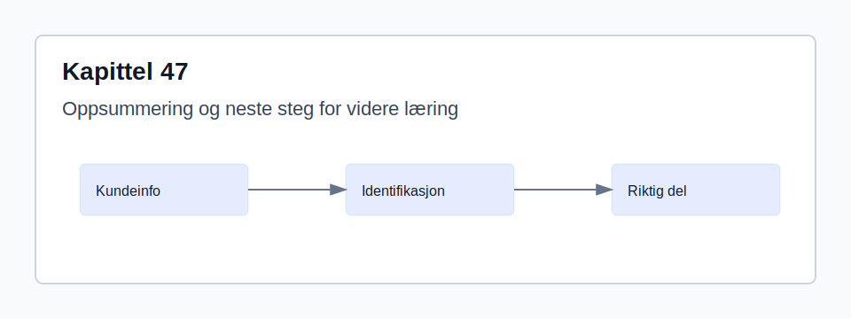

## Tekniske systemillustrasjoner

## Grundig forklaring
Hvordan medarbeideren går fra grunnkurs til selvstendig arbeid må forstås både teknisk og praktisk. I marine reservedeler er det sjelden nok å vite hva kunden kaller delen. Medarbeideren må forstå hvilken funksjon delen har, hvor den sitter, hvilken motorvariant den tilhører, og hva som skjer dersom feil del bestilles. Derfor skal tekniske data, kundens beskrivelse og dokumentert katalogoppslag alltid vurderes sammen.

En god sak har fire kjennetegn: den har tydelig identifikasjon, tydelig problem- eller delbeskrivelse, tydelig beslutningsgrunnlag og tydelig oppfølging. Dersom ett av disse punktene mangler, skal saken markeres som usikker før kunden får et bindende svar.

## Praktisk verkstedeksempel
Et verksted står med demontert komponent og trenger rask avklaring. Medarbeideren registrerer kunde, fartøy, motorinformasjon og tidsfrist, ber om bilder av typeplate og komponent, sjekker katalog og lager, og sender et kort skriftlig svar med valgt del, grunnlag for valget og neste oppdateringstidspunkt.

## Kundesupporteksempel
Kunde: 'Motoren går dårlig, kan dere sende riktig del?' Profesjonelt svar: 'Vi kan hjelpe, men først må vi skille mellom symptom og delbehov. Send serienummer, bilde av motorplate, bilde av området feilen gjelder og en kort beskrivelse av når feilen oppstår. Da kan vi foreslå riktig del eller riktig neste feilsøkingstrinn.'

## Vanlige feil og årsaker
- feil eller ufullstendig serienummer.
- delnummer som er erstattet uten at saken dokumenteres.
- symptom som tolkes som delbehov uten feilsøking.
- kunde har bilde av lignende del, men ikke korrekt motorvariant.
- manglende avklaring av antall, side, posisjon eller leveringstid.

## Feilsøkingsflyt

```mermaid
flowchart TD
    A[Symptom eller forespørsel mottatt] --> B[Samle serienummer, bilder og historikk]
    B --> C{Er motor og variant sikkert identifisert?}
    C -- Nei --> D[Be om mer dokumentasjon før del bekreftes]
    C -- Ja --> E[Kontroller delnummer og posisjon i katalog]
    E --> F{Stemmer symptom med foreslått del?}
    F -- Nei --> G[Foreslå feilsøking eller teknisk kontroll]
    F -- Ja --> H[Kontroller lager, pris og levering]
    H --> I[Send dokumentert kundesvar]
```

## Vedlikeholdsprosedyre
1. Avklar driftstimer, siste service og driftsmiljø.
2. Kontroller olje, filter, kjølevæske, sjøvannskrets, reimer, slanger og elektriske kontakter.
3. Sammenlign vedlikeholdsbehov med produsentens intervaller og faktisk bruk.
4. Anbefal servicekit når flere slitedeler bør skiftes samtidig.
5. Dokumenter hva som er anbefalt, hva kunden bestiller og eventuelle avvik fra normal prosedyre.

## Serienummeridentifikasjon
Serienummeridentifikasjon starter med å finne typeplate, motornummer eller annen unik identifikasjon. Be om bilde, ikke bare avskrift, fordi feil tegn, mellomrom og prefiks kan endre katalogoppslaget. Når serienummer ikke finnes, bygges identifikasjonen med modell, produksjonsår, bilder, tidligere fakturaer, servicehistorikk og delnummer fra monterte komponenter.

Minimumsdata bør være: fabrikat, modell, serienummer, eventuell product number/arrangement/CPL/motornummer, bilde av typeplate og bilde av motorens installasjon. Ved tvil skal saken stoppes for avklaring før del bekreftes.

## Reservedelsidentifikasjon
Reservedelsidentifikasjon skal bekrefte delnummer, posisjon, antall per motor, variant, side og eventuell erstatning. Dersom kunden oppgir et gammelt nummer, må det kontrolleres mot supersession. Dersom kunden bare sender bilde, skal bildet brukes som støtte, ikke som eneste grunnlag for bestilling.

Sjekk alltid om delnummeret gjelder enkeltkomponent, reparasjonssett, servicekit eller komplett enhet. Kontroller også om varen er høyre/venstre, gammel/ny type, standard/oversize eller knyttet til en bestemt produksjonsperiode.

## Bestillingsprosedyre
1. Opprett eller oppdater sak med kunde, fartøy, kontaktperson og tidsfrist.
2. Verifiser motoridentifikasjon og lagre bildedokumentasjon.
3. Finn korrekt delnummer i relevant katalog eller leverandørgrunnlag.
4. Kontroller supersession, antall, lagerstatus, pris, returvilkår og leveringstid.
5. Send ordrebekreftelse med delnummer, beskrivelse, antall, pris, levering og forbehold.
6. Følg opp leveransen til kunden har mottatt varen eller saken er lukket.

## Kvalitetspunkter før svar
- Har vi nok data til å gi et sikkert svar?
- Er delnummeret kontrollert mot riktig motorvariant?
- Er kundens tidsfrist realistisk med valgt fraktmåte?
- Er eventuelle forbehold skrevet tydelig?
- Kan en kollega forstå beslutningen ved å lese saken senere?

## Kapittelsammendrag
Hovedpoenget i kapittel 47 er at profesjonelt reservedelsarbeid krever struktur. Teknisk kunnskap, engelske fagtermer, praktisk feilsøking, dokumentasjon og kundedialog må henge sammen. Når medarbeideren jobber systematisk, reduseres feilbestillinger, kunden får bedre svar, og verkstedet kan planlegge arbeidet tryggere.

## Kryssreferanser
- For forrige tema, se kapittel 46: Fremtidige utviklinger innen marine motorservice og reservedeler.
- For neste tema, se kapittel 48: Ordliste over marine fagbegreper.
- For grunnleggende identifikasjon, se kapittel 12 og 17.
- For merkevise eksempler, se kapitlene 26-32.

## Fordypning for intern opplæring
Dette kapitlet skal brukes som arbeidsstandard, ikke bare som lesestoff. Når en ny medarbeider møter en sak om videre læring, skal vedkommende trene på å gå rolig fra fakta til vurdering og deretter til handling. I en marinemotorforhandler er konsekvensen av en feil ofte større enn verdien av selve delen. En feil impeller, feil sensor, feil filterinnsats eller feil pakningssett kan føre til tapt verkstedtid, utsatt avgang, irritert kunde og i verste fall ny driftsstans. Derfor skal hver sak behandles som en teknisk beslutning med sporbar dokumentasjon.

Profesjonelt nivå i dette kapitlet betyr at medarbeideren kan arbeide sikkert med videre læring. Før kunden får et bindende svar, skal opplysningene i saken kontrolleres mot motorens identitet, faktisk installasjon og relevant produsentterminologi. Det praktiske målet er ikke å finne et raskt nummer, men å kunne forklare hvorfor valgt del, kontrollpunkt eller kundesvar er riktig for akkurat denne motoren. Når informasjon mangler, skal medarbeideren beskrive hva som mangler, hvorfor det er nødvendig, og hvilket neste steg som bringer saken videre.

## Tekniske forklaringer
Teknisk forståelse i dette kapitlet skal bygges rundt kompetansemål, praksisplan, repetisjon, mentoroppfølging og egenvurdering. Medarbeideren må skille mellom synlig symptom, sannsynlig systemfeil og bestillbar komponent. En del kan se riktig ut på bilde, men likevel være feil dersom posisjon, variant, rating, kjøleroppsett, elektrisk plugg, monteringsside eller servicehistorikk ikke stemmer. Derfor skal teknisk vurdering alltid kobles til både funksjon og dokumentasjon: hva gjør komponenten, hvilket system påvirker den, og hvilken produsentkilde bekrefter at den passer.

I praksis betyr dette at tekniske data skal kobles til motorens faktiske installasjon. Marine motorer står ofte trangt, er utsatt for salt, vibrasjon, fukt og ujevnt belastningsmønster, og de kan være bygget om gjennom mange år. En motor kan ha original kjøler, ettermontert eksosbend, alternativ dynamo, endret filterbrakett eller annen sjøvannspumpe enn standard. Slike forhold gjør at delidentifikasjon må bygge på både produsentdata og synlig dokumentasjon fra motoren.

Produsentterminologi er en del av den tekniske forståelsen. Bruk uttrykk som Serial Number, Engine Number, Part Number, Service Kit, Exploded View, Supersession når de er relevante. Ikke oversett dem på en måte som fjerner presisjon. Skriv for eksempel «Engine Serial Number (ESN)» første gang og deretter «ESN» i saken dersom produsenten bruker dette. Skriv «Arrangement Number» når CAT-data krever det, «Product Number» når Volvo Penta bruker det, «CPL» når Cummins-konfigurasjon må kontrolleres, og «Model Code» når Yanmar-identifikasjon bygger på modellkode. Dette gjør dialogen med internasjonale leverandører mer presis.

## Illustrasjonsforslag
- Oversiktsdiagram som viser hvor videre læring passer inn i total arbeidsflyt fra kundeforespørsel til levert del.
- Nærbilde av typeplate/motorskilt med markering av serienummer, motornummer, modell og eventuell variantkode.
- Sprengskisse med markert posisjon, delnummer, antall per motor og mulige alternative versjoner.
- Feilsøkingsflyt med beslutningspunkter: mangler data, stemmer symptom, kreves mer teknisk kontroll, kan ordre bekreftes.
- Sammenligningsbilde av gammel og ny del der forskjell i tilkobling, side, lengde eller sensorplugg er markert.

## Virkelige verkstedseksempler
Eksempel 1: Et verksted står med en demontert komponent på benken og kunden venter på avklaring før fartøyet kan settes tilbake i drift. Verkstedet sender et nærbilde av delen, men ingen motorplate. En uerfaren medarbeider kan bli fristet til å søke på nummeret som står på støpegodset. En profesjonell medarbeider svarer at støpenummer ikke nødvendigvis er bestillbart delnummer, ber om bilde av typeplate, oversiktsbilde av motoren og bilde av monteringsstedet, og forklarer at dette hindrer feilbestilling. Når informasjonen kommer, kontrolleres delnummer mot sprengskisse, posisjon og antall. Først da gis pris og leveringstid.

Eksempel 2: En kunde ringer sent på dagen og sier at motoren har høy temperatur etter service. Kunden ønsker ny termostat. Medarbeideren skal ikke automatisk konkludere med termostatfeil. Spørsmålene bør avklare om impeller er byttet, om sjøvannsfilteret er rent, om kjølevæskenivået er riktig, om alarmen kommer ved tomgang eller belastning, og om det finnes lekkasje rundt varmeveksler eller slanger. Dersom kunden likevel vil bestille termostat, dokumenteres at feilsøking er anbefalt, og delnummer kontrolleres mot serienummer før ordre.

Eksempel 3: En intern selger mottar en gammel faktura med et delnummer som ikke lenger finnes. Riktig prosess er å kontrollere supersession, se om ny del krever tilhørende pakning, boltsett eller adapter, og notere både gammelt og nytt nummer i saken. Kunden skal få vite at delen er erstattet, hva som leveres, og om det finnes monteringsforbehold.

## Reservedelsidentifisering i praksis
Reservedelsidentifisering skal følge en fast rekkefølge. Først kontrolleres motorens identitet. Deretter kontrolleres delens system: drivstoff, luft, kjøling, smøring, eksos, elektrisk eller mekanisk kraftoverføring. Så kontrolleres posisjon i sprengskisse eller parts list. Til slutt kontrolleres antall, variant, supersession og leveringsstatus. Denne rekkefølgen hindrer at medarbeideren hopper direkte fra kundens ord til et tilfeldig delnummer.

Når en del har synlig nummer, må nummeret tolkes riktig. Mange komponenter har produksjonsnummer, støpenummer, leverandørnummer eller revisjonskode som ikke er det samme som bestillbart part number. Et filter kan ha nummer fra filterprodusent, men motorprodusentens parts catalogue kan bruke et annet nummer. En pumpe kan ha nummer på lokk, hus og komplett enhet. Spør derfor alltid: gjelder nummeret komplett del, reparasjonssett, underkomponent eller produsentens råkomponent?

## Serienummer og motornummer
Serienummer og motornummer er grunnlaget for korrekt katalogoppslag. Be kunden sende bilde av typeplate eller dataplate. Dersom kunden skriver nummeret manuelt, skal nummeret likevel kontrolleres mot bilde når det er mulig. Noter hele nummeret, inkludert prefiks, suffiks, bindestrek, mellomrom og eventuelle bokstaver. På enkelte produsenter kan små forskjeller peke til forskjellig produksjonsperiode, rating eller konfigurasjon.

Bruk motornummer sammen med modell, variant og applikasjon. En motor som driver generator kan ha andre deler enn en fremdriftsmotor. En motor i yrkesbåt kan ha annen rating enn samme motor i fritidsbåt. En eldre motor kan være bygget om med ny dynamo, annen sjøvannspumpe eller uoriginal filterbrakett. Dersom typeplate mangler, bygg identifikasjonen gjennom flere kilder: servicebok, tidligere faktura, bilder av motorens sider, nummer på pumpe, filter, turbo og gear, samt opplysninger om fartøy og produksjonsår.

## Feilsøking steg for steg
1. Definer symptomet med kundens egne ord og skriv det i saken. Skill mellom «kunden ønsker del» og «kunden beskriver feil».
2. Avklar når feilen oppstår: start, tomgang, belastning, marsjfart, varm motor, kald motor eller etter nylig service.
3. Kontroller grunnleggende forhold: væskenivå, filter, luft i drivstoff, sjøvannsstrøm, reimer, elektriske kontakter, sikringer og synlige lekkasjer.
4. Knytt symptomet til system: lav effekt peker ofte mot luft/drivstoff/eksos, høy temperatur mot kjøling, lavt oljetrykk mot smøring/sensor, startproblem mot batteri/starter/gløding/drivstoff.
5. Be om bilder eller måledata dersom symptomet ikke kan kobles sikkert til en del. Dette kan være bilde av alarmdisplay, trykkmåling, temperaturmåling eller bilde av montert komponent.
6. Kontroller relevant delnummer mot serienummer og variant. Dersom flere alternativer finnes, forklar kunden hva som skiller dem.
7. Dokumenter anbefalt tiltak, usikkerhet og eventuelle forbehold før ordre bekreftes.

## Vedlikehold
Vedlikehold skal vurderes mot driftstimer, produsentens maintenance schedule og faktisk driftsmiljø. Marine motorer som går korte turer, mye tomgang eller i salt miljø kan trenge hyppigere kontroll enn standard intervall antyder. Nye medarbeidere skal lære å spørre om siste service, hvilke filter som ble byttet, hvilken olje som ble brukt, om impeller er kontrollert, og om kjølevæske eller anoder er byttet etter plan.

En god vedlikeholdsanbefaling er konkret. I stedet for å skrive «ta service», bør medarbeideren foreslå relevante deler: olje- og drivstoffilter, luftfilter, impeller, reim, pakninger, anoder, kjølevæske og eventuelt servicekit. Dersom kunden har ukjent servicehistorikk, bør komplett servicekit vurderes. Dersom kunden har hatt overoppheting, bør sjøvannskrets og varmeveksler kontrolleres før bare én komponent byttes.

## Vanlige feil
- Serienummer leses feil fordi et tegn forveksles, for eksempel O/0 eller I/1.
- Kunden oppgir modellnavn, men ikke variant, rating eller applikasjon.
- Del velges ut fra bilde alene uten kontroll mot sprengskisse eller produsentkatalog.
- Supersession aksepteres uten å kontrollere om ny del krever tilbehør, pakning eller ombygging.
- Hastepress gjør at leveringsløfte gis før lagerstatus og fraktmulighet er bekreftet.
- Saksnotat mangler grunnlaget for beslutningen, slik at kollega ikke kan etterprøve valget.

## Kontrollspørsmål
- Hva er den viktigste tekniske risikoen i en sak som gjelder videre læring?
- Hvilke opplysninger må dokumenteres før bindende delnummer bekreftes?
- Hvordan forklarer du kunden hvorfor bilde av typeplate er nødvendig?
- Når bør du stoppe en ordre og be om mer dokumentasjon?
- Hvilke engelske produsentuttrykk bør du kunne bruke i denne typen sak?
- Hvordan dokumenterer du at et delnummer er erstattet av et nytt nummer?

## Praktisk sjekkliste for medarbeider
- Les saken som om en kollega skal overta den i morgen.
- Kontroller at motoridentifikasjon er dokumentert med bilde eller sikker kilde.
- Sjekk at delnummeret er knyttet til riktig posisjon i katalogen.
- Skriv tydelig om kunden har bedt om enkeltkomponent, servicekit eller komplett enhet.
- Noter om varen er spesialbestilling, utgått, erstattet eller ikke returbar.
- Send kundesvar med neste steg, ikke bare et løst delnummer.

## Kapittelspesifikk systemforståelse
For dette kapitlet er kjernen å forstå oppsummering og videre læring. Medarbeideren skal kunne forklare dette med praktiske ord til både kunde og kollega. Det betyr at teknisk teori må kobles til konkrete handlinger: hvilke data skal innhentes, hvilke komponenter kan være berørt, hvilken produsentterminologi skal brukes, og hva må dokumenteres før saken kan gå videre. Videre læring bør styres etter hvilke saker medarbeideren kan håndtere uten støtte.

Når systemet vurderes, skal medarbeideren først plassere problemet i riktig teknisk sammenheng. Dersom kunden beskriver en alarm, må man finne ut om alarmen kommer fra reelt mekanisk avvik, elektrisk sensorfeil, feil etter service eller feil tolkning av instrumentet. Dersom kunden beskriver en del, må man avklare om kunden mener komplett enhet, servicekit, reparasjonssett eller enkeltkomponent. Dersom kunden beskriver motoren med vanlig navn, må man kontrollere om produsenten bruker mer presise begreper i katalogen.

## Komponentoversikt og arbeidsgrense
Relevante komponenter og opplysninger i dette kapitlet omfatter: kompetansematrise, mentor, casebank, produsentkurs, selvstendig saksbehandling og faglig eskalering. Listen er ikke ment som en erstatning for produsentens parts catalogue, men som en praktisk påminnelse om hva nye medarbeidere skal tenke på før de søker del. I interne saker skal komponentnavn skrives så presist som mulig. Bruk for eksempel «sjøvannspumpe / raw water pump» i stedet for bare «pumpe» når funksjonen er kjent, og «varmeveksler / heat exchanger» i stedet for bare «kjøler» når det er den komponenten saken gjelder.

Arbeidsgrensen for en reservedelsmedarbeider er også viktig. Medarbeideren skal ikke overta mekanikerens ansvar for demontering, måling eller diagnose på motoren, men skal kunne stille riktige spørsmål og foreslå riktig dokumentasjon. Når en sak går fra enkel delidentifikasjon til teknisk diagnose, skal dette markeres i saken. Da kan verksted, teknisk ansvarlig eller leverandør involveres med et klart spørsmål og et ryddig faktagrunnlag.

## Praktisk beslutningsregel
Bruk denne regelen i alle saker knyttet til kapitlet: Hvis motoridentifikasjon, komponentposisjon eller symptom ikke er sikkert nok dokumentert, skal medarbeideren ikke gi bindende delbekreftelse. Kunden kan få et foreløpig svar, men svaret må inneholde hva som mangler, hvorfor det mangler, og hva som skjer når informasjonen er mottatt. Dette er ikke treg service; det er profesjonell risikokontroll.

## Målrettet fordypning kapittel 41-50
### Oppsummering og videre læringsløp
Videre læring bør organiseres som en kompetansesti. Første nivå er trygg mottak av forespørsel og dokumentasjon. Andre nivå er selvstendig katalogoppslag på vanlige service- og slitedeler. Tredje nivå er feilsøking og variantkritiske deler. Fjerde nivå er merkevis fordypning og vanskelige saker med eldre motorer eller manglende dokumentasjon.

Medarbeideren bør ha en personlig casebank med saker de har løst, saker de måtte eskalere, og læringspunkter fra avvik. Dette gjør opplæringen konkret. Målet er ikke at nye ansatte skal kunne alt uten støtte, men at de vet når de har nok grunnlag og når de skal spørre.

### Praktisk anvendelse i opplæring
Bruk kapitlet til en avsluttende case der deltakeren må vise selvstendig vurdering. Deltakeren skal identifisere teknisk risiko, skrive kundesvar, velge dokumentasjon, forklare eventuelle forbehold og angi når saken skal eskaleres. Dette er særlig viktig i sluttkapitlene, fordi de binder sammen teknikk, kvalitet, læring og praktisk drift.

## Realistisk opplæring i praksis
### Verkstedhistorie
En typisk sak i dette temaet starter med medarbeider er trygg på rutine, men usikker på diagnose. Verkstedet trenger et raskt svar, men den erfarne medarbeideren stopper opp og spør først: hva vet vi sikkert, hva antar vi, og hva kan gi følgeskade hvis vi tar feil? I praksis betyr det at kompetanseplan må kobles til bilde, serienummer, komponentposisjon og kundens symptom før saken lukkes. Historien skal brukes i opplæring som en øvelse i å skrive et kort saksnotat: observasjon, vurdering, neste handling og forbehold.

### Kundehistorie
Kunden beskriver ofte problemet med driftsspråk: «motoren går tungt», «alarm kommer etter ti minutter», «jeg trenger den samme delen som sist» eller «båten skal ut i morgen». En profesjonell respons er rolig og konkret: bekreft behovet, forklar hvorfor identifikasjon trengs, be om riktig dokumentasjon og gi et realistisk tidspunkt for neste svar. Ikke korriger kunden unødvendig; oversett kundens språk til teknisk språk i saken.

### Typiske feil nye ansatte gjør
- søker på første synlige nummer uten å avklare om det er støpenummer, leverandørnummer eller bestillbart part number.
- lover levering før lagerstatus, frakt og returvilkår er kontrollert.
- antar at tidligere faktura alltid gjelder samme motorvariant.
- blander symptom og årsak, spesielt ved varme, lav effekt, startproblem og alarm.
- skriver for korte notater slik at kollega ikke kan forstå hvorfor valget ble tatt.

### Tips fra erfarne mekanikere og reservedelsselgere
- Se alltid etter systemet rundt delen: slanger, braketter, sensorer, reimer, kjølere og tilkoblinger forteller ofte mer enn delen alene.
- Still ett presist spørsmål om gangen når kunden er stresset; mange dårlige svar kommer av for lange spørsmålslister.
- Sammenlign gammel og ny del mot funksjon, ikke bare form. Riktig del skal passe, men også løse riktig problem.
- En erfaren reservedelsselger tenker i risiko: Hva er billigst å avklare nå, og hva blir dyrt hvis vi hopper over det?

### Vanlige kundespørsmål
| Spørsmål fra kunde | Profesjonelt svar |
|---|---|
| «Kan du bare sende samme del som sist?» | «Ja, hvis vi først bekrefter at det gjelder samme motor, samme posisjon og ingen supersession siden sist.» |
| «Holder det med bilde?» | «Bilde hjelper, men vi trenger også motoridentitet for å sikre variant og delnummer.» |
| «Hvorfor tar dette tid?» | «Fordi feil del kan gi ny driftsstans. Vi kontrollerer grunnlaget før vi lover levering.» |

### Beslutningstre for saken
| Trinn | Spørsmål | Handling |
|---|---|---|
| 1 | Er motoridentitet dokumentert med bilde eller sikker historikk? | Hvis nei: be om typeplate/dataplate eller alternativ dokumentasjon. |
| 2 | Er komponentens funksjon og posisjon kjent? | Hvis nei: be om oversiktsbilde og bilde av monteringssted. |
| 3 | Stemmer kundens symptom med delen som ønskes? | Hvis nei: anbefal feilsøking før del bestilles. |
| 4 | Finnes det supersession, kit eller variantvalg? | Kontroller produsentkilde og skriv forbehold i saken. |
| 5 | Kan pris, levering og returvilkår bekreftes? | Send dokumentert svar med neste steg og tydelig gyldighet. |

### Rask oppslagstabell
| Situasjon | Kontroller først | Vanlig fallgruve |
|---|---|---|
| Hasteordre | sikker motor-ID, lager, fraktfrist | levering loves før teknisk kontroll |
| Del fra bilde | posisjon, skala, tilkoblinger, nummer | bilde brukes som eneste beslutningsgrunnlag |
| Gammelt delnummer | supersession og kitinnhold | ny del krever ekstra pakning eller adapter |
| Uklart symptom | driftssituasjon, alarm, siste service | symptom blir tolket som sikker komponentfeil |

### Praktisk sjekkliste og inspeksjonsrutine
- Start med motoridentitet: fabrikat, modell, serienummer, variant, applikasjon og bilde av skilt.
- Kontroller området rundt komponenten: lekkasje, korrosjon, knekte fester, slitasje, varmemerker og uoriginale endringer.
- Spør om siste vedlikehold: olje, filter, impeller, reimer, kjølevæske, anoder og drivstoffilter.
- Noter driftstype: fritidsbruk, yrkesbruk, generator, fremdrift, tomgangsdrift eller langvarig høy belastning.
- Avklar om saken gjelder akutt drift, planlagt service, reklamasjon eller lagerpåfyll.

### Generelle vedlikeholdsintervaller som opplæringspunkt
| Kontrollpunkt | Typisk vurdering i opplæring | Må verifiseres |
|---|---|---|
| Olje og oljefilter | ofte basert på timer og kalender | produsentens maintenance schedule |
| Drivstoffilter/vannutskiller | hyppigere ved dårlig drivstoff eller sesongstart | motor- og filterspesifikasjon |
| Impeller og sjøvannskrets | kontrolleres særlig før sesong og etter varmgang | produsentens intervall og installasjon |
| Reimer, slanger og klemmer | visuell kontroll ved service og feilsøking | dimensjon, stramming og delnummer |

### Produsentverifikasjon
Alle konkrete delnumre, momentverdier, serviceintervaller, garantikrav, programvaredata og produsentspesifikke grenser skal kontrolleres mot offisiell produsentdokumentasjon før de brukes i tilbud, ordre eller verkstedinstruks. Marker tydelig i saken når svaret bygger på antakelse, eldre historikk, bilde uten motor-ID eller generell erfaring. Intervaller i tabellen er generelle opplæringspunkter. Faktiske intervaller styres av produsent, motorvariant, driftstimer, kalenderkrav, belastning og miljø.

## Produsentverifikasjon og faglig forbehold
Denne manualen skal brukes som intern opplæring og arbeidsmetode. Produsentspesifikke delnumre, intervaller, momentverdier, garantikrav og tekniske grenseverdier skal verifiseres mot gjeldende produsentdokumentasjon før de brukes i kundeordre eller verkstedinstruks. Marker saken internt dersom opplysningen bygger på antakelse, eldre historikk eller bilde uten bekreftet motoridentitet.

## Quiz med fasit
1. Hvilke tekniske data bør alltid samles før en del bekreftes?
2. Hvorfor er engelsk terminologi viktig i marine reservedeler?
3. Hva bør gjøres dersom kunden bare sender et bilde av delen?
4. Hvilke punkter bør kontrolleres før ordrebekreftelse sendes?
5. Hvorfor skal feilsøking dokumenteres, selv når kunden allerede ber om en bestemt del?

### Svar
1. Fabrikat, modell, serienummer, variantdata, bilde av typeplate, delnummer, posisjon og kundens symptombeskrivelse.
2. Fordi kataloger, portaler, servicemanualer og leverandørdialog ofte bruker engelske begreper som må forstås presist.
3. Be om serienummer, oversiktsbilde av motoren og eventuelle nummer på delen; bildet brukes som støtte, ikke eneste grunnlag.
4. Delnummer, antall, variant, pris, lagerstatus, leveringstid, frakt, returvilkår og eventuelle forbehold.
5. Fordi symptomet kan ha flere årsaker, og dokumentasjon viser hvorfor anbefalingen ble gitt.

---

# Kapittel 48: Ordliste over marine fagbegreper

## Kapittelrolle
Dette kapitlet gir en grundig praktisk innføring i ordliste. Temaet er viktig fordi reservedelsarbeid i marine miljøer kombinerer teknisk forståelse, presis kundedialog, dokumentert saksbehandling og realistisk leveranseoppfølging. Målet er at en ny medarbeider skal kunne bruke kunnskapen direkte i arbeid med verksted, kunde, lager og leverandør.

## Læringsmål
Etter kapitlet skal deltakeren kunne:
- forklare hovedbegrepene innen ordliste
- bruke serienummer, modellinformasjon og delnummer i praktisk reservedelsarbeid
- kommunisere trygt med kunde, verksted, lager og leverandør
- dokumentere beslutninger slik at andre kan etterprøve saken
- kjenne igjen vanlige feil og velge riktig neste handling

## English technical terminology
- **Serial Number:** engelsk fagterm som ofte brukes i kataloger, servicelitteratur, leverandørportaler og internasjonal kundedialog.
- **Part Number:** engelsk fagterm som ofte brukes i kataloger, servicelitteratur, leverandørportaler og internasjonal kundedialog.
- **Engine Model:** engelsk fagterm som ofte brukes i kataloger, servicelitteratur, leverandørportaler og internasjonal kundedialog.
- **Variant:** engelsk fagterm som ofte brukes i kataloger, servicelitteratur, leverandørportaler og internasjonal kundedialog.
- **Service Kit:** engelsk fagterm som ofte brukes i kataloger, servicelitteratur, leverandørportaler og internasjonal kundedialog.
- **Troubleshooting:** engelsk fagterm som ofte brukes i kataloger, servicelitteratur, leverandørportaler og internasjonal kundedialog.
- **Maintenance:** engelsk fagterm som ofte brukes i kataloger, servicelitteratur, leverandørportaler og internasjonal kundedialog.
- **Ordering Procedure:** engelsk fagterm som ofte brukes i kataloger, servicelitteratur, leverandørportaler og internasjonal kundedialog.
- **Supersession:** engelsk fagterm som ofte brukes i kataloger, servicelitteratur, leverandørportaler og internasjonal kundedialog.
- **Technical Support:** engelsk fagterm som ofte brukes i kataloger, servicelitteratur, leverandørportaler og internasjonal kundedialog.

## Hoveddiagram
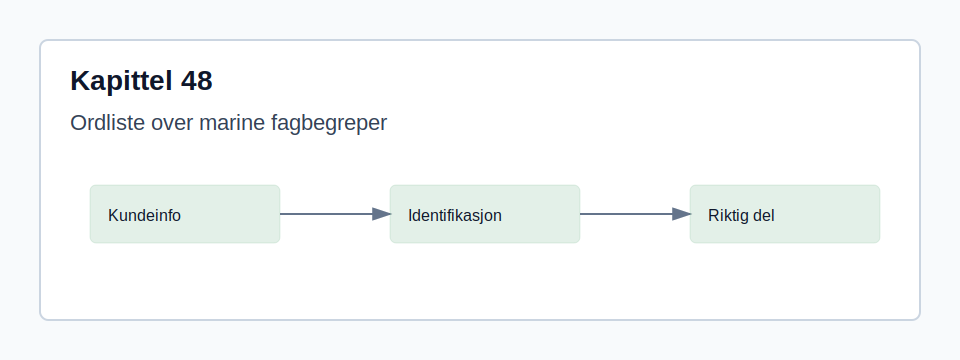

## Tekniske systemillustrasjoner

## Grundig forklaring
Hvordan fagord brukes som støtteverktøy i arbeidshverdagen må forstås både teknisk og praktisk. I marine reservedeler er det sjelden nok å vite hva kunden kaller delen. Medarbeideren må forstå hvilken funksjon delen har, hvor den sitter, hvilken motorvariant den tilhører, og hva som skjer dersom feil del bestilles. Derfor skal tekniske data, kundens beskrivelse og dokumentert katalogoppslag alltid vurderes sammen.

En god sak har fire kjennetegn: den har tydelig identifikasjon, tydelig problem- eller delbeskrivelse, tydelig beslutningsgrunnlag og tydelig oppfølging. Dersom ett av disse punktene mangler, skal saken markeres som usikker før kunden får et bindende svar.

## Praktisk verkstedeksempel
Et verksted står med demontert komponent og trenger rask avklaring. Medarbeideren registrerer kunde, fartøy, motorinformasjon og tidsfrist, ber om bilder av typeplate og komponent, sjekker katalog og lager, og sender et kort skriftlig svar med valgt del, grunnlag for valget og neste oppdateringstidspunkt.

## Kundesupporteksempel
Kunde: 'Motoren går dårlig, kan dere sende riktig del?' Profesjonelt svar: 'Vi kan hjelpe, men først må vi skille mellom symptom og delbehov. Send serienummer, bilde av motorplate, bilde av området feilen gjelder og en kort beskrivelse av når feilen oppstår. Da kan vi foreslå riktig del eller riktig neste feilsøkingstrinn.'

## Vanlige feil og årsaker
- feil eller ufullstendig serienummer.
- delnummer som er erstattet uten at saken dokumenteres.
- symptom som tolkes som delbehov uten feilsøking.
- kunde har bilde av lignende del, men ikke korrekt motorvariant.
- manglende avklaring av antall, side, posisjon eller leveringstid.

## Feilsøkingsflyt
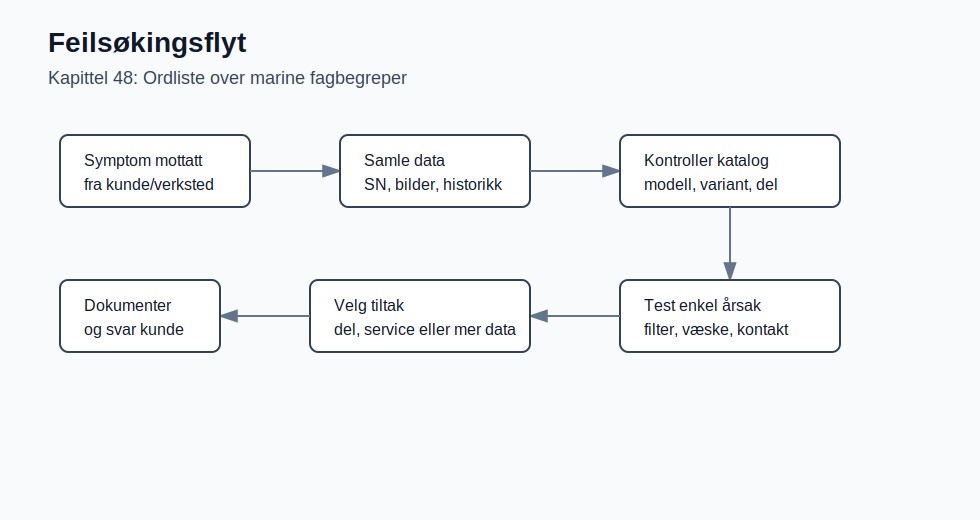

```mermaid
flowchart TD
    A[Symptom eller forespørsel mottatt] --> B[Samle serienummer, bilder og historikk]
    B --> C{Er motor og variant sikkert identifisert?}
    C -- Nei --> D[Be om mer dokumentasjon før del bekreftes]
    C -- Ja --> E[Kontroller delnummer og posisjon i katalog]
    E --> F{Stemmer symptom med foreslått del?}
    F -- Nei --> G[Foreslå feilsøking eller teknisk kontroll]
    F -- Ja --> H[Kontroller lager, pris og levering]
    H --> I[Send dokumentert kundesvar]
```

## Vedlikeholdsprosedyre
1. Avklar driftstimer, siste service og driftsmiljø.
2. Kontroller olje, filter, kjølevæske, sjøvannskrets, reimer, slanger og elektriske kontakter.
3. Sammenlign vedlikeholdsbehov med produsentens intervaller og faktisk bruk.
4. Anbefal servicekit når flere slitedeler bør skiftes samtidig.
5. Dokumenter hva som er anbefalt, hva kunden bestiller og eventuelle avvik fra normal prosedyre.

## Serienummeridentifikasjon
Serienummeridentifikasjon starter med å finne typeplate, motornummer eller annen unik identifikasjon. Be om bilde, ikke bare avskrift, fordi feil tegn, mellomrom og prefiks kan endre katalogoppslaget. Når serienummer ikke finnes, bygges identifikasjonen med modell, produksjonsår, bilder, tidligere fakturaer, servicehistorikk og delnummer fra monterte komponenter.

Minimumsdata bør være: fabrikat, modell, serienummer, eventuell product number/arrangement/CPL/motornummer, bilde av typeplate og bilde av motorens installasjon. Ved tvil skal saken stoppes for avklaring før del bekreftes.

## Reservedelsidentifikasjon
Reservedelsidentifikasjon skal bekrefte delnummer, posisjon, antall per motor, variant, side og eventuell erstatning. Dersom kunden oppgir et gammelt nummer, må det kontrolleres mot supersession. Dersom kunden bare sender bilde, skal bildet brukes som støtte, ikke som eneste grunnlag for bestilling.

Sjekk alltid om delnummeret gjelder enkeltkomponent, reparasjonssett, servicekit eller komplett enhet. Kontroller også om varen er høyre/venstre, gammel/ny type, standard/oversize eller knyttet til en bestemt produksjonsperiode.

## Bestillingsprosedyre
1. Opprett eller oppdater sak med kunde, fartøy, kontaktperson og tidsfrist.
2. Verifiser motoridentifikasjon og lagre bildedokumentasjon.
3. Finn korrekt delnummer i relevant katalog eller leverandørgrunnlag.
4. Kontroller supersession, antall, lagerstatus, pris, returvilkår og leveringstid.
5. Send ordrebekreftelse med delnummer, beskrivelse, antall, pris, levering og forbehold.
6. Følg opp leveransen til kunden har mottatt varen eller saken er lukket.

## Kvalitetspunkter før svar
- Har vi nok data til å gi et sikkert svar?
- Er delnummeret kontrollert mot riktig motorvariant?
- Er kundens tidsfrist realistisk med valgt fraktmåte?
- Er eventuelle forbehold skrevet tydelig?
- Kan en kollega forstå beslutningen ved å lese saken senere?

## Kapittelsammendrag
Hovedpoenget i kapittel 48 er at profesjonelt reservedelsarbeid krever struktur. Teknisk kunnskap, engelske fagtermer, praktisk feilsøking, dokumentasjon og kundedialog må henge sammen. Når medarbeideren jobber systematisk, reduseres feilbestillinger, kunden får bedre svar, og verkstedet kan planlegge arbeidet tryggere.

## Kryssreferanser
- For forrige tema, se kapittel 47: Oppsummering og neste steg for videre læring.
- For neste tema, se kapittel 49: Vanlige spørsmål og svar for nye medarbeidere.
- For grunnleggende identifikasjon, se kapittel 12 og 17.
- For merkevise eksempler, se kapitlene 26-32.

## Fordypning for intern opplæring
Dette kapitlet skal brukes som arbeidsstandard, ikke bare som lesestoff. Når en ny medarbeider møter en sak om ordliste, skal vedkommende trene på å gå rolig fra fakta til vurdering og deretter til handling. I en marinemotorforhandler er konsekvensen av en feil ofte større enn verdien av selve delen. En feil impeller, feil sensor, feil filterinnsats eller feil pakningssett kan føre til tapt verkstedtid, utsatt avgang, irritert kunde og i verste fall ny driftsstans. Derfor skal hver sak behandles som en teknisk beslutning med sporbar dokumentasjon.

Profesjonelt nivå i dette kapitlet betyr at medarbeideren kan arbeide sikkert med ordlistebruk. Før kunden får et bindende svar, skal opplysningene i saken kontrolleres mot motorens identitet, faktisk installasjon og relevant produsentterminologi. Det praktiske målet er ikke å finne et raskt nummer, men å kunne forklare hvorfor valgt del, kontrollpunkt eller kundesvar er riktig for akkurat denne motoren. Når informasjon mangler, skal medarbeideren beskrive hva som mangler, hvorfor det er nødvendig, og hvilket neste steg som bringer saken videre.

## Tekniske forklaringer
Teknisk forståelse i dette kapitlet skal bygges rundt begrepspresisjon, norsk/engelsk terminologi, søkbarhet og felles språk i teamet. Medarbeideren må skille mellom synlig symptom, sannsynlig systemfeil og bestillbar komponent. En del kan se riktig ut på bilde, men likevel være feil dersom posisjon, variant, rating, kjøleroppsett, elektrisk plugg, monteringsside eller servicehistorikk ikke stemmer. Derfor skal teknisk vurdering alltid kobles til både funksjon og dokumentasjon: hva gjør komponenten, hvilket system påvirker den, og hvilken produsentkilde bekrefter at den passer.

I praksis betyr dette at tekniske data skal kobles til motorens faktiske installasjon. Marine motorer står ofte trangt, er utsatt for salt, vibrasjon, fukt og ujevnt belastningsmønster, og de kan være bygget om gjennom mange år. En motor kan ha original kjøler, ettermontert eksosbend, alternativ dynamo, endret filterbrakett eller annen sjøvannspumpe enn standard. Slike forhold gjør at delidentifikasjon må bygge på både produsentdata og synlig dokumentasjon fra motoren.

Produsentterminologi er en del av den tekniske forståelsen. Bruk uttrykk som Serial Number, Engine Number, Part Number, Service Kit, Exploded View, Supersession når de er relevante. Ikke oversett dem på en måte som fjerner presisjon. Skriv for eksempel «Engine Serial Number (ESN)» første gang og deretter «ESN» i saken dersom produsenten bruker dette. Skriv «Arrangement Number» når CAT-data krever det, «Product Number» når Volvo Penta bruker det, «CPL» når Cummins-konfigurasjon må kontrolleres, og «Model Code» når Yanmar-identifikasjon bygger på modellkode. Dette gjør dialogen med internasjonale leverandører mer presis.

## Illustrasjonsforslag
- Oversiktsdiagram som viser hvor ordliste passer inn i total arbeidsflyt fra kundeforespørsel til levert del.
- Nærbilde av typeplate/motorskilt med markering av serienummer, motornummer, modell og eventuell variantkode.
- Sprengskisse med markert posisjon, delnummer, antall per motor og mulige alternative versjoner.
- Feilsøkingsflyt med beslutningspunkter: mangler data, stemmer symptom, kreves mer teknisk kontroll, kan ordre bekreftes.
- Sammenligningsbilde av gammel og ny del der forskjell i tilkobling, side, lengde eller sensorplugg er markert.

## Virkelige verkstedseksempler
Eksempel 1: Et verksted står med en demontert komponent på benken og kunden venter på avklaring før fartøyet kan settes tilbake i drift. Verkstedet sender et nærbilde av delen, men ingen motorplate. En uerfaren medarbeider kan bli fristet til å søke på nummeret som står på støpegodset. En profesjonell medarbeider svarer at støpenummer ikke nødvendigvis er bestillbart delnummer, ber om bilde av typeplate, oversiktsbilde av motoren og bilde av monteringsstedet, og forklarer at dette hindrer feilbestilling. Når informasjonen kommer, kontrolleres delnummer mot sprengskisse, posisjon og antall. Først da gis pris og leveringstid.

Eksempel 2: En kunde ringer sent på dagen og sier at motoren har høy temperatur etter service. Kunden ønsker ny termostat. Medarbeideren skal ikke automatisk konkludere med termostatfeil. Spørsmålene bør avklare om impeller er byttet, om sjøvannsfilteret er rent, om kjølevæskenivået er riktig, om alarmen kommer ved tomgang eller belastning, og om det finnes lekkasje rundt varmeveksler eller slanger. Dersom kunden likevel vil bestille termostat, dokumenteres at feilsøking er anbefalt, og delnummer kontrolleres mot serienummer før ordre.

Eksempel 3: En intern selger mottar en gammel faktura med et delnummer som ikke lenger finnes. Riktig prosess er å kontrollere supersession, se om ny del krever tilhørende pakning, boltsett eller adapter, og notere både gammelt og nytt nummer i saken. Kunden skal få vite at delen er erstattet, hva som leveres, og om det finnes monteringsforbehold.

## Reservedelsidentifisering i praksis
Reservedelsidentifisering skal følge en fast rekkefølge. Først kontrolleres motorens identitet. Deretter kontrolleres delens system: drivstoff, luft, kjøling, smøring, eksos, elektrisk eller mekanisk kraftoverføring. Så kontrolleres posisjon i sprengskisse eller parts list. Til slutt kontrolleres antall, variant, supersession og leveringsstatus. Denne rekkefølgen hindrer at medarbeideren hopper direkte fra kundens ord til et tilfeldig delnummer.

Når en del har synlig nummer, må nummeret tolkes riktig. Mange komponenter har produksjonsnummer, støpenummer, leverandørnummer eller revisjonskode som ikke er det samme som bestillbart part number. Et filter kan ha nummer fra filterprodusent, men motorprodusentens parts catalogue kan bruke et annet nummer. En pumpe kan ha nummer på lokk, hus og komplett enhet. Spør derfor alltid: gjelder nummeret komplett del, reparasjonssett, underkomponent eller produsentens råkomponent?

## Serienummer og motornummer
Serienummer og motornummer er grunnlaget for korrekt katalogoppslag. Be kunden sende bilde av typeplate eller dataplate. Dersom kunden skriver nummeret manuelt, skal nummeret likevel kontrolleres mot bilde når det er mulig. Noter hele nummeret, inkludert prefiks, suffiks, bindestrek, mellomrom og eventuelle bokstaver. På enkelte produsenter kan små forskjeller peke til forskjellig produksjonsperiode, rating eller konfigurasjon.

Bruk motornummer sammen med modell, variant og applikasjon. En motor som driver generator kan ha andre deler enn en fremdriftsmotor. En motor i yrkesbåt kan ha annen rating enn samme motor i fritidsbåt. En eldre motor kan være bygget om med ny dynamo, annen sjøvannspumpe eller uoriginal filterbrakett. Dersom typeplate mangler, bygg identifikasjonen gjennom flere kilder: servicebok, tidligere faktura, bilder av motorens sider, nummer på pumpe, filter, turbo og gear, samt opplysninger om fartøy og produksjonsår.

## Feilsøking steg for steg
1. Definer symptomet med kundens egne ord og skriv det i saken. Skill mellom «kunden ønsker del» og «kunden beskriver feil».
2. Avklar når feilen oppstår: start, tomgang, belastning, marsjfart, varm motor, kald motor eller etter nylig service.
3. Kontroller grunnleggende forhold: væskenivå, filter, luft i drivstoff, sjøvannsstrøm, reimer, elektriske kontakter, sikringer og synlige lekkasjer.
4. Knytt symptomet til system: lav effekt peker ofte mot luft/drivstoff/eksos, høy temperatur mot kjøling, lavt oljetrykk mot smøring/sensor, startproblem mot batteri/starter/gløding/drivstoff.
5. Be om bilder eller måledata dersom symptomet ikke kan kobles sikkert til en del. Dette kan være bilde av alarmdisplay, trykkmåling, temperaturmåling eller bilde av montert komponent.
6. Kontroller relevant delnummer mot serienummer og variant. Dersom flere alternativer finnes, forklar kunden hva som skiller dem.
7. Dokumenter anbefalt tiltak, usikkerhet og eventuelle forbehold før ordre bekreftes.

## Vedlikehold
Vedlikehold skal vurderes mot driftstimer, produsentens maintenance schedule og faktisk driftsmiljø. Marine motorer som går korte turer, mye tomgang eller i salt miljø kan trenge hyppigere kontroll enn standard intervall antyder. Nye medarbeidere skal lære å spørre om siste service, hvilke filter som ble byttet, hvilken olje som ble brukt, om impeller er kontrollert, og om kjølevæske eller anoder er byttet etter plan.

En god vedlikeholdsanbefaling er konkret. I stedet for å skrive «ta service», bør medarbeideren foreslå relevante deler: olje- og drivstoffilter, luftfilter, impeller, reim, pakninger, anoder, kjølevæske og eventuelt servicekit. Dersom kunden har ukjent servicehistorikk, bør komplett servicekit vurderes. Dersom kunden har hatt overoppheting, bør sjøvannskrets og varmeveksler kontrolleres før bare én komponent byttes.

## Vanlige feil
- Serienummer leses feil fordi et tegn forveksles, for eksempel O/0 eller I/1.
- Kunden oppgir modellnavn, men ikke variant, rating eller applikasjon.
- Del velges ut fra bilde alene uten kontroll mot sprengskisse eller produsentkatalog.
- Supersession aksepteres uten å kontrollere om ny del krever tilbehør, pakning eller ombygging.
- Hastepress gjør at leveringsløfte gis før lagerstatus og fraktmulighet er bekreftet.
- Saksnotat mangler grunnlaget for beslutningen, slik at kollega ikke kan etterprøve valget.

## Kontrollspørsmål
- Hva er den viktigste tekniske risikoen i en sak som gjelder ordliste?
- Hvilke opplysninger må dokumenteres før bindende delnummer bekreftes?
- Hvordan forklarer du kunden hvorfor bilde av typeplate er nødvendig?
- Når bør du stoppe en ordre og be om mer dokumentasjon?
- Hvilke engelske produsentuttrykk bør du kunne bruke i denne typen sak?
- Hvordan dokumenterer du at et delnummer er erstattet av et nytt nummer?

## Praktisk sjekkliste for medarbeider
- Les saken som om en kollega skal overta den i morgen.
- Kontroller at motoridentifikasjon er dokumentert med bilde eller sikker kilde.
- Sjekk at delnummeret er knyttet til riktig posisjon i katalogen.
- Skriv tydelig om kunden har bedt om enkeltkomponent, servicekit eller komplett enhet.
- Noter om varen er spesialbestilling, utgått, erstattet eller ikke returbar.
- Send kundesvar med neste steg, ikke bare et løst delnummer.

## Kapittelspesifikk systemforståelse
For dette kapitlet er kjernen å forstå ordliste og begrepsbruk. Medarbeideren skal kunne forklare dette med praktiske ord til både kunde og kollega. Det betyr at teknisk teori må kobles til konkrete handlinger: hvilke data skal innhentes, hvilke komponenter kan være berørt, hvilken produsentterminologi skal brukes, og hva må dokumenteres før saken kan gå videre. En god ordliste er et arbeidsverktøy, ikke et vedlegg man bare leser én gang.

Når systemet vurderes, skal medarbeideren først plassere problemet i riktig teknisk sammenheng. Dersom kunden beskriver en alarm, må man finne ut om alarmen kommer fra reelt mekanisk avvik, elektrisk sensorfeil, feil etter service eller feil tolkning av instrumentet. Dersom kunden beskriver en del, må man avklare om kunden mener komplett enhet, servicekit, reparasjonssett eller enkeltkomponent. Dersom kunden beskriver motoren med vanlig navn, må man kontrollere om produsenten bruker mer presise begreper i katalogen.

## Komponentoversikt og arbeidsgrense
Relevante komponenter og opplysninger i dette kapitlet omfatter: norsk fagord, engelsk katalogterm, forkortelse, produsentuttrykk og intern standard. Listen er ikke ment som en erstatning for produsentens parts catalogue, men som en praktisk påminnelse om hva nye medarbeidere skal tenke på før de søker del. I interne saker skal komponentnavn skrives så presist som mulig. Bruk for eksempel «sjøvannspumpe / raw water pump» i stedet for bare «pumpe» når funksjonen er kjent, og «varmeveksler / heat exchanger» i stedet for bare «kjøler» når det er den komponenten saken gjelder.

Arbeidsgrensen for en reservedelsmedarbeider er også viktig. Medarbeideren skal ikke overta mekanikerens ansvar for demontering, måling eller diagnose på motoren, men skal kunne stille riktige spørsmål og foreslå riktig dokumentasjon. Når en sak går fra enkel delidentifikasjon til teknisk diagnose, skal dette markeres i saken. Da kan verksted, teknisk ansvarlig eller leverandør involveres med et klart spørsmål og et ryddig faktagrunnlag.

## Praktisk beslutningsregel
Bruk denne regelen i alle saker knyttet til kapitlet: Hvis motoridentifikasjon, komponentposisjon eller symptom ikke er sikkert nok dokumentert, skal medarbeideren ikke gi bindende delbekreftelse. Kunden kan få et foreløpig svar, men svaret må inneholde hva som mangler, hvorfor det mangler, og hva som skjer når informasjonen er mottatt. Dette er ikke treg service; det er profesjonell risikokontroll.

## Målrettet fordypning kapittel 41-50
### Ordliste som arbeidsverktøy
Ordlistekapitlet skal brukes aktivt i saksbehandling. Hver gang en medarbeider møter et begrep som raw water pump, heat exchanger, supersession, service kit, CPL, arrangement number eller product number, bør begrepet forstås både på norsk og i produsentens originalterminologi. Dette hindrer oversettelsesfeil.

En god intern ordliste bør oppdateres når teamet møter nye uttrykk, nye produsentforkortelser eller gjentatte misforståelser. Begrepene bør knyttes til praktiske eksempler: hva betyr ordet, hvor finnes det i katalogen, og hvordan påvirker det delvalg? Slik blir ordlisten et verktøy for kvalitet, ikke bare et vedlegg.

### Praktisk anvendelse i opplæring
Bruk kapitlet til en avsluttende case der deltakeren må vise selvstendig vurdering. Deltakeren skal identifisere teknisk risiko, skrive kundesvar, velge dokumentasjon, forklare eventuelle forbehold og angi når saken skal eskaleres. Dette er særlig viktig i sluttkapitlene, fordi de binder sammen teknikk, kvalitet, læring og praktisk drift.

## Realistisk opplæring i praksis
### Verkstedhistorie
En typisk sak i dette temaet starter med samme begrep brukes ulikt av kunde og verksted. Verkstedet trenger et raskt svar, men den erfarne medarbeideren stopper opp og spør først: hva vet vi sikkert, hva antar vi, og hva kan gi følgeskade hvis vi tar feil? I praksis betyr det at felles språk må kobles til bilde, serienummer, komponentposisjon og kundens symptom før saken lukkes. Historien skal brukes i opplæring som en øvelse i å skrive et kort saksnotat: observasjon, vurdering, neste handling og forbehold.

### Kundehistorie
Kunden beskriver ofte problemet med driftsspråk: «motoren går tungt», «alarm kommer etter ti minutter», «jeg trenger den samme delen som sist» eller «båten skal ut i morgen». En profesjonell respons er rolig og konkret: bekreft behovet, forklar hvorfor identifikasjon trengs, be om riktig dokumentasjon og gi et realistisk tidspunkt for neste svar. Ikke korriger kunden unødvendig; oversett kundens språk til teknisk språk i saken.

### Typiske feil nye ansatte gjør
- søker på første synlige nummer uten å avklare om det er støpenummer, leverandørnummer eller bestillbart part number.
- lover levering før lagerstatus, frakt og returvilkår er kontrollert.
- antar at tidligere faktura alltid gjelder samme motorvariant.
- blander symptom og årsak, spesielt ved varme, lav effekt, startproblem og alarm.
- skriver for korte notater slik at kollega ikke kan forstå hvorfor valget ble tatt.

### Tips fra erfarne mekanikere og reservedelsselgere
- Se alltid etter systemet rundt delen: slanger, braketter, sensorer, reimer, kjølere og tilkoblinger forteller ofte mer enn delen alene.
- Still ett presist spørsmål om gangen når kunden er stresset; mange dårlige svar kommer av for lange spørsmålslister.
- Sammenlign gammel og ny del mot funksjon, ikke bare form. Riktig del skal passe, men også løse riktig problem.
- En erfaren reservedelsselger tenker i risiko: Hva er billigst å avklare nå, og hva blir dyrt hvis vi hopper over det?

### Vanlige kundespørsmål
| Spørsmål fra kunde | Profesjonelt svar |
|---|---|
| «Kan du bare sende samme del som sist?» | «Ja, hvis vi først bekrefter at det gjelder samme motor, samme posisjon og ingen supersession siden sist.» |
| «Holder det med bilde?» | «Bilde hjelper, men vi trenger også motoridentitet for å sikre variant og delnummer.» |
| «Hvorfor tar dette tid?» | «Fordi feil del kan gi ny driftsstans. Vi kontrollerer grunnlaget før vi lover levering.» |

### Beslutningstre for saken
| Trinn | Spørsmål | Handling |
|---|---|---|
| 1 | Er motoridentitet dokumentert med bilde eller sikker historikk? | Hvis nei: be om typeplate/dataplate eller alternativ dokumentasjon. |
| 2 | Er komponentens funksjon og posisjon kjent? | Hvis nei: be om oversiktsbilde og bilde av monteringssted. |
| 3 | Stemmer kundens symptom med delen som ønskes? | Hvis nei: anbefal feilsøking før del bestilles. |
| 4 | Finnes det supersession, kit eller variantvalg? | Kontroller produsentkilde og skriv forbehold i saken. |
| 5 | Kan pris, levering og returvilkår bekreftes? | Send dokumentert svar med neste steg og tydelig gyldighet. |

### Rask oppslagstabell
| Situasjon | Kontroller først | Vanlig fallgruve |
|---|---|---|
| Hasteordre | sikker motor-ID, lager, fraktfrist | levering loves før teknisk kontroll |
| Del fra bilde | posisjon, skala, tilkoblinger, nummer | bilde brukes som eneste beslutningsgrunnlag |
| Gammelt delnummer | supersession og kitinnhold | ny del krever ekstra pakning eller adapter |
| Uklart symptom | driftssituasjon, alarm, siste service | symptom blir tolket som sikker komponentfeil |

### Praktisk sjekkliste og inspeksjonsrutine
- Start med motoridentitet: fabrikat, modell, serienummer, variant, applikasjon og bilde av skilt.
- Kontroller området rundt komponenten: lekkasje, korrosjon, knekte fester, slitasje, varmemerker og uoriginale endringer.
- Spør om siste vedlikehold: olje, filter, impeller, reimer, kjølevæske, anoder og drivstoffilter.
- Noter driftstype: fritidsbruk, yrkesbruk, generator, fremdrift, tomgangsdrift eller langvarig høy belastning.
- Avklar om saken gjelder akutt drift, planlagt service, reklamasjon eller lagerpåfyll.

### Generelle vedlikeholdsintervaller som opplæringspunkt
| Kontrollpunkt | Typisk vurdering i opplæring | Må verifiseres |
|---|---|---|
| Olje og oljefilter | ofte basert på timer og kalender | produsentens maintenance schedule |
| Drivstoffilter/vannutskiller | hyppigere ved dårlig drivstoff eller sesongstart | motor- og filterspesifikasjon |
| Impeller og sjøvannskrets | kontrolleres særlig før sesong og etter varmgang | produsentens intervall og installasjon |
| Reimer, slanger og klemmer | visuell kontroll ved service og feilsøking | dimensjon, stramming og delnummer |

### Produsentverifikasjon
Alle konkrete delnumre, momentverdier, serviceintervaller, garantikrav, programvaredata og produsentspesifikke grenser skal kontrolleres mot offisiell produsentdokumentasjon før de brukes i tilbud, ordre eller verkstedinstruks. Marker tydelig i saken når svaret bygger på antakelse, eldre historikk, bilde uten motor-ID eller generell erfaring. Intervaller i tabellen er generelle opplæringspunkter. Faktiske intervaller styres av produsent, motorvariant, driftstimer, kalenderkrav, belastning og miljø.

## Produsentverifikasjon og faglig forbehold
Denne manualen skal brukes som intern opplæring og arbeidsmetode. Produsentspesifikke delnumre, intervaller, momentverdier, garantikrav og tekniske grenseverdier skal verifiseres mot gjeldende produsentdokumentasjon før de brukes i kundeordre eller verkstedinstruks. Marker saken internt dersom opplysningen bygger på antakelse, eldre historikk eller bilde uten bekreftet motoridentitet.

## Quiz med fasit
1. Hvilke tekniske data bør alltid samles før en del bekreftes?
2. Hvorfor er engelsk terminologi viktig i marine reservedeler?
3. Hva bør gjøres dersom kunden bare sender et bilde av delen?
4. Hvilke punkter bør kontrolleres før ordrebekreftelse sendes?
5. Hvorfor skal feilsøking dokumenteres, selv når kunden allerede ber om en bestemt del?

### Svar
1. Fabrikat, modell, serienummer, variantdata, bilde av typeplate, delnummer, posisjon og kundens symptombeskrivelse.
2. Fordi kataloger, portaler, servicemanualer og leverandørdialog ofte bruker engelske begreper som må forstås presist.
3. Be om serienummer, oversiktsbilde av motoren og eventuelle nummer på delen; bildet brukes som støtte, ikke eneste grunnlag.
4. Delnummer, antall, variant, pris, lagerstatus, leveringstid, frakt, returvilkår og eventuelle forbehold.
5. Fordi symptomet kan ha flere årsaker, og dokumentasjon viser hvorfor anbefalingen ble gitt.

---

# Kapittel 49: Vanlige spørsmål og svar for nye medarbeidere

## Kapittelrolle
Dette kapitlet gir en grundig praktisk innføring i spørsmål og svar. Temaet er viktig fordi reservedelsarbeid i marine miljøer kombinerer teknisk forståelse, presis kundedialog, dokumentert saksbehandling og realistisk leveranseoppfølging. Målet er at en ny medarbeider skal kunne bruke kunnskapen direkte i arbeid med verksted, kunde, lager og leverandør.

## Læringsmål
Etter kapitlet skal deltakeren kunne:
- forklare hovedbegrepene innen spørsmål og svar
- bruke serienummer, modellinformasjon og delnummer i praktisk reservedelsarbeid
- kommunisere trygt med kunde, verksted, lager og leverandør
- dokumentere beslutninger slik at andre kan etterprøve saken
- kjenne igjen vanlige feil og velge riktig neste handling

## English technical terminology
- **Serial Number:** engelsk fagterm som ofte brukes i kataloger, servicelitteratur, leverandørportaler og internasjonal kundedialog.
- **Part Number:** engelsk fagterm som ofte brukes i kataloger, servicelitteratur, leverandørportaler og internasjonal kundedialog.
- **Engine Model:** engelsk fagterm som ofte brukes i kataloger, servicelitteratur, leverandørportaler og internasjonal kundedialog.
- **Variant:** engelsk fagterm som ofte brukes i kataloger, servicelitteratur, leverandørportaler og internasjonal kundedialog.
- **Service Kit:** engelsk fagterm som ofte brukes i kataloger, servicelitteratur, leverandørportaler og internasjonal kundedialog.
- **Troubleshooting:** engelsk fagterm som ofte brukes i kataloger, servicelitteratur, leverandørportaler og internasjonal kundedialog.
- **Maintenance:** engelsk fagterm som ofte brukes i kataloger, servicelitteratur, leverandørportaler og internasjonal kundedialog.
- **Ordering Procedure:** engelsk fagterm som ofte brukes i kataloger, servicelitteratur, leverandørportaler og internasjonal kundedialog.
- **Supersession:** engelsk fagterm som ofte brukes i kataloger, servicelitteratur, leverandørportaler og internasjonal kundedialog.
- **Technical Support:** engelsk fagterm som ofte brukes i kataloger, servicelitteratur, leverandørportaler og internasjonal kundedialog.

## Hoveddiagram
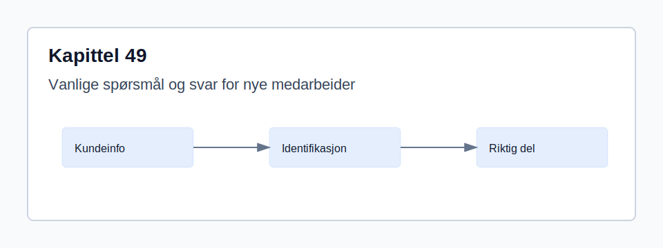

## Tekniske systemillustrasjoner

## Grundig forklaring
Hvordan vanlige nyansattspørsmål besvares presist må forstås både teknisk og praktisk. I marine reservedeler er det sjelden nok å vite hva kunden kaller delen. Medarbeideren må forstå hvilken funksjon delen har, hvor den sitter, hvilken motorvariant den tilhører, og hva som skjer dersom feil del bestilles. Derfor skal tekniske data, kundens beskrivelse og dokumentert katalogoppslag alltid vurderes sammen.

En god sak har fire kjennetegn: den har tydelig identifikasjon, tydelig problem- eller delbeskrivelse, tydelig beslutningsgrunnlag og tydelig oppfølging. Dersom ett av disse punktene mangler, skal saken markeres som usikker før kunden får et bindende svar.

## Praktisk verkstedeksempel
Et verksted står med demontert komponent og trenger rask avklaring. Medarbeideren registrerer kunde, fartøy, motorinformasjon og tidsfrist, ber om bilder av typeplate og komponent, sjekker katalog og lager, og sender et kort skriftlig svar med valgt del, grunnlag for valget og neste oppdateringstidspunkt.

## Kundesupporteksempel
Kunde: 'Motoren går dårlig, kan dere sende riktig del?' Profesjonelt svar: 'Vi kan hjelpe, men først må vi skille mellom symptom og delbehov. Send serienummer, bilde av motorplate, bilde av området feilen gjelder og en kort beskrivelse av når feilen oppstår. Da kan vi foreslå riktig del eller riktig neste feilsøkingstrinn.'

## Vanlige feil og årsaker
- feil eller ufullstendig serienummer.
- delnummer som er erstattet uten at saken dokumenteres.
- symptom som tolkes som delbehov uten feilsøking.
- kunde har bilde av lignende del, men ikke korrekt motorvariant.
- manglende avklaring av antall, side, posisjon eller leveringstid.

## Feilsøkingsflyt
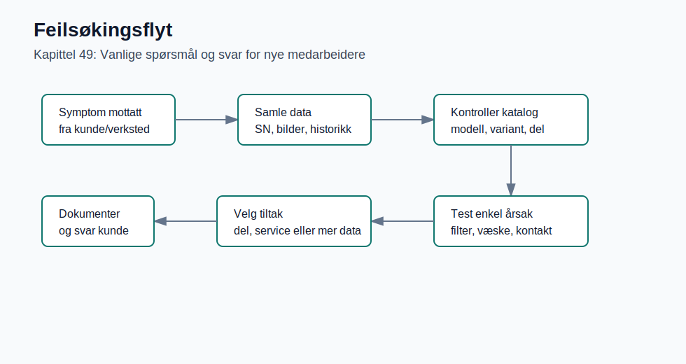

```mermaid
flowchart TD
    A[Symptom eller forespørsel mottatt] --> B[Samle serienummer, bilder og historikk]
    B --> C{Er motor og variant sikkert identifisert?}
    C -- Nei --> D[Be om mer dokumentasjon før del bekreftes]
    C -- Ja --> E[Kontroller delnummer og posisjon i katalog]
    E --> F{Stemmer symptom med foreslått del?}
    F -- Nei --> G[Foreslå feilsøking eller teknisk kontroll]
    F -- Ja --> H[Kontroller lager, pris og levering]
    H --> I[Send dokumentert kundesvar]
```

## Vedlikeholdsprosedyre
1. Avklar driftstimer, siste service og driftsmiljø.
2. Kontroller olje, filter, kjølevæske, sjøvannskrets, reimer, slanger og elektriske kontakter.
3. Sammenlign vedlikeholdsbehov med produsentens intervaller og faktisk bruk.
4. Anbefal servicekit når flere slitedeler bør skiftes samtidig.
5. Dokumenter hva som er anbefalt, hva kunden bestiller og eventuelle avvik fra normal prosedyre.

## Serienummeridentifikasjon
Serienummeridentifikasjon starter med å finne typeplate, motornummer eller annen unik identifikasjon. Be om bilde, ikke bare avskrift, fordi feil tegn, mellomrom og prefiks kan endre katalogoppslaget. Når serienummer ikke finnes, bygges identifikasjonen med modell, produksjonsår, bilder, tidligere fakturaer, servicehistorikk og delnummer fra monterte komponenter.

Minimumsdata bør være: fabrikat, modell, serienummer, eventuell product number/arrangement/CPL/motornummer, bilde av typeplate og bilde av motorens installasjon. Ved tvil skal saken stoppes for avklaring før del bekreftes.

## Reservedelsidentifikasjon
Reservedelsidentifikasjon skal bekrefte delnummer, posisjon, antall per motor, variant, side og eventuell erstatning. Dersom kunden oppgir et gammelt nummer, må det kontrolleres mot supersession. Dersom kunden bare sender bilde, skal bildet brukes som støtte, ikke som eneste grunnlag for bestilling.

Sjekk alltid om delnummeret gjelder enkeltkomponent, reparasjonssett, servicekit eller komplett enhet. Kontroller også om varen er høyre/venstre, gammel/ny type, standard/oversize eller knyttet til en bestemt produksjonsperiode.

## Bestillingsprosedyre
1. Opprett eller oppdater sak med kunde, fartøy, kontaktperson og tidsfrist.
2. Verifiser motoridentifikasjon og lagre bildedokumentasjon.
3. Finn korrekt delnummer i relevant katalog eller leverandørgrunnlag.
4. Kontroller supersession, antall, lagerstatus, pris, returvilkår og leveringstid.
5. Send ordrebekreftelse med delnummer, beskrivelse, antall, pris, levering og forbehold.
6. Følg opp leveransen til kunden har mottatt varen eller saken er lukket.

## Kvalitetspunkter før svar
- Har vi nok data til å gi et sikkert svar?
- Er delnummeret kontrollert mot riktig motorvariant?
- Er kundens tidsfrist realistisk med valgt fraktmåte?
- Er eventuelle forbehold skrevet tydelig?
- Kan en kollega forstå beslutningen ved å lese saken senere?

## Kapittelsammendrag
Hovedpoenget i kapittel 49 er at profesjonelt reservedelsarbeid krever struktur. Teknisk kunnskap, engelske fagtermer, praktisk feilsøking, dokumentasjon og kundedialog må henge sammen. Når medarbeideren jobber systematisk, reduseres feilbestillinger, kunden får bedre svar, og verkstedet kan planlegge arbeidet tryggere.

## Kryssreferanser
- For forrige tema, se kapittel 48: Ordliste over marine fagbegreper.
- For neste tema, se kapittel 50: Referanseliste over relevante leverandører og dokumentasjon.
- For grunnleggende identifikasjon, se kapittel 12 og 17.
- For merkevise eksempler, se kapitlene 26-32.

## Fordypning for intern opplæring
Dette kapitlet skal brukes som arbeidsstandard, ikke bare som lesestoff. Når en ny medarbeider møter en sak om spørsmål og svar, skal vedkommende trene på å gå rolig fra fakta til vurdering og deretter til handling. I en marinemotorforhandler er konsekvensen av en feil ofte større enn verdien av selve delen. En feil impeller, feil sensor, feil filterinnsats eller feil pakningssett kan føre til tapt verkstedtid, utsatt avgang, irritert kunde og i verste fall ny driftsstans. Derfor skal hver sak behandles som en teknisk beslutning med sporbar dokumentasjon.

Profesjonelt nivå i dette kapitlet betyr at medarbeideren kan arbeide sikkert med ofte stilte spørsmål. Før kunden får et bindende svar, skal opplysningene i saken kontrolleres mot motorens identitet, faktisk installasjon og relevant produsentterminologi. Det praktiske målet er ikke å finne et raskt nummer, men å kunne forklare hvorfor valgt del, kontrollpunkt eller kundesvar er riktig for akkurat denne motoren. Når informasjon mangler, skal medarbeideren beskrive hva som mangler, hvorfor det er nødvendig, og hvilket neste steg som bringer saken videre.

## Tekniske forklaringer
Teknisk forståelse i dette kapitlet skal bygges rundt mønstre i support, standardiserte svar, faglig presisjon og eskalering. Medarbeideren må skille mellom synlig symptom, sannsynlig systemfeil og bestillbar komponent. En del kan se riktig ut på bilde, men likevel være feil dersom posisjon, variant, rating, kjøleroppsett, elektrisk plugg, monteringsside eller servicehistorikk ikke stemmer. Derfor skal teknisk vurdering alltid kobles til både funksjon og dokumentasjon: hva gjør komponenten, hvilket system påvirker den, og hvilken produsentkilde bekrefter at den passer.

I praksis betyr dette at tekniske data skal kobles til motorens faktiske installasjon. Marine motorer står ofte trangt, er utsatt for salt, vibrasjon, fukt og ujevnt belastningsmønster, og de kan være bygget om gjennom mange år. En motor kan ha original kjøler, ettermontert eksosbend, alternativ dynamo, endret filterbrakett eller annen sjøvannspumpe enn standard. Slike forhold gjør at delidentifikasjon må bygge på både produsentdata og synlig dokumentasjon fra motoren.

Produsentterminologi er en del av den tekniske forståelsen. Bruk uttrykk som Serial Number, Engine Number, Part Number, Service Kit, Exploded View, Supersession når de er relevante. Ikke oversett dem på en måte som fjerner presisjon. Skriv for eksempel «Engine Serial Number (ESN)» første gang og deretter «ESN» i saken dersom produsenten bruker dette. Skriv «Arrangement Number» når CAT-data krever det, «Product Number» når Volvo Penta bruker det, «CPL» når Cummins-konfigurasjon må kontrolleres, og «Model Code» når Yanmar-identifikasjon bygger på modellkode. Dette gjør dialogen med internasjonale leverandører mer presis.

## Illustrasjonsforslag
- Oversiktsdiagram som viser hvor spørsmål og svar passer inn i total arbeidsflyt fra kundeforespørsel til levert del.
- Nærbilde av typeplate/motorskilt med markering av serienummer, motornummer, modell og eventuell variantkode.
- Sprengskisse med markert posisjon, delnummer, antall per motor og mulige alternative versjoner.
- Feilsøkingsflyt med beslutningspunkter: mangler data, stemmer symptom, kreves mer teknisk kontroll, kan ordre bekreftes.
- Sammenligningsbilde av gammel og ny del der forskjell i tilkobling, side, lengde eller sensorplugg er markert.

## Virkelige verkstedseksempler
Eksempel 1: Et verksted står med en demontert komponent på benken og kunden venter på avklaring før fartøyet kan settes tilbake i drift. Verkstedet sender et nærbilde av delen, men ingen motorplate. En uerfaren medarbeider kan bli fristet til å søke på nummeret som står på støpegodset. En profesjonell medarbeider svarer at støpenummer ikke nødvendigvis er bestillbart delnummer, ber om bilde av typeplate, oversiktsbilde av motoren og bilde av monteringsstedet, og forklarer at dette hindrer feilbestilling. Når informasjonen kommer, kontrolleres delnummer mot sprengskisse, posisjon og antall. Først da gis pris og leveringstid.

Eksempel 2: En kunde ringer sent på dagen og sier at motoren har høy temperatur etter service. Kunden ønsker ny termostat. Medarbeideren skal ikke automatisk konkludere med termostatfeil. Spørsmålene bør avklare om impeller er byttet, om sjøvannsfilteret er rent, om kjølevæskenivået er riktig, om alarmen kommer ved tomgang eller belastning, og om det finnes lekkasje rundt varmeveksler eller slanger. Dersom kunden likevel vil bestille termostat, dokumenteres at feilsøking er anbefalt, og delnummer kontrolleres mot serienummer før ordre.

Eksempel 3: En intern selger mottar en gammel faktura med et delnummer som ikke lenger finnes. Riktig prosess er å kontrollere supersession, se om ny del krever tilhørende pakning, boltsett eller adapter, og notere både gammelt og nytt nummer i saken. Kunden skal få vite at delen er erstattet, hva som leveres, og om det finnes monteringsforbehold.

## Reservedelsidentifisering i praksis
Reservedelsidentifisering skal følge en fast rekkefølge. Først kontrolleres motorens identitet. Deretter kontrolleres delens system: drivstoff, luft, kjøling, smøring, eksos, elektrisk eller mekanisk kraftoverføring. Så kontrolleres posisjon i sprengskisse eller parts list. Til slutt kontrolleres antall, variant, supersession og leveringsstatus. Denne rekkefølgen hindrer at medarbeideren hopper direkte fra kundens ord til et tilfeldig delnummer.

Når en del har synlig nummer, må nummeret tolkes riktig. Mange komponenter har produksjonsnummer, støpenummer, leverandørnummer eller revisjonskode som ikke er det samme som bestillbart part number. Et filter kan ha nummer fra filterprodusent, men motorprodusentens parts catalogue kan bruke et annet nummer. En pumpe kan ha nummer på lokk, hus og komplett enhet. Spør derfor alltid: gjelder nummeret komplett del, reparasjonssett, underkomponent eller produsentens råkomponent?

## Serienummer og motornummer
Serienummer og motornummer er grunnlaget for korrekt katalogoppslag. Be kunden sende bilde av typeplate eller dataplate. Dersom kunden skriver nummeret manuelt, skal nummeret likevel kontrolleres mot bilde når det er mulig. Noter hele nummeret, inkludert prefiks, suffiks, bindestrek, mellomrom og eventuelle bokstaver. På enkelte produsenter kan små forskjeller peke til forskjellig produksjonsperiode, rating eller konfigurasjon.

Bruk motornummer sammen med modell, variant og applikasjon. En motor som driver generator kan ha andre deler enn en fremdriftsmotor. En motor i yrkesbåt kan ha annen rating enn samme motor i fritidsbåt. En eldre motor kan være bygget om med ny dynamo, annen sjøvannspumpe eller uoriginal filterbrakett. Dersom typeplate mangler, bygg identifikasjonen gjennom flere kilder: servicebok, tidligere faktura, bilder av motorens sider, nummer på pumpe, filter, turbo og gear, samt opplysninger om fartøy og produksjonsår.

## Feilsøking steg for steg
1. Definer symptomet med kundens egne ord og skriv det i saken. Skill mellom «kunden ønsker del» og «kunden beskriver feil».
2. Avklar når feilen oppstår: start, tomgang, belastning, marsjfart, varm motor, kald motor eller etter nylig service.
3. Kontroller grunnleggende forhold: væskenivå, filter, luft i drivstoff, sjøvannsstrøm, reimer, elektriske kontakter, sikringer og synlige lekkasjer.
4. Knytt symptomet til system: lav effekt peker ofte mot luft/drivstoff/eksos, høy temperatur mot kjøling, lavt oljetrykk mot smøring/sensor, startproblem mot batteri/starter/gløding/drivstoff.
5. Be om bilder eller måledata dersom symptomet ikke kan kobles sikkert til en del. Dette kan være bilde av alarmdisplay, trykkmåling, temperaturmåling eller bilde av montert komponent.
6. Kontroller relevant delnummer mot serienummer og variant. Dersom flere alternativer finnes, forklar kunden hva som skiller dem.
7. Dokumenter anbefalt tiltak, usikkerhet og eventuelle forbehold før ordre bekreftes.

## Vedlikehold
Vedlikehold skal vurderes mot driftstimer, produsentens maintenance schedule og faktisk driftsmiljø. Marine motorer som går korte turer, mye tomgang eller i salt miljø kan trenge hyppigere kontroll enn standard intervall antyder. Nye medarbeidere skal lære å spørre om siste service, hvilke filter som ble byttet, hvilken olje som ble brukt, om impeller er kontrollert, og om kjølevæske eller anoder er byttet etter plan.

En god vedlikeholdsanbefaling er konkret. I stedet for å skrive «ta service», bør medarbeideren foreslå relevante deler: olje- og drivstoffilter, luftfilter, impeller, reim, pakninger, anoder, kjølevæske og eventuelt servicekit. Dersom kunden har ukjent servicehistorikk, bør komplett servicekit vurderes. Dersom kunden har hatt overoppheting, bør sjøvannskrets og varmeveksler kontrolleres før bare én komponent byttes.

## Vanlige feil
- Serienummer leses feil fordi et tegn forveksles, for eksempel O/0 eller I/1.
- Kunden oppgir modellnavn, men ikke variant, rating eller applikasjon.
- Del velges ut fra bilde alene uten kontroll mot sprengskisse eller produsentkatalog.
- Supersession aksepteres uten å kontrollere om ny del krever tilbehør, pakning eller ombygging.
- Hastepress gjør at leveringsløfte gis før lagerstatus og fraktmulighet er bekreftet.
- Saksnotat mangler grunnlaget for beslutningen, slik at kollega ikke kan etterprøve valget.

## Kontrollspørsmål
- Hva er den viktigste tekniske risikoen i en sak som gjelder spørsmål og svar?
- Hvilke opplysninger må dokumenteres før bindende delnummer bekreftes?
- Hvordan forklarer du kunden hvorfor bilde av typeplate er nødvendig?
- Når bør du stoppe en ordre og be om mer dokumentasjon?
- Hvilke engelske produsentuttrykk bør du kunne bruke i denne typen sak?
- Hvordan dokumenterer du at et delnummer er erstattet av et nytt nummer?

## Praktisk sjekkliste for medarbeider
- Les saken som om en kollega skal overta den i morgen.
- Kontroller at motoridentifikasjon er dokumentert med bilde eller sikker kilde.
- Sjekk at delnummeret er knyttet til riktig posisjon i katalogen.
- Skriv tydelig om kunden har bedt om enkeltkomponent, servicekit eller komplett enhet.
- Noter om varen er spesialbestilling, utgått, erstattet eller ikke returbar.
- Send kundesvar med neste steg, ikke bare et løst delnummer.

## Kapittelspesifikk systemforståelse
For dette kapitlet er kjernen å forstå vanlige spørsmål og svar. Medarbeideren skal kunne forklare dette med praktiske ord til både kunde og kollega. Det betyr at teknisk teori må kobles til konkrete handlinger: hvilke data skal innhentes, hvilke komponenter kan være berørt, hvilken produsentterminologi skal brukes, og hva må dokumenteres før saken kan gå videre. Vanlige spørsmål skal besvares med prinsipper som kan brukes i nye saker.

Når systemet vurderes, skal medarbeideren først plassere problemet i riktig teknisk sammenheng. Dersom kunden beskriver en alarm, må man finne ut om alarmen kommer fra reelt mekanisk avvik, elektrisk sensorfeil, feil etter service eller feil tolkning av instrumentet. Dersom kunden beskriver en del, må man avklare om kunden mener komplett enhet, servicekit, reparasjonssett eller enkeltkomponent. Dersom kunden beskriver motoren med vanlig navn, må man kontrollere om produsenten bruker mer presise begreper i katalogen.

## Komponentoversikt og arbeidsgrense
Relevante komponenter og opplysninger i dette kapitlet omfatter: FAQ, onboarding, første kundesvar, usikre data, hasteordre og delnummer. Listen er ikke ment som en erstatning for produsentens parts catalogue, men som en praktisk påminnelse om hva nye medarbeidere skal tenke på før de søker del. I interne saker skal komponentnavn skrives så presist som mulig. Bruk for eksempel «sjøvannspumpe / raw water pump» i stedet for bare «pumpe» når funksjonen er kjent, og «varmeveksler / heat exchanger» i stedet for bare «kjøler» når det er den komponenten saken gjelder.

Arbeidsgrensen for en reservedelsmedarbeider er også viktig. Medarbeideren skal ikke overta mekanikerens ansvar for demontering, måling eller diagnose på motoren, men skal kunne stille riktige spørsmål og foreslå riktig dokumentasjon. Når en sak går fra enkel delidentifikasjon til teknisk diagnose, skal dette markeres i saken. Da kan verksted, teknisk ansvarlig eller leverandør involveres med et klart spørsmål og et ryddig faktagrunnlag.

## Praktisk beslutningsregel
Bruk denne regelen i alle saker knyttet til kapitlet: Hvis motoridentifikasjon, komponentposisjon eller symptom ikke er sikkert nok dokumentert, skal medarbeideren ikke gi bindende delbekreftelse. Kunden kan få et foreløpig svar, men svaret må inneholde hva som mangler, hvorfor det mangler, og hva som skjer når informasjonen er mottatt. Dette er ikke treg service; det er profesjonell risikokontroll.

## Målrettet fordypning kapittel 41-50
### Vanlige spørsmål som opplæringsspeil
FAQ-kapitlet viser hva nye medarbeidere ofte er usikre på. Spørsmål som «kan jeg bestille på bilde?», «hva gjør jeg uten serienummer?» og «hvorfor trenger vi product number?» bør besvares med prinsipper, ikke bare fasitsvar. Prinsippet er at korrekt identifikasjon beskytter kunden, verkstedet og selskapet.

Instruktører bør bruke FAQ til rollespill. En deltaker spiller kunde som mangler informasjon, en annen svarer profesjonelt og forklarer hvorfor mer data trengs. Dette trener både teknisk presisjon og kundedialog. Gode svar er tydelige, vennlige og konkrete om neste steg.

### Praktisk anvendelse i opplæring
Bruk kapitlet til en avsluttende case der deltakeren må vise selvstendig vurdering. Deltakeren skal identifisere teknisk risiko, skrive kundesvar, velge dokumentasjon, forklare eventuelle forbehold og angi når saken skal eskaleres. Dette er særlig viktig i sluttkapitlene, fordi de binder sammen teknikk, kvalitet, læring og praktisk drift.

## Realistisk opplæring i praksis
### Verkstedhistorie
En typisk sak i dette temaet starter med spørsmål gjentas i flere kanaler. Verkstedet trenger et raskt svar, men den erfarne medarbeideren stopper opp og spør først: hva vet vi sikkert, hva antar vi, og hva kan gi følgeskade hvis vi tar feil? I praksis betyr det at standardiserte svar må kobles til bilde, serienummer, komponentposisjon og kundens symptom før saken lukkes. Historien skal brukes i opplæring som en øvelse i å skrive et kort saksnotat: observasjon, vurdering, neste handling og forbehold.

### Kundehistorie
Kunden beskriver ofte problemet med driftsspråk: «motoren går tungt», «alarm kommer etter ti minutter», «jeg trenger den samme delen som sist» eller «båten skal ut i morgen». En profesjonell respons er rolig og konkret: bekreft behovet, forklar hvorfor identifikasjon trengs, be om riktig dokumentasjon og gi et realistisk tidspunkt for neste svar. Ikke korriger kunden unødvendig; oversett kundens språk til teknisk språk i saken.

### Typiske feil nye ansatte gjør
- søker på første synlige nummer uten å avklare om det er støpenummer, leverandørnummer eller bestillbart part number.
- lover levering før lagerstatus, frakt og returvilkår er kontrollert.
- antar at tidligere faktura alltid gjelder samme motorvariant.
- blander symptom og årsak, spesielt ved varme, lav effekt, startproblem og alarm.
- skriver for korte notater slik at kollega ikke kan forstå hvorfor valget ble tatt.

### Tips fra erfarne mekanikere og reservedelsselgere
- Se alltid etter systemet rundt delen: slanger, braketter, sensorer, reimer, kjølere og tilkoblinger forteller ofte mer enn delen alene.
- Still ett presist spørsmål om gangen når kunden er stresset; mange dårlige svar kommer av for lange spørsmålslister.
- Sammenlign gammel og ny del mot funksjon, ikke bare form. Riktig del skal passe, men også løse riktig problem.
- En erfaren reservedelsselger tenker i risiko: Hva er billigst å avklare nå, og hva blir dyrt hvis vi hopper over det?

### Vanlige kundespørsmål
| Spørsmål fra kunde | Profesjonelt svar |
|---|---|
| «Kan du bare sende samme del som sist?» | «Ja, hvis vi først bekrefter at det gjelder samme motor, samme posisjon og ingen supersession siden sist.» |
| «Holder det med bilde?» | «Bilde hjelper, men vi trenger også motoridentitet for å sikre variant og delnummer.» |
| «Hvorfor tar dette tid?» | «Fordi feil del kan gi ny driftsstans. Vi kontrollerer grunnlaget før vi lover levering.» |

### Beslutningstre for saken
| Trinn | Spørsmål | Handling |
|---|---|---|
| 1 | Er motoridentitet dokumentert med bilde eller sikker historikk? | Hvis nei: be om typeplate/dataplate eller alternativ dokumentasjon. |
| 2 | Er komponentens funksjon og posisjon kjent? | Hvis nei: be om oversiktsbilde og bilde av monteringssted. |
| 3 | Stemmer kundens symptom med delen som ønskes? | Hvis nei: anbefal feilsøking før del bestilles. |
| 4 | Finnes det supersession, kit eller variantvalg? | Kontroller produsentkilde og skriv forbehold i saken. |
| 5 | Kan pris, levering og returvilkår bekreftes? | Send dokumentert svar med neste steg og tydelig gyldighet. |

### Rask oppslagstabell
| Situasjon | Kontroller først | Vanlig fallgruve |
|---|---|---|
| Hasteordre | sikker motor-ID, lager, fraktfrist | levering loves før teknisk kontroll |
| Del fra bilde | posisjon, skala, tilkoblinger, nummer | bilde brukes som eneste beslutningsgrunnlag |
| Gammelt delnummer | supersession og kitinnhold | ny del krever ekstra pakning eller adapter |
| Uklart symptom | driftssituasjon, alarm, siste service | symptom blir tolket som sikker komponentfeil |

### Praktisk sjekkliste og inspeksjonsrutine
- Start med motoridentitet: fabrikat, modell, serienummer, variant, applikasjon og bilde av skilt.
- Kontroller området rundt komponenten: lekkasje, korrosjon, knekte fester, slitasje, varmemerker og uoriginale endringer.
- Spør om siste vedlikehold: olje, filter, impeller, reimer, kjølevæske, anoder og drivstoffilter.
- Noter driftstype: fritidsbruk, yrkesbruk, generator, fremdrift, tomgangsdrift eller langvarig høy belastning.
- Avklar om saken gjelder akutt drift, planlagt service, reklamasjon eller lagerpåfyll.

### Generelle vedlikeholdsintervaller som opplæringspunkt
| Kontrollpunkt | Typisk vurdering i opplæring | Må verifiseres |
|---|---|---|
| Olje og oljefilter | ofte basert på timer og kalender | produsentens maintenance schedule |
| Drivstoffilter/vannutskiller | hyppigere ved dårlig drivstoff eller sesongstart | motor- og filterspesifikasjon |
| Impeller og sjøvannskrets | kontrolleres særlig før sesong og etter varmgang | produsentens intervall og installasjon |
| Reimer, slanger og klemmer | visuell kontroll ved service og feilsøking | dimensjon, stramming og delnummer |

### Produsentverifikasjon
Alle konkrete delnumre, momentverdier, serviceintervaller, garantikrav, programvaredata og produsentspesifikke grenser skal kontrolleres mot offisiell produsentdokumentasjon før de brukes i tilbud, ordre eller verkstedinstruks. Marker tydelig i saken når svaret bygger på antakelse, eldre historikk, bilde uten motor-ID eller generell erfaring. Intervaller i tabellen er generelle opplæringspunkter. Faktiske intervaller styres av produsent, motorvariant, driftstimer, kalenderkrav, belastning og miljø.

## Produsentverifikasjon og faglig forbehold
Denne manualen skal brukes som intern opplæring og arbeidsmetode. Produsentspesifikke delnumre, intervaller, momentverdier, garantikrav og tekniske grenseverdier skal verifiseres mot gjeldende produsentdokumentasjon før de brukes i kundeordre eller verkstedinstruks. Marker saken internt dersom opplysningen bygger på antakelse, eldre historikk eller bilde uten bekreftet motoridentitet.

## Quiz med fasit
1. Hvilke tekniske data bør alltid samles før en del bekreftes?
2. Hvorfor er engelsk terminologi viktig i marine reservedeler?
3. Hva bør gjøres dersom kunden bare sender et bilde av delen?
4. Hvilke punkter bør kontrolleres før ordrebekreftelse sendes?
5. Hvorfor skal feilsøking dokumenteres, selv når kunden allerede ber om en bestemt del?

### Svar
1. Fabrikat, modell, serienummer, variantdata, bilde av typeplate, delnummer, posisjon og kundens symptombeskrivelse.
2. Fordi kataloger, portaler, servicemanualer og leverandørdialog ofte bruker engelske begreper som må forstås presist.
3. Be om serienummer, oversiktsbilde av motoren og eventuelle nummer på delen; bildet brukes som støtte, ikke eneste grunnlag.
4. Delnummer, antall, variant, pris, lagerstatus, leveringstid, frakt, returvilkår og eventuelle forbehold.
5. Fordi symptomet kan ha flere årsaker, og dokumentasjon viser hvorfor anbefalingen ble gitt.

---

# Kapittel 50: Referanseliste over relevante leverandører og dokumentasjon

## Kapittelrolle
Dette kapitlet gir en grundig praktisk innføring i referanser. Temaet er viktig fordi reservedelsarbeid i marine miljøer kombinerer teknisk forståelse, presis kundedialog, dokumentert saksbehandling og realistisk leveranseoppfølging. Målet er at en ny medarbeider skal kunne bruke kunnskapen direkte i arbeid med verksted, kunde, lager og leverandør.

## Læringsmål
Etter kapitlet skal deltakeren kunne:
- forklare hovedbegrepene innen referanser
- bruke serienummer, modellinformasjon og delnummer i praktisk reservedelsarbeid
- kommunisere trygt med kunde, verksted, lager og leverandør
- dokumentere beslutninger slik at andre kan etterprøve saken
- kjenne igjen vanlige feil og velge riktig neste handling

## English technical terminology
- **Serial Number:** engelsk fagterm som ofte brukes i kataloger, servicelitteratur, leverandørportaler og internasjonal kundedialog.
- **Part Number:** engelsk fagterm som ofte brukes i kataloger, servicelitteratur, leverandørportaler og internasjonal kundedialog.
- **Engine Model:** engelsk fagterm som ofte brukes i kataloger, servicelitteratur, leverandørportaler og internasjonal kundedialog.
- **Variant:** engelsk fagterm som ofte brukes i kataloger, servicelitteratur, leverandørportaler og internasjonal kundedialog.
- **Service Kit:** engelsk fagterm som ofte brukes i kataloger, servicelitteratur, leverandørportaler og internasjonal kundedialog.
- **Troubleshooting:** engelsk fagterm som ofte brukes i kataloger, servicelitteratur, leverandørportaler og internasjonal kundedialog.
- **Maintenance:** engelsk fagterm som ofte brukes i kataloger, servicelitteratur, leverandørportaler og internasjonal kundedialog.
- **Ordering Procedure:** engelsk fagterm som ofte brukes i kataloger, servicelitteratur, leverandørportaler og internasjonal kundedialog.
- **Supersession:** engelsk fagterm som ofte brukes i kataloger, servicelitteratur, leverandørportaler og internasjonal kundedialog.
- **Technical Support:** engelsk fagterm som ofte brukes i kataloger, servicelitteratur, leverandørportaler og internasjonal kundedialog.

## Hoveddiagram

## Tekniske systemillustrasjoner

## Grundig forklaring
Hvordan kilder, kataloger og dokumentasjon vurderes må forstås både teknisk og praktisk. I marine reservedeler er det sjelden nok å vite hva kunden kaller delen. Medarbeideren må forstå hvilken funksjon delen har, hvor den sitter, hvilken motorvariant den tilhører, og hva som skjer dersom feil del bestilles. Derfor skal tekniske data, kundens beskrivelse og dokumentert katalogoppslag alltid vurderes sammen.

En god sak har fire kjennetegn: den har tydelig identifikasjon, tydelig problem- eller delbeskrivelse, tydelig beslutningsgrunnlag og tydelig oppfølging. Dersom ett av disse punktene mangler, skal saken markeres som usikker før kunden får et bindende svar.

## Praktisk verkstedeksempel
Et verksted står med demontert komponent og trenger rask avklaring. Medarbeideren registrerer kunde, fartøy, motorinformasjon og tidsfrist, ber om bilder av typeplate og komponent, sjekker katalog og lager, og sender et kort skriftlig svar med valgt del, grunnlag for valget og neste oppdateringstidspunkt.

## Kundesupporteksempel
Kunde: 'Motoren går dårlig, kan dere sende riktig del?' Profesjonelt svar: 'Vi kan hjelpe, men først må vi skille mellom symptom og delbehov. Send serienummer, bilde av motorplate, bilde av området feilen gjelder og en kort beskrivelse av når feilen oppstår. Da kan vi foreslå riktig del eller riktig neste feilsøkingstrinn.'

## Vanlige feil og årsaker
- feil eller ufullstendig serienummer.
- delnummer som er erstattet uten at saken dokumenteres.
- symptom som tolkes som delbehov uten feilsøking.
- kunde har bilde av lignende del, men ikke korrekt motorvariant.
- manglende avklaring av antall, side, posisjon eller leveringstid.

## Feilsøkingsflyt
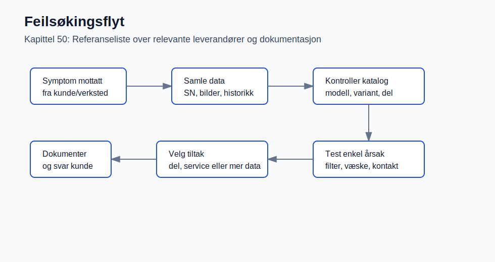

```mermaid
flowchart TD
    A[Symptom eller forespørsel mottatt] --> B[Samle serienummer, bilder og historikk]
    B --> C{Er motor og variant sikkert identifisert?}
    C -- Nei --> D[Be om mer dokumentasjon før del bekreftes]
    C -- Ja --> E[Kontroller delnummer og posisjon i katalog]
    E --> F{Stemmer symptom med foreslått del?}
    F -- Nei --> G[Foreslå feilsøking eller teknisk kontroll]
    F -- Ja --> H[Kontroller lager, pris og levering]
    H --> I[Send dokumentert kundesvar]
```

## Vedlikeholdsprosedyre
1. Avklar driftstimer, siste service og driftsmiljø.
2. Kontroller olje, filter, kjølevæske, sjøvannskrets, reimer, slanger og elektriske kontakter.
3. Sammenlign vedlikeholdsbehov med produsentens intervaller og faktisk bruk.
4. Anbefal servicekit når flere slitedeler bør skiftes samtidig.
5. Dokumenter hva som er anbefalt, hva kunden bestiller og eventuelle avvik fra normal prosedyre.

## Serienummeridentifikasjon
Serienummeridentifikasjon starter med å finne typeplate, motornummer eller annen unik identifikasjon. Be om bilde, ikke bare avskrift, fordi feil tegn, mellomrom og prefiks kan endre katalogoppslaget. Når serienummer ikke finnes, bygges identifikasjonen med modell, produksjonsår, bilder, tidligere fakturaer, servicehistorikk og delnummer fra monterte komponenter.

Minimumsdata bør være: fabrikat, modell, serienummer, eventuell product number/arrangement/CPL/motornummer, bilde av typeplate og bilde av motorens installasjon. Ved tvil skal saken stoppes for avklaring før del bekreftes.

## Reservedelsidentifikasjon
Reservedelsidentifikasjon skal bekrefte delnummer, posisjon, antall per motor, variant, side og eventuell erstatning. Dersom kunden oppgir et gammelt nummer, må det kontrolleres mot supersession. Dersom kunden bare sender bilde, skal bildet brukes som støtte, ikke som eneste grunnlag for bestilling.

Sjekk alltid om delnummeret gjelder enkeltkomponent, reparasjonssett, servicekit eller komplett enhet. Kontroller også om varen er høyre/venstre, gammel/ny type, standard/oversize eller knyttet til en bestemt produksjonsperiode.

## Bestillingsprosedyre
1. Opprett eller oppdater sak med kunde, fartøy, kontaktperson og tidsfrist.
2. Verifiser motoridentifikasjon og lagre bildedokumentasjon.
3. Finn korrekt delnummer i relevant katalog eller leverandørgrunnlag.
4. Kontroller supersession, antall, lagerstatus, pris, returvilkår og leveringstid.
5. Send ordrebekreftelse med delnummer, beskrivelse, antall, pris, levering og forbehold.
6. Følg opp leveransen til kunden har mottatt varen eller saken er lukket.

## Kvalitetspunkter før svar
- Har vi nok data til å gi et sikkert svar?
- Er delnummeret kontrollert mot riktig motorvariant?
- Er kundens tidsfrist realistisk med valgt fraktmåte?
- Er eventuelle forbehold skrevet tydelig?
- Kan en kollega forstå beslutningen ved å lese saken senere?

## Kapittelsammendrag
Hovedpoenget i kapittel 50 er at profesjonelt reservedelsarbeid krever struktur. Teknisk kunnskap, engelske fagtermer, praktisk feilsøking, dokumentasjon og kundedialog må henge sammen. Når medarbeideren jobber systematisk, reduseres feilbestillinger, kunden får bedre svar, og verkstedet kan planlegge arbeidet tryggere.

## Kryssreferanser
- For forrige tema, se kapittel 49: Vanlige spørsmål og svar for nye medarbeidere.
- For grunnleggende identifikasjon, se kapittel 12 og 17.
- For merkevise eksempler, se kapitlene 26-32.

## Fordypning for intern opplæring
Dette kapitlet skal brukes som arbeidsstandard, ikke bare som lesestoff. Når en ny medarbeider møter en sak om referanser og dokumentasjon, skal vedkommende trene på å gå rolig fra fakta til vurdering og deretter til handling. I en marinemotorforhandler er konsekvensen av en feil ofte større enn verdien av selve delen. En feil impeller, feil sensor, feil filterinnsats eller feil pakningssett kan føre til tapt verkstedtid, utsatt avgang, irritert kunde og i verste fall ny driftsstans. Derfor skal hver sak behandles som en teknisk beslutning med sporbar dokumentasjon.

Profesjonelt nivå i dette kapitlet betyr at medarbeideren kan arbeide sikkert med referanser og kilder. Før kunden får et bindende svar, skal opplysningene i saken kontrolleres mot motorens identitet, faktisk installasjon og relevant produsentterminologi. Det praktiske målet er ikke å finne et raskt nummer, men å kunne forklare hvorfor valgt del, kontrollpunkt eller kundesvar er riktig for akkurat denne motoren. Når informasjon mangler, skal medarbeideren beskrive hva som mangler, hvorfor det er nødvendig, og hvilket neste steg som bringer saken videre.

## Tekniske forklaringer
Teknisk forståelse i dette kapitlet skal bygges rundt produsentmanualer, service bulletins, parts portals, kataloghistorikk og kildekontroll. Medarbeideren må skille mellom synlig symptom, sannsynlig systemfeil og bestillbar komponent. En del kan se riktig ut på bilde, men likevel være feil dersom posisjon, variant, rating, kjøleroppsett, elektrisk plugg, monteringsside eller servicehistorikk ikke stemmer. Derfor skal teknisk vurdering alltid kobles til både funksjon og dokumentasjon: hva gjør komponenten, hvilket system påvirker den, og hvilken produsentkilde bekrefter at den passer.

I praksis betyr dette at tekniske data skal kobles til motorens faktiske installasjon. Marine motorer står ofte trangt, er utsatt for salt, vibrasjon, fukt og ujevnt belastningsmønster, og de kan være bygget om gjennom mange år. En motor kan ha original kjøler, ettermontert eksosbend, alternativ dynamo, endret filterbrakett eller annen sjøvannspumpe enn standard. Slike forhold gjør at delidentifikasjon må bygge på både produsentdata og synlig dokumentasjon fra motoren.

Produsentterminologi er en del av den tekniske forståelsen. Bruk uttrykk som Serial Number, Engine Number, Part Number, Service Kit, Exploded View, Supersession når de er relevante. Ikke oversett dem på en måte som fjerner presisjon. Skriv for eksempel «Engine Serial Number (ESN)» første gang og deretter «ESN» i saken dersom produsenten bruker dette. Skriv «Arrangement Number» når CAT-data krever det, «Product Number» når Volvo Penta bruker det, «CPL» når Cummins-konfigurasjon må kontrolleres, og «Model Code» når Yanmar-identifikasjon bygger på modellkode. Dette gjør dialogen med internasjonale leverandører mer presis.

## Illustrasjonsforslag
- Oversiktsdiagram som viser hvor referanser og dokumentasjon passer inn i total arbeidsflyt fra kundeforespørsel til levert del.
- Nærbilde av typeplate/motorskilt med markering av serienummer, motornummer, modell og eventuell variantkode.
- Sprengskisse med markert posisjon, delnummer, antall per motor og mulige alternative versjoner.
- Feilsøkingsflyt med beslutningspunkter: mangler data, stemmer symptom, kreves mer teknisk kontroll, kan ordre bekreftes.
- Sammenligningsbilde av gammel og ny del der forskjell i tilkobling, side, lengde eller sensorplugg er markert.

## Virkelige verkstedseksempler
Eksempel 1: Et verksted står med en demontert komponent på benken og kunden venter på avklaring før fartøyet kan settes tilbake i drift. Verkstedet sender et nærbilde av delen, men ingen motorplate. En uerfaren medarbeider kan bli fristet til å søke på nummeret som står på støpegodset. En profesjonell medarbeider svarer at støpenummer ikke nødvendigvis er bestillbart delnummer, ber om bilde av typeplate, oversiktsbilde av motoren og bilde av monteringsstedet, og forklarer at dette hindrer feilbestilling. Når informasjonen kommer, kontrolleres delnummer mot sprengskisse, posisjon og antall. Først da gis pris og leveringstid.

Eksempel 2: En kunde ringer sent på dagen og sier at motoren har høy temperatur etter service. Kunden ønsker ny termostat. Medarbeideren skal ikke automatisk konkludere med termostatfeil. Spørsmålene bør avklare om impeller er byttet, om sjøvannsfilteret er rent, om kjølevæskenivået er riktig, om alarmen kommer ved tomgang eller belastning, og om det finnes lekkasje rundt varmeveksler eller slanger. Dersom kunden likevel vil bestille termostat, dokumenteres at feilsøking er anbefalt, og delnummer kontrolleres mot serienummer før ordre.

Eksempel 3: En intern selger mottar en gammel faktura med et delnummer som ikke lenger finnes. Riktig prosess er å kontrollere supersession, se om ny del krever tilhørende pakning, boltsett eller adapter, og notere både gammelt og nytt nummer i saken. Kunden skal få vite at delen er erstattet, hva som leveres, og om det finnes monteringsforbehold.

## Reservedelsidentifisering i praksis
Reservedelsidentifisering skal følge en fast rekkefølge. Først kontrolleres motorens identitet. Deretter kontrolleres delens system: drivstoff, luft, kjøling, smøring, eksos, elektrisk eller mekanisk kraftoverføring. Så kontrolleres posisjon i sprengskisse eller parts list. Til slutt kontrolleres antall, variant, supersession og leveringsstatus. Denne rekkefølgen hindrer at medarbeideren hopper direkte fra kundens ord til et tilfeldig delnummer.

Når en del har synlig nummer, må nummeret tolkes riktig. Mange komponenter har produksjonsnummer, støpenummer, leverandørnummer eller revisjonskode som ikke er det samme som bestillbart part number. Et filter kan ha nummer fra filterprodusent, men motorprodusentens parts catalogue kan bruke et annet nummer. En pumpe kan ha nummer på lokk, hus og komplett enhet. Spør derfor alltid: gjelder nummeret komplett del, reparasjonssett, underkomponent eller produsentens råkomponent?

## Serienummer og motornummer
Serienummer og motornummer er grunnlaget for korrekt katalogoppslag. Be kunden sende bilde av typeplate eller dataplate. Dersom kunden skriver nummeret manuelt, skal nummeret likevel kontrolleres mot bilde når det er mulig. Noter hele nummeret, inkludert prefiks, suffiks, bindestrek, mellomrom og eventuelle bokstaver. På enkelte produsenter kan små forskjeller peke til forskjellig produksjonsperiode, rating eller konfigurasjon.

Bruk motornummer sammen med modell, variant og applikasjon. En motor som driver generator kan ha andre deler enn en fremdriftsmotor. En motor i yrkesbåt kan ha annen rating enn samme motor i fritidsbåt. En eldre motor kan være bygget om med ny dynamo, annen sjøvannspumpe eller uoriginal filterbrakett. Dersom typeplate mangler, bygg identifikasjonen gjennom flere kilder: servicebok, tidligere faktura, bilder av motorens sider, nummer på pumpe, filter, turbo og gear, samt opplysninger om fartøy og produksjonsår.

## Feilsøking steg for steg
1. Definer symptomet med kundens egne ord og skriv det i saken. Skill mellom «kunden ønsker del» og «kunden beskriver feil».
2. Avklar når feilen oppstår: start, tomgang, belastning, marsjfart, varm motor, kald motor eller etter nylig service.
3. Kontroller grunnleggende forhold: væskenivå, filter, luft i drivstoff, sjøvannsstrøm, reimer, elektriske kontakter, sikringer og synlige lekkasjer.
4. Knytt symptomet til system: lav effekt peker ofte mot luft/drivstoff/eksos, høy temperatur mot kjøling, lavt oljetrykk mot smøring/sensor, startproblem mot batteri/starter/gløding/drivstoff.
5. Be om bilder eller måledata dersom symptomet ikke kan kobles sikkert til en del. Dette kan være bilde av alarmdisplay, trykkmåling, temperaturmåling eller bilde av montert komponent.
6. Kontroller relevant delnummer mot serienummer og variant. Dersom flere alternativer finnes, forklar kunden hva som skiller dem.
7. Dokumenter anbefalt tiltak, usikkerhet og eventuelle forbehold før ordre bekreftes.

## Vedlikehold
Vedlikehold skal vurderes mot driftstimer, produsentens maintenance schedule og faktisk driftsmiljø. Marine motorer som går korte turer, mye tomgang eller i salt miljø kan trenge hyppigere kontroll enn standard intervall antyder. Nye medarbeidere skal lære å spørre om siste service, hvilke filter som ble byttet, hvilken olje som ble brukt, om impeller er kontrollert, og om kjølevæske eller anoder er byttet etter plan.

En god vedlikeholdsanbefaling er konkret. I stedet for å skrive «ta service», bør medarbeideren foreslå relevante deler: olje- og drivstoffilter, luftfilter, impeller, reim, pakninger, anoder, kjølevæske og eventuelt servicekit. Dersom kunden har ukjent servicehistorikk, bør komplett servicekit vurderes. Dersom kunden har hatt overoppheting, bør sjøvannskrets og varmeveksler kontrolleres før bare én komponent byttes.

## Vanlige feil
- Serienummer leses feil fordi et tegn forveksles, for eksempel O/0 eller I/1.
- Kunden oppgir modellnavn, men ikke variant, rating eller applikasjon.
- Del velges ut fra bilde alene uten kontroll mot sprengskisse eller produsentkatalog.
- Supersession aksepteres uten å kontrollere om ny del krever tilbehør, pakning eller ombygging.
- Hastepress gjør at leveringsløfte gis før lagerstatus og fraktmulighet er bekreftet.
- Saksnotat mangler grunnlaget for beslutningen, slik at kollega ikke kan etterprøve valget.

## Kontrollspørsmål
- Hva er den viktigste tekniske risikoen i en sak som gjelder referanser og dokumentasjon?
- Hvilke opplysninger må dokumenteres før bindende delnummer bekreftes?
- Hvordan forklarer du kunden hvorfor bilde av typeplate er nødvendig?
- Når bør du stoppe en ordre og be om mer dokumentasjon?
- Hvilke engelske produsentuttrykk bør du kunne bruke i denne typen sak?
- Hvordan dokumenterer du at et delnummer er erstattet av et nytt nummer?

## Praktisk sjekkliste for medarbeider
- Les saken som om en kollega skal overta den i morgen.
- Kontroller at motoridentifikasjon er dokumentert med bilde eller sikker kilde.
- Sjekk at delnummeret er knyttet til riktig posisjon i katalogen.
- Skriv tydelig om kunden har bedt om enkeltkomponent, servicekit eller komplett enhet.
- Noter om varen er spesialbestilling, utgått, erstattet eller ikke returbar.
- Send kundesvar med neste steg, ikke bare et løst delnummer.

## Kapittelspesifikk systemforståelse
For dette kapitlet er kjernen å forstå referanser, leverandører og dokumentasjon. Medarbeideren skal kunne forklare dette med praktiske ord til både kunde og kollega. Det betyr at teknisk teori må kobles til konkrete handlinger: hvilke data skal innhentes, hvilke komponenter kan være berørt, hvilken produsentterminologi skal brukes, og hva må dokumenteres før saken kan gå videre. Referanser må vurderes etter kilde, dato, motorvariant og om dokumentet faktisk gjelder saken.

Når systemet vurderes, skal medarbeideren først plassere problemet i riktig teknisk sammenheng. Dersom kunden beskriver en alarm, må man finne ut om alarmen kommer fra reelt mekanisk avvik, elektrisk sensorfeil, feil etter service eller feil tolkning av instrumentet. Dersom kunden beskriver en del, må man avklare om kunden mener komplett enhet, servicekit, reparasjonssett eller enkeltkomponent. Dersom kunden beskriver motoren med vanlig navn, må man kontrollere om produsenten bruker mer presise begreper i katalogen.

## Komponentoversikt og arbeidsgrense
Relevante komponenter og opplysninger i dette kapitlet omfatter: official manual, parts catalogue, service bulletin, portal, revision date og source control. Listen er ikke ment som en erstatning for produsentens parts catalogue, men som en praktisk påminnelse om hva nye medarbeidere skal tenke på før de søker del. I interne saker skal komponentnavn skrives så presist som mulig. Bruk for eksempel «sjøvannspumpe / raw water pump» i stedet for bare «pumpe» når funksjonen er kjent, og «varmeveksler / heat exchanger» i stedet for bare «kjøler» når det er den komponenten saken gjelder.

Arbeidsgrensen for en reservedelsmedarbeider er også viktig. Medarbeideren skal ikke overta mekanikerens ansvar for demontering, måling eller diagnose på motoren, men skal kunne stille riktige spørsmål og foreslå riktig dokumentasjon. Når en sak går fra enkel delidentifikasjon til teknisk diagnose, skal dette markeres i saken. Da kan verksted, teknisk ansvarlig eller leverandør involveres med et klart spørsmål og et ryddig faktagrunnlag.

## Praktisk beslutningsregel
Bruk denne regelen i alle saker knyttet til kapitlet: Hvis motoridentifikasjon, komponentposisjon eller symptom ikke er sikkert nok dokumentert, skal medarbeideren ikke gi bindende delbekreftelse. Kunden kan få et foreløpig svar, men svaret må inneholde hva som mangler, hvorfor det mangler, og hva som skjer når informasjonen er mottatt. Dette er ikke treg service; det er profesjonell risikokontroll.

## Målrettet fordypning kapittel 41-50
### Referanser, kildekritikk og dokumentasjonskontroll
Referansearbeid handler om å vite hvilken kilde som kan stoles på i hvilken situasjon. Official parts catalogue, service manual, service bulletin, produsentportal og leverandørbekreftelse har ulik status. En gammel faktura er nyttig historikk, men ikke alltid gyldig delgrunnlag. Et bilde av en del er nyttig, men ikke nok alene. En leverandørliste kan være praktisk, men må kontrolleres mot produsentdata ved variantkritiske deler.

Dokumenter kilde, dato og eventuelle forbehold. Skriv hvilken portal, manual eller leverandørbekreftelse som ligger til grunn. Ved motstrid mellom kilder skal saken eskaleres eller avklares før ordre. Dette er særlig viktig for CAT, Volvo Penta, Mitsubishi, Cummins, MAN, Scania og Yanmar, der produsentterminologi og variantlogikk varierer.

### Praktisk anvendelse i opplæring
Bruk kapitlet til en avsluttende case der deltakeren må vise selvstendig vurdering. Deltakeren skal identifisere teknisk risiko, skrive kundesvar, velge dokumentasjon, forklare eventuelle forbehold og angi når saken skal eskaleres. Dette er særlig viktig i sluttkapitlene, fordi de binder sammen teknikk, kvalitet, læring og praktisk drift.

## Realistisk opplæring i praksis
### Verkstedhistorie
En typisk sak i dette temaet starter med gammel PDF brukes etter at bulletin er oppdatert. Verkstedet trenger et raskt svar, men den erfarne medarbeideren stopper opp og spør først: hva vet vi sikkert, hva antar vi, og hva kan gi følgeskade hvis vi tar feil? I praksis betyr det at kildekontroll må kobles til bilde, serienummer, komponentposisjon og kundens symptom før saken lukkes. Historien skal brukes i opplæring som en øvelse i å skrive et kort saksnotat: observasjon, vurdering, neste handling og forbehold.

### Kundehistorie
Kunden beskriver ofte problemet med driftsspråk: «motoren går tungt», «alarm kommer etter ti minutter», «jeg trenger den samme delen som sist» eller «båten skal ut i morgen». En profesjonell respons er rolig og konkret: bekreft behovet, forklar hvorfor identifikasjon trengs, be om riktig dokumentasjon og gi et realistisk tidspunkt for neste svar. Ikke korriger kunden unødvendig; oversett kundens språk til teknisk språk i saken.

### Typiske feil nye ansatte gjør
- søker på første synlige nummer uten å avklare om det er støpenummer, leverandørnummer eller bestillbart part number.
- lover levering før lagerstatus, frakt og returvilkår er kontrollert.
- antar at tidligere faktura alltid gjelder samme motorvariant.
- blander symptom og årsak, spesielt ved varme, lav effekt, startproblem og alarm.
- skriver for korte notater slik at kollega ikke kan forstå hvorfor valget ble tatt.

### Tips fra erfarne mekanikere og reservedelsselgere
- Se alltid etter systemet rundt delen: slanger, braketter, sensorer, reimer, kjølere og tilkoblinger forteller ofte mer enn delen alene.
- Still ett presist spørsmål om gangen når kunden er stresset; mange dårlige svar kommer av for lange spørsmålslister.
- Sammenlign gammel og ny del mot funksjon, ikke bare form. Riktig del skal passe, men også løse riktig problem.
- En erfaren reservedelsselger tenker i risiko: Hva er billigst å avklare nå, og hva blir dyrt hvis vi hopper over det?

### Vanlige kundespørsmål
| Spørsmål fra kunde | Profesjonelt svar |
|---|---|
| «Kan du bare sende samme del som sist?» | «Ja, hvis vi først bekrefter at det gjelder samme motor, samme posisjon og ingen supersession siden sist.» |
| «Holder det med bilde?» | «Bilde hjelper, men vi trenger også motoridentitet for å sikre variant og delnummer.» |
| «Hvorfor tar dette tid?» | «Fordi feil del kan gi ny driftsstans. Vi kontrollerer grunnlaget før vi lover levering.» |

### Beslutningstre for saken
| Trinn | Spørsmål | Handling |
|---|---|---|
| 1 | Er motoridentitet dokumentert med bilde eller sikker historikk? | Hvis nei: be om typeplate/dataplate eller alternativ dokumentasjon. |
| 2 | Er komponentens funksjon og posisjon kjent? | Hvis nei: be om oversiktsbilde og bilde av monteringssted. |
| 3 | Stemmer kundens symptom med delen som ønskes? | Hvis nei: anbefal feilsøking før del bestilles. |
| 4 | Finnes det supersession, kit eller variantvalg? | Kontroller produsentkilde og skriv forbehold i saken. |
| 5 | Kan pris, levering og returvilkår bekreftes? | Send dokumentert svar med neste steg og tydelig gyldighet. |

### Rask oppslagstabell
| Situasjon | Kontroller først | Vanlig fallgruve |
|---|---|---|
| Hasteordre | sikker motor-ID, lager, fraktfrist | levering loves før teknisk kontroll |
| Del fra bilde | posisjon, skala, tilkoblinger, nummer | bilde brukes som eneste beslutningsgrunnlag |
| Gammelt delnummer | supersession og kitinnhold | ny del krever ekstra pakning eller adapter |
| Uklart symptom | driftssituasjon, alarm, siste service | symptom blir tolket som sikker komponentfeil |

### Praktisk sjekkliste og inspeksjonsrutine
- Start med motoridentitet: fabrikat, modell, serienummer, variant, applikasjon og bilde av skilt.
- Kontroller området rundt komponenten: lekkasje, korrosjon, knekte fester, slitasje, varmemerker og uoriginale endringer.
- Spør om siste vedlikehold: olje, filter, impeller, reimer, kjølevæske, anoder og drivstoffilter.
- Noter driftstype: fritidsbruk, yrkesbruk, generator, fremdrift, tomgangsdrift eller langvarig høy belastning.
- Avklar om saken gjelder akutt drift, planlagt service, reklamasjon eller lagerpåfyll.

### Generelle vedlikeholdsintervaller som opplæringspunkt
| Kontrollpunkt | Typisk vurdering i opplæring | Må verifiseres |
|---|---|---|
| Olje og oljefilter | ofte basert på timer og kalender | produsentens maintenance schedule |
| Drivstoffilter/vannutskiller | hyppigere ved dårlig drivstoff eller sesongstart | motor- og filterspesifikasjon |
| Impeller og sjøvannskrets | kontrolleres særlig før sesong og etter varmgang | produsentens intervall og installasjon |
| Reimer, slanger og klemmer | visuell kontroll ved service og feilsøking | dimensjon, stramming og delnummer |

### Produsentverifikasjon
Alle konkrete delnumre, momentverdier, serviceintervaller, garantikrav, programvaredata og produsentspesifikke grenser skal kontrolleres mot offisiell produsentdokumentasjon før de brukes i tilbud, ordre eller verkstedinstruks. Marker tydelig i saken når svaret bygger på antakelse, eldre historikk, bilde uten motor-ID eller generell erfaring. Intervaller i tabellen er generelle opplæringspunkter. Faktiske intervaller styres av produsent, motorvariant, driftstimer, kalenderkrav, belastning og miljø.

## Produsentverifikasjon og faglig forbehold
Når saken gjelder delnummer, serienummer, serviceintervall, momentdata, garanti, elektronikk eller kompatibilitet, skal opplysningen verifiseres mot produsentens dokumentasjon eller autorisert leverandør før bindende tilbud eller teknisk konklusjon gis. Manualen beskriver arbeidsmetode og risikopunkter; den erstatter ikke gjeldende parts catalogue, service manual, service bulletin eller produsentportal. Marker saken internt dersom opplysningen bygger på antakelse, eldre historikk eller bilde uten bekreftet motoridentitet.

## Quiz med fasit
1. Hvilke tekniske data bør alltid samles før en del bekreftes?
2. Hvorfor er engelsk terminologi viktig i marine reservedeler?
3. Hva bør gjøres dersom kunden bare sender et bilde av delen?
4. Hvilke punkter bør kontrolleres før ordrebekreftelse sendes?
5. Hvorfor skal feilsøking dokumenteres, selv når kunden allerede ber om en bestemt del?

### Svar
1. Fabrikat, modell, serienummer, variantdata, bilde av typeplate, delnummer, posisjon og kundens symptombeskrivelse.
2. Fordi kataloger, portaler, servicemanualer og leverandørdialog ofte bruker engelske begreper som må forstås presist.
3. Be om serienummer, oversiktsbilde av motoren og eventuelle nummer på delen; bildet brukes som støtte, ikke eneste grunnlag.
4. Delnummer, antall, variant, pris, lagerstatus, leveringstid, frakt, returvilkår og eventuelle forbehold.
5. Fordi symptomet kan ha flere årsaker, og dokumentasjon viser hvorfor anbefalingen ble gitt.
